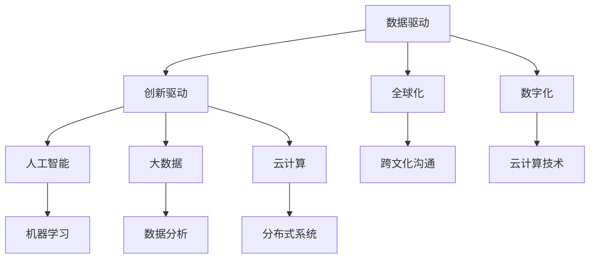

                 

# 程序员在知识经济时代的角色升级

> 关键词：知识经济、程序员、角色升级、技能需求、发展前景

> 摘要：本文旨在探讨知识经济时代下程序员角色的转变和升级，分析当前行业需求，阐述程序员在新技术浪潮中的核心技能和职业发展路径，为读者提供有价值的指导和建议。

## 1. 背景介绍

随着互联网技术的飞速发展，信息技术的普及程度不断提高，知识经济逐渐成为全球经济的主要驱动力。在这样一个背景下，程序员作为信息技术领域的核心人才，其角色也面临着巨大的变革。传统的程序员角色往往局限于编码和软件开发，而在知识经济时代，程序员需要具备更加多元化的技能，以适应快速变化的市场需求。

知识经济时代的特点包括：数据驱动、创新驱动、全球化、数字化等。这些特点要求程序员不仅要具备扎实的编程技能，还需要具备跨学科的知识储备和快速学习的能力。此外，随着人工智能、大数据、云计算等新兴技术的崛起，程序员的角色也在不断演变，从传统的软件开发者转变为数据科学家、架构师、AI工程师等。

## 2. 核心概念与联系

为了更好地理解知识经济时代程序员角色的升级，我们需要了解以下几个核心概念：

### 2.1 数据驱动

数据驱动是指以数据为基础进行决策和业务运营。在知识经济时代，数据成为企业的重要资产，程序员需要掌握数据采集、存储、处理和分析等技能，以帮助企业挖掘数据价值，实现业务增长。

### 2.2 创新驱动

创新驱动是指依靠技术创新推动企业发展。程序员需要不断学习新技术，敢于尝试和挑战，以推动企业技术创新和业务模式的变革。

### 2.3 全球化

全球化使得程序员的工作不再局限于本国市场，需要具备跨文化沟通能力和国际视野。程序员需要关注全球科技发展趋势，积极参与国际合作项目，提升自身竞争力。

### 2.4 数字化

数字化是指将传统业务模式转化为在线模式。程序员需要掌握云计算、大数据、物联网等数字化技术，为企业提供技术支持和解决方案。

### 2.5 人工智能、大数据、云计算

人工智能、大数据、云计算是知识经济时代的重要技术支撑。程序员需要掌握这些技术的核心原理和应用场景，为企业提供智能化的解决方案。

### 2.6 Mermaid 流程图

以下是一个简单的 Mermaid 流程图，展示了程序员在知识经济时代所需掌握的核心技能：



## 3. 核心算法原理 & 具体操作步骤

在知识经济时代，程序员需要掌握一系列核心算法原理，以应对复杂的应用场景。以下是一些常见的核心算法及其具体操作步骤：

### 3.1 快速排序算法

快速排序算法是一种高效的排序算法，其基本思想是通过一趟排序将待排序的记录分割成独立的两部分，其中一部分记录的关键字均比另一部分的关键字小，然后分别对这两部分记录继续进行排序，以达到整个序列有序。

具体操作步骤如下：

1. 选择一个基准元素作为基准（通常选择第一个或最后一个元素）。
2. 将所有比基准元素小的元素移到基准元素之前，所有比基准元素大的元素移到基准元素之后。
3. 递归地对基准元素之前和之后的子序列进行排序。

### 3.2 决策树算法

决策树算法是一种基于特征分割数据的监督学习算法，它通过一系列的测试来对数据进行分类或回归。决策树的基本原理是根据特征值对数据进行分割，每次分割都会减少数据的熵，最终形成一棵树。

具体操作步骤如下：

1. 选择一个最佳分割特征，使数据的熵最小。
2. 根据最佳分割特征，将数据集分为两个子集。
3. 对每个子集递归地执行步骤1和步骤2，直到满足停止条件（如最大树深度、最小节点数量等）。

### 3.3 朴素贝叶斯算法

朴素贝叶斯算法是一种基于概率理论的分类算法，它假设特征之间相互独立，根据先验概率和特征条件概率来计算后验概率，从而预测新数据的类别。

具体操作步骤如下：

1. 计算每个类别的先验概率。
2. 计算每个特征在各个类别中的条件概率。
3. 对于新数据，计算其在各个类别的后验概率。
4. 选择后验概率最大的类别作为预测结果。

## 4. 数学模型和公式 & 详细讲解 & 举例说明

在知识经济时代，程序员需要掌握一系列数学模型和公式，以应对复杂的业务场景。以下是一些常见的数学模型和公式及其详细讲解：

### 4.1 机器学习中的损失函数

损失函数是机器学习中评估模型性能的重要指标，它衡量模型预测值与真实值之间的差异。以下是一些常见的损失函数：

1. 均方误差（MSE）：$$MSE = \frac{1}{n}\sum_{i=1}^{n}(y_i - \hat{y}_i)^2$$
2. 交叉熵（Cross-Entropy）：$$H(y, \hat{y}) = -\sum_{i=1}^{n}y_i\log(\hat{y}_i)$$
3. Hinge损失（Hinge Loss）：$$L(\theta) = \max(0, 1 - y\theta^T x)$$

举例说明：

假设我们使用均方误差（MSE）来评估一个线性回归模型的性能，给定训练数据集{($x_1$, $y_1$), ($x_2$, $y_2$), ..., ($x_n$, $y_n$)}，模型预测值$\hat{y}_i = \theta_0 + \theta_1 x_i$。则模型的损失函数为：

$$MSE = \frac{1}{n}\sum_{i=1}^{n}(y_i - \hat{y}_i)^2 = \frac{1}{n}\sum_{i=1}^{n}(y_i - (\theta_0 + \theta_1 x_i))^2$$

### 4.2 神经网络中的激活函数

激活函数是神经网络中的一个重要组件，它决定了神经元的输出是否被激活。以下是一些常见的激活函数：

1. Sigmoid函数：$$\sigma(x) = \frac{1}{1 + e^{-x}}$$
2.ReLU函数：$$\text{ReLU}(x) = \max(0, x)$$
3. 双曲正切函数（Tanh函数）：$$\text{Tanh}(x) = \frac{e^{x} - e^{-x}}{e^{x} + e^{-x}}$$

举例说明：

假设我们使用ReLU函数作为神经网络的激活函数，给定输入值$x$，则ReLU函数的输出为：

$$\text{ReLU}(x) = \max(0, x)$$

### 4.3 支持向量机（SVM）中的核函数

核函数是支持向量机（SVM）中的一种关键技术，它将低维数据映射到高维空间，从而实现数据的线性可分。以下是一些常见的核函数：

1. 线性核函数：$$K(x, y) = \langle x, y \rangle$$
2. 多项式核函数：$$K(x, y) = (\gamma \langle x, y \rangle + 1)^d$$
3. 径向基函数（RBF）核函数：$$K(x, y) = \exp(-\gamma \Vert x - y \Vert^2)$$

举例说明：

假设我们使用RBF核函数来训练一个SVM分类器，给定训练数据集{($x_1$, $y_1$), ($x_2$, $y_2$), ..., ($x_n$, $y_n$)}，其中$y_i \in \{-1, +1\}$，则RBF核函数为：

$$K(x, y) = \exp(-\gamma \Vert x - y \Vert^2)$$

## 5. 项目实战：代码实际案例和详细解释说明

为了更好地理解知识经济时代程序员所需的核心技能，以下我们将通过一个实际项目案例，展示如何使用Python编程语言实现一个简单的机器学习模型，并详细解释其实现过程。

### 5.1 开发环境搭建

在开始项目之前，我们需要搭建一个Python开发环境。以下是搭建Python开发环境的基本步骤：

1. 安装Python：从[Python官网](https://www.python.org/downloads/)下载并安装Python 3.x版本。
2. 安装Jupyter Notebook：打开终端，执行以下命令安装Jupyter Notebook：

   ```bash
   pip install notebook
   ```

3. 启动Jupyter Notebook：打开终端，执行以下命令启动Jupyter Notebook：

   ```bash
   jupyter notebook
   ```

### 5.2 源代码详细实现和代码解读

以下是一个简单的机器学习项目案例，使用Python实现一个线性回归模型，用于预测房价。

```python
# 导入所需的库
import numpy as np
import matplotlib.pyplot as plt
from sklearn.linear_model import LinearRegression

# 生成模拟数据集
np.random.seed(0)
X = np.random.rand(100, 1)
y = 2 * X + 1 + np.random.randn(100, 1)

# 划分训练集和测试集
X_train, X_test, y_train, y_test = train_test_split(X, y, test_size=0.2, random_state=42)

# 创建线性回归模型
model = LinearRegression()

# 训练模型
model.fit(X_train, y_train)

# 预测测试集
y_pred = model.predict(X_test)

# 计算均方误差
mse = mean_squared_error(y_test, y_pred)
print("均方误差：", mse)

# 绘制真实值与预测值的散点图
plt.scatter(X_test, y_test, color='blue', label='真实值')
plt.plot(X_test, y_pred, color='red', linewidth=2, label='预测值')
plt.xlabel('X')
plt.ylabel('Y')
plt.legend()
plt.show()
```

### 5.3 代码解读与分析

在这个案例中，我们使用了Python的Scikit-learn库来实现一个简单的线性回归模型，用于预测房价。以下是代码的详细解读和分析：

1. **导入所需的库**：我们首先导入了NumPy库用于数据处理，Matplotlib库用于绘图，以及Scikit-learn库中的线性回归模型和评估指标。
2. **生成模拟数据集**：我们使用NumPy库生成一个包含100个样本的数据集，每个样本包含一个特征（$X$）和一个标签（$y$）。这里我们使用线性关系$y = 2x + 1$来生成数据，并加入了一些高斯噪声。
3. **划分训练集和测试集**：我们使用Scikit-learn库中的`train_test_split`函数将数据集划分为训练集和测试集，其中测试集占20%。
4. **创建线性回归模型**：我们创建了一个线性回归模型对象`model`。
5. **训练模型**：使用`model.fit`函数对训练集进行训练。
6. **预测测试集**：使用`model.predict`函数对测试集进行预测。
7. **计算均方误差**：使用Scikit-learn库中的`mean_squared_error`函数计算预测值与真实值之间的均方误差，评估模型的性能。
8. **绘制真实值与预测值的散点图**：使用Matplotlib库绘制测试集的真实值与预测值的散点图，直观地展示模型的预测效果。

## 6. 实际应用场景

在知识经济时代，程序员在各个行业都有广泛的应用场景。以下是一些典型的实际应用场景：

1. **金融行业**：程序员在金融行业主要应用于风险管理、量化交易、金融数据分析等领域。通过机器学习算法和大数据技术，程序员可以构建智能风控模型、预测市场趋势，为金融机构提供决策支持。
2. **医疗行业**：程序员在医疗行业主要应用于医学图像处理、疾病诊断、健康数据分析等领域。通过深度学习和大数据技术，程序员可以开发智能诊断系统，提高医疗诊断的准确性和效率。
3. **制造业**：程序员在制造业主要应用于智能制造、自动化控制、物联网等领域。通过工业互联网技术，程序员可以打造智能工厂，提高生产效率和质量。
4. **零售行业**：程序员在零售行业主要应用于商品推荐、库存管理、客户关系管理等领域。通过大数据和人工智能技术，程序员可以提升零售行业的运营效率和服务质量。
5. **教育行业**：程序员在教育行业主要应用于在线教育、智能教学、教育资源优化等领域。通过互联网技术和人工智能技术，程序员可以推动教育行业的创新和发展。

## 7. 工具和资源推荐

为了更好地适应知识经济时代的需求，程序员需要不断学习和掌握新的工具和资源。以下是一些建议的工具和资源：

### 7.1 学习资源推荐

1. **书籍**：
   - 《深度学习》（Deep Learning）—— Ian Goodfellow、Yoshua Bengio、Aaron Courville
   - 《Python编程：从入门到实践》（Python Crash Course）—— Eric Matthes
   - 《算法导论》（Introduction to Algorithms）—— Thomas H. Cormen、Charles E. Leiserson、Ronald L. Rivest、Clifford Stein
2. **论文**：
   - 《Learning to Rank for Information Retrieval》（信息检索中的学习排名）—— Thorsten Joachims
   - 《Convolutional Neural Networks for Visual Recognition》（卷积神经网络在视觉识别中的应用）—— Karen Simonyan、Andrew Zisserman
   - 《Large Scale Deep Learning: Models, Methods, and Techniques》（大规模深度学习：模型、方法和技术）—— Bengio、Courville、Vincent
3. **博客**：
   - [Python官方博客](https://www.python.org/blogs/)
   - [机器学习博客](https://machinelearningmastery.com/)
   - [深度学习博客](https://www.deeplearning.net/)
4. **网站**：
   - [GitHub](https://github.com/)
   - [Kaggle](https://www.kaggle.com/)
   - [Coursera](https://www.coursera.org/)

### 7.2 开发工具框架推荐

1. **开发工具**：
   - [Visual Studio Code](https://code.visualstudio.com/)
   - [PyCharm](https://www.jetbrains.com/pycharm/)
   - [Jupyter Notebook](https://jupyter.org/)
2. **框架**：
   - [Scikit-learn](https://scikit-learn.org/)
   - [TensorFlow](https://www.tensorflow.org/)
   - [PyTorch](https://pytorch.org/)
3. **数据库**：
   - [MySQL](https://www.mysql.com/)
   - [PostgreSQL](https://www.postgresql.org/)
   - [MongoDB](https://www.mongodb.com/)

### 7.3 相关论文著作推荐

1. **论文**：
   - 《A Few Useful Things to Know about Machine Learning》（机器学习的一些有用知识）—— Pedro Domingos
   - 《Deep Learning》（深度学习）—— Ian Goodfellow、Yoshua Bengio、Aaron Courville
   - 《The Hundred-Page Machine Learning Book》（100页机器学习书）—— Andriy Burkov
2. **著作**：
   - 《Python编程：从入门到实践》—— Eric Matthes
   - 《算法导论》—— Thomas H. Cormen、Charles E. Leiserson、Ronald L. Rivest、Clifford Stein
   - 《人工智能：一种现代的方法》—— Stuart Russell、Peter Norvig

## 8. 总结：未来发展趋势与挑战

在知识经济时代，程序员的角色正经历着前所未有的变革。随着新兴技术的不断涌现，程序员需要不断学习和适应新的技术和工具，以提升自身竞争力。未来，程序员的发展趋势将主要体现在以下几个方面：

1. **跨学科融合**：程序员需要具备跨学科的知识储备，如数学、统计学、物理学等，以应对复杂的应用场景。
2. **敏捷开发和持续交付**：随着敏捷开发和持续交付理念的普及，程序员需要掌握敏捷开发方法和工具，以提高开发效率和代码质量。
3. **人工智能和大数据技术的应用**：程序员需要掌握人工智能和大数据技术，以解决现实世界的复杂问题，提升业务价值。
4. **开源社区参与**：程序员需要积极参与开源社区，贡献代码和知识，提升自身影响力。

然而，知识经济时代也带来了新的挑战。首先，程序员需要不断学习新的技术和工具，以适应快速变化的市场需求。其次，程序员需要具备良好的团队协作和沟通能力，以应对复杂的团队项目和跨学科合作。此外，程序员还需要关注数据隐私和安全问题，确保在开发过程中遵守相关法律法规。

## 9. 附录：常见问题与解答

### 9.1 如何选择合适的编程语言？

选择编程语言主要取决于项目需求和个人兴趣。以下是几种常见编程语言的适用场景：

1. **Python**：适合数据分析、机器学习、Web开发等领域。
2. **Java**：适合企业级应用、Android开发等领域。
3. **C++**：适合高性能计算、游戏开发等领域。
4. **JavaScript**：适合前端开发、Web应用等领域。

### 9.2 如何提升编程能力？

以下是一些建议来提升编程能力：

1. **多编程实践**：通过实际项目来提升编程技能。
2. **阅读优秀代码**：阅读他人编写的代码，学习优秀的设计模式和编程技巧。
3. **参与开源项目**：参与开源项目，与他人合作，提升团队协作和解决问题的能力。
4. **学习算法和数据结构**：掌握算法和数据结构，提高代码效率和性能。
5. **阅读相关书籍和论文**：学习编程领域的最新技术和趋势。

## 10. 扩展阅读 & 参考资料

以下是一些建议的扩展阅读和参考资料，以帮助读者深入了解知识经济时代程序员的角色升级：

1. **扩展阅读**：
   - 《人工智能：一种现代的方法》—— Stuart Russell、Peter Norvig
   - 《深度学习》（深度学习）—— Ian Goodfellow、Yoshua Bengio、Aaron Courville
   - 《大数据时代：思维变革与商业价值》（Big Data: A Revolution That Will Transform How We Live, Work, and Think）—— Viktor Mayer-Schoenberger、Kenneth Cukier
2. **参考资料**：
   - [Scikit-learn官方文档](https://scikit-learn.org/)
   - [TensorFlow官方文档](https://www.tensorflow.org/)
   - [PyTorch官方文档](https://pytorch.org/)
   - [GitHub](https://github.com/)
   - [Kaggle](https://www.kaggle.com/)

### 作者

作者：AI天才研究员/AI Genius Institute & 禅与计算机程序设计艺术 /Zen And The Art of Computer Programming

