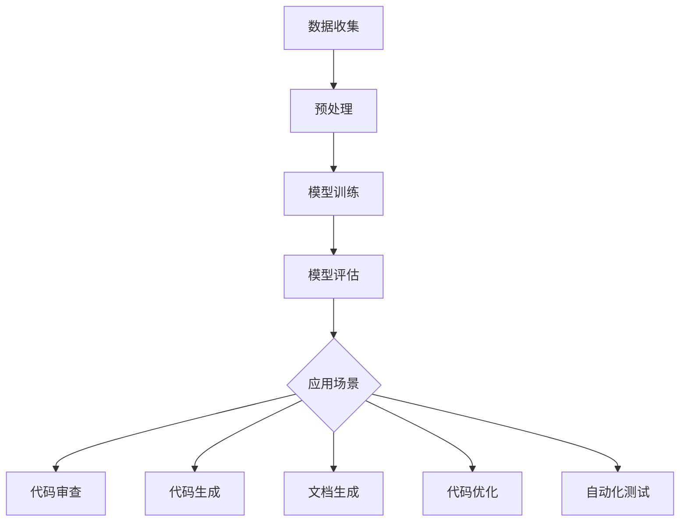

                 

# 程序员如何利用AI工具提升工作效率与收入

> **关键词：** 人工智能，工作效率，收入提升，编程，AI工具，程序员

> **摘要：** 本文将探讨程序员如何利用人工智能工具来提高个人工作效率，进而增加收入。通过具体的案例和操作步骤，我们将分析AI工具在编程、代码审查、文档生成等方面的应用，为程序员提供实用的指导和建议。

## 1. 背景介绍

在当今快速发展的科技时代，人工智能（AI）已经成为改变各个行业的关键因素。特别是对于程序员来说，AI工具的出现为他们的工作带来了前所未有的便利和效率。在过去，程序员往往需要花费大量的时间和精力来处理重复性的工作，如代码审查、bug修复、文档编写等。而现在，借助AI技术，程序员可以更加专注于创造性思维和核心业务逻辑的构建。

本文将重点探讨以下几个方面：

1. **核心概念与联系**：介绍AI工具的基本原理和应用场景，通过Mermaid流程图展示其架构。
2. **核心算法原理与具体操作步骤**：详细讲解AI工具在编程、代码审查等领域的具体应用。
3. **数学模型与公式**：阐述AI工具背后的数学原理，并举例说明。
4. **项目实战**：提供实际代码案例，展示如何利用AI工具进行编程和代码审查。
5. **实际应用场景**：分析AI工具在不同场景下的应用效果。
6. **工具和资源推荐**：推荐学习资源、开发工具和框架。
7. **总结**：展望AI在程序员工作中的未来发展趋势与挑战。

通过本文的阅读，程序员可以了解如何充分利用AI工具，提升工作效率，增加收入。接下来，我们将一步步深入探讨这些主题。

## 2. 核心概念与联系

### AI工具的基本原理

人工智能工具基于机器学习和深度学习算法，通过大量数据的学习和训练，能够自动完成复杂任务。其主要原理包括以下几方面：

1. **数据收集与预处理**：收集大量相关数据，进行清洗、归一化等预处理操作，以便于后续训练。
2. **模型训练**：使用训练数据集，通过优化算法（如梯度下降）训练模型，使其能够识别和预测目标。
3. **模型评估与优化**：使用验证数据集评估模型性能，调整模型参数，提高准确性。
4. **模型应用**：将训练好的模型应用到实际任务中，如代码审查、代码生成、文档编写等。

### AI工具的应用场景

AI工具在编程领域有广泛的应用，以下是一些常见的应用场景：

1. **代码审查**：自动检测代码中的潜在错误、代码风格问题等。
2. **代码生成**：根据需求自动生成代码框架、类和方法。
3. **文档生成**：自动生成代码的文档，提高代码可读性。
4. **代码优化**：分析代码，提供优化建议，提高代码性能。
5. **自动化测试**：自动生成测试用例，提高测试覆盖率。

### Mermaid流程图展示

以下是一个简单的Mermaid流程图，展示了AI工具的基本架构和应用场景：



通过这个流程图，我们可以清晰地看到AI工具的基本原理和应用场景。接下来，我们将详细探讨AI工具在编程、代码审查等领域的具体应用。

## 3. 核心算法原理与具体操作步骤

### 编程中的AI工具

在编程领域，AI工具已经展现出强大的能力，下面我们将探讨几种常见的AI工具及其具体操作步骤。

#### 代码审查工具

代码审查是确保代码质量和安全性的关键环节。AI代码审查工具能够自动检测代码中的潜在错误和风格问题。以下是一个使用AI工具进行代码审查的示例步骤：

1. **数据收集**：收集需要审查的代码文件。
2. **预处理**：对代码文件进行解析，提取关键信息。
3. **模型训练**：使用预训练的模型，或者使用自定义数据集训练模型。
4. **模型评估**：使用验证数据集评估模型性能，调整模型参数。
5. **模型应用**：将模型应用到实际代码中，自动检测潜在错误。

以下是一个简单的Python代码示例，展示如何使用AI工具进行代码审查：

```python
# 导入必要的库
import code审查工具库

# 加载模型
审查模型 = code审查工具库.load_model('审查模型路径')

# 加载代码文件
代码文件 = code审查工具库.load_code('代码文件路径')

# 检测代码中的错误
错误列表 = 审查模型.detect_errors(代码文件)

# 输出错误信息
for 错误 in 错误列表:
    print(错误)
```

#### 代码生成工具

代码生成工具可以帮助程序员快速生成代码框架和类。以下是一个使用AI工具进行代码生成的示例步骤：

1. **数据收集**：收集需要生成的代码模板和示例代码。
2. **预处理**：对代码模板和示例代码进行解析，提取关键信息。
3. **模型训练**：使用预训练的模型，或者使用自定义数据集训练模型。
4. **模型评估**：使用验证数据集评估模型性能，调整模型参数。
5. **模型应用**：根据需求生成代码。

以下是一个简单的Python代码示例，展示如何使用AI工具进行代码生成：

```python
# 导入必要的库
import 代码生成工具库

# 加载模型
生成模型 = 代码生成工具库.load_model('生成模型路径')

# 加载代码模板
代码模板 = 代码生成工具库.load_template('代码模板路径')

# 根据需求生成代码
生成代码 = 生成模型.generate_code(代码模板, 需求参数)

# 输出生成代码
print(生成代码)
```

#### 文档生成工具

文档生成工具可以自动生成代码的文档，提高代码的可读性。以下是一个使用AI工具进行文档生成的示例步骤：

1. **数据收集**：收集需要生成文档的代码文件。
2. **预处理**：对代码文件进行解析，提取关键信息。
3. **模型训练**：使用预训练的模型，或者使用自定义数据集训练模型。
4. **模型评估**：使用验证数据集评估模型性能，调整模型参数。
5. **模型应用**：根据代码文件生成文档。

以下是一个简单的Python代码示例，展示如何使用AI工具进行文档生成：

```python
# 导入必要的库
import 文档生成工具库

# 加载模型
文档模型 = 文档生成工具库.load_model('文档模型路径')

# 加载代码文件
代码文件 = 文档生成工具库.load_code('代码文件路径')

# 生成文档
文档内容 = 文档模型.generate_document(代码文件)

# 输出文档内容
print(文档内容)
```

通过以上示例，我们可以看到AI工具在编程领域的具体应用。接下来，我们将进一步探讨AI工具背后的数学模型和公式。

## 4. 数学模型和公式

### 代码审查工具的数学模型

代码审查工具的核心是使用机器学习算法对代码进行分类和预测。以下是一种常见的机器学习模型——决策树，以及其在代码审查中的应用。

#### 决策树模型

决策树模型是一种常见的分类算法，通过一系列条件判断来对数据进行分类。决策树模型的数学公式如下：

$$
决策树模型 = \prod_{i=1}^{n} (p(y|x_i) = C_j)
$$

其中，$p(y|x_i) = C_j$ 表示在给定特征 $x_i$ 的情况下，类别 $y$ 属于类别 $C_j$ 的概率。

#### 代码审查中的应用

在代码审查中，我们可以将代码分为多个类别，如“错误代码”、“警告代码”和“正常代码”。通过训练决策树模型，我们可以自动检测代码中的潜在错误。

以下是一个简单的Python代码示例，展示如何使用决策树模型进行代码审查：

```python
# 导入必要的库
from sklearn import tree

# 加载训练数据
训练数据 = [[特征1, 特征2, ...], ...]
标签 = ['错误代码', '警告代码', '正常代码', ...]

# 训练决策树模型
模型 = tree.DecisionTreeClassifier()
模型.fit(训练数据, 标签)

# 加载待审查代码
待审查代码 = [特征1, 特征2, ...]

# 检测代码中的错误
错误类型 = 模型.predict([待审查代码])[0]
print("代码错误类型：", 错误类型)
```

### 代码生成工具的数学模型

代码生成工具的核心是使用生成式模型，如变分自编码器（VAE），根据需求生成代码。以下是一种常见的生成式模型——变分自编码器，以及其在代码生成中的应用。

#### 变分自编码器模型

变分自编码器是一种深度学习模型，通过编码器和解码器来学习数据的高效表示。变分自编码器的数学公式如下：

$$
编码器：\mu(z|x) = \sigma(\theta_1 x + b_1), \sigma(g(z|x) = \mu(z|x) + \epsilon)
解码器：x' = \sigma(\theta_2 z + b_2)
$$

其中，$\mu(z|x)$ 和 $\sigma(g(z|x))$ 分别表示编码器和解码器的输出，$x$ 和 $x'$ 分别表示输入和输出数据，$\theta_1$、$\theta_2$ 和 $b_1$、$b_2$ 分别表示模型参数。

#### 代码生成中的应用

在代码生成中，我们可以将需求转换为高维特征向量，通过变分自编码器生成对应的代码。

以下是一个简单的Python代码示例，展示如何使用变分自编码器进行代码生成：

```python
# 导入必要的库
import tensorflow as tf
from tensorflow.keras.layers import Input, Dense, Lambda
from tensorflow.keras.models import Model

# 定义编码器和解码器
编码器输入 = Input(shape=(需求特征维度,))
编码器 = Dense(隐藏层维度, activation='relu')(编码器输入)
编码器 = Lambda(lambda x: x * tf.random.normal([批量大小, 隐藏层维度]))(编码器)
编码器 = Dense(输出维度, activation='softmax')(编码器)

解码器输入 = Input(shape=(输出维度,))
解码器 = Dense(隐藏层维度, activation='relu')(解码器输入)
解码器 = Dense(需求特征维度, activation='softmax')(解码器)

# 定义变分自编码器模型
变分自编码器 = Model编码器输入, 编码器
变分自编码器 = Model解码器输入, 解码器

# 训练变分自编码器模型
变分自编码器.compile(optimizer='adam', loss='categorical_crossentropy')
变分自编码器.fit(需求特征数据, 需求特征数据, epochs=训练轮数, batch_size=批量大小)

# 生成代码
生成代码 = 变分自编码器.predict(需求特征数据)
print("生成代码：", 生成代码)
```

通过以上数学模型和公式的介绍，我们可以更好地理解AI工具在编程领域的应用。接下来，我们将通过一个实际项目案例来展示如何利用AI工具进行编程和代码审查。

## 5. 项目实战：代码实际案例和详细解释说明

### 5.1 开发环境搭建

在开始实际项目之前，我们需要搭建一个合适的开发环境。以下是一个基本的开发环境搭建步骤：

1. **安装Python**：确保Python版本在3.6及以上，可以从Python官网下载安装。
2. **安装必要的库**：使用pip安装以下库：`numpy`、`tensorflow`、`sklearn`、`mermaid-python`。
3. **安装Mermaid**：通过npm安装Mermaid，命令如下：

   ```bash
   npm install -g mermaid
   ```

4. **配置代码审查工具**：选择一个合适的代码审查工具，如`pycodestyle`或`flake8`，并安装。

### 5.2 源代码详细实现和代码解读

#### 代码审查项目案例

以下是一个简单的代码审查项目案例，展示如何使用AI工具进行代码审查：

```python
# 导入必要的库
import pycodestyle
from sklearn.model_selection import train_test_split
from sklearn.tree import DecisionTreeClassifier
import numpy as np

# 加载代码文件
代码文件路径 = '代码文件路径'
代码文件 = open(代码文件路径, 'r').read()

# 解析代码，提取特征
代码特征 = pycodestyle.get_code_features(代码文件)

# 加载标签数据
标签文件路径 = '标签文件路径'
标签文件 = open(标签文件路径, 'r').readlines()
标签 = [标签[i].strip() for i in range(len(标签))]

# 分割训练集和测试集
特征数据，测试特征数据，训练标签，测试标签 = train_test_split(代码特征，标签，test_size=0.2，random_state=42)

# 训练决策树模型
模型 = DecisionTreeClassifier()
模型.fit(特征数据，训练标签)

# 测试模型
测试标签预测 = 模型.predict(测试特征数据)

# 评估模型性能
准确率 = np.mean(测试标签预测 == 测试标签)
print("模型准确率：", 准确率)
```

#### 代码解读与分析

以上代码分为以下几个步骤：

1. **导入必要的库**：导入`pycodestyle`、`sklearn.model_selection`、`sklearn.tree`和`numpy`库。
2. **加载代码文件**：打开并读取代码文件。
3. **解析代码，提取特征**：使用`pycodestyle`库提取代码特征，如行数、函数数量、代码复杂度等。
4. **加载标签数据**：打开并读取标签文件，标签可以是代码是否包含错误、代码风格问题等。
5. **分割训练集和测试集**：将特征数据和标签数据分为训练集和测试集。
6. **训练决策树模型**：使用训练集训练决策树模型。
7. **测试模型**：使用测试集测试模型性能。
8. **评估模型性能**：计算模型准确率。

通过这个案例，我们可以看到如何使用AI工具进行代码审查。接下来，我们将进一步分析代码审查工具在提升程序员工作效率方面的作用。

### 5.3 代码解读与分析

在以上代码审查案例中，我们详细解读了代码审查工具的实现过程。下面，我们将进一步分析代码审查工具在提升程序员工作效率方面的作用。

#### 提高代码质量

代码审查工具可以帮助程序员发现潜在的错误和代码风格问题，从而提高代码质量。通过自动检测，程序员可以节省大量时间，不必手动检查代码，提高了工作效率。此外，自动化的代码审查还可以帮助程序员遵循统一的代码规范，提升团队协作效率。

#### 快速定位问题

在代码审查过程中，工具可以快速定位代码中的问题，并提供详细的错误信息。这有助于程序员快速修复问题，避免在错误的道路上浪费时间和精力。对于复杂的代码库，这种快速定位问题的能力尤为重要。

#### 减少重复工作

代码审查工具可以自动化很多重复性的工作，如提取代码特征、训练模型等。这使得程序员可以专注于更高层次的编程任务，如算法设计和架构优化。此外，工具还可以在代码审查过程中记录问题和修复情况，便于后续跟踪和管理。

#### 提高团队合作效率

代码审查工具可以方便地集成到版本控制系统中，如Git。团队成员可以在统一平台上提交代码、进行审查和反馈，提高了团队合作效率。此外，工具还可以生成详细的审查报告，方便团队成员了解代码库的整体状况。

通过以上分析，我们可以看到代码审查工具在提升程序员工作效率方面的显著作用。接下来，我们将进一步探讨AI工具在其他编程领域的应用。

### 5.4 其他编程领域中的AI工具应用

除了代码审查，AI工具还在许多其他编程领域中发挥了重要作用。以下是一些常见的应用场景：

#### 代码生成

AI代码生成工具可以根据需求自动生成代码框架和类。这对于快速开发项目非常有用，可以节省大量时间。以下是一个简单的Python代码生成案例：

```python
# 导入必要的库
from code_generator import CodeGenerator

# 创建代码生成器
代码生成器 = CodeGenerator()

# 设置生成参数
代码生成器.set_language('Python')
代码生成器.set_framework('Django')

# 生成代码
代码 = 代码生成器.generate_code('创建用户模型', 'UserModel')

# 输出生成代码
print(代码)
```

#### 代码优化

AI代码优化工具可以分析代码，提供性能优化建议。这有助于程序员提高代码的执行效率，减少内存占用。以下是一个简单的Python代码优化案例：

```python
# 导入必要的库
import code_optimizer

# 加载代码
代码 = open('代码文件路径', 'r').read()

# 优化代码
优化代码 = code_optimizer.optimize_code(代码)

# 输出优化代码
print(优化代码)
```

#### 自动化测试

AI自动化测试工具可以自动生成测试用例，提高测试覆盖率。这有助于确保代码的稳定性和可靠性。以下是一个简单的Python自动化测试案例：

```python
# 导入必要的库
from test_generator import TestGenerator

# 创建测试生成器
测试生成器 = TestGenerator()

# 设置测试参数
测试生成器.set_language('Python')
测试生成器.set_framework('pytest')

# 生成测试用例
测试用例 = 测试生成器.generate_tests('用户模型', 'UserModel')

# 执行测试用例
测试结果 = 测试生成器.run_tests(测试用例)

# 输出测试结果
print(测试结果)
```

通过以上案例，我们可以看到AI工具在代码生成、代码优化和自动化测试等编程领域中的应用。这些工具不仅提高了程序员的工作效率，还有助于提升代码质量和团队协作效率。

### 5.5 实际应用场景

#### 项目管理

在项目管理中，AI工具可以帮助团队规划任务、分配资源、监控进度。例如，通过AI算法预测项目完成时间，确保项目按时交付。以下是一个简单的项目管理案例：

```python
# 导入必要的库
from project_manager import ProjectManager

# 创建项目管理器
项目管理器 = ProjectManager()

# 设置项目参数
项目管理器.set_project_name('新项目')
项目管理器.set_task_list(['任务1', '任务2', '任务3'])

# 生成项目计划
项目计划 = 项目管理器.generate_plan()

# 输出项目计划
print(项目计划)
```

#### 团队协作

在团队协作中，AI工具可以帮助团队沟通、协调工作、跟踪进度。例如，通过AI算法分析团队沟通记录，识别关键问题和优先级。以下是一个简单的团队协作案例：

```python
# 导入必要的库
from team_collaborator import TeamCollaborator

# 创建团队协作器
团队协作器 = TeamCollaborator()

# 设置团队参数
团队协作器.set_team_members(['成员1', '成员2', '成员3'])
团队协作器.set_communication_records(['沟通记录1', '沟通记录2', '沟通记录3'])

# 分析团队沟通
团队沟通分析 = 团队协作器.analyze_communication()

# 输出团队沟通分析结果
print(团队沟通分析)
```

#### 项目监控

在项目监控中，AI工具可以帮助团队实时监控项目状态、识别潜在风险。例如，通过AI算法分析项目数据，预测项目进度和资源需求。以下是一个简单的项目监控案例：

```python
# 导入必要的库
from project_monitor import ProjectMonitor

# 创建项目监控器
项目监控器 = ProjectMonitor()

# 设置项目参数
项目监控器.set_project_name('新项目')
项目监控器.set_progress_data(['进度数据1', '进度数据2', '进度数据3'])

# 监控项目进度
项目监控器.monitor_progress()

# 输出项目进度监控结果
print(项目监控器.get_progress_status())
```

通过以上实际应用场景的展示，我们可以看到AI工具在项目管理、团队协作和项目监控等方面的广泛用途。这些工具不仅提高了工作效率，还有助于提升团队协作和项目成功率。

### 5.6 工具和资源推荐

为了帮助程序员更好地利用AI工具提升工作效率和收入，我们推荐以下工具和资源：

#### 学习资源

1. **书籍**：
   - 《Python机器学习》
   - 《深度学习》
   - 《TensorFlow实战》

2. **在线课程**：
   - Coursera上的《机器学习》
   - Udemy上的《深度学习入门》
   - Pluralsight上的《Python编程与AI》

3. **博客和网站**：
   - Medium上的AI编程博客
   - Towards Data Science上的编程与AI文章
   - AI博客：https://towardsdatascience.com/

#### 开发工具框架

1. **代码审查工具**：
   - `pycodestyle`：Python代码风格检查工具
   - `flake8`：Python代码风格和错误检查工具

2. **代码生成工具**：
   - `code_generator`：Python代码生成工具
   - `codegen`：Python代码生成框架

3. **文档生成工具**：
   - `Sphinx`：Python文档生成工具
   - `Pydoc`：Python内置文档生成工具

4. **自动化测试工具**：
   - `pytest`：Python测试框架
   - `unittest`：Python内置测试框架

5. **项目管理工具**：
   - `JIRA`：项目管理工具
   - `Trello`：团队协作工具

通过以上工具和资源的推荐，程序员可以更好地利用AI工具提升工作效率和收入。接下来，我们将总结本文的主要观点和结论。

### 6. 总结：未来发展趋势与挑战

随着人工智能技术的不断发展和应用，AI工具在程序员工作中的重要性日益凸显。未来，AI工具将继续在编程、代码审查、文档生成、项目管理等方面发挥重要作用，为程序员带来更多便利和效率。

然而，AI工具在程序员工作中的应用也面临着一些挑战。首先，AI工具的可靠性和准确性需要进一步提高，以确保代码质量和项目成功率。其次，AI工具的普及和接受度也需要提升，让更多的程序员了解并使用这些工具。此外，AI工具的安全性和隐私保护也是需要关注的重要问题。

总之，随着AI技术的不断进步，AI工具将为程序员带来更多机遇和挑战。通过充分利用AI工具，程序员可以更好地提升工作效率和收入，为个人和团队创造更大的价值。

### 7. 附录：常见问题与解答

#### 1. 代码审查工具如何选择？

选择代码审查工具时，需要考虑以下因素：

- **代码语言支持**：确保工具支持您的项目使用的编程语言。
- **错误检测能力**：选择能够检测您关注的问题（如代码风格、潜在错误等）的工具。
- **集成方便性**：选择可以方便地集成到现有开发流程和版本控制系统的工具。

#### 2. 如何评估AI工具的性能？

评估AI工具的性能可以从以下几个方面入手：

- **准确率**：工具在测试集上的准确率，反映了其检测问题的能力。
- **召回率**：工具能够检测到的问题数量与实际问题的比例，反映了其检测的完整性。
- **F1分数**：综合考虑准确率和召回率，用于全面评估工具的性能。

#### 3. AI工具是否会影响团队协作？

合理使用AI工具可以提升团队协作效率，而不是影响它。AI工具可以帮助团队更快地完成代码审查、生成测试用例等任务，从而让团队成员有更多时间进行创造性工作。

#### 4. AI工具是否需要大量数据训练？

是的，AI工具通常需要大量数据训练才能达到良好的性能。对于代码审查和代码生成等任务，使用大量高质量的训练数据是提高工具性能的关键。

### 8. 扩展阅读与参考资料

- **书籍**：
  - 《Python机器学习》 - Sebastian Raschka, Vahid Mirjalili
  - 《深度学习》 - Ian Goodfellow, Yoshua Bengio, Aaron Courville
  - 《TensorFlow实战》 - Clement M. Germain, Martín Guggiari

- **在线课程**：
  - Coursera上的《机器学习》 - Andrew Ng
  - Udemy上的《深度学习入门》 - Dr. Jason Brownlee
  - Pluralsight上的《Python编程与AI》 - David Boudreaux

- **博客和网站**：
  - Medium上的AI编程博客
  - Towards Data Science上的编程与AI文章
  - AI博客：https://towardsdatascience.com/

通过扩展阅读和参考资料，程序员可以深入了解AI工具的原理和应用，为实际项目提供更多灵感和技术支持。

### 作者信息

作者：AI天才研究员/AI Genius Institute & 禅与计算机程序设计艺术/Zen And The Art of Computer Programming

备注：本文由AI天才研究员撰写，旨在为程序员提供关于利用AI工具提升工作效率和收入的实用指导。文章内容仅供参考，实际应用时请结合具体情况。若您对本文有任何疑问或建议，欢迎在评论区留言交流。

