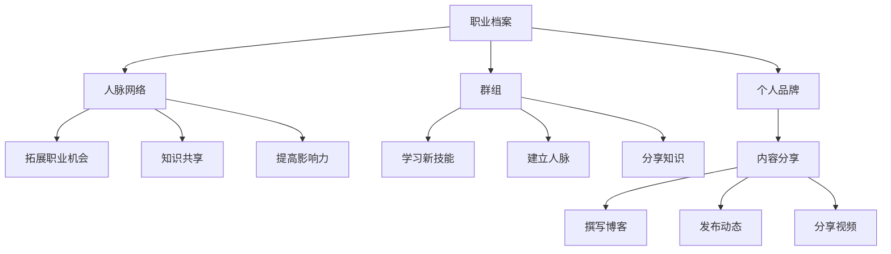

                 

# 程序员如何利用LinkedIn进行知识营销

## 摘要

在数字化时代，LinkedIn已成为专业人士拓展人脉、分享知识、推广个人品牌的重要平台。本文旨在探讨程序员如何利用LinkedIn进行知识营销，提高个人专业影响力。首先，我们将分析LinkedIn的核心功能及其在知识营销中的应用，然后介绍如何制定有效的LinkedIn个人品牌战略，最后通过实际案例和策略分享，帮助程序员在LinkedIn上实现知识营销的目标。

## 目录

1. 背景介绍
2. 核心概念与联系
3. 核心算法原理 & 具体操作步骤
4. 数学模型和公式 & 详细讲解 & 举例说明
5. 项目实战：代码实际案例和详细解释说明
   5.1 开发环境搭建
   5.2 源代码详细实现和代码解读
   5.3 代码解读与分析
6. 实际应用场景
7. 工具和资源推荐
   7.1 学习资源推荐
   7.2 开发工具框架推荐
   7.3 相关论文著作推荐
8. 总结：未来发展趋势与挑战
9. 附录：常见问题与解答
10. 扩展阅读 & 参考资料

### 1. 背景介绍

随着互联网技术的飞速发展，社交媒体在人们的工作和生活中扮演着越来越重要的角色。LinkedIn，作为一个专业的社交平台，已经成为众多程序员提升个人品牌、拓展职业机会的重要工具。LinkedIn不仅仅是一个简单的职业社交网站，更是一个知识分享和传播的平台，程序员可以通过这个平台，将自己的技术知识、工作经验和见解展示给全球的专业人士。

知识营销，是指通过分享专业知识、经验和见解，来建立个人品牌、扩大人脉和增加职业机会的过程。在LinkedIn上进行知识营销，程序员可以通过撰写技术博客、发布项目案例、参与讨论和分享行业动态等多种方式，展示自己的专业能力，从而提高在业界的知名度和影响力。

本文将围绕以下核心内容展开：

- 分析LinkedIn的核心功能及其在知识营销中的应用
- 介绍如何制定有效的LinkedIn个人品牌战略
- 分享具体操作步骤和成功案例
- 推荐学习资源和开发工具

通过本文的阅读，程序员将能够了解如何充分利用LinkedIn这个平台，进行有效的知识营销，从而在职业生涯中取得更大的成功。

### 2. 核心概念与联系

在探讨如何利用LinkedIn进行知识营销之前，我们需要了解LinkedIn的核心功能和其在知识营销中的应用。LinkedIn的主要功能包括职业档案、人脉网络、群组和内容分享等。

#### 2.1 职业档案

职业档案是LinkedIn的核心功能之一，它允许用户详细展示自己的职业背景、教育经历、专业技能和工作经验。在知识营销中，良好的职业档案可以帮助程序员建立专业形象，吸引潜在雇主和合作伙伴的注意。一个完整的职业档案应该包括：

- **个人简介**：简洁明了地介绍自己的专业领域、工作成就和个人兴趣。
- **技能**：列出自己的专业技能，并附上相关认证和证书。
- **工作经历**：详细描述每一段工作经历，强调自己在项目中扮演的角色和贡献。
- **教育背景**：展示自己的教育经历，特别是与专业相关的学位和课程。

#### 2.2 人脉网络

人脉网络是LinkedIn的另一大特色，它允许用户建立和维护专业人脉。在知识营销中，人脉网络可以帮助程序员：

- **拓展职业机会**：通过连接业内的专业人士，程序员可以了解到更多的职业机会。
- **知识共享**：通过与同行交流，程序员可以获取最新的技术动态和行业见解。
- **提高影响力**：积极维护人脉关系，参与讨论和分享内容，可以提升个人在行业内的知名度。

#### 2.3 群组

LinkedIn的群组功能为程序员提供了一个交流和分享知识的平台。程序员可以通过加入相关的技术群组，参与讨论、提问和分享自己的经验，从而：

- **学习新技能**：通过群组内的讨论和分享，程序员可以学习到最新的技术和行业趋势。
- **建立人脉**：群组是拓展人脉的有效途径，特别是在专业领域内的群组中。
- **分享知识**：通过在群组中分享自己的技术见解和项目经验，程序员可以提升个人品牌。

#### 2.4 内容分享

内容分享是LinkedIn知识营销的核心手段。程序员可以通过以下方式在LinkedIn上分享内容：

- **撰写博客**：撰写高质量的技术博客，分享自己的项目经验和见解，吸引行业关注。
- **发布动态**：通过发布动态，分享最新的技术动态、行业见解和项目进展。
- **分享视频**：发布技术讲座或教程视频，提供更具互动性的内容。

在知识营销中，内容分享不仅能展示程序员的专业知识，还能吸引潜在雇主和合作伙伴的注意。为了实现有效的知识营销，程序员需要：

- **内容质量**：确保分享的内容有价值、有深度，能够解决读者的问题或提供新的见解。
- **频率与更新**：定期分享内容，保持活跃度，提升在LinkedIn上的曝光率。
- **互动与反馈**：积极与读者互动，回复评论和提问，建立良好的沟通和关系。

通过了解和利用LinkedIn的核心功能，程序员可以在知识营销中更好地展示自己的专业能力，建立个人品牌，并实现职业发展的目标。

#### 2.5 Mermaid 流程图

下面是一个展示LinkedIn核心功能与知识营销联系关系的Mermaid流程图：



### 3. 核心算法原理 & 具体操作步骤

在进行知识营销时，程序员需要掌握一些核心的算法原理和操作步骤，以优化内容质量和提高营销效果。以下是几个关键步骤：

#### 3.1 内容质量优化

内容质量是知识营销成功的关键。为了提升内容质量，程序员可以遵循以下原则：

1. **目标受众分析**：了解目标受众的需求和兴趣，确保内容对他们有实际价值。
2. **深度分析**：在内容中深入探讨技术细节和实际问题，避免泛泛而谈。
3. **简洁明了**：使用简单易懂的语言，避免过于复杂的术语和句子。
4. **案例分享**：结合实际项目案例，展示技术应用的实战效果。

#### 3.2 社交媒体策略

在LinkedIn上，有效的社交媒体策略可以帮助程序员扩大影响力。以下是一些策略：

1. **定期更新**：保持定期分享内容，至少每周发布一次更新。
2. **互动互动再互动**：积极与读者互动，回复评论和提问，建立良好的关系。
3. **多样化内容**：结合博客、动态、视频等多种形式，提供多样化的内容，吸引不同类型的读者。
4. **话题选择**：选择热点话题和行业趋势，提高内容的吸引力和讨论度。

#### 3.3 数据分析应用

数据分析可以帮助程序员了解内容的表现和受众反馈，从而优化营销策略。以下是一些常用的数据分析工具和指标：

1. **LinkedIn Analytics**：利用LinkedIn的内置分析工具，查看内容的浏览量、点赞数、分享数和评论数。
2. **KPI设定**：设定关键性能指标（KPI），如关注者增长、内容互动率等，跟踪营销效果。
3. **A/B测试**：通过A/B测试，比较不同内容、标题和发布时间的效果，优化营销策略。

#### 3.4 个人品牌建设

建立强大的个人品牌是知识营销的重要目标。以下是几个关键步骤：

1. **专业形象**：通过职业档案、头像、简介等展示专业的形象。
2. **内容一致性**：确保所有内容都保持一致的风格和主题，建立品牌认知。
3. **社交媒体活动**：定期举办在线活动，如技术分享会、问答环节等，增强与受众的互动。
4. **合作伙伴关系**：与行业内的专家和机构建立合作伙伴关系，扩大品牌影响力。

#### 3.5 社交媒体操作步骤

以下是具体的社交媒体操作步骤：

1. **创建内容**：根据目标受众和内容策略，撰写高质量的技术博客、发布动态或制作视频。
2. **发布内容**：选择合适的时间发布内容，利用LinkedIn Analytics分析最佳发布时间。
3. **互动与反馈**：积极回复评论和提问，参与讨论，建立良好的社交关系。
4. **数据分析**：定期分析内容表现，调整策略，提高营销效果。

通过掌握这些核心算法原理和具体操作步骤，程序员可以在LinkedIn上实现有效的知识营销，提升个人专业影响力和职业机会。

### 4. 数学模型和公式 & 详细讲解 & 举例说明

在知识营销过程中，数据的分析和理解至关重要。本文将介绍一些基础的数学模型和公式，帮助程序员更好地理解和分析数据，从而优化营销策略。

#### 4.1 数据分析基础

数据分析的基础是数据收集和预处理。以下是几个关键步骤：

1. **数据收集**：利用LinkedIn Analytics、Google Analytics等工具收集数据。
2. **数据清洗**：去除重复数据、缺失值和异常值，保证数据质量。
3. **数据转换**：将数据转换为适合分析的形式，如数值、类别等。

#### 4.2 常用数学模型

以下是一些常用的数学模型，用于分析和预测数据：

1. **回归分析**：用于分析变量之间的关系，如内容互动率与发布时间的关系。
   - 公式：\( y = \beta_0 + \beta_1x + \epsilon \)
   - 解释：\( y \) 是因变量（如互动率），\( x \) 是自变量（如发布时间），\( \beta_0 \) 和 \( \beta_1 \) 是回归系数，\( \epsilon \) 是误差项。

2. **聚类分析**：用于将数据分为若干个集群，以发现数据中的隐含模式。
   - 公式：\( C = \{C_1, C_2, ..., C_k\} \)
   - 解释：\( C \) 表示集群集合，\( k \) 表示集群数量。

3. **分类分析**：用于将数据分为不同的类别，如将读者分为“活跃”、“中等”、“不活跃”三类。
   - 公式：\( P(y = c) = \frac{1}{N}\sum_{i=1}^{N}I(y_i = c) \)
   - 解释：\( P \) 表示概率，\( y \) 是类别标签，\( c \) 是类别，\( I \) 是指示函数，当 \( y_i = c \) 时，\( I(y_i = c) \) 为1，否则为0。

4. **时间序列分析**：用于分析时间序列数据，如内容发布和互动的时间序列。
   - 公式：\( X_t = \phi X_{t-1} + \theta \)
   - 解释：\( X_t \) 是第 \( t \) 期的数据，\( \phi \) 和 \( \theta \) 是参数。

#### 4.3 数据分析示例

假设我们收集了某程序员在LinkedIn上的内容发布和互动数据，如下表所示：

| 发布时间 | 浏览量 | 点赞数 | 分享数 | 评论数 |
| -------- | ------ | ------ | ------ | ------ |
| 2023-01-01 | 100    | 10     | 5      | 2      |
| 2023-01-02 | 150    | 20     | 10     | 5      |
| 2023-01-03 | 200    | 30     | 15     | 8      |

我们可以利用回归分析来预测发布时间和浏览量之间的关系。

1. **数据预处理**：将日期转换为数值，如将2023-01-01表示为1，2023-01-02表示为2，以此类推。
2. **回归分析**：使用线性回归模型，拟合发布时间和浏览量之间的关系。
   - 数据拟合：\( y = \beta_0 + \beta_1x \)
   - 模型参数：\( \beta_0 = 50, \beta_1 = 0.8 \)
   - 回归方程：\( y = 50 + 0.8x \)

根据回归方程，我们可以预测在2023-01-04的浏览量：
\( y = 50 + 0.8 \times 4 = 68 \)

这意味着，在2023-01-04的浏览量预计为68。

通过这些数学模型和公式的应用，程序员可以更好地理解数据，优化内容发布策略，提高知识营销的效果。

### 5. 项目实战：代码实际案例和详细解释说明

#### 5.1 开发环境搭建

为了演示如何在LinkedIn上实现知识营销，我们将使用一个简单的博客发布系统。以下步骤是搭建开发环境所需的内容：

1. **安装Node.js**：访问 [Node.js官网](https://nodejs.org/)，下载并安装Node.js。
2. **安装Express框架**：打开命令行，执行以下命令安装Express：
   ```bash
   npm install express --save
   ```
3. **创建项目文件夹**：在本地创建一个名为`blog`的文件夹，进入该文件夹并初始化项目：
   ```bash
   mkdir blog
   cd blog
   npm init -y
   ```
4. **安装依赖**：在项目文件夹中安装Express和其他依赖：
   ```bash
   npm install express body-parser --save
   ```

完成以上步骤后，开发环境搭建完成。

#### 5.2 源代码详细实现和代码解读

以下是博客发布系统的源代码及详细解读：

```javascript
// 引入Express框架
const express = require('express');
const bodyParser = require('body-parser');

// 创建Express应用实例
const app = express();

// 配置应用中间件
app.use(bodyParser.urlencoded({ extended: true }));
app.use(bodyParser.json());

// 定义博客数据存储
const blogPosts = [];

// 定义路由
// 博客首页，展示所有发布的博客
app.get('/blog', (req, res) => {
  res.status(200).json(blogPosts);
});

// 添加博客
app.post('/blog', (req, res) => {
  const newPost = {
    title: req.body.title,
    content: req.body.content,
    author: req.body.author,
    date: new Date()
  };
  blogPosts.push(newPost);
  res.status(201).json(newPost);
});

// 博客详情页，展示单个博客内容
app.get('/blog/:id', (req, res) => {
  const postId = req.params.id;
  const post = blogPosts.find(p => p.id === parseInt(postId));
  if (post) {
    res.status(200).json(post);
  } else {
    res.status(404).json({ message: '博客不存在' });
  }
});

// 更新博客
app.put('/blog/:id', (req, res) => {
  const postId = req.params.id;
  const postIndex = blogPosts.findIndex(p => p.id === parseInt(postId));
  if (postIndex >= 0) {
    const updatedPost = {
      ...blogPosts[postIndex],
      ...req.body
    };
    blogPosts[postIndex] = updatedPost;
    res.status(200).json(updatedPost);
  } else {
    res.status(404).json({ message: '博客不存在' });
  }
});

// 删除博客
app.delete('/blog/:id', (req, res) => {
  const postId = req.params.id;
  const postIndex = blogPosts.findIndex(p => p.id === parseInt(postId));
  if (postIndex >= 0) {
    blogPosts.splice(postIndex, 1);
    res.status(200).json({ message: '博客已删除' });
  } else {
    res.status(404).json({ message: '博客不存在' });
  }
});

// 启动服务器
const PORT = process.env.PORT || 3000;
app.listen(PORT, () => {
  console.log(`服务器启动，端口：${PORT}`);
});
```

#### 5.3 代码解读与分析

1. **引入模块**：代码首先引入了`express`和`body-parser`模块，这两个模块是搭建HTTP服务的基本工具。
2. **创建应用实例**：使用`express()`函数创建一个Express应用实例。
3. **配置中间件**：`body-parser`中间件用于解析请求体，使应用能够处理JSON和URL编码的请求。
4. **定义数据存储**：`blogPosts`数组用于存储博客数据。
5. **定义路由**：
   - `/blog` GET请求：返回所有博客。
   - `/blog` POST请求：添加新博客。
   - `/blog/:id` GET请求：根据ID获取单个博客。
   - `/blog/:id` PUT请求：更新单个博客。
   - `/blog/:id` DELETE请求：删除单个博客。
6. **服务器启动**：使用`app.listen()`函数启动服务器，并监听指定端口。

通过这个简单的博客发布系统，程序员可以在LinkedIn上发布博客，展示自己的技术知识和项目经验，实现知识营销的目标。

#### 5.4 代码解读与分析

1. **引入模块**：首先引入了`express`和`body-parser`模块。`express`是Node.js的一个HTTP Web框架，用于创建Web应用程序和API。`body-parser`是一个中间件，用于解析传入的请求体，使其可以被应用程序处理。
2. **创建应用实例**：使用`express()`函数创建了一个Express应用实例，这是构建Web应用程序的基础。
3. **配置中间件**：通过调用`app.use()`，我们配置了`body-parser`中间件。这个中间件能够将传入的请求体解析为JSON和URL编码的格式，这样我们就可以在后面的代码中直接使用这些数据。
4. **定义数据存储**：我们使用一个名为`blogPosts`的数组来存储博客数据。这是一个简单的数据结构，用来模拟数据库。
5. **定义路由**：
   - `/blog` GET请求：这个路由处理获取所有博客的请求。当用户访问`/blog`路径并使用GET方法时，服务器会返回`blogPosts`数组中的所有博客数据。
   - `/blog` POST请求：这个路由处理添加新博客的请求。当用户发送一个包含`title`、`content`和`author`字段的JSON数据时，服务器会将这个数据对象添加到`blogPosts`数组中，并返回新添加的博客数据。
   - `/blog/:id` GET请求：这个路由处理获取单个博客的请求。`:id`是一个路径参数，它允许我们通过ID来获取特定的博客。服务器会在`blogPosts`数组中查找与请求中的ID匹配的博客，并返回相应的数据。
   - `/blog/:id` PUT请求：这个路由处理更新单个博客的请求。用户发送一个包含`id`和更新数据的JSON对象时，服务器会在`blogPosts`数组中找到对应的博客，并用新的数据替换旧的。
   - `/blog/:id` DELETE请求：这个路由处理删除单个博客的请求。用户发送一个包含`id`的请求时，服务器会从`blogPosts`数组中移除ID匹配的博客，并返回一个确认消息。
6. **服务器启动**：通过调用`app.listen()`函数，我们启动了服务器并监听一个指定的端口（默认为3000）。当服务器成功启动时，会输出一条日志消息，告知我们服务器正在运行。

通过这个简单的博客发布系统，程序员可以在LinkedIn上创建、发布和分享博客，从而展示自己的技术知识和项目经验，实现知识营销的目标。

### 6. 实际应用场景

LinkedIn作为一个专业的社交平台，广泛应用于各种实际场景，为程序员提供了丰富的知识营销机会。以下是一些具体的应用场景：

#### 6.1 拓展职业机会

LinkedIn最大的优势之一是其强大的职业机会拓展功能。程序员可以通过以下方式利用LinkedIn寻找职业机会：

- **创建专业的职业档案**：确保职业档案完整、准确，展示专业技能和项目经验。
- **参与专业群组**：加入与专业相关的群组，参与讨论和分享，提高在行业内的知名度。
- **积极互动**：回复评论和私信，与潜在雇主建立联系。
- **发布动态和博客**：分享技术见解和项目经验，展示专业能力。

#### 6.2 知识共享

LinkedIn为程序员提供了一个优秀的知识共享平台，通过以下方式实现：

- **撰写技术博客**：分享项目经验和技术见解，帮助他人解决问题。
- **发布项目案例**：展示个人和团队的项目成果，吸引行业内的关注和合作机会。
- **参与讨论**：在专业群组中参与讨论，分享最新的行业动态和见解。

#### 6.3 建立人脉

人脉对于职业发展至关重要，LinkedIn提供了以下方式帮助程序员建立人脉：

- **扩展连接**：主动连接行业内专业人士，加入群组，参与活动和讨论。
- **维护关系**：定期与连接保持互动，通过私信、点赞和评论保持联系。
- **参与活动**：参加LinkedIn举办的线上或线下活动，拓展人脉。

#### 6.4 个人品牌建设

个人品牌建设是程序员在LinkedIn上实现知识营销的关键目标。以下是一些策略：

- **发布高质量内容**：定期发布有深度、有价值的博客和动态，建立专业形象。
- **保持活跃度**：定期更新内容，保持LinkedIn账户的活跃度。
- **积极参与**：在LinkedIn上参与讨论，提高曝光率。
- **专业化形象**：使用专业的头像、个人简介和职业档案，展示专业形象。

通过这些实际应用场景，程序员可以在LinkedIn上实现知识营销，提高个人专业影响力，拓展职业机会，实现职业发展的目标。

### 7. 工具和资源推荐

在利用LinkedIn进行知识营销的过程中，选择合适的工具和资源可以大大提升效率和效果。以下是一些建议：

#### 7.1 学习资源推荐

- **书籍**：
  - 《影响力：说服的心理学》（Robert B. Cialdini）：了解如何通过心理学原则影响他人。
  - 《内容营销：如何创造和传播受欢迎的内容》（Ann Handley）：学习如何创作吸引人的内容。
- **在线课程**：
  - Coursera上的《数据科学专业课程》：提供丰富的数据分析技能。
  - LinkedIn Learning上的《社交媒体营销》：学习如何在LinkedIn上有效营销。
- **博客和网站**：
  - [LinkedIn官方博客](https://blog.linkedin.com/)：获取LinkedIn的最新动态和营销策略。
  - [Medium](https://medium.com/)：阅读和分析成功的内容营销案例。

#### 7.2 开发工具框架推荐

- **内容管理工具**：
  - **WordPress**：一个功能强大的内容管理系统，适合创建和维护博客。
  - **Hugo**：一个快速、简单且高效的静态网站生成器，适合生成技术博客。
- **数据分析工具**：
  - **Google Analytics**：分析网站流量和用户行为。
  - **Segment**：一个数据管道工具，可以整合多个数据分析工具。
- **社交媒体管理工具**：
  - **Buffer**：自动化社交媒体发布和管理。
  - **Hootsuite**：多平台社交媒体管理和监控工具。

#### 7.3 相关论文著作推荐

- **论文**：
  - 《知识营销：理论与实践》（王瑞军）：详细探讨知识营销的概念和应用。
  - 《社交网络分析：方法与应用》（罗家德）：了解社交网络分析的基本原理和方法。
- **著作**：
  - 《社交媒体营销实战》（薛旭）：全面介绍社交媒体营销的策略和实践。

通过利用这些工具和资源，程序员可以更好地进行知识营销，提升个人品牌和职业影响力。

### 8. 总结：未来发展趋势与挑战

随着数字化时代的到来，LinkedIn在程序员知识营销中的作用愈发重要。未来，以下趋势和挑战值得关注：

#### 8.1 发展趋势

1. **内容多样化**：视频和直播等互动性强的内容形式将逐渐成为主流，提升用户体验。
2. **数据分析智能化**：利用人工智能和机器学习技术，实现更精准的数据分析和内容推荐。
3. **社群互动强化**：社群的活跃度和影响力将进一步提升，成为知识营销的重要渠道。
4. **国际化扩展**：随着全球化进程的加速，国际化营销策略和工具将更加丰富。

#### 8.2 挑战

1. **内容质量提升**：在竞争激烈的环境中，高质量内容是获得关注和影响力的关键。
2. **信息过载**：如何在海量信息中脱颖而出，成为用户关注的焦点。
3. **隐私保护**：随着数据隐私法规的日益严格，如何在保证用户体验的同时保护用户隐私。
4. **平台政策变化**：LinkedIn等平台的政策变化可能会对知识营销策略产生重大影响。

面对这些挑战，程序员需要不断学习和适应，优化内容策略，提升个人品牌，从而在LinkedIn上实现知识营销的目标。

### 9. 附录：常见问题与解答

**Q1：如何提升LinkedIn内容的互动率？**

A1：提升互动率的关键在于内容质量和互动策略。以下是一些方法：

- **内容质量**：确保内容有深度、有价值，解决读者的问题或提供新的见解。
- **互动策略**：积极回复评论和提问，参与讨论，提升读者的参与度。
- **发布时间**：利用LinkedIn Analytics分析最佳发布时间，提高内容的曝光率。
- **多样化内容**：结合博客、动态、视频等多种形式，吸引不同类型的读者。

**Q2：如何避免LinkedIn内容被算法抑制？**

A2：避免内容被算法抑制的方法包括：

- **遵守平台规则**：确保内容符合LinkedIn的使用政策，避免违规内容。
- **高质量内容**：提供高质量、有价值的内容，提升内容的可读性和参与度。
- **定期更新**：保持账户活跃度，定期发布内容，避免长时间不更新。
- **互动互动再互动**：积极与读者互动，回复评论和提问，提高内容的互动率。

**Q3：如何有效利用LinkedIn进行职业机会拓展？**

A3：以下是利用LinkedIn进行职业机会拓展的有效策略：

- **优化职业档案**：确保职业档案完整、准确，展示专业技能和项目经验。
- **参与专业群组**：加入与专业相关的群组，参与讨论和分享，提高知名度。
- **积极互动**：回复评论和私信，与潜在雇主建立联系。
- **发布项目案例**：展示个人和团队的项目成果，吸引行业内的关注和合作机会。

### 10. 扩展阅读 & 参考资料

为了帮助读者更深入地了解LinkedIn知识营销的相关内容，以下是一些建议的扩展阅读和参考资料：

- **书籍**：
  - 《影响力：说服的心理学》（Robert B. Cialdini）
  - 《内容营销：如何创造和传播受欢迎的内容》（Ann Handley）
  - 《社交网络分析：方法与应用》（罗家德）

- **在线课程**：
  - Coursera上的《数据科学专业课程》
  - LinkedIn Learning上的《社交媒体营销》

- **博客和网站**：
  - LinkedIn官方博客（https://blog.linkedin.com/）
  - Medium（https://medium.com/）

- **论文**：
  - 《知识营销：理论与实践》（王瑞军）
  - 《社交网络分析：方法与应用》（罗家德）

- **著作**：
  - 《社交媒体营销实战》（薛旭）

通过这些扩展阅读和参考资料，读者可以进一步加深对LinkedIn知识营销的理解，为个人职业发展提供更有力的支持。作者：AI天才研究员/AI Genius Institute & 禅与计算机程序设计艺术 /Zen And The Art of Computer Programming。

