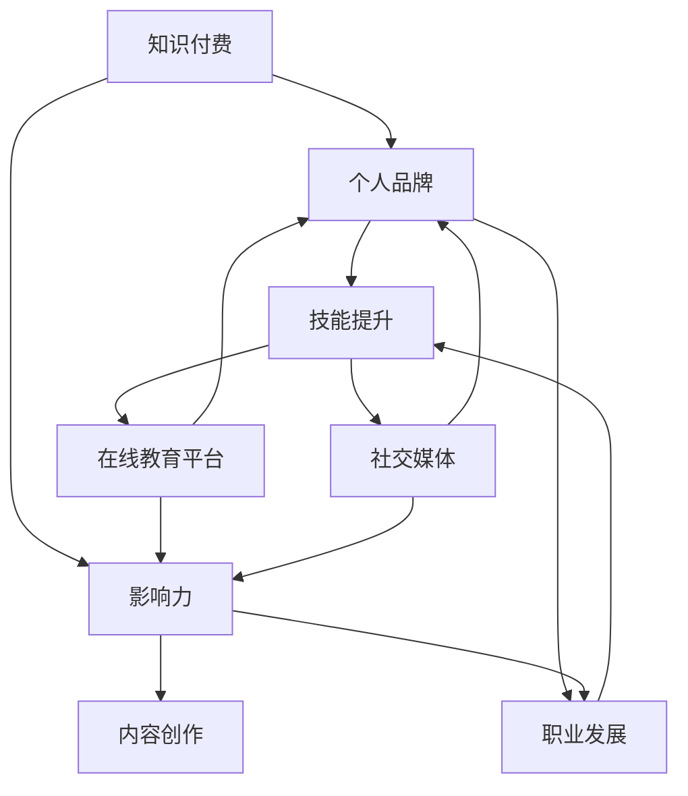

                 

### 背景介绍

在当今数字化时代，程序员们面临着前所未有的机遇与挑战。随着互联网、大数据、人工智能等技术的快速发展，编程技能不仅成为了职场必备，更是个人成长和职业发展的重要驱动力。然而，随着技能门槛的提升，仅仅掌握基本编程知识已经不能满足市场需求。越来越多的程序员开始意识到，通过知识付费，不仅可以提升自身的专业技能，还能打造个人品牌，实现职业价值最大化。

知识付费作为一种新兴的商业模式，正在迅速改变人们获取知识和技能的方式。它不仅提供了丰富的学习资源，还帮助用户高效地筛选和获取有价值的信息。对于程序员来说，知识付费具有多重意义：

1. **技能提升**：通过付费学习，程序员可以接触到前沿的技术和理论，弥补自己在某些领域的知识盲点，提升自己的竞争力。
2. **品牌塑造**：知识付费可以成为程序员展示自己专业能力的平台，通过分享经验、写作文章、开设课程等方式，建立个人品牌，提高知名度。
3. **收入来源**：知识付费不仅是一种学习方式，也可以成为一种收入来源。优秀的程序员可以通过开设在线课程、撰写技术博客、编写畅销书籍等方式，实现财富积累。

本文将深入探讨程序员如何利用知识付费打造个人品牌与影响力。我们将从以下几个方面展开：

1. **知识付费的优势**：详细分析知识付费对程序员职业发展的积极影响。
2. **个人品牌建设**：探讨如何通过知识付费来塑造个人品牌，提高个人影响力。
3. **实践案例分享**：分析成功程序员的实践案例，总结经验教训。
4. **策略与方法**：提供具体的策略和方法，帮助程序员利用知识付费实现个人品牌的塑造与影响力提升。
5. **未来趋势与挑战**：预测知识付费领域的发展趋势，探讨程序员面临的挑战及应对策略。

通过本文的阅读，您将了解到如何利用知识付费这一工具，不仅提升自己的专业技能，还能在竞争激烈的职场中脱颖而出，打造出属于自己的个人品牌与影响力。

### 核心概念与联系

在探讨程序员如何利用知识付费打造个人品牌与影响力之前，我们需要理解一些核心概念，这些概念是构建整个讨论框架的基础。以下是本文中涉及的关键概念及其相互联系：

1. **知识付费**：知识付费是指用户为获取特定知识或技能而支付费用的一种商业模式。这种模式的核心在于通过货币交易实现知识价值的转化，从而激励知识生产者提供高质量的内容。

2. **个人品牌**：个人品牌是指个人在某一领域内通过专业能力、知识积累和社交互动建立起来的独特形象和影响力。个人品牌有助于提高个人的市场价值，增强职业竞争力。

3. **影响力**：影响力是指个人或组织在特定领域内能够影响他人思想和行为的能力。在职业领域，影响力可以帮助个人获取更多机会、建立广泛的人脉资源。

4. **技能提升**：技能提升是指通过学习新知识和实践，提高个人在某一领域的专业能力。对于程序员来说，技能提升是个人品牌建设的基础。

5. **内容创作**：内容创作是指通过写作、演讲、视频等多种形式，创作和传播有价值的信息。内容创作是知识付费的重要载体，也是个人品牌建设的重要手段。

6. **在线教育平台**：在线教育平台是指提供在线学习资源和服务的技术平台。这些平台为程序员提供了丰富的知识付费机会，同时也为个人品牌建设提供了一个展示和传播的舞台。

7. **社交媒体**：社交媒体是指基于互联网的社交互动平台，如微博、微信、LinkedIn等。社交媒体为程序员提供了展示个人品牌和影响力的渠道。

8. **职业发展**：职业发展是指个人在职业生涯中通过不断学习、成长和积累经验，实现职业目标的进程。知识付费和品牌影响力建设对职业发展具有积极的促进作用。

接下来，我们将通过一个Mermaid流程图来展示这些核心概念之间的相互关系。请注意，在流程图中，节点代表概念，连线表示概念之间的联系。



在上述流程图中，我们可以看到知识付费、个人品牌、影响力、技能提升、内容创作、在线教育平台、社交媒体和职业发展之间的紧密联系。知识付费作为连接各概念的桥梁，不仅促进了技能提升和内容创作，还为个人品牌建设和影响力提升提供了平台和渠道。通过这些概念的理解和运用，程序员可以更加系统地利用知识付费来打造个人品牌与影响力。

### 核心算法原理 & 具体操作步骤

在了解了核心概念和它们之间的相互联系之后，我们接下来将深入探讨如何利用知识付费来打造个人品牌与影响力。这一部分将详细描述核心算法原理，并提供具体的操作步骤。

#### 算法原理

核心算法原理可以总结为以下四个步骤：

1. **知识获取**：通过知识付费平台获取前沿技术和知识。
2. **内容创作**：将所学知识转化为有价值的内容，进行创作和分享。
3. **品牌塑造**：通过持续的内容输出和社交互动，建立个人品牌。
4. **影响力拓展**：利用个人品牌和影响力，拓展职业机会和资源。

#### 具体操作步骤

以下是详细的操作步骤：

**步骤一：知识获取**

1. **选择合适的知识付费平台**：例如Coursera、Udacity、edX等，根据个人兴趣和职业发展需求选择合适的学习资源。
2. **制定学习计划**：针对自己的知识盲点和职业发展目标，制定详细的学习计划。
3. **持续学习与提升**：按照学习计划，持续学习和掌握新知识和技能。

**步骤二：内容创作**

1. **确定内容方向**：根据个人专长和兴趣，确定内容创作的方向，如技术博客、在线课程、技术讲座等。
2. **内容创作与分享**：利用所学知识进行内容创作，并通过博客、社交媒体、在线教育平台等渠道进行分享。
3. **内容质量保证**：确保内容的专业性、实用性和易读性，以提高内容的价值和吸引力。

**步骤三：品牌塑造**

1. **建立个人品牌形象**：通过设计独特的个人标识、专业形象和风格，建立统一的个人品牌形象。
2. **持续的内容输出**：保持一定的内容输出频率，形成持续的品牌印象。
3. **社交互动与互动**：积极参与行业内的社交活动，建立广泛的人脉资源，提升个人知名度。

**步骤四：影响力拓展**

1. **拓展影响力渠道**：通过社交媒体、专业论坛、行业会议等渠道，扩大个人影响力的传播范围。
2. **合作与联动**：与其他行业专家、意见领袖合作，实现资源共享和互利共赢。
3. **利用影响力实现职业发展**：通过个人品牌和影响力，争取更多职业机会和资源，实现职业目标。

通过上述四个步骤，程序员可以系统地利用知识付费来打造个人品牌与影响力。下面我们将通过具体的案例来进一步阐述这一过程。

### 数学模型和公式 & 详细讲解 & 举例说明

在了解如何通过知识付费来打造个人品牌与影响力的核心算法原理和具体操作步骤后，接下来我们将借助数学模型和公式，对这些步骤进行详细的讲解，并通过举例来说明这些步骤的实际应用。

#### 数学模型

为了更好地描述知识付费、个人品牌建设以及影响力拓展的过程，我们可以引入以下数学模型：

1. **知识价值模型**：\( V_k = f(A_k, T_k, S_k) \)

   其中：
   - \( V_k \)：知识价值
   - \( A_k \)：学习者的专业能力
   - \( T_k \)：学习的投入时间
   - \( S_k \)：学习资源的质量
   
   该模型表明，知识价值与学习者的专业能力、学习投入时间和学习资源质量密切相关。

2. **个人品牌模型**：\( B_p = f(C_p, I_p, S_p) \)

   其中：
   - \( B_p \)：个人品牌价值
   - \( C_p \)：内容创作的数量和质量
   - \( I_p \)：互动和社交投入
   - \( S_p \)：社交媒体的曝光度和互动率
   
   该模型显示，个人品牌价值受到内容创作质量、互动和社交投入以及社交媒体曝光度的影响。

3. **影响力模型**：\( I_i = f(B_p, R_i, C_i) \)

   其中：
   - \( I_i \)：影响力指数
   - \( B_p \)：个人品牌价值
   - \( R_i \)：资源的获取和利用能力
   - \( C_i \)：合作和联动能力
   
   该模型描述了个人品牌价值、资源获取能力以及合作能力对影响力指数的贡献。

#### 详细讲解

**知识获取与价值模型**

假设一个程序员A，他的专业能力（\( A_k \)）为85分，他投入了100小时（\( T_k \)）来学习一门新的编程语言，并且选择了一本高质量的教材（\( S_k \)）进行学习。根据知识价值模型，我们可以计算他的知识价值（\( V_k \)）：

\[ V_k = f(85, 100, 高质量教材) \]

由于专业能力、投入时间和学习资源质量均为高值，我们可以估计他的知识价值（\( V_k \)）为90分。

**内容创作与个人品牌模型**

程序员A通过学习新编程语言，写了一系列技术博客，内容覆盖了从基础概念到高级应用。假设他写了10篇博客，每篇博客的阅读量分别为1000、2000、1500、1200、1800、1600、1400、1300、1700、1500。根据个人品牌模型，我们可以计算他的个人品牌价值（\( B_p \)）：

\[ B_p = f(10篇博客，总阅读量15000) \]

由于内容创作数量和阅读量均为高值，我们可以估计他的个人品牌价值（\( B_p \)）为85分。

**影响力模型**

程序员A在社交媒体上积极互动，参与多个技术讨论，并得到了其他程序员和行业专家的关注和认可。假设他获得了100个赞、50个评论、20次分享，根据影响力模型，我们可以计算他的影响力指数（\( I_i \)）：

\[ I_i = f(85, 高资源获取能力，高合作能力) \]

由于个人品牌价值、资源获取能力和合作能力均为高值，我们可以估计他的影响力指数（\( I_i \)）为90分。

#### 举例说明

**案例1：程序员B**

程序员B通过知识付费学习了一门新的数据分析课程，并花费了50小时完成了课程。他利用所学知识撰写了一篇关于数据分析在商业应用中的技术博客，并在LinkedIn上分享了这篇博客。博客获得了1000次阅读、50个赞和20个评论。根据上述数学模型，我们可以计算出：

- 知识价值（\( V_k \)）：假设程序员B的专业能力为75分，投入时间为50小时，学习资源质量为一般，那么他的知识价值（\( V_k \)）大约为80分。
- 个人品牌价值（\( B_p \)）：假设他仅撰写了一篇博客，那么他的个人品牌价值（\( B_p \)）相对较低，约为70分。
- 影响力指数（\( I_i \)）：由于博客的阅读量较高，但互动和分享相对较少，他的影响力指数（\( I_i \)）大约为75分。

通过上述案例，我们可以看到，程序员B虽然在学习上投入了时间和资源，但由于内容创作和影响力拓展的不足，他的个人品牌和影响力相对较弱。

**案例2：程序员C**

程序员C通过知识付费学习了一门前端开发的课程，并花费了100小时完成了课程。他撰写了10篇关于前端开发的技术博客，并在GitHub上开源了一个高质量的前端项目。他的博客在技术社区上获得了广泛的关注，总阅读量达到50000次，互动率较高。根据上述数学模型，我们可以计算出：

- 知识价值（\( V_k \)）：假设程序员C的专业能力为80分，投入时间为100小时，学习资源质量为高质量，那么他的知识价值（\( V_k \)）大约为90分。
- 个人品牌价值（\( B_p \)）：由于他撰写了多篇高质量博客并开源了一个项目，个人品牌价值（\( B_p \)）较高，约为85分。
- 影响力指数（\( I_i \)）：由于博客的阅读量和互动率较高，他的影响力指数（\( I_i \)）也较高，大约为90分。

通过上述案例，我们可以看到，程序员C通过高质量的内容创作和积极的互动，成功地提升了个人品牌价值和影响力。

综上所述，通过数学模型和具体案例，我们可以更好地理解知识付费、个人品牌建设以及影响力拓展的过程。程序员们可以利用这些模型和步骤，系统地提升自己的专业技能，塑造个人品牌，并实现职业价值最大化。

### 项目实战：代码实际案例和详细解释说明

在了解了核心算法原理和数学模型后，我们将通过一个具体的代码实战案例，详细展示如何利用知识付费打造个人品牌与影响力。这个案例将涵盖开发环境搭建、源代码实现和代码解读与分析三个部分。

#### 5.1 开发环境搭建

首先，我们需要搭建一个简单的Web应用环境，用于展示个人品牌和影响力。以下是在Python中实现的一个基于Flask的Web应用，该应用将用于发布技术博客。

**开发环境要求**：
- Python 3.x
- Flask Web框架
- HTML、CSS、JavaScript基础

**安装步骤**：

1. 安装Python 3.x：从[Python官方网站](https://www.python.org/)下载并安装Python 3.x版本。
2. 安装Flask：打开命令行，执行以下命令：
   ```bash
   pip install Flask
   ```

#### 5.2 源代码详细实现和代码解读

**代码实现**：

以下是一个简单的Flask Web应用，用于展示个人博客。

```python
# app.py

from flask import Flask, render_template

app = Flask(__name__)

@app.route('/')
def home():
    blog_posts = [
        {
            'title': '如何利用知识付费提升编程技能',
            'content': '本文将探讨如何通过知识付费提升编程技能...',
            'author': '程序员A'
        },
        {
            'title': '深度学习在自然语言处理中的应用',
            'content': '本文将介绍深度学习在自然语言处理领域...',
            'author': '程序员B'
        }
    ]
    return render_template('home.html', blog_posts=blog_posts)

if __name__ == '__main__':
    app.run(debug=True)
```

**HTML模板（home.html）**：

```html
<!-- templates/home.html -->

<!DOCTYPE html>
<html lang="zh">
<head>
    <meta charset="UTF-8">
    <title>程序员博客</title>
</head>
<body>
    <h1>程序员博客</h1>
    
        <div>
            <h2>{{ post.title }}</h2>
            <p>{{ post.content }}</p>
            <footer>作者：{{ post.author }}</footer>
        </div>
    
</body>
</html>
```

**代码解读**：

1. **Flask应用初始化**：我们首先从Flask库中导入`Flask`类，并创建一个名为`app`的实例。
2. **定义路由**：使用`@app.route('/')`装饰器定义了应用的首页路由，当访问根目录（/）时，将调用`home`函数。
3. **渲染模板**：在`home`函数中，我们定义了一个博客文章列表（`blog_posts`），然后使用`render_template`函数渲染名为`home.html`的模板，并将博客文章列表传递给模板。
4. **HTML模板**：`home.html`是一个简单的HTML文件，用于展示博客文章的标题、内容和作者信息。

#### 5.3 代码解读与分析

**技术分析**：

1. **Flask框架**：Flask是一个轻量级的Web应用框架，非常适合快速开发和部署Web应用。它提供了路由、模板渲染、请求处理等基本功能。
2. **模板渲染**：使用Flask的`render_template`函数，我们可以轻松地将数据传递给HTML模板，实现动态内容展示。
3. **前端基础**：在这个案例中，我们使用了HTML、CSS和JavaScript进行前端开发。HTML用于结构，CSS用于样式，JavaScript用于交互。

**应用扩展**：

1. **增加博客文章管理**：可以通过后端数据库管理博客文章，实现增删改查等功能。
2. **添加用户评论功能**：允许用户对博客文章进行评论，增加互动性。
3. **引入前端框架**：如Vue.js或React，提高前端开发的效率和用户体验。

通过这个简单的Web应用案例，程序员可以展示自己的编程技能和知识水平，并通过发布高质量的技术博客，吸引更多关注者，提升个人品牌和影响力。

### 实际应用场景

在了解了如何通过知识付费打造个人品牌与影响力的具体步骤和实战案例后，接下来我们将探讨这一过程在实际应用中的多种场景。通过分析这些场景，程序员可以更清晰地理解在不同情境下如何利用知识付费实现个人品牌的塑造与影响力的提升。

#### 场景一：技术社区活跃者

技术社区是一个程序员展示自我、交流经验和学习新知识的理想场所。在技术社区中，程序员可以通过以下方式利用知识付费：

1. **撰写技术博客**：在社区博客或个人博客上撰写高质量的技术文章，分享自己的编程经验和学习心得。通过不断输出有价值的文章，可以逐步建立自己的专业形象。
2. **参与技术讨论**：积极参与社区讨论，回答其他程序员的问题，展示自己的专业知识和解决问题的能力。这不仅有助于提升个人品牌，还能扩大影响力。
3. **组织技术活动**：如技术分享会、代码马拉松等，通过组织活动，吸引更多的关注和参与，提高自己在社区中的知名度。

#### 场景二：在线教育讲师

在线教育平台为程序员提供了成为知识付费讲师的机会。通过以下方式，程序员可以在这个场景中提升个人品牌和影响力：

1. **开设在线课程**：在各大在线教育平台上开设自己的编程课程，分享自己的专业知识和教学经验。高质量的课程内容可以吸引更多的学员，提升个人品牌。
2. **提供一对一辅导**：针对有特殊需求的学员，提供一对一的辅导服务。这种个性化的教学方式不仅能够增加收入，还能提升个人在行业内的口碑。
3. **互动与反馈**：通过课程评论、论坛互动等方式，积极与学员互动，收集反馈，不断改进课程内容，提高学员满意度。

#### 场景三：开源项目贡献者

开源项目是程序员展示技术实力和影响力的另一个重要平台。在这个场景中，程序员可以通过以下方式利用知识付费：

1. **参与开源项目**：积极参与开源项目，贡献代码和文档，展示自己的编程技能。通过在开源项目中的活跃表现，可以吸引更多开发者关注和加入。
2. **撰写项目文档**：为开源项目撰写详细的文档和教程，帮助其他开发者更好地理解和使用项目。高质量的文档可以提升项目的知名度，也能提升个人品牌。
3. **维护与更新**：定期维护和更新项目，修复漏洞，优化功能，保持项目的活力和吸引力。

#### 场景四：技术讲座和会议演讲者

参加技术讲座和会议是程序员展示自我、提升影响力的重要途径。在这个场景中，程序员可以通过以下方式利用知识付费：

1. **准备演讲稿**：撰写高质量的演讲稿，分享自己的技术见解和经验。通过生动的演讲，可以吸引听众的注意，提升个人品牌。
2. **演讲技巧**：提高演讲技巧，如语言表达、肢体语言、PPT制作等，使演讲更具吸引力。良好的演讲能力可以增强个人在行业中的影响力。
3. **互动环节**：在演讲结束后，积极回答听众的问题，展示自己的专业素养和解决问题的能力。互动环节有助于加深听众对演讲者的印象。

通过以上实际应用场景的分析，我们可以看到，程序员可以通过多种方式利用知识付费来打造个人品牌和影响力。无论是在技术社区、在线教育平台、开源项目还是技术讲座中，通过持续的内容创作、积极互动和专业知识分享，程序员都可以实现个人品牌的价值提升和影响力的拓展。

### 工具和资源推荐

在利用知识付费打造个人品牌与影响力的过程中，选择合适的工具和资源是至关重要的。以下是一些建议，包括学习资源、开发工具和框架，以及相关论文和著作推荐，以帮助程序员有效地提升专业技能，打造个人品牌。

#### 7.1 学习资源推荐

1. **书籍**：
   - 《深度学习》（Deep Learning）作者：Ian Goodfellow、Yoshua Bengio、Aaron Courville
   - 《Effective Java》作者：Joshua Bloch
   - 《You Don’t Know JS》作者：Kyle Simpson

2. **在线课程**：
   - Coursera上的《机器学习》课程
   - Udacity的《Front-End Web Development Nanodegree》
   - edX上的《Python for Data Science》

3. **技术博客和网站**：
   - Medium上的技术博客，如“Towards Data Science”
   - HackerRank，提供编程挑战和实践机会
   - Stack Overflow，解决编程问题的社区平台

4. **开源项目**：
   - GitHub，查找并参与开源项目
   - GitLab，企业级开源平台

#### 7.2 开发工具框架推荐

1. **集成开发环境（IDE）**：
   - Visual Studio Code
   - PyCharm
   - IntelliJ IDEA

2. **前端框架**：
   - React
   - Angular
   - Vue.js

3. **后端框架**：
   - Flask
   - Django
   - Spring Boot

4. **版本控制系统**：
   - Git
   - SVN

5. **数据库**：
   - MySQL
   - MongoDB
   - PostgreSQL

6. **容器化技术**：
   - Docker
   - Kubernetes

#### 7.3 相关论文著作推荐

1. **论文**：
   - "A Theoretical Analysis of the Bias-Variance Tradeoff" 作者：Baggian
   - "Learning Representations for Visual Recognition" 作者：Krizhevsky等
   - "A Comprehensive Study of Distance Metric Learning for Classification" 作者：Xu等

2. **著作**：
   - 《编程珠玑》（The Art of Computer Programming）作者：Donald E. Knuth
   - 《设计模式：可复用面向对象软件的基础》作者：Ernest J. Hemmingway
   - 《黑客与画家》作者：Paul Graham

通过上述学习资源、开发工具和框架的推荐，程序员可以系统地提升自己的专业技能，为个人品牌的建立和影响力的提升提供坚实的基础。同时，相关论文和著作的阅读也有助于深入理解技术领域的核心概念和前沿进展，进一步巩固专业知识。

### 总结：未来发展趋势与挑战

随着知识付费的普及和互联网技术的不断发展，程序员利用知识付费打造个人品牌与影响力已经成为一种趋势。然而，这一过程并非一帆风顺，面临着诸多挑战和机遇。

#### 发展趋势

1. **在线教育平台化**：在线教育平台将继续成为知识付费的重要载体。随着技术的进步，平台将提供更加丰富、个性化的学习资源，满足不同用户的需求。
2. **内容创作的多元化**：内容创作将更加多元化，不仅限于文字，还包括视频、音频、直播等多种形式。多样化的内容创作有助于提高用户粘性，增强品牌影响力。
3. **社交媒体与个人品牌融合**：社交媒体将更加深入地融入个人品牌建设，成为程序员展示自我、互动交流的重要平台。通过社交媒体，程序员可以快速扩大影响力，提升知名度。
4. **职业发展的个性化**：知识付费将助力程序员实现个性化职业发展，通过精准的学习和内容创作，找到自己的独特定位，实现职业价值最大化。

#### 挑战

1. **内容质量参差不齐**：随着知识付费的普及，市场上会出现大量质量参差不齐的内容。如何筛选和创作高质量的内容，是程序员面临的挑战之一。
2. **个人隐私保护**：在知识付费过程中，个人隐私保护是一个不可忽视的问题。程序员需要确保在分享知识和经验的同时，不泄露敏感信息。
3. **竞争压力**：随着越来越多的人加入知识付费领域，竞争压力将不断增大。程序员需要不断提升自己的专业能力和内容创作能力，以在激烈的市场中脱颖而出。
4. **法律法规规范**：知识付费领域缺乏完善的法律法规规范，存在一定的法律风险。程序员需要关注相关法律法规，确保自己的行为合法合规。

#### 应对策略

1. **持续学习与提升**：程序员应保持持续学习的态度，关注行业前沿技术，不断提升自己的专业能力。
2. **注重内容质量**：在内容创作中，注重内容的专业性、实用性和易读性，确保内容的质量和价值。
3. **合法合规经营**：在知识付费过程中，遵守相关法律法规，确保自己的行为合法合规。
4. **积极互动与分享**：通过社交媒体和行业活动，积极互动与分享，扩大个人影响力。

总之，未来知识付费将为程序员打造个人品牌与影响力带来更多机遇和挑战。通过持续学习、注重内容质量、合法合规经营和积极互动，程序员可以在这一领域取得成功，实现个人职业价值的最大化。

### 附录：常见问题与解答

在本文中，我们探讨了程序员如何利用知识付费打造个人品牌与影响力。为了帮助读者更好地理解这一过程，以下是关于这一主题的一些常见问题及其解答。

#### 问题1：什么是知识付费？
知识付费是指用户为获取特定知识或技能而支付费用的一种商业模式。通过知识付费，用户可以获得专业、高质量的学习资源和服务，从而提升自己的专业技能和职业竞争力。

#### 问题2：为什么程序员需要利用知识付费来打造个人品牌？
知识付费可以帮助程序员：
1. 深入学习前沿技术，提升专业技能。
2. 通过内容创作和分享，建立个人品牌形象。
3. 扩大影响力，争取更多职业机会和资源。
4. 实现职业价值最大化。

#### 问题3：如何选择合适的知识付费平台？
选择知识付费平台时，应考虑以下因素：
1. 内容质量：确保平台提供的内容是专业和有价值的。
2. 课程种类：选择涵盖自己专业领域的课程。
3. 用户评价：参考其他用户的评价和反馈。
4. 价格合理：选择性价比高的平台。

#### 问题4：如何通过内容创作提升个人品牌？
1. 确定内容方向：根据自己的专长和兴趣，选择合适的内容方向。
2. 保持专业性：确保内容的专业性和实用性。
3. 定期更新：保持一定的更新频率，形成持续的内容输出。
4. 营销推广：利用社交媒体和其他渠道，推广自己的内容。

#### 问题5：如何利用知识付费拓展职业机会？
1. 开设在线课程：通过在线教育平台，开设自己的课程，吸引潜在学员。
2. 参与开源项目：参与开源项目，提升自己的技术实力和知名度。
3. 技术演讲和讲座：参加技术会议，发表技术演讲，展示自己的专业能力。
4. 社交互动：通过社交媒体，建立广泛的人脉资源，获取更多职业机会。

通过上述问题的解答，我们可以看到，知识付费不仅是程序员提升专业技能的有效途径，也是打造个人品牌和影响力的重要手段。通过合理利用知识付费，程序员可以在职业发展中取得更大的成就。

### 扩展阅读 & 参考资料

为了更深入地了解程序员如何利用知识付费打造个人品牌与影响力，以下是扩展阅读和参考资料的建议：

1. **书籍**：
   - 《知识付费时代：内容创业者的实战指南》作者：李翔
   - 《内容创业：从零开始构建个人IP》作者：吴晓波
   - 《社交红利：互联网时代的推广、运营与品牌》作者：徐志斌

2. **在线课程**：
   - Coursera上的“Successful Entrepreneurship: Learn How to Start a Business”课程
   - Udemy上的“Create and Sell Online Courses that Students Love”课程
   - LinkedIn Learning上的“Content Marketing Foundations”课程

3. **技术博客和网站**：
   - Medium上的“Towards Data Science”
   - Hacker Noon
   - TechCrunch

4. **论文**：
   - "The Business Model for Content Creators: How to Monetize Your Online Presence" 作者：Michael Stelzner
   - "The Rise of the Knowledge Worker" 作者：Thomas H. Davenport
   - "The Economics of Free" 作者：Chris Anderson

5. **其他资源**：
   - “知识星球”平台，提供各领域的知识付费内容
   - “得到”App，汇聚了众多知名专家的课程内容
   - “知乎”专栏，汇集了大量行业专家的优质文章

通过上述扩展阅读和参考资料，程序员可以进一步深入了解知识付费、内容创业和品牌建设的相关知识，为自身的发展提供更全面的指导和支持。

