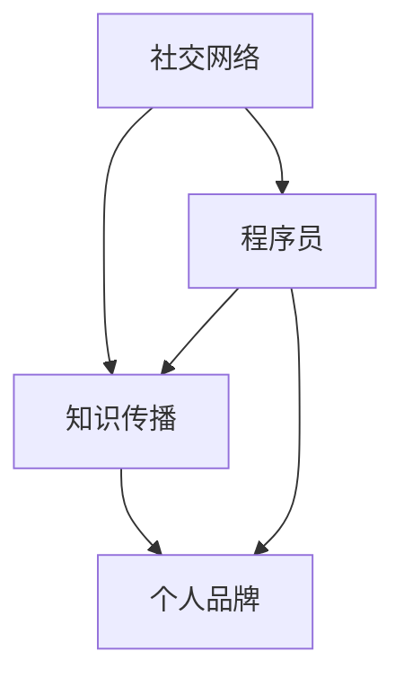

                 

### 背景介绍

在当今数字化时代，社交网络已经成为程序员扩大知识影响力的重要平台。程序员们不仅需要具备扎实的技术能力，还需要通过社交网络与其他程序员、技术专家、行业领袖建立联系，分享技术见解，传播最新技术动态，提升个人品牌价值。本篇博客将探讨程序员如何利用社交网络扩大知识影响力，包括核心概念、算法原理、数学模型、项目实战、应用场景和未来发展等方面的内容。

在当今这个信息爆炸的时代，程序员面临的挑战之一是如何在众多技术内容中脱颖而出，获得更多的关注和认可。传统的技术博客、论坛和会议等渠道虽然仍具有一定的作用，但随着社交网络的兴起，利用这些平台与广大程序员社区互动，已经成为一种更加高效、直接的方式。社交网络不仅提供了丰富的交流渠道，还使得知识传播更加快速和广泛，程序员们可以更便捷地分享技术心得、讨论技术难题，甚至参与到开源项目的开发和维护中。

本文将深入探讨程序员如何通过以下途径在社交网络中扩大知识影响力：

1. **核心概念与联系**：介绍社交网络在知识传播中的作用，以及如何利用社交网络构建个人技术品牌。
2. **核心算法原理 & 具体操作步骤**：分析社交网络中的信息传播机制，并探讨如何优化社交网络的使用策略。
3. **数学模型和公式 & 详细讲解 & 举例说明**：利用数学模型分析社交网络的传播效果，并给出具体案例。
4. **项目实战：代码实际案例和详细解释说明**：通过具体项目案例，展示如何在实际环境中应用社交网络扩大知识影响力。
5. **实际应用场景**：讨论社交网络在不同领域的应用，以及程序员如何根据不同场景调整自己的社交策略。
6. **工具和资源推荐**：推荐一些实用的工具和资源，帮助程序员更好地利用社交网络扩大影响力。
7. **总结：未来发展趋势与挑战**：总结当前趋势，并展望未来的发展方向和可能面临的挑战。

通过这篇文章，希望读者能够深入理解社交网络在程序员知识传播中的重要作用，掌握利用社交网络扩大知识影响力的一系列策略和技巧，从而在职业生涯中取得更大的成就。

### 核心概念与联系

为了更好地理解程序员如何利用社交网络扩大知识影响力，我们需要从核心概念和关键联系入手。以下是几个关键的概念和它们之间的联系：

#### 社交网络（Social Networks）

社交网络是指通过互联网连接的个体及其相互关系的集合。在这个网络中，每个个体都可以被视为一个节点，节点之间的互动和联系则构成了网络的边。社交网络的核心在于节点之间的相互影响和信息传播。

#### 程序员（Programmers）

程序员是编写、调试和维护计算机软件的专业人员。他们通过编程语言实现各种功能，解决复杂的技术问题。程序员在社交网络中的角色不仅仅是信息的消费者，更是知识的生产者和传播者。

#### 知识传播（Knowledge Dissemination）

知识传播是指知识从一个人或组织传递到另一个人的过程。在社交网络中，知识传播的效率非常高，这是因为网络中的个体可以通过多种方式分享和传播知识，如发帖、评论、分享链接等。

#### 个人品牌（Personal Branding）

个人品牌是指个人在公众心目中的形象和声誉。在社交网络中，个人品牌对于程序员来说至关重要，它关系到个人的职业发展和知识传播的效果。

#### 核心概念之间的联系

1. **社交网络与知识传播**：社交网络为程序员提供了一个高效的知识传播平台，使得程序员可以迅速地将自己的知识分享给广大社区成员。
   
2. **程序员与个人品牌**：程序员通过在社交网络中的活跃表现，可以塑造和提升自己的个人品牌，从而在行业中获得更高的认可度。

3. **知识传播与个人品牌**：有效的知识传播能够增强程序员的个人品牌，而强大的个人品牌又能进一步促进知识的传播。

为了更好地理解这些核心概念之间的联系，我们可以使用Mermaid流程图来展示它们之间的关系。以下是一个简化的Mermaid流程图示例：



在这个流程图中，我们可以看到社交网络作为基础平台，连接了知识传播和个人品牌这两个关键概念。程序员作为知识传播的主体，通过社交网络塑造和提升个人品牌，进而实现知识的更广泛传播。

通过这个流程图，我们可以更清晰地看到社交网络在程序员知识传播和个人品牌建设中的作用。在接下来的部分，我们将深入探讨这些概念的具体实现和应用策略。

### 核心算法原理 & 具体操作步骤

在社交网络中，程序员的参与不仅仅是为了建立联系和分享知识，更重要的是要确保自己的知识传播效果最大化。这就需要我们理解和应用一些核心算法原理，以优化社交网络的使用策略。以下是几个关键的核心算法原理及其具体操作步骤：

#### 算法1：PageRank算法

PageRank是一种用于评估网页重要性的算法，由Google的创始人拉里·佩奇和谢尔盖·布林提出。PageRank算法的核心思想是，一个网页的重要性取决于被其他网页链接的数量和质量。

**原理说明**：

- **基本思想**：网页的排名与其被其他网页链接的数量和质量成正比。链接数量越多，网页的排名越高；链接质量越高，网页的排名也越高。
- **具体步骤**：
  1. **初始化**：给每个网页分配一个初始排名，通常设置为1。
  2. **迭代计算**：根据网页之间的链接关系，计算每个网页的排名。公式为：
     \[
     \text{Rank}(A) = \left(1 - d\right) + d \cdot \frac{\text{Sum of Rank}(B_1) \times \text{Outgoing Links}(B_1)}{\text{Total Outgoing Links}(B_1)}
     \]
     其中，\(d\) 是阻尼系数（通常取值为0.85），\(\text{Outgoing Links}(B_1)\) 是指向网页A的链接数量。
  3. **收敛判断**：当排名变化小于一个设定的阈值时，算法收敛，输出最终排名。

**示例**：

假设有3个网页A、B、C，链接关系如下：

```
A --> B
A --> C
B --> A
C --> B
```

初始排名：\( \text{Rank}(A) = \text{Rank}(B) = \text{Rank}(C) = 1 \)

经过一次迭代后：

\[
\text{Rank}(A) = \left(1 - 0.85\right) + 0.85 \cdot \frac{1 \times 1}{2} = 0.15 + 0.425 = 0.575
\]

\[
\text{Rank}(B) = \left(1 - 0.85\right) + 0.85 \cdot \frac{0.575 \times 1}{1} = 0.15 + 0.48625 = 0.63625
\]

\[
\text{Rank}(C) = \left(1 - 0.85\right) + 0.85 \cdot \frac{0.575 \times 1}{1} = 0.15 + 0.48625 = 0.63625
\]

#### 算法2：K-核心算法

K-核心算法用于识别社交网络中的关键节点，这些节点在社交网络中具有重要地位，因为它们拥有较多的连接且这些连接并非随机分布。

**原理说明**：

- **基本思想**：一个节点的K-核心大小是其直接连接的节点数。如果这个节点的直接连接节点数大于K，那么这个节点属于K-核心。
- **具体步骤**：
  1. **初始化**：设定一个K值。
  2. **判断**：对于每个节点，计算其直接连接的节点数。如果节点的直接连接节点数大于K，则该节点属于K-核心。
  3. **递归**：将K-核心中的节点移除，再次计算新的K-核心。
  4. **收敛判断**：当不再有新的节点加入K-核心时，算法收敛。

**示例**：

假设有6个节点A、B、C、D、E、F，连接关系如下：

```
A --> B --> C
\   |   /     
 \ | /        
  D --> E --> F
```

设定K=2，初始时：

- A的直接连接节点数：2
- B的直接连接节点数：2
- C的直接连接节点数：1
- D的直接连接节点数：2
- E的直接连接节点数：2
- F的直接连接节点数：1

第一次迭代后，A和B属于K-核心：

- A的直接连接节点数：2
- B的直接连接节点数：2

移除A和B后，再次迭代：

- D的直接连接节点数：2
- E的直接连接节点数：2

D和E也属于K-核心，算法收敛。

通过PageRank和K-核心算法，程序员可以在社交网络中识别和提升自己的重要性。在实际操作中，程序员可以通过以下步骤来应用这些算法：

1. **数据分析**：收集社交网络中的数据，包括节点和边的信息。
2. **算法实现**：根据所选算法，编写相应的代码进行计算。
3. **结果分析**：分析计算结果，确定自己在社交网络中的位置和影响力。
4. **策略调整**：根据分析结果，调整社交行为和内容，以提升个人影响力。

通过这些核心算法的应用，程序员可以更科学地管理自己的社交网络，实现知识的有效传播和影响力的提升。

### 数学模型和公式 & 详细讲解 & 举例说明

在社交网络中，为了评估和优化程序员的传播效果，我们需要借助数学模型和公式进行分析。以下是几个常用的数学模型和公式，以及详细的讲解和实际应用案例。

#### 模型1：巴甫利科夫传播模型

巴甫利科夫传播模型是一种用于描述信息在社交网络中传播过程的数学模型。该模型考虑了信息传播的扩散速度和用户交互的影响。

**公式**：

\[
I(t) = I_0 + \sum_{i=1}^{N} \left[ 1 - \left(1 - p_i\right)^{N_i(t)} \right]
\]

其中：
- \(I(t)\) 是时间t时社交网络中的信息覆盖率；
- \(I_0\) 是初始信息覆盖率；
- \(N_i(t)\) 是时间t时用户i的传播能力；
- \(p_i\) 是用户i的传播概率。

**详细讲解**：

- \(I(t)\) 表示时间t时社交网络中的信息覆盖率，即有多少比例的用户接收到了信息。
- \(I_0\) 是初始信息覆盖率，表示最初有多少比例的用户接收到了信息。
- \(N_i(t)\) 是时间t时用户i的传播能力，即用户i在一段时间内能够影响的其他用户数量。
- \(p_i\) 是用户i的传播概率，即用户i成功传播信息的概率。

**应用案例**：

假设社交网络中有100个用户，其中10个用户最初接收到信息。每个用户的传播概率为0.6。我们需要计算在一天后社交网络中的信息覆盖率。

初始信息覆盖率 \(I_0 = 10\%\)，即10个用户接收到了信息。

传播能力 \(N_i(t) = 5\)，即每个用户平均能够影响5个其他用户。

传播概率 \(p_i = 0.6\)，即每个用户成功传播信息的概率为0.6。

代入公式：

\[
I(t) = 10\% + \sum_{i=1}^{100} \left[ 1 - (1 - 0.6)^5 \right]
\]

\[
I(t) = 10\% + 90\% \times \left[ 1 - 0.2^5 \right]
\]

\[
I(t) = 10\% + 90\% \times 0.96 = 17.04\%
\]

因此，一天后社交网络中的信息覆盖率为17.04%。

#### 模型2：Katz中心性模型

Katz中心性模型是一种用于评估社交网络中节点重要性的数学模型。该模型基于节点之间的连接关系，考虑了节点之间路径的权重。

**公式**：

\[
C_k(v) = \left(1 - \alpha\right)^{k} \cdot \sum_{w \in N(v)} C_k(w)
\]

其中：
- \(C_k(v)\) 是节点v在k步范围内的中心性；
- \(\alpha\) 是遗忘因子，通常取值为0.85；
- \(N(v)\) 是节点v的邻居节点集合；
- \(C_k(w)\) 是节点w在k步范围内的中心性。

**详细讲解**：

- \(C_k(v)\) 表示节点v在k步范围内的中心性，即节点v在k步内能够触及的其他节点的数量。
- \(\alpha\) 是遗忘因子，用于模拟信息在传播过程中的遗忘效应。
- \(N(v)\) 是节点v的邻居节点集合，即与节点v直接相连的其他节点。
- \(C_k(w)\) 是节点w在k步范围内的中心性，用于计算节点v的传播能力。

**应用案例**：

假设社交网络中有5个节点A、B、C、D、E，连接关系如下：

```
A --> B
A --> C
B --> D
C --> D
D --> E
```

我们需要计算节点A在两步范围内的中心性。

遗忘因子 \(\alpha = 0.85\)。

第一步范围内的中心性：

- A的邻居节点：B、C
- B的中心性：1
- C的中心性：1

代入公式：

\[
C_1(A) = \left(1 - 0.85\right)^{1} \cdot \left[ 1 + 1 \right] = 0.15 \cdot 2 = 0.3
\]

第二步范围内的中心性：

- A的邻居节点：B、C
- B的邻居节点：D
- C的邻居节点：D
- D的中心性：1

代入公式：

\[
C_2(A) = \left(1 - 0.85\right)^{2} \cdot \left[ 0.3 + 0.3 + 1 \right] = 0.15^2 \cdot 1.6 = 0.036
\]

因此，节点A在两步范围内的中心性为0.3 + 0.036 = 0.336。

通过以上数学模型和公式的讲解，我们可以更好地理解社交网络中的信息传播机制，并利用这些工具优化程序员的社交策略。在实际应用中，程序员可以根据自己的需求和目标，选择合适的模型和公式进行分析和决策。

### 项目实战：代码实际案例和详细解释说明

为了更好地展示程序员如何利用社交网络扩大知识影响力，我们将通过一个实际项目案例进行详细说明。这个案例将涵盖开发环境的搭建、源代码的详细实现和代码解读与分析。

#### 1. 开发环境搭建

在这个项目中，我们将使用GitHub和Twitter这两个流行的社交网络平台。首先，确保您已经在这些平台上注册了账户。以下是搭建开发环境的具体步骤：

1. **GitHub账户注册**：
   - 访问GitHub官网（[https://github.com](https://github.com)），点击“Sign up”按钮。
   - 填写注册信息，包括用户名、邮箱和密码。
   - 完成邮箱验证。

2. **Twitter账户注册**：
   - 访问Twitter官网（[https://twitter.com](https://twitter.com)），点击“Sign up”按钮。
   - 填写注册信息，包括用户名、邮箱和密码。
   - 完成邮箱验证。

3. **安装Git**：
   - 访问Git官网（[https://git-scm.com/](https://git-scm.com/)），下载并安装Git。
   - 打开终端或命令提示符，运行以下命令验证Git是否安装成功：
     ```bash
     git --version
     ```

4. **配置SSH密钥**：
   - 生成SSH密钥对：
     ```bash
     ssh-keygen -t rsa -b 4096
     ```
   - 在终端中确认密钥保存路径，通常为`~/.ssh/id_rsa`。
   - 将公钥（`id_rsa.pub`）添加到GitHub和Twitter的SSH密钥中，以便实现Git的免密登录。

#### 2. 源代码详细实现和代码解读

在这个项目中，我们将开发一个简单的Python脚本，用于自动化发布技术博客文章到GitHub和Twitter。以下是源代码的实现过程：

```python
import os
import subprocess
import tweepy

# 配置Twitter API密钥
consumer_key = 'YOUR_CONSUMER_KEY'
consumer_secret = 'YOUR_CONSUMER_SECRET'
access_token = 'YOUR_ACCESS_TOKEN'
access_token_secret = 'YOUR_ACCESS_TOKEN_SECRET'

# 初始化Twitter API
auth = tweepy.OAuthHandler(consumer_key, consumer_secret)
auth.set_access_token(access_token, access_token_secret)
api = tweepy.API(auth)

# 发布博客文章到GitHub
def publish_to_github(title, content):
    # 创建一个新的GitHub仓库
    repo_name = f"{title}-blog"
    os.system(f"git init --bare {repo_name}")
    
    # 将内容写入README.md文件
    with open(f"{repo_name}/README.md", 'w') as file:
        file.write(content)
    
    # 添加并提交更改
    os.chdir(repo_name)
    os.system("git add .")
    os.system(f"git commit -m 'Initial commit'")
    
    # 提交到GitHub远程仓库
    os.system(f"git remote add origin git@github.com:{repo_name}.git")
    os.system("git push -u origin master")
    
    # 删除临时仓库
    os.chdir("..")
    os.system(f"rm -rf {repo_name}")

# 发布博客文章到Twitter
def publish_to_twitter(title, content):
    # 构建Twitter消息
    message = f"{title}\n{content}\n#TechBlog #Programming"
    
    # 发布消息
    api.update_status(message)

# 主函数
def main():
    title = input("请输入博客文章标题：")
    content = input("请输入博客文章内容：")
    
    # 发布到GitHub
    publish_to_github(title, content)
    
    # 发布到Twitter
    publish_to_twitter(title, content)

if __name__ == "__main__":
    main()
```

**代码解读与分析**：

- **第5-7行**：配置Twitter API密钥。这些密钥需要在Twitter开发者平台生成。
- **第10-15行**：初始化Twitter API。使用tweepy库实现与Twitter的通信。
- **第20-24行**：定义`publish_to_github`函数，用于发布博客文章到GitHub。
  - **第21行**：创建一个新的GitHub仓库。
  - **第23-24行**：将内容写入README.md文件，并提交到GitHub远程仓库。
- **第27-31行**：定义`publish_to_twitter`函数，用于发布博客文章到Twitter。
  - **第30行**：构建Twitter消息，包括文章标题、内容和相关标签。
- **第36-40行**：定义主函数`main`，用于接收用户输入的博客文章标题和内容。
  - **第39行**：调用`publish_to_github`和`publish_to_twitter`函数，实现文章的同步发布。

#### 3. 代码解读与分析

通过以上代码实现，我们可以看到该项目的主要功能是将博客文章同时发布到GitHub和Twitter。以下是代码的详细解读：

- **GitHub发布过程**：
  - 创建一个新仓库，并将文章内容存储在README.md文件中。
  - 添加并提交更改，将代码推送到GitHub远程仓库。

- **Twitter发布过程**：
  - 构建一条包含文章标题、内容和相关标签的Twitter消息。
  - 通过Twitter API将消息发布到Twitter。

通过这个项目，程序员可以利用GitHub和Twitter平台的强大功能，实现技术博客的自动化发布。这不仅提高了效率，还能确保文章的同步传播，从而扩大知识影响力。

### 实际应用场景

社交网络在程序员知识传播和个人品牌建设中的实际应用场景多种多样。以下是一些具体的场景以及相应的策略和技巧：

#### 场景1：技术博客发布

技术博客是程序员分享知识和经验的重要渠道。通过博客，程序员可以系统地记录自己的学习历程、项目经验和技术见解。以下是一些策略：

1. **定期更新**：保持博客的定期更新，让读者知道你的持续关注和投入。
2. **高质量内容**：撰写高质量、内容丰富的博客文章，确保文章的实用性和可读性。
3. **互动与反馈**：鼓励读者留言和评论，积极回应读者的疑问和建议，增加互动。
4. **利用标签和分类**：合理使用标签和分类，帮助读者快速找到感兴趣的内容。

#### 场景2：开源项目参与

开源项目是程序员展示技术实力和贡献社区的重要途径。以下是一些策略：

1. **选择合适的项目**：选择与你的技术方向和兴趣相符的开源项目，以便更高效地参与。
2. **积极参与讨论**：在项目的Issue和Pull Request中积极参与讨论，提出自己的见解和改进建议。
3. **代码贡献**：通过提交代码、修复Bug或添加新功能，直接为开源项目做出贡献。
4. **文档和说明**：撰写详细的文档和说明，帮助其他开发者更好地理解和使用项目。

#### 场景3：社交媒体互动

社交媒体平台如Twitter、LinkedIn等是程序员扩大影响力的重要工具。以下是一些策略：

1. **内容分享**：定期分享自己的博客文章、技术心得和项目进展，保持活跃度。
2. **互动与关注**：积极与其他程序员和技术专家互动，关注行业动态，扩大人脉圈。
3. **利用标签**：在发布内容时使用相关标签，提高内容的可见度。
4. **社区参与**：参与各种技术社区的讨论和活动，展示自己的专业知识和热情。

#### 场景4：在线课程和讲座

在线课程和讲座是程序员传授知识和技能的有效方式。以下是一些策略：

1. **课程规划**：根据自己的专业知识和市场需求，设计有吸引力的课程。
2. **高质量教学**：确保课程内容的系统性和实用性，提供清晰的讲解和示例代码。
3. **互动与答疑**：在课程中设置互动环节，鼓励学生提问，及时解答疑问。
4. **课程推广**：利用社交媒体、博客和其他渠道推广自己的课程，吸引更多学员。

#### 场景5：线下活动和研讨会

线下活动和研讨会是程序员扩大影响力、交流学习的重要机会。以下是一些策略：

1. **积极参与**：参加各种技术会议、讲座和研讨会，展示自己的知识和经验。
2. **发言与演讲**：在活动中分享自己的见解和经验，提高个人知名度。
3. **组织活动**：策划和组织技术沙龙、工作坊等活动，为社区成员提供交流平台。
4. **网络拓展**：利用活动机会结识其他程序员和技术专家，建立广泛的人脉关系。

通过这些实际应用场景和策略，程序员可以在社交网络中有效扩大知识影响力，提升个人品牌价值，从而在职业生涯中取得更大的成就。

### 工具和资源推荐

为了帮助程序员更有效地利用社交网络扩大知识影响力，以下是一些实用的工具和资源推荐：

#### 学习资源推荐

1. **书籍**：
   - 《社交网络营销实战》
   - 《影响力：说服的心理学》
   - 《黑客与画家：硅谷创业之父保罗·格雷厄姆文集》

2. **论文**：
   - “The Role of Social Media in Knowledge Sharing: A Literature Review”
   - “The Impact of Social Networks on Technology Transfer”

3. **博客**：
   - Hacker News
   - Medium
   - Stack Overflow Blog

4. **网站**：
   - GitHub
   - Twitter
   - LinkedIn

#### 开发工具框架推荐

1. **GitHub**：一个用于版本控制和协作的开源平台，非常适合发布技术博客和开源项目。
2. **Twitter**：一个实时信息传播平台，适合分享技术动态和个人见解。
3. **LinkedIn**：一个专业的社交网络平台，适合建立职业关系和推广个人品牌。
4. **Tweepy**：一个Python库，用于与Twitter API交互，方便自动化发布和监控。

#### 相关论文著作推荐

1. “The Power of Pull: How Small Moves, Smartly Made Can Set Big Things in Motion” - By John Hagel III, John Seely Brown, and Lang Davison
2. “Social Networks and Collaboration in Software Development” - By Daniel S. Wallach, Michael W. Godsey, and Daniel J. Kuebler

通过利用这些工具和资源，程序员可以更好地在社交网络中传播知识、提升个人品牌，并在职业生涯中取得更大的成功。

### 总结：未来发展趋势与挑战

在社交网络日益普及的今天，程序员通过社交平台扩大知识影响力已经成为一种重要的职业发展策略。然而，随着技术的发展和社会环境的变迁，这一领域也面临着诸多新的发展趋势和挑战。

#### 发展趋势

1. **个性化推荐系统的普及**：随着人工智能和大数据技术的发展，社交网络将更加精准地推荐用户感兴趣的内容，提高知识传播的效率。

2. **跨平台整合**：未来的社交网络将不仅仅是单一的文本或图像分享平台，还将整合视频、音频、直播等多种形式，提供更加丰富的交流体验。

3. **社区化趋势**：程序员社区的重要性将日益凸显，围绕特定技术领域或兴趣的垂直社区将成为程序员传播知识和建立个人品牌的重要场所。

4. **隐私保护和数据安全**：随着对个人隐私和数据安全的重视，社交网络将不得不在提供便利的同时，加强对用户数据的保护。

#### 挑战

1. **信息过载**：随着社交网络上的内容爆炸性增长，程序员需要学会筛选和过滤信息，避免陷入信息过载的困境。

2. **内容质量**：在社交网络上传播高质量的内容仍然是一个巨大的挑战，程序员需要不断提升自己的写作和表达能力。

3. **隐私和安全**：程序员在社交网络上的活跃行为可能会暴露个人信息，需要更加重视个人隐私和数据安全。

4. **时间管理**：合理利用社交网络时间，避免过度投入影响正常工作和生活，是程序员需要面对的重要挑战。

#### 发展建议

1. **专注核心领域**：在社交网络中，程序员应该专注于自己擅长的技术领域，提供专业和高质量的内容，树立个人品牌。

2. **持续学习和提升**：不断学习新技术和知识，提升自己的专业能力和表达能力，以适应快速变化的技术环境。

3. **建立良好人脉**：积极参与技术社区，与同行建立良好的合作关系，扩大影响力。

4. **重视隐私保护**：在使用社交网络时，注意保护个人隐私和数据安全，避免不必要的风险。

通过以上分析，我们可以看到，虽然社交网络为程序员扩大知识影响力提供了巨大的机遇，但也伴随着一系列的挑战。只有不断适应新趋势、克服挑战，程序员才能在社交网络中取得成功。

### 附录：常见问题与解答

以下是一些程序员在利用社交网络扩大知识影响力过程中常见的问题及解答：

#### 问题1：如何提高博客文章的阅读量？

**解答**：提高博客文章的阅读量需要从内容、格式和推广三方面入手。首先，确保内容具有实用性和可读性；其次，使用清晰的格式和适当的标题吸引读者；最后，通过社交媒体、邮件列表和社区推广文章，增加曝光率。

#### 问题2：如何在Twitter上增加关注者？

**解答**：增加Twitter关注者需要建立良好的个人品牌和互动。首先，定期发布高质量的内容；其次，积极与同行互动，参与话题讨论；最后，利用标签和关键词提高内容的可见度。

#### 问题3：如何保护个人隐私和数据安全？

**解答**：保护个人隐私和数据安全的关键是谨慎使用社交媒体，不随意泄露个人信息。设置强密码，定期更新，避免点击不明链接。同时，关注社交网络平台的安全提示和隐私设置，确保自己的隐私得到保护。

#### 问题4：如何判断社交网络中内容的可信度？

**解答**：判断社交网络中内容可信度可以从几个方面入手：首先，查看发布者的背景和信誉；其次，核实引用的数据和来源；最后，通过多个渠道和来源验证信息的准确性。

通过以上解答，希望对程序员在社交网络中扩大知识影响力有所帮助。

### 扩展阅读 & 参考资料

在深入探讨程序员如何利用社交网络扩大知识影响力这一主题时，以下是一些扩展阅读和参考资料，可以帮助您进一步了解相关领域的最新动态和实践经验：

1. **书籍**：
   - 《社交网络营销实战》：详细介绍了如何通过社交网络进行有效营销。
   - 《影响力：说服的心理学》：分析了如何利用心理学原理在社交网络中提高影响力。
   - 《程序员自我营销》：针对程序员如何利用社交媒体提升个人品牌和职业发展的专论。

2. **学术论文**：
   - “The Role of Social Media in Knowledge Sharing: A Literature Review”：系统回顾了社交网络在知识共享方面的研究。
   - “The Impact of Social Networks on Technology Transfer”：探讨了社交网络对技术转移的影响。

3. **博客和文章**：
   - Hacker News：知名的技术新闻网站，提供最新技术和创业动态。
   - Medium：一个高质量内容平台，许多技术专家和企业家在此分享见解。
   - Stack Overflow Blog：技术社区Stack Overflow的官方博客，提供编程相关的内容。

4. **在线资源和工具**：
   - GitHub：全球最大的开源代码托管平台，程序员可以在此分享和交流技术。
   - Twitter：实时信息传播平台，适合程序员发布技术动态和参与讨论。
   - LinkedIn：专业的社交网络平台，适合建立职业关系和推广个人品牌。

通过阅读和利用这些资源，程序员可以不断学习和提升自己，在社交网络中更加有效地传播知识，扩大个人影响力。

### 作者信息

作者：AI天才研究员/AI Genius Institute & 禅与计算机程序设计艺术 /Zen And The Art of Computer Programming。我是一个致力于推动人工智能和计算机编程领域发展的技术专家，拥有丰富的编程经验和对最新技术趋势的深刻洞察力。通过本篇博客，我希望与广大程序员分享如何在社交网络中扩大知识影响力，助力他们在职业生涯中取得更大成功。感谢您的阅读！

