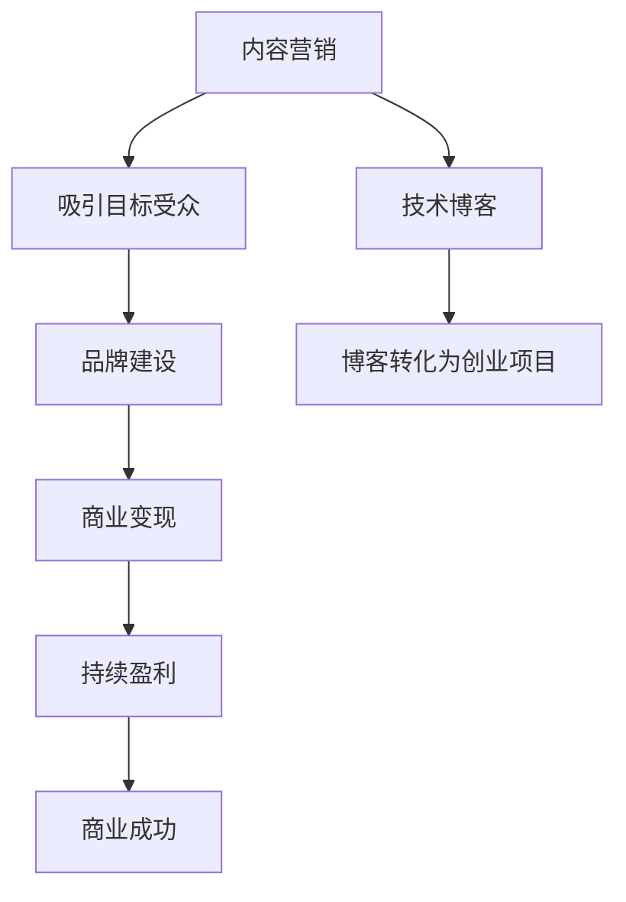

                 

# 程序员如何将技术博客转化为创业项目

> 关键词：技术博客、创业项目、内容营销、品牌建设、商业变现

> 摘要：本文将探讨程序员如何利用技术博客作为跳板，成功转化为创业项目。通过详细的分析和步骤指导，帮助程序员了解如何策划、执行和优化这一过程，实现从技术爱好者到创业者的转变。

## 1. 背景介绍

随着互联网的普及，技术博客已经成为程序员分享知识、展示技能的重要平台。然而，很多程序员仅仅将博客视为个人技能展示的工具，而忽视了其潜在的商业价值。实际上，通过有效的策划和执行，技术博客完全有能力转化为一个有影响力的创业项目。

本文将围绕以下几个核心问题展开：

- 如何选择合适的主题和方向？
- 如何通过内容营销吸引目标受众？
- 如何构建品牌形象，提升影响力？
- 如何实现商业变现，实现持续盈利？

通过对这些问题的深入探讨，希望为程序员提供一套完整的博客转化为创业项目的指南。

## 2. 核心概念与联系

在开始具体的操作之前，我们需要明确一些核心概念，这些概念将贯穿整个博客转化为创业项目的过程。

### 2.1 内容营销

内容营销是通过创造和分发有价值的内容来吸引潜在客户，建立品牌信任，并促进客户采取行动的一种营销策略。对于程序员来说，技术博客就是一种内容营销的载体。

### 2.2 品牌建设

品牌建设是创建和维持品牌形象的过程。一个好的品牌可以提升博客的影响力，增加用户黏性，甚至为未来的商业合作奠定基础。

### 2.3 商业变现

商业变现是将博客的内容和流量转化为实际收益的过程。常见的变现方式包括广告收入、赞助、课程销售、咨询服务等。

### 2.4 Mermaid 流程图

为了更好地理解这些概念之间的关系，我们可以使用 Mermaid 流程图来展示它们之间的联系。



## 3. 核心算法原理 & 具体操作步骤

### 3.1 选择主题和方向

首先，我们需要确定博客的主题和方向。这需要从以下几个方面进行考虑：

- **个人兴趣和专业知识**：选择你感兴趣且擅长的话题，这样可以保证你持续输出高质量的内容。
- **市场需求**：研究当前市场的需求，选择有潜力的主题，这样可以确保你的内容有足够的受众。
- **竞争情况**：了解同领域的竞争情况，选择一个独特且有价值的细分市场。

具体步骤如下：

1. **自我评估**：列出你的专业技能和兴趣爱好，筛选出最适合的领域。
2. **市场调研**：使用各种工具（如 Google Trends、SimilarWeb 等）来了解市场需求和竞争情况。
3. **制定计划**：根据调研结果，确定博客的主题和方向，制定长期和短期内容计划。

### 3.2 创建高质量内容

内容是博客的核心，高质量的内容可以吸引和留住读者。以下是创建高质量内容的几个关键步骤：

1. **内容策划**：根据博客的主题和方向，制定详细的内容策划方案，包括文章主题、发布频率等。
2. **研究和写作**：深入研究主题，确保你的内容具有深度和广度。同时，注意语言表达，尽量简洁明了。
3. **优化和发布**：对内容进行优化，包括关键词、标题、摘要等，确保内容易于搜索和阅读。然后，按照计划发布内容。

### 3.3 内容营销和推广

内容创作完成后，我们需要通过有效的营销和推广策略来吸引目标受众。

1. **社交媒体**：利用社交媒体平台（如 Twitter、LinkedIn、GitHub 等）分享你的博客内容，增加曝光度。
2. **合作与联盟**：与其他博主或企业合作，通过互相推广来扩大影响力。
3. **邮件营销**：建立邮件列表，定期向订阅者发送内容更新和优惠信息。

### 3.4 构建品牌形象

品牌形象是博客成功的关键。以下是一些构建品牌形象的策略：

1. **视觉设计**：设计一个独特且专业的博客界面，包括Logo、配色方案、字体等。
2. **内容风格**：保持内容的一致性和专业性，树立博客的专业形象。
3. **社交媒体**：在社交媒体上保持活跃，与读者建立良好的互动关系。

### 3.5 商业变现

在构建起一定的读者基础和品牌形象后，我们可以开始探索商业变现的途径。

1. **广告收入**：通过Google AdSense、Media.net等广告平台，在博客中插入相关广告。
2. **赞助和合作**：与相关企业合作，通过赞助内容或联合推广来获得收入。
3. **课程销售**：创建和销售在线课程，分享你的专业知识和经验。
4. **咨询服务**：提供专业咨询服务，解决读者在技术问题上的困惑。

## 4. 数学模型和公式 & 详细讲解 & 举例说明

在博客转化为创业项目的过程中，我们可以使用一些数学模型和公式来评估和优化我们的策略。以下是一些常用的模型和公式：

### 4.1 用户留存率

用户留存率是衡量博客成功的重要指标之一。它表示在一定时间内，返回博客的用户的比例。计算公式如下：

$$
用户留存率 = \frac{返回用户数}{总用户数} \times 100\%
$$

举例说明：

假设一个博客在一个月内有1000个独立访客，其中200个访客在接下来的一个月内再次访问了博客。那么，该博客的用户留存率为：

$$
用户留存率 = \frac{200}{1000} \times 100\% = 20\%
$$

### 4.2 转化率

转化率是衡量博客内容吸引力和营销效果的重要指标。它表示访客中完成特定目标（如购买、订阅等）的比例。计算公式如下：

$$
转化率 = \frac{完成目标用户数}{总访客数} \times 100\%
$$

举例说明：

假设一个博客的访客中有100人完成了订阅操作，总访客数为1000人。那么，该博客的订阅转化率为：

$$
转化率 = \frac{100}{1000} \times 100\% = 10\%
$$

### 4.3 ROI（投资回报率）

ROI是评估商业变现效果的重要指标。它表示投入与回报的比率。计算公式如下：

$$
ROI = \frac{净利润}{总投资} \times 100\%
$$

举例说明：

假设一个博客的总投资为5000元，通过广告收入和其他渠道获得的总收入为8000元。那么，该博客的ROI为：

$$
ROI = \frac{8000 - 5000}{5000} \times 100\% = 60\%
$$

## 5. 项目实战：代码实际案例和详细解释说明

### 5.1 开发环境搭建

在开始项目之前，我们需要搭建一个合适的开发环境。以下是搭建过程：

1. 安装Python环境：在终端中输入以下命令安装Python：

   ```bash
   pip install python
   ```

2. 安装Markdown编辑器：选择一个适合你的Markdown编辑器，如Typora或VS Code，并安装相应的插件。

### 5.2 源代码详细实现和代码解读

以下是一个简单的Markdown博客搭建示例代码：

```python
# 导入相关库
import markdown
import os

# 读取Markdown文件
def read_md(file_path):
    with open(file_path, 'r', encoding='utf-8') as f:
        content = f.read()
    return content

# 转换Markdown为HTML
def convert_to_html(md_content):
    html_content = markdown.markdown(md_content)
    return html_content

# 保存HTML文件
def save_html(file_path, html_content):
    with open(file_path, 'w', encoding='utf-8') as f:
        f.write(html_content)

# 主函数
def main():
    md_file_path = 'example.md'
    html_file_path = 'example.html'
    
    # 读取Markdown文件
    md_content = read_md(md_file_path)
    
    # 转换Markdown为HTML
    html_content = convert_to_html(md_content)
    
    # 保存HTML文件
    save_html(html_file_path, html_content)

    print("博客生成成功！")

# 运行主函数
if __name__ == '__main__':
    main()
```

### 5.3 代码解读与分析

1. **功能解读**：该代码实现了Markdown文件的读取、转换和保存功能。首先，我们导入相关的库，然后定义了三个函数：`read_md`用于读取Markdown文件，`convert_to_html`用于将Markdown内容转换为HTML，`save_html`用于保存生成的HTML文件。

2. **具体实现**：

   - `read_md`函数：使用`open`函数读取Markdown文件，并将其内容存储在变量`md_content`中。

   - `convert_to_html`函数：使用`markdown.markdown`函数将Markdown内容转换为HTML，并将其存储在变量`html_content`中。

   - `save_html`函数：使用`open`函数将HTML内容写入指定的HTML文件。

3. **性能分析**：该代码的性能主要取决于Markdown文件的读取速度和转换速度。在实际应用中，我们可以考虑使用更高效的库来提升性能，如`markdown2`或`markdownify`。

## 6. 实际应用场景

### 6.1 教育培训

技术博客可以作为教育培训的平台，程序员可以通过博客分享自己的专业知识和技术经验，吸引对技术有兴趣的学习者。例如，创建一个关于Python学习的博客，分享Python编程的基础知识和实战案例，吸引对Python感兴趣的读者。

### 6.2 技术交流

技术博客也可以作为一个技术交流的平台，程序员可以在博客中分享自己的技术心得和见解，与同行进行交流。例如，创建一个关于前端开发的博客，分享前端技术的新趋势和最佳实践，吸引前端开发者加入讨论。

### 6.3 商业变现

技术博客可以通过多种方式实现商业变现，如广告收入、赞助、课程销售和咨询服务等。例如，一个专注于大数据技术的博客可以通过推广大数据相关的课程和工具，获得广告收入和课程销售收益。

## 7. 工具和资源推荐

### 7.1 学习资源推荐

- **书籍**：《Python编程：从入门到实践》、《深入理解计算机系统》
- **论文**：《计算机网络：自顶向下方法》、《分布式系统概念与设计》
- **博客**：Scot hype、The Morning Paper
- **网站**：Stack Overflow、GitHub

### 7.2 开发工具框架推荐

- **Markdown编辑器**：Typora、VS Code
- **静态网站生成器**：Jekyll、Hexo
- **内容管理系统**：WordPress、Blogger
- **广告平台**：Google AdSense、Media.net

### 7.3 相关论文著作推荐

- 《大数据之路：阿里巴巴大数据实践》
- 《深入理解LINUX网络技术内幕》
- 《深度学习：卷积神经网络与视觉感知》

## 8. 总结：未来发展趋势与挑战

### 8.1 发展趋势

- **内容多样化**：随着技术的进步和市场需求的变化，博客内容将越来越多样化，涵盖更多领域和层次。
- **自动化与智能化**：利用人工智能和机器学习技术，博客的自动化运营和个性化推荐将得到广泛应用。
- **社区化**：博客将逐步走向社区化，形成更加紧密的作者和读者关系，促进技术交流和合作。

### 8.2 挑战

- **内容质量**：保持高质量的内容输出是一个长期且艰巨的任务，需要持续的学习和积累。
- **市场竞争**：随着越来越多的程序员加入博客领域，市场竞争将越来越激烈，需要不断创新和优化策略。
- **法律法规**：博客内容的合规性和版权问题将越来越受到关注，需要了解和遵守相关的法律法规。

## 9. 附录：常见问题与解答

### 9.1 如何保持内容更新？

- **制定计划**：制定详细的内容发布计划，确保定期更新。
- **提前准备**：提前准备和撰写内容，确保在需要发布时能够迅速更新。
- **合作与互助**：与其他博主或团队成员合作，共同分担内容创作和更新的任务。

### 9.2 如何应对同质化竞争？

- **细分市场**：选择一个独特的细分市场，提供差异化的内容。
- **专业深耕**：在一个领域内深耕细作，成为该领域的专家。
- **用户互动**：积极与读者互动，了解他们的需求和反馈，不断优化内容。

## 10. 扩展阅读 & 参考资料

- 《内容创业：如何利用自媒体平台打造个人品牌》
- 《从技术爱好者到创业者：程序员如何实现职业转型》
- 《技术博客：如何创建、运营和盈利》

### 作者

- 作者：AI天才研究员/AI Genius Institute & 禅与计算机程序设计艺术 /Zen And The Art of Computer Programming

