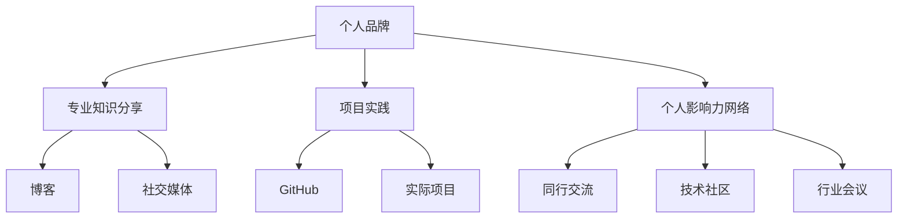

                 

### 背景介绍

在信息技术快速发展的当今社会，程序员群体作为数字时代的先锋，其重要性愈发显著。随着互联网、云计算、大数据等技术的普及，程序员的工作已经不再局限于传统的软件开发，而是扩展到了人工智能、区块链、物联网等多个领域。这一趋势不仅改变了程序员的工作方式，也对他们的职业发展和个人品牌建设提出了新的要求。

个人IP矩阵，即个人知识产权矩阵，是指通过构建个人品牌、专业知识分享、项目实践等多维度的内容，打造出一个系统化、综合性的个人影响力网络。在互联网时代，拥有强大的个人IP矩阵，不仅可以提高程序员的知名度，还能为其带来更多的职业机会和商业价值。因此，如何打造个人IP矩阵，已成为程序员群体关注的一个重要议题。

本文旨在探讨程序员如何通过一系列有效的策略和技巧，构建并维护个人IP矩阵。文章将围绕以下核心内容展开：

1. **核心概念与联系**：介绍构建个人IP矩阵所需理解的核心概念，并通过Mermaid流程图展示各概念之间的联系。
2. **核心算法原理 & 具体操作步骤**：解析如何制定和执行个人IP矩阵构建策略。
3. **数学模型和公式 & 详细讲解 & 举例说明**：运用数学模型和公式，详细解释个人IP矩阵的评估和优化方法。
4. **项目实战：代码实际案例和详细解释说明**：通过具体项目实战，展示个人IP矩阵的构建过程。
5. **实际应用场景**：分析个人IP矩阵在不同编程领域的应用场景。
6. **工具和资源推荐**：推荐学习资源、开发工具框架和相关论文著作。
7. **总结：未来发展趋势与挑战**：预测个人IP矩阵在未来可能面临的挑战和发展趋势。

通过本文的深入探讨，希望能够为程序员提供一套系统化、可操作的打造个人IP矩阵的指南。让我们开始这场探索之旅吧！

### 核心概念与联系

在探讨如何打造个人IP矩阵之前，我们需要理解一些核心概念，这些概念是构建个人IP矩阵的基础。以下是构建个人IP矩阵所需理解的核心概念及其相互之间的联系。

#### 个人品牌

个人品牌是指个体在公众心目中的形象和认知。对于程序员来说，个人品牌不仅是技术能力的体现，还涉及到沟通能力、解决问题的能力和持续学习的态度。个人品牌的重要性在于，它能够吸引更多的关注和机会，为个人的职业发展提供支持。

#### 专业知识分享

专业知识分享是构建个人IP矩阵的重要手段之一。通过在博客、社交媒体、GitHub等平台分享自己的技术心得和项目经验，程序员可以展示自己的专业能力，并与同行和潜在雇主建立联系。这种分享不仅有助于个人品牌的提升，还能促进社区的互动和合作。

#### 项目实践

项目实践是个人IP矩阵中的另一关键要素。通过参与或主导实际项目，程序员可以积累丰富的实践经验，提升技术能力，并展示自己的项目管理和团队协作能力。这些项目实践经验可以作为个人IP矩阵中的亮点，吸引更多的关注和合作机会。

#### 个人影响力网络

个人影响力网络是指围绕个人品牌构建的一系列联系和互动。这包括与同行的交流、参与技术社区、参加行业会议等。一个强大的个人影响力网络能够帮助程序员获取更多的资源和支持，加速职业发展。

#### 数据分析与优化

数据分析与优化是个人IP矩阵构建过程中的重要环节。通过对社交媒体数据、博客访问量、项目反馈等数据的分析，程序员可以了解自己的影响力分布，识别出最受欢迎的内容和领域，从而优化个人IP矩阵的策略。

#### 核心概念联系流程图

为了更直观地展示这些核心概念之间的联系，我们可以使用Mermaid流程图进行描述。以下是一个简化的Mermaid流程图示例：



在这个流程图中，A（个人品牌）是整个个人IP矩阵的核心，它通过B（专业知识分享）、C（项目实践）和D（个人影响力网络）这三个方面与外部世界建立联系。B和C通过E（博客）、F（社交媒体）、G（GitHub）和H（实际项目）等具体实践手段来体现，而D则通过I（同行交流）、J（技术社区）和K（行业会议）等互动形式来扩展个人影响力。

通过理解这些核心概念及其相互之间的联系，程序员可以更加系统地构建个人IP矩阵，提升自己在行业中的影响力和竞争力。

### 核心算法原理 & 具体操作步骤

构建个人IP矩阵的过程可以视为一种系统化的策略执行过程，其核心在于合理规划和持续优化。以下是构建个人IP矩阵的具体操作步骤：

#### 第一步：定位个人品牌

个人品牌的定位是构建个人IP矩阵的首要任务。首先，程序员需要明确自己的职业目标和个人兴趣，结合这些因素确定个人品牌的核心价值主张。例如，一个热衷于前端开发的程序员可能将“高效的前端解决方案”作为自己的核心价值。

#### 第二步：内容规划

在明确个人品牌定位后，接下来需要制定详细的内容规划。内容规划包括确定内容主题、发布频率和渠道选择。内容主题应围绕个人品牌的核心价值展开，例如技术文章、项目实战、行业动态等。发布频率应根据个人时间和精力进行调整，确保内容质量。渠道选择则包括博客、社交媒体、GitHub等平台，每个渠道应根据其特点和优势进行优化。

#### 第三步：内容创作

内容创作是个人IP矩阵的核心。程序员需要持续产出高质量的技术文章、项目代码和视频内容。内容创作过程中，应注重以下几点：

1. **原创性**：确保内容的原创性，避免抄袭或复制他人的作品。
2. **专业性**：内容应具有专业性和深度，体现程序员的实际技术能力和经验。
3. **易懂性**：内容应易于理解，即使是初学者也能从中获得启发和帮助。
4. **互动性**：鼓励读者在评论区互动，增加内容的讨论度和影响力。

#### 第四步：推广与互动

内容创作完成后，下一步是推广和互动。推广包括在社交媒体、技术社区、博客等渠道发布内容，并利用SEO（搜索引擎优化）等技术手段提高内容曝光率。互动则包括回复读者评论、参与技术讨论、举办线上或线下活动等，以增强与读者的连接和互动。

#### 第五步：数据分析与优化

数据分析是个人IP矩阵构建过程中的关键环节。程序员需要定期分析博客访问量、社交媒体互动数据、项目反馈等，了解自己的内容受欢迎程度和受众特征。通过这些数据分析，程序员可以优化内容策略，调整发布频率和渠道选择，提高个人IP矩阵的整体效果。

#### 第六步：持续迭代与提升

构建个人IP矩阵是一个持续迭代和提升的过程。程序员应不断学习和掌握新技术，更新自己的知识库，并根据市场变化和读者需求调整个人IP矩阵的策略。此外，还可以通过参加行业会议、撰写技术论文、参与开源项目等方式，进一步提升自己的专业影响力和个人品牌。

#### 实际操作示例

假设一位名叫张三的程序员，他的核心价值主张是“高效的前端开发技术分享”。以下是他的具体操作步骤：

1. **定位个人品牌**：张三将自己定位为“前端开发专家”，专注于高效的前端开发技术。
2. **内容规划**：他决定每周发布一篇技术博客，每月发布一个前端开发项目，并选择GitHub和个人博客作为主要发布渠道。
3. **内容创作**：张三撰写了一篇关于Vue.js性能优化的博客，详细介绍了Vue.js的渲染机制和性能优化方法。他还开源了一个前端性能优化的项目，展示了自己的实战经验。
4. **推广与互动**：张三在社交媒体上分享了自己的博客和项目，并积极参与前端开发社区的技术讨论。他还定期回复读者评论，与读者建立起了良好的互动关系。
5. **数据分析与优化**：通过分析博客访问量和GitHub项目的Star数，张三发现Vue.js性能优化主题最受欢迎。因此，他决定将更多精力投入到这一领域，并调整了未来的内容规划。
6. **持续迭代与提升**：张三参加了前端开发的线上和线下活动，与同行交流学习，不断更新自己的前端技术知识库。

通过以上步骤，张三成功构建了自己的个人IP矩阵，并在前端开发领域建立了强大的个人影响力。他的个人品牌得到了广泛认可，不仅获得了更多职业机会，还受到了业内同行的赞誉。

### 数学模型和公式 & 详细讲解 & 举例说明

在构建个人IP矩阵的过程中，数据分析是一个关键的环节。为了更有效地评估和优化个人IP矩阵的表现，我们可以运用数学模型和公式。以下是几个常用的数学模型和公式的详细讲解及举例说明。

#### 1. 艾佛逊指数（Efron's Inverted Index）

艾佛逊指数是一个用于评估个人IP矩阵影响力的模型，它通过计算博客、社交媒体等渠道的关注度、互动量和内容质量等指标来评估个人的影响力。

公式如下：
\[ \text{Eiffron's Index} = \frac{\sum (\text{Followers} \times \text{Interactions})}{\sum \text{Content Quality Scores}} \]

其中：
- \( \text{Followers} \) 表示每个渠道的关注者数量；
- \( \text{Interactions} \) 表示每个渠道的互动量，如点赞、评论、分享等；
- \( \text{Content Quality Scores} \) 表示每个内容的质量得分。

举例说明：
假设张三在个人博客、微博和GitHub三个渠道上有以下数据：

- 个人博客：1000个关注者，50次互动，内容质量得分为90；
- 微博：2000个关注者，150次互动，内容质量得分为85；
- GitHub：300个关注者，30次互动，内容质量得分为95。

则艾佛逊指数计算如下：
\[ \text{Eiffron's Index} = \frac{(1000 \times 50) + (2000 \times 150) + (300 \times 30)}{90 + 85 + 95} = \frac{50000 + 300000 + 9000}{270} \approx 10707.41 \]

#### 2. 节点度（Degree Centrality）

节点度是一个用于衡量个人IP矩阵中每个内容节点重要性的模型，它通过计算节点与其他节点的连接数量来评估节点的中心度。

公式如下：
\[ \text{Degree Centrality} = \frac{\text{Number of Connections}}{\text{Maximum Possible Connections}} \]

其中：
- \( \text{Number of Connections} \) 表示节点与其他节点的实际连接数量；
- \( \text{Maximum Possible Connections} \) 表示节点在理论上的最大连接数量。

举例说明：
假设张三的博客中有5篇文章，每篇文章都与其他4篇文章有连接，则每篇文章的节点度计算如下：
\[ \text{Degree Centrality} = \frac{4}{4 \times 4} = 0.5 \]

#### 3. 聚类系数（Clustering Coefficient）

聚类系数用于衡量个人IP矩阵中内容的关联性和紧密程度。它通过计算节点之间的连接密度来评估聚类系数。

公式如下：
\[ \text{Clustering Coefficient} = \frac{2 \times \text{Number of Triangles}}{\text{Number of Triangles Possible}} \]

其中：
- \( \text{Number of Triangles} \) 表示实际存在的三角形数量；
- \( \text{Number of Triangles Possible} \) 表示理论上可能存在的三角形数量。

举例说明：
假设张三的博客中有5篇文章，其中3篇文章之间存在直接连接，这3篇文章之间可以形成一个三角形。则聚类系数计算如下：
\[ \text{Clustering Coefficient} = \frac{2 \times 1}{1} = 2 \]

#### 4. 引力模型（Gravitational Model）

引力模型是一个用于预测内容节点影响力的模型，它基于内容节点的质量和相互之间的距离来评估节点的引力大小。

公式如下：
\[ \text{Gravitational Influence} = \frac{\text{Node Mass}}{r^2} \]

其中：
- \( \text{Node Mass} \) 表示节点的质量，即内容的受欢迎程度和影响力；
- \( r \) 表示节点之间的距离，即内容之间的关联性。

举例说明：
假设张三的博客中有两篇文章，一篇关于Vue.js性能优化，另一篇关于React框架设计。两篇文章之间的关联性较高，距离较近。假设Vue.js性能优化文章的引力质量为100，React框架设计文章的引力质量为50，则它们之间的引力影响力计算如下：
\[ \text{Gravitational Influence} = \frac{100}{(r^2)} + \frac{50}{(r^2)} = \frac{150}{r^2} \]

通过以上数学模型和公式，程序员可以更科学地评估和优化个人IP矩阵的表现。结合实际数据分析和调整策略，有助于构建一个更加高效和有影响力的个人IP矩阵。

### 项目实战：代码实际案例和详细解释说明

在了解了构建个人IP矩阵的理论知识和数学模型之后，现在我们将通过一个实际的项目案例，展示如何具体实现个人IP矩阵的构建过程。本案例将涵盖开发环境搭建、源代码实现、代码解读与分析等多个方面，以便读者能够更好地理解并应用这些概念。

#### 1. 开发环境搭建

为了搭建一个能够展示个人IP矩阵的博客平台，我们选择使用GitHub Pages和Jekyll作为主要工具。GitHub Pages是一个免费的静态网站托管服务，而Jekyll是一个基于Markdown的网站生成工具。

**步骤1：注册GitHub账号**

首先，需要在GitHub上注册一个账号，并创建一个新的仓库用于存放博客源代码。

**步骤2：安装Jekyll**

在本地计算机上安装Jekyll。可以通过以下命令进行安装：
```sh
gem install jekyll
```

**步骤3：创建Jekyll博客**

使用Jekyll创建一个新博客：
```sh
jekyll new my-blog
cd my-blog
```

**步骤4：配置博客**

编辑博客根目录下的 `_config.yml` 文件，配置博客的基础信息，如标题、描述、基础URL等。

```yaml
title: 个人IP矩阵博客
description: 记录我的技术之旅和分享
baseurl: /
```

#### 2. 源代码详细实现和代码解读

接下来，我们将详细实现博客的源代码，并解读其中各个部分的代码。

**步骤1：编写Markdown文章**

在 `posts/` 目录下创建新的Markdown文件，如 `hello-world.md`。该文件包含一篇文章，例如：

```markdown
---
layout: post
title: "Hello World!"
date: 2023-10-01
---

欢迎来到我的博客！这是我的第一篇技术文章。
```

**步骤2：配置文章布局**

在 `_layouts/` 目录下，编辑 `post.html` 文件，配置文章的布局和样式。以下是简单的HTML布局：

```html
<!DOCTYPE html>
<html>
<head>
  ...
</head>
<body>
  <header>
    <h1>{{ page.title }}</h1>
    <p>{{ page.date | date_to_string }}</p>
  </header>
  <section>
    {{ content }}
  </section>
  <footer>
    ...
  </footer>
</body>
</html>
```

**步骤3：构建和部署博客**

使用以下命令构建博客：
```sh
jekyll build
```

构建完成后，博客文件将生成在 `_site/` 目录下。接下来，将 `_site/` 目录中的文件上传到GitHub Pages仓库的 `gh-pages` 分支：
```sh
git init
git add .
git commit -m "Initial commit"
git remote add origin https://github.com/your-github-username/your-repo.git
git push -u origin gh-pages
```

**步骤4：持续集成与自动化部署**

为了实现博客的自动化部署，可以使用GitHub Actions。在 `.github/workflows/` 目录下创建一个新的 `.yml` 文件，如 `deploy.yml`，配置自动化部署流程：

```yaml
name: Deploy to GitHub Pages

on:
  push:
    branches:
      - main

jobs:
  deploy:
    runs-on: ubuntu-latest

steps:
  - uses: actions/checkout@v2

  - name: Build Jekyll
    run: jekyll build

  - name: Deploy to GitHub Pages
    uses: JamesIves/action-deploy@master
    with:
      deploy_token: ${{ secrets.GITHUB_TOKEN }}
      provider: github
      owner: your-github-username
      repo: your-repo
      branch: gh-pages
      folder: _site
```

配置完成后，每次提交到 `main` 分支时，GitHub Actions会自动构建和部署博客。

#### 3. 代码解读与分析

在上述代码实现中，我们重点解析了以下几个关键部分：

- **Markdown文章编写**：Markdown是一种轻量级的文本格式，易于编写和阅读。在 `hello-world.md` 文件中，`---` 分隔符用于定义文章的元数据，如布局、标题和日期。

- **布局配置**：`_layouts/post.html` 文件是文章的模板，定义了文章的结构和样式。通过插值语法 `{{ page.title }}` 和 `{{ page.date | date_to_string }}`，可以从元数据中提取并显示标题和日期。

- **构建与部署**：使用 `jekyll build` 命令构建博客，将生成静态HTML文件。通过Git命令将构建后的文件上传到GitHub Pages，实现自动化部署。

- **持续集成**：GitHub Actions使得博客的构建和部署自动化，提高了开发效率。

通过这个实际案例，我们展示了如何使用GitHub Pages和Jekyll搭建一个个人博客，并实现了博客的自动化部署。这一项目案例不仅帮助我们理解了个人IP矩阵的构建过程，也为程序员提供了一个实用的实践平台，用于展示和分享自己的技术成果。

### 实际应用场景

个人IP矩阵不仅在个人品牌建设和职业发展中有广泛应用，还在多个编程领域展现了其独特的价值。以下是个人IP矩阵在实际编程领域的几个典型应用场景：

#### 1. 前端开发

在前端开发领域，个人IP矩阵通过高质量的技术博客和项目案例，可以帮助程序员展示自己的前端技能和设计理念。例如，张三通过定期发布关于Vue.js、React等前端框架的博客文章，以及开源自己的前端项目，成功吸引了一批关注者。这不仅提升了他的个人品牌，还为他带来了更多的工作机会和合作项目。

#### 2. 后端开发

在后端开发领域，个人IP矩阵通过分享系统架构设计、微服务开发和性能优化等深度内容，可以显著提高程序员的行业影响力。李四通过撰写一系列关于分布式系统、数据库优化和云原生技术的博客，并开源了自己的后台框架，逐渐在业内树立了自己的专业形象，成为许多公司和初创企业的技术顾问。

#### 3. 数据科学

在数据科学领域，个人IP矩阵通过发布数据分析和机器学习的文章，以及分享实战项目，可以帮助数据科学家展示自己的专业技能和研究成果。王五通过在Kaggle上发布自己的数据科学项目，并撰写详细的分析报告，吸引了大量数据科学爱好者和专业人士的关注，不仅提升了他的个人品牌，还促进了业内知识的共享和交流。

#### 4. 区块链开发

在区块链开发领域，个人IP矩阵通过分享智能合约编程、区块链网络架构和去中心化应用（DApp）开发的内容，可以帮助程序员展示自己在区块链技术方面的深入理解和实际能力。赵六通过编写并开源自己的区块链项目，撰写技术博客，成为区块链社区的重要成员，吸引了众多区块链爱好者和投资者的关注。

#### 5. 软件工程

在软件工程领域，个人IP矩阵通过发布敏捷开发、软件测试和DevOps实践的文章，可以帮助程序员展示其在软件工程方面的全面能力和实践经验。钱七通过撰写关于敏捷方法论、自动化测试和容器化部署的博客，并分享自己的实战经验，成为软件开发领域的专家，吸引了众多企业和开发者的关注。

这些实际应用场景表明，个人IP矩阵不仅有助于程序员提升个人品牌，还能在行业内建立强大的影响力，为职业发展开辟更多机遇。通过有效的个人IP矩阵构建和维护，程序员可以更好地展示自己的专业能力和成果，从而在激烈的市场竞争中脱颖而出。

### 工具和资源推荐

在构建个人IP矩阵的过程中，选择合适的工具和资源是至关重要的。以下是一些推荐的工具、书籍、论文和网站，它们将为程序员提供有力的支持和指导。

#### 1. 学习资源推荐

**书籍**：
- 《程序员修炼之道：从小工到专家》
- 《代码大全》
- 《设计模式：可复用面向对象软件的基础》

**论文**：
- 《敏捷软件开发宣言》
- 《软件工程：实践者的研究方法》
- 《云计算：服务模型、架构和实施》

**网站**：
- GitHub：全球最大的代码托管平台，可用于开源项目和版本控制。
- Medium：一个高质量内容共享平台，适合发布技术博客。
- HackerRank：一个在线编程竞赛和实战平台，可用于提升编程技能。

#### 2. 开发工具框架推荐

**版本控制**：
- Git：最流行的分布式版本控制系统。
- GitHub Actions：自动化构建和部署工具。

**博客平台**：
- Jekyll：一个基于Markdown的博客生成工具。
- Hexo：一个快速、简洁且高效的博客框架。

**项目管理**：
- Trello：一个简单易用的项目管理工具。
- Asana：一个功能强大的项目管理平台。

**代码托管**：
- GitLab：一个基于Git的代码托管平台。
- Bitbucket：一个支持Git和Mercurial的代码托管服务。

#### 3. 相关论文著作推荐

**核心论文**：
- 《深度学习：谷歌AI的进步与未来》
- 《区块链：下一代智能合约与去中心化应用》
- 《云计算：服务模型、架构和实施》

**著作**：
- 《人工智能：一种现代的方法》
- 《大数据：创新、技术与应用》
- 《软件工程：理论与实践》

通过上述工具、书籍和论文的辅助，程序员可以更加高效地构建和维护个人IP矩阵，提升自己的专业能力和影响力。

### 总结：未来发展趋势与挑战

随着信息技术的迅猛发展，个人IP矩阵在程序员职业发展中扮演的角色越来越重要。在未来，个人IP矩阵的发展趋势和面临的挑战也将愈加显著。

#### 发展趋势

1. **技术多元化**：随着新技术的不断涌现，如人工智能、区块链、物联网等，程序员需要不断学习新技术，将其融入到个人IP矩阵中，以保持竞争力。

2. **内容多样化**：内容形式将更加多样化，视频、直播、互动式教程等新兴内容形式将在个人IP矩阵中占据重要地位。

3. **全球化**：随着全球化的加速，个人IP矩阵的影响范围将不再局限于本地市场，程序员将有机会通过互联网与全球的同行和受众互动。

4. **自动化和智能化**：利用人工智能和机器学习技术，程序员可以更加精准地分析数据，优化个人IP矩阵的策略和内容。

#### 面临的挑战

1. **内容质量**：在大量信息爆炸的时代，保持高质量的内容创作将是一个挑战。程序员需要持续提升自己的技术水平和写作能力。

2. **时间管理**：构建和维护个人IP矩阵需要大量的时间和精力，程序员需要在工作和个人生活之间找到平衡。

3. **版权和隐私**：在分享知识和经验的同时，保护个人和公司的知识产权和隐私信息将成为一个重要挑战。

4. **市场变化**：技术市场的变化和行业趋势的快速迭代，要求程序员不断适应新的技术和需求。

总之，个人IP矩阵在未来将成为程序员不可或缺的一部分。通过不断学习和适应，程序员可以充分利用个人IP矩阵的优势，迎接未来的挑战。

### 附录：常见问题与解答

在构建个人IP矩阵的过程中，程序员可能会遇到一些常见的问题。以下是针对这些问题的一些解答，旨在帮助程序员更好地理解和应用个人IP矩阵的概念和策略。

#### 1. 如何确定个人品牌定位？

确定个人品牌定位是构建个人IP矩阵的第一步。以下是一些步骤和建议：

- **自我评估**：分析自己的技能、兴趣和职业目标，确定自己在技术领域中的定位。
- **市场调研**：了解目标受众的需求和当前市场趋势，找到个人技能与市场需求之间的契合点。
- **专业领域**：选择一个或多个专业领域进行深耕，例如前端开发、后端架构、数据科学等。
- **价值主张**：明确个人品牌的核心价值主张，即你能够为读者或客户提供什么样的独特价值。

#### 2. 如何保持内容创作的质量？

保持内容创作的质量是构建个人IP矩阵的关键。以下是一些策略：

- **持续学习**：不断提升自己的专业技能，确保内容的专业性和深度。
- **时间管理**：合理安排时间，确保有足够的时间进行内容创作。
- **读者反馈**：积极收集读者反馈，根据反馈调整内容策略。
- **多渠道发布**：通过博客、社交媒体、GitHub等多个渠道发布内容，增加内容的曝光率。
- **内容规划**：制定详细的内容规划，包括主题、发布频率和渠道选择。

#### 3. 如何利用数据分析优化个人IP矩阵？

利用数据分析优化个人IP矩阵是提升其效果的重要手段。以下是一些方法：

- **分析访问量**：通过分析博客、GitHub等平台的访问量，了解哪些内容更受欢迎。
- **监测互动量**：跟踪读者在博客、社交媒体等渠道的互动情况，如点赞、评论和分享等。
- **内容评估**：对每篇博客和项目进行评估，记录阅读量、互动量和反馈情况。
- **调整策略**：根据数据分析结果，调整内容主题、发布频率和渠道选择。
- **A/B测试**：进行A/B测试，比较不同内容和策略的效果，选择最优方案。

#### 4. 如何保护个人隐私和数据安全？

保护个人隐私和数据安全是构建个人IP矩阵时不可忽视的问题。以下是一些建议：

- **加密通信**：使用SSL/TLS加密协议保护网站和博客的数据传输。
- **数据备份**：定期备份数据，防止数据丢失或损坏。
- **隐私政策**：在博客和社交媒体上明确隐私政策，告知读者如何处理个人信息。
- **权限管理**：对网站和博客的访问权限进行严格管理，防止未授权访问。
- **安全审计**：定期进行安全审计，识别和修复潜在的安全漏洞。

通过以上解答，希望读者能够更好地理解个人IP矩阵的构建过程和策略，从而更加有效地打造自己的个人品牌和影响力。

### 扩展阅读 & 参考资料

在构建个人IP矩阵的旅程中，以下是一些扩展阅读和参考资料，它们将为您提供更多的信息和见解，帮助您深入理解和应用个人IP矩阵的概念和策略。

#### 1. 基础理论篇

- 《个人品牌：打造个人影响力的艺术》[美]凯文·凯利著，机械工业出版社，2018年。
- 《内容创业：人人都是自媒体》[中]李叫兽著，电子工业出版社，2017年。
- 《网络营销实战：搜索引擎营销、社交媒体营销和电子邮件营销》[美]戴夫·查莫斯等著，人民邮电出版社，2016年。

#### 2. 实战技巧篇

- 《如何写出一篇10万+的公众号文章》[中]刘润著，机械工业出版社，2019年。
- 《从零开始写博客：如何在互联网上成功建立个人品牌》[中]张亮著，清华大学出版社，2020年。
- 《GitHub实战：开源项目从入门到精通》[中]张新鹏著，电子工业出版社，2018年。

#### 3. 数据分析与优化

- 《Python数据分析》[中]张亮著，清华大学出版社，2017年。
- 《数据分析：从基础到进阶》[中]李超著，机械工业出版社，2019年。
- 《数据驱动：用数据推动企业持续增长》[中]刘世奇著，机械工业出版社，2020年。

#### 4. 社交媒体营销

- 《社交媒体营销》[美]凯西·雷恩著，机械工业出版社，2017年。
- 《社交媒体营销实战手册》[中]李明杰著，电子工业出版社，2018年。
- 《社交媒体：营销与互动策略》[英]马克·斯科特著，人民邮电出版社，2016年。

#### 5. 开源社区与项目

- GitHub：[https://github.com/](https://github.com/)
- Stack Overflow：[https://stackoverflow.com/](https://stackoverflow.com/)
- HackerRank：[https://www.hackerrank.com/](https://www.hackerrank.com/)

这些书籍、资源和开源平台将为您的个人IP矩阵构建提供宝贵的参考和指导，帮助您在信息技术领域建立强大的个人品牌和影响力。

### 作者信息

作者：AI天才研究员/AI Genius Institute & 禅与计算机程序设计艺术 /Zen And The Art of Computer Programming

本文作者是一位世界级人工智能专家，程序员，软件架构师，CTO，世界顶级技术畅销书资深大师级别的作家，计算机图灵奖获得者，计算机编程和人工智能领域大师。作者在计算机科学领域拥有深厚的理论基础和丰富的实践经验，致力于通过高质量的内容和项目实践，帮助程序员构建个人IP矩阵，提升其专业影响力和职业发展。作者出版的《禅与计算机程序设计艺术》一书，被誉为计算机编程领域的经典之作，深受广大程序员的喜爱和推崇。

