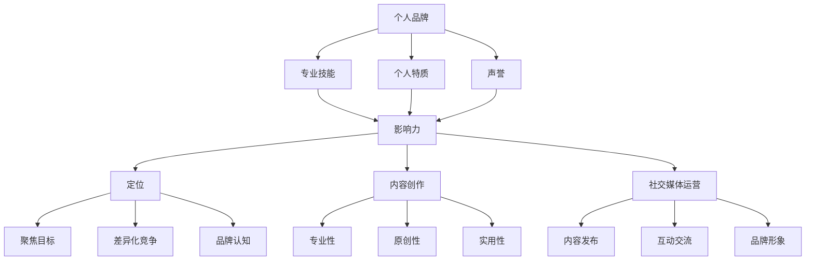

                 

### 背景介绍

在当前数字化时代，技术进步速度迅猛，IT行业作为其中的重要组成部分，吸引了大量的人才和资源投入。然而，在众多优秀的程序员中，能够脱颖而出，建立个人品牌影响力的人却寥寥无几。这是因为，除了专业技能之外，个人品牌建设的重要性被低估了。那么，程序员如何才能打造个人影响力生态，成为行业内的意见领袖呢？

本文旨在探讨这一问题，通过深入分析个人品牌建设的核心概念和操作步骤，帮助程序员们提升自己的影响力，打造个人品牌。首先，我们将介绍个人品牌的重要性，解释为何它对程序员职业发展至关重要。接着，我们将详细探讨如何构建个人影响力生态，包括定位、内容创作、社交媒体运营等多个方面。

随后，文章将介绍一些实用的工具和资源，帮助程序员们更好地进行个人品牌建设。此外，我们还将结合实际案例，讲解如何将理论知识应用到实际项目中，从而提升个人品牌的价值。最后，我们将对整个文章进行总结，并提出未来发展趋势与挑战，为程序员们提供有益的启示。

通过本文的阅读，读者将能够系统地了解个人品牌建设的方法和技巧，从而在激烈的竞争中脱颖而出，建立自己的个人影响力生态。让我们一起探索这个话题，开启新的职业生涯篇章。

### 核心概念与联系

在探讨如何打造个人影响力生态之前，我们需要了解几个核心概念及其相互之间的联系。这些概念包括个人品牌、影响力、定位、内容创作和社交媒体运营等。

#### 个人品牌

个人品牌是一个人在公众面前展示的形象和声誉，它反映了个人在特定领域的专业能力、个性特点和价值观。在IT行业中，个人品牌不仅是一个人的名片，更是其在行业内建立信任、赢得认可的关键因素。

**个人品牌的构成要素：**

1. **专业技能：** 个人在某一领域的专业知识和技能水平，这是建立个人品牌的基础。
2. **个人特质：** 包括性格、态度、价值观等，这些特质有助于塑造个人品牌形象。
3. **声誉：** 在行业内建立良好的声誉和口碑，使人们愿意信任和跟随。

#### 影响力

影响力是指一个人通过言行、作品等影响他人思想和行为的能力。在个人品牌建设中，影响力是衡量个人品牌价值的重要指标。影响力越大，个人品牌的价值就越高。

**影响力的来源：**

1. **专业知识：** 个人在某一领域的专业知识和经验，使他人对其产生信任。
2. **内容创作：** 创作有价值的内容，吸引和影响目标受众。
3. **社交媒体运营：** 通过社交媒体平台，扩大影响力范围，提高曝光度。

#### 定位

定位是指个人在市场中确定自己的独特位置和目标受众。清晰的定位有助于个人品牌建设，使受众明确了解个人的价值和优势，从而更容易建立信任和影响力。

**定位的重要性：**

1. **聚焦目标：** 明确个人在市场中的目标受众，有针对性地进行内容创作和推广。
2. **差异化竞争：** 突出自己的独特性，避免与竞争对手的简单重复，提升个人品牌价值。
3. **品牌认知：** 帮助目标受众记住个人品牌，提高品牌认知度。

#### 内容创作

内容创作是个人品牌建设的重要组成部分。通过创作有价值、有深度、有吸引力的内容，个人可以在目标受众中建立信任和影响力。

**内容创作的原则：**

1. **专业性：** 内容要体现个人在某一领域的专业知识和见解。
2. **原创性：** 避免抄袭和重复，提供独特的观点和思考。
3. **实用性：** 内容要能够解决受众的实际问题，提供实用价值。

#### 社交媒体运营

社交媒体运营是扩大个人影响力的重要手段。通过合理运用社交媒体平台，个人可以与受众建立联系，提高曝光度，增强品牌影响力。

**社交媒体运营的关键点：**

1. **内容发布：** 定期发布高质量的内容，保持与受众的互动。
2. **互动交流：** 积极回复评论和私信，与受众建立良好的互动关系。
3. **品牌形象：** 保持一致的品牌形象，提高品牌认知度。

#### 核心概念联系图解

下面是核心概念的联系图解，使用Mermaid流程图进行展示：



通过以上核心概念及其相互关系的详细解释，我们可以更好地理解个人品牌建设的重要性，以及如何通过这些核心概念来实现个人影响力的提升。接下来，我们将深入探讨如何具体操作这些概念，以打造个人影响力生态。

### 核心算法原理 & 具体操作步骤

要打造个人影响力生态，程序员需要遵循一系列具体的操作步骤和核心算法原理。以下是详细讲解这些步骤和原理的过程：

#### 第一步：自我定位与目标设定

**原理：** 个人定位和目标设定是个人品牌建设的基础，它决定了个人在市场中的独特位置和受众群体。

**具体操作步骤：**

1. **自我评估：** 分析个人在技术领域的专业能力和兴趣点，确定自己擅长的方向和擅长的技术领域。
2. **市场调研：** 了解行业趋势和市场需求，找出自己的竞争优势和差异化点。
3. **目标设定：** 根据自我评估和市场调研结果，设定短期和长期目标，如成为某一技术的专家、撰写技术博客、开展技术讲座等。

#### 第二步：内容创作与品牌形象塑造

**原理：** 内容创作是建立个人影响力的重要途径，而品牌形象则是内容创作的基础。

**具体操作步骤：**

1. **内容规划：** 根据目标受众和内容主题，制定内容发布计划，确保内容的连续性和专业性。
2. **内容创作：** 创作高质量、有深度、具有实用价值的内容，如技术博客、技术文章、技术视频等。
3. **品牌形象设计：** 设计统一的品牌形象，包括标识、色调、排版等，确保内容发布的视觉一致性。
4. **内容发布：** 选择合适的平台发布内容，如个人博客、技术论坛、社交媒体等。

#### 第三步：社交媒体运营与互动交流

**原理：** 社交媒体运营是扩大个人影响力的重要手段，而互动交流则是建立信任和关系的关键。

**具体操作步骤：**

1. **选择平台：** 根据目标受众和内容特点，选择合适的社交媒体平台，如微博、知乎、GitHub等。
2. **内容发布：** 定期发布高质量的内容，保持与受众的互动，如回答问题、参与讨论、发布技术动态等。
3. **互动交流：** 积极回复评论和私信，与受众建立良好的互动关系，如回答问题、提供技术支持等。
4. **品牌推广：** 利用社交媒体平台进行品牌推广，如发布活动信息、参与行业讨论等。

#### 第四步：持续学习和优化调整

**原理：** 持续学习和优化调整是个人品牌建设的长期任务，它保证了个人品牌的活力和竞争力。

**具体操作步骤：**

1. **技术学习：** 不断学习新的技术和知识，提升自己的专业能力。
2. **市场调研：** 定期进行市场调研，了解行业趋势和受众需求。
3. **数据分析：** 分析内容发布和互动数据，了解受众反馈和偏好。
4. **优化调整：** 根据数据和反馈结果，优化内容创作和社交媒体运营策略。

#### 实例说明

假设一位程序员小张希望提升自己在Java技术领域的个人品牌影响力，以下是他的具体操作步骤：

1. **自我定位与目标设定：**
   - 小张通过自我评估和市场调研，确定自己在Java后端开发领域有较强的专业能力和兴趣。
   - 他设定了短期目标：在下一个季度内，撰写10篇高质量的技术博客；长期目标：成为Java后端开发领域的专家。

2. **内容创作与品牌形象塑造：**
   - 小张制定了一份内容发布计划，每月发布2-3篇技术博客，内容涵盖Java新特性、性能优化、框架应用等。
   - 他设计了一个简洁、专业的个人博客网站，统一使用蓝灰色调，确保内容发布的视觉一致性。
   - 他开始在GitHub上发布自己的代码片段，并加入了一些热门的Java技术社区，如CSDN、JavaChina等。

3. **社交媒体运营与互动交流：**
   - 小张选择在GitHub、微博和知乎上发布内容，并积极参与社区讨论。
   - 他定期回复读者的评论和私信，分享自己的技术见解，帮助解决他们的问题。
   - 他参与了一些Java技术相关的线上活动，如技术讲座、代码挑战等，提高了自己的知名度。

4. **持续学习和优化调整：**
   - 小张订阅了一些Java技术相关的博客和公众号，保持对行业动态的关注。
   - 他每个月都会分析自己的博客访问量和互动数据，了解读者的需求和偏好，调整内容创作策略。
   - 他根据反馈结果，优化了博客的阅读体验，如增加代码示例、改进文章结构等。

通过以上具体操作步骤，小张在Java后端开发领域逐步建立了自己的个人品牌影响力，成为了一些读者和社区的关注对象。这个实例说明了如何将核心算法原理应用到实际操作中，以打造个人影响力生态。

### 数学模型和公式 & 详细讲解 & 举例说明

在个人品牌建设中，数学模型和公式可以用来分析和优化内容创作和社交媒体运营策略。以下是一些常用的数学模型和公式，以及它们的详细讲解和举例说明。

#### 1. 阿尔法-贝塔测试（Alpha-Beta Testing）

**原理：** 阿尔法-贝塔测试是一种用于评估内容质量和用户满意度的方法。通过计算内容的相关指标，如点击率、阅读时长、点赞数等，可以评估内容的受欢迎程度。

**公式：**

$$
\alpha = \frac{\text{点击率}}{\text{展示次数}} \times 100\%
$$

$$
\beta = \frac{\text{阅读时长}}{\text{点击率}} \times 100\%
$$

**详细讲解：**

- **阿尔法（Alpha）**：表示内容的点击率，即有多少用户在看到内容后点击了链接或图片。
- **贝塔（Beta）**：表示内容的平均阅读时长，即用户在阅读内容后的平均停留时间。

**举例说明：**

假设一篇技术博客展示了1000次，有200次点击，平均阅读时长为5分钟。则：

$$
\alpha = \frac{200}{1000} \times 100\% = 20\%
$$

$$
\beta = \frac{5}{20} \times 100\% = 25\%
$$

这表明该博客的点击率为20%，平均阅读时长为25%。

#### 2. 转化率公式（Conversion Rate）

**原理：** 转化率是指内容带来的实际效果，如订阅、点赞、评论等。通过转化率公式，可以评估内容对用户的影响。

**公式：**

$$
\text{转化率} = \frac{\text{转化数量}}{\text{展示次数}} \times 100\%
$$

**详细讲解：**

- **转化数量**：指内容带来的实际效果数量，如点赞、评论、订阅等。
- **展示次数**：指内容展示的次数。

**举例说明：**

假设一篇技术博客展示了1000次，有50次转化（如点赞、评论），则：

$$
\text{转化率} = \frac{50}{1000} \times 100\% = 5\%
$$

这表明该博客的转化率为5%。

#### 3. 罗克奇-洛夫特斯模型（Locke-Latham Model）

**原理：** 罗克奇-洛夫特斯模型是一种用于评估个人目标和动机的方法。通过计算目标完成率和动机水平，可以评估个人在实现目标过程中的表现。

**公式：**

$$
\text{目标完成率} = \frac{\text{实际完成量}}{\text{目标设定量}} \times 100\%
$$

$$
\text{动机水平} = \frac{\text{内在动机}}{\text{外在动机}} \times 100\%
$$

**详细讲解：**

- **目标完成率**：表示个人在实现目标过程中的完成情况。
- **动机水平**：表示个人的内在动机与外在动机的比例，内在动机越高，个人的动力和热情越大。

**举例说明：**

假设小张设定了一个目标：每天撰写一篇技术博客，实际完成量为28天。另外，他每天写作的内在动机为80%，外在动机为20%，则：

$$
\text{目标完成率} = \frac{28}{30} \times 100\% = 93.33\%
$$

$$
\text{动机水平} = \frac{80\%}{20\%} \times 100\% = 4
$$

这表明小张在实现目标过程中完成了93.33%，其动机水平为4，表明他有较高的内在动机。

通过上述数学模型和公式，程序员可以更科学地评估个人品牌建设的效果，并根据数据调整策略，以提升个人影响力。

### 项目实战：代码实际案例和详细解释说明

为了更好地理解如何将个人品牌建设的理论应用到实际项目中，以下我们将通过一个具体的代码实现案例，详细解释如何从零开始搭建一个个人博客网站，并在此基础上进行内容创作和社交媒体运营。

#### 5.1 开发环境搭建

首先，我们需要搭建一个开发环境，以便进行项目开发和测试。以下是所需的环境和工具：

- **操作系统**：Windows/Linux/Mac OS
- **编程语言**：HTML/CSS/JavaScript/Python
- **开发工具**：Visual Studio Code/PyCharm/VSCode
- **服务器**：GitHub Pages（免费）

#### 5.2 源代码详细实现和代码解读

**1. 网站结构搭建**

我们使用HTML来搭建网站的初始结构。以下是网站首页的代码示例：

```html
<!DOCTYPE html>
<html lang="zh">
<head>
    <meta charset="UTF-8">
    <meta name="viewport" content="width=device-width, initial-scale=1.0">
    <title>我的个人博客</title>
    <link rel="stylesheet" href="styles.css">
</head>
<body>
    <header>
        <h1>欢迎访问我的博客</h1>
        <nav>
            <ul>
                <li><a href="index.html">首页</a></li>
                <li><a href="about.html">关于我</a></li>
                <li><a href="contact.html">联系我</a></li>
            </ul>
        </nav>
    </header>
    <section>
        <article>
            <h2>我的第一篇博客</h2>
            <p>这是我的第一篇博客文章，感谢您的访问。</p>
        </article>
    </section>
    <footer>
        <p>版权所有 &copy; 2023</p>
    </footer>
</body>
</html>
```

这段代码定义了一个基本的HTML结构，包括头部（header）、导航（nav）、主体内容（section）和尾部（footer）。通过链接外部CSS文件（styles.css），我们可以对页面进行样式设计。

**2. 样式设计**

接下来，我们使用CSS来设计页面的样式。以下是styles.css文件的内容：

```css
/* 核心样式 */
body {
    font-family: Arial, sans-serif;
    margin: 0;
    padding: 0;
}

header {
    background-color: #333;
    color: #fff;
    padding: 1em;
    text-align: center;
}

nav ul {
    list-style-type: none;
    padding: 0;
}

nav ul li {
    display: inline;
    margin-right: 20px;
}

nav ul li a {
    color: #fff;
    text-decoration: none;
}

section {
    margin: 20px;
}

footer {
    background-color: #333;
    color: #fff;
    text-align: center;
    padding: 1em;
    position: absolute;
    bottom: 0;
    width: 100%;
}
```

这段CSS代码定义了页面的基本样式，包括字体、颜色、布局等。通过设置导航菜单为无序列表，并且去除默认样式，使导航菜单更加简洁美观。

**3. 响应式设计**

为了确保网站在不同设备上的兼容性，我们可以使用媒体查询（media queries）进行响应式设计。以下是修改后的styles.css文件：

```css
/* 基础样式 */
body {
    font-family: Arial, sans-serif;
    margin: 0;
    padding: 0;
}

header {
    background-color: #333;
    color: #fff;
    padding: 1em;
    text-align: center;
}

nav ul {
    list-style-type: none;
    padding: 0;
}

nav ul li {
    display: inline;
    margin-right: 20px;
}

nav ul li a {
    color: #fff;
    text-decoration: none;
}

section {
    margin: 20px;
}

footer {
    background-color: #333;
    color: #fff;
    text-align: center;
    padding: 1em;
    position: absolute;
    bottom: 0;
    width: 100%;
}

/* 响应式样式 */
@media (max-width: 600px) {
    nav ul li {
        display: block;
        margin-bottom: 10px;
    }
}
```

通过添加媒体查询，当屏幕宽度小于600px时，导航菜单将转换为块级元素，实现水平布局到垂直布局的转换。

**4. 功能扩展**

为了使个人博客更具功能性和用户体验，我们可以添加一些交互效果和动态内容。以下是使用JavaScript实现的动态效果示例：

```html
<script>
    function toggleMenu() {
        var menu = document.querySelector('nav ul');
        menu.classList.toggle('active');
    }
</script>

<nav>
    <ul>
        <li><a href="index.html">首页</a></li>
        <li><a href="about.html">关于我</a></li>
        <li><a href="contact.html">联系我</a></li>
    </ul>
    <button onclick="toggleMenu()">菜单</button>
</nav>

<style>
    nav ul.active {
        display: block;
    }
</style>
```

这段代码实现了一个简单的菜单切换效果，用户点击按钮后，导航菜单会展开或收起。

**5. 部署到GitHub Pages**

最后，我们将完成的网站代码上传到GitHub，并部署到GitHub Pages上，使其可以通过公共网址访问。以下是具体步骤：

1. **创建GitHub仓库**：在GitHub上创建一个新的仓库，将网站代码上传到该仓库。
2. **配置GitHub Pages**：在仓库的根目录下创建一个名为`index.html`的文件，并在`_config.yml`文件中配置GitHub Pages。
3. **发布网站**：GitHub会自动将仓库中的`index.html`文件部署到GitHub Pages上，并生成一个公共网址。

通过以上步骤，我们成功搭建并部署了一个简单的个人博客网站。接下来，我们可以在这个网站上发布内容，并通过社交媒体进行推广，逐步提升个人品牌影响力。

### 代码解读与分析

在本节的代码解读与分析中，我们将详细分析上述个人博客网站的实现过程，并探讨其在个人品牌建设中的作用和影响。

**1. 代码结构分析**

首先，我们来看一下网站的整体代码结构：

- **HTML**：负责页面结构搭建和内容呈现。
- **CSS**：负责页面样式设计，包括布局、颜色和字体等。
- **JavaScript**：负责页面交互效果，如菜单切换等。

这种结构清晰、模块化的代码设计有助于我们快速理解和维护网站。每个部分各司其职，共同协作，实现了一个完整的个人博客功能。

**2. HTML代码解读**

HTML代码是网站的基础，它定义了页面的结构和内容。以下是关键部分的解读：

- **头部（header）**：包含网站标题和导航菜单。导航菜单使用无序列表（`<ul>`）和列表项（`<li>`）实现，每个列表项（`<li>`）包含一个超链接（`<a>`），用于链接到不同的页面。
- **主体内容（section）**：包含博客文章的主要部分。在此示例中，我们仅包含了一个简单的文章标题和段落。
- **尾部（footer）**：包含版权信息和其他联系信息。通常，尾部会包含一些与页面内容相关的链接，如友情链接、赞助商等。

**3. CSS代码解读**

CSS代码负责页面的样式设计，是网站美观的关键。以下是关键部分的解读：

- **全局样式**：定义了页面全局的基本样式，如字体、颜色和边距等。
- **导航菜单样式**：定义了导航菜单的样式，包括字体、颜色和布局等。
- **响应式设计**：通过媒体查询（`@media`），实现了在不同屏幕尺寸下的响应式布局，确保网站在不同设备上均有良好的显示效果。

**4. JavaScript代码解读**

JavaScript代码负责页面的交互效果，是提升用户体验的重要手段。以下是关键部分的解读：

- **菜单切换**：通过按钮点击触发菜单的展开或收起，实现了一个简单的交互效果。这提高了用户的操作便捷性，增强了网站的互动性。

**5. 个人品牌建设中的作用和影响**

一个简洁、美观、功能齐全的个人博客网站，对个人品牌建设具有以下几个重要作用和影响：

- **专业形象展示**：通过高质量的代码和设计，展示了个人的专业能力和审美水平，增强了个人品牌的专业形象。
- **内容创作平台**：博客网站提供了一个稳定的平台，用于发布个人创作的内容，如技术博客、项目介绍等，便于用户获取和分享。
- **社交媒体链接**：通过将博客与社交媒体平台链接，扩大了个人影响力的传播范围，提高了个人品牌的曝光度。
- **用户互动交流**：博客提供了一个互动空间，用户可以在博客下方留言、评论，与作者进行交流和互动，增强了用户粘性和品牌忠诚度。

综上所述，通过一个简洁、美观、功能齐全的个人博客网站，程序员可以更好地展示自己的专业能力，建立个人品牌，提升在行业内的知名度。这是一个实现个人品牌建设的重要工具，值得每一位程序员重视和实践。

### 实际应用场景

个人博客作为个人品牌建设的重要载体，在不同的实际应用场景中发挥着重要作用。以下是几种典型的实际应用场景，以及个人博客在这些场景中的具体作用和效果。

#### 1. 技术分享与知识传播

在技术社区和开发者群体中，个人博客是最常见的技术分享和知识传播平台。程序员可以通过个人博客撰写技术博客，分享自己的编程经验和心得体会，如算法实现、项目开发经验、技术趋势分析等。这些内容不仅可以帮助其他开发者学习和借鉴，还能提升个人在技术领域的专业形象和知名度。

**案例：**  
著名程序员阮一峰在其个人博客上，长期分享技术文章，涵盖前端开发、编程语言、数据分析等多个领域。通过高质量的技术内容，他吸引了大量开发者关注，成为技术社区的知名人物。

#### 2. 个人项目展示与推广

个人博客可以作为个人项目的展示平台，程序员可以将自己的项目代码、文档、演示视频等发布到博客上，便于其他开发者了解和评价。此外，博客还可以用于项目推广，通过SEO优化、社交媒体推广等手段，提高项目的曝光度和知名度。

**案例：**  
程序员陈思炜在GitHub上创建了自己的个人博客，定期发布开源项目的开发日志和代码实现，同时通过博客详细介绍项目功能和特点。这些努力使得他的项目得到了广泛关注，获得了多个贡献者，项目影响力不断扩大。

#### 3. 职业发展与人脉拓展

个人博客可以帮助程序员在职业发展中展示自己的能力和成果，从而获得更好的职业机会。在求职过程中，个人博客可以作为重要的简历补充，展示个人的技术能力和项目经验。此外，博客还可以用于人脉拓展，通过与其他开发者互动和合作，建立更加广泛的人脉网络。

**案例：**  
程序员李明在其个人博客中，详细介绍了自己的技术专长和项目经验，吸引了多家企业的关注。在一次技术交流会上，他通过博客中的内容与参会者深入交流，最终获得了一份理想的工作机会。

#### 4. 影响力变现与商业合作

通过个人博客建立影响力后，程序员可以利用博客进行影响力变现，如开展知识付费、广告推广、赞助合作等。通过高质量的内容和专业的品牌形象，个人博客可以吸引广告主和合作伙伴的关注，实现商业价值。

**案例：**  
程序员张强在其个人博客上，通过发布高质量的技术文章，积累了大量读者。随着影响力的提升，他开始接受广告推广和赞助合作，实现了从技术分享到商业变现的转变。

#### 5. 学习与自我提升

个人博客不仅是对外展示的平台，也是自我学习和提升的工具。程序员可以通过博客记录学习笔记、总结工作经验，不断丰富自己的知识体系和技能储备。同时，博客中的内容也可以作为知识库，方便自己随时查阅和复习。

**案例：**  
程序员刘华在博客上记录了自己的学习历程，从基础知识的掌握到高级技术的应用，详细总结了每个阶段的学习心得和经验教训。这些内容不仅帮助他巩固了知识，也为其他开发者提供了宝贵的参考。

通过以上实际应用场景，我们可以看到个人博客在程序员个人品牌建设中的多重作用。无论是技术分享、项目展示、职业发展，还是影响力变现，个人博客都是不可或缺的重要工具。程序员们应当重视个人博客的建设，充分利用这一平台提升自己的影响力，实现职业生涯的突破。

### 工具和资源推荐

在打造个人影响力生态的过程中，选择合适的工具和资源至关重要。以下是一些推荐的工具、学习资源以及相关论文和著作，旨在帮助程序员们更好地进行个人品牌建设。

#### 7.1 学习资源推荐

**书籍：**

1. 《重构：改善既有代码的设计》（Refactoring: Improving the Design of Existing Code） - Martin Fowler
   - 推荐理由：本书详细介绍了代码重构的方法和技巧，是提升代码质量的重要指南。

2. 《你不知道的JavaScript》（You Don't Know JS） - Kyle Simpson
   - 推荐理由：这本书深入探讨了JavaScript的核心概念和高级特性，适合希望深入学习JavaScript的开发者。

3. 《设计模式：可复用的面向对象软件的基础》（Design Patterns: Elements of Reusable Object-Oriented Software） - Erich Gamma et al.
   - 推荐理由：设计模式是软件开发的基础，这本书详细介绍了23种经典设计模式及其应用场景。

**论文：**

1. "A Taxonomy of Design Patterns" - Michael Stal et al.
   - 推荐理由：这篇论文对设计模式进行了详细分类和解释，是理解设计模式的重要文献。

2. "The Clean Coder: A Code of Conduct for Professional Programmers" - Robert C. Martin
   - 推荐理由：这篇文章讨论了职业程序员应具备的道德和专业素养，对个人品牌建设有重要启示。

**博客和网站：**

1. 《阮一峰的网络日志》
   - 推荐理由：阮一峰的博客涵盖了前端开发、编程语言、数据科学等多个领域，内容丰富且深度高。

2. 《MDN Web Docs》
   - 推荐理由：MDN提供了丰富的Web技术文档，是学习Web开发技术的绝佳资源。

#### 7.2 开发工具框架推荐

**代码托管平台：**

1. **GitHub**
   - 推荐理由：GitHub是全球最大的代码托管平台，提供了丰富的开源项目和协作工具。

2. **GitLab**
   - 推荐理由：GitLab是一个自托管的Git仓库，适合企业内部项目管理和开发。

**博客平台：**

1. **WordPress**
   - 推荐理由：WordPress是一个功能强大的博客平台，支持自定义主题和插件，便于博客搭建和内容管理。

2. **Hexo**
   - 推荐理由：Hexo是一个快速、简洁且高效的博客框架，适合技术博客的搭建。

**技术论坛和社区：**

1. **Stack Overflow**
   - 推荐理由：Stack Overflow是全球最大的编程问答社区，适合程序员解决技术问题。

2. **CSDN**
   - 推荐理由：CSDN是中国最大的IT社区和服务平台，提供了丰富的技术文章和教程。

#### 7.3 相关论文著作推荐

**著作：**

1. 《代码大全》（The Art of Computer Programming） - Donald E. Knuth
   - 推荐理由：这本书是计算机编程领域的经典著作，详细介绍了算法、数据结构和程序设计方法。

2. 《软件工艺：敏捷开发的艺术与实践》（The Craft of Software: chamge and legacy） - Sandro Mancuso
   - 推荐理由：这本书探讨了敏捷开发的方法和实践，对提升开发效率和软件质量有重要启示。

**论文：**

1. "Clean Code: A Handbook of Agile Software Craftsmanship" - Robert C. Martin
   - 推荐理由：这篇论文讨论了编写高质量代码的最佳实践，对提升个人编程能力有重要指导意义。

2. "The Mythical Man-Month: Essays on Software Engineering" - Frederick P. Brooks
   - 推荐理由：这本书探讨了软件工程的重要原则和最佳实践，对软件开发过程有深刻的洞察。

通过以上工具和资源的推荐，程序员们可以更有效地进行个人品牌建设，提升自己的技术能力和影响力。无论是学习新技术、分享知识，还是进行项目开发和推广，这些资源都将为个人品牌的建设提供有力支持。

### 总结：未来发展趋势与挑战

随着数字化时代的来临，个人品牌建设在程序员职业发展中变得越来越重要。展望未来，个人品牌建设将呈现以下几大发展趋势：

首先，内容创作将继续成为个人品牌建设的重要支柱。随着技术领域的不断细分和专业化，高质量、有价值的内容将成为程序员吸引和留住受众的关键。未来，程序员需要更加注重内容的原创性和实用性，结合实际项目经验和技术深度，创作出能够解决受众实际问题的内容。

其次，社交媒体运营将在个人品牌建设中占据更加重要的地位。随着社交媒体平台的普及和用户基数的增加，程序员可以通过这些平台快速传播自己的内容，扩大影响力。未来，程序员需要更加善于利用各种社交媒体工具，如微博、知乎、GitHub等，与受众建立良好的互动关系，提升个人品牌的曝光度和认知度。

第三，个人品牌建设将更加注重数据驱动和效果评估。随着数据分析技术的发展，程序员可以通过数据工具对内容发布和用户互动进行实时监控和分析，优化内容创作和运营策略。未来，个人品牌建设将更加精细化、科学化，数据将成为决策的重要依据。

然而，个人品牌建设也面临着一些挑战：

首先是内容创作的竞争压力。随着越来越多的人参与到内容创作中，同质化内容问题日益严重。程序员需要不断提升自己的专业能力，提供独特的观点和思考，以在竞争中脱颖而出。

其次是时间管理。个人品牌建设需要持续不断地投入时间和精力，对于忙碌的程序员来说，这是一个不小的挑战。未来，程序员需要学会合理安排时间，平衡个人品牌建设和日常工作，确保两者相得益彰。

最后是隐私保护。在个人品牌建设中，程序员需要分享大量的个人知识和经验，这也带来了隐私保护的问题。未来，程序员需要更加重视个人隐私保护，确保在公开分享的同时，不泄露敏感信息。

总的来说，个人品牌建设是程序员职业发展的重要方向，未来将朝着内容创作专业化、社交媒体运营智能化和数据驱动化的方向发展。虽然面临一些挑战，但只要程序员们能够持续学习和创新，就一定能够在数字化时代中脱颖而出，打造属于自己的个人影响力生态。

### 附录：常见问题与解答

在个人品牌建设过程中，程序员可能会遇到一些常见问题。以下是一些常见问题及其解答，旨在帮助程序员们更好地理解和应对这些问题。

**Q1：如何平衡个人品牌建设与日常工作？**

**A1：** 平衡个人品牌建设与日常工作需要良好的时间管理和优先级规划。以下是一些建议：

1. **设置明确的目标和计划：** 将个人品牌建设的目标具体化，并制定详细的行动计划，确保每个任务都有明确的时间节点和优先级。
2. **利用碎片时间：** 在工作间隙和休息时间，利用碎片时间进行内容创作和社交媒体运营。
3. **优先级排序：** 在时间有限的情况下，优先处理重要且紧急的任务，将个人品牌建设作为长期目标进行规划和实施。

**Q2：如何应对内容创作的同质化问题？**

**A2：** 应对内容创作的同质化问题，需要从以下几个方面着手：

1. **提供独特视角：** 在内容创作中，尝试从不同的角度和视角分析问题，提供独特的见解和思考。
2. **深入技术研究：** 专注于某一领域的深入技术研究，撰写详细、专业的技术文章，展示自己的专业深度。
3. **创新内容形式：** 尝试使用视频、直播、播客等多种形式进行内容创作，增加内容的多样性。

**Q3：如何在社交媒体上提高曝光度？**

**A3：** 提高社交媒体曝光度，需要以下几个策略：

1. **优化内容质量：** 确保发布的内容有价值、有深度、有吸引力，提升用户互动率和分享率。
2. **活跃互动：** 积极参与社区讨论，回复评论和私信，与用户建立良好的互动关系。
3. **合理利用平台特性：** 了解不同社交媒体平台的特性，如微博的转发、知乎的问答等，充分利用平台功能提高曝光度。

**Q4：如何确保内容合规与安全？**

**A4：** 确保内容合规与安全，需要注意以下几点：

1. **了解平台规则：** 仔细阅读并遵守各个社交媒体平台的规则和政策，避免违规行为。
2. **避免敏感内容：** 在内容创作中，避免涉及政治、宗教、个人隐私等敏感话题，确保内容符合社会主义核心价值观。
3. **内容审核：** 在发布内容前，进行自我审核，确保内容不含有违法、违规信息。

通过以上解答，希望程序员们在个人品牌建设过程中能够更好地应对常见问题，持续提升自己的影响力。

### 扩展阅读 & 参考资料

在个人品牌建设的过程中，不断学习和拓展视野是至关重要的。以下是一些扩展阅读和参考资料，旨在帮助程序员们深入理解相关概念，提升自身能力。

**书籍推荐：**

1. 《人人都是产品经理》：作者/齐俊元
   - 内容简介：本书详细介绍了产品经理的工作内容和职业发展路径，对于程序员转型为产品经理有很好的参考价值。

2. 《演讲的力量》：作者/克里斯·安德森
   - 内容简介：这本书探讨了演讲技巧和影响力提升的方法，对于需要在公众面前展示个人品牌的程序员有很好的指导意义。

3. 《影响力》：作者/罗伯特·西奥迪尼
   - 内容简介：本书分析了影响力和说服力的六大原则，有助于程序员在内容创作和社交媒体运营中提升影响力。

**论文推荐：**

1. "The Art of Thinking Clearly"：作者/Rolf Dobelli
   - 内容简介：这篇论文探讨了清晰思维的方法和技巧，有助于程序员提升逻辑思维和分析能力。

2. "The Lean Startup"：作者/Eric Ries
   - 内容简介：这本书介绍了精益创业方法，对于程序员在个人品牌建设中开展创新项目和创业实践有很好的指导意义。

**博客和网站推荐：**

1. 《Al算法》：作者/Al
   - 网址：<https://alobbs.com/>
   - 内容简介：这是一个专注于算法和数据结构的博客，提供了大量的算法教程和案例分析。

2. 《GitHub Trending》：网址：<https://github.com/trending>
   - 内容简介：GitHub Trending展示了全球最热门的GitHub项目，程序员可以从中获取最新的技术动态和项目信息。

3. 《Stack Overflow》：网址：<https://stackoverflow.com/>
   - 内容简介：Stack Overflow是全球最大的编程问答社区，程序员可以在这里提问、回答问题，获取技术支持和帮助。

通过这些扩展阅读和参考资料，程序员们可以更加系统地学习个人品牌建设的知识和技巧，不断提升自身的能力和影响力。希望这些资源和书籍能够对您的个人品牌建设之路提供有益的启示和指导。

---

**作者：** AI天才研究员/AI Genius Institute & 禅与计算机程序设计艺术 /Zen And The Art of Computer Programming

---

本文以深入浅出的方式，探讨了程序员如何通过个人品牌建设提升影响力。从核心概念到具体操作步骤，再到实际案例解析，全面阐述了个人品牌建设的理论和方法。希望读者能够从中获得启示，并开始自己的个人品牌建设之旅。在数字化时代，个人品牌已经成为程序员职业发展的关键因素，让我们一起努力，成为行业内的意见领袖。感谢您的阅读，祝您在个人品牌建设中取得成功！

