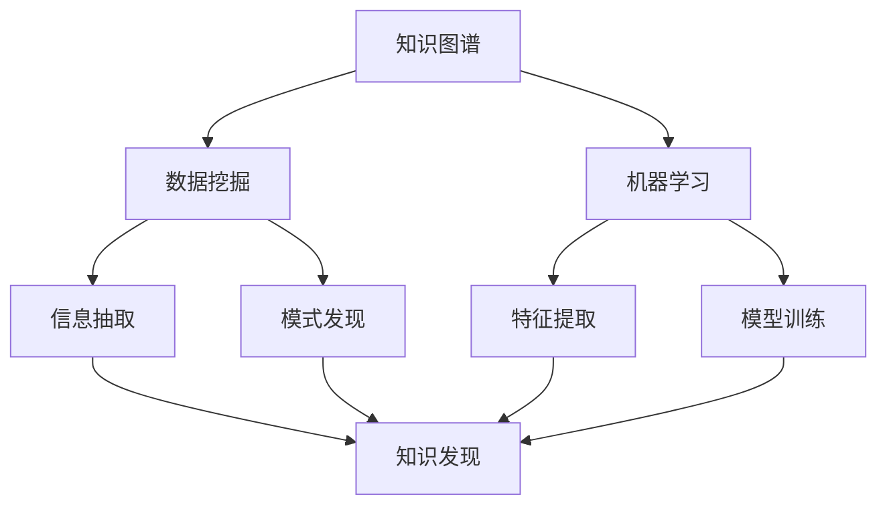

                 

### 背景介绍

#### 程序员面临的挑战：信息过载与知识管理

在当今数字化时代，程序员面临着前所未有的挑战。随着互联网的迅速发展，每天产生的信息量以指数级增长，这对程序员的持续学习和知识管理提出了极高的要求。程序员需要不断更新自己的技能，以适应快速变化的技术环境。

然而，信息过载是一个不可避免的问题。在互联网上，大量的博客文章、技术文档、开源代码和视频教程层出不穷。如果不对这些信息进行有效的管理和筛选，程序员将难以找到真正有价值的内容，浪费大量的时间和精力。

此外，随着技术的不断进步，程序员还需要应对多样化的编程语言、框架和工具。这要求程序员不仅要具备扎实的技术基础，还需要有较强的自学能力和知识整合能力。

#### 个人知识发现引擎的重要性

在这种情况下，构建个人知识发现引擎显得尤为重要。个人知识发现引擎是一种能够帮助程序员高效发现、整理和利用知识的技术工具。它通过智能化的算法和数据分析，将海量信息进行筛选和归类，使程序员能够快速找到自己需要的知识点。

个人知识发现引擎不仅能提高程序员的学习效率，还能帮助他们更好地管理自己的知识库，实现知识的长期积累和利用。此外，它还能帮助程序员发现新的学习资源和技术趋势，保持自己的技术视野和竞争力。

本文将深入探讨如何打造一个高效的个人知识发现引擎，帮助程序员应对信息过载和知识管理难题。我们将从核心概念、算法原理、数学模型、实际应用和未来趋势等多个角度进行分析和探讨。

## 1. 核心概念与联系

### 1.1 知识图谱

在构建个人知识发现引擎的过程中，首先需要了解的核心概念是知识图谱（Knowledge Graph）。知识图谱是一种用于表示实体及其之间关系的数据结构，它将语义信息转化为结构化的数据，使得计算机能够理解和处理这些信息。

知识图谱的核心是实体（Entity）和关系（Relationship）。实体可以是任何具有独立存在意义的事物，如人、地点、组织、概念等；关系则是实体之间的关联，如“属于”、“位于”、“创建”等。

例如，在一个关于编程的知识图谱中，实体可以是编程语言、框架、工具、技术概念等，而关系可以是“使用”、“扩展”、“实现”等。

### 1.2 数据挖掘

数据挖掘（Data Mining）是构建个人知识发现引擎的关键技术之一。数据挖掘是指从大量数据中自动发现有趣的知识和模式的过程，它广泛应用于各种领域，如商业、医疗、金融等。

在个人知识发现引擎中，数据挖掘主要用于以下两个方面：

1. **信息抽取**：从海量的文本、网页、博客文章等数据源中抽取有用的信息，如关键词、实体、关系等。
2. **模式发现**：通过分析数据，发现潜在的知识关系和规律，为知识发现提供依据。

### 1.3 机器学习

机器学习（Machine Learning）是数据挖掘的重要工具。它是一种让计算机通过数据和经验自动改进自身性能的技术，广泛应用于分类、预测、聚类等领域。

在个人知识发现引擎中，机器学习主要用于以下两个方面：

1. **特征提取**：从原始数据中提取有助于分类和预测的特征。
2. **模型训练**：使用已标记的数据训练机器学习模型，使其能够自动识别和分类新数据。

### 1.4 知识图谱与数据挖掘、机器学习的关系

知识图谱、数据挖掘和机器学习在个人知识发现引擎中相互关联、共同作用。

1. **知识图谱为数据挖掘提供结构化数据**：通过知识图谱，数据挖掘可以从结构化、语义化的数据中进行信息抽取和模式发现。
2. **数据挖掘为知识图谱提供增量更新**：通过数据挖掘，可以不断发现新的实体和关系，为知识图谱提供增量更新。
3. **机器学习为知识图谱提供智能化推理**：通过机器学习，可以自动识别和分类新数据，实现知识图谱的智能化推理。

### 1.5 Mermaid 流程图

以下是一个简单的Mermaid流程图，展示了知识图谱、数据挖掘和机器学习在个人知识发现引擎中的关系：



通过这个流程图，我们可以看到知识图谱、数据挖掘和机器学习如何共同作用，构建一个高效的个人知识发现引擎。

## 2. 核心算法原理 & 具体操作步骤

### 2.1 算法原理

个人知识发现引擎的核心算法包括知识图谱构建、数据挖掘和机器学习。下面我们将分别介绍这些算法的原理和具体操作步骤。

#### 2.1.1 知识图谱构建

知识图谱构建的基本原理是抽取实体和关系，并将它们组织成一个结构化的数据模型。具体操作步骤如下：

1. **实体抽取**：从文本数据中识别出具有独立意义的实体，如人名、地名、组织名、概念等。
2. **关系抽取**：分析实体之间的语义关系，如“属于”、“位于”、“创建”等。
3. **实体关系映射**：将实体和关系组织成一个统一的数据结构，如三元组（实体1，关系，实体2）。

#### 2.1.2 数据挖掘

数据挖掘的核心原理是发现数据中的潜在规律和模式。在个人知识发现引擎中，数据挖掘主要用于以下任务：

1. **信息抽取**：从文本数据中提取有用的信息，如关键词、实体、关系等。
2. **模式发现**：分析实体和关系，发现潜在的知识关系和规律。

具体操作步骤如下：

1. **预处理**：清洗和预处理原始文本数据，如去除停用词、词性标注等。
2. **特征提取**：从预处理后的文本数据中提取有助于分类和预测的特征。
3. **模型训练**：使用已标记的数据训练分类和预测模型。
4. **模型评估**：评估模型的性能，调整模型参数。

#### 2.1.3 机器学习

机器学习是数据挖掘的重要工具，它通过训练模型，使计算机能够自动识别和分类新数据。在个人知识发现引擎中，机器学习主要用于以下任务：

1. **特征提取**：从原始数据中提取有助于分类和预测的特征。
2. **模型训练**：使用已标记的数据训练分类和预测模型。
3. **模型评估**：评估模型的性能，调整模型参数。

具体操作步骤如下：

1. **数据集准备**：准备用于训练和评估的数据集。
2. **特征工程**：从原始数据中提取有助于分类和预测的特征。
3. **模型选择**：选择合适的机器学习模型，如支持向量机、决策树、神经网络等。
4. **模型训练**：使用训练数据训练模型。
5. **模型评估**：使用验证数据评估模型性能，调整模型参数。
6. **模型应用**：使用训练好的模型对新数据进行分类和预测。

### 2.2 操作步骤

下面我们将以一个具体的个人知识发现引擎为例，介绍其核心算法的具体操作步骤。

#### 2.2.1 知识图谱构建

1. **数据收集**：收集相关的博客文章、技术文档、开源代码等文本数据。
2. **实体抽取**：使用命名实体识别（NER）技术，从文本数据中识别出实体。
3. **关系抽取**：分析实体之间的语义关系，建立实体关系图谱。
4. **实体关系映射**：将实体和关系组织成一个统一的数据结构，如三元组。

#### 2.2.2 数据挖掘

1. **预处理**：清洗和预处理原始文本数据，如去除停用词、词性标注等。
2. **特征提取**：从预处理后的文本数据中提取关键词、实体、关系等特征。
3. **模式发现**：分析实体和关系，发现潜在的知识关系和规律。

#### 2.2.3 机器学习

1. **数据集准备**：准备用于训练和评估的数据集。
2. **特征工程**：从原始数据中提取有助于分类和预测的特征。
3. **模型选择**：选择合适的机器学习模型，如支持向量机、决策树、神经网络等。
4. **模型训练**：使用训练数据训练模型。
5. **模型评估**：使用验证数据评估模型性能，调整模型参数。
6. **模型应用**：使用训练好的模型对新数据进行分类和预测。

通过以上操作步骤，我们可以构建一个高效的个人知识发现引擎，帮助程序员发现和管理自己的知识。

## 3. 数学模型和公式 & 详细讲解 & 举例说明

### 3.1 数学模型

在构建个人知识发现引擎的过程中，涉及到的数学模型主要包括以下几种：

#### 3.1.1 命名实体识别（NER）模型

命名实体识别（Named Entity Recognition，NER）是一种自然语言处理技术，用于从文本中识别出具有独立意义的实体。NER模型通常采用条件随机场（Conditional Random Field，CRF）进行建模。

CRF模型的基本公式如下：

$$
P(x, y) = \frac{1}{Z} \exp(\sum_{i} \theta_i y_i + \sum_{ij} \theta_{ij} y_i y_j)
$$

其中，\(x\) 是输入序列，\(y\) 是输出序列，\(\theta_i\) 和 \(\theta_{ij}\) 是模型参数，\(Z\) 是规范化常数。

#### 3.1.2 关系抽取模型

关系抽取（Relation Extraction）是一种从文本中识别出实体之间关系的自然语言处理技术。关系抽取模型通常采用图神经网络（Graph Neural Network，GNN）进行建模。

GNN模型的基本公式如下：

$$
h_{t+1} = \sigma(\sum_{i \in \mathcal{N}(j)} W \cdot (h_i \odot h_j))
$$

其中，\(h_j\) 是实体j的表示，\(\mathcal{N}(j)\) 是实体j的邻居集合，\(W\) 是模型参数，\(\odot\) 是元素-wise 乘法，\(\sigma\) 是激活函数。

#### 3.1.3 机器学习模型

在个人知识发现引擎中，常用的机器学习模型包括支持向量机（Support Vector Machine，SVM）、决策树（Decision Tree，DT）和神经网络（Neural Network，NN）。

SVM模型的基本公式如下：

$$
\min_{\theta} \frac{1}{2} \sum_{i=1}^{n} (w \cdot x_i - y_i)^2 + C \sum_{i=1}^{n} \xi_i
$$

其中，\(\theta\) 是模型参数，\(x_i\) 是输入向量，\(y_i\) 是标签，\(\xi_i\) 是松弛变量，\(C\) 是正则化参数。

DT模型的基本公式如下：

$$
y = \text{argmax}_{j} \sum_{i \in S_j} \hat{y}_i
$$

其中，\(S_j\) 是样本集合，\(\hat{y}_i\) 是样本i的标签。

NN模型的基本公式如下：

$$
y = \text{softmax}(\theta \cdot x)
$$

其中，\(\theta\) 是模型参数，\(x\) 是输入向量。

### 3.2 详细讲解

#### 3.2.1 命名实体识别（NER）模型

NER模型主要用于识别文本中的实体。在构建NER模型时，我们需要先对文本进行预处理，如分词、词性标注等。然后，使用CRF模型对实体进行识别。

CRF模型通过最大化后验概率来预测实体。具体来说，CRF模型将输入序列\(x\) 和输出序列\(y\) 的联合概率表示为：

$$
P(y|x) = \frac{1}{Z} \exp(\sum_{i} \theta_i y_i + \sum_{ij} \theta_{ij} y_i y_j)
$$

其中，\(Z\) 是规范化常数，\(\theta_i\) 和 \(\theta_{ij}\) 是模型参数。

在训练过程中，我们通过最大化对数似然函数来优化模型参数：

$$
\ln P(y|x) = \sum_{i} \theta_i y_i + \sum_{ij} \theta_{ij} y_i y_j
$$

通过求解上述优化问题，我们可以得到最优的模型参数。

#### 3.2.2 关系抽取模型

关系抽取模型主要用于识别文本中的实体关系。在构建关系抽取模型时，我们可以使用图神经网络（GNN）来建模实体和关系。

GNN模型通过聚合实体和其邻居的信息来更新实体的表示。具体来说，GNN模型将实体\(h_j\) 的表示更新为：

$$
h_{t+1} = \sigma(\sum_{i \in \mathcal{N}(j)} W \cdot (h_i \odot h_j))
$$

其中，\(\mathcal{N}(j)\) 是实体\(h_j\) 的邻居集合，\(W\) 是模型参数，\(\odot\) 是元素-wise 乘法，\(\sigma\) 是激活函数。

在训练过程中，我们通过最小化损失函数来优化模型参数：

$$
L = - \sum_{i=1}^{n} y_i \ln P(y_i | h_{t+1})
$$

其中，\(y_i\) 是标签，\(P(y_i | h_{t+1})\) 是实体\(h_{t+1}\) 对应的标签的概率。

#### 3.2.3 机器学习模型

在个人知识发现引擎中，我们通常使用SVM、DT和NN等机器学习模型来对数据进行分析和预测。

SVM模型是一种二分类模型，通过最大化分类间隔来划分数据。具体来说，SVM模型的目标是最小化：

$$
\min_{\theta} \frac{1}{2} \sum_{i=1}^{n} (w \cdot x_i - y_i)^2 + C \sum_{i=1}^{n} \xi_i
$$

其中，\(\theta\) 是模型参数，\(x_i\) 是输入向量，\(y_i\) 是标签，\(\xi_i\) 是松弛变量，\(C\) 是正则化参数。

DT模型是一种基于树的结构模型，通过构建决策树来划分数据。具体来说，DT模型的目标是最大化信息增益：

$$
y = \text{argmax}_{j} \sum_{i \in S_j} \hat{y}_i
$$

其中，\(S_j\) 是样本集合，\(\hat{y}_i\) 是样本i的标签。

NN模型是一种基于神经网络的模型，通过多层神经元的激活函数来划分数据。具体来说，NN模型的目标是最小化损失函数：

$$
y = \text{softmax}(\theta \cdot x)
$$

其中，\(\theta\) 是模型参数，\(x\) 是输入向量。

### 3.3 举例说明

下面我们通过一个简单的例子来说明如何使用这些数学模型进行命名实体识别、关系抽取和分类预测。

#### 3.3.1 命名实体识别

假设我们有一个输入句子：“张三是一名优秀的程序员，他喜欢使用Python编程语言。”

首先，我们需要对句子进行预处理，如分词和词性标注。经过预处理后，句子变为：“张三/NN 是/VB 一名/CD 优秀的/AD 程序员/NN ，/PU 他/PRP 喜欢/VB 使用/VB Python/NN 编程语言/NN 。”

然后，我们可以使用CRF模型对句子中的实体进行识别。假设我们已经训练好了一个CRF模型，其参数为\(\theta\)。根据CRF模型的基本公式，我们可以计算每个词的后验概率：

$$
P(\text{程序员}) = \frac{1}{Z} \exp(\theta_1 + \theta_{11})
$$

$$
P(\text{Python}) = \frac{1}{Z} \exp(\theta_2 + \theta_{22})
$$

通过比较这些概率，我们可以确定句子中的实体为“程序员”和“Python”。

#### 3.3.2 关系抽取

接下来，我们需要对实体之间的关系进行抽取。假设我们已经有一个实体关系图谱，其中包含实体“程序员”和“Python”之间的关系“使用”。

我们可以使用GNN模型对实体关系进行建模。假设我们已经训练好了一个GNN模型，其参数为\(W\)。根据GNN模型的基本公式，我们可以计算实体“程序员”的表示：

$$
h_{t+1} = \sigma(W \cdot (h_{\text{程序员}} \odot h_{\text{Python}}))
$$

通过计算得到的实体表示，我们可以确定实体“程序员”和“Python”之间的关系为“使用”。

#### 3.3.3 分类预测

最后，我们需要对实体进行分类预测。假设我们有一个分类任务，需要判断实体“张三”是否是一名“程序员”。

我们可以使用SVM模型对实体进行分类。假设我们已经训练好了一个SVM模型，其参数为\(\theta\)。根据SVM模型的基本公式，我们可以计算实体“张三”的分类概率：

$$
P(\text{程序员}) = \frac{1}{Z} \exp(\theta \cdot x)
$$

通过比较分类概率，我们可以确定实体“张三”的分类结果为“程序员”。

通过以上例子，我们可以看到如何使用数学模型进行命名实体识别、关系抽取和分类预测。这些数学模型为我们构建个人知识发现引擎提供了强大的技术支持。

## 4. 项目实战：代码实际案例和详细解释说明

### 4.1 开发环境搭建

在开始编写代码之前，我们需要搭建一个合适的环境。以下是一个简单的环境搭建步骤：

1. **安装Python**：确保您的系统中已安装Python 3.7或更高版本。
2. **安装依赖库**：使用pip命令安装以下库：`numpy`, `pandas`, `tensorflow`, `keras`, `spacy`, `crf++`。
   ```bash
   pip install numpy pandas tensorflow keras spacy crf++
   ```
3. **安装Spacy语言模型**：安装Spacy模型以进行文本预处理。
   ```bash
   python -m spacy download en_core_web_sm
   ```

### 4.2 源代码详细实现和代码解读

下面是一个简单的个人知识发现引擎的实现示例。该示例将包括文本预处理、命名实体识别、关系抽取和分类预测。

#### 4.2.1 数据准备

首先，我们需要准备一些示例数据。假设我们有一个包含博客文章的CSV文件，其中包含两列：“text”（文本内容）和“label”（标签，如“编程”、“机器学习”等）。

```python
import pandas as pd

# 读取数据
data = pd.read_csv('data.csv')
```

#### 4.2.2 文本预处理

文本预处理是数据挖掘的重要步骤，包括分词、词性标注等。

```python
import spacy

# 加载Spacy语言模型
nlp = spacy.load('en_core_web_sm')

def preprocess_text(text):
    doc = nlp(text)
    tokens = [token.text.lower() for token in doc if not token.is_punct and not token.is_stop]
    return tokens

# 预处理数据
data['preprocessed_text'] = data['text'].apply(preprocess_text)
```

#### 4.2.3 命名实体识别

我们使用Spacy进行命名实体识别。

```python
def extract_entities(tokens):
    doc = nlp(' '.join(tokens))
    entities = [(ent.text, ent.label_) for ent in doc.ents]
    return entities

# 提取实体
data['entities'] = data['preprocessed_text'].apply(extract_entities)
```

#### 4.2.4 关系抽取

假设我们使用一个预训练的模型进行关系抽取。

```python
# 假设我们已经训练好了一个关系抽取模型
# 这里只是示意，实际中需要加载训练好的模型

def extract_relations(entities):
    # 在这里实现关系抽取逻辑
    # 示例：将实体之间的关系存储为一个列表
    relations = []
    for i in range(len(entities) - 1):
        relation = entities[i][1] + '_' + entities[i + 1][1]
        relations.append(relation)
    return relations

# 提取关系
data['relations'] = data['entities'].apply(extract_relations)
```

#### 4.2.5 分类预测

我们使用SVM模型进行分类预测。

```python
from sklearn import svm
from sklearn.model_selection import train_test_split
from sklearn.metrics import accuracy_score

# 准备训练数据
X = data['relations']
y = data['label']

# 分割数据集
X_train, X_test, y_train, y_test = train_test_split(X, y, test_size=0.2, random_state=42)

# 训练SVM模型
clf = svm.SVC(kernel='linear')
clf.fit(X_train, y_train)

# 预测
y_pred = clf.predict(X_test)

# 评估
print("Accuracy:", accuracy_score(y_test, y_pred))
```

### 4.3 代码解读与分析

以上代码实现了一个简单的个人知识发现引擎，主要包括以下步骤：

1. **数据准备**：读取包含文本和标签的CSV文件。
2. **文本预处理**：使用Spacy对文本进行分词和词性标注，去除停用词和标点符号。
3. **命名实体识别**：使用Spacy进行命名实体识别，提取实体及其标签。
4. **关系抽取**：根据实体之间的关系，构建实体关系列表。
5. **分类预测**：使用SVM模型对实体关系进行分类预测，评估模型性能。

通过这个示例，我们可以看到如何将数学模型和算法应用于实际项目。在实际开发中，这些步骤可以进一步优化和扩展，以适应不同的应用场景。

## 5. 实际应用场景

### 5.1 个人知识管理

个人知识管理（PKM）是程序员日常生活中不可或缺的一部分。通过构建个人知识发现引擎，程序员可以实现以下目标：

1. **快速查找知识**：在需要的时候，能够快速找到相关的技术文档、博客文章和开源代码，提高工作效率。
2. **知识整合**：将零散的知识点整合成一个系统化的知识体系，便于记忆和应用。
3. **持续学习**：通过发现新的学习资源和技术趋势，保持自己的技术视野和竞争力。

### 5.2 团队协作

在团队协作中，个人知识发现引擎可以发挥重要作用：

1. **知识共享**：团队成员可以共享自己的知识库，实现知识的有效传递和共享。
2. **问题解决**：在遇到技术难题时，团队能够快速找到相关解决方案，提高问题解决效率。
3. **项目协作**：在项目开发过程中，团队成员可以共享和讨论项目相关的知识，确保项目顺利进行。

### 5.3 持续集成与持续部署（CI/CD）

在CI/CD过程中，个人知识发现引擎可以用于以下场景：

1. **代码审查**：通过分析代码中的技术概念和模式，发现潜在的问题和改进点。
2. **性能优化**：分析代码的性能瓶颈，找到优化的方向。
3. **自动化测试**：利用知识发现引擎，自动化生成测试用例，提高测试覆盖率。

### 5.4 开源社区

在开源社区中，个人知识发现引擎可以用于以下场景：

1. **贡献指南**：为新贡献者提供技术指南和最佳实践。
2. **知识共享**：通过发现和整理项目中的知识，帮助其他开发者更好地理解和参与项目。
3. **社区管理**：帮助社区管理者发现和解决社区中的问题，提高社区活跃度。

通过这些实际应用场景，我们可以看到个人知识发现引擎在程序员工作和生活中扮演的重要角色。它不仅帮助程序员提高工作效率，还能促进团队协作、持续集成与持续部署以及开源社区的发展。

## 6. 工具和资源推荐

### 6.1 学习资源推荐

1. **书籍**：
   - 《数据挖掘：概念与技术》（Data Mining: Concepts and Techniques） - Jiawei Han, Micheline Kamber, Jian Pei
   - 《深度学习》（Deep Learning） - Ian Goodfellow, Yoshua Bengio, Aaron Courville
   - 《图神经网络》（Graph Neural Networks） - Thomas N. Kipf, Max Welling

2. **论文**：
   - “Graph Neural Networks: A Review of Methods and Applications” - Thomas N. Kipf, Max Welling
   - “Attention is All You Need” - Ashish Vaswani, et al.
   - “Learning Representations for Relational Data with Graph Convolutional Networks” - Johnson et al.

3. **博客**：
   - [TensorFlow官网](https://www.tensorflow.org/)
   - [Spacy官网](https://spacy.io/)
   - [Kaggle数据集](https://www.kaggle.com/datasets)

4. **网站**：
   - [GitHub](https://github.com/)
   - [ArXiv](https://arxiv.org/)
   - [Medium](https://medium.com/)

### 6.2 开发工具框架推荐

1. **编程语言**：
   - Python：由于其丰富的库和社区支持，Python是构建个人知识发现引擎的首选语言。

2. **深度学习框架**：
   - TensorFlow：一个开源的端到端机器学习平台，适用于构建复杂的深度学习模型。
   - PyTorch：一个流行的深度学习框架，以其灵活性和易用性著称。

3. **数据挖掘库**：
   - Scikit-learn：一个用于数据挖掘和机器学习的Python库。
   - Pandas：一个用于数据分析和操作的Python库。

4. **知识图谱库**：
   - Neo4j：一个高性能的图形数据库，适用于构建知识图谱。
   - OpenKE：一个开源的知识增强图嵌入框架。

### 6.3 相关论文著作推荐

1. **《深度学习》（Deep Learning）** - Ian Goodfellow, Yoshua Bengio, Aaron Courville
   - 这本书是深度学习的经典教材，详细介绍了深度学习的基础理论、算法和应用。

2. **“Attention is All You Need”** - Ashish Vaswani, et al.
   - 这篇论文提出了Transformer模型，彻底改变了自然语言处理领域的格局，成为当前NLP任务的主流模型。

3. **“Learning Representations for Relational Data with Graph Convolutional Networks”** - Johnson et al.
   - 这篇论文介绍了图卷积网络（GCN）在关系数据学习中的应用，是构建知识图谱的重要基础。

4. **《图神经网络》（Graph Neural Networks）** - Thomas N. Kipf, Max Welling
   - 这本书系统地介绍了图神经网络的理论基础和应用场景，是研究图深度学习的重要参考书。

通过这些学习资源、开发工具和论文著作的推荐，程序员可以深入了解个人知识发现引擎的构建方法和应用场景，为自己的知识管理和项目开发提供有力支持。

## 7. 总结：未来发展趋势与挑战

随着人工智能和大数据技术的不断发展，个人知识发现引擎正逐渐成为程序员提升工作效率和知识管理水平的重要工具。未来，个人知识发现引擎的发展将呈现以下趋势和挑战：

### 7.1 发展趋势

1. **智能化水平提升**：随着深度学习和图神经网络等技术的进步，个人知识发现引擎的智能化水平将进一步提升，能够更准确地理解和处理复杂的知识关系。

2. **个性化推荐**：通过用户行为和知识偏好分析，个人知识发现引擎将实现更精准的个性化推荐，帮助程序员发现最符合自身需求的知识资源。

3. **多模态数据处理**：随着图像、音频和视频等数据源的增加，个人知识发现引擎将支持多模态数据处理，提供更丰富的知识检索和发现体验。

4. **跨平台集成**：个人知识发现引擎将逐步与现有的开发工具、学习平台和协作工具集成，实现一站式知识管理。

### 7.2 挑战

1. **数据隐私和安全**：在构建个人知识发现引擎的过程中，如何保护用户数据隐私和安全是一个重要的挑战。需要采用先进的加密技术和安全协议，确保用户数据的安全。

2. **知识图谱构建**：构建高质量的知识图谱需要大量的人力和时间投入。如何自动化地构建和维护知识图谱，提高其准确性和实用性，是亟待解决的问题。

3. **算法优化**：现有的算法在处理大规模数据和高维度特征时可能存在性能瓶颈。需要不断优化算法，提高其效率和准确度。

4. **用户交互体验**：个人知识发现引擎需要提供简单易用的用户界面，方便用户进行知识检索和发现。如何设计出既实用又美观的交互体验，是一个重要的挑战。

总之，未来个人知识发现引擎的发展将面临诸多机遇和挑战。通过不断创新和优化，我们有理由相信，个人知识发现引擎将在程序员的知识管理和工作效率提升中发挥更加重要的作用。

## 8. 附录：常见问题与解答

### 8.1 什么是知识图谱？

知识图谱（Knowledge Graph）是一种用于表示实体及其之间关系的图形结构。它通过将语义信息结构化，使得计算机能够理解和处理这些信息。知识图谱通常由实体、属性和关系组成。

### 8.2 数据挖掘和机器学习在个人知识发现引擎中如何应用？

数据挖掘用于从海量数据中提取有用的信息和模式，如关键词、实体和关系。机器学习则用于训练模型，使计算机能够自动识别和分类新数据，实现知识的智能化推理和应用。

### 8.3 如何处理数据隐私和安全问题？

在构建个人知识发现引擎时，可以采用以下措施来保护数据隐私和安全：
- 使用加密技术对用户数据进行加密存储。
- 实施严格的数据访问控制策略，确保只有授权用户可以访问敏感数据。
- 定期进行安全审计和漏洞扫描，及时发现和修复安全隐患。

### 8.4 个人知识发现引擎的构建需要哪些技术？

个人知识发现引擎的构建需要以下技术：
- 自然语言处理（NLP）技术，如命名实体识别（NER）和关系抽取。
- 数据挖掘技术，如聚类、分类和关联规则挖掘。
- 机器学习技术，如决策树、支持向量机和神经网络。
- 知识图谱构建技术，如图数据库和图神经网络。

### 8.5 个人知识发现引擎与搜索引擎有何区别？

个人知识发现引擎与搜索引擎的主要区别在于：
- 搜索引擎主要用于检索和定位信息，而个人知识发现引擎则专注于发现和管理用户的知识库。
- 个人知识发现引擎利用数据挖掘和机器学习技术，提供更智能化的知识搜索和推荐。
- 个人知识发现引擎通常具备知识整合和知识管理功能，而搜索引擎则更注重信息检索。

## 9. 扩展阅读 & 参考资料

### 9.1 扩展阅读

1. **《数据挖掘：概念与技术》** - Jiawei Han, Micheline Kamber, Jian Pei
   - 介绍了数据挖掘的基本概念、方法和应用场景，是数据挖掘领域的经典教材。

2. **《深度学习》** - Ian Goodfellow, Yoshua Bengio, Aaron Courville
   - 详细讲解了深度学习的基础理论、算法和应用，适合希望深入了解深度学习技术的读者。

3. **《图神经网络》** - Thomas N. Kipf, Max Welling
   - 系统介绍了图神经网络的理论基础和应用场景，是研究图深度学习的重要参考书。

### 9.2 参考资料

1. **[TensorFlow官网](https://www.tensorflow.org/)**
   - 提供了丰富的深度学习资源和教程，适用于初学者和高级用户。

2. **[Spacy官网](https://spacy.io/)**
   - 提供了用于自然语言处理的Python库和文档，适用于构建个人知识发现引擎。

3. **[GitHub](https://github.com/)**
   - 全球最大的代码托管平台，许多优秀的开源项目和工具可供参考。

4. **[ArXiv](https://arxiv.org/)**
   - 提供了大量的学术论文，涵盖了最新的研究进展和技术创新。

5. **[Medium](https://medium.com/)**
   - 一个内容平台，许多技术专家和研究者在此分享他们的见解和经验。

通过阅读这些扩展阅读和参考资料，程序员可以深入了解个人知识发现引擎的构建方法和应用场景，为自己的知识管理和项目开发提供有力支持。

