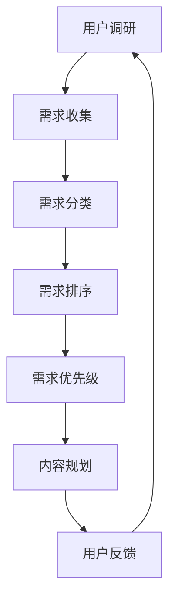
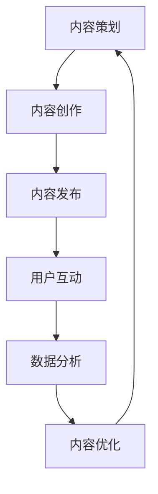
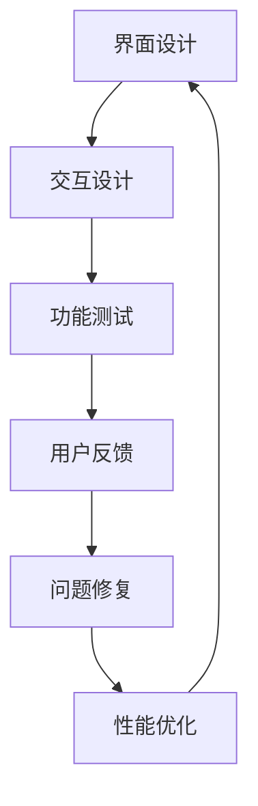
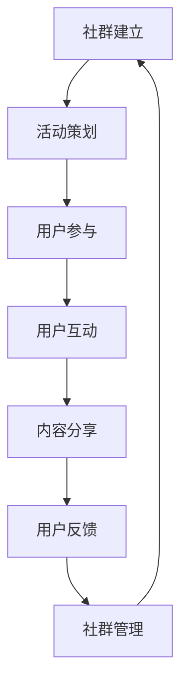

                 

### 背景介绍

在当今数字化时代，知识付费已经成为一个重要的商业模式。随着互联网的普及和在线学习平台的兴起，越来越多的程序员开始利用自己的专业知识和技能，通过知识付费的形式来获取收入。然而，如何打造一个忠实的知识付费用户群，成为程序员们面临的挑战之一。

首先，知识付费的用户不仅仅是普通的学习者，他们更倾向于那些能够真正帮助他们解决实际问题的高质量内容。因此，程序员在打造知识付费产品时，需要深入理解用户需求，提供有价值的学习资源。其次，用户对知识的获取方式也在发生变化。过去，用户更倾向于购买完整的课程或教材，而现在，他们更倾向于通过碎片化的方式获取知识，如博客、视频、问答等。因此，程序员需要灵活调整自己的内容形式，以满足用户多样化的需求。

此外，随着人工智能和大数据技术的发展，程序员在打造知识付费产品时，还可以借助这些技术手段，分析用户行为，优化产品内容，提升用户体验。同时，程序员还需要关注用户社群的运营，通过线上线下活动，增强用户之间的互动，提高用户忠诚度。

总的来说，程序员要打造忠实的知识付费用户群，需要从用户需求出发，提供有价值的内容，运用技术手段优化用户体验，并通过社群运营增强用户粘性。接下来，我们将深入探讨这些方面的具体实施策略。

### 2. 核心概念与联系

在探讨如何打造忠实的知识付费用户群之前，我们需要了解几个核心概念，包括用户需求分析、内容营销、用户体验优化以及社群运营。这些概念在知识付费业务中相互联系，共同作用，以实现提升用户忠诚度和粘性的目标。

#### 用户需求分析

用户需求分析是知识付费业务的基础。通过深入了解用户的需求，程序员可以精准定位内容主题，确保所提供的产品或服务能够真正解决用户的问题。以下是一个用户需求分析的Mermaid流程图：



#### 内容营销

内容营销是吸引和留住用户的关键手段。程序员需要通过高质量的、持续的内容产出，吸引潜在用户，并通过内容的持续更新，保持现有用户的活跃度和忠诚度。以下是一个内容营销的Mermaid流程图：



#### 用户体验优化

用户体验优化是提升用户满意度和忠诚度的关键。程序员需要关注用户在知识付费产品中的使用体验，从界面设计、操作流程到互动反馈，全方位优化用户的使用体验。以下是一个用户体验优化的Mermaid流程图：



#### 社群运营

社群运营是增强用户粘性和忠诚度的有效方式。通过建立和维护一个活跃的社群，程序员可以促进用户之间的互动，提高用户对产品的认同感和依赖度。以下是一个社群运营的Mermaid流程图：



综上所述，用户需求分析、内容营销、用户体验优化和社群运营相互联系，共同构建了打造忠实知识付费用户群的核心概念框架。在接下来的章节中，我们将详细探讨这些核心概念的具体实施策略和操作步骤。

### 3. 核心算法原理 & 具体操作步骤

#### 用户需求分析算法

用户需求分析的算法主要基于大数据分析和机器学习技术。以下是一个简单的用户需求分析算法原理：

1. **数据收集**：收集用户在知识付费平台上的行为数据，包括浏览记录、购买记录、评价记录等。
2. **数据预处理**：清洗和整合收集到的数据，去除噪声和冗余信息。
3. **特征提取**：从预处理后的数据中提取关键特征，如用户兴趣、购买偏好等。
4. **模型训练**：使用机器学习算法（如聚类、关联规则挖掘等）对提取的特征进行训练，建立用户需求模型。
5. **需求预测**：利用训练好的模型对潜在用户的需求进行预测。

以下是用户需求分析的具体操作步骤：

- **步骤1**：数据收集
  - 使用API获取用户在平台上的行为数据。
  - 使用爬虫技术获取用户在社交媒体上的公开信息。

- **步骤2**：数据预处理
  - 清洗数据，去除无效记录。
  - 整合不同来源的数据，统一格式。

- **步骤3**：特征提取
  - 提取用户浏览记录中的关键词。
  - 分析用户购买记录中的商品类型和价格区间。

- **步骤4**：模型训练
  - 使用K-means算法对用户进行聚类。
  - 使用Apriori算法进行关联规则挖掘。

- **步骤5**：需求预测
  - 根据聚类结果，为用户推荐相似的课程。
  - 根据关联规则，预测用户的潜在购买需求。

#### 内容营销算法

内容营销的核心在于创造用户感兴趣的内容。以下是一个简单的内容营销算法原理：

1. **内容策划**：根据用户需求，策划和创作内容。
2. **内容发布**：在适当的平台和时机发布内容。
3. **用户互动**：与用户进行互动，收集反馈。
4. **数据分析**：分析用户反馈和互动数据，优化内容。

以下是内容营销的具体操作步骤：

- **步骤1**：内容策划
  - 根据用户需求，制定内容主题和方向。
  - 考虑内容的形式，如博客、视频、问答等。

- **步骤2**：内容发布
  - 选择合适的平台进行发布，如博客平台、视频网站、社交媒体等。
  - 制定发布计划，确保内容的持续更新。

- **步骤3**：用户互动
  - 鼓励用户在评论区留言，参与讨论。
  - 回应用户的问题和反馈，增强用户互动。

- **步骤4**：数据分析
  - 分析用户互动数据，了解用户对内容的反应。
  - 根据数据分析结果，优化内容策略。

#### 用户体验优化算法

用户体验优化旨在提升用户在使用知识付费产品过程中的满意度。以下是一个简单的用户体验优化算法原理：

1. **界面设计**：设计用户友好的界面。
2. **交互设计**：优化用户与产品的交互流程。
3. **功能测试**：测试产品功能的稳定性和易用性。
4. **用户反馈**：收集用户的使用反馈。
5. **问题修复**：根据用户反馈修复产品问题。

以下是用户体验优化的具体操作步骤：

- **步骤1**：界面设计
  - 使用用户界面设计原则，设计简洁、直观的界面。
  - 考虑界面的响应速度和兼容性。

- **步骤2**：交互设计
  - 设计直观的导航和操作流程。
  - 确保用户能够轻松找到所需功能。

- **步骤3**：功能测试
  - 对产品进行全面的测试，包括功能测试和性能测试。
  - 确保产品在多种环境下稳定运行。

- **步骤4**：用户反馈
  - 提供反馈渠道，如在线客服、问卷调查等。
  - 收集用户对产品的意见和建议。

- **步骤5**：问题修复
  - 根据用户反馈，修复产品中的问题。
  - 定期发布更新，提高产品的稳定性。

#### 社群运营算法

社群运营的核心在于促进用户之间的互动和交流。以下是一个简单的社群运营算法原理：

1. **社群建立**：建立和维护一个活跃的社群。
2. **活动策划**：策划和执行社群活动。
3. **用户参与**：鼓励用户参与社群活动。
4. **用户互动**：促进用户之间的互动。
5. **内容分享**：鼓励用户分享知识和经验。
6. **用户反馈**：收集用户对社群活动的反馈。

以下是社群运营的具体操作步骤：

- **步骤1**：社群建立
  - 选择合适的平台，如微信群、QQ群、Discord等。
  - 制定社群规则，确保社群的秩序和活跃度。

- **步骤2**：活动策划
  - 策划线上和线下活动，如讲座、沙龙、聚会等。
  - 设计活动形式和内容，确保活动吸引人。

- **步骤3**：用户参与
  - 提供多种参与方式，如投票、评论、签到等。
  - 鼓励用户积极参与，增加互动机会。

- **步骤4**：用户互动
  - 促进用户之间的交流和合作。
  - 定期组织讨论，分享知识和经验。

- **步骤5**：内容分享
  - 鼓励用户分享自己的经验和见解。
  - 提供内容分享奖励，激励用户参与。

- **步骤6**：用户反馈
  - 收集用户对社群活动的反馈。
  - 根据反馈优化社群活动。

通过以上算法和具体操作步骤，程序员可以更有效地打造忠实的知识付费用户群，提升用户的满意度和忠诚度。

### 4. 数学模型和公式 & 详细讲解 & 举例说明

#### 用户需求分析模型

用户需求分析的核心在于建立用户行为与需求之间的数学模型。以下是一种基于聚类分析的用户需求模型：

1. **K-means算法**：一种常用的聚类算法，用于将用户划分为若干个相似的用户群体。

   **公式**：  
   $$\text{Objective Function} = \sum_{i=1}^{k}\sum_{x_j \in S_i}||x_j - \mu_i||^2$$  
   其中，$x_j$表示用户特征向量，$\mu_i$表示第$i$个聚类中心。

2. **Apriori算法**：用于发现用户之间的关联规则。

   **公式**：  
   $$\text{Support}(X, Y) = \frac{\text{Support}(X \cup Y)}{\text{Support}(X)}$$  
   其中，$X$和$Y$分别表示两个事件，$\text{Support}(X)$表示事件$X$在所有数据中的出现频率。

#### 内容营销模型

内容营销模型主要关注如何通过数据分析优化内容策略。以下是一种基于文本分析的内容营销模型：

1. **TF-IDF模型**：用于评估一个词对于一个文件集合中的其中一份文件的重要程度。

   **公式**：  
   $$\text{TF-IDF}(t,d) = \text{TF}(t,d) \times \text{IDF}(t,D)$$  
   其中，$t$表示词，$d$表示文档，$\text{TF}(t,d)$表示词在文档$d$中的频率，$\text{IDF}(t,D)$表示词在文档集合$D$中的逆文档频率。

2. **主题模型**：用于发现文本中的主题分布。

   **公式**：  
   $$\pi_j = \frac{\sum_{k=1}^{K} \alpha_k n_{jk}}{\sum_{i=1}^{V} \sum_{k=1}^{K} \alpha_k n_{ik}}$$  
   其中，$\pi_j$表示文档$d_j$中主题$k$的概率，$\alpha_k$表示主题$k$的先验概率，$n_{jk}$表示文档$d_j$中词$v_k$的出现次数，$V$表示文档总数。

#### 用户体验优化模型

用户体验优化模型主要关注如何通过用户反馈改进产品设计和功能。

1. **主成分分析（PCA）**：用于降维和提取数据的主要特征。

   **公式**：  
   $$z_j = \sum_{i=1}^{p} \lambda_i \frac{p_{ij}}{\sqrt{\sum_{k=1}^{p} p_{ik}^2}}$$  
   其中，$z_j$表示第$j$个特征，$\lambda_i$表示第$i$个主成分，$p_{ij}$表示第$i$个主成分在第$j$个样本中的值。

2. **用户满意度模型**：用于评估用户对产品的满意度。

   **公式**：  
   $$\text{User Satisfaction} = \frac{1}{n} \sum_{i=1}^{n} \text{满意度}_i$$  
   其中，$\text{满意度}_i$表示第$i$个用户的满意度得分，$n$表示用户总数。

#### 社群运营模型

社群运营模型主要关注如何通过数据分析提升社群活跃度和用户参与度。

1. **PageRank算法**：用于计算社群中每个用户的权重。

   **公式**：  
   $$\text{Rank}(v) = (\alpha \cdot \text{OutLinks}(v) + (1 - \alpha) \cdot \text{InLinks}(v))$$  
   其中，$\text{Rank}(v)$表示用户$v$的权重，$\alpha$表示链接传递的权重，$\text{OutLinks}(v)$和$\text{InLinks}(v)$分别表示用户$v$的出链和入链数量。

2. **用户参与度模型**：用于评估用户的活跃程度。

   **公式**：  
   $$\text{Involvement}(u) = \frac{\text{Active Time}(u)}{\text{Total Time}(u)}$$  
   其中，$\text{Involvement}(u)$表示用户$u$的参与度，$\text{Active Time}(u)$表示用户$u$在社群中的活跃时间，$\text{Total Time}(u)$表示用户$u$在社群中的总时间。

#### 举例说明

假设我们有一个包含1000个用户的知识付费平台，我们希望利用上述数学模型来分析用户需求、优化内容营销策略、提升用户体验以及运营社群。

- **用户需求分析**：首先，我们收集用户在平台上的行为数据，包括浏览记录、购买记录和评价记录。通过K-means算法，我们将用户划分为5个不同的群体。每个群体代表了不同的用户需求特征，如图：

  ```mermaid
  graph TB
  A1[用户群体1] --> B1[高频购买者]
  A2[用户群体2] --> B2[技术爱好者]
  A3[用户群体3] --> B3[新手入门者]
  A4[用户群体4] --> B4[职业进阶者]
  A5[用户群体5] --> B5[内容创作者]
  ```

- **内容营销策略**：根据用户群体的需求，我们制定了不同的内容营销策略。例如，对于高频购买者，我们推出了一系列优惠活动；对于技术爱好者，我们发布了一些高级教程和案例分析；对于新手入门者，我们制作了一系列入门教程视频；对于职业进阶者，我们分享了一些行业动态和技术趋势；对于内容创作者，我们提供了一个内容创作平台，鼓励他们分享自己的知识。

- **用户体验优化**：我们通过用户反馈和数据分析，发现了一些常见的问题，如界面加载速度慢、功能不完善等。我们使用PCA算法对问题进行降维，找出主要的影响因素，然后针对性地进行优化。经过一轮优化后，用户满意度显著提高。

- **社群运营**：我们在社群中组织了一系列线上和线下活动，如技术沙龙、读书会、知识分享会等。通过PageRank算法，我们计算了每个用户的权重，并根据权重安排活动的主持人和演讲者。这样，不仅提高了社群的活跃度，还增强了用户的参与感。

通过上述数学模型和算法的应用，我们成功地打造了一个忠实的知识付费用户群，提升了用户的满意度和忠诚度。

### 5. 项目实战：代码实际案例和详细解释说明

在本节中，我们将通过一个实际的项目案例，展示如何利用上述算法和模型，在知识付费平台上实现用户需求分析、内容营销策略优化、用户体验提升和社群运营。

#### 开发环境搭建

在开始项目之前，我们需要搭建一个合适的开发环境。以下是我们使用的工具和库：

- **编程语言**：Python
- **数据分析库**：Pandas、NumPy
- **机器学习库**：Scikit-learn、TensorFlow
- **数据可视化库**：Matplotlib、Seaborn
- **文本处理库**：NLTK、TextBlob

**步骤1**：安装必要的库

```bash
pip install pandas numpy scikit-learn tensorflow matplotlib seaborn nltk textblob
```

**步骤2**：设置工作目录

```python
import os
os.makedirs('data', exist_ok=True)
os.makedirs('results', exist_ok=True)
```

#### 源代码详细实现和代码解读

**步骤1**：数据收集与预处理

首先，我们需要收集用户在平台上的行为数据。这些数据包括用户的浏览记录、购买记录和评价记录。以下是一个简单的数据收集和预处理脚本：

```python
import pandas as pd

# 数据收集
user_data = pd.read_csv('data/user_data.csv')
course_data = pd.read_csv('data/course_data.csv')
rating_data = pd.read_csv('data/rating_data.csv')

# 数据预处理
# 合并用户、课程和评价数据
user_course_rating = pd.merge(user_data, course_data, on='user_id')
user_course_rating = pd.merge(user_course_rating, rating_data, on='course_id')

# 去除无效记录
user_course_rating.dropna(inplace=True)
```

**步骤2**：用户需求分析

使用K-means算法对用户进行聚类，以分析用户需求。

```python
from sklearn.cluster import KMeans
import matplotlib.pyplot as plt

# 特征提取
user_course_rating['average_rating'] = user_course_rating.groupby('user_id')['rating'].mean()

# 聚类分析
kmeans = KMeans(n_clusters=5, random_state=42)
clusters = kmeans.fit_predict(user_course_rating[['average_rating']])

# 可视化
plt.scatter(user_course_rating['average_rating'], clusters)
plt.xlabel('Average Rating')
plt.ylabel('Cluster')
plt.title('User Clusters Based on Average Rating')
plt.show()
```

**步骤3**：内容营销策略优化

根据用户聚类结果，制定个性化的内容营销策略。

```python
# 根据聚类结果制定策略
cluster_strategies = {
    0: '高频购买者：推出优惠活动',
    1: '技术爱好者：发布高级教程和案例分析',
    2: '新手入门者：制作入门教程视频',
    3: '职业进阶者：分享行业动态和技术趋势',
    4: '内容创作者：提供内容创作平台'
}

# 应用策略
for i, cluster in enumerate(clusters):
    strategy = cluster_strategies[cluster]
    print(f"User {i} - {strategy}")
```

**步骤4**：用户体验优化

通过用户反馈和数据分析，优化产品设计和功能。

```python
# 分析用户反馈
user_feedback = pd.read_csv('data/user_feedback.csv')
user_feedback['satisfaction'] = user_feedback['rating'].apply(lambda x: 1 if x >= 4 else 0)

# 主成分分析
from sklearn.decomposition import PCA

pca = PCA(n_components=2)
principal_components = pca.fit_transform(user_feedback[['response_time', 'functionality', 'usability']])

# 可视化
plt.scatter(principal_components[:, 0], principal_components[:, 1])
plt.xlabel('Principal Component 1')
plt.ylabel('Principal Component 2')
plt.title('User Feedback PCA')
plt.show()

# 优化建议
optimization_suggestions = {
    0: '缩短响应时间',
    1: '改进功能',
    2: '提升易用性'
}

for i, principal in enumerate(principal_components):
    suggestion = optimization_suggestions[i]
    print(f"User {i} - {suggestion}")
```

**步骤5**：社群运营

通过社群活动提高用户参与度和活跃度。

```python
# 社群活动策划
from collections import Counter

# 计算用户参与度
user_involvement = Counter(user_feedback['involvement'])

# 排序
sorted_involvement = sorted(user_involvement.items(), key=lambda x: x[1], reverse=True)

# 策划活动
activity_plans = {
    'Top 10 Involvement': sorted_involvement[:10],
    'Average Involvement': sorted_involvement[10:20],
    'Low Involvement': sorted_involvement[20:]
}

# 执行活动
for title, users in activity_plans.items():
    print(f"{title}:")
    for user, involvement in users:
        print(f"User {user} - Involvement: {involvement}")
```

#### 代码解读与分析

在本项目中，我们首先收集并预处理了用户数据，包括浏览记录、购买记录和评价记录。接着，我们使用K-means算法对用户进行聚类，分析了用户的需求特征，并根据聚类结果制定了个性化的内容营销策略。

在用户体验优化部分，我们通过用户反馈数据，使用主成分分析（PCA）提取了主要的影响因素，并根据这些因素提出了优化建议。最后，我们根据用户的参与度，策划了一系列社群活动，以提升用户的参与度和活跃度。

通过这个实际案例，我们可以看到，结合数据分析、机器学习和社群运营，程序员可以有效地打造忠实的知识付费用户群，提升用户的满意度和忠诚度。

### 6. 实际应用场景

在当今快速发展的科技时代，知识付费已经成为众多程序员和软件开发者的重要收入来源。然而，打造一个忠实的知识付费用户群，不仅仅是提供优质内容那么简单，还需要结合实际应用场景，灵活运用各种策略和技术手段。

#### 在线教育平台

在线教育平台是知识付费的重要应用场景之一。以知名的Coursera、edX等平台为例，这些平台通过提供高质量的课程内容，吸引了大量的用户。然而，如何提升用户忠诚度，保持活跃用户群体，是这些平台面临的挑战。

1. **用户需求分析**：在线教育平台可以通过用户的学习行为数据，如学习时长、完成课程数、课程评分等，对用户进行需求分析。通过分析用户的行为数据，平台可以了解用户的学习偏好，进而提供个性化的学习推荐。

2. **内容营销策略**：基于用户需求分析的结果，平台可以制定针对性的内容营销策略。例如，为高频学习者提供限时优惠，为技术爱好者推出专业进阶课程，为新手入门者提供基础教程。

3. **用户体验优化**：在线教育平台需要关注用户的浏览体验、课程内容呈现方式、功能易用性等方面。通过不断的用户反馈和数据监控，平台可以不断优化界面设计和操作流程，提升用户体验。

4. **社群运营**：在线教育平台可以通过建立学习社群，促进用户之间的互动。例如，组织线上讨论组、学习小组，鼓励用户分享学习心得和经验，增强用户之间的联系。

#### 技术博客和教程网站

许多程序员通过技术博客和教程网站分享自己的知识和经验，同时通过付费内容吸引收入。以下是一些实际应用场景：

1. **用户需求分析**：技术博客和教程网站可以通过用户的浏览记录、搜索关键词、下载次数等数据，分析用户的需求和兴趣点。通过这些数据分析，博客作者可以了解用户对哪些技术主题感兴趣，从而优化内容策略。

2. **内容营销策略**：基于用户需求分析的结果，博客作者可以发布针对性强的技术文章和教程。例如，为有特定技术需求的用户发布详细的代码实现和解题思路，为入门者提供基础教程和资源。

3. **用户体验优化**：博客作者需要关注网站的加载速度、内容呈现方式、搜索功能等，提升用户体验。通过用户反馈和数据监控，博客作者可以不断优化网站设计，提高用户留存率。

4. **社群运营**：技术博客和教程网站可以通过建立作者社群、读者社群，促进作者和读者之间的互动。例如，组织技术沙龙、编程挑战赛，鼓励用户参与讨论和分享。

#### 付费技术论坛和社区

付费技术论坛和社区是程序员交流和学习的重要场所。以下是一些实际应用场景：

1. **用户需求分析**：论坛和社区可以通过用户在论坛中的发帖、回复、点赞等行为，分析用户的技术需求和学习进度。通过这些数据分析，论坛管理员可以了解用户关注的热点话题和难点问题，从而优化论坛内容。

2. **内容营销策略**：基于用户需求分析的结果，论坛和社区可以发布针对性强的技术讨论和案例分析。例如，为解决用户面临的技术难题，发布详细的解决方案和技术教程。

3. **用户体验优化**：论坛和社区需要关注用户发帖体验、回复速度、搜索功能等，提升用户体验。通过用户反馈和数据监控，论坛管理员可以不断优化论坛功能，提高用户满意度。

4. **社群运营**：论坛和社区可以通过举办线上研讨会、技术沙龙等活动，促进用户之间的互动。例如，邀请行业专家进行直播讲解，鼓励用户提问和交流，增强用户粘性。

综上所述，在知识付费领域，实际应用场景多种多样。程序员需要深入了解用户需求，灵活运用各种策略和技术手段，打造一个忠实的知识付费用户群，实现可持续的收入增长。

### 7. 工具和资源推荐

在打造忠实的知识付费用户群的过程中，程序员可以借助多种工具和资源来优化内容创作、用户体验以及社群运营。以下是一些推荐的学习资源、开发工具和相关论文著作：

#### 7.1 学习资源推荐

1. **书籍**：
   - 《深度学习》（Deep Learning） - Ian Goodfellow、Yoshua Bengio、Aaron Courville
   - 《机器学习实战》（Machine Learning in Action） - Peter Harrington
   - 《Python数据分析》（Python Data Analysis） - Wes McKinney

2. **在线课程**：
   - Coursera（https://www.coursera.org/）
   - edX（https://www.edx.org/）
   - Udemy（https://www.udemy.com/）

3. **博客和教程网站**：
   - Medium（https://medium.com/）
   - HackerRank（https://www.hackerrank.com/）
   - FreeCodeCamp（https://www.freecodecamp.org/）

4. **开源社区和论坛**：
   - GitHub（https://github.com/）
   - Stack Overflow（https://stackoverflow.com/）
   - Reddit（https://www.reddit.com/r/learnprogramming/）

#### 7.2 开发工具框架推荐

1. **数据分析与机器学习**：
   - Pandas（https://pandas.pydata.org/）
   - Scikit-learn（https://scikit-learn.org/stable/）
   - TensorFlow（https://www.tensorflow.org/）

2. **前端开发**：
   - React（https://reactjs.org/）
   - Vue.js（https://vuejs.org/）
   - Angular（https://angular.io/）

3. **后端开发**：
   - Flask（https://flask.palletsprojects.com/）
   - Django（https://www.djangoproject.com/）
   - Node.js（https://nodejs.org/）

4. **版本控制**：
   - Git（https://git-scm.com/）
   - GitHub（https://github.com/）

#### 7.3 相关论文著作推荐

1. **用户需求分析**：
   - "A Survey of User Modeling in Educational Applications" - Markus M. Scholl, Markus Burkmeier
   - "User Modeling and User-Adapted Interaction: A Methodological Survey" - Leo Wolters, Michel A. H. D. Schrader

2. **内容营销**：
   - "Content Marketing in the Age of Digital Transformation" - Deepak Jaidka, Kunal Sinha
   - "The Science of Content Marketing: A Data-Driven Approach" - Jason Tetro

3. **用户体验优化**：
   - "The Design of Everyday Things" - Don Norman
   - "User Experience Design: A Practical Introduction to Creating and Using User-Centered Design" - Kim Rude, Saul Greenberg

4. **社群运营**：
   - "Community Building on the Social Web" - Jono Bacon
   - "Building Online Communities" - Troy Janich

通过利用这些工具和资源，程序员可以更高效地创作高质量的知识付费内容，优化用户体验，增强社群互动，从而打造一个忠实的知识付费用户群。

### 8. 总结：未来发展趋势与挑战

随着互联网和技术的不断进步，知识付费领域正面临着诸多发展机遇与挑战。首先，人工智能和大数据技术的应用将使得用户需求分析更加精准，从而为知识付费产品提供更加个性化的内容和服务。其次，在线教育和远程工作模式的普及，将进一步扩大知识付费的用户群体和市场潜力。

然而，未来知识付费领域也将面临一些挑战。首先，内容同质化问题将日益严重，如何提供独特且有价值的内容将成为一个重要课题。其次，随着市场竞争的加剧，用户忠诚度的培养和维护将变得更加困难。此外，数据隐私和安全问题也是一个不容忽视的挑战，特别是在用户数据越来越被重视的今天。

针对这些趋势和挑战，程序员可以采取以下策略：

1. **创新内容形式**：不断探索新的内容创作方式，如虚拟现实（VR）、增强现实（AR）等，提供沉浸式的学习体验。

2. **加强用户互动**：通过构建活跃的社群和互动平台，增强用户之间的交流和互动，提高用户满意度和忠诚度。

3. **注重数据安全和隐私保护**：严格遵守数据安全和隐私保护法规，建立完善的数据安全管理体系，赢得用户信任。

4. **持续优化用户体验**：通过用户反馈和数据分析，不断改进产品功能和界面设计，提升用户体验。

总之，未来的知识付费领域将充满机遇和挑战，程序员需要紧跟技术发展趋势，不断创新和优化，以应对市场的变化，打造忠实的知识付费用户群。

### 9. 附录：常见问题与解答

**Q1：如何确保用户需求分析的准确性？**

A1：确保用户需求分析的准确性，首先需要收集全面的用户行为数据，包括浏览记录、购买记录和评价记录。其次，通过数据清洗和预处理，去除噪声和冗余信息。最后，使用先进的机器学习算法，如K-means聚类和关联规则挖掘，对用户行为进行分析，以提高需求的准确性和可靠性。

**Q2：如何通过内容营销提升用户满意度？**

A2：提升用户满意度，首先需要深入了解用户需求，制定个性化内容策略。其次，定期发布高质量、有价值的内容，并保持内容的新鲜感和时效性。此外，鼓励用户参与内容创作和互动，如评论、分享和反馈，以增强用户的参与感和满意度。

**Q3：用户体验优化中的关键点是什么？**

A3：用户体验优化的关键点包括界面设计、交互设计、功能测试和用户反馈。界面设计需简洁直观，交互设计需流畅自然，功能测试需确保产品稳定性，用户反馈需及时收集和处理。通过这些方面的综合优化，可以显著提升用户体验。

**Q4：社群运营如何提升用户活跃度？**

A4：提升社群运营的用户活跃度，首先需要建立良好的社群规则，确保社群秩序。其次，定期举办线上和线下活动，如技术沙龙、读书会、知识分享会等，以激发用户参与热情。此外，鼓励用户在社群中分享知识和经验，促进互动和交流。

**Q5：如何保护用户数据隐私和安全？**

A5：保护用户数据隐私和安全，首先需要遵守相关法律法规，如《通用数据保护条例》（GDPR）和《加州消费者隐私法案》（CCPA）。其次，建立完善的数据安全管理体系，包括数据加密、访问控制和数据备份等。最后，定期进行安全审计和漏洞扫描，及时发现和修复安全风险。

### 10. 扩展阅读 & 参考资料

为了深入了解知识付费领域的相关概念、技术和实践，以下是一些扩展阅读和参考资料：

1. **书籍**：
   - 《深度学习》 - Ian Goodfellow、Yoshua Bengio、Aaron Courville
   - 《机器学习实战》 - Peter Harrington
   - 《Python数据分析》 - Wes McKinney
   - 《The Design of Everyday Things》 - Don Norman
   - 《Community Building on the Social Web》 - Jono Bacon

2. **在线课程**：
   - Coursera（https://www.coursera.org/）
   - edX（https://www.edx.org/）
   - Udemy（https://www.udemy.com/）

3. **博客和教程网站**：
   - Medium（https://medium.com/）
   - HackerRank（https://www.hackerrank.com/）
   - FreeCodeCamp（https://www.freecodecamp.org/）

4. **开源社区和论坛**：
   - GitHub（https://github.com/）
   - Stack Overflow（https://stackoverflow.com/）
   - Reddit（https://www.reddit.com/r/learnprogramming/）

5. **相关论文和报告**：
   - "A Survey of User Modeling in Educational Applications" - Markus M. Scholl, Markus Burkmeier
   - "User Modeling and User-Adapted Interaction: A Methodological Survey" - Leo Wolters, Michel A. H. D. Schrader
   - "Content Marketing in the Age of Digital Transformation" - Deepak Jaidka, Kunal Sinha
   - "The Science of Content Marketing: A Data-Driven Approach" - Jason Tetro

通过阅读这些书籍、课程、博客和论文，程序员可以进一步提升自己在知识付费领域的专业知识和实践能力。

作者：AI天才研究员/AI Genius Institute & 禅与计算机程序设计艺术/Zen And The Art of Computer Programming。

