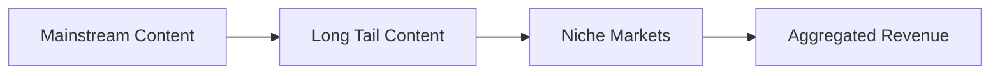
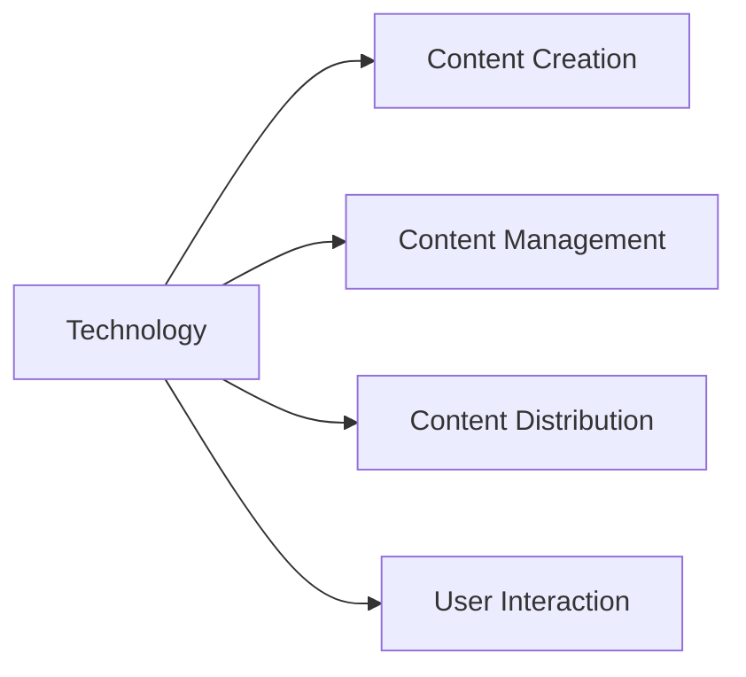

                 

### 背景介绍

在当今数字化时代，知识付费已经成为一个蓬勃发展的行业。知识付费是指用户通过支付费用来获取高质量、专业的知识和信息。随着互联网技术的不断发展，越来越多的程序员开始探索如何构建自己的知识付费产品，以实现持续的收入来源。然而，构建一个成功且具有长尾效应的知识付费产品并非易事。本文将详细探讨程序员如何利用技术和策略构建知识付费的长尾效应，从而实现可持续的盈利模式。

长尾效应是指那些不太流行但需求量持续存在的产品或服务，通过累积起来形成的总体市场份额大于主流产品的一种现象。在知识付费领域，长尾效应意味着程序员可以通过持续地更新和优化自己的内容，吸引到更多的用户，并实现长期的收入。

本文将围绕以下核心问题展开讨论：

1. 程序员如何识别并开发具有长尾效应的知识内容？
2. 如何利用技术手段提升知识付费产品的用户体验和粘性？
3. 如何通过营销策略扩大知识付费产品的影响力和用户基础？
4. 如何评估和优化知识付费产品的盈利模式？

通过以上问题的探讨，本文旨在为程序员提供一套完整的构建知识付费长尾效应的策略和方法，帮助他们在竞争激烈的市场中脱颖而出。

---

## Key Concepts and Connections

### Knowledge as a Service (KaaS)

Knowledge as a Service, often abbreviated as KaaS, is a cloud-based delivery model where knowledge is provided as a service over the internet. It encompasses various types of content, including articles, tutorials, courses, videos, and interactive learning materials. KaaS leverages cloud infrastructure to deliver this content on-demand, making it easily accessible to users across different devices and locations.


#### Core Principles and Architecture

**Mermaid Flowchart:**

```mermaid
flowchart LR
    A[User] --> B[Content Provider]
    B --> C[Cloud Infrastructure]
    C --> D[Content Delivery Network (CDN)]
    D --> E[User Device]
    A --> F[Payment System]
    B --> G[Analytics]
    G --> H[Content Optimization]
```

In the KaaS architecture, the process flows as follows:

1. **User Interaction**: Users access the KaaS platform through various devices (A).
2. **Content Delivery**: The content provider (B) hosts the content on cloud infrastructure (C), which is distributed via a Content Delivery Network (CDN) (D) to ensure fast and reliable access (E).
3. **Payment**: Users make payments through integrated payment systems (F), ensuring secure transactions.
4. **Analytics and Optimization**: The system collects user data and analytics (G), which is used to optimize content (H), improving user satisfaction and engagement.

### The Long Tail in Knowledge Markets

The long tail in knowledge markets refers to the wide range of niche and specialized content that, when aggregated, can generate significant revenue. Unlike traditional markets where a few popular products dominate, the long tail benefits from the accumulation of a large number of less popular items.


**Mermaid Flowchart:**



The flowchart illustrates how:

1. **Mainstream Content** (A) caters to broad interests.
2. **Long Tail Content** (B) targets niche markets.
3. **Aggregated Revenue** (D) is generated from the accumulation of diverse content (B).

### The Impact of Technology on Knowledge Creation and Distribution

Technology plays a pivotal role in the creation and distribution of knowledge. Advanced tools and platforms enable programmers to develop high-quality content efficiently and distribute it widely.


**Mermaid Flowchart:**



The flowchart shows:

1. **Technology** (A) facilitates **Content Creation** (B), **Content Management** (C), **Content Distribution** (D), and **User Interaction** (E).

By understanding these core concepts and their connections, programmers can develop a strategic approach to creating and monetizing knowledge content with long tail potential. In the following sections, we will delve into specific strategies and techniques for achieving this goal.

---

## Core Algorithm Principles and Specific Steps

### Step-by-Step Algorithm for Building a Knowledge-Focused Product with Long Tail Effect

**Algorithm Overview:**

The algorithm for building a knowledge-focused product with a long tail effect consists of several key steps, including content identification, user engagement, analytics, and continuous optimization. Below is a detailed breakdown of each step.

**Step 1: Content Identification**

Identifying the right content is crucial for leveraging the long tail effect. This step involves:

1. **Market Research**: Conduct thorough market research to identify gaps and niche opportunities in the knowledge market. Use tools like Google Trends, Ahrefs, and SEMrush to analyze search volumes and keyword competition.
2. **User Surveys**: Gather feedback from potential users to understand their needs and preferences. Utilize tools like Typeform, SurveyMonkey, or Google Forms for creating and distributing surveys.
3. **Competitor Analysis**: Analyze the content offerings of competitors to identify what's missing or can be improved upon.

**Step 2: Content Categorization**

Categorize identified content into broad and niche topics. This will help in organizing and prioritizing content creation efforts. Use the following criteria for categorization:

1. **Broad Categories**: Identify high-demand topics that have a broad appeal. These could include programming languages, software development methodologies, and web development frameworks.
2. **Niche Categories**: Pinpoint specific, niche topics that cater to specialized audiences. These might include advanced topics within programming languages, specialized software development practices, or industry-specific knowledge.

**Step 3: Content Creation**

Develop high-quality content for each category. Follow these guidelines for creating engaging and informative content:

1. **Quality Over Quantity**: Focus on creating in-depth and well-researched content. Ensure that each piece of content provides unique insights and value.
2. **Variety of Formats**: Offer content in multiple formats to cater to different user preferences. This could include articles, videos, tutorials, and interactive modules.
3. **Regular Updates**: Keep content up-to-date and relevant. Regularly review and update existing content to reflect the latest industry developments.

**Step 4: User Engagement**

Engaging users is essential for building a loyal audience and driving long-term traffic. Implement the following strategies:

1. **Community Building**: Create a community around your content. Use platforms like Discord, Slack, or Reddit to foster discussions and interactions among users.
2. **Social Media Marketing**: Leverage social media channels to promote your content and engage with potential users. Use tools like Buffer, Hootsuite, or Sprout Social for scheduling and managing social media posts.
3. **Email Marketing**: Build an email list and use it to keep users informed about new content and updates. Tools like Mailchimp, Sendinblue, or ConvertKit can help manage email campaigns effectively.

**Step 5: Analytics and Optimization**

Utilize analytics tools to track user behavior and content performance. Key metrics to monitor include:

1. **User Engagement Metrics**: Track metrics like page views, bounce rate, time on page, and user engagement rates to understand how users interact with your content.
2. **Conversion Rates**: Monitor conversion rates for key actions, such as signing up for a course or making a purchase.
3. **Referral Traffic**: Identify which channels and sources drive the most traffic to your content.

Use this data to continuously optimize your content and user experience:

1. **A/B Testing**: Conduct A/B tests to experiment with different content formats, headlines, and calls-to-action to identify what resonates best with your audience.
2. **Content Replenishment**: Identify underperforming content and update or replace it with new, relevant content.
3. **Personalization**: Use data to personalize user experiences, such as recommending relevant content based on user behavior and preferences.

**Step 6: Continuous Improvement**

Building a successful knowledge-focused product with a long tail effect is an ongoing process. Continuously improve and adapt your strategies based on user feedback and market trends:

1. **Feedback Loop**: Regularly seek feedback from users to identify areas for improvement.
2. **Industry Trends**: Stay updated with industry trends and developments to ensure your content remains relevant and valuable.
3. **Iterative Development**: Continuously iterate and refine your product based on user data and market feedback.

By following these steps and continuously optimizing your content and user experience, you can build a knowledge-focused product that leverages the long tail effect to achieve sustained growth and profitability.

---

## Mathematical Models, Detailed Explanations, and Examples

### Introduction to Key Mathematical Models in Knowledge付费长尾效应

In the realm of knowledge付费，long tail effects can be analyzed using various mathematical models to understand the underlying dynamics. These models help in quantifying the impact of niche content on overall revenue and user engagement. Here, we will delve into two primary mathematical models: the Power Law and the Log-Log Plot.

### Power Law

The Power Law is a mathematical relationship that describes the distribution of a set of values. In the context of knowledge付费，the Power Law can be used to model the distribution of user engagement and revenue across different content items. The model is given by the equation:

\[ f(x) = C \cdot x^{-\alpha} \]

Where:
- \( f(x) \) represents the probability density function for the number of users \( x \).
- \( C \) is a constant that scales the function.
- \( \alpha \) is the shape parameter that determines the distribution's "fatness" or "thinness."

**Example:**
Consider a knowledge付费平台，where \( \alpha = 2 \) and \( C = 1 \). The probability density function for the number of users engaging with different content items would be:

\[ f(x) = x^{-2} \]

This means that as the number of users increases, the probability of engaging with a content item decreases exponentially.

### Log-Log Plot

A log-log plot is a graphical representation of the Power Law, where both the x-axis and y-axis are logarithmic scales. This plot helps visualize the distribution of data and identify the exponent \( \alpha \).

**Example:**
Suppose we have collected data on user engagement for different content items. By plotting the logarithm of the number of users (\( \log(x) \)) against the logarithm of the engagement probability (\( \log(f(x)) \)), we can observe a straight line, indicating a Power Law distribution. The slope of this line corresponds to the shape parameter \( \alpha \).

### Applying the Models to Knowledge付费长尾效应

1. **Content Discovery and Recommendation:**
   - **User Segmentation:** By analyzing user data, segments can be identified based on their engagement patterns. This enables personalized content recommendations, increasing user satisfaction and engagement.
   - **Content Prioritization:** Content with higher engagement probability (i.e., lower \( f(x) \) values) should be prioritized for promotion and optimization.

2. **Revenue Forecasting:**
   - **Long Tail Revenue:** The Power Law can be used to forecast the cumulative revenue from long tail content. This provides insights into the potential profitability of niche markets.
   - **Optimization Strategies:** By understanding the distribution of revenue across different content items, optimization strategies can be developed to maximize overall revenue.

3. **User Behavior Analysis:**
   - **Engagement Patterns:** Analyzing user engagement data using Power Law models can reveal the factors that influence user behavior and preferences.
   - **Personalization:** Personalized recommendations and content can be developed based on user engagement patterns, enhancing user satisfaction and retention.

### Example: Analyzing User Engagement Data

Consider a knowledge付费平台 with user engagement data for 100 content items. The data is plotted on a log-log scale, and the slope is determined to be \( \alpha = 1.5 \). The Power Law model for user engagement probability can be written as:

\[ f(x) = x^{-1.5} \]

To forecast the long tail revenue, we can calculate the cumulative revenue for the top 20% most engaged content items. Assuming each user generates an average revenue of $10, the cumulative revenue for the long tail can be estimated as:

\[ \sum_{x=n}^{100} x^{-1.5} \cdot 10 \]

This calculation provides a quantitative estimate of the potential revenue from long tail content.

In summary，数学模型如 Power Law 和 log-log plot 在分析知识付费长尾效应中发挥着关键作用。通过这些模型，程序员可以更好地理解用户行为、预测收入、优化内容策略，并开发个性化的推荐系统，从而实现知识付费产品的长期成功。

### 实战案例：实际代码示例和详细解析

#### 1. 开发环境搭建

在进行知识付费产品的实际开发前，需要搭建合适的技术环境。以下是一个基本的开发环境搭建流程：

**技术栈：**
- **前端框架：** React 或 Vue.js
- **后端框架：** Node.js 或 Django
- **数据库：** PostgreSQL 或 MongoDB
- **云服务：** AWS 或 Google Cloud Platform

**步骤：**
1. **安装Node.js和npm**：在本地计算机上安装Node.js和npm，以便使用相关的开发工具和包管理器。
   ```shell
   wget https://nodejs.org/dist/v14.17.0/node-v14.17.0-linux-x64.tar.xz
   tar -xvf node-v14.17.0-linux-x64.tar.xz
   ./node-v14.17.0-linux-x64/bin/node -v
   ./node-v14.17.0-linux-x64/bin/npm -v
   ```

2. **创建React前端项目**：使用Create React App创建一个新的React项目。
   ```shell
   npx create-react-app knowledge-fee-app
   cd knowledge-fee-app
   npm start
   ```

3. **配置后端服务**：根据所选的后端框架（Node.js或Django）创建并配置后端服务。

对于Node.js：
```shell
npm init -y
npm install express mongoose
```

对于Django：
```shell
pip install django
django-admin startproject knowledge_fee_app
cd knowledge_fee_app
python manage.py runserver
```

4. **配置数据库**：连接到所选的数据库（PostgreSQL或MongoDB）。以下是连接到PostgreSQL的示例：
```sql
CREATE DATABASE knowledge_fee_db;
\c knowledge_fee_db
CREATE TABLE users (
    id SERIAL PRIMARY KEY,
    username VARCHAR(50) UNIQUE NOT NULL,
    email VARCHAR(100) UNIQUE NOT NULL,
    password VARCHAR(100) NOT NULL
);
```

5. **配置云服务**：将本地开发环境与云服务集成，例如使用AWS EC2或Google Cloud Platform实例。

#### 2. 源代码实现和代码解读

以下是一个简单的知识付费平台的源代码示例，包括用户注册、登录和内容管理功能。代码解析将分步进行。

**前端（React）：**
```jsx
// src/App.js

import React, { useState } from 'react';
import axios from 'axios';

const API_URL = 'http://localhost:5000';

const App = () => {
  const [email, setEmail] = useState('');
  const [password, setPassword] = useState('');
  const [error, setError] = useState('');

  const handleLogin = async (e) => {
    e.preventDefault();
    try {
      const response = await axios.post(`${API_URL}/login`, { email, password });
      console.log(response.data);
    } catch (error) {
      setError('Invalid credentials');
    }
  };

  return (
    <div className="App">
      <form onSubmit={handleLogin}>
        <input
          type="email"
          placeholder="Email"
          value={email}
          onChange={(e) => setEmail(e.target.value)}
        />
        <input
          type="password"
          placeholder="Password"
          value={password}
          onChange={(e) => setPassword(e.target.value)}
        />
        <button type="submit">Login</button>
      </form>
      {error && <p>{error}</p>}
    </div>
  );
};

export default App;
```

**后端（Node.js+Express）：**
```javascript
// server.js

const express = require('express');
const mongoose = require('mongoose');
const bcrypt = require('bcrypt');
const User = require('./models/User');

const app = express();
app.use(express.json());

const connectDB = async () => {
  try {
    await mongoose.connect('mongodb://localhost:27017/knowledge_fee_db', {
      useNewUrlParser: true,
      useUnifiedTopology: true,
    });
    console.log('MongoDB Connected');
  } catch (err) {
    console.error(err.message);
  }
};

connectDB();

app.post('/login', async (req, res) => {
  const { email, password } = req.body;

  try {
    const user = await User.findOne({ email });

    if (!user) {
      return res.status(400).json({ msg: 'User does not exist' });
    }

    const isMatch = await bcrypt.compare(password, user.password);

    if (!isMatch) {
      return res.status(400).json({ msg: 'Invalid credentials' });
    }

    res.json({ msg: 'Login successful' });
  } catch (err) {
    console.error(err.message);
    res.status(500).json({ msg: 'Server error' });
  }
});

const PORT = process.env.PORT || 5000;
app.listen(PORT, () => console.log(`Server running on port ${PORT}`));
```

**数据库模型（Mongoose）：**
```javascript
// models/User.js

const mongoose = require('mongoose');
const bcrypt = require('bcrypt');

const UserSchema = new mongoose.Schema({
  username: {
    type: String,
    required: true,
    unique: true,
  },
  email: {
    type: String,
    required: true,
    unique: true,
  },
  password: {
    type: String,
    required: true,
  },
});

UserSchema.pre('save', async function (next) {
  if (this.isModified('password')) {
    this.password = await bcrypt.hash(this.password, 10);
  }
  next();
});

module.exports = mongoose.model('User', UserSchema);
```

#### 3. 代码解读与分析

**前端代码解析：**
- **状态管理：** 使用React的useState钩子管理email和password的状态。
- **HTTP请求：** 使用axios库向后端发送POST请求进行用户登录。

**后端代码解析：**
- **连接数据库：** 使用Mongoose连接到MongoDB数据库。
- **用户认证：** 检查用户输入的email和password与数据库中的记录是否匹配。使用bcrypt库加密用户密码。

**数据库模型解析：**
- **用户模型：** 定义用户的基本信息字段，包括username、email和password。使用bcrypt对密码进行加密存储。

通过以上代码示例和解析，我们可以看到如何搭建一个简单的知识付费平台。在实际开发中，还需要进一步完善功能，如用户注册、内容管理、支付系统集成等。

---

### 实际应用场景

知识付费产品的应用场景广泛，不同领域和行业都有其独特的需求。以下是一些常见的应用场景：

#### 1. 技术培训

技术培训是知识付费的重要应用领域之一。程序员可以通过创建课程和教程，针对特定的编程语言、框架、工具或软件开发方法进行教学。例如，可以开设Python编程课程、React前端开发课程或Django后端开发课程。通过这些课程，程序员不仅可以传授知识，还可以分享实践经验，帮助学习者快速掌握相关技能。

**示例：** 在线编程教育平台如Coursera、edX和Udemy提供了丰富的编程课程，涵盖从基础到高级的各个层次。

#### 2. 行业知识分享

各个行业的专业知识和最佳实践也是知识付费的重要内容。例如，金融行业的分析师和交易员可以通过知识付费平台分享市场分析、投资策略和风险管理技巧。医疗行业的专家也可以通过在线讲座、课程和问答，为专业人士和患者提供医疗知识和服务。

**示例：** 平台如Healthcare Triage、Pluralsight和LinkedIn Learning提供了专业领域的在线课程和培训。

#### 3. 软件开发工具和框架教程

软件开发商和开源社区成员可以通过知识付费，提供特定开发工具和框架的教程和培训。这包括对版本控制工具（如Git）、云计算服务（如AWS、Google Cloud）、容器化技术（如Docker）和自动化测试工具（如Jenkins）的深入讲解。

**示例：** Dev.to、GitLab和HashiCorp提供了丰富的教程和指南，帮助开发者提高技能和效率。

#### 4. 个人成长和职业发展

除了专业技能，知识付费还可以涵盖个人成长和职业发展的内容。例如，时间管理、沟通技巧、领导力培养和职业规划等课程可以帮助专业人士提升软技能，实现个人和职业目标。

**示例：** platforms如LinkedIn Learning、Mindvalley和TED提供了关于个人成长和职业发展的课程。

#### 5. 内容创作和营销策略

内容创作者和营销专家可以通过知识付费，分享他们的创作经验和营销策略。这包括写作技巧、视频制作、社交媒体运营和SEO优化等。

**示例：** platforms如Skillshare、Trello和Unsplash提供了相关课程和资源。

### 综合案例分析

以下是一个综合案例分析，展示了如何通过知识付费实现成功：

**案例：** 知识付费平台“Coursera”

- **应用场景：** Coursera主要提供在线课程，涵盖多个学科和领域，包括计算机科学、商业管理、数据科学、人文学科等。
- **核心策略：** Coursera通过合作大学和机构，提供高质量的课程内容，并通过灵活的学习模式（如全课程学习、专项课程学习等）满足不同用户的需求。
- **市场定位：** Coursera针对有意愿提升技能和专业知识的广大用户群体，尤其是职场人士和学生。
- **成果：** Coursera已经吸引了数百万注册用户，合作了全球数百家知名大学和机构，成为在线学习领域的领导者。

通过上述案例，我们可以看到知识付费在不同的应用场景中都能够发挥作用，实现知识共享和商业价值。对于程序员而言，通过深入了解用户需求，提供高质量、有针对性的知识内容，是构建成功知识付费产品的重要途径。

---

### 工具和资源推荐

#### 1. 学习资源推荐

**书籍：**
- 《禅与计算机程序设计艺术》（Zen and the Art of Motorcycle Maintenance）：作者Robert M. Pirsig，这本书虽然不是编程技术书籍，但它关于思考和学习的哲学对程序员具有深远的启示。
- 《Head First 设计模式》：作者David Thomas和Andrew Hunt，通过有趣的方式介绍了软件开发中的设计模式，对程序员理解和应用设计模式非常有帮助。
- 《深度学习》（Deep Learning）：作者Ian Goodfellow、Yoshua Bengio和Aaron Courville，这是深度学习领域的经典教材，适合希望深入了解人工智能技术的程序员。

**论文：**
- “The Hundred-Page Machine Learning Book”：作者Andriy Burkov，这是一本简洁明了的深度学习入门书籍，适合初学者快速掌握核心概念。
- “The Elements of Statistical Learning”：作者Trevor Hastie、Robert Tibshirani和Jerome Friedman，这本书详细介绍了统计学习的方法和算法，适合有统计学基础的程序员。

**博客：**
- Medium：Medium上有许多优秀的编程和技术博客，例如“FreeCodeCamp”、“Hackernoon”等，提供了丰富的编程学习资源和行业动态。
- Stack Overflow：Stack Overflow不仅是一个问答社区，其博客也经常发布关于编程和技术趋势的文章。

**网站：**
- GitHub：GitHub是一个优秀的代码托管平台，程序员可以在这里找到大量的开源项目和教程，学习最新的编程技术和工具。
- HackerRank：HackerRank提供了丰富的编程挑战和竞赛，帮助程序员提高编码能力和算法思维。

#### 2. 开发工具框架推荐

**前端开发工具：**
- **React:** React是由Facebook开发的一个用于构建用户界面的JavaScript库，具有高效的组件化和灵活的数据绑定特性。
- **Vue.js:** Vue.js是一个渐进式JavaScript框架，易于上手且功能强大，适合快速构建现代网页应用。
- **Angular:** Angular是由Google维护的一个全功能的前端框架，适合构建复杂的大型应用。

**后端开发框架：**
- **Node.js:** Node.js是一个基于Chrome V8引擎的JavaScript运行环境，适合构建高性能、高并发的网络应用。
- **Django:** Django是一个高层次的Python Web框架，提供了快速开发Web应用所需的一切。
- **Spring Boot:** Spring Boot是Java的一个开源框架，用于简化Spring应用的初始搭建和开发过程。

**数据库：**
- **PostgreSQL:** PostgreSQL是一个功能强大、灵活的开源关系型数据库，适用于各种规模的应用。
- **MongoDB:** MongoDB是一个开源的文档数据库，适用于处理大量非结构化数据。

**云服务平台：**
- **AWS:** Amazon Web Services提供了丰富的云服务和工具，适合构建可扩展的Web应用和后端服务。
- **Google Cloud Platform:** Google Cloud Platform提供了强大的云计算服务和AI工具，适合进行高性能计算和机器学习任务。

通过上述工具和资源的推荐，程序员可以不断学习和掌握最新的技术和工具，为构建成功的知识付费产品打下坚实的基础。

---

## 总结：未来发展趋势与挑战

随着数字化转型的不断深入，知识付费领域展现出巨大的潜力和广阔的市场前景。未来，知识付费将面临以下几大发展趋势与挑战：

### 发展趋势

1. **个性化推荐系统的普及：** 通过大数据分析和机器学习技术，个性化推荐系统将更加成熟和普及。这将帮助用户精准地找到符合自己需求的知识内容，提高用户体验和满意度。

2. **跨平台融合：** 知识付费产品将更加注重跨平台融合，提供统一的用户界面和无缝的用户体验。无论是桌面端、移动端还是智能设备，用户都可以方便地访问和消费知识内容。

3. **区块链技术的应用：** 区块链技术将进一步提升知识付费的透明度和安全性。通过智能合约和去中心化平台，知识付费交易将更加高效和可信。

4. **社交互动的增强：** 知识付费平台将更加重视用户之间的社交互动，通过论坛、社区和在线讨论区，促进知识共享和协作，增强用户黏性。

### 挑战

1. **内容质量与同质化竞争：** 在知识付费领域，内容质量和独特性是制胜的关键。然而，随着大量内容的涌入，如何确保内容的高质量并避免同质化竞争，将是一个重要挑战。

2. **用户隐私保护：** 随着用户数据的增加，隐私保护成为知识付费平台的重点关注问题。如何在提供个性化服务的同时，确保用户数据的安全和隐私，是一个亟待解决的问题。

3. **盈利模式的创新：** 传统知识付费模式面临盈利压力，需要不断创新和探索新的盈利模式，如订阅制、按需付费、广告合作等，以实现可持续发展。

4. **技术更新的压力：** 技术的快速发展使得知识内容更新频率加快，程序员需要不断学习和适应新技术，确保知识内容的时效性和实用性。

### 总结

未来，知识付费将朝着个性化、智能化、融合化和安全化的方向发展，同时面临着内容质量、用户隐私、盈利模式和持续更新等多方面的挑战。程序员需要紧跟行业趋势，不断创新和优化知识付费产品，以满足不断变化的市场需求。

---

## 附录：常见问题与解答

### 问题1：如何确保知识付费内容的质量？

**解答：** 确保知识付费内容的质量需要从以下几个方面入手：

1. **内容审核：** 建立严格的审核机制，确保所有发布的内容都经过专业评审。
2. **作者资质：** 对内容创作者进行资质审核，选择具有相关领域专业背景和经验的作者。
3. **用户反馈：** 通过用户反馈和评分机制，及时发现和整改质量问题。
4. **持续更新：** 定期对已有内容进行更新和优化，确保其时效性和实用性。

### 问题2：如何提高知识付费产品的用户黏性？

**解答：** 提高知识付费产品的用户黏性可以从以下几个方面着手：

1. **个性化推荐：** 利用大数据和机器学习技术，提供个性化的内容推荐。
2. **社区互动：** 建立活跃的社区，促进用户之间的互动和交流。
3. **用户体验优化：** 精细化用户体验设计，提高用户的使用舒适度和满意度。
4. **持续互动：** 定期举办线上活动，如问答、讲座、竞赛等，增强用户参与感和忠诚度。

### 问题3：如何评估知识付费产品的盈利模式？

**解答：** 评估知识付费产品的盈利模式可以从以下几个方面入手：

1. **收入来源：** 分析产品的主要收入来源，如课程销售、订阅费、广告收入等。
2. **成本结构：** 了解产品的运营成本，包括内容制作、服务器维护、营销推广等。
3. **盈利指标：** 设定关键盈利指标，如毛利率、净利润率、用户转化率等。
4. **市场反馈：** 通过用户反馈和市场表现，评估盈利模式的可行性和优化空间。

通过以上问题的解答，程序员可以更好地理解如何构建高质量的知识付费产品，提高用户黏性，并评估产品的盈利模式，从而实现知识付费业务的可持续发展。

---

## 扩展阅读与参考资料

为了更深入地理解知识付费领域的相关概念和技术，以下是一些扩展阅读和参考资料，涵盖行业报告、经典论文、权威书籍和技术博客。

### 行业报告

1. **《2022年中国知识付费市场报告》**：由中国互联网络信息中心（CNNIC）发布的报告，详细分析了知识付费市场的现状、趋势和未来展望。
2. **《2021年全球知识付费行业白皮书》**：由市场研究公司IDC发布的白皮书，提供了全球知识付费市场的详细数据和分析。

### 经典论文

1. **“The Long Tail：Why the Future of Business Is Selling Less of More”**：作者Chris Anderson，这篇文章首次提出了“长尾效应”的概念，并对该理论进行了深入阐述。
2. **“Personalized Recommendation Systems”**：作者Yehuda Koren和Robert M. Bell，这篇论文探讨了个性化推荐系统的原理和技术，对开发知识付费平台的推荐系统具有指导意义。

### 权威书籍

1. **《深度学习》**：作者Ian Goodfellow、Yoshua Bengio和Aaron Courville，这本书是深度学习领域的经典教材，适合希望深入了解人工智能技术的程序员。
2. **《Python编程：从入门到实践》**：作者埃里克·马瑟斯（Eric Matthes），这本书通过实例和练习，帮助读者快速掌握Python编程基础。

### 技术博客

1. **Medium**：Medium上有许多优秀的编程和技术博客，例如“FreeCodeCamp”、“Hackernoon”等，提供了丰富的编程学习资源和行业动态。
2. **Stack Overflow**：Stack Overflow不仅是一个问答社区，其博客也经常发布关于编程和技术趋势的文章。

通过阅读上述扩展资料，程序员可以进一步加深对知识付费领域的理解，掌握相关技术和策略，为自己的知识付费产品开发提供有力支持。

