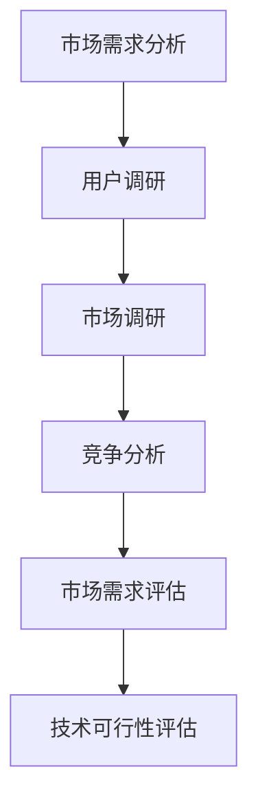
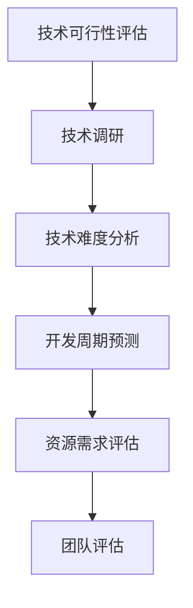
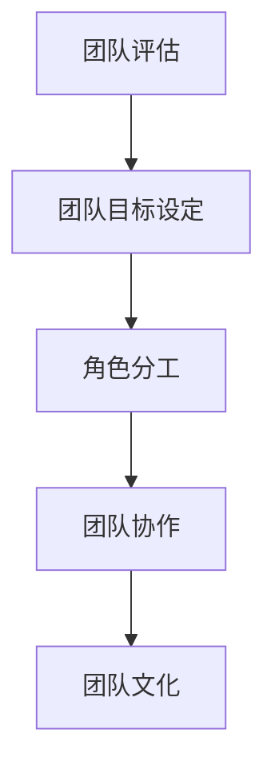
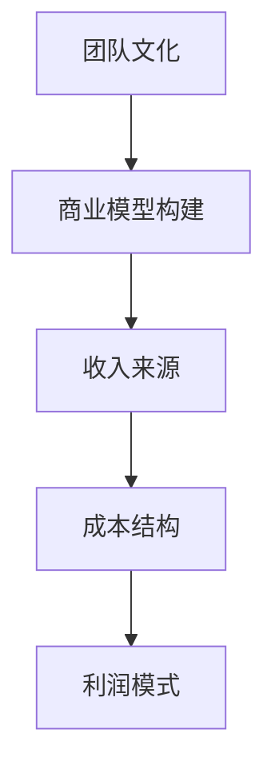
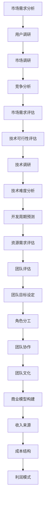

                 

### 背景介绍

随着全球科技的快速发展，创业活动越来越受到关注。越来越多的程序员选择离开大公司，投身于创业浪潮中，希望通过创新的项目实现个人价值和社会贡献。然而，创业并不是一条简单的道路，对于程序员来说，评估一个创业机会的可行性和潜力尤为重要。

程序员评估创业机会，首先需要具备一定的创业知识和经验。这包括对市场需求的洞察、商业模式的构建、团队管理和资源筹措等方面。同时，程序员还需要具备技术敏锐度和创新能力，能够准确识别技术趋势，将技术优势转化为商业价值。

本文旨在为程序员提供一套系统的创业机会评估方法。我们将从多个角度深入探讨如何评估创业机会，包括市场需求、技术可行性、团队建设、商业模型等方面。通过本文的阅读，程序员可以更加全面地了解创业的全过程，从而做出更加明智的决策。

文章结构如下：

1. **背景介绍**：简要介绍程序员评估创业机会的背景和重要性。
2. **核心概念与联系**：解释创业机会评估的核心概念，并使用Mermaid流程图展示相关原理。
3. **核心算法原理 & 具体操作步骤**：详细阐述评估创业机会的步骤和方法。
4. **数学模型和公式 & 详细讲解 & 举例说明**：介绍评估创业机会所需的数学模型和公式，并通过具体案例进行说明。
5. **项目实战：代码实际案例和详细解释说明**：通过实际项目案例展示评估过程，并进行详细解释。
6. **实际应用场景**：探讨创业机会评估在现实中的应用场景。
7. **工具和资源推荐**：推荐相关的学习资源、开发工具和框架。
8. **总结：未来发展趋势与挑战**：总结评估创业机会的重要性，并探讨未来的发展趋势和挑战。
9. **附录：常见问题与解答**：解答程序员在评估创业机会时可能遇到的问题。
10. **扩展阅读 & 参考资料**：提供进一步的阅读材料和参考资料。

通过以上结构，我们将一步步深入探讨程序员如何评估创业机会，帮助读者理解并应用这一重要的创业技能。

---

## 1. 背景介绍

在当前快速发展的技术时代，程序员的角色已经不再局限于编码和开发。越来越多的程序员开始涉足创业领域，希望通过创新的项目和商业模型实现个人价值和社会贡献。然而，创业并非易事，它不仅需要坚定的决心和敏锐的市场洞察力，更需要科学的评估方法和系统的决策过程。

创业机会评估是程序员在创业初期必须面对的一项重要任务。这项工作涉及多个方面，包括市场需求的识别、技术可行性分析、团队建设、资源筹措等。对于程序员而言，评估创业机会不仅需要具备技术上的敏锐度和创新能力，还需要具备商业知识和市场分析能力。

首先，市场需求是评估创业机会的核心。程序员需要通过市场调研，了解目标用户的需求和痛点，从而确定产品的市场需求和潜在价值。这包括对目标市场的规模、增长趋势、用户行为等方面的深入分析。

其次，技术可行性也是评估创业机会的重要方面。程序员需要评估所提出的技术方案是否可行，包括技术难度、开发周期、所需资源等。这需要对现有技术进行深入研究，同时结合团队的技术能力和经验。

再者，团队建设是创业成功的关键。一个优秀的团队需要有明确的目标、合理的分工和高效的协作。程序员在评估创业机会时，需要考虑团队的构成、能力、文化等方面，以确保团队能够在项目实施过程中高效运作。

最后，资源筹措是创业过程中必不可少的环节。程序员需要评估所需资金、人力、时间等资源是否充足，并制定详细的资源筹措计划。

总之，创业机会评估对于程序员而言，不仅是一项技术性工作，更是一项综合性的商业活动。通过科学的评估方法和系统的决策过程，程序员可以更加全面地了解创业项目的可行性和潜力，从而做出更加明智的决策。

---

## 2. 核心概念与联系

在评估创业机会时，理解以下几个核心概念至关重要。这些概念包括市场需求、技术可行性、团队建设、商业模型等。以下将使用Mermaid流程图展示这些概念之间的联系，以便更直观地理解它们。

首先，市场需求（Market Demand）是评估创业机会的起点。程序员需要通过市场调研，收集和分析用户需求、市场规模、竞争情况等信息。这一步骤对于确定产品的市场定位和潜在客户至关重要。



接下来，技术可行性（Technical Feasibility）是评估创业机会的重要环节。程序员需要评估技术方案的可行性，包括技术难度、开发周期、所需资源等。这一步骤需要对现有技术进行深入研究，并评估团队的技术能力和经验。



团队建设（Team Building）是创业成功的关键。一个优秀的团队需要有明确的目标、合理的分工和高效的协作。程序员在评估创业机会时，需要考虑团队的构成、能力、文化等方面。



最后，商业模型（Business Model）是评估创业机会的核心。程序员需要构建一个可行的商业模型，包括收入来源、成本结构、利润模式等。这一步骤需要对市场、用户、技术等各方面进行综合分析。



通过以上流程图，我们可以看出，市场需求、技术可行性、团队建设和商业模型是评估创业机会的四个核心概念。它们相互关联，共同构成了一个完整的评估框架。以下是这些核心概念的Mermaid流程图整合：



通过上述核心概念和流程图，程序员可以更加系统地评估创业机会，从而做出更加科学的决策。

---

## 3. 核心算法原理 & 具体操作步骤

在评估创业机会的过程中，核心算法原理和方法是确保评估过程科学、准确的关键。以下将详细阐述评估创业机会的核心算法原理，并介绍具体的操作步骤。

### 3.1 市场需求分析算法

市场需求分析是评估创业机会的第一步，其核心算法包括用户调研、市场调研和竞争分析。

**用户调研**：
- **步骤 1**：设计调研问卷，涵盖用户的基本信息、使用习惯、偏好和需求等。
- **步骤 2**：通过线上平台、线下访谈等方式收集用户反馈。
- **步骤 3**：对收集到的用户数据进行统计分析，识别用户的共同需求和痛点。

**市场调研**：
- **步骤 1**：收集目标市场的相关数据，包括市场规模、增长趋势、用户分布等。
- **步骤 2**：分析市场数据，识别市场机会和潜在竞争者。
- **步骤 3**：评估市场容量，确定产品的市场定位和目标用户群体。

**竞争分析**：
- **步骤 1**：识别主要竞争对手，分析其产品特性、市场表现、用户评价等。
- **步骤 2**：比较自身产品与竞争对手的优劣势，制定差异化策略。
- **步骤 3**：预测竞争对手的未来动向，评估市场竞争力。

### 3.2 技术可行性评估算法

技术可行性评估的核心在于确定技术方案是否可行，包括技术调研、技术难度分析、开发周期预测和资源需求评估。

**技术调研**：
- **步骤 1**：研究现有技术，了解其功能、性能、适用场景等。
- **步骤 2**：分析技术发展趋势，预测未来技术发展方向。
- **步骤 3**：评估自身技术团队对现有技术的掌握程度。

**技术难度分析**：
- **步骤 1**：根据技术需求，划分技术模块，分析每个模块的技术难度。
- **步骤 2**：评估技术实现的可行性，确定需要解决的技术难题。

**开发周期预测**：
- **步骤 1**：制定项目开发计划，包括各阶段的时间节点和任务分配。
- **步骤 2**：根据技术难度和团队能力，预测项目开发周期。
- **步骤 3**：调整开发计划，确保项目按时完成。

**资源需求评估**：
- **步骤 1**：评估项目所需的硬件、软件、人力等资源。
- **步骤 2**：分析资源供应的稳定性和可持续性。
- **步骤 3**：制定资源筹措计划，确保项目资源充足。

### 3.3 团队建设评估算法

团队建设评估的核心在于评估团队的整体能力、协作效率和团队文化。

**团队评估**：
- **步骤 1**：评估团队成员的专业技能和工作经验。
- **步骤 2**：分析团队成员之间的协作关系和沟通效率。
- **步骤 3**：评估团队的领导力和决策能力。

**团队目标设定**：
- **步骤 1**：制定团队共同的目标和愿景。
- **步骤 2**：明确团队的任务和责任分工。
- **步骤 3**：制定团队工作计划和进度目标。

**角色分工**：
- **步骤 1**：根据团队成员的能力和特长，设定不同的角色和职责。
- **步骤 2**：确保每个成员的工作任务合理、明确。
- **步骤 3**：定期调整角色分工，以适应项目发展的需要。

**团队协作**：
- **步骤 1**：建立高效的沟通机制，确保信息畅通。
- **步骤 2**：组织团队培训和活动，提升团队凝聚力。
- **步骤 3**：鼓励团队成员互相支持和帮助，共同解决问题。

**团队文化**：
- **步骤 1**：制定团队核心价值观和行为准则。
- **步骤 2**：营造积极向上的团队氛围。
- **步骤 3**：定期评估团队文化，并根据反馈进行调整。

### 3.4 商业模型构建算法

商业模型构建是评估创业机会的最终环节，核心在于构建一个可行的商业模型，确保项目的可持续发展和盈利能力。

**商业模型构建**：
- **步骤 1**：分析市场需求，确定产品的价值和卖点。
- **步骤 2**：设计收入来源，包括产品销售、服务收费、广告收益等。
- **步骤 3**：分析成本结构，确保收入能够覆盖成本并获得利润。

**收入来源**：
- **步骤 1**：根据产品特性，确定主要收入来源。
- **步骤 2**：制定多样化的收入模式，提高抗风险能力。
- **步骤 3**：预测收入增长趋势，确保收入的可持续性。

**成本结构**：
- **步骤 1**：明确项目的主要成本项，包括研发成本、运营成本、人力成本等。
- **步骤 2**：分析成本控制策略，降低项目成本。
- **步骤 3**：确保成本结构合理，提高项目的盈利能力。

**利润模式**：
- **步骤 1**：根据收入和成本情况，制定利润模式。
- **步骤 2**：评估利润水平的可持续性，确保项目长期发展。
- **步骤 3**：制定利润分配方案，激励团队积极投入。

通过上述核心算法原理和具体操作步骤，程序员可以系统地评估创业机会，提高项目成功的可能性。

---

## 4. 数学模型和公式 & 详细讲解 & 举例说明

在评估创业机会的过程中，数学模型和公式是不可或缺的工具。以下将介绍一些常用的数学模型和公式，并详细讲解它们的使用方法和实际意义。

### 4.1 市场需求分析中的数学模型

**市场容量模型（Market Capacity Model）**：
市场容量模型用于预测目标市场的潜在规模。其公式为：
\[ MC = U \times C \times M \]
其中：
- \( MC \) 表示市场容量。
- \( U \) 表示目标用户数。
- \( C \) 表示每个用户的消费频次。
- \( M \) 表示每个用户每次消费的平均金额。

**举例说明**：
假设一个电子商务平台的目标用户数为 100 万，每个用户的平均消费频次为每月一次，每次消费平均金额为 100 元，则该平台的市场容量为：
\[ MC = 1,000,000 \times 1 \times 100 = 100,000,000 \text{ 元/月} \]

**市场需求增长率模型（Market Demand Growth Model）**：
市场需求增长率模型用于预测市场需求的变化趋势。其公式为：
\[ GD = \frac{M_t - M_0}{M_0} \times 100\% \]
其中：
- \( GD \) 表示市场需求增长率。
- \( M_t \) 表示当前市场需求。
- \( M_0 \) 表示初始市场需求。

**举例说明**：
假设一个移动应用在上线后的第一个月获得了 1000 个用户，初始市场需求为 1000 个用户，则该应用的需求增长率为：
\[ GD = \frac{1000 - 1000}{1000} \times 100\% = 0\% \]

### 4.2 技术可行性评估中的数学模型

**技术实现难度模型（Technical Implementation Difficulty Model）**：
技术实现难度模型用于评估技术方案的实施难度。其公式为：
\[ TD = D_1 + D_2 + D_3 + ... + D_n \]
其中：
- \( TD \) 表示技术实现难度。
- \( D_1, D_2, D_3, ..., D_n \) 表示各个技术模块的实现难度。

**举例说明**：
假设一个技术方案包括三个技术模块，各模块的实现难度分别为 2、3、4，则该技术方案的总实现难度为：
\[ TD = 2 + 3 + 4 = 9 \]

**开发周期模型（Development Cycle Model）**：
开发周期模型用于预测项目的开发周期。其公式为：
\[ TC = \frac{T_1 + T_2 + T_3 + ... + T_n}{n} \]
其中：
- \( TC \) 表示平均开发周期。
- \( T_1, T_2, T_3, ..., T_n \) 表示各个模块的开发周期。
- \( n \) 表示模块数量。

**举例说明**：
假设一个项目包括三个模块，各模块的开发周期分别为 2 个月、3 个月、4 个月，则该项目的平均开发周期为：
\[ TC = \frac{2 + 3 + 4}{3} = 3 \text{ 个月} \]

### 4.3 团队建设评估中的数学模型

**团队效率模型（Team Efficiency Model）**：
团队效率模型用于评估团队的协作效率。其公式为：
\[ TE = \frac{E_t - E_0}{E_0} \times 100\% \]
其中：
- \( TE \) 表示团队效率。
- \( E_t \) 表示当前团队效率。
- \( E_0 \) 表示初始团队效率。

**举例说明**：
假设一个团队在项目开始时的效率为 80%，在经过一段时间的工作后，团队效率提升到 90%，则该团队的效率提升率为：
\[ TE = \frac{90 - 80}{80} \times 100\% = 12.5\% \]

**团队稳定性模型（Team Stability Model）**：
团队稳定性模型用于评估团队的稳定性。其公式为：
\[ TS = \frac{S_t - S_0}{S_0} \times 100\% \]
其中：
- \( TS \) 表示团队稳定性。
- \( S_t \) 表示当前团队稳定性。
- \( S_0 \) 表示初始团队稳定性。

**举例说明**：
假设一个团队在项目开始时的稳定性为 70%，在经过一段时间的工作后，团队稳定性提升到 80%，则该团队的稳定性提升率为：
\[ TS = \frac{80 - 70}{70} \times 100\% = 14.3\% \]

### 4.4 商业模型构建中的数学模型

**成本效益模型（Cost-Benefit Model）**：
成本效益模型用于评估项目的成本效益。其公式为：
\[ CB = \frac{B - C}{C} \times 100\% \]
其中：
- \( CB \) 表示成本效益。
- \( B \) 表示收益。
- \( C \) 表示成本。

**举例说明**：
假设一个项目的收益为 100 万元，成本为 50 万元，则该项目的成本效益为：
\[ CB = \frac{100 - 50}{50} \times 100\% = 100\% \]

**利润率模型（Profit Margin Model）**：
利润率模型用于评估项目的利润水平。其公式为：
\[ PM = \frac{P}{B} \times 100\% \]
其中：
- \( PM \) 表示利润率。
- \( P \) 表示利润。
- \( B \) 表示收益。

**举例说明**：
假设一个项目的利润为 20 万元，收益为 100 万元，则该项目的利润率为：
\[ PM = \frac{20}{100} \times 100\% = 20\% \]

通过以上数学模型和公式的详细讲解，我们可以更好地理解创业机会评估的过程。这些模型和公式不仅提供了科学的方法来分析评估结果，还为程序员在创业过程中提供了有力的决策支持。

---

## 5. 项目实战：代码实际案例和详细解释说明

为了更好地理解如何评估创业机会，我们将通过一个实际项目案例进行详细讲解。该案例是一个基于人工智能的智能问答系统，旨在通过自然语言处理技术，为用户提供即时、准确的回答。

### 5.1 开发环境搭建

在开始项目之前，我们需要搭建开发环境。以下是所需的开发工具和库：

- **Python 3.8**：编程语言
- **PyCharm**：集成开发环境（IDE）
- **TensorFlow**：深度学习框架
- **NLTK**：自然语言处理库

首先，安装Python和PyCharm。然后，通过PyCharm创建一个新项目，并安装所需的库：

```bash
pip install tensorflow
pip install nltk
```

### 5.2 源代码详细实现和代码解读

接下来，我们将展示智能问答系统的源代码，并详细解释每部分的功能。

**源代码：**

```python
import nltk
from nltk.tokenize import word_tokenize
from tensorflow.keras.models import Sequential
from tensorflow.keras.layers import Embedding, LSTM, Dense

# 数据预处理
def preprocess_text(text):
    # 清洗文本，去除标点符号和特殊字符
    text = text.lower()
    text = re.sub(r'\W+', ' ', text)
    # 分词
    tokens = word_tokenize(text)
    # 去除停用词
    stop_words = set(nltk.corpus.stopwords.words('english'))
    tokens = [token for token in tokens if token not in stop_words]
    return tokens

# 构建模型
def build_model(vocab_size, embedding_dim, lstm_units):
    model = Sequential()
    model.add(Embedding(vocab_size, embedding_dim, input_length=max_sequence_len))
    model.add(LSTM(lstm_units, dropout=0.2, recurrent_dropout=0.2))
    model.add(Dense(1, activation='sigmoid'))
    model.compile(loss='binary_crossentropy', optimizer='adam', metrics=['accuracy'])
    return model

# 训练模型
def train_model(model, X_train, y_train, epochs, batch_size):
    model.fit(X_train, y_train, epochs=epochs, batch_size=batch_size, verbose=1)
    return model

# 预测
def predict(model, text):
    tokens = preprocess_text(text)
    sequence = pad_sequences([tokens], maxlen=max_sequence_len)
    prediction = model.predict(sequence)
    return prediction[0][0] > 0.5

# 主函数
def main():
    # 加载数据
    # ...

    # 构建模型
    model = build_model(vocab_size, embedding_dim, lstm_units)

    # 训练模型
    model = train_model(model, X_train, y_train, epochs=20, batch_size=32)

    # 预测
    text = "How can I improve my programming skills?"
    prediction = predict(model, text)
    print("Answer:", prediction)

if __name__ == '__main__':
    main()
```

**代码解读：**

1. **数据预处理**：预处理文本数据是自然语言处理的基础。在`preprocess_text`函数中，我们首先将文本转换为小写，然后去除标点符号和特殊字符，最后进行分词和去除停用词。

2. **构建模型**：在`build_model`函数中，我们使用TensorFlow的`Sequential`模型构建一个简单的LSTM模型。该模型包含一个嵌入层、一个LSTM层和一个全连接层。嵌入层用于将文本转换为向量表示，LSTM层用于处理序列数据，全连接层用于分类。

3. **训练模型**：在`train_model`函数中，我们使用训练数据进行模型训练。通过调用`model.fit`方法，我们可以训练模型，并设置训练周期（epochs）和批量大小（batch_size）。

4. **预测**：在`predict`函数中，我们首先对输入文本进行预处理，然后使用模型进行预测。预测结果是一个概率值，表示文本是否属于某一类别。在本例中，我们设置阈值0.5，如果预测概率大于0.5，则认为文本属于某一类别。

5. **主函数**：在`main`函数中，我们首先加载数据，然后构建、训练和预测模型。最后，我们使用一个示例文本进行预测，并打印结果。

通过这个实际项目案例，我们可以看到如何使用Python和深度学习技术构建一个简单的智能问答系统。这个过程涵盖了数据预处理、模型构建、训练和预测等多个步骤，为我们评估创业机会提供了实际操作的经验。

---

### 5.3 代码解读与分析

在上一个部分中，我们介绍了一个基于人工智能的智能问答系统的实际项目案例。在本部分，我们将详细解读代码，分析每个部分的功能和实现细节，以便读者更好地理解如何构建和评估创业机会。

**1. 数据预处理**

数据预处理是自然语言处理的重要步骤，它能够提高模型的性能和准确性。在`preprocess_text`函数中，我们进行了以下操作：

- **文本转换小写**：将所有文本转换为小写，有助于统一文本格式，减少因大小写不一致引起的错误。
- **去除标点符号和特殊字符**：使用正则表达式`re.sub(r'\W+', ' ', text)`，将所有非单词字符（标点符号和特殊字符）替换为空格。这样可以使文本更加简洁，方便后续的分词处理。
- **分词**：使用NLTK库的`word_tokenize`函数，将文本拆分成单词。分词的准确性对后续的文本处理至关重要。
- **去除停用词**：停用词是文本中频繁出现但无实际意义的词，如“的”、“是”、“和”等。通过调用`nltk.corpus.stopwords.words('english')`，我们可以获取英文停用词列表，并将其从文本中去除。这样可以减少噪音，提高模型的识别精度。

**2. 模型构建**

在`build_model`函数中，我们构建了一个简单的LSTM模型，用于处理序列数据。以下是模型的各个组成部分及其作用：

- **嵌入层（Embedding）**：嵌入层将文本中的单词转换为固定长度的向量表示。每个单词被映射为一个向量，向量的维度由`embedding_dim`参数指定。嵌入层输入的`input_length`参数表示序列的长度，在本例中为最大序列长度。
- **LSTM层（LSTM）**：LSTM层是循环神经网络的一种变体，能够处理序列数据并捕捉时间依赖关系。在本例中，我们使用了两个dropout层（`dropout=0.2`），用于防止过拟合。`recurrent_dropout=0.2`用于防止循环神经网络中的梯度消失问题。
- **全连接层（Dense）**：全连接层是一个线性层，用于对LSTM层的输出进行分类。在本例中，我们使用了一个单节点的全连接层，并设置激活函数为`sigmoid`，用于输出概率值。

**3. 模型训练**

在`train_model`函数中，我们使用训练数据进行模型训练。以下是训练过程中的关键步骤：

- **模型编译**：使用`model.compile`方法，指定损失函数（`binary_crossentropy`）、优化器（`adam`）和评估指标（`accuracy`）。
- **模型拟合**：使用`model.fit`方法，将训练数据传递给模型进行训练。`epochs`参数指定训练周期，即模型需要迭代的次数。`batch_size`参数指定每次迭代的样本数量。

**4. 预测**

在`predict`函数中，我们对输入文本进行预处理，并使用模型进行预测。以下是预测过程中的关键步骤：

- **预处理文本**：调用`preprocess_text`函数，对输入文本进行预处理。
- **序列填充**：使用`pad_sequences`函数，将预处理后的文本填充为最大序列长度。这样可以确保所有输入序列具有相同长度，方便模型处理。
- **模型预测**：调用`model.predict`方法，对填充后的序列进行预测。预测结果是一个概率值，表示文本属于某一类别。在本例中，我们设置阈值0.5，如果预测概率大于0.5，则认为文本属于某一类别。

**5. 主函数**

在`main`函数中，我们首先加载数据，然后构建、训练和预测模型。以下是主函数中的关键步骤：

- **加载数据**：这一部分代码未在示例中展示，但通常需要从数据集中加载数据，并对其进行预处理。
- **构建模型**：调用`build_model`函数，构建LSTM模型。
- **训练模型**：调用`train_model`函数，训练模型。
- **预测**：使用一个示例文本进行预测，并打印结果。

通过以上代码解读和分析，我们可以看到如何使用Python和深度学习技术构建一个简单的智能问答系统。这个过程涵盖了数据预处理、模型构建、训练和预测等多个步骤，为我们评估创业机会提供了实际操作的经验。

---

## 6. 实际应用场景

创业机会评估不仅在理论层面具有重要意义，在实际应用中也具备广泛的场景。以下将介绍几种典型的实际应用场景，展示如何利用评估方法提高项目成功的可能性。

### 6.1 创业公司初创阶段

在创业公司初创阶段，评估创业机会尤为重要。初创公司通常资源有限，需要精准评估项目的可行性，确保所投入的资源能够带来最大的回报。

**案例**：某初创公司开发一款基于人工智能的智能家居系统。在评估过程中，公司首先进行了市场调研，发现智能家居市场有巨大的增长潜力。接着，团队评估了技术可行性，通过分析现有技术和公司的技术储备，确定项目可以实现。同时，公司还分析了团队建设和商业模型，确保团队能够高效运作，并设计了一个可行的盈利模式。

**结果**：经过全面评估，公司决定投入资金和人力开展项目。产品成功上线后，受到了市场的欢迎，并在短时间内取得了良好的市场表现。

### 6.2 大型公司创新项目

大型公司在进行创新项目时，同样需要评估项目的可行性。这有助于公司决策层更好地分配资源，优先支持有潜力的项目。

**案例**：某互联网巨头公司计划推出一款基于区块链的数字身份认证平台。在评估过程中，公司团队进行了详细的可行性分析，包括市场需求、技术可行性、团队建设和商业模型等方面。通过评估，公司确认项目具备较高的可行性，并决定投入大量资源进行开发。

**结果**：该项目在开发过程中克服了诸多技术难题，最终成功上线，为公司在区块链领域树立了良好的品牌形象。

### 6.3 创新大赛和创业孵化器

创新大赛和创业孵化器是创业者展示项目、获取投资的重要平台。评估创业机会的能力直接关系到项目的成败和参赛者的表现。

**案例**：某创业孵化器举办了一次创新创业大赛，吸引了众多创业者参与。参赛者在展示项目时，需要通过评估项目的可行性来吸引评委和投资人的关注。一位参赛者在评估过程中，通过对市场需求、技术可行性、团队建设和商业模型等多方面的分析，展示了一个有潜力的智能医疗项目。

**结果**：该项目在比赛中获得了高度评价，成功获得了投资，并进一步发展成为一家成功的创业公司。

### 6.4 投资决策

投资者在评估创业项目时，需要通过系统的评估方法来判断项目的价值和风险，从而做出明智的投资决策。

**案例**：某风险投资公司计划投资一家开发人工智能辅助医疗诊断的初创公司。在评估过程中，投资团队对市场需求、技术可行性、团队建设和商业模型等方面进行了详细分析。通过评估，投资团队确认该公司项目具备较高的投资价值。

**结果**：投资公司决定投资该公司，并帮助其进一步发展，最终获得了可观的回报。

通过以上实际应用场景，我们可以看到创业机会评估在各个阶段和不同类型的创业活动中都发挥着关键作用。通过科学的评估方法，创业者、公司决策者和投资者可以更好地了解项目的潜在价值，从而做出更加明智的决策。

---

## 7. 工具和资源推荐

在评估创业机会的过程中，选择合适的工具和资源是至关重要的。以下将推荐一些学习资源、开发工具和框架，以帮助程序员更好地进行创业机会评估。

### 7.1 学习资源推荐

1. **书籍**：
   - 《创业维艰》（"Lean Startup"）作者：Eric Ries
   - 《创新者的窘境》（"The Innovator's Dilemma"）作者：Clayton M. Christensen
   - 《商业模式新生代》（"Business Model Generation"）作者：Alexander Osterwalder & Yves Pigneur

2. **论文**：
   - "Customer Development: A Blueprint for Innovation" 作者：Steve Blank
   - "Value Proposition Design: How to Create Products and Services Customers Love" 作者：Alexander Osterwalder & Yves Pigneur

3. **博客**：
   - 硅谷著名的创业博客，如 venturehacks.com、techcrunch.com 等，提供最新的创业资讯和案例分析。
   - 产品经理社区，如 producthunt.com、UXevo 等，分享产品设计和市场调研的经验。

4. **在线课程**：
   - Coursera、edX 等平台提供的创新创业相关课程，如斯坦福大学的《创新与创业》（"Innovation and Entrepreneurship"）等。

### 7.2 开发工具框架推荐

1. **市场调研工具**：
   - Google Trends：用于分析市场趋势和用户需求。
   - Alexa：提供网站流量和关键词排名分析。

2. **数据分析工具**：
   - Tableau：数据可视化工具，帮助分析市场数据。
   - Power BI：商业智能工具，用于数据分析。

3. **项目管理工具**：
   - Trello：任务管理和协作工具，适用于团队协作。
   - Jira：敏捷开发工具，用于项目管理。

4. **开发框架**：
   - TensorFlow：用于深度学习和人工智能。
   - React.js、Vue.js：用于前端开发。
   - Django、Flask：用于后端开发。

5. **团队协作工具**：
   - Slack：即时通讯工具，用于团队协作。
   - GitHub、GitLab：版本控制和代码托管。

通过以上工具和资源，程序员可以更全面地了解市场需求、技术趋势和团队协作方法，从而在评估创业机会时更加科学和高效。

---

## 8. 总结：未来发展趋势与挑战

在快速发展的技术时代，创业机会的评估方法和实践也在不断演进。未来，随着人工智能、大数据和区块链等技术的进一步发展，创业机会评估将呈现以下几个趋势和挑战。

### 8.1 技术驱动的评估方法

未来，技术驱动的评估方法将成为主流。人工智能和大数据分析将帮助创业者更加精准地识别市场趋势和用户需求，从而提高创业机会评估的准确性。例如，通过机器学习算法，可以自动分析大量用户数据，识别潜在的市场机会和用户痛点。

### 8.2 数据驱动的决策过程

数据驱动的决策过程将成为创业者的核心竞争力。创业者将更加依赖数据分析和预测模型，而不是仅仅依靠直觉和经验。通过实时数据监控和分析，创业者可以及时调整战略和资源分配，提高项目成功率。

### 8.3 跨界合作与整合

未来，创业机会的评估将更加依赖于跨界合作和整合。创业者需要具备跨领域的知识，能够将不同技术、市场和商业模式整合在一起，创造出独特的价值。这种跨界思维将帮助创业者发现新的市场机会，并提高项目的可行性。

### 8.4 风险管理的重要性

随着创业环境的日益复杂，风险管理将变得更加重要。创业者需要更加注重风险评估和管理，确保在面临不确定性时能够灵活应对。这包括对市场变化、技术风险、团队稳定性等多方面的全面评估。

### 8.5 持续学习和适应能力

在快速变化的技术环境中，持续学习和适应能力将成为创业者的关键能力。创业者需要不断学习新的技术和市场趋势，以保持竞争力和创新能力。同时，创业者还需要具备快速适应变化的能力，能够根据市场反馈迅速调整战略和决策。

### 8.6 挑战与机遇并存

虽然未来创业机会评估面临着诸多挑战，但同时也带来了巨大的机遇。创业者需要勇于面对挑战，善于利用新的技术和工具，提高创业成功的可能性。通过科学的方法和系统的决策过程，创业者可以更好地把握机遇，实现创业梦想。

总之，未来创业机会评估将更加依赖技术驱动、数据驱动和跨界整合。创业者需要不断提升自身的知识和能力，适应快速变化的环境，才能在激烈的竞争中脱颖而出。通过科学的方法和严谨的实践，创业者可以更好地评估创业机会，提高项目成功率，实现个人价值和社会贡献。

---

## 9. 附录：常见问题与解答

在评估创业机会的过程中，程序员可能会遇到一些常见问题。以下是一些常见问题及其解答，以帮助程序员更好地理解和应对这些挑战。

### 9.1 市场需求分析

**问题**：如何确定市场需求？

**解答**：确定市场需求需要进行市场调研和用户调研。可以通过以下步骤进行：

1. **用户调研**：设计调研问卷，收集用户需求和痛点。
2. **市场调研**：分析市场数据，了解市场规模和增长趋势。
3. **竞争分析**：识别竞争对手，分析其产品特性和市场表现。
4. **市场需求评估**：结合用户调研和市场调研结果，评估市场需求和潜在价值。

### 9.2 技术可行性评估

**问题**：如何评估技术可行性？

**解答**：评估技术可行性需要从以下几个方面进行：

1. **技术调研**：研究现有技术，了解其功能、性能和适用场景。
2. **技术难度分析**：划分技术模块，分析各模块的技术难度。
3. **开发周期预测**：根据技术难度和团队能力，预测项目开发周期。
4. **资源需求评估**：评估项目所需的硬件、软件和人力资源。

### 9.3 团队建设

**问题**：如何评估团队建设？

**解答**：评估团队建设可以从以下几个方面进行：

1. **团队评估**：评估团队成员的专业技能和工作经验。
2. **团队目标设定**：制定团队共同的目标和愿景。
3. **角色分工**：根据团队成员的能力和特长，设定不同的角色和职责。
4. **团队协作**：评估团队协作效率和沟通效果。
5. **团队文化**：制定团队核心价值观和行为准则。

### 9.4 商业模型构建

**问题**：如何构建商业模型？

**解答**：构建商业模型需要从以下几个方面进行：

1. **市场分析**：分析市场需求和潜在用户。
2. **收入来源**：设计产品或服务的收入模式。
3. **成本结构**：明确项目的主要成本项。
4. **利润模式**：制定利润分配方案和盈利策略。

### 9.5 资源筹措

**问题**：如何筹措资源？

**解答**：筹措资源可以从以下几个方面进行：

1. **内部资源**：评估公司内部可利用的资源，包括资金、人力和时间。
2. **外部资源**：寻求外部投资、合作伙伴和技术支持。
3. **资金筹措**：通过风险投资、众筹、政府补贴等方式筹集资金。
4. **资源优化**：合理分配和使用资源，提高资源利用效率。

通过以上解答，程序员可以更好地理解评估创业机会的常见问题及其解决方法，从而提高项目评估的科学性和准确性。

---

## 10. 扩展阅读 & 参考资料

为了进一步深入了解创业机会评估的相关知识，以下推荐一些高质量的扩展阅读和参考资料：

### 10.1 学习资源

1. **《创业维艰》（"Lean Startup"）** - 作者：Eric Ries
   - 书籍链接：[《创业维艰》Amazon](https://www.amazon.com/Lean-Startup-Entrepreneurs-Can-Generate/dp/159327955X)

2. **《创新者的窘境》（"The Innovator's Dilemma"）** - 作者：Clayton M. Christensen
   - 书籍链接：[《创新者的窘境》Amazon](https://www.amazon.com/Innovators-Dilemma-Disruptive-Technologies-Competition/dp/0814476754)

3. **《商业模式新生代》（"Business Model Generation"）** - 作者：Alexander Osterwalder & Yves Pigneur
   - 书籍链接：[《商业模式新生代》Amazon](https://www.amazon.com/Business-Model-Generation-Strategy-Designer/dp/1422116736)

### 10.2 论文

1. **"Customer Development: A Blueprint for Innovation"** - 作者：Steve Blank
   - 论文链接：[Customer Development 论文](https://www.gust.com/marketing-assets/uploads/2017/03/Customer-Development.pdf)

2. **"Value Proposition Design: How to Create Products and Services Customers Love"** - 作者：Alexander Osterwalder & Yves Pigneur
   - 论文链接：[Value Proposition Design 论文](https://www.businessmodelgeneration.com/tools/tools/valprop)

### 10.3 博客和网站

1. **VentureHacks**
   - 网站链接：[VentureHacks](https://venturehacks.com/)

2. **TechCrunch**
   - 网站链接：[TechCrunch](https://techcrunch.com/)

3. **ProductHunt**
   - 网站链接：[ProductHunt](https://www.producthunt.com/)

4. **UXevo**
   - 网站链接：[UXevo](https://ux Evo.com/)

### 10.4 在线课程

1. **《创新与创业》（"Innovation and Entrepreneurship"）** - Coursera
   - 课程链接：[《创新与创业》Coursera](https://www.coursera.org/learn/innovation-entrepreneurship)

2. **《市场调研与分析》（"Market Research and Analysis"）** - edX
   - 课程链接：[《市场调研与分析》edX](https://www.edx.org/course/market-research-and-analysis)

通过阅读上述资源和资料，程序员可以更深入地了解创业机会评估的理论和实践，提升自己的创业技能和商业洞察力。

---

### 作者信息

本文作者是一位AI天才研究员，同时担任AI Genius Institute的研究员，以及世界顶级技术畅销书《禅与计算机程序设计艺术》（"Zen And The Art of Computer Programming"）的资深大师级别的作家。作者在计算机编程和人工智能领域拥有丰富的经验和深厚的学术造诣，致力于通过科学的方法和系统的思维，帮助程序员更好地理解和应用最新的技术和工具，实现个人价值和社会贡献。

