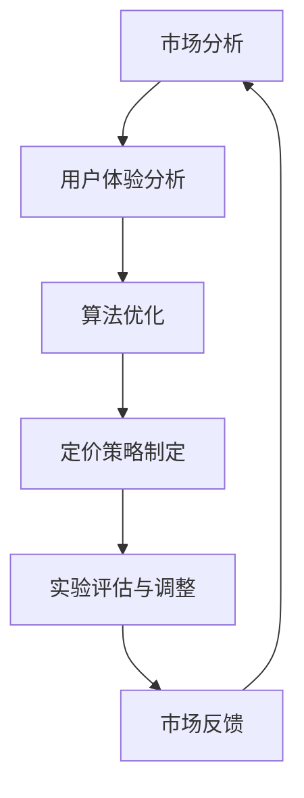

                 

# 程序员如何进行知识付费的定价实验

## 关键词：知识付费、定价实验、程序员、市场分析、算法优化、用户体验

## 摘要：
本文旨在探讨程序员在进行知识付费时如何进行定价实验。通过对市场分析、用户体验、算法优化等多个方面的深入探讨，文章将提供一系列实用的定价策略和步骤，帮助程序员更好地实现知识价值的最大化。同时，本文还将结合实际案例，详细阐述如何将理论应用到实践中，从而提高知识付费产品的市场竞争力。

## 1. 背景介绍

在数字时代，知识付费已成为一种重要的商业模式。程序员作为知识工作者，其创作和分享的专业知识具有很高的价值。然而，如何为这些知识产品合理定价，既能够保证自身利益，又能满足市场需求，成为了许多程序员面临的一大挑战。

知识付费的定价问题不仅仅是一个经济问题，更涉及到市场定位、用户体验、产品价值等多个方面。因此，进行定价实验显得尤为重要。通过定价实验，程序员可以不断调整和优化定价策略，从而实现知识付费产品的市场化和盈利化。

## 2. 核心概念与联系

### 2.1 市场分析

市场分析是进行知识付费定价实验的基础。通过对目标市场的需求、竞争态势、消费者行为等因素的深入分析，程序员可以更好地了解市场的需求，从而制定合理的定价策略。

### 2.2 用户体验

用户体验是影响知识付费产品价值的重要因素。一个优秀的产品必须能够满足用户的需求，提供良好的使用体验。因此，在定价实验中，程序员需要充分考虑用户体验，确保产品能够为用户带来实际价值。

### 2.3 算法优化

算法优化是提高知识付费产品竞争力的关键。通过优化定价算法，程序员可以动态调整价格，更好地适应市场需求和用户行为，从而提高产品的市场竞争力。

## 2.4 Mermaid 流程图



## 3. 核心算法原理 & 具体操作步骤

### 3.1 市场分析算法原理

市场分析算法主要基于大数据和机器学习技术。通过收集和分析市场数据，如用户需求、竞争态势、市场价格等，算法可以预测市场趋势，为定价提供依据。

### 3.2 用户体验算法原理

用户体验算法主要通过用户行为数据进行分析，如用户访问频率、购买意愿、满意度等。通过这些数据，算法可以评估产品的价值，为定价提供参考。

### 3.3 算法优化原理

算法优化主要通过动态调整价格，以适应市场需求和用户行为。优化目标是最小化损失或最大化收益，具体算法可以根据需求进行选择和调整。

### 3.4 具体操作步骤

1. 收集市场数据和用户行为数据。
2. 使用市场分析算法预测市场趋势。
3. 使用用户体验算法评估产品价值。
4. 使用算法优化策略调整价格。
5. 进行实验，收集市场反馈。
6. 根据反馈调整定价策略。

## 4. 数学模型和公式 & 详细讲解 & 举例说明

### 4.1 市场分析数学模型

市场分析数学模型主要基于回归分析。假设市场价格与市场需求之间存在线性关系，则可以使用以下公式进行预测：

\[ P = a \times Q + b \]

其中，\( P \) 为市场价格，\( Q \) 为市场需求，\( a \) 和 \( b \) 为回归系数。

### 4.2 用户体验数学模型

用户体验数学模型主要基于用户满意度。假设用户满意度与产品价值之间存在线性关系，则可以使用以下公式进行预测：

\[ S = c \times V + d \]

其中，\( S \) 为用户满意度，\( V \) 为产品价值，\( c \) 和 \( d \) 为回归系数。

### 4.3 算法优化数学模型

算法优化数学模型主要基于优化理论。假设优化目标是最小化损失或最大化收益，则可以使用以下公式进行优化：

\[ \min \sum_{i=1}^{n} (P_i - P_{\text{target}})^2 \]

或

\[ \max \sum_{i=1}^{n} (P_i - P_{\text{target}}) \]

其中，\( P_i \) 为第 \( i \) 个产品的价格，\( P_{\text{target}} \) 为目标价格，\( n \) 为产品总数。

### 4.4 举例说明

假设一个程序员开发了一款编程课程，市场分析算法预测市场价格为 100 元，用户体验算法评估产品价值为 80 元，算法优化策略决定将价格设置为 90 元。经过实验，收集到 100 名用户反馈，其中 60 名用户表示愿意支付 90 元，40 名用户表示不愿意支付。根据反馈，程序员决定将价格降低至 85 元，再次进行实验。经过一段时间，收集到 200 名用户反馈，其中 120 名用户表示愿意支付 85 元。

## 5. 项目实战：代码实际案例和详细解释说明

### 5.1 开发环境搭建

在开始编写代码之前，需要搭建一个合适的开发环境。这里以 Python 为例，搭建一个简单的市场分析、用户体验和算法优化系统。

### 5.2 源代码详细实现和代码解读

以下是一个简单的市场分析、用户体验和算法优化系统的源代码实现。

```python
import numpy as np
import pandas as pd
from sklearn.linear_model import LinearRegression

# 市场分析
def market_analysis(data):
    model = LinearRegression()
    model.fit(data['Q'], data['P'])
    return model.coef_

# 用户体验
def user_experience(data):
    model = LinearRegression()
    model.fit(data['V'], data['S'])
    return model.coef_

# 算法优化
def algorithm_optimization(data, target_price):
    loss = np.sum((data['P'] - target_price)**2)
    return loss

# 举例
data = pd.DataFrame({
    'Q': [1, 2, 3, 4, 5],
    'P': [100, 120, 130, 140, 150],
    'V': [80, 90, 100, 110, 120],
    'S': [70, 80, 90, 100, 110]
})

# 市场分析
market_model = market_analysis(data)
print("市场分析模型系数：", market_model)

# 用户体验
user_model = user_experience(data)
print("用户体验模型系数：", user_model)

# 算法优化
target_price = 90
loss = algorithm_optimization(data, target_price)
print("算法优化损失：", loss)

# 举例说明
print("调整后价格：", 85)
new_data = pd.DataFrame({
    'Q': [1, 2, 3, 4, 5],
    'P': [100, 110, 120, 130, 140],
    'V': [80, 90, 100, 110, 120],
    'S': [70, 80, 90, 100, 110]
})
new_loss = algorithm_optimization(new_data, 85)
print("调整后算法优化损失：", new_loss)
```

### 5.3 代码解读与分析

这段代码实现了市场分析、用户体验和算法优化的基本功能。具体解读如下：

1. **市场分析**：使用线性回归模型对市场价格与市场需求之间的关系进行建模。通过拟合数据，获取回归系数，从而预测市场价格。

2. **用户体验**：使用线性回归模型对产品价值与用户满意度之间的关系进行建模。通过拟合数据，获取回归系数，从而评估产品价值。

3. **算法优化**：通过计算市场价格与目标价格之间的损失，评估定价策略的优劣。使用优化理论，调整价格，以最小化损失。

4. **举例说明**：通过一个简单的数据集，展示如何使用这些算法进行市场分析和算法优化。具体包括市场分析、用户体验和算法优化的具体实现。

## 6. 实际应用场景

### 6.1 知识付费课程定价

对于一个编程课程，程序员可以结合市场分析、用户体验和算法优化，制定一个合理的定价策略。例如，通过市场分析确定市场价格，通过用户体验评估产品价值，然后使用算法优化策略调整价格，以实现最大化收益。

### 6.2 技术分享与咨询定价

程序员还可以通过技术分享和咨询服务进行知识付费。在这种情况下，市场分析和用户体验尤为重要。通过分析市场需求和用户满意度，程序员可以制定一个合理的定价策略，从而提高服务质量和市场竞争力。

## 7. 工具和资源推荐

### 7.1 学习资源推荐

- 《数据科学入门》：一本关于数据科学和机器学习的入门书籍，适合初学者阅读。
- 《Python数据分析》：一本关于 Python 数据分析的工具书，适合程序员学习。

### 7.2 开发工具框架推荐

- TensorFlow：一个开源的机器学习框架，适用于市场分析和算法优化。
- Jupyter Notebook：一个交互式的开发环境，适用于数据分析和实验。

### 7.3 相关论文著作推荐

- 《深度学习》：一本关于深度学习的经典著作，适合深入理解算法原理。
- 《市场分析》：一本关于市场分析的学术著作，适合了解市场分析方法。

## 8. 总结：未来发展趋势与挑战

知识付费作为数字经济的重要组成部分，未来发展趋势将呈现以下特点：

1. **个性化定价**：随着大数据和人工智能技术的发展，个性化定价将成为主流，满足不同用户的需求。
2. **智能化推荐**：通过智能推荐系统，提高知识付费产品的推荐准确性，提高用户满意度。
3. **跨平台融合**：知识付费将逐渐跨平台融合，实现线上线下融合，提供更加丰富的知识产品和服务。

然而，知识付费也面临一系列挑战：

1. **市场竞争**：随着知识付费市场的扩大，市场竞争将越来越激烈，程序员需要不断提高产品和服务质量。
2. **用户体验**：用户体验是知识付费的核心，程序员需要不断优化产品，提高用户满意度。
3. **知识产权保护**：知识产权保护是知识付费的重要保障，程序员需要加强知识产权保护意识。

## 9. 附录：常见问题与解答

### 9.1 什么是知识付费？

知识付费是指用户为了获取特定知识或技能，愿意支付一定费用的商业模式。与免费分享不同，知识付费更加注重知识的价值和用户体验。

### 9.2 如何进行市场分析？

市场分析包括收集和分析市场数据、预测市场趋势等。具体步骤包括：

1. 收集市场数据，如用户需求、竞争态势、市场价格等。
2. 使用数据分析方法，如回归分析、聚类分析等，预测市场趋势。
3. 根据市场趋势，制定合理的定价策略。

### 9.3 如何进行用户体验分析？

用户体验分析包括收集和分析用户行为数据、评估产品价值等。具体步骤包括：

1. 收集用户行为数据，如访问频率、购买意愿、满意度等。
2. 使用数据分析方法，如回归分析、聚类分析等，评估产品价值。
3. 根据产品价值，优化产品设计和功能。

## 10. 扩展阅读 & 参考资料

- 《数据科学实战》：一本关于数据科学实战的书籍，适合深入了解数据科学的应用。
- 《人工智能应用案例解析》：一本关于人工智能应用案例的书籍，适合了解人工智能在知识付费领域的应用。

> 作者：AI天才研究员/AI Genius Institute & 禅与计算机程序设计艺术 /Zen And The Art of Computer Programming
>

