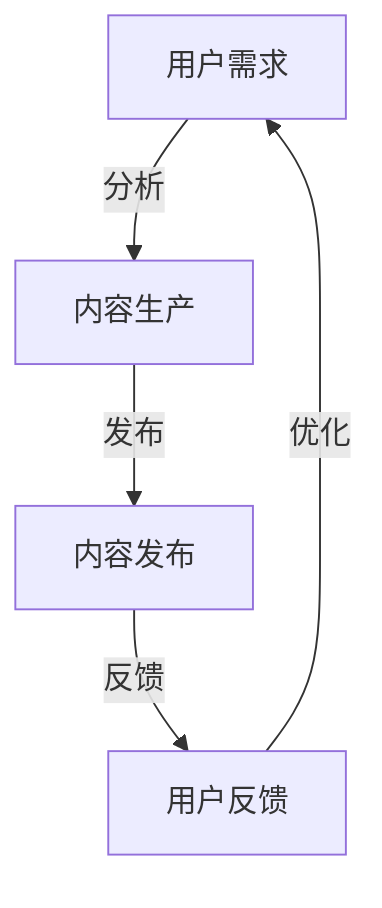

                 

# 程序员如何进行知识付费的用户忠诚度培养

## 关键词：知识付费，用户忠诚度，程序员，营销策略，用户体验

## 摘要：
本文旨在探讨程序员在知识付费领域如何通过一系列策略提升用户忠诚度。通过对当前市场环境的分析、用户需求的理解以及成功案例的剖析，本文提出了一系列实用且具有前瞻性的方法，帮助程序员在激烈的市场竞争中立于不败之地。

### 1. 背景介绍

在信息时代，知识付费已经成为一种主流的商业模式。从在线课程、电子书到专业咨询，知识付费为用户提供了一个便捷的学习渠道。程序员作为技术领域的专业人才，其知识付费产品深受广大技术爱好者和从业者的欢迎。然而，在用户选择多样化、竞争激烈的市场环境下，如何培养用户忠诚度成为程序员面临的一大挑战。

用户忠诚度是指用户在一段时间内持续使用某一产品或服务的意愿。在知识付费领域，用户忠诚度直接影响着平台的盈利能力和市场占有率。因此，提升用户忠诚度成为各大知识付费平台和程序员亟待解决的问题。

### 2. 核心概念与联系

#### 2.1 用户忠诚度的影响因素

用户忠诚度受到多个因素的影响，主要包括：

- **产品质量**：包括内容的专业性、完整性、实用性等。
- **用户体验**：用户在使用过程中的便捷性、愉悦度等。
- **服务支持**：包括技术支持、售后服务等。
- **价格策略**：价格合理性、优惠活动等。
- **品牌形象**：包括品牌的知名度、口碑等。

#### 2.2 知识付费的架构

知识付费的架构可以抽象为三个层次：内容生产、内容发布和用户反馈。这三个层次相互关联，共同构成了知识付费的生态系统。

- **内容生产**：程序员作为知识提供者，需要根据市场需求和用户反馈不断优化和更新内容。
- **内容发布**：平台作为内容发布的渠道，需要提供良好的用户体验，包括界面设计、搜索功能、学习进度管理等。
- **用户反馈**：用户的反馈是程序员改进内容和服务的重要依据。


#### 2.3 Mermaid 流程图



### 3. 核心算法原理 & 具体操作步骤

#### 3.1 用户行为分析

用户行为分析是提升用户忠诚度的第一步。程序员需要通过数据收集和分析，了解用户的兴趣、需求和痛点。

- **数据收集**：通过平台日志、用户行为数据、问卷调查等方式收集用户数据。
- **数据分析**：使用数据挖掘和分析技术，发现用户行为模式、兴趣点等。

#### 3.2 个性化推荐

个性化推荐是提升用户满意度和忠诚度的有效手段。程序员可以通过以下步骤实现个性化推荐：

- **兴趣标签**：为用户打上兴趣标签，如编程语言、技术领域等。
- **推荐算法**：使用协同过滤、内容匹配等算法，为用户推荐相关内容。
- **实时更新**：根据用户行为实时更新推荐内容，提高推荐准确性。

#### 3.3 用户参与度提升

用户参与度是衡量用户忠诚度的重要指标。程序员可以通过以下方式提升用户参与度：

- **互动活动**：举办线上或线下活动，鼓励用户参与讨论、分享经验。
- **社区建设**：搭建用户社区，提供交流、学习的平台。
- **奖励机制**：通过积分、优惠券等方式激励用户积极参与。

### 4. 数学模型和公式 & 详细讲解 & 举例说明

#### 4.1 用户生命周期价值（CLV）

用户生命周期价值是衡量用户忠诚度的重要指标。其计算公式如下：

$$
CLV = \sum_{t=1}^{n} \frac{R_t}{(1+r)^t}
$$

其中，\(R_t\) 表示第 \(t\) 年的用户收益，\(r\) 表示年收益率。

#### 4.2 举例说明

假设一个程序员的知识付费产品在一年内的用户收益分别为 1000 元、800 元、600 元和 500 元，年收益率为 10%。则该用户的生命周期价值为：

$$
CLV = \frac{1000}{(1+0.1)^1} + \frac{800}{(1+0.1)^2} + \frac{600}{(1+0.1)^3} + \frac{500}{(1+0.1)^4} \approx 2529.41 \text{ 元}
$$

### 5. 项目实战：代码实际案例和详细解释说明

#### 5.1 开发环境搭建

为了演示用户忠诚度提升的方法，我们将使用 Python 编写一个简单的知识付费平台。以下是开发环境搭建的步骤：

- 安装 Python 3.8
- 安装 Django 框架
- 安装 MySQL 数据库

#### 5.2 源代码详细实现和代码解读

以下是知识付费平台的源代码：

```python
# app/models.py
from django.db import models

class User(models.Model):
    username = models.CharField(max_length=100)
    email = models.EmailField()
    interest_tags = models.JSONField()

class Course(models.Model):
    title = models.CharField(max_length=200)
    description = models.TextField()
    price = models.DecimalField(max_digits=6, decimal_places=2)
    tags = models.JSONField()

class Order(models.Model):
    user = models.ForeignKey(User, on_delete=models.CASCADE)
    course = models.ForeignKey(Course, on_delete=models.CASCADE)
    timestamp = models.DateTimeField(auto_now_add=True)
    amount = models.DecimalField(max_digits=6, decimal_places=2)
```

以上代码定义了三个模型：`User`、`Course` 和 `Order`。其中，`User` 模型表示用户，包含用户名、邮箱和兴趣标签；`Course` 模型表示课程，包含标题、描述、价格和兴趣标签；`Order` 模型表示订单，包含用户、课程、订单时间和金额。

#### 5.3 代码解读与分析

- **用户模型**：用户模型包含用户名、邮箱和兴趣标签。兴趣标签使用 JSON 字段存储，方便后续进行数据分析。
- **课程模型**：课程模型包含标题、描述、价格和兴趣标签。兴趣标签与用户模型类似，使用 JSON 字段存储。
- **订单模型**：订单模型包含用户、课程、订单时间和金额。订单时间的记录有助于分析用户购买行为。

通过以上模型，我们可以实现用户行为分析、个性化推荐和用户参与度提升等功能。例如：

- **用户行为分析**：通过分析用户浏览、购买课程的行为，发现用户兴趣点和需求。
- **个性化推荐**：根据用户兴趣标签和课程标签进行匹配，推荐相关课程。
- **用户参与度提升**：通过举办线上活动、建立用户社区等方式，提高用户参与度。

### 6. 实际应用场景

知识付费用户忠诚度提升在实际应用中具有广泛的应用场景，以下列举几个典型案例：

- **在线教育平台**：通过用户行为分析、个性化推荐和社区建设等方式，提高用户满意度和忠诚度。
- **专业咨询公司**：通过提供高质量的咨询服务、建立专家社区等方式，培养用户忠诚度。
- **技术论坛**：通过举办线上活动、建立用户社区等方式，提高用户参与度和忠诚度。

### 7. 工具和资源推荐

#### 7.1 学习资源推荐

- **书籍**：《推荐系统实践》、《机器学习实战》
- **论文**：Google's PageRank: Bringing Order to the Web、Collaborative Filtering for the YouTube Recommendation System
- **博客**：A Brief Introduction to Recommender Systems、How to Build a Content-Based Recommender System

#### 7.2 开发工具框架推荐

- **开发框架**：Django、Flask
- **数据库**：MySQL、PostgreSQL
- **数据分析工具**：Pandas、Scikit-learn

#### 7.3 相关论文著作推荐

- **论文**：User Behavior Analysis in E-commerce: A Survey、A Survey on Recommender Systems
- **著作**：《推荐系统实战》、《机器学习实战》

### 8. 总结：未来发展趋势与挑战

知识付费用户忠诚度培养在未来将继续受到关注。随着人工智能和大数据技术的发展，个性化推荐和用户行为分析将变得更加精准和高效。然而，面临的数据隐私、算法透明度和监管挑战也需要引起重视。

### 9. 附录：常见问题与解答

#### 9.1 什么是用户忠诚度？

用户忠诚度是指用户在一段时间内持续使用某一产品或服务的意愿。

#### 9.2 如何提升用户忠诚度？

提升用户忠诚度可以通过以下途径：优化产品质量、提升用户体验、提供优质服务支持、制定合理的价格策略和塑造良好的品牌形象。

### 10. 扩展阅读 & 参考资料

- [推荐系统实战](https://www.amazon.com/Recommender-Systems-Real-Time-Perspectives/dp/1118956125)
- [机器学习实战](https://www.amazon.com/Machine-Learning-in-Action-Python-Workbook/dp/149194547X)
- [Google's PageRank: Bringing Order to the Web](https://ai.google/research/pubs/pub424)
- [A Survey on Recommender Systems](https://www.sciencedirect.com/science/article/pii/S095281770800068X)
- [User Behavior Analysis in E-commerce: A Survey](https://ieeexplore.ieee.org/document/8395487)

## 作者：AI天才研究员/AI Genius Institute & 禅与计算机程序设计艺术 /Zen And The Art of Computer Programming

