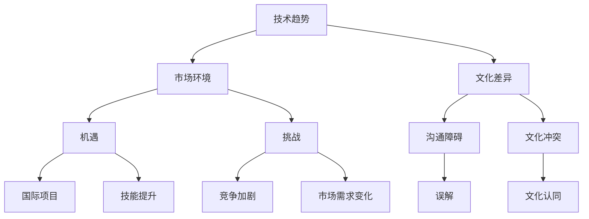

                 

# 程序员的全球化视野：机遇与挑战

> **关键词：** 全球化、程序员、机遇、挑战、技术发展、国际合作
>
> **摘要：** 本文旨在探讨全球化背景下，程序员的职业发展所面临的机遇与挑战。通过分析全球技术趋势、市场环境以及文化差异，本文探讨了程序员如何提升自己的竞争力，抓住全球化的红利，并克服文化差异带来的障碍。

## 1. 背景介绍

在当今全球化的时代，信息技术已成为推动经济发展和社会进步的关键力量。随着互联网、移动通信、人工智能等技术的飞速发展，程序员作为技术创新的主要推动者，其职业发展也面临着前所未有的机遇与挑战。

### 1.1 全球化趋势

全球化使得各国之间的经济、文化、科技交流更加频繁，也为程序员提供了广阔的发展空间。程序员可以通过互联网在全球范围内进行工作，参与到跨国项目开发中，提升自己的技能和经验。

### 1.2 技术发展

技术的快速发展带来了新的编程语言、框架和工具，程序员需要不断学习新的技术，以保持竞争力。同时，技术发展也促使程序员在不同领域进行跨学科合作，拓宽自己的知识面。

### 1.3 市场环境

全球市场的竞争愈发激烈，程序员需要具备全球视野，了解不同市场的需求，以及如何在这些市场中找到自己的定位。同时，市场的变化也要求程序员具备快速响应和适应能力。

## 2. 核心概念与联系

为了更好地理解全球化的机遇与挑战，我们需要从几个核心概念出发，包括技术趋势、市场环境和文化差异。以下是这些概念的 Mermaid 流程图：



### 2.1 技术趋势

技术趋势包括新兴技术的不断涌现，如人工智能、区块链、物联网等。这些技术的快速发展不仅改变了程序员的工作方式，也创造了新的就业机会。

### 2.2 市场环境

市场环境包括全球市场的竞争格局、不同市场的需求特点以及市场变化的趋势。程序员需要了解这些信息，以便在全球市场中找到自己的定位。

### 2.3 文化差异

文化差异包括语言、宗教、价值观等方面的差异。这些差异可能会影响程序员之间的沟通，甚至导致文化冲突。了解并尊重不同文化的差异，是程序员在全球化的环境中取得成功的关键。

## 3. 核心算法原理 & 具体操作步骤

在理解了全球化的核心概念之后，我们需要探讨程序员如何抓住全球化的机遇，并应对挑战。以下是一种可能的算法原理和操作步骤：

### 3.1 技能提升

- **具体操作步骤：**
  1. 学习新技术：定期关注技术发展趋势，学习新兴技术。
  2. 多元化知识：了解不同领域的技术，拓宽知识面。
  3. 实践项目：参与跨国项目，提升实际操作能力。

### 3.2 市场适应

- **具体操作步骤：**
  1. 研究市场：分析全球市场的需求和趋势。
  2. 定位自己：了解自己的优势和劣势，找到自己的市场定位。
  3. 快速响应：适应市场需求变化，及时调整自己的工作方向。

### 3.3 文化沟通

- **具体操作步骤：**
  1. 学习语言：学习英语等国际通用语言，提高沟通能力。
  2. 尊重差异：了解并尊重不同文化的差异，避免文化冲突。
  3. 文化认同：努力融入当地文化，增强文化认同感。

## 4. 数学模型和公式 & 详细讲解 & 举例说明

为了更好地理解上述算法原理和操作步骤，我们可以借助数学模型和公式进行详细讲解。以下是一个简单的例子：

### 4.1 技能提升模型

假设一个程序员的技能水平为 \( S \)，随着他学习的进步，技能水平会不断上升。我们可以用以下公式表示：

\[ S(t) = S(0) + \alpha t \]

其中，\( S(t) \) 表示在时间 \( t \) 时的技能水平，\( S(0) \) 表示初始技能水平，\( \alpha \) 表示技能提升的速率。

### 4.2 市场适应模型

假设一个程序员的适应能力为 \( A \)，适应能力取决于他对市场环境的了解程度。我们可以用以下公式表示：

\[ A(t) = A(0) + \beta t \]

其中，\( A(t) \) 表示在时间 \( t \) 时的适应能力，\( A(0) \) 表示初始适应能力，\( \beta \) 表示适应能力提升的速率。

### 4.3 文化沟通模型

假设一个程序员的沟通能力为 \( C \)，沟通能力取决于他对不同文化的了解程度。我们可以用以下公式表示：

\[ C(t) = C(0) + \gamma t \]

其中，\( C(t) \) 表示在时间 \( t \) 时的沟通能力，\( C(0) \) 表示初始沟通能力，\( \gamma \) 表示沟通能力提升的速率。

通过这些模型，我们可以更好地理解程序员在全球化背景下的职业发展策略。

## 5. 项目实战：代码实际案例和详细解释说明

为了更好地理解上述算法原理和操作步骤，我们可以通过一个实际项目案例进行详细解释说明。以下是一个简单的全球化项目案例：

### 5.1 开发环境搭建

为了进行全球化项目开发，我们需要搭建一个支持多语言、多平台的开发环境。以下是一个简单的搭建步骤：

1. 安装跨平台开发工具，如 Visual Studio Code。
2. 安装 Node.js 环境，用于开发前端应用。
3. 安装 Python 环境，用于开发后端应用。
4. 安装 Git，用于版本控制。

### 5.2 源代码详细实现和代码解读

以下是一个简单的全球化项目示例，该项目用于实现一个支持多语言切换的网站。

```javascript
// 引入 React 框架
import React, { useState } from 'react';

// 定义多语言数据
const languages = {
  en: {
    welcome: 'Welcome',
    home: 'Home',
    about: 'About',
  },
  zh: {
    welcome: '欢迎',
    home: '首页',
    about: '关于',
  },
};

// 多语言切换组件
const LanguageSwitcher = () => {
  const [language, setLanguage] = useState('en');

  // 切换语言
  const changeLanguage = (lang) => {
    setLanguage(lang);
  };

  return (
    <div>
      <h1>{languages[language].welcome}</h1>
      <nav>
        <a href="#">{languages[language].home}</a>
        <a href="#">{languages[language].about}</a>
      </nav>
    </div>
  );
};

// 主组件
const App = () => {
  return (
    <div>
      <LanguageSwitcher />
    </div>
  );
};

export default App;
```

### 5.3 代码解读与分析

在这个示例中，我们使用 React 框架实现了一个支持多语言切换的网站。主要步骤如下：

1. 引入 React 框架和相关库。
2. 定义多语言数据，包括英文和中文。
3. 创建多语言切换组件，用于切换语言。
4. 在主组件中，调用多语言切换组件，实现多语言支持。

通过这个案例，我们可以看到如何将全球化的概念应用于实际项目开发中。在全球化项目中，程序员需要具备多语言编程能力，以及对不同文化的理解，以便更好地为全球用户服务。

## 6. 实际应用场景

在全球化的背景下，程序员可以在多个实际应用场景中发挥作用。以下是一些常见的应用场景：

### 6.1 国际项目开发

程序员可以参与到跨国项目中，与其他国家和地区的团队成员合作，共同开发软件产品。这种合作有助于提升程序员的技能，并拓宽其视野。

### 6.2 全球市场开发

程序员可以为企业提供全球化市场开发服务，帮助企业了解不同市场的需求，开发适合当地市场的产品。

### 6.3 技术交流和分享

程序员可以参与国际技术会议、研讨会和交流活动，与其他程序员分享经验，学习新技术，提升自己的影响力。

### 6.4 多元化团队管理

程序员可以担任跨国团队的管理者，负责协调团队成员之间的工作，确保项目顺利推进。

## 7. 工具和资源推荐

为了更好地应对全球化的机遇与挑战，程序员需要掌握一系列工具和资源。以下是一些建议：

### 7.1 学习资源推荐

- **书籍：**
  - 《黑客与画家》(Hackers & Painters)：由著名程序员 Paul Graham 撰写，探讨计算机科学和艺术之间的关系。
  - 《全球通史》(A Brief History of Time)：由史蒂芬·霍金撰写，全面介绍人类文明的发展历程。

- **论文：**
  - 《互联网的未来》(The Future of the Internet)：由 Tim Berners-Lee 撰写，探讨互联网的未来发展趋势。

- **博客：**
  - Medium：一个内容丰富的博客平台，涵盖多个领域的文章。

### 7.2 开发工具框架推荐

- **编程语言：**
  - Python：易于学习和使用，适合快速开发。
  - JavaScript：广泛应用于前端开发，具有强大的生态系统。

- **框架：**
  - React：用于前端开发的流行框架，支持组件化开发。
  - Django：用于后端开发的流行框架，支持快速开发。

### 7.3 相关论文著作推荐

- **论文：**
  - 《深度学习》(Deep Learning)：全面介绍深度学习技术的经典著作。
  - 《人工智能：一种现代的方法》(Artificial Intelligence: A Modern Approach)：人工智能领域的经典教材。

- **著作：**
  - 《全球通史》(A Brief History of Time)：由史蒂芬·霍金撰写，全面介绍人类文明的发展历程。

## 8. 总结：未来发展趋势与挑战

在全球化的背景下，程序员的职业发展既充满机遇，也面临挑战。未来，程序员需要具备以下几方面的能力：

1. **多语言编程能力**：掌握多种编程语言，适应不同项目的需求。
2. **全球视野**：了解全球技术趋势和市场环境，找到自己的定位。
3. **跨文化沟通能力**：尊重并适应不同文化的差异，提高跨文化沟通能力。
4. **快速学习能力**：不断学习新技术，提升自己的竞争力。

同时，程序员也需要关注以下几个方面的发展趋势：

1. **人工智能**：人工智能技术的快速发展将改变程序员的工作方式。
2. **区块链**：区块链技术将为程序员提供新的就业机会。
3. **物联网**：物联网技术的发展将创造新的应用场景。

面对这些机遇与挑战，程序员需要不断提升自己的技能和知识，以应对未来的发展。

## 9. 附录：常见问题与解答

### 9.1 问题 1：如何应对文化差异？

**解答：** 首先，了解并尊重不同文化的差异，避免不必要的冲突。其次，积极学习英语等国际通用语言，提高跨文化沟通能力。最后，努力融入当地文化，增强文化认同感。

### 9.2 问题 2：如何提升自己的技能？

**解答：** 定期关注技术发展趋势，学习新兴技术。参与实际项目，提升自己的实践能力。阅读相关书籍和论文，拓宽知识面。

### 9.3 问题 3：如何在全球市场中找到自己的定位？

**解答：** 分析全球市场的需求和趋势，了解不同市场的特点。了解自己的优势和劣势，找到适合自己的市场定位。积极寻找国际项目机会，积累实际经验。

## 10. 扩展阅读 & 参考资料

- [《黑客与画家》](https://www.paulgraham.com/hackers.html)
- [《全球通史》](https://www.stephenhawking.com/the-book/a-brief-history-of-time/)
- [《深度学习》](https://www.deeplearningbook.org/)
- [《人工智能：一种现代的方法》](https://www.ai-memoirs.org/ai-a-modern-approach/)

## 作者信息

**作者：** AI 天才研究员/AI Genius Institute & 禅与计算机程序设计艺术 /Zen And The Art of Computer Programming**（**本文内容仅供参考，不构成投资建议。**）**<|im_end|>**

