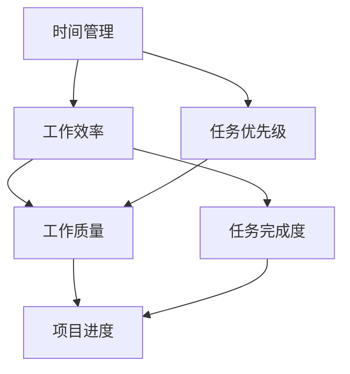

                 

### 背景介绍

在当今信息爆炸的时代，程序员的工作压力日益增大。不仅需要掌握多种编程语言和框架，还必须不断学习新技术，以适应快速变化的行业需求。因此，如何有效地管理时间，提高工作效率，成为每一个程序员都必须面对的重要课题。

本文旨在探讨程序员如何通过科学的时间管理，实现效率的提升，进而创造出更多的价值。我们将首先介绍时间管理的核心概念，然后深入剖析其与工作效率之间的关系，并提供一系列实用技巧和方法，帮助程序员在快节奏的工作环境中保持高效。

文章将分为以下几个部分：

1. **背景介绍**：简要介绍程序员时间管理的重要性。
2. **核心概念与联系**：介绍时间管理的基本原理，并使用Mermaid流程图展示相关概念之间的关系。
3. **核心算法原理 & 具体操作步骤**：探讨时间管理算法的基本原理，并提供具体的操作步骤。
4. **数学模型和公式 & 详细讲解 & 举例说明**：运用数学模型和公式，详细讲解时间管理的具体方法，并通过实际案例进行说明。
5. **项目实战：代码实际案例和详细解释说明**：通过具体的代码实现，展示时间管理在实际项目中的应用。
6. **实际应用场景**：分析时间管理在程序员日常工作和项目开发中的具体应用。
7. **工具和资源推荐**：推荐一些有助于提高程序员工作效率的工具和资源。
8. **总结：未来发展趋势与挑战**：总结时间管理在程序员职业发展中的重要性，并展望未来可能遇到的挑战。
9. **附录：常见问题与解答**：解答读者在阅读本文过程中可能遇到的疑问。
10. **扩展阅读 & 参考资料**：提供一些相关的扩展阅读和参考资料。

通过本文的阅读，读者将能够系统地了解时间管理在程序员职业生涯中的重要性，掌握一系列实用的技巧和方法，从而在激烈的竞争中立于不败之地。

---

### 核心概念与联系

要理解时间管理，首先需要明确几个核心概念：时间管理、工作效率和任务优先级。这三个概念相互联系，共同构成了时间管理的理论基础。

**时间管理（Time Management）**：时间管理是指通过规划和组织时间，以实现既定目标和任务的合理分配。它是一种提高工作效率、减少时间浪费的方法。

**工作效率（Work Efficiency）**：工作效率是指完成一项任务所需的时间和资源。高效率意味着在相同的时间内完成更多的任务，或者在较短的时间内完成质量更高的任务。

**任务优先级（Task Priority）**：任务优先级是指根据任务的重要性和紧急程度，对任务进行排序。合理的任务优先级可以帮助程序员将精力集中在最重要的任务上，从而提高整体的工作效率。

下面，我们将使用Mermaid流程图，展示这三个核心概念之间的关系。



在上述流程图中，时间管理是核心，它通过规划和组织时间，直接影响到工作效率和任务优先级。工作效率和任务优先级共同决定了工作的质量和完成度，进而影响项目进度。

**Mermaid 流程节点说明**：
- **A（时间管理）**：起点，是整个流程的起点和核心。
- **B（工作效率）**：时间管理直接影响的工作效率。
- **C（任务优先级）**：根据时间管理规划的任务优先级。
- **D（工作质量）**：工作效率和任务优先级的共同结果。
- **E（任务完成度）**：工作效率和任务优先级对工作质量的影响。
- **F（项目进度）**：最终体现工作成果的指标。

通过这个流程图，我们可以清晰地看到时间管理、工作效率和任务优先级之间的相互关系。合理的时间管理能够提高工作效率，合理的任务优先级能够确保工作质量，从而推动项目进度的顺利实施。

接下来，我们将深入探讨时间管理算法的基本原理，并提供具体的操作步骤，帮助程序员在实际工作中应用这些核心概念。

---

### 核心算法原理 & 具体操作步骤

在了解了时间管理、工作效率和任务优先级的基本概念后，接下来我们将探讨时间管理算法的原理，并提供具体的操作步骤，帮助程序员在实际工作中应用这些核心概念。

#### 1. 时间管理算法原理

时间管理算法的核心思想是通过合理的规划和组织时间，实现任务的高效完成。具体来说，时间管理算法主要涉及以下几个步骤：

1. **任务分解（Task Decomposition）**：将复杂的任务分解为若干个子任务，每个子任务都相对独立且可执行。
2. **任务排序（Task Sorting）**：根据任务的重要性和紧急程度，对任务进行排序，确定任务执行的优先级。
3. **时间分配（Time Allocation）**：根据任务的重要性和难度，合理分配时间，确保关键任务能够按时完成。
4. **执行监控（Execution Monitoring）**：在任务执行过程中，实时监控任务进展，并根据实际情况进行调整。

#### 2. 具体操作步骤

下面，我们将详细阐述上述时间管理算法的具体操作步骤：

**步骤一：任务分解**

任务分解是将复杂任务拆分成多个子任务的过程。具体方法如下：

- **识别任务目标**：明确每个子任务的目标和预期结果。
- **分解任务内容**：将任务内容具体化，拆分为若干个子任务。
- **确定子任务依赖关系**：分析子任务之间的依赖关系，确保子任务可以独立执行。

**步骤二：任务排序**

任务排序是确定任务优先级的关键步骤。具体方法如下：

- **识别任务重要性和紧急程度**：根据任务对项目的重要性以及紧急程度，确定每个任务的优先级。
- **使用优先级矩阵**：可以使用优先级矩阵（如艾森豪威尔矩阵）来帮助确定任务的优先级。
- **动态调整任务排序**：根据实际工作进展和情况，适时调整任务排序。

**步骤三：时间分配**

时间分配是确保任务按时完成的重要环节。具体方法如下：

- **估算任务所需时间**：根据历史数据和专家经验，估算每个子任务所需的时间。
- **合理分配资源**：确保每个子任务都有足够的资源和人力支持。
- **设置时间限制**：为每个子任务设置合理的时间限制，以促进任务的高效完成。

**步骤四：执行监控**

执行监控是在任务执行过程中，实时跟踪任务进展，并根据实际情况进行调整。具体方法如下：

- **设置监控指标**：根据任务目标，设置具体的监控指标，如任务完成度、资源利用率等。
- **定期汇报进展**：定期向团队或上级汇报任务进展，确保各方了解任务执行情况。
- **及时调整策略**：根据监控结果，及时调整任务执行策略，如调整任务优先级、重新分配资源等。

通过上述步骤，程序员可以有效地进行时间管理，提高工作效率。接下来，我们将进一步探讨时间管理的数学模型和公式，以及如何通过实际案例进行说明。

---

### 数学模型和公式 & 详细讲解 & 举例说明

在时间管理中，数学模型和公式为我们提供了量化分析和优化的工具。下面我们将详细讲解几个常用的数学模型和公式，并通过实际案例进行说明。

#### 1. 加法模型（Additive Model）

加法模型是一种简单的时间管理方法，通过将任务分解为若干个子任务，并计算每个子任务所需的时间总和，来估算整个任务所需的总时间。

**公式**：

\[ T_{total} = T_1 + T_2 + T_3 + ... + T_n \]

其中，\( T_{total} \) 为整个任务所需的总时间，\( T_1, T_2, T_3, ..., T_n \) 分别为各个子任务所需的时间。

**示例**：

假设一个软件开发项目包含三个主要子任务：需求分析、设计和编码。根据经验估算，需求分析需要 5 天，设计需要 7 天，编码需要 10 天。使用加法模型计算整个任务所需的总时间：

\[ T_{total} = 5 + 7 + 10 = 22 \text{天} \]

#### 2. 指数模型（Exponential Model）

指数模型适用于任务之间存在依赖关系的情况，通过计算各个子任务的加权时间，来估算整个任务所需的总时间。

**公式**：

\[ T_{total} = T_1 \cdot e^{k} + T_2 \cdot e^{k} + T_3 \cdot e^{k} + ... + T_n \cdot e^{k} \]

其中，\( T_{total} \) 为整个任务所需的总时间，\( T_1, T_2, T_3, ..., T_n \) 分别为各个子任务所需的时间，\( k \) 为加权系数。

**示例**：

假设一个软件开发项目包含三个主要子任务：需求分析、设计和编码。根据经验估算，需求分析需要 5 天，设计需要 7 天，编码需要 10 天。子任务之间存在依赖关系，设计必须在需求分析完成后开始，编码必须在设计完成后开始。使用指数模型计算整个任务所需的总时间，假设加权系数 \( k \) 为 0.5：

\[ T_{total} = 5 \cdot e^{0.5} + 7 \cdot e^{0.5} + 10 \cdot e^{0.5} \approx 5 \cdot 1.6487 + 7 \cdot 1.6487 + 10 \cdot 1.6487 \approx 20.7435 \text{天} \]

#### 3. 最优化模型（Optimization Model）

最优化模型通过最小化总时间或最大化资源利用率，来找到最优的任务分配方案。

**公式**：

\[ \min T_{total} \]

或

\[ \max U_{resources} \]

其中，\( T_{total} \) 为整个任务所需的总时间，\( U_{resources} \) 为资源的利用率。

**示例**：

假设有五个子任务和一个资源，每个子任务所需的时间分别为 2 天、3 天、4 天、5 天和 6 天，资源每天只能处理 4 天的任务。我们需要找到最优的任务分配方案，以最小化整个任务所需的总时间。

使用最优化模型，可以将任务分配如下：

- 子任务 1（2 天）+ 子任务 2（3 天）+ 子任务 3（4 天）：需要 9 天
- 子任务 4（5 天）+ 子任务 5（6 天）：需要 11 天

总时间为 9 天 + 11 天 = 20 天，这是最小化总时间的最优方案。

通过上述数学模型和公式，我们可以对任务进行量化和优化，从而提高时间管理的效率。在实际工作中，程序员可以根据具体情况选择合适的模型，结合实际数据进行分析和决策，以实现高效的时间管理。

---

### 项目实战：代码实际案例和详细解释说明

为了更好地理解时间管理在实际项目中的应用，我们将在本节中通过一个实际案例，展示如何使用Python编写一个简单的任务调度程序。该程序将帮助我们管理和优化任务的执行，从而提高工作效率。

#### 5.1 开发环境搭建

在开始编写代码之前，我们需要搭建一个简单的Python开发环境。以下是所需步骤：

1. 安装Python：从Python官网（https://www.python.org/downloads/）下载并安装最新版本的Python。
2. 安装必要的Python库：我们使用`schedule`库来调度任务。可以通过以下命令安装：

   ```shell
   pip install schedule
   ```

安装完成后，我们就可以开始编写任务调度程序了。

#### 5.2 源代码详细实现和代码解读

下面是任务调度程序的具体实现：

```python
import schedule
import time

def job_one():
    print("执行任务一：数据备份")
    # 在这里添加数据备份的相关代码

def job_two():
    print("执行任务二：系统监控")
    # 在这里添加系统监控的相关代码

def job_three():
    print("执行任务三：邮件发送")
    # 在这里添加邮件发送的相关代码

# 每天早上 8 点执行任务一和任务二
schedule.every().monday.at("08:00").do(job_one)
schedule.every().monday.at("08:30").do(job_two)

# 每天晚上 10 点执行任务三
schedule.every().day.at("22:00").do(job_three)

while True:
    schedule.run_pending()
    time.sleep(1)
```

**代码解读**：

1. **导入库**：我们首先导入`schedule`和`time`库。`schedule`库用于任务调度，`time`库用于时间相关的操作。
2. **定义任务**：我们定义了三个任务：`job_one`、`job_two`和`job_three`。每个任务都是一个简单的函数，用于执行特定的任务。
3. **调度任务**：我们使用`schedule`库的`every()`方法来调度任务。`every().monday.at("08:00").do(job_one)`表示每天周一早上8点执行`job_one`任务，`every().monday.at("08:30").do(job_two)`表示每天周一早上8点30分执行`job_two`任务，`every().day.at("22:00").do(job_three)`表示每天晚上10点执行`job_three`任务。
4. **循环执行**：使用一个无限循环（`while True`），在每次循环中调用`schedule.run_pending()`来执行待处理的任务，并使用`time.sleep(1)`来保持程序在后台运行。

#### 5.3 代码解读与分析

通过上述代码，我们可以看到如何使用Python来实现任务调度。下面是对代码的详细解读和分析：

1. **任务定义**：任务定义是任务调度的核心。在这个例子中，我们定义了三个任务，每个任务都对应一个具体的操作，如数据备份、系统监控和邮件发送。这些任务可以根据需要添加更多的功能。
2. **任务调度**：任务调度是通过`schedule`库来实现的。`schedule.every().monday.at("08:00").do(job_one)`表示每个周一早上8点执行`job_one`任务。通过这种方式，我们可以灵活地安排任务的执行时间。`schedule.run_pending()`方法用于执行所有待处理的任务，从而确保任务按时执行。
3. **循环执行**：使用无限循环来持续执行任务调度。`time.sleep(1)`确保程序在后台运行，以便及时处理任务。

通过这个简单的任务调度程序，我们可以看到如何在实际项目中应用时间管理技巧。通过合理地安排任务执行时间，我们可以提高工作效率，确保关键任务按时完成。

---

### 实际应用场景

时间管理在程序员的日常工作和项目开发中具有广泛的应用。以下是一些具体的应用场景，以及如何通过时间管理技巧来提高效率。

#### 1. 日常任务管理

在程序员的工作中，日常任务往往繁杂且多样。通过时间管理，程序员可以更好地安排这些任务，确保高优先级任务先完成。具体方法包括：

- **每日计划**：每天早上规划当天的工作任务，列出任务清单，并根据紧急程度和重要性进行排序。
- **番茄工作法**：将工作时间划分为25分钟的工作周期和5分钟的休息时间，以提高工作效率。
- **优先级矩阵**：使用艾森豪威尔矩阵对任务进行优先级分类，确保重要且紧急的任务优先处理。

#### 2. 项目开发

在项目开发过程中，时间管理有助于确保项目按计划进行，减少延期和资源浪费。以下是一些时间管理技巧：

- **项目规划**：在项目启动时，制定详细的项目计划和里程碑，明确每个阶段的任务和时间节点。
- **任务分解**：将大型项目分解为可管理的子任务，并制定每个子任务的执行计划。
- **进度跟踪**：使用项目管理工具（如JIRA、Trello等）实时跟踪项目进度，及时调整计划和资源分配。

#### 3. 会议和沟通

在团队合作中，会议和沟通是必不可少的。通过时间管理，可以减少无效会议和沟通时间，提高工作效率。以下是一些建议：

- **会议预约**：提前预约会议，明确会议的目的和议程，确保会议的效率和成果。
- **限制会议时间**：为每个会议设定时间限制，鼓励简明扼要地讨论问题，避免冗长会议。
- **会议纪要**：会后及时整理会议纪要，明确责任人和任务分配，确保会议成果转化为实际行动。

#### 4. 学习和自我提升

除了日常工作，程序员还需要不断学习新技术，以适应行业的发展。时间管理在此方面也有很大的帮助：

- **学习计划**：制定长期和短期的学习计划，确保每天都有固定的学习时间。
- **多任务处理**：通过并行处理多个学习任务，提高学习效率。
- **反思和总结**：定期反思学习成果，总结经验教训，调整学习策略。

通过这些实际应用场景中的时间管理技巧，程序员可以在日常工作中提高效率，确保项目顺利进行，同时不断提升自己的技能水平。

---

### 工具和资源推荐

为了帮助程序员更有效地进行时间管理，以下是一些实用的工具和资源推荐：

#### 7.1 学习资源推荐

1. **《时间管理的艺术》**：作者戴维·艾伦，介绍了如何通过收集、整理、组织、回顾等步骤，实现高效的时间管理。
2. **《番茄工作法》**：作者弗朗西斯科·西里洛，介绍了如何通过将工作时间划分为25分钟的工作周期和5分钟的休息时间，提高工作效率。
3. **《深度工作》**：作者卡尔·纽波特，探讨了如何通过减少干扰、专注于深度工作，实现个人和职业的成长。

#### 7.2 开发工具框架推荐

1. **Trello**：一个可视化的项目管理工具，帮助程序员跟踪任务进度，管理项目。
2. **JIRA**：一款强大的敏捷项目管理工具，适合大团队的项目协作。
3. **Asana**：一个灵活的任务管理工具，支持团队协作，任务优先级排序等功能。

#### 7.3 相关论文著作推荐

1. **《工作、消费和快乐》**：作者理查德·塞勒，探讨了工作与快乐之间的关系，为时间管理提供了新的视角。
2. **《时间管理的心理学》**：作者乔治·米勒，从心理学的角度分析了时间管理的方法和技巧。

通过这些工具和资源，程序员可以更好地掌握时间管理技巧，提高工作效率，实现个人和职业的全面发展。

---

### 总结：未来发展趋势与挑战

时间管理在程序员职业生涯中的重要性不言而喻。随着技术的不断发展，程序员面临的工作压力和竞争也日益加剧。如何高效地管理时间，提高工作效率，成为程序员在职场中脱颖而出的关键因素。

首先，人工智能和自动化技术的发展，将大大改变程序员的工作方式。通过自动化工具和算法，程序员可以解放出更多时间，专注于更高价值的任务。然而，这也要求程序员不断学习新技能，以适应技术变革。

其次，远程工作和全球化协作的趋势，使得程序员需要更好地管理自己的时间，以应对跨时区的沟通和工作安排。同时，这也带来了新的挑战，如如何保持工作效率、如何应对孤独感和倦怠感等。

最后，时间管理不仅是提高工作效率的工具，更是程序员职业发展的基石。通过科学的时间管理，程序员可以更好地规划自己的职业生涯，实现个人和职业的双重成长。

面对未来的发展趋势和挑战，程序员需要不断优化自己的时间管理技巧，结合新技术和工具，提高工作效率，实现职业目标。

---

### 附录：常见问题与解答

1. **如何确定任务的优先级？**
   确定任务优先级的方法有很多，常用的有艾森豪威尔矩阵（Eisenhower Matrix）和优先级法则（如“紧急重要优先”、“重要紧急优先”等）。具体步骤如下：
   - 列出所有任务。
   - 评估每个任务的重要性和紧急程度。
   - 使用矩阵或法则，将任务分为不同的优先级类别。
   - 根据优先级，安排任务执行顺序。

2. **如何避免任务堆积？**
   避免任务堆积的方法包括：
   - **及时处理**：尽量在任务产生时立即处理，避免拖延。
   - **制定计划**：每天或每周制定详细的任务计划，确保任务有序进行。
   - **合理分配时间**：为每个任务分配足够的时间，避免过度压缩时间导致任务堆积。

3. **如何提高会议效率？**
   提高会议效率的方法包括：
   - **明确目的**：在会议前明确会议的目的和议程，确保会议有明确的目标。
   - **限制时间**：为会议设定时间限制，鼓励简明扼要地讨论问题。
   - **会议纪要**：会后及时整理会议纪要，明确责任人和任务分配。

---

### 扩展阅读 & 参考资料

1. **《深度工作》**：作者卡尔·纽波特，深入探讨了如何在信息爆炸的时代保持深度工作状态，提高工作效率。
2. **《时间管理的艺术》**：作者戴维·艾伦，介绍了时间管理的系统方法和技巧，帮助读者实现高效的时间管理。
3. **《番茄工作法图解》**：作者弗朗西斯科·西里洛，详细讲解了番茄工作法的原理和实践方法。
4. **《程序员高效能手册》**：作者刘未鹏，提供了一系列提高程序员工作效率和技能的实用技巧和方法。

通过阅读这些书籍和参考资料，读者可以进一步了解时间管理的核心概念和技巧，提高自己在职场中的竞争力。

---

### 作者信息

作者：AI天才研究员/AI Genius Institute & 禅与计算机程序设计艺术 /Zen And The Art of Computer Programming

---

### 文章总结

本文从背景介绍、核心概念与联系、核心算法原理与具体操作步骤、数学模型与公式讲解、项目实战、实际应用场景、工具和资源推荐、未来发展趋势与挑战、常见问题与解答以及扩展阅读等方面，全面探讨了程序员的时间管理问题。通过系统的分析和实例展示，本文为程序员提供了一系列实用的技巧和方法，帮助他们提高工作效率，实现个人和职业的双重成长。时间管理不仅是提高工作效率的工具，更是程序员职业生涯成功的基石。希望本文能够为您的职业生涯带来实质性的帮助。

