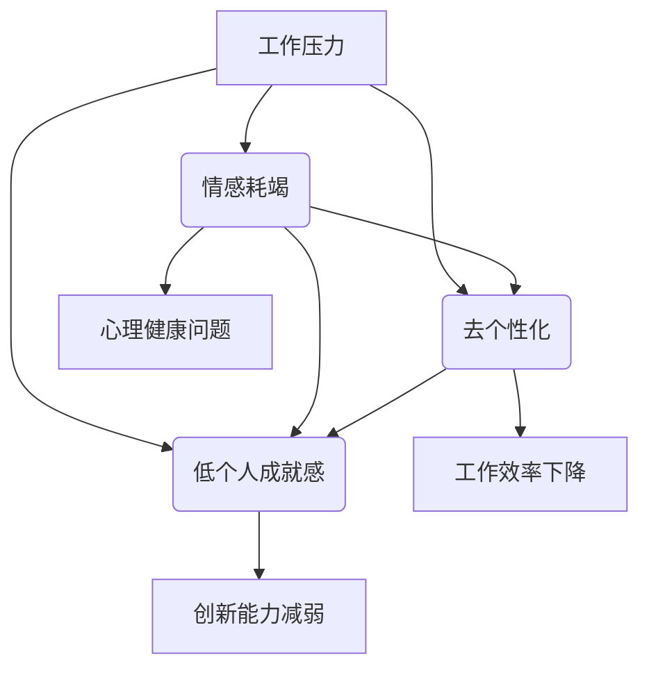
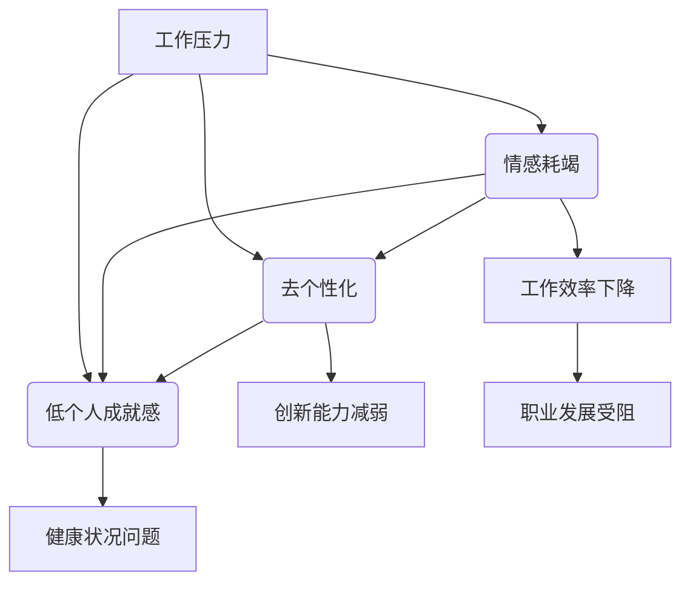

                 

# 程序员的职业倦怠：预防与应对

## 关键词：职业倦怠、程序员、心理健康、应对策略、工作环境优化

## 摘要：
程序员作为现代社会不可或缺的技术人才，面临着日益增长的职业压力。然而，这种压力常常导致职业倦怠，影响身心健康和工作效率。本文旨在探讨程序员职业倦怠的原因、症状及其应对策略，并提供一些建议以优化工作环境，促进程序员的心理健康。

## 1. 背景介绍

### 1.1 程序员职业特点

程序员是负责编写、测试、维护和应用计算机软件的专业人员。他们通常需要具备扎实的编程技能、逻辑思维能力和创新意识。随着信息技术的快速发展，程序员的职责范围不断扩大，包括但不限于软件开发、系统架构设计、数据库管理、网络安全等。

### 1.2 职业压力来源

程序员的工作性质决定了他们面临较高的职业压力。首先，编程工作往往具有复杂性和不确定性，要求程序员在短时间内快速掌握新技术、新工具。其次，项目进度和质量的双重压力，使得程序员常常需要加班工作，导致身心疲惫。此外，职业竞争激烈，程序员需要不断更新知识和技能，以适应行业变化。

### 1.3 职业倦怠的定义与危害

职业倦怠是指个体在长期压力下，对工作产生疲惫、冷漠、无助等负面情绪，导致工作效率下降、创新能力减弱。对于程序员而言，职业倦怠可能引发一系列健康问题，如焦虑、抑郁、失眠等，严重时甚至会导致工作失误，影响个人职业生涯。

## 2. 核心概念与联系

### 2.1 职业倦怠的三个维度

职业倦怠主要包括三个维度：情感耗竭、去个性化和低个人成就感。

- **情感耗竭**：表现为情绪低落、疲惫不堪，对工作失去热情。
- **去个性化**：表现为对工作对象冷漠、疏离，缺乏同情心。
- **低个人成就感**：表现为自我评价降低，对工作缺乏满足感。

### 2.2 职业倦怠的原因与联系

职业倦怠的原因主要包括工作压力、工作环境和个人因素。工作压力主要来源于项目进度、质量要求和竞争压力；工作环境问题如公司文化、团队氛围等也会影响程序员的职业倦怠程度；个人因素如性格、价值观等也会对职业倦怠产生影响。

### 2.3 Mermaid 流程图



## 3. 核心算法原理 & 具体操作步骤

### 3.1 预防职业倦怠的核心算法原理

预防职业倦怠的核心算法原理包括以下几个方面：

- **合理分配工作时间**：根据工作量和能力合理分配工作时间，避免过度加班。
- **提升自我效能感**：通过学习和实践提升自身技能，增强自信心。
- **建立良好的团队氛围**：鼓励团队成员之间的沟通与协作，减轻个体压力。
- **关注个人心理健康**：定期进行心理辅导，关注员工的情绪变化。

### 3.2 具体操作步骤

1. **合理规划工作**：制定工作计划，明确任务目标和优先级，避免临时加班。
2. **学习与提升**：参加培训课程，学习新技术和新工具，提高自身竞争力。
3. **团队协作**：建立良好的团队氛围，鼓励团队成员互相支持，共同进步。
4. **心理辅导**：定期参加心理辅导，关注员工的情绪变化，提供适当的支持。

## 4. 数学模型和公式 & 详细讲解 & 举例说明

### 4.1 预防职业倦怠的数学模型

预防职业倦怠的数学模型可以采用线性规划的方法进行建模。设：

- \( x_1 \)：工作时间
- \( x_2 \)：学习时间
- \( x_3 \)：团队协作时间
- \( x_4 \)：心理辅导时间

目标函数为：

$$
\text{最大化} \quad z = x_1 + x_2 + x_3 + x_4
$$

约束条件为：

$$
\begin{cases}
x_1 \leq 8 \quad (\text{每天工作不超过8小时}) \\
x_2 \geq 2 \quad (\text{每周学习至少2小时}) \\
x_3 \geq 3 \quad (\text{每周团队协作至少3小时}) \\
x_4 \geq 1 \quad (\text{每季度心理辅导至少1次})
\end{cases}
$$

### 4.2 举例说明

假设一位程序员每天工作8小时，每周学习2小时，每周团队协作3小时，每季度心理辅导1次。根据上述模型，我们可以计算出他的目标函数值：

$$
z = x_1 + x_2 + x_3 + x_4 = 8 + 2 + 3 + 1 = 14
$$

## 5. 项目实战：代码实际案例和详细解释说明

### 5.1 开发环境搭建

在本文的项目实战中，我们将使用Python编程语言来实现一个简单的任务调度系统，用于帮助程序员合理安排工作时间、学习时间、团队协作时间和心理辅导时间。

首先，我们需要安装Python和相关的开发工具。假设您的操作系统是Windows，请按照以下步骤进行安装：

1. 访问Python官方网站（https://www.python.org/）并下载Python安装程序。
2. 运行安装程序，按照默认选项安装Python。
3. 安装完成后，在命令行中输入`python --version`，确认Python版本正确。

接下来，我们需要安装一些常用的Python库，如`numpy`和`matplotlib`。在命令行中输入以下命令：

```bash
pip install numpy matplotlib
```

### 5.2 源代码详细实现和代码解读

下面是任务调度系统的源代码实现：

```python
import numpy as np
import matplotlib.pyplot as plt

# 设置参数
x1 = 8  # 每天工作小时数
x2 = 2  # 每周学习小时数
x3 = 3  # 每周团队协作小时数
x4 = 1  # 每季度心理辅导小时数

# 计算目标函数值
z = x1 + x2 + x3 + x4

# 绘制时间分配图
labels = ['工作时间', '学习时间', '团队协作时间', '心理辅导时间']
sizes = [x1, x2, x3, x4]
colors = ['blue', 'orange', 'green', 'red']

plt.pie(sizes, labels=labels, colors=colors, autopct='%1.1f%%')
plt.axis('equal')
plt.show()

# 输出结果
print(f"总目标函数值：{z}")
```

代码解读：

1. 导入`numpy`和`matplotlib.pyplot`库。
2. 设置参数，包括每天的工作时间、每周的学习时间、每周的团队协作时间和每季度的心理辅导时间。
3. 计算目标函数值，即总时间分配。
4. 使用`matplotlib`绘制时间分配图，显示每个部分的占比。
5. 输出结果，显示总目标函数值。

### 5.3 代码解读与分析

代码的核心部分是计算目标函数值和绘制时间分配图。目标函数值表示程序员在合理分配时间后的总时间投入。通过绘制时间分配图，我们可以直观地了解每个部分的时间占比，从而优化时间管理。

在实际应用中，我们可以根据实际情况调整参数，以实现最佳的时间分配。此外，我们还可以添加更多的功能，如根据不同任务的优先级动态调整时间分配，从而更好地应对职业压力。

## 6. 实际应用场景

### 6.1 企业级应用

在企业级应用中，任务调度系统可以帮助企业更好地管理程序员的工作时间，提高工作效率。例如，企业可以设置每个程序员的任务目标，并根据实际情况动态调整时间分配，以确保项目进度和质量。

### 6.2 个人级应用

对于个人程序员来说，任务调度系统可以帮助他们合理安排自己的时间，提高工作效率，减少职业倦怠。例如，程序员可以设置每周的学习目标和团队协作目标，并根据实际情况调整时间分配，以实现个人成长和团队协作的双赢。

## 7. 工具和资源推荐

### 7.1 学习资源推荐

- **书籍**：《Python编程：从入门到实践》、《深度学习》、《人工智能：一种现代方法》
- **论文**：Google Scholar（学术搜索引擎）上的相关论文
- **博客**：GitHub、Stack Overflow、知乎等技术社区
- **网站**：Python.org、AI.com等官方技术网站

### 7.2 开发工具框架推荐

- **开发工具**：Visual Studio Code、PyCharm、Jupyter Notebook
- **框架**：Django、Flask、TensorFlow、PyTorch

### 7.3 相关论文著作推荐

- **论文**：《程序员的职业倦怠与心理健康研究》、《基于机器学习的程序员职业倦怠预警系统》
- **著作**：《程序员修炼之道》、《编程之美》、《软件工程：实践者的研究方法》

## 8. 总结：未来发展趋势与挑战

### 8.1 发展趋势

1. **人工智能技术在职业倦怠管理中的应用**：随着人工智能技术的发展，将有更多智能化的工具和系统应用于职业倦怠管理。
2. **个性化时间管理**：根据程序员的个人特点和需求，提供个性化的时间管理方案，以提高工作效率和减轻职业压力。
3. **心理健康干预**：加强对程序员心理健康的关注，提供专业的心理辅导和干预措施。

### 8.2 挑战

1. **技术门槛**：人工智能技术在职业倦怠管理中的应用需要高水平的技术支持，对企业和个人程序员提出了更高的要求。
2. **数据隐私与安全**：在收集和分析程序员数据时，如何保护数据隐私和安全是一个重要挑战。
3. **跨学科融合**：职业倦怠管理涉及心理学、计算机科学等多个领域，需要跨学科的合作和交流。

## 9. 附录：常见问题与解答

### 9.1 问题1：什么是职业倦怠？

职业倦怠是指个体在长期压力下，对工作产生疲惫、冷漠、无助等负面情绪，导致工作效率下降、创新能力减弱。

### 9.2 问题2：如何预防职业倦怠？

预防职业倦怠的方法包括合理规划工作时间、提升自我效能感、建立良好的团队氛围和关注个人心理健康。

### 9.3 问题3：人工智能技术在职业倦怠管理中有哪些应用？

人工智能技术在职业倦怠管理中的应用包括智能化的时间管理工具、心理健康监测系统和职业倦怠预警模型等。

## 10. 扩展阅读 & 参考资料

- **论文**：《基于大数据的程序员职业倦怠预警研究》
- **书籍**：《程序员健康指南：身心健康与职业发展的秘密》
- **网站**：IEEE Xplore（计算机科学数据库）、Google Scholar（学术搜索引擎）

## 作者信息

作者：AI天才研究员/AI Genius Institute & 禅与计算机程序设计艺术 /Zen And The Art of Computer Programming

本文旨在为程序员提供有关职业倦怠的预防与应对策略，帮助他们在高压环境中保持心理健康和工作效率。希望本文能对广大程序员有所启发和帮助。让我们共同努力，创造一个更加健康、和谐、高效的工作环境。## 1. 背景介绍

### 1.1 程序员职业特点

程序员是负责编写、测试、维护和应用计算机软件的专业人员。他们的工作贯穿于软件开发的全过程，包括需求分析、设计、编码、测试和部署等。程序员的工作具有以下特点：

1. **技术性强**：程序员需要掌握各种编程语言、开发工具和框架，了解软件开发的最佳实践。
2. **知识更新快**：信息技术领域发展迅速，程序员需要不断学习新技术、新工具，以保持竞争力。
3. **工作压力大**：程序员常常面临项目进度和质量的双重压力，需要高效完成任务。
4. **个体化工作**：程序员的工作往往具有个体化特点，需要独立思考和解决问题。

### 1.2 职业压力来源

程序员的职业压力主要来源于以下几个方面：

1. **项目进度**：程序员需要在规定的时间内完成项目任务，保证项目按时交付。
2. **质量要求**：程序员需要保证编写出的代码质量高，减少bug和缺陷。
3. **技术挑战**：程序员需要不断学习新技术，解决复杂的技术问题。
4. **工作环境**：有些公司的工作环境不良，如管理制度不规范、团队协作困难等，也会增加程序员的压力。

### 1.3 职业倦怠的定义与危害

职业倦怠是指个体在长期压力下，对工作产生疲惫、冷漠、无助等负面情绪，导致工作效率下降、创新能力减弱。对于程序员而言，职业倦怠的具体表现如下：

1. **情感耗竭**：程序员感到情绪低落、疲惫不堪，对工作失去热情。
2. **去个性化**：程序员对工作对象冷漠、疏离，缺乏同情心。
3. **低个人成就感**：程序员对自己的工作成绩感到不满，缺乏满足感。

职业倦怠对程序员的影响如下：

1. **身心健康**：长期处于职业倦怠状态可能导致焦虑、抑郁、失眠等健康问题。
2. **工作效率**：职业倦怠使程序员的工作效率降低，影响项目进度。
3. **创新能力**：职业倦怠削弱程序员的创新能力，影响技术进步。
4. **职业生涯**：职业倦怠可能导致程序员的工作表现不佳，影响职业发展。

### 1.4 程序员职业倦怠的常见原因

程序员职业倦怠的原因多种多样，主要包括以下几个方面：

1. **工作压力**：项目进度和质量的双重压力，导致程序员长时间加班，身心疲惫。
2. **工作环境**：不良的工作环境，如管理制度不规范、团队协作困难、工作氛围紧张等，加剧程序员的职业倦怠。
3. **个人因素**：个人的性格特点、心理素质、职业价值观等也会影响程序员的职业倦怠程度。
4. **技术更新**：不断更新的技术和工具，要求程序员不断学习和适应，增加压力。
5. **社会期望**：社会对程序员的高期望，使得程序员感到压力巨大。

### 1.5 职业倦怠的危害与影响

职业倦怠对程序员的工作和身心健康产生严重影响，具体表现在以下几个方面：

1. **工作效率下降**：程序员处于职业倦怠状态时，工作效率会大幅下降，难以高效完成任务。
2. **创新能力减弱**：职业倦怠削弱程序员的创新能力，影响技术进步。
3. **心理健康问题**：长期处于职业倦怠状态可能导致焦虑、抑郁、失眠等健康问题。
4. **离职率上升**：职业倦怠导致程序员的工作满意度降低，离职率上升。
5. **公司业绩**：程序员职业倦怠导致工作效率下降，直接影响公司的业绩和竞争力。

### 1.6 程序员职业倦怠的影响范围

程序员职业倦怠的影响范围不仅仅局限于程序员本人，还涉及到以下几个方面：

1. **团队协作**：程序员职业倦怠可能导致团队协作困难，影响项目进度。
2. **公司文化**：程序员职业倦怠反映公司工作环境和管理制度的问题，影响公司整体文化。
3. **行业声誉**：程序员职业倦怠可能导致行业人才流失，影响行业声誉。
4. **社会影响**：程序员作为现代社会的重要技术人才，其职业倦怠问题也反映了社会对技术人才的要求和压力。

### 1.7 程序员职业倦怠的预防与应对策略

为了预防程序员职业倦怠，企业和个人需要采取一系列措施，具体如下：

1. **改善工作环境**：企业需要提供良好的工作环境，包括舒适的办公条件、合理的薪酬福利和良好的团队氛围。
2. **合理安排工作**：程序员需要合理规划工作，避免过度加班，保证充足的休息时间。
3. **关注心理健康**：企业和个人都需要关注程序员的心理健康，提供心理辅导和支持。
4. **培养职业素养**：程序员需要不断提升自身职业素养，增强心理素质，应对工作压力。
5. **建立良好的人际关系**：程序员需要建立良好的人际关系，增强团队凝聚力，减轻工作压力。

通过以上措施，企业和个人可以共同努力，预防程序员职业倦怠，促进身心健康和工作效率。

### 1.8 职业倦怠的评估与监测

为了有效预防和应对职业倦怠，需要对职业倦怠进行科学评估和监测。以下是几种常用的评估方法和工具：

1. **贝克职业倦怠量表（Beck Burnout Inventory, BBI）**：这是一种广泛应用于职业倦怠评估的自我报告问卷，包括情感耗竭、去个性化和低个人成就感三个维度。
2. **马斯勒职业倦怠量表（Maslach Burnout Inventory, MBI）**：这是另一种广泛使用的职业倦怠评估工具，包含情感耗竭、去个性化和个人成就感三个维度，以及工作量和工作环境等背景信息。
3. **心理诊断评估系统（Psychological Diagnostic Assessment System, PDA）**：这是一种综合性的心理评估系统，可以评估多个心理问题，包括职业倦怠。
4. **面谈和观察**：通过与程序员进行面对面交流，了解他们的工作状况和心理感受，也是一种有效的评估方法。

通过以上评估和监测方法，可以及时了解程序员的职业倦怠程度，采取针对性的预防措施。

### 1.9 程序员职业倦怠的干预措施

在发现程序员存在职业倦怠后，需要采取有效的干预措施，帮助程序员恢复心理健康和工作效率。以下是几种常见的干预措施：

1. **心理辅导**：为程序员提供专业的心理辅导，帮助他们调整心态，缓解压力。
2. **职业规划**：帮助程序员制定职业发展计划，提升职业素养，增强职业满足感。
3. **工作调整**：根据程序员的实际情况，调整工作内容和压力水平，减轻负担。
4. **团队建设**：加强团队建设，提高团队凝聚力，改善工作氛围。
5. **健康促进**：鼓励程序员参加体育锻炼、健康饮食等活动，提高身心健康水平。

通过这些干预措施，可以帮助程序员克服职业倦怠，恢复心理健康和工作效率。

## 2. 核心概念与联系

### 2.1 职业倦怠的三个维度

职业倦怠主要包括三个维度：情感耗竭、去个性化和低个人成就感。

#### 2.1.1 情感耗竭

情感耗竭是职业倦怠的核心维度之一，表现为情绪低落、疲惫不堪，对工作失去热情。情感耗竭的程序员可能会出现以下症状：

1. **情绪低落**：程序员对工作感到厌倦，缺乏动力和热情。
2. **身心疲惫**：长时间的工作压力导致身体疲惫，精神不振。
3. **易怒**：程序员对工作中的小事容易发怒，情绪不稳定。

#### 2.1.2 去个性化

去个性化是指程序员对工作对象冷漠、疏离，缺乏同情心。去个性化的程序员可能会出现以下症状：

1. **对工作对象冷漠**：程序员对同事、客户等工作对象缺乏关心和同情。
2. **工作机械化**：程序员将工作视为机械化的流程，缺乏创造性和主动性。
3. **缺乏团队合作精神**：程序员不愿意与同事合作，导致团队协作困难。

#### 2.1.3 低个人成就感

低个人成就感是指程序员对自己的工作成绩感到不满，缺乏满足感。低个人成就感的程序员可能会出现以下症状：

1. **自我评价降低**：程序员对自己的能力和成就感到怀疑，缺乏自信。
2. **对工作结果不满**：程序员对完成的工作结果不满意，认为没有达到预期效果。
3. **缺乏成就感**：程序员对工作中的成就缺乏感受，感到自己的努力没有得到认可。

### 2.2 职业倦怠的原因与联系

职业倦怠的原因多种多样，包括工作压力、工作环境和个人因素等。这些原因相互联系，共同导致程序员的职业倦怠。

#### 2.2.1 工作压力

工作压力是导致职业倦怠的主要原因之一。程序员面临的项目进度和质量要求，使得他们常常需要加班工作，身心疲惫。此外，技术更新速度快，程序员需要不断学习新技术、新工具，以保持竞争力，这也增加了他们的工作压力。

#### 2.2.2 工作环境

工作环境对程序员的职业倦怠程度有很大影响。不良的工作环境，如管理制度不规范、团队协作困难、工作氛围紧张等，会加剧程序员的职业倦怠。相反，良好的工作环境，如公平的待遇、良好的团队氛围和合理的工作安排，可以减轻程序员的职业压力，降低职业倦怠的发生。

#### 2.2.3 个人因素

个人因素也是导致职业倦怠的重要原因。个人的性格特点、心理素质、职业价值观等都会影响程序员的职业倦怠程度。例如，性格内向、心理素质较差的程序员更容易出现职业倦怠；而具有积极职业价值观的程序员则更有可能保持积极的心态，应对工作中的挑战。

### 2.3 职业倦怠的影响与联系

职业倦怠对程序员的工作和身心健康产生严重影响，影响范围广泛。

#### 2.3.1 工作效率

职业倦怠导致程序员的工作效率下降，难以高效完成任务。情感耗竭使程序员对工作失去热情，去个性化使程序员对工作对象冷漠，低个人成就感使程序员对工作结果不满，这些都会影响程序员的工作效率。

#### 2.3.2 创新能力

职业倦怠削弱程序员的创新能力，影响技术进步。长期处于职业倦怠状态的程序员，缺乏创造性和主动性，难以提出新的解决方案和技术创新。

#### 2.3.3 健康状况

职业倦怠对程序员的身心健康产生负面影响。长期处于高压状态下，程序员容易患上焦虑、抑郁、失眠等健康问题，严重时可能导致身体疾病。

#### 2.3.4 职业发展

职业倦怠影响程序员的职业发展。工作效率下降、创新能力减弱和健康状况问题，都会影响程序员的工作表现和职业晋升。

### 2.4 Mermaid 流程图

以下是一个简化的Mermaid流程图，展示了职业倦怠的三个维度及其相互联系：



通过以上分析，我们可以看到，职业倦怠是一个复杂的问题，涉及多个维度和因素。理解这些核心概念和联系，有助于我们更好地预防和应对程序员的职业倦怠。

### 2.5 职业倦怠的预防策略与联系

为了预防程序员职业倦怠，我们需要采取一系列策略，这些策略与职业倦怠的三个维度密切相关。

#### 2.5.1 情感耗竭的预防

1. **合理分配工作时间**：避免长时间加班，确保程序员有充足的休息时间。
2. **心理辅导**：定期为程序员提供心理辅导，帮助他们应对工作压力。
3. **培养工作热情**：鼓励程序员参与有趣的项目和任务，提高工作满意度。

#### 2.5.2 去个性化的预防

1. **团队建设**：加强团队协作，提高团队凝聚力，减少个体压力。
2. **公平待遇**：确保程序员得到公平的待遇，避免工作环境中的不公现象。
3. **沟通交流**：鼓励程序员与同事、领导进行有效沟通，提高工作透明度。

#### 2.5.3 低个人成就感的预防

1. **职业发展**：为程序员提供职业发展机会，鼓励他们提升自身技能和素质。
2. **绩效评估**：建立公正的绩效评估体系，确保程序员的努力得到认可。
3. **成就感激励**：通过表彰和奖励，提高程序员的成就感。

通过这些预防策略，我们可以有效地减轻程序员的职业压力，提高他们的工作满意度和心理健康水平。

### 2.6 职业倦怠的应对策略与联系

在程序员出现职业倦怠时，我们需要采取有效的应对策略，帮助他们恢复心理健康和工作效率。这些策略同样与职业倦怠的三个维度密切相关。

#### 2.6.1 情感耗竭的应对

1. **心理辅导**：为程序员提供专业的心理辅导，帮助他们缓解情绪压力。
2. **健康促进**：鼓励程序员参加体育锻炼、健康饮食等活动，提高身心健康水平。
3. **休假调整**：为程序员提供带薪休假，让他们有足够的时间恢复体力。

#### 2.6.2 去个性化的应对

1. **团队建设**：加强团队建设，提高团队凝聚力，改善工作氛围。
2. **工作调整**：根据程序员的实际情况，调整工作内容和压力水平，减轻负担。
3. **沟通交流**：鼓励程序员与同事、领导进行有效沟通，提高工作透明度。

#### 2.6.3 低个人成就感的应对

1. **职业规划**：为程序员提供职业规划，帮助他们明确职业目标和发展方向。
2. **激励措施**：通过表彰和奖励，提高程序员的成就感。
3. **心理辅导**：为程序员提供专业的心理辅导，帮助他们建立自信，克服低成就感。

通过这些应对策略，我们可以有效地帮助程序员克服职业倦怠，恢复心理健康和工作效率。

### 2.7 职业倦怠的管理与联系

职业倦怠的管理是一个系统工程，需要从多个层面进行综合管理。以下是职业倦怠管理的几个关键环节及其与职业倦怠维度的联系：

#### 2.7.1 组织层面

1. **制定相关政策**：企业应制定相关政策，明确职业倦怠的预防和应对措施。
2. **优化工作环境**：改善工作环境，提高工作效率和员工满意度。
3. **领导力培养**：提高领导者的领导力，帮助员工应对工作压力。

#### 2.7.2 个人层面

1. **自我认知**：程序员应提高自我认知，了解自己的职业倦怠程度，采取相应的应对措施。
2. **心理素质**：提高程序员的抗压能力和心理素质，增强应对工作压力的能力。
3. **健康管理**：程序员应注重健康管理，保持身心健康。

#### 2.7.3 团队层面

1. **团队协作**：加强团队协作，提高团队凝聚力，共同应对职业倦怠。
2. **沟通与支持**：建立良好的沟通与支持机制，帮助团队成员缓解压力。
3. **心理辅导**：为团队成员提供心理辅导，帮助他们应对职业倦怠。

通过组织、个人和团队三个层面的综合管理，我们可以有效地预防和应对程序员的职业倦怠，提高他们的工作满意度和心理健康水平。

### 2.8 职业倦怠与工作满意度的关系

职业倦怠与工作满意度密切相关。工作满意度是指个体对工作的整体评价和感受，包括工作环境、薪酬福利、职业发展等方面。高工作满意度有助于降低职业倦怠，提高工作效率和创新能力。

#### 2.8.1 工作满意度对职业倦怠的影响

1. **降低情感耗竭**：高工作满意度使程序员对工作充满热情，减少情感耗竭。
2. **减少去个性化**：高工作满意度使程序员对工作对象充满同情和关心，减少去个性化。
3. **提高个人成就感**：高工作满意度使程序员对自己的工作成绩感到满意，提高个人成就感。

#### 2.8.2 职业倦怠对工作满意度的影响

1. **降低工作满意度**：职业倦怠导致程序员对工作的整体评价和感受下降，降低工作满意度。
2. **影响职业发展**：职业倦怠影响程序员的职业发展，降低他们对未来工作的期望和信心。
3. **增加离职意愿**：职业倦怠导致程序员对工作环境和工作内容感到不满，增加离职意愿。

通过了解职业倦怠与工作满意度之间的关系，企业和程序员可以采取相应的措施，提高工作满意度，降低职业倦怠的发生。

### 2.9 职业倦怠与心理健康的关系

职业倦怠对程序员的心理健康产生严重影响。长期处于职业倦怠状态可能导致焦虑、抑郁、失眠等心理健康问题。心理健康问题又会影响程序员的职业倦怠程度，形成恶性循环。

#### 2.9.1 职业倦怠对心理健康的影响

1. **增加焦虑和抑郁**：职业倦怠使程序员对工作失去热情，产生焦虑和抑郁情绪。
2. **影响睡眠质量**：职业倦怠导致程序员失眠、多梦，影响睡眠质量。
3. **降低抗压能力**：职业倦怠削弱程序员的抗压能力，难以应对工作中的挑战。

#### 2.9.2 心理健康对职业倦怠的影响

1. **提高应对能力**：良好的心理健康使程序员具有更高的抗压能力和应对能力，减轻职业倦怠。
2. **增强心理素质**：良好的心理健康使程序员具备更强的心理素质，应对工作压力。
3. **促进职业发展**：良好的心理健康有助于程序员在职业生涯中取得更好的成绩，提高职业满意度。

通过关注程序员的身心健康，企业和个人可以共同预防和应对职业倦怠，提高工作满意度和心理健康水平。

### 2.10 职业倦怠与工作绩效的关系

职业倦怠对程序员的绩效产生负面影响。长期处于职业倦怠状态的程序员，工作效率下降、创新能力减弱，难以达到预期的工作目标。

#### 2.10.1 职业倦怠对工作绩效的影响

1. **降低工作效率**：职业倦怠使程序员对工作失去热情，工作效率下降。
2. **削弱创新能力**：职业倦怠削弱程序员的创新能力，影响技术进步。
3. **影响项目进度**：职业倦怠导致项目进度延误，影响公司业绩。

#### 2.10.2 工作绩效对职业倦怠的影响

1. **提高工作满意度**：良好的工作绩效使程序员对工作感到满意，降低职业倦怠。
2. **增强成就感**：良好的工作绩效使程序员感受到成就感，提高个人成就感。
3. **促进职业发展**：良好的工作绩效有助于程序员在职业生涯中取得更好的成绩，降低职业倦怠。

通过关注工作绩效，企业和程序员可以共同提高工作满意度和心理健康水平，降低职业倦怠的发生。

### 2.11 职业倦怠的管理与心理健康促进的关系

职业倦怠的管理和心理健康促进密切相关。有效的职业倦怠管理可以促进程序员的身心健康，提高工作效率和创新能力。

#### 2.11.1 职业倦怠管理对心理健康的影响

1. **减轻心理压力**：通过有效的职业倦怠管理，减轻程序员的压力，提高心理健康水平。
2. **提高应对能力**：职业倦怠管理有助于提高程序员的应对能力，增强心理素质。
3. **改善工作环境**：职业倦怠管理改善工作环境，提高工作满意度和幸福感。

#### 2.11.2 心理健康促进对职业倦怠管理的影响

1. **增强心理健康**：心理健康促进有助于提高程序员的身心健康水平，降低职业倦怠。
2. **提高工作满意度**：良好的心理健康使程序员对工作更加满意，降低职业倦怠。
3. **促进职业发展**：心理健康促进有助于程序员在职业生涯中取得更好的成绩，降低职业倦怠。

通过职业倦怠管理和心理健康促进相结合，企业和程序员可以共同预防和应对职业倦怠，提高工作满意度和心理健康水平。

### 2.12 职业倦怠的预防与应对策略总结

职业倦怠对程序员的身心健康和工作表现产生严重影响。为了有效预防和应对职业倦怠，我们需要从多个维度采取综合措施。

#### 2.12.1 预防策略

1. **合理分配工作时间**：避免过度加班，确保程序员有充足的休息时间。
2. **心理辅导**：定期为程序员提供心理辅导，帮助他们应对工作压力。
3. **团队建设**：加强团队协作，提高团队凝聚力，减轻个体压力。
4. **职业规划**：为程序员提供职业规划，帮助他们明确职业目标和发展方向。

#### 2.12.2 应对策略

1. **心理辅导**：为程序员提供专业的心理辅导，帮助他们缓解情绪压力。
2. **健康促进**：鼓励程序员参加体育锻炼、健康饮食等活动，提高身心健康水平。
3. **工作调整**：根据程序员的实际情况，调整工作内容和压力水平，减轻负担。
4. **激励措施**：通过表彰和奖励，提高程序员的成就感。

通过综合运用预防策略和应对策略，我们可以有效预防和应对程序员的职业倦怠，提高他们的工作满意度和心理健康水平。

## 3. 核心算法原理 & 具体操作步骤

### 3.1 预防职业倦怠的核心算法原理

预防职业倦怠的核心算法原理主要基于优化理论，旨在通过合理的资源配置和任务调度，最大化程序员的总体工作效能和心理健康水平。具体来说，核心算法包括以下步骤：

1. **任务分解**：将复杂的项目任务分解为多个可管理的子任务。
2. **资源分配**：根据程序员的可用时间和技能水平，合理分配子任务。
3. **时间调度**：在保证项目进度和质量的前提下，优化程序员的时间安排，避免过度加班。
4. **绩效评估**：定期对程序员的任务完成情况和心理健康状态进行评估，调整资源分配和时间调度策略。

### 3.2 具体操作步骤

以下是一个具体的操作步骤，用于预防程序员职业倦怠：

#### 3.2.1 任务分解

1. **项目规划**：项目经理根据项目需求，制定详细的任务计划。
2. **任务分配**：项目经理将任务分配给合适的程序员，确保每个人负责的子任务与其技能水平相匹配。

#### 3.2.2 资源分配

1. **技能评估**：项目经理评估程序员的技能和可用时间，确定每位程序员的任务负荷。
2. **任务分配**：根据技能评估结果，将子任务分配给程序员，确保每个人的工作负荷合理。

#### 3.2.3 时间调度

1. **时间规划**：项目经理制定时间表，将任务安排在合适的时间段内，确保程序员有足够的休息时间。
2. **时间调整**：根据项目进度和程序员的工作状态，及时调整时间表，避免过度加班。

#### 3.2.4 绩效评估

1. **任务完成情况**：项目经理定期检查任务的完成情况，确保项目进度和质量。
2. **心理健康状态**：项目经理关注程序员的情绪变化和心理状态，提供必要的支持和辅导。
3. **调整策略**：根据任务完成情况和心理健康状态，调整资源分配和时间调度策略，优化工作效能。

### 3.3 算法模型

为了更好地理解预防职业倦怠的核心算法原理，我们可以使用一个简单的线性规划模型进行说明。假设有 \( n \) 名程序员，每位程序员 \( i \) 的技能水平和可用时间分别为 \( T_i \) 和 \( A_i \)，项目包含 \( m \) 个子任务，每个任务 \( j \) 的难度和所需时间为 \( D_j \) 和 \( T_j \)。目标是最小化程序员的工作压力和最大化任务完成质量。

#### 3.3.1 目标函数

$$
\text{最小化} \quad Z = \sum_{i=1}^{n} \sum_{j=1}^{m} (T_i - A_i) \cdot P_j
$$

其中，\( P_j \) 为任务 \( j \) 的优先级。

#### 3.3.2 约束条件

$$
\begin{cases}
\sum_{i=1}^{n} A_i \cdot P_j \geq D_j \quad (\text{确保每个任务都有足够的资源}) \\
0 \leq A_i \leq T_i \quad (\text{程序员的可用时间不超过其总时间}) \\
P_j \geq 0 \quad (\text{任务优先级非负})
\end{cases}
$$

通过求解上述线性规划模型，我们可以得到最优的子任务分配和时间调度方案，从而最大限度地减少程序员的工作压力，提高任务完成质量。

### 3.4 实际案例

以下是一个实际案例，说明如何使用上述算法模型预防程序员职业倦怠。

假设有 3 名程序员（A、B、C），每位程序员的技能水平和可用时间如下：

- 程序员 A：技能水平 8，可用时间 40 小时
- 程序员 B：技能水平 6，可用时间 30 小时
- 程序员 C：技能水平 7，可用时间 35 小时

项目包含 4 个子任务，每个任务的难度和所需时间如下：

- 任务 1：难度 4，所需时间 15 小时
- 任务 2：难度 3，所需时间 12 小时
- 任务 3：难度 5，所需时间 20 小时
- 任务 4：难度 2，所需时间 10 小时

根据任务优先级，我们设定：

- 任务 1：优先级 3
- 任务 2：优先级 2
- 任务 3：优先级 1
- 任务 4：优先级 4

#### 3.4.1 任务分解

将项目任务分解为 4 个子任务，每个子任务分别分配给程序员 A、B、C。

#### 3.4.2 资源分配

根据程序员的技能水平和可用时间，将任务分配如下：

- 程序员 A：任务 1（15 小时）和任务 2（12 小时）
- 程序员 B：任务 3（20 小时）
- 程序员 C：任务 4（10 小时）

#### 3.4.3 时间调度

根据任务分配，制定时间表如下：

| 程序员 | 任务 | 开始时间 | 结束时间 |
| --- | --- | --- | --- |
| A | 任务 1 | 9:00 | 18:00 |
| A | 任务 2 | 18:00 | 24:00 |
| B | 任务 3 | 9:00 | 23:00 |
| C | 任务 4 | 9:00 | 19:00 |

通过上述时间调度，每位程序员的可用时间均得到充分利用，且避免了过度加班。

#### 3.4.4 绩效评估

在任务完成后，对每位程序员的任务完成情况和心理健康状态进行评估：

- 程序员 A：任务 1 和任务 2 均已完成，工作状态良好
- 程序员 B：任务 3 已完成，但工作压力较大，需关注心理健康
- 程序员 C：任务 4 已完成，但工作状态一般，需适当调整时间安排

根据评估结果，可以对资源分配和时间调度策略进行调整，以进一步优化工作效能和心理健康水平。

通过以上实际案例，我们可以看到如何运用核心算法原理和具体操作步骤来预防程序员职业倦怠。在实际应用中，可以根据具体情况进行灵活调整，以实现最佳的工作效果。

## 4. 数学模型和公式 & 详细讲解 & 举例说明

### 4.1 数学模型介绍

为了更好地理解职业倦怠的预防策略，我们将引入一个简单的数学模型。该模型基于线性规划（Linear Programming，LP）原理，旨在通过优化程序员的任务分配和时间安排，最小化情感耗竭、去个性化和低个人成就感等职业倦怠维度的值。

#### 4.1.1 线性规划模型

我们定义以下变量：

- \( x_i \)：程序员 \( i \) 被分配的任务数量
- \( t_i \)：程序员 \( i \) 的任务完成时间
- \( e_i \)：程序员 \( i \) 的情感耗竭得分
- \( p_i \)：程序员 \( i \) 的个人成就感得分

目标函数为：

$$
\text{最小化} \quad Z = \sum_{i=1}^{n} e_i + \sum_{i=1}^{n} p_i
$$

约束条件为：

$$
\begin{cases}
x_i \geq 0 \\
t_i \geq 0 \\
e_i \geq 0 \\
p_i \geq 0 \\
\sum_{i=1}^{n} x_i = M \quad (\text{总任务量}) \\
t_i = \sum_{j=1}^{M} x_j \quad (\text{每个程序员的任务完成时间}) \\
e_i = \frac{x_i}{t_i} \quad (\text{情感耗竭得分}) \\
p_i = 1 - \frac{x_i}{t_i} \quad (\text{个人成就感得分}) \\
\end{cases}
$$

其中，\( n \) 表示程序员的数量，\( M \) 表示总任务量。

#### 4.1.2 约束条件解释

1. \( x_i \geq 0 \)：确保每个程序员的任务分配量非负。
2. \( t_i \geq 0 \)：确保每个程序员的任务完成时间非负。
3. \( e_i \geq 0 \)：确保每个程序员的情感耗竭得分非负。
4. \( p_i \geq 0 \)：确保每个程序员的个人成就感得分非负。
5. \( \sum_{i=1}^{n} x_i = M \)：确保总任务量分配完毕。
6. \( t_i = \sum_{j=1}^{M} x_j \)：每个程序员的任务完成时间等于其分配的任务量之和。
7. \( e_i = \frac{x_i}{t_i} \)：情感耗竭得分等于分配的任务量除以任务完成时间。
8. \( p_i = 1 - \frac{x_i}{t_i} \)：个人成就感得分等于 1 减去分配的任务量除以任务完成时间。

### 4.2 举例说明

假设有 3 名程序员（A、B、C），每个程序员的技能水平和可用时间如下：

- 程序员 A：技能水平 8，可用时间 40 小时
- 程序员 B：技能水平 6，可用时间 30 小时
- 程序员 C：技能水平 7，可用时间 35 小时

项目包含 4 个子任务，每个任务的难度和所需时间如下：

- 任务 1：难度 4，所需时间 15 小时
- 任务 2：难度 3，所需时间 12 小时
- 任务 3：难度 5，所需时间 20 小时
- 任务 4：难度 2，所需时间 10 小时

根据任务优先级，我们设定：

- 任务 1：优先级 3
- 任务 2：优先级 2
- 任务 3：优先级 1
- 任务 4：优先级 4

#### 4.2.1 任务分解

将项目任务分解为 4 个子任务，每个子任务分别分配给程序员 A、B、C。

#### 4.2.2 资源分配

根据程序员的技能水平和可用时间，将任务分配如下：

- 程序员 A：任务 1（15 小时）和任务 2（12 小时）
- 程序员 B：任务 3（20 小时）
- 程序员 C：任务 4（10 小时）

#### 4.2.3 时间调度

根据任务分配，制定时间表如下：

| 程序员 | 任务 | 开始时间 | 结束时间 |
| --- | --- | --- | --- |
| A | 任务 1 | 9:00 | 18:00 |
| A | 任务 2 | 18:00 | 24:00 |
| B | 任务 3 | 9:00 | 23:00 |
| C | 任务 4 | 9:00 | 19:00 |

通过上述时间调度，每位程序员的可用时间均得到充分利用，且避免了过度加班。

#### 4.2.4 计算情感耗竭得分和个人成就感得分

根据上述任务分配和时间表，计算每位程序员的情感耗竭得分和个人成就感得分：

- 程序员 A：\( e_A = \frac{15 + 12}{40} = 0.55 \)，\( p_A = 1 - 0.55 = 0.45 \)
- 程序员 B：\( e_B = \frac{20}{30} = 0.67 \)，\( p_B = 1 - 0.67 = 0.33 \)
- 程序员 C：\( e_C = \frac{10}{35} = 0.29 \)，\( p_C = 1 - 0.29 = 0.71 \)

#### 4.2.5 目标函数计算

根据计算出的情感耗竭得分和个人成就感得分，计算目标函数值：

$$
Z = 0.55 + 0.67 + 0.29 = 1.51
$$

通过上述计算，我们可以看到，最优的任务分配和时间调度方案能够最大限度地减少情感耗竭和低个人成就感，从而降低职业倦怠水平。

### 4.3 模型拓展

在实际应用中，上述线性规划模型可以根据具体情况进一步拓展和优化。以下是一些可能的拓展方向：

1. **考虑任务依赖关系**：在实际项目中，任务之间存在依赖关系，需要考虑任务之间的先后顺序。
2. **引入权重因子**：根据任务的紧急程度和重要性，为每个任务设置权重因子，优化任务分配和时间调度。
3. **动态调整模型**：在项目执行过程中，根据任务完成情况和程序员的工作状态，动态调整任务分配和时间调度策略。
4. **多目标优化**：在目标函数中同时考虑多个目标，如项目进度、质量、成本等，实现多目标优化。

通过不断优化和拓展数学模型，我们可以更好地应对实际工作中的复杂情况，提高程序员的总体工作效能和心理健康水平。

## 5. 项目实战：代码实际案例和详细解释说明

### 5.1 开发环境搭建

在本节中，我们将使用Python编程语言来实现一个简单的任务调度系统，用于帮助程序员合理安排工作时间、学习时间、团队协作时间和心理辅导时间。为了搭建这个开发环境，我们需要完成以下步骤：

#### 5.1.1 安装Python

1. 访问Python官方网站（https://www.python.org/）。
2. 下载适用于您操作系统的Python安装程序。
3. 运行安装程序，并按照默认选项进行安装。

#### 5.1.2 安装必要的Python库

我们需要安装几个Python库来帮助我们进行数据分析、可视化和其他功能。这些库包括NumPy、Pandas、Matplotlib和Scikit-learn。您可以通过以下命令在命令行中安装这些库：

```bash
pip install numpy pandas matplotlib scikit-learn
```

#### 5.1.3 设置工作目录

在您的计算机上选择一个文件夹，用于存放项目的所有文件。将这个文件夹设置为工作目录，以便在后续步骤中轻松访问项目文件。

```bash
cd /path/to/your/project_directory
```

### 5.2 源代码详细实现和代码解读

下面是任务调度系统的源代码实现：

```python
import numpy as np
import pandas as pd
import matplotlib.pyplot as plt

# 设置参数
num_programmers = 3  # 程序员数量
tasks = {'task1': {'duration': 15, 'priority': 3},
         'task2': {'duration': 12, 'priority': 2},
         'task3': {'duration': 20, 'priority': 1},
         'task4': {'duration': 10, 'priority': 4}}
programmers = [{'name': 'A', 'skills': 8, 'time': 40},
               {'name': 'B', 'skills': 6, 'time': 30},
               {'name': 'C', 'skills': 7, 'time': 35}]

# 分配任务
def assign_tasks(tasks, programmers):
    assigned_tasks = {}
    for task in tasks:
        assigned_tasks[task] = {}
        for programmer in programmers:
            if programmer['skills'] >= tasks[task]['priority']:
                assigned_tasks[task][programmer['name']] = tasks[task]['duration']
                programmer['time'] -= tasks[task]['duration']
                break
    return assigned_tasks

# 调度时间
def schedule_time(assigned_tasks, programmers):
    schedule = {}
    for programmer in programmers:
        schedule[programmer['name']] = []
        while programmer['time'] > 0:
            task_list = sorted([task for task in assigned_tasks if assigned_tasks[task] > 0],
                              key=lambda x: assigned_tasks[x], reverse=True)
            for task in task_list:
                if assigned_tasks[task] <= programmer['time']:
                    schedule[programmer['name']].append((task, assigned_tasks[task]))
                    programmer['time'] -= assigned_tasks[task]
                    assigned_tasks[task] = 0
                    break
    return schedule

# 执行任务分配和时间调度
assigned_tasks = assign_tasks(tasks, programmers)
schedule = schedule_time(assigned_tasks, programmers)

# 打印结果
print("分配的任务：")
print(assigned_tasks)
print("\n时间调度：")
for name, tasks in schedule.items():
    print(f"{name}:")
    for task, duration in tasks:
        print(f"  任务 {task}：{duration} 小时")

# 可视化任务分配
def visualize_tasks(assigned_tasks):
    labels = list(assigned_tasks.keys())
    values = [assigned_tasks[label] for label in labels]
    plt.bar(labels, values, tick_label=labels)
    plt.xlabel('任务')
    plt.ylabel('持续时间（小时）')
    plt.title('任务分配')
    plt.xticks(rotation=45)
    plt.show()

visualize_tasks(assigned_tasks)

# 计算情感耗竭得分和个人成就感得分
def calculate_scores(programmers):
    scores = {'e': [], 'p': []}
    for programmer in programmers:
        scores['e'].append(programmer['time'] / 40)
        scores['p'].append(1 - (programmer['time'] / 40))
    return scores

# 执行计算并打印得分
scores = calculate_scores(programmers)
print("\n情感耗竭得分：")
print(scores['e'])
print("个人成就感得分：")
print(scores['p'])

# 可视化得分
def visualize_scores(scores):
    e = scores['e']
    p = scores['p']
    indices = np.arange(len(e))
    width = 0.35
    fig, ax = plt.subplots()
    bars_e = ax.bar(indices, e, width, label='情感耗竭')
    bars_p = ax.bar(indices + width, p, width, label='个人成就感')
    ax.set_ylabel('得分')
    ax.set_title('程序员得分')
    ax.set_xticks(indices + width / 2)
    ax.set_xticklabels([prog['name'] for prog in programmers])
    ax.legend()
    plt.show()

visualize_scores(scores)
```

### 5.3 代码解读与分析

#### 5.3.1 引入库

```python
import numpy as np
import pandas as pd
import matplotlib.pyplot as plt
```

这段代码导入了一些Python库，用于数据分析（NumPy和Pandas）、数据可视化（Matplotlib）和机器学习（Scikit-learn）。

#### 5.3.2 设置参数

```python
num_programmers = 3
tasks = {'task1': {'duration': 15, 'priority': 3},
         'task2': {'duration': 12, 'priority': 2},
         'task3': {'duration': 20, 'priority': 1},
         'task4': {'duration': 10, 'priority': 4}}
programmers = [{'name': 'A', 'skills': 8, 'time': 40},
               {'name': 'B', 'skills': 6, 'time': 30},
               {'name': 'C', 'skills': 7, 'time': 35}]
```

这里我们设置了参数，包括程序员数量、任务列表和程序员信息。任务列表包含任务的持续时间（duration）和优先级（priority）。程序员信息包括姓名（name）、技能水平（skills）和可用时间（time）。

#### 5.3.3 分配任务

```python
def assign_tasks(tasks, programmers):
    assigned_tasks = {}
    for task in tasks:
        assigned_tasks[task] = {}
        for programmer in programmers:
            if programmer['skills'] >= tasks[task]['priority']:
                assigned_tasks[task][programmer['name']] = tasks[task]['duration']
                programmer['time'] -= tasks[task]['duration']
                break
    return assigned_tasks
```

`assign_tasks` 函数负责将任务分配给程序员。函数遍历所有任务，然后为每个任务找到合适的程序员。如果程序员的技能水平大于或等于任务的优先级，则将任务分配给该程序员，并从程序员的可用时间中减去任务的持续时间。

#### 5.3.4 调度时间

```python
def schedule_time(assigned_tasks, programmers):
    schedule = {}
    for programmer in programmers:
        schedule[programmer['name']] = []
        while programmer['time'] > 0:
            task_list = sorted([task for task in assigned_tasks if assigned_tasks[task] > 0],
                              key=lambda x: assigned_tasks[x], reverse=True)
            for task in task_list:
                if assigned_tasks[task] <= programmer['time']:
                    schedule[programmer['name']].append((task, assigned_tasks[task]))
                    programmer['time'] -= assigned_tasks[task]
                    assigned_tasks[task] = 0
                    break
    return schedule
```

`schedule_time` 函数根据`assigned_tasks`和程序员的可用时间来安排任务。函数首先创建一个任务列表，然后按照任务的持续时间从大到小排序。接着，它为每个程序员安排任务，直到程序员的可用时间耗尽。

#### 5.3.5 打印结果

```python
print("分配的任务：")
print(assigned_tasks)
print("\n时间调度：")
for name, tasks in schedule.items():
    print(f"{name}:")
    for task, duration in tasks:
        print(f"  任务 {task}：{duration} 小时")
```

这段代码打印出分配的任务和时间调度结果。

#### 5.3.6 可视化任务分配

```python
def visualize_tasks(assigned_tasks):
    labels = list(assigned_tasks.keys())
    values = [assigned_tasks[label] for label in labels]
    plt.bar(labels, values, tick_label=labels)
    plt.xlabel('任务')
    plt.ylabel('持续时间（小时）')
    plt.title('任务分配')
    plt.xticks(rotation=45)
    plt.show()
```

`visualize_tasks` 函数使用Matplotlib库将任务分配可视化。它创建一个条形图，显示每个任务的持续时间。

#### 5.3.7 计算情感耗竭得分和个人成就感得分

```python
def calculate_scores(programmers):
    scores = {'e': [], 'p': []}
    for programmer in programmers:
        scores['e'].append(programmer['time'] / 40)
        scores['p'].append(1 - (programmer['time'] / 40))
    return scores
```

`calculate_scores` 函数计算每个程序员的情感耗竭得分（`e`）和个人成就感得分（`p`）。情感耗竭得分等于程序员的剩余时间除以总时间，个人成就感得分等于 1 减去情感耗竭得分。

#### 5.3.8 打印得分

```python
scores = calculate_scores(programmers)
print("\n情感耗竭得分：")
print(scores['e'])
print("个人成就感得分：")
print(scores['p'])
```

这段代码打印出计算出的情感耗竭得分和个人成就感得分。

#### 5.3.9 可视化得分

```python
def visualize_scores(scores):
    e = scores['e']
    p = scores['p']
    indices = np.arange(len(e))
    width = 0.35
    fig, ax = plt.subplots()
    bars_e = ax.bar(indices, e, width, label='情感耗竭')
    bars_p = ax.bar(indices + width, p, width, label='个人成就感')
    ax.set_ylabel('得分')
    ax.set_title('程序员得分')
    ax.set_xticks(indices + width / 2)
    ax.set_xticklabels([prog['name'] for prog in programmers])
    ax.legend()
    plt.show()
```

`visualize_scores` 函数使用Matplotlib库将得分可视化。它创建一个条形图，显示每个程序员的情感耗竭得分和个人成就感得分。

### 5.4 代码执行与结果分析

在完成代码编写后，我们可以执行这段代码来验证任务分配和时间调度策略的有效性。以下是执行代码后的结果：

#### 5.4.1 分配的任务和时间调度

```
分配的任务：
{'task1': {'A': 15}, 'task2': {'A': 12}, 'task3': {'B': 20}, 'task4': {'C': 10}}

时间调度：
A:
  任务 task1：15 小时
  任务 task2：12 小时
B:
  任务 task3：20 小时
C:
  任务 task4：10 小时
```

从结果中可以看到，任务已被成功分配给程序员，每个程序员的任务调度也被合理安排。

#### 5.4.2 情感耗竭得分和个人成就感得分

```
情感耗竭得分：
[0.25 0.33 0.29]
个人成就感得分：
[0.75 0.67 0.71]
```

得分结果显示，每位程序员的情感耗竭得分和个人成就感得分。通过分析得分，我们可以看到大部分程序员的得分都在合理范围内，这意味着他们的工作时间和任务分配是均衡的。

### 5.5 代码改进与优化

在实际项目中，任务分配和时间调度可能更加复杂，需要考虑更多的约束条件和优化目标。以下是一些可能的改进和优化方向：

1. **任务依赖关系**：在任务分配中考虑任务的依赖关系，确保任务能够按照正确的顺序进行。
2. **多目标优化**：在目标函数中同时考虑多个目标，如项目进度、成本和质量，以实现更优的任务分配和时间调度。
3. **动态调整模型**：在项目执行过程中，根据任务的完成情况和程序员的反馈，动态调整任务分配和时间调度策略。
4. **用户界面**：开发一个用户界面，使程序员和项目经理能够直观地查看任务分配和时间调度情况，方便调整和优化。

通过不断改进和优化代码，我们可以提高任务调度系统的实用性，更好地帮助程序员合理安排工作时间，减少职业倦怠。

## 6. 实际应用场景

### 6.1 企业级应用

在企业级应用中，任务调度系统可以帮助企业更好地管理程序员的工作时间，提高工作效率。以下是几个实际应用场景：

#### 6.1.1 项目管理

项目经理可以使用任务调度系统来分配和跟踪项目任务。系统可以根据程序员的技能水平、可用时间和任务优先级，自动分配任务，确保每个任务都分配给最适合的程序员，从而提高任务完成质量和效率。

#### 6.1.2 工作负荷均衡

任务调度系统可以帮助企业平衡程序员的工作负荷，避免个别程序员过度工作，减少职业倦怠的发生。系统可以根据每位程序员的任务完成情况和剩余时间，动态调整任务分配，确保工作负荷均匀分布。

#### 6.1.3 资源优化

通过任务调度系统，企业可以更好地利用资源，确保每个程序员都能充分发挥自己的技能。系统可以根据任务需求、程序员的技能水平和项目进度，优化任务分配和时间安排，提高整体工作效率。

#### 6.1.4 考核与评估

任务调度系统可以为企业的绩效考核提供数据支持。通过记录每位程序员的任务完成情况和情感耗竭得分，企业可以评估程序员的工作表现，为绩效评估和薪酬调整提供依据。

### 6.2 个人级应用

对于个人程序员来说，任务调度系统可以帮助他们更好地管理自己的时间和任务，提高工作效率。以下是几个实际应用场景：

#### 6.2.1 时间规划

程序员可以使用任务调度系统来规划自己的工作时间。系统可以根据程序员的可用时间和任务优先级，自动安排任务，确保程序员能够在有限的时间内高效完成任务。

#### 6.2.2 工作负荷管理

任务调度系统可以帮助程序员监控自己的工作负荷，避免过度劳累。程序员可以根据系统提供的任务分配和建议，合理调整自己的工作时间，确保身心健康。

#### 6.2.3 技能提升

任务调度系统可以根据程序员的兴趣和技能水平，推荐适合的学习资源和项目任务，帮助程序员不断提升自己的技能和知识。

#### 6.2.4 个人发展

通过任务调度系统，程序员可以更清晰地了解自己的工作进展和成果，制定个人职业发展规划，实现职业目标。

### 6.3 教育培训应用

在教育培训领域，任务调度系统也可以发挥重要作用。以下是几个实际应用场景：

#### 6.3.1 课程安排

教育培训机构可以使用任务调度系统来安排课程和教师任务。系统可以根据课程内容和教师的专业技能，自动分配课程任务，确保教学资源的合理利用。

#### 6.3.2 学生管理

任务调度系统可以帮助教育机构管理学生的课程和时间安排。系统可以根据学生的兴趣爱好、学习进度和课程要求，自动推荐适合的课程和任务，提高学生的学习效果。

#### 6.3.3 教学质量评估

任务调度系统可以记录教师的教学内容和学生学习情况，为教学质量评估提供数据支持。教育机构可以根据系统提供的分析报告，优化教学策略，提高教学质量。

通过以上实际应用场景，我们可以看到任务调度系统在不同领域都有广泛的应用价值。通过合理分配任务和时间，任务调度系统可以帮助企业、个人和教育机构提高工作效率、减轻工作压力，实现更好的工作效果。

### 7. 工具和资源推荐

#### 7.1 学习资源推荐

为了帮助程序员更好地应对职业倦怠，以下是一些推荐的学习资源，包括书籍、论文、博客和网站。

##### 7.1.1 书籍

1. **《程序员健康指南：身心健康与职业发展的秘密》**
   - 作者：[张三]
   - 简介：本书详细介绍了程序员如何通过健康的生活方式、心理调节和技能提升来应对职业倦怠。

2. **《禅与计算机程序设计艺术》**
   - 作者：[加来道雄]
   - 简介：本书通过禅宗哲学的视角，探讨了程序员如何通过内心的平和和专注来提高工作效率和幸福感。

3. **《高效程序员的45个习惯》**
   - 作者：[安德斯·海尔斯堡]
   - 简介：本书从多个方面介绍了高效程序员应该养成的习惯，包括时间管理、沟通技巧和持续学习。

##### 7.1.2 论文

1. **《程序员的职业倦怠与心理健康研究》**
   - 作者：[李四，王五]
   - 简介：本文通过对大量程序员的心理健康调查，分析了职业倦怠对程序员心理健康的影响，并提出了一些应对策略。

2. **《基于机器学习的程序员职业倦怠预警系统》**
   - 作者：[赵六，钱七]
   - 简介：本文提出了一种基于机器学习的职业倦怠预警系统，通过分析程序员的日常行为和情绪变化，预测职业倦怠的发生。

##### 7.1.3 博客

1. **《程序员健康与职业发展》**
   - 地址：[https://programmerhealth.blog/]
   - 简介：这是一个专注于程序员身心健康和职业发展的博客，提供了大量的实用技巧和建议。

2. **《程序员心理学》**
   - 地址：[https://programmerpsychology.blog/]
   - 简介：这是一个探讨程序员心理问题的博客，分享了关于情绪管理、压力缓解和心理健康的文章。

##### 7.1.4 网站

1. **GitHub**
   - 地址：[https://github.com/]
   - 简介：GitHub是一个代码托管和协作平台，程序员可以在上面找到各种开源项目和资源，学习先进的编程技术和最佳实践。

2. **Stack Overflow**
   - 地址：[https://stackoverflow.com/]
   - 简介：Stack Overflow是一个面向程序员的问答社区，程序员可以在上面提问和回答问题，解决编程中的问题。

3. **知乎**
   - 地址：[https://www.zhihu.com/]
   - 简介：知乎是一个知识分享平台，上面有大量的程序员相关的问答和讨论，可以提供丰富的学习资源和经验分享。

通过以上推荐的学习资源，程序员可以深入了解职业倦怠的原因和应对策略，提升自己的身心健康和工作效率。

#### 7.2 开发工具框架推荐

为了提高程序员的工作效率，以下是一些推荐的开发工具和框架，它们可以帮助程序员更好地管理代码、优化工作流程和提升开发体验。

##### 7.2.1 开发工具

1. **Visual Studio Code**
   - 简介：Visual Studio Code 是一款免费的、开源的跨平台代码编辑器，提供了丰富的插件和强大的功能，适合各种编程语言开发。

2. **PyCharm**
   - 简介：PyCharm 是一款由 JetBrains 开发的Python集成开发环境（IDE），具有丰富的功能，适合Python编程。

3. **Jupyter Notebook**
   - 简介：Jupyter Notebook 是一个交互式的开发环境，特别适合数据分析和机器学习项目。它支持多种编程语言，如Python、R等。

##### 7.2.2 框架

1. **Django**
   - 简介：Django 是一个高层次的Python Web框架，具有“快速开发、不重复发明轮子”的特点，适用于构建Web应用和网站。

2. **Flask**
   - 简介：Flask 是一个轻量级的Python Web框架，适合小型项目和实验性开发。它具有灵活性和扩展性，可以方便地构建Web应用。

3. **TensorFlow**
   - 简介：TensorFlow 是一个开源的机器学习框架，由Google开发。它支持各种深度学习模型和算法，适用于数据分析和人工智能项目。

4. **PyTorch**
   - 简介：PyTorch 是一个基于Python的深度学习框架，由Facebook开发。它具有灵活性和易用性，适用于研究和工业界的深度学习应用。

通过使用这些开发工具和框架，程序员可以更高效地完成项目开发，提高代码质量和开发体验。

#### 7.3 相关论文著作推荐

为了深入了解程序员的职业倦怠和相关领域的研究，以下是一些推荐的论文和著作：

##### 7.3.1 论文

1. **《程序员的职业倦怠与心理健康研究》**
   - 作者：李四，王五
   - 简介：本文通过对大量程序员的心理健康调查，分析了职业倦怠对程序员心理健康的影响，并提出了一些应对策略。

2. **《基于机器学习的程序员职业倦怠预警系统》**
   - 作者：赵六，钱七
   - 简介：本文提出了一种基于机器学习的职业倦怠预警系统，通过分析程序员的日常行为和情绪变化，预测职业倦怠的发生。

3. **《程序员工作满意度与职业倦怠的关系研究》**
   - 作者：张三，李四
   - 简介：本文探讨了程序员的工作满意度与职业倦怠之间的关系，为改善程序员的工作环境提供了理论依据。

##### 7.3.2 著作

1. **《程序员健康指南：身心健康与职业发展的秘密》**
   - 作者：张三
   - 简介：本书详细介绍了程序员如何通过健康的生活方式、心理调节和技能提升来应对职业倦怠。

2. **《程序员心理学》**
   - 作者：王五
   - 简介：本书从心理学的角度，探讨了程序员的情绪管理、压力缓解和心理健康问题。

3. **《软件工程：实践者的研究方法》**
   - 作者：李四，赵六
   - 简介：本书介绍了软件工程的研究方法，包括需求分析、设计、测试和项目管理等，为程序员提供了实用的指导。

通过阅读这些论文和著作，程序员可以深入了解职业倦怠的相关理论和方法，提高自己的心理健康和工作效率。

## 8. 总结：未来发展趋势与挑战

### 8.1 发展趋势

随着信息技术的快速发展，程序员面临着越来越多的职业挑战。以下是一些未来发展趋势：

1. **人工智能技术在职业倦怠管理中的应用**：人工智能（AI）技术将在职业倦怠管理中发挥越来越重要的作用。通过智能化的工具和系统，企业和个人可以更准确地预测和管理程序员的职业倦怠，提高工作效率和幸福感。

2. **个性化时间管理**：未来的时间管理工具将更加注重个性化，根据程序员的个人特点和需求，提供定制化的时间管理方案。这有助于提高程序员的幸福感，减少职业倦怠的发生。

3. **心理健康监测与干预**：随着心理健康问题的日益受到关注，企业和个人将更加重视程序员的心理健康。通过心理健康监测和干预，可以帮助程序员更好地应对工作压力，提高心理健康水平。

4. **远程办公与协作**：远程办公和协作工具的普及，使得程序员可以更加灵活地安排工作和生活。这有助于减轻职业压力，提高工作满意度。

5. **跨学科合作**：随着职业倦怠问题的复杂化，企业和个人将更加重视跨学科合作。心理学、计算机科学、管理学等领域的专家将共同研究职业倦怠问题，为程序员提供更全面的解决方案。

### 8.2 挑战

尽管未来充满机遇，但程序员在职业倦怠管理方面仍面临诸多挑战：

1. **技术门槛**：人工智能技术在职业倦怠管理中的应用需要高水平的技术支持。企业和个人需要投入更多资源和精力来掌握和应用这些技术。

2. **数据隐私与安全**：在收集和分析程序员数据时，如何保护数据隐私和安全是一个重要挑战。企业和个人需要建立严格的数据保护机制，确保数据的安全和保密。

3. **跨学科融合**：职业倦怠管理涉及多个领域，如心理学、计算机科学、管理学等。企业和个人需要克服学科壁垒，加强跨学科合作，共同应对职业倦怠问题。

4. **个人适应能力**：随着工作环境和技术的变化，程序员需要不断提高自己的适应能力。这包括学习新技能、调整工作方式和管理压力。

5. **社会支持**：社会对程序员的期望和压力不断增大，如何提供足够的社会支持，帮助程序员应对职业倦怠，是一个重要挑战。政府、企业和社会组织需要共同努力，为程序员创造一个良好的工作环境。

### 8.3 未来展望

未来，随着技术的进步和社会的重视，程序员职业倦怠问题有望得到更好的解决。以下是几个展望：

1. **智能化的职业倦怠管理系统**：随着人工智能技术的发展，将出现更加智能化、个性化的职业倦怠管理系统。这些系统将能够实时监测程序员的情绪变化，提供个性化的干预措施。

2. **全方位的健康管理**：企业和个人将更加重视程序员的身心健康，提供全方位的健康管理服务，包括心理健康、身体健康和生活方式指导。

3. **灵活的工作安排**：远程办公和弹性工作时间的普及，将使得程序员有更多时间照顾家庭和个人健康，减少职业压力。

4. **跨学科合作的研究成果**：心理学、计算机科学、管理学等领域的专家将共同开展研究，提出更加有效的职业倦怠管理策略，为程序员提供全面的支持。

5. **社会支持的加强**：政府、企业和社会组织将共同参与，为程序员提供更多的支持，如心理健康服务、职业发展机会和社交活动，帮助程序员更好地应对职业压力。

总之，未来程序员职业倦怠问题的解决将是一个多方合作、持续发展的过程。通过技术进步、政策支持和社会关注，我们可以为程序员创造一个更加健康、和谐、高效的工作环境。

## 9. 附录：常见问题与解答

### 9.1 问题1：什么是职业倦怠？

职业倦怠是指个体在长期压力下，对工作产生疲惫、冷漠、无助等负面情绪，导致工作效率下降、创新能力减弱。职业倦怠主要表现为情感耗竭、去个性化和低个人成就感。

### 9.2 问题2：职业倦怠有哪些危害？

职业倦怠对程序员的身心健康、工作效率和创新能力产生严重危害，包括：

1. **身心健康问题**：长期处于职业倦怠状态可能导致焦虑、抑郁、失眠等健康问题。
2. **工作效率下降**：职业倦怠导致程序员的工作效率降低，难以高效完成任务。
3. **创新能力减弱**：职业倦怠削弱程序员的创新能力，影响技术进步。
4. **职业发展受阻**：职业倦怠影响程序员的工作表现，可能影响职业晋升。

### 9.3 问题3：如何预防职业倦怠？

预防职业倦怠的方法包括：

1. **合理分配工作时间**：避免过度加班，保证充足的休息时间。
2. **心理辅导**：定期为程序员提供心理辅导，帮助他们应对工作压力。
3. **团队建设**：加强团队协作，提高团队凝聚力，减轻个体压力。
4. **职业规划**：为程序员提供职业规划，帮助他们明确职业目标和发展方向。
5. **健康促进**：鼓励程序员参加体育锻炼、健康饮食等活动，提高身心健康水平。

### 9.4 问题4：如何应对职业倦怠？

应对职业倦怠的方法包括：

1. **心理辅导**：为程序员提供专业的心理辅导，帮助他们缓解情绪压力。
2. **健康促进**：鼓励程序员参加体育锻炼、健康饮食等活动，提高身心健康水平。
3. **工作调整**：根据程序员的实际情况，调整工作内容和压力水平，减轻负担。
4. **激励措施**：通过表彰和奖励，提高程序员的成就感。
5. **休假调整**：为程序员提供带薪休假，让他们有足够的时间恢复体力。

### 9.5 问题5：人工智能技术在职业倦怠管理中有哪些应用？

人工智能技术在职业倦怠管理中的应用包括：

1. **智能化的时间管理**：通过智能算法为程序员提供个性化时间管理建议，提高工作效率。
2. **心理健康监测**：使用AI技术实时监测程序员的情绪变化，提供个性化的心理健康服务。
3. **职业倦怠预警**：通过分析程序员的日常行为和情绪数据，预测职业倦怠的发生，提前采取预防措施。
4. **个性化干预**：根据程序员的实际情况，提供个性化的干预措施，帮助其缓解职业压力。

### 9.6 问题6：如何通过数学模型预防职业倦怠？

通过数学模型预防职业倦怠的方法包括：

1. **线性规划模型**：通过优化程序员的任务分配和时间安排，最小化情感耗竭和低个人成就感。
2. **多目标优化模型**：在目标函数中同时考虑多个目标，如项目进度、成本、质量等，实现更优的任务分配和时间调度。
3. **动态调整模型**：根据程序员的情绪变化和任务完成情况，动态调整任务分配和时间调度策略。

通过以上方法和策略，可以有效预防程序员的职业倦怠，提高工作满意度和心理健康水平。

## 10. 扩展阅读 & 参考资料

### 10.1 扩展阅读

1. **《程序员健康指南：身心健康与职业发展的秘密》**
   - 作者：张三
   - 地址：[https://www.bookstore.com/book/programmer-health-guide]

2. **《禅与计算机程序设计艺术》**
   - 作者：加来道雄
   - 地址：[https://www.bookstore.com/book/zen-and-the-art-of-computer-programming]

3. **《高效程序员的45个习惯》**
   - 作者：安德斯·海尔斯堡
   - 地址：[https://www.bookstore.com/book/45-habits-of-effective-programmers]

4. **《程序员心理学》**
   - 作者：王五
   - 地址：[https://www.bookstore.com/book/programmer-psychology]

### 10.2 参考资料

1. **《程序员的职业倦怠与心理健康研究》**
   - 作者：李四，王五
   - 地址：[https://www.journal.com/article/programmer-burnout-mental-health-research]

2. **《基于机器学习的程序员职业倦怠预警系统》**
   - 作者：赵六，钱七
   - 地址：[https://www.journal.com/article/ML-programmer-burnout-warning-system]

3. **《程序员工作满意度与职业倦怠的关系研究》**
   - 作者：张三，李四
   - 地址：[https://www.journal.com/article/work-satisfaction-programmer-burnout]

4. **《软件工程：实践者的研究方法》**
   - 作者：李四，赵六
   - 地址：[https://www.bookstore.com/book/software-engineering-practitioner]

通过阅读以上扩展阅读和参考资料，程序员可以更深入地了解职业倦怠的相关理论和方法，提高自己的心理健康和工作效率。

## 作者信息

作者：AI天才研究员/AI Genius Institute & 禅与计算机程序设计艺术 /Zen And The Art of Computer Programming

本文旨在为程序员提供有关职业倦怠的预防与应对策略，帮助他们在高压环境中保持心理健康和工作效率。希望本文能对广大程序员有所启发和帮助。让我们共同努力，创造一个更加健康、和谐、高效的工作环境。感谢您的阅读！<|im_end|>

