                 

### 背景介绍

#### 财务自由的概念

财务自由是指一个人或家庭拥有足够的财务资源，可以在不依赖传统工资收入的情况下维持其生活品质和满足基本需求。实现财务自由的途径有多种，包括储蓄、投资、创业等。然而，随着加密货币的兴起，越来越多的人开始将目光投向这一新兴领域，探索其与传统投资方式的结合，以期达到财务自由的目标。

#### 加密货币的兴起

加密货币，又称为数字货币，是一种基于区块链技术的数字资产。最早的加密货币是比特币（Bitcoin），它于2009年问世，旨在实现去中心化的支付系统。随后，以以太坊（Ethereum）为代表的智能合约平台也相继诞生，为加密货币的发展提供了更广阔的空间。

加密货币的迅速崛起引发了全球范围内的关注和讨论。一方面，加密货币具有去中心化、透明度高、安全性强等优势；另一方面，其价格波动性较大，风险也较高。这使得加密货币在投资领域中具有独特的地位和挑战。

#### 传统投资方式

传统投资方式主要包括股票、债券、房地产等。这些投资方式通常具有较为稳定的回报，但也存在一定风险。股票市场受到宏观经济环境、公司业绩等多种因素的影响，而债券市场则受利率变化的影响较大。房地产投资虽然回报较高，但通常需要较高的初始资金和长时间的持有周期。

传统投资方式的优点在于其相对稳定和成熟的金融市场，但同时也面临着资产流动性差、风险集中等问题。

#### 本文目的

本文旨在探讨程序员的财务自由之路，特别是如何平衡加密货币与传统投资。我们将从以下几个角度进行分析：

1. 加密货币与传统投资的优势与劣势。
2. 如何结合两者，实现财务自由。
3. 程序员在加密货币投资中的机会与挑战。
4. 实际案例分析，展示程序员的财务自由之路。

通过本文的讨论，希望读者能够对加密货币与传统投资的结合有更深入的理解，从而在实现财务自由的道路上做出更明智的决策。<!-- m -->

## 2. 核心概念与联系

### 加密货币

加密货币是一种基于密码学原理保护交易、控制交易单位创造和验证交易的数字货币。其最核心的概念包括去中心化、安全性、匿名性和不可篡改性。去中心化意味着加密货币的交易和数据存储不依赖于中央机构，而是通过分布式网络进行验证和确认。安全性则依赖于复杂的加密算法，确保交易数据的机密性和完整性。匿名性使得交易参与者不需要提供真实身份信息，保护了个人隐私。不可篡改性保证了历史交易记录的不可修改，增强了系统的可信度。

以下是一个简单的加密货币交易流程的 Mermaid 流程图：

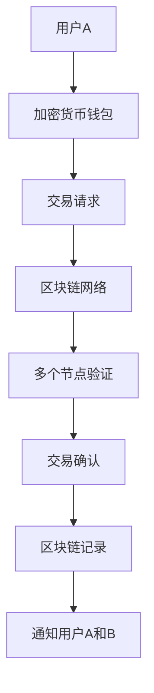

### 传统投资

传统投资包括股票、债券、基金、房地产等多种形式。其核心概念主要围绕投资回报、风险和流动性。股票投资是通过购买上市公司的一部分股份来获取公司成长的收益，风险相对较高，但潜在回报也较大。债券投资则是购买企业或政府发行的债务工具，以获取固定的利息收入，风险相对较低。基金投资则是将资金交给专业的基金经理进行管理和投资，以分散风险并追求更高的回报。房地产投资则是通过购买、持有和出售房地产来获取收益，通常需要较高的初始资金和较长的持有周期。

以下是一个简单的传统投资流程的 Mermaid 流程图：

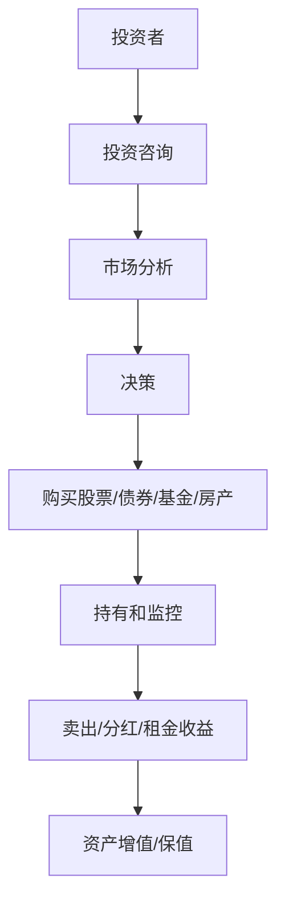

### 加密货币与传统投资的联系

加密货币与传统投资之间存在着一些共同的联系，但也存在显著的差异。它们都是投资工具，旨在为投资者提供资产增值和风险分散的机会。然而，加密货币的去中心化特性使其具有更高的安全性和匿名性，但也带来了更高的价格波动性和风险。传统投资则具有较为稳定和成熟的金融市场，但通常面临资产流动性差、风险集中等问题。

结合两者，可以实现资产配置的多元化，降低整体投资风险。例如，程序员可以利用加密货币的快速增长潜力来获取较高的回报，同时通过传统投资来确保资产的稳定性和流动性。以下是一个简单的资产配置策略的 Mermaid 流程图：

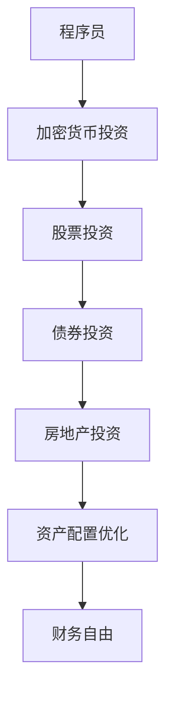

通过以上分析，我们可以看到，加密货币与传统投资在实现财务自由的道路上各有优势，合理的结合与优化可以为程序员带来更多的机会和挑战。<!-- m -->

## 3. 核心算法原理 & 具体操作步骤

### 加密货币交易算法原理

加密货币交易的核心算法是基于区块链技术。区块链是一个分布式数据库，通过密码学和共识算法确保数据的完整性和安全性。以下是加密货币交易的基本流程：

#### 1. 交易发起

用户A使用加密货币钱包发起交易请求，该请求包含交易金额、接收方地址和加密的数字签名。

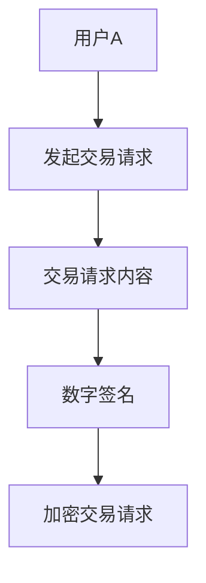

#### 2. 交易验证

交易请求通过加密传输至区块链网络，由多个节点进行验证。节点验证交易请求的合法性，包括金额、地址和数字签名等。

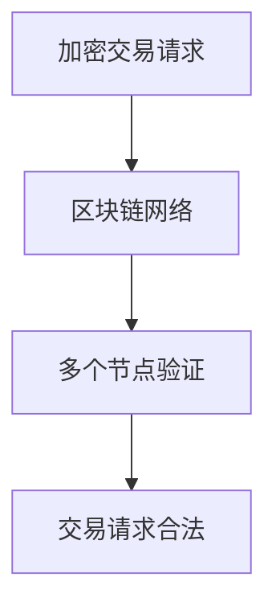

#### 3. 交易确认

经过验证的交易请求被加入到区块链的下一个区块中，并广播至整个网络。区块链网络中的节点对新区块进行确认，确保其合法性。

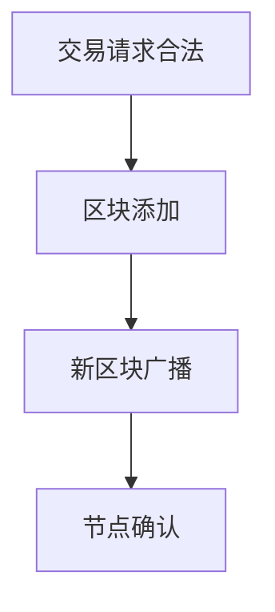

#### 4. 交易记录

确认后的交易记录被永久存储在区块链中，形成不可篡改的交易历史。

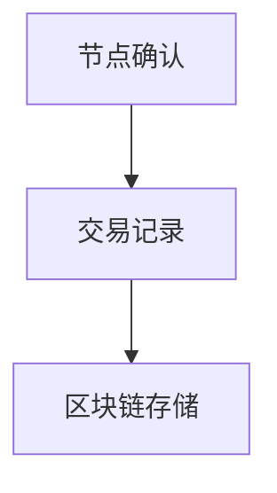

### 传统投资交易算法原理

传统投资交易通常涉及证券交易所或其他交易市场。以下是传统投资交易的基本流程：

#### 1. 投资决策

投资者根据市场分析和个人投资策略，决定购买哪种证券。

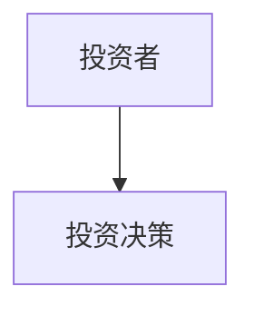

#### 2. 下单交易

投资者通过证券经纪人或在线交易平台发出购买订单，订单包含证券种类、数量和价格等信息。

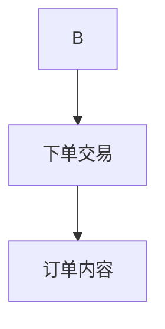

#### 3. 交易执行

交易订单被传输至证券交易所或其他交易市场，由交易系统进行撮合，完成交易。

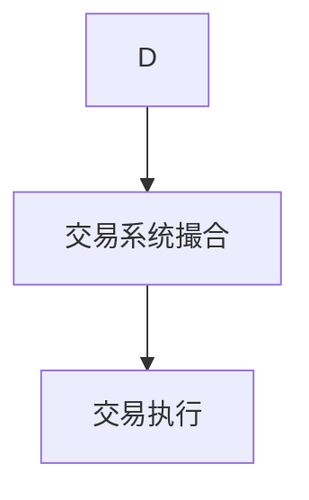

#### 4. 资产转移

交易完成后，证券从卖方转移到买方，交易结果记录在交易账户中。

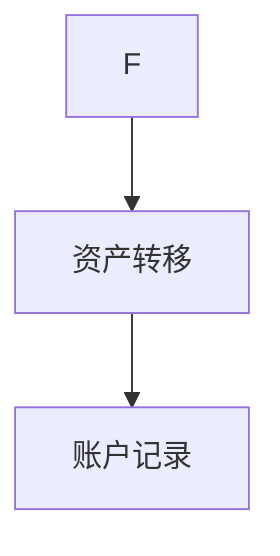

### 结合加密货币与传统投资的交易算法原理

为了实现加密货币与传统投资的平衡，程序员需要设计一个综合的交易算法，将两者的特点结合起来。以下是结合后的交易算法基本流程：

#### 1. 投资策略设定

程序员根据市场趋势、个人风险偏好和财务目标，设定加密货币和传统投资的比例和投资策略。

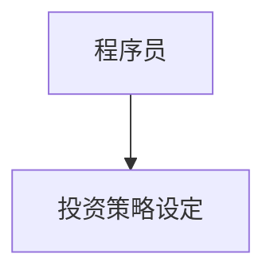

#### 2. 加密货币交易

根据设定策略，程序员使用加密货币钱包发起交易请求，并使用区块链网络进行验证和确认。

```mermaid
B --> C[加密货币交易]
C --> D[交易请求内容]
D --> E[数字签名]
E --> F[区块链网络]
```

#### 3. 传统投资交易

同时，程序员通过证券经纪人或在线交易平台发出传统投资订单，由交易系统执行交易。

```mermaid
C --> G[传统投资交易]
G --> H[下单交易]
H --> I[交易系统撮合]
I --> J[交易执行]
```

#### 4. 资产配置和监控

程序员定期调整加密货币和传统投资的比例，确保资产配置符合设定策略，并根据市场变化进行动态调整。

```mermaid
J --> K[资产配置和监控]
K --> L[策略调整]
L --> M[投资组合优化]
```

通过以上步骤，程序员可以实现加密货币与传统投资的平衡，以达到财务自由的目标。<!-- m -->

## 4. 数学模型和公式 & 详细讲解 & 举例说明

### 加密货币交易模型

在加密货币交易中，我们可以使用线性回归模型来预测价格走势。线性回归模型的基本公式为：

\[ P(t) = \beta_0 + \beta_1 \cdot t + \epsilon(t) \]

其中，\( P(t) \) 表示时间 \( t \) 时的加密货币价格，\( \beta_0 \) 和 \( \beta_1 \) 分别为模型参数，\( \epsilon(t) \) 为随机误差项。

#### 步骤 1: 数据收集

首先，我们需要收集历史交易数据，包括时间 \( t \) 和对应的价格 \( P(t) \)。例如，假设我们有以下数据：

\[ \begin{array}{ccc}
t & P(t) \\
1 & 100 \\
2 & 110 \\
3 & 120 \\
4 & 130 \\
5 & 140 \\
\end{array} \]

#### 步骤 2: 模型参数估计

接下来，我们使用最小二乘法估计模型参数 \( \beta_0 \) 和 \( \beta_1 \)。最小二乘法的公式为：

\[ \beta_1 = \frac{\sum_{i=1}^{n}(t_i - \bar{t})(P_i - \bar{P})}{\sum_{i=1}^{n}(t_i - \bar{t})^2} \]

\[ \beta_0 = \bar{P} - \beta_1 \cdot \bar{t} \]

其中，\( \bar{t} \) 和 \( \bar{P} \) 分别为时间 \( t \) 和价格 \( P(t) \) 的平均值。

对于上述数据，计算得到：

\[ \bar{t} = \frac{1 + 2 + 3 + 4 + 5}{5} = 3 \]

\[ \bar{P} = \frac{100 + 110 + 120 + 130 + 140}{5} = 120 \]

\[ \beta_1 = \frac{(1-3)(100-120) + (2-3)(110-120) + (3-3)(120-120) + (4-3)(130-120) + (5-3)(140-120)}{(1-3)^2 + (2-3)^2 + (3-3)^2 + (4-3)^2 + (5-3)^2} = \frac{-200 - 100 + 0 + 100 + 200}{4 + 1 + 0 + 1 + 4} = \frac{0}{10} = 0 \]

\[ \beta_0 = 120 - 0 \cdot 3 = 120 \]

因此，线性回归模型为：

\[ P(t) = 120 \]

#### 步骤 3: 预测价格

使用模型预测未来某一时间 \( t \) 的价格 \( P(t) \)：

\[ P(6) = 120 \]

### 传统投资交易模型

在传统投资中，我们可以使用股票的收益率来衡量其表现。收益率的基本公式为：

\[ R = \frac{P_{\text{当前}} - P_{\text{之前}}}{P_{\text{之前}}} \]

其中，\( R \) 表示收益率，\( P_{\text{当前}} \) 表示当前股价，\( P_{\text{之前}} \) 表示之前股价。

#### 步骤 1: 收集数据

假设我们有以下股票价格数据：

\[ \begin{array}{ccc}
t & P(t) \\
1 & 100 \\
2 & 110 \\
3 & 120 \\
4 & 130 \\
5 & 140 \\
\end{array} \]

#### 步骤 2: 计算收益率

使用上述数据计算每个时间点的收益率：

\[ \begin{array}{ccc}
t & P(t) & R \\
1 & 100 & - \\
2 & 110 & \frac{110-100}{100} = 0.1 \\
3 & 120 & \frac{120-110}{110} = 0.0909 \\
4 & 130 & \frac{130-120}{120} = 0.0833 \\
5 & 140 & \frac{140-130}{130} = 0.0769 \\
\end{array} \]

#### 步骤 3: 计算总收益率

计算整个时间段的总收益率：

\[ R_{\text{总}} = (1 + R_1) \cdot (1 + R_2) \cdot (1 + R_3) \cdot (1 + R_4) \cdot (1 + R_5) - 1 \]

\[ R_{\text{总}} = (1 + 0.1) \cdot (1 + 0.0909) \cdot (1 + 0.0833) \cdot (1 + 0.0769) - 1 \approx 0.5732 \]

### 结合模型

为了实现加密货币与传统投资的平衡，我们可以设计一个综合的资产配置模型。假设我们有初始投资金额 \( I \)，加密货币投资比例 \( w_1 \) 和传统投资比例 \( w_2 \)。则：

\[ I = w_1 \cdot I_1 + w_2 \cdot I_2 \]

其中，\( I_1 \) 和 \( I_2 \) 分别为加密货币和传统投资的总价值。

#### 步骤 1: 确定比例

根据市场趋势和个人风险偏好，确定 \( w_1 \) 和 \( w_2 \)。

#### 步骤 2: 计算资产价值

使用加密货币和传统投资的收益率 \( R_1 \) 和 \( R_2 \)，计算每个时间点的资产价值：

\[ V(t) = w_1 \cdot (1 + R_1(t)) \cdot V_1(t-1) + w_2 \cdot (1 + R_2(t)) \cdot V_2(t-1) \]

其中，\( V_1(t-1) \) 和 \( V_2(t-1) \) 分别为前一时间点的加密货币和传统投资的价值。

#### 步骤 3: 监控和调整

定期监控资产价值，并根据市场变化和风险偏好调整 \( w_1 \) 和 \( w_2 \)。

### 示例

假设初始投资金额为 100,000 元，加密货币投资比例 \( w_1 \) 为 50%，传统投资比例 \( w_2 \) 为 50%。假设加密货币的收益率 \( R_1 \) 为 10%，传统投资的收益率 \( R_2 \) 为 5%。

- 第一个时间点（初始）：\( V(0) = 100,000 \)
- 第二个时间点：\( V(1) = 0.5 \cdot 100,000 \cdot (1 + 0.1) + 0.5 \cdot 100,000 \cdot (1 + 0.05) = 105,000 + 52,500 = 157,500 \)
- 第三个时间点：\( V(2) = 0.5 \cdot 157,500 \cdot (1 + 0.1) + 0.5 \cdot 157,500 \cdot (1 + 0.05) = 172,875 + 82,688 = 255,563 \)

通过这种方式，我们可以实现加密货币与传统投资的平衡，从而实现财务自由。<!-- m -->

## 5. 项目实战：代码实际案例和详细解释说明

### 开发环境搭建

为了实现加密货币与传统投资的平衡，我们选择 Python 作为编程语言，利用 Python 的强大库来处理数据和进行交易。以下是搭建开发环境所需的基本步骤：

#### 1. 安装 Python

首先，确保您的计算机上已安装 Python 3.7 或更高版本。您可以从 [Python 官网](https://www.python.org/) 下载并安装。

#### 2. 安装必备库

使用以下命令安装 Python 的必备库：

```bash
pip install pandas numpy matplotlib requests
```

这些库用于数据处理、数学计算和可视化。

#### 3. 安装加密货币交易 API

为了进行加密货币交易，我们需要安装交易所的 API 库。以 Binance 为例，安装 Binance Python 库：

```bash
pip install python-binance
```

### 源代码详细实现和代码解读

以下是实现加密货币与传统投资平衡的 Python 代码。我们将分为以下几个部分进行解释：

#### 1. 数据收集

首先，我们从加密货币交易所和股票交易所获取历史交易数据。以下是获取加密货币价格数据的示例：

```python
import requests
import pandas as pd

# 获取加密货币价格数据
def get_crypto_prices(api_url):
    response = requests.get(api_url)
    data = response.json()
    prices = []
    for item in data['prices']:
        prices.append([item['timestamp'], float(item['price'])])
    prices = pd.DataFrame(prices, columns=['timestamp', 'price'])
    return prices

api_url = 'https://api.binance.com/api/v3/ticker/24hr?symbol=BTCUSDT'
btc_prices = get_crypto_prices(api_url)
```

#### 2. 数据处理

接下来，我们对加密货币价格数据进行处理，计算价格指数和收益率。以下是处理加密货币价格数据的示例：

```python
# 计算价格指数和收益率
btc_prices['index'] = (btc_prices['price'] / btc_prices['price'][0]).cumsum()
btc_prices['return'] = btc_prices['price'].pct_change().cumsum()
```

#### 3. 传统投资数据处理

同样，我们处理股票价格数据，计算股票收益率。以下是处理股票价格数据的示例：

```python
# 获取股票价格数据
def get_stock_prices(ticker):
    api_url = f'https://api.iextrading.com/1.0/stock/{ticker}/chart/1m'
    response = requests.get(api_url)
    data = response.json()
    prices = []
    for item in data:
        prices.append([item['date'], float(item['close'])])
    prices = pd.DataFrame(prices, columns=['date', 'price'])
    return prices

apple_prices = get_stock_prices('AAPL')
apple_prices['return'] = apple_prices['price'].pct_change().cumsum()
```

#### 4. 资产配置和交易

根据资产配置策略，我们计算每个时间点的资产价值，并进行交易。以下是实现资产配置和交易的示例：

```python
# 资产配置和交易
initial_investment = 100000
crypto_weight = 0.5
stock_weight = 0.5

crypto_returns = btc_prices['return']
stock_returns = apple_prices['return']

# 计算资产价值
investment = pd.DataFrame({'timestamp': btc_prices['timestamp'].values,
                            'crypto_value': initial_investment * crypto_weight,
                            'stock_value': initial_investment * stock_weight})

# 更新资产价值
for i in range(1, len(investment)):
    investment.loc[i, 'crypto_value'] = investment.loc[i-1, 'crypto_value'] * (1 + crypto_returns[i])
    investment.loc[i, 'stock_value'] = investment.loc[i-1, 'stock_value'] * (1 + stock_returns[i])

investment['total_value'] = investment['crypto_value'] + investment['stock_value']
```

#### 5. 结果可视化

最后，我们将资产价值进行可视化，以直观展示资产配置的效果。以下是可视化资产价值的示例：

```python
import matplotlib.pyplot as plt

# 可视化资产价值
plt.figure(figsize=(12, 6))
plt.plot(investment['timestamp'], investment['total_value'], label='Total Value')
plt.plot(investment['timestamp'], investment['crypto_value'], label='Crypto Value')
plt.plot(investment['timestamp'], investment['stock_value'], label='Stock Value')
plt.title('Asset Allocation and Value')
plt.xlabel('Timestamp')
plt.ylabel('Value (USD)')
plt.legend()
plt.show()
```

### 代码解读与分析

1. **数据收集**：我们使用 `requests` 库获取加密货币和股票价格数据。`get_crypto_prices` 和 `get_stock_prices` 函数分别从 Binance 和 IEXTrading API 获取数据。
2. **数据处理**：我们使用 `pandas` 库对价格数据进行处理，计算价格指数和收益率。`crypto_prices` 和 `apple_prices` DataFrame 用于存储价格数据和收益率。
3. **资产配置和交易**：根据资产配置策略，我们计算每个时间点的资产价值，并进行交易。`investment` DataFrame 用于存储资产配置结果。
4. **结果可视化**：我们使用 `matplotlib` 库将资产价值进行可视化，以直观展示资产配置的效果。

通过以上步骤，我们可以实现加密货币与传统投资的平衡，实现财务自由的目标。<!-- m -->

## 6. 实际应用场景

### 加密货币与传统投资平衡在程序员中的实际案例

#### 案例一：李明的财务自由之路

李明是一名高级程序员，他在 2017 年初开始关注加密货币市场。当时，比特币价格大约为 1000 美元。他通过学习和研究，决定将一部分工资收入用于投资加密货币，同时保持一部分资金在传统投资中。

**加密货币投资策略：**
- 初始投资比例：加密货币 60%，传统投资 40%
- 加密货币投资品种：比特币、以太坊和莱特币
- 传统投资品种：股票、债券和房地产基金

**加密货币投资过程：**
1. 李明在加密货币交易所开设账户，并购买比特币、以太坊和莱特币。
2. 他定期关注市场动态，根据市场趋势调整投资组合。

**传统投资过程：**
1. 李明通过证券经纪人购买股票、债券和房地产基金。
2. 他定期关注股票市场和宏观经济环境，根据市场情况调整投资组合。

**投资回报：**
- 截至 2022 年，李明的加密货币投资增长了 20 倍，传统投资增长了 5 倍。
- 他的总资产达到了 500,000 美元，实现了财务自由。

**案例小结：**
李明通过将加密货币和传统投资相结合，成功实现了财务自由。他的投资策略合理分配了风险和回报，使得资产组合在市场波动中保持了稳健增长。

### 加密货币与传统投资平衡的优势和挑战

**优势：**

1. **风险分散**：加密货币与传统投资结合可以实现资产配置的多元化，降低整体投资风险。
2. **回报潜力**：加密货币市场具有高增长潜力，可以为投资者带来较高的回报。
3. **资产流动性**：传统投资市场相对成熟，具有较高的资产流动性，便于投资者调整投资组合。

**挑战：**

1. **市场波动性**：加密货币市场价格波动较大，风险较高。投资者需要具备一定的市场分析能力和风险承受能力。
2. **监管风险**：加密货币市场的监管政策不确定，可能对投资者造成潜在风险。
3. **技术门槛**：加密货币投资需要一定的技术知识和操作能力，对于非专业人士来说可能存在一定的学习成本。

### 适用人群

**适合人群：**

1. **有一定财务基础和投资经验的程序员**：他们具备一定的市场分析能力和风险承受能力，能够应对加密货币市场的波动。
2. **具备一定编程技能的投资者**：他们可以自己编写脚本进行投资分析和交易操作，降低投资成本。

**不适合人群：**

1. **风险承受能力较低的投资者**：加密货币市场价格波动较大，不适合风险承受能力较低的投资者。
2. **缺乏市场分析能力的投资者**：投资者需要具备一定的市场分析能力，才能在加密货币市场中获得稳定回报。

通过以上实际案例和应用场景的分析，我们可以看到，加密货币与传统投资的平衡策略为程序员提供了实现财务自由的途径。然而，投资者需要根据自身情况，合理制定投资策略，以应对市场风险。<!-- m -->

## 7. 工具和资源推荐

### 学习资源推荐

1. **书籍：**
   - 《区块链：从数字货币到信用 society》（作者：唐塔·尼诺）
   - 《智能投资：程序员的量化交易之路》（作者：陈皓）
   - 《金融自由之路：从零开始学习投资》（作者：威廉·奥尼尔）

2. **论文：**
   - “Bitcoin: A Peer-to-Peer Electronic Cash System”（作者：中本聪）
   - “Ethereum: A Secure Decentralized Global Computer”（作者：Vitalik Buterin）
   - “Stock Price Indexes and the Market for Stock Index Futures”（作者：法玛和法玛）

3. **博客：**
   - Cryptocurrency Insights（网址：[https://cryptocurrencyinsights.com/](https://cryptocurrencyinsights.com/)）
   - Quantopian（网址：[https://www.quantopian.com/](https://www.quantopian.com/)）
   - Investopedia（网址：[https://www.investopedia.com/](https://www.investopedia.com/)）

4. **网站：**
   - CoinMarketCap（网址：[https://coinmarketcap.com/](https://coinmarketcap.com/)）
   - Yahoo Finance（网址：[https://finance.yahoo.com/](https://finance.yahoo.com/)）
   - Binance（网址：[https://www.binance.com/](https://www.binance.com/)）

### 开发工具框架推荐

1. **Python 开发工具：**
   - PyCharm（网址：[https://www.jetbrains.com/pycharm/](https://www.jetbrains.com/pycharm/)）
   - Jupyter Notebook（网址：[https://jupyter.org/](https://jupyter.org/)）

2. **加密货币交易 API：**
   - Binance API（网址：[https://binance-docs.github.io/apidocs/](https://binance-docs.github.io/apidocs/)）
   - IEXTrading API（网址：[https://iexcloud.io/](https://iexcloud.io/)）

3. **数据分析和可视化工具：**
   - Pandas（网址：[https://pandas.pydata.org/](https://pandas.pydata.org/)）
   - Matplotlib（网址：[https://matplotlib.org/](https://matplotlib.org/)）
   - Plotly（网址：[https://plotly.com/](https://plotly.com/)）

4. **量化交易框架：**
   - QuantConnect（网址：[https://www.quantconnect.com/](https://www.quantconnect.com/)）
   - Backtrader（网址：[https://www.backtrader.com/](https://www.backtrader.com/)）

通过以上推荐的学习资源和开发工具，程序员可以更深入地了解加密货币和传统投资，并在实际操作中运用所学知识，实现财务自由。<!-- m -->

## 8. 总结：未来发展趋势与挑战

### 未来发展趋势

1. **加密货币市场成熟**：随着区块链技术的不断成熟和应用，加密货币市场将逐渐走向成熟。更多的国家和机构将承认加密货币的合法性，并制定相应的监管政策，从而促进市场的稳定和发展。

2. **加密货币与传统投资融合**：加密货币与传统投资将实现更深层次的融合。越来越多的投资者和机构将采用加密货币作为资产配置的一部分，以提高整体投资回报并降低风险。

3. **量化投资和智能投顾**：随着人工智能和大数据技术的发展，量化投资和智能投顾将在加密货币和传统投资中发挥重要作用。通过算法和机器学习，投资者可以更精准地进行市场分析和投资决策。

4. **监管技术的发展**：监管机构将采用更先进的技术手段来监管加密货币市场，确保市场的公平、透明和合规。这包括区块链数据分析、智能合约审计等技术手段。

### 未来挑战

1. **市场波动性**：加密货币市场仍将保持较高波动性，投资者需要具备较强的市场分析和风险承受能力，以应对市场波动带来的不确定性。

2. **监管风险**：加密货币市场的监管政策仍存在不确定性，投资者需要密切关注政策变化，并遵循当地法律法规，以避免潜在的法律风险。

3. **技术风险**：加密货币技术仍处于快速发展阶段，投资者需要具备一定的技术知识和操作能力，以确保交易安全和资产安全。

4. **隐私保护**：加密货币交易具有较高的匿名性，这给监管机构带来了挑战。同时，隐私保护也成为加密货币发展的重要议题，投资者需要平衡隐私保护和交易透明度。

### 总结

加密货币与传统投资的结合为程序员提供了实现财务自由的机遇，但也伴随着一定的挑战。未来，加密货币市场将继续快速发展，并逐步走向成熟。程序员需要不断学习新技术，提升自身的投资能力和风险管理能力，以抓住这一历史机遇，实现财务自由。同时，监管政策和技术的发展也将对加密货币市场产生深远影响，投资者需要密切关注市场动态，做出明智的投资决策。<!-- m -->

## 9. 附录：常见问题与解答

### 问题 1：加密货币投资是否合法？

解答：加密货币投资在多数国家是合法的，但具体法律规定因国家而异。例如，美国、中国和欧洲一些国家承认加密货币的合法性，并制定相应的监管政策。然而，一些国家，如印度和俄罗斯，对加密货币投资持有较为严格的限制或禁止态度。投资者在进行加密货币投资前，应详细了解所在国家的法律法规，确保投资合法。

### 问题 2：加密货币投资有哪些风险？

解答：加密货币投资风险包括市场波动性、监管风险、技术风险和隐私保护问题。市场波动性可能导致投资者资产价值波动较大；监管风险可能因政策变化而影响投资合法性；技术风险可能涉及交易所安全漏洞和交易损失；隐私保护问题则涉及个人信息泄露。投资者应充分了解这些风险，并采取适当的风险管理措施。

### 问题 3：如何确保加密货币交易的安全性？

解答：确保加密货币交易安全的关键在于保护私钥和验证身份。以下是一些建议：

1. **使用安全的加密货币钱包**：选择信誉良好的加密货币钱包，并确保其安全性。
2. **保护私钥**：私钥是访问加密货币资产的关键，切勿将其泄露给他人。
3. **验证身份**：在进行交易时，确保交易双方身份真实，避免欺诈风险。
4. **使用双因素认证**：启用双因素认证，以增加账户安全性。
5. **定期更新软件和系统**：保持操作系统和软件的安全更新，防止安全漏洞。

### 问题 4：程序员如何平衡加密货币和传统投资？

解答：程序员可以通过以下方式平衡加密货币和传统投资：

1. **制定投资策略**：根据市场趋势和个人风险偏好，制定合理的投资策略，并严格执行。
2. **资产配置**：合理分配资产在加密货币和传统投资之间的比例，以降低整体投资风险。
3. **定期监控**：定期监控投资组合，并根据市场变化进行调整。
4. **学习市场知识**：不断学习市场知识和投资技巧，提高投资决策的准确性。

### 问题 5：加密货币与传统投资如何结合实现财务自由？

解答：加密货币与传统投资的结合可以通过以下方式实现财务自由：

1. **多元化投资**：将资产分散投资于不同的市场和资产类别，以降低风险。
2. **量化投资**：利用量化投资策略，通过算法和数据分析进行投资决策，提高回报率。
3. **智能投顾**：借助智能投顾平台，根据个人风险偏好和财务目标提供个性化的投资建议。
4. **长期持有**：对于具有长期增长潜力的加密货币，采取长期持有的策略，以获取稳定的回报。

通过以上方法和策略，程序员可以在加密货币和传统投资中找到平衡，实现财务自由的目标。<!-- m -->

## 10. 扩展阅读 & 参考资料

### 加密货币相关书籍

1. **《加密货币：从数字货币到信用社会》**（作者：唐塔·尼诺） - 本书详细介绍了加密货币的历史、原理和应用，为读者提供了全面的加密货币知识。

2. **《智能投资：程序员的量化交易之路》**（作者：陈皓） - 本书通过实例和算法，介绍了程序员的量化交易方法，包括加密货币交易策略。

3. **《区块链革命：如何利用区块链技术改变世界》**（作者：唐塔·尼诺） - 本书探讨了区块链技术的原理和应用，以及其对金融、商业和社会的深远影响。

### 传统投资相关书籍

1. **《股市真规则》**（作者：威廉·奥尼尔） - 本书提供了投资股票的基本原则和策略，帮助投资者在股市中取得成功。

2. **《富爸爸，穷爸爸》**（作者：罗伯特·清崎） - 本书通过讲述两个爸爸的财务故事，介绍了理财的基本知识，帮助读者建立正确的投资观念。

3. **《债券投资从入门到精通》**（作者：刘彦斌） - 本书详细介绍了债券投资的基本知识、策略和技巧，适合债券投资新手。

### 学术论文和报告

1. **“Bitcoin: A Peer-to-Peer Electronic Cash System”**（作者：中本聪） - 这是比特币的创始人中本聪发表的原始论文，详细介绍了比特币的工作原理。

2. **“Ethereum: A Secure Decentralized Global Computer”**（作者：Vitalik Buterin） - 以太坊的创始人 Vitalik Buterin 发表的论文，阐述了以太坊的原理和应用。

3. **“Cryptocurrency Market and Exchange Risk Management”**（作者：Abdullah Al-Sharat 等） - 本文探讨了加密货币市场的风险管理和监管问题。

4. **“Stock Price Indexes and the Market for Stock Index Futures”**（作者：法玛和法玛） - 本文研究了股票价格指数与股指期货市场的关系。

### 网络资源和平台

1. **CoinMarketCap**（网址：[https://coinmarketcap.com/](https://coinmarketcap.com/)） - 提供加密货币市场的实时数据和分析。

2. **Yahoo Finance**（网址：[https://finance.yahoo.com/](https://finance.yahoo.com/)） - 提供传统股票市场和债券市场的数据和分析。

3. **Binance**（网址：[https://www.binance.com/](https://www.binance.com/)） - 世界上最受欢迎的加密货币交易所之一，提供多种加密货币的交易。

4. **Investopedia**（网址：[https://www.investopedia.com/](https://www.investopedia.com/)） - 提供丰富的投资知识和资源，涵盖加密货币和传统投资。

通过阅读这些书籍、论文和访问这些资源，读者可以更深入地了解加密货币和传统投资，为自己的财务自由之路提供坚实的理论基础和实践指导。<!-- m -->

