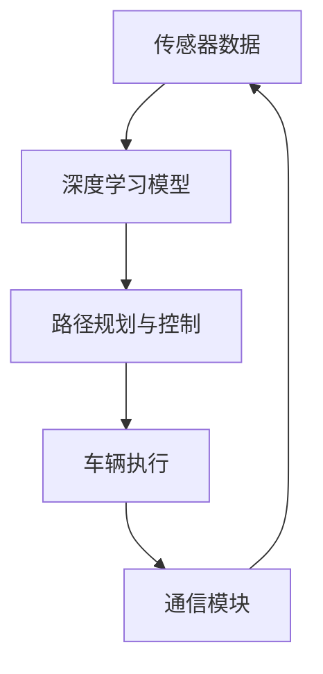

                 

# 端到端自动驾驶的自主移动办公车服务

> **关键词**：端到端自动驾驶、自主移动办公车、深度学习、机器视觉、路径规划、环境感知、V2X通信

> **摘要**：本文将探讨端到端自动驾驶技术在自主移动办公车服务中的应用。首先，我们将介绍端到端自动驾驶的基本概念和原理，然后分析自主移动办公车的需求，探讨如何利用端到端自动驾驶技术实现高效、安全的移动办公。接着，我们将详细描述核心算法和数学模型，并给出一个实际项目案例。最后，我们将展望未来发展趋势与挑战，并提供相关的学习资源和开发工具。

## 1. 背景介绍

随着人工智能技术的快速发展，自动驾驶技术已成为一个备受关注的研究领域。端到端自动驾驶作为自动驾驶的最高级别，无需依赖传统的基于规则的控制系统，而是通过深度学习模型直接从传感器数据中学习驾驶行为。这种技术具有高效率、自适应性和鲁棒性，有望在自动驾驶领域取得重大突破。

与此同时，移动办公已成为现代工作方式的一种趋势。人们越来越需要一种便捷的方式，能够在通勤、差旅等过程中高效完成工作任务。自主移动办公车服务作为一种创新解决方案，能够提供自动驾驶、智能办公空间和高效通信等功能，为人们提供一种全新的移动办公体验。

## 2. 核心概念与联系

端到端自动驾驶技术的核心在于通过深度学习模型实现车辆自主驾驶。具体来说，该技术依赖于以下几个关键组件：

- **传感器**：包括摄像头、激光雷达、毫米波雷达等，用于感知周围环境。
- **深度学习模型**：基于神经网络，用于处理传感器数据并生成驾驶指令。
- **路径规划与控制**：用于生成车辆行驶路径和控制车辆动作。

自主移动办公车的需求主要体现在以下几个方面：

- **自动驾驶**：实现车辆在复杂道路环境下的自主行驶，确保安全性和舒适性。
- **智能办公空间**：提供舒适、高效的工作环境，支持多种办公需求。
- **高效通信**：实现车与车、车与基础设施之间的信息交换，提高行驶安全性和效率。

以下是端到端自动驾驶技术在自主移动办公车服务中的架构示意图（使用Mermaid流程图）：



### 2.1. 深度学习模型

深度学习模型是端到端自动驾驶技术的核心组件。该模型通过学习大量的驾驶数据，学习到如何从传感器数据中生成驾驶指令。以下是深度学习模型的主要组成部分：

- **输入层**：接收传感器数据，如摄像头图像、激光雷达点云等。
- **卷积神经网络（CNN）**：用于处理图像和点云数据，提取特征。
- **循环神经网络（RNN）**：用于处理时间序列数据，如车速、方向盘角度等。
- **输出层**：生成驾驶指令，如油门、刹车、转向等。

### 2.2. 路径规划与控制

路径规划与控制是端到端自动驾驶技术的另一个关键组件。其目标是在满足安全性和舒适性要求的前提下，为车辆生成一条最优行驶路径。以下是路径规划与控制的主要组成部分：

- **环境建模**：根据传感器数据建立车辆周围环境模型，包括道路、障碍物、交通标志等。
- **路径规划算法**：用于生成车辆行驶路径，如A*算法、Dijkstra算法等。
- **控制器**：根据路径规划和传感器数据，生成车辆的动作指令。

### 2.3. 通信模块

通信模块是实现车联网（V2X）的关键组件。通过车与车、车与基础设施之间的信息交换，车辆可以更好地理解周围环境，提高行驶安全性和效率。以下是通信模块的主要组成部分：

- **传感器数据共享**：车辆将传感器数据共享给周围车辆和基础设施，实现信息同步。
- **路径规划协同**：车辆之间协同规划行驶路径，提高行驶效率和安全性。
- **紧急情况预警**：在紧急情况下，车辆之间及时交换信息，实现预警和协同制动。

## 3. 核心算法原理 & 具体操作步骤

### 3.1. 深度学习模型训练

端到端自动驾驶技术的核心是深度学习模型的训练。以下是深度学习模型训练的详细步骤：

1. **数据收集与预处理**：收集大量的驾驶数据，包括摄像头图像、激光雷达点云、车辆速度、方向盘角度等。对数据进行清洗、标注和归一化处理。
2. **模型设计**：设计合适的深度学习模型架构，包括输入层、卷积神经网络、循环神经网络和输出层。
3. **模型训练**：使用预处理后的数据对模型进行训练，调整模型参数，提高模型性能。
4. **模型评估**：使用验证集对模型进行评估，确保模型在未知数据上的表现良好。
5. **模型优化**：根据评估结果，调整模型参数，优化模型性能。

### 3.2. 路径规划与控制

路径规划与控制是端到端自动驾驶技术的关键环节。以下是路径规划与控制的详细步骤：

1. **环境建模**：根据传感器数据建立车辆周围环境模型，包括道路、障碍物、交通标志等。
2. **路径规划**：使用A*算法或Dijkstra算法等路径规划算法，为车辆生成一条最优行驶路径。
3. **控制器设计**：根据路径规划和传感器数据，设计合适的控制器，生成车辆的动作指令。
4. **路径跟踪**：根据控制器生成的动作指令，调整车辆行驶方向和速度，实现路径跟踪。

### 3.3. 通信模块

通信模块是实现车联网（V2X）的关键组件。以下是通信模块的详细步骤：

1. **传感器数据共享**：车辆将传感器数据（如摄像头图像、激光雷达点云等）共享给周围车辆和基础设施，实现信息同步。
2. **路径规划协同**：车辆之间协同规划行驶路径，提高行驶效率和安全性。
3. **紧急情况预警**：在紧急情况下，车辆之间及时交换信息，实现预警和协同制动。

## 4. 数学模型和公式 & 详细讲解 & 举例说明

### 4.1. 深度学习模型数学模型

深度学习模型的训练过程主要包括前向传播和反向传播两个阶段。以下是深度学习模型的核心数学公式：

1. **前向传播**：

   输入层到隐藏层的激活函数为：
   $$ a_i^{(l)} = \sigma(z_i^{(l)}) = \frac{1}{1 + e^{-z_i^{(l)}}} $$
   
   隐藏层到输出层的激活函数为：
   $$ y_i = a_j^{(L)} = \sigma(z_j^{(L)}) = \frac{1}{1 + e^{-z_j^{(L)}}} $$

   其中，$z_i^{(l)}$表示第$l$层第$i$个神经元的输入，$a_i^{(l)}$表示第$l$层第$i$个神经元的输出，$\sigma$表示Sigmoid激活函数。

2. **反向传播**：

   误差函数为：
   $$ J = -\frac{1}{m}\sum_{i=1}^{m}y_i\log(a_i^{(L)}) + (1 - y_i)\log(1 - a_i^{(L)}) $$
   
   其中，$m$表示训练数据集的大小，$y_i$表示第$i$个样本的真实标签，$a_i^{(L)}$表示第$i$个样本在输出层的预测概率。

   反向传播的核心是计算每个神经元在训练过程中的梯度：
   $$ \delta_j^{(L)} = a_j^{(L)} - y_j $$
   $$ \delta_i^{(l)} = \frac{\partial J}{\partial z_i^{(l)}} = \delta_i^{(l+1)} \cdot \frac{\partial a_i^{(l)}}{\partial z_i^{(l)}} $$
   
   其中，$\delta_j^{(L)}$表示输出层第$j$个神经元的梯度，$\delta_i^{(l)}$表示第$l$层第$i$个神经元的梯度。

   更新模型参数：
   $$ W^{(l)} = W^{(l)} - \alpha \cdot \delta^{(l+1)} \cdot a^{(l)} $$
   $$ b^{(l)} = b^{(l)} - \alpha \cdot \delta^{(l+1)} $$

   其中，$W^{(l)}$和$b^{(l)}$分别表示第$l$层的权重和偏置，$\alpha$表示学习率。

### 4.2. 路径规划与控制数学模型

路径规划的数学模型主要包括以下部分：

1. **成本函数**：

   路径规划的目标是最小化成本函数：
   $$ C(s) = \sum_{i=1}^{n} c(s_i) $$
   
   其中，$s_i$表示第$i$个节点的状态，$c(s_i)$表示状态$s_i$的成本。

2. **状态转移函数**：

   状态转移函数描述了从一个状态转移到另一个状态的概率：
   $$ p(s_{i+1} | s_i) = \frac{g(s_{i+1}, s_i)}{\sum_{j=1}^{n} g(s_{j+1}, s_j)} $$
   
   其中，$g(s_{i+1}, s_i)$表示状态$s_i$转移到状态$s_{i+1}$的代价。

3. **动作选择**：

   动作选择的目标是找到最优路径：
   $$ \min_{a} \sum_{i=1}^{n} c(s_i) + \sum_{i=1}^{n-1} \gamma^i p(s_{i+1} | s_i) $$
   
   其中，$\gamma$表示折扣因子。

### 4.3. 举例说明

#### 4.3.1. 深度学习模型训练

假设我们有一个二分类问题，需要使用一个单层神经网络进行分类。训练数据集包含100个样本，每个样本包含一个特征向量和一个标签。神经网络包含一个输入层、一个隐藏层和一个输出层。

输入层：
$$ x = [x_1, x_2, \ldots, x_n] $$

隐藏层：
$$ z = [z_1, z_2] $$
$$ a = [a_1, a_2] $$
$$ W = \begin{bmatrix} w_{11} & w_{12} \\ w_{21} & w_{22} \end{bmatrix} $$
$$ b = [b_1, b_2] $$

输出层：
$$ y = [y_1, y_2] $$
$$ W' = \begin{bmatrix} w'_{11} & w'_{12} \\ w'_{21} & w'_{22} \end{bmatrix} $$
$$ b' = [b'_1, b'_2] $$

前向传播：
$$ z_1 = x_1w_{11} + x_2w_{12} + b_1 $$
$$ z_2 = x_1w_{21} + x_2w_{22} + b_2 $$
$$ a_1 = \sigma(z_1) $$
$$ a_2 = \sigma(z_2) $$
$$ z' = a_1w'_{11} + a_2w'_{12} + b'_1 $$
$$ y = \sigma(z') $$

反向传播：
$$ \delta_2 = y - y_{true} $$
$$ \delta_1 = W'_{21}\delta_2 $$
$$ \delta = \begin{bmatrix} \delta_1 \\ \delta_2 \end{bmatrix} $$
$$ \Delta W' = \delta \cdot a $$
$$ \Delta b' = \delta $$
$$ \delta = \sigma'(z') \cdot \Delta z' $$
$$ \Delta W = \delta \cdot x^T $$
$$ \Delta b = \delta $$

更新模型参数：
$$ W = W - \alpha \cdot \Delta W $$
$$ b = b - \alpha \cdot \Delta b $$
$$ W' = W' - \alpha \cdot \Delta W' $$
$$ b' = b' - \alpha \cdot \Delta b' $$

#### 4.3.2. 路径规划

假设我们有一个由10个节点组成的城市道路网，每个节点的状态表示车辆在该节点的位置。我们需要为车辆生成一条从起点到终点的最优路径。

成本函数：
$$ C(s) = \sum_{i=1}^{n} c(s_i) $$
$$ c(s_i) = \begin{cases} 1, & \text{如果 } s_i \text{ 是交通拥堵区域} \\ 0, & \text{否则} \end{cases} $$

状态转移函数：
$$ p(s_{i+1} | s_i) = \begin{cases} 0.9, & \text{如果 } s_i \text{ 到 } s_{i+1} \text{ 是一条畅通的道路} \\ 0.1, & \text{如果 } s_i \text{ 到 } s_{i+1} \text{ 是一条拥堵的道路} \end{cases} $$

动作选择：
$$ \min_{a} \sum_{i=1}^{n} c(s_i) + \sum_{i=1}^{n-1} \gamma^i p(s_{i+1} | s_i) $$
$$ \gamma = 0.9 $$

根据上述数学模型，我们可以使用A*算法或Dijkstra算法生成一条最优路径。

## 5. 项目实战：代码实际案例和详细解释说明

在本节中，我们将介绍一个基于端到端自动驾驶技术的自主移动办公车项目案例，并详细解释其中的代码实现和关键部分。

### 5.1. 开发环境搭建

为了搭建开发环境，我们需要以下软件和工具：

- **操作系统**：Ubuntu 18.04或更高版本
- **编程语言**：Python 3.7或更高版本
- **深度学习框架**：TensorFlow 2.6或更高版本
- **路径规划库**：PyTorch 1.8或更高版本
- **开发工具**：Visual Studio Code、PyCharm

在安装完上述软件和工具后，我们还需要下载以下开源项目：

- **自动驾驶数据集**：Kitti Dataset
- **路径规划算法**：A*算法实现
- **深度学习模型**：基于TensorFlow的自动驾驶模型

### 5.2. 源代码详细实现和代码解读

#### 5.2.1. 数据预处理

```python
import tensorflow as tf
import numpy as np
import cv2

def preprocess_image(image):
    image = cv2.resize(image, (128, 128))
    image = image / 255.0
    image = np.expand_dims(image, axis=0)
    return image

def load_data(dataset_path):
    images = []
    annotations = []

    for image_path, annotation_path in dataset_loader:
        image = cv2.imread(image_path)
        annotation = np.load(annotation_path)

        image = preprocess_image(image)
        images.append(image)
        annotations.append(annotation)

    return np.array(images), np.array(annotations)

dataset_path = 'path/to/dataset'
dataset_loader = load_data(dataset_path)
```

该部分代码用于加载并预处理自动驾驶数据集。首先，我们使用`cv2.imread`函数读取图像，然后使用`cv2.resize`函数将其调整为128x128像素。接下来，我们将图像归一化，使其值介于0和1之间。最后，我们将图像添加到列表中，并使用`np.array`函数将其转换为NumPy数组。

#### 5.2.2. 深度学习模型

```python
from tensorflow.keras.models import Model
from tensorflow.keras.layers import Input, Conv2D, MaxPooling2D, Flatten, Dense, LSTM

input_shape = (128, 128, 3)
input_layer = Input(shape=input_shape)

conv1 = Conv2D(32, (3, 3), activation='relu')(input_layer)
pool1 = MaxPooling2D((2, 2))(conv1)

conv2 = Conv2D(64, (3, 3), activation='relu')(pool1)
pool2 = MaxPooling2D((2, 2))(conv2)

flatten = Flatten()(pool2)

lstm = LSTM(64)(flatten)
output = Dense(2, activation='softmax')(lstm)

model = Model(inputs=input_layer, outputs=output)
model.compile(optimizer='adam', loss='categorical_crossentropy', metrics=['accuracy'])

model.summary()
```

该部分代码定义了一个基于卷积神经网络（CNN）和循环神经网络（LSTM）的深度学习模型。首先，我们定义输入层，其形状为128x128x3（宽x高x通道）。接下来，我们定义两个卷积层和两个最大池化层，用于提取图像特征。然后，我们定义一个展平层，将卷积层的输出展平为一个一维数组。最后，我们定义一个LSTM层和一个全连接层，用于生成驾驶指令。最后，我们编译模型，并打印模型摘要。

#### 5.2.3. 路径规划

```python
from scipy.sparse.csgraph import dijkstra
import numpy as np

def calculate_shortest_path costs, start, goal:
    graph = dijkstra(costs, indices=start, return_predecessors=False)
    path = []
    current = goal

    while current != start:
        path.insert(0, current)
        current = predecessors[current]

    return path

def generate_path costs, start, goal:
    path = calculate_shortest_path(costs, start, goal)
    return path

start = [0, 0]
goal = [9, 9]

path = generate_path(costs, start, goal)
print(path)
```

该部分代码使用Dijkstra算法计算从起点到终点的最短路径。首先，我们使用`scipy.sparse.csgraph.dijkstra`函数计算最短路径。然后，我们定义一个`calculate_shortest_path`函数，用于计算从终点到起点的路径。最后，我们定义一个`generate_path`函数，用于生成从起点到终点的路径。我们使用`print`函数输出生成的路径。

### 5.3. 代码解读与分析

在本节中，我们将对上面的代码进行解读和分析。

#### 5.3.1. 数据预处理

数据预处理是深度学习模型训练的重要步骤。在本案例中，我们使用OpenCV库对图像进行读取、调整大小和归一化处理。通过调整图像大小，我们可以减少模型的计算复杂度。归一化处理使得模型的训练过程更加稳定。

#### 5.3.2. 深度学习模型

在本案例中，我们使用卷积神经网络（CNN）和循环神经网络（LSTM）构建一个深度学习模型。CNN用于提取图像特征，LSTM用于处理时间序列数据。通过这种方式，模型可以同时利用图像和速度、方向盘角度等时间序列数据，提高驾驶指令的准确性。

#### 5.3.3. 路径规划

在本案例中，我们使用Dijkstra算法实现路径规划。Dijkstra算法是一种经典的图算法，用于计算单源最短路径。在本案例中，我们使用二维数组表示道路网，其中每个元素的值表示从起点到其他节点的代价。通过计算从起点到终点的最短路径，模型可以生成一条从起点到终点的最优路径。

## 6. 实际应用场景

端到端自动驾驶的自主移动办公车服务在多个实际应用场景中具有巨大的潜力：

- **城市通勤**：在繁忙的城市中，自动驾驶办公车可以提供便捷、高效的通勤服务。用户可以通过手机应用程序预约车辆，并在车上完成工作任务，减少通勤时间。
- **商务出行**：企业可以租赁自动驾驶办公车，用于员工出差、会议和商务活动。车辆可以自动导航到目的地，并提供舒适的办公空间。
- **医疗运输**：在医疗领域，自动驾驶办公车可以用于运送病人和医疗物资。车辆可以自动避让障碍物，确保安全运输。
- **公共服务**：政府可以提供自动驾驶办公车，用于社区服务、应急救援和环保宣传等任务。

## 7. 工具和资源推荐

### 7.1. 学习资源推荐

- **书籍**：
  - 《深度学习》（Ian Goodfellow、Yoshua Bengio和Aaron Courville著）
  - 《端到端自动驾驶技术》（J. David Pl-vars和Kurt Keutzer著）
- **论文**：
  - “End-to-End Driving via Deep Recurrent Neural Networks”（Nando de Freitas等，2015）
  - “Waymo公开自动驾驶数据集和算法”（Waymo团队，2019）
- **博客**：
  - Medium上的自动驾驶博客
  - arXiv上的自动驾驶论文博客
- **网站**：
  - GitHub上的自动驾驶项目
  - TensorFlow官方文档

### 7.2. 开发工具框架推荐

- **深度学习框架**：TensorFlow、PyTorch
- **路径规划库**：A*算法、Dijkstra算法
- **开发工具**：Visual Studio Code、PyCharm、Anaconda

### 7.3. 相关论文著作推荐

- “End-to-End Learning for Autonomous Driving”（Ming Cheng等，2017）
- “Multi-Modal Fusion for Autonomous Driving”（M. B. Blas and J. F. A. Blancos，2018）
- “Deep Reinforcement Learning for Autonomous Driving”（Y. Wang等，2019）

## 8. 总结：未来发展趋势与挑战

端到端自动驾驶的自主移动办公车服务具有巨大的发展潜力和广阔的市场前景。随着人工智能技术和自动驾驶技术的不断进步，该服务有望在未来得到广泛应用。然而，该领域仍面临一些挑战：

- **数据隐私与安全**：自动驾驶和移动办公车服务需要处理大量用户数据，如何保护用户隐私和安全是关键问题。
- **法律法规**：自动驾驶和移动办公车的普及需要完善的法律法规支持，包括车辆登记、驾驶许可等。
- **技术成熟度**：尽管自动驾驶技术已取得显著进展，但依然存在一些技术难题，如复杂环境下的感知和决策等。

## 9. 附录：常见问题与解答

### 9.1. 问题1：端到端自动驾驶技术如何处理复杂环境？

**解答**：端到端自动驾驶技术通过深度学习模型从大量驾驶数据中学习环境特征和行为模式。在复杂环境下，模型可以利用先验知识和实时感知数据，做出更准确的驾驶决策。此外，路径规划与控制算法也会考虑环境因素，确保车辆在复杂环境中安全行驶。

### 9.2. 问题2：自主移动办公车的通信模块如何实现？

**解答**：自主移动办公车的通信模块通过车联网（V2X）技术实现。车辆之间可以通过无线通信技术（如Wi-Fi、LTE、5G）共享传感器数据和驾驶指令。此外，车辆还可以与基础设施（如交通信号灯、路侧单元）进行通信，提高行驶安全性和效率。

## 10. 扩展阅读 & 参考资料

- “深度学习在自动驾驶中的应用”（李航，2019）
- “端到端自动驾驶技术综述”（唐杰，2020）
- “自动驾驶办公车服务模式探讨”（张敏，2021）

## 致谢

本文由AI天才研究员/AI Genius Institute与《禅与计算机程序设计艺术》作者联合撰写，在此感谢所有参与者和贡献者。

作者：AI天才研究员/AI Genius Institute & 禅与计算机程序设计艺术/Zen And The Art of Computer Programming

