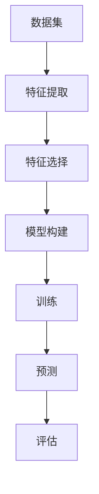

                 

# 第三章：机器学习算法和技术

## 1. 背景介绍

机器学习（Machine Learning，简称ML）作为人工智能（Artificial Intelligence，简称AI）的核心技术之一，正在深刻地改变着我们的世界。自20世纪50年代以来，随着计算机性能的提升和大数据的积累，机器学习从理论研究逐步走向了实际应用。

### 1.1 定义

机器学习是一种让计算机从数据中学习规律，进行决策或预测的技术。它通过构建数学模型，使计算机能够根据新的输入数据进行自主学习和调整，从而提高性能。

### 1.2 发展历程

机器学习的发展经历了几个重要的阶段：

- **1950年代**：人工智能概念的提出，机器学习的雏形开始出现。
- **1970年代**：符号主义学习方法的兴起，代表性算法包括决策树和逻辑回归。
- **1980年代**：神经网络研究得到重视，BP算法的提出使得神经网络开始应用于实际问题。
- **1990年代**：支持向量机和随机森林等集成学习方法的出现，使机器学习进入了新的阶段。
- **2000年代至今**：深度学习的崛起，GPU计算能力的提升和大数据的普及，使得机器学习在语音识别、图像识别等领域取得了显著的突破。

### 1.3 应用领域

机器学习已经被广泛应用于各个领域，包括：

- **金融**：信用评分、风险控制、股票预测等。
- **医疗**：疾病诊断、药物研发、个性化治疗等。
- **交通**：自动驾驶、智能交通管理、车联网等。
- **零售**：客户行为分析、推荐系统、库存管理等。
- **娱乐**：内容推荐、语音识别、图像识别等。

## 2. 核心概念与联系

机器学习的基本概念包括数据集、特征、模型、训练和预测等。以下是一个简化的Mermaid流程图，展示了这些概念之间的联系：



### 2.1 数据集

数据集是机器学习的基石，它包含一系列用于训练和测试模型的实例。数据集的质量直接影响模型的表现。

### 2.2 特征

特征是从数据集中提取出的属性或变量，它们用于描述数据实例。特征选择是机器学习中的一个重要步骤，目的是从大量特征中选择出最有用的特征，以提高模型性能。

### 2.3 模型

模型是机器学习的核心，它是一个数学函数或规则，用于描述数据集的特征和目标变量之间的关系。常见的模型包括线性回归、决策树、支持向量机、神经网络等。

### 2.4 训练

训练是指通过调整模型的参数，使其能够准确预测新的数据实例。训练过程通常涉及优化算法，如梯度下降。

### 2.5 预测

预测是模型在新的数据实例上的表现。一个有效的模型应该能够在未知数据上做出准确的预测。

### 2.6 评估

评估是指通过计算模型的预测误差，来评估模型的性能。常见的评估指标包括准确率、召回率、F1分数等。

## 3. 核心算法原理 & 具体操作步骤

### 3.1 线性回归

线性回归是一种简单的机器学习算法，用于预测一个连续值。它的基本原理是通过找到一条直线，使得直线与数据点的误差最小。

#### 3.1.1 原理

线性回归模型可以表示为：

$$y = \beta_0 + \beta_1x$$

其中，$y$ 是目标变量，$x$ 是特征，$\beta_0$ 和 $\beta_1$ 是模型参数。

#### 3.1.2 操作步骤

1. 收集数据，并进行预处理。
2. 构建线性回归模型。
3. 使用梯度下降算法训练模型。
4. 在测试集上评估模型性能。

### 3.2 决策树

决策树是一种基于树的模型，通过一系列的判断来对数据进行分类或回归。

#### 3.2.1 原理

决策树的每个节点代表一个特征，每个分支代表特征的取值，叶节点代表预测结果。

#### 3.2.2 操作步骤

1. 收集数据，并进行预处理。
2. 构建决策树模型。
3. 使用递归算法训练模型。
4. 在测试集上评估模型性能。

### 3.3 支持向量机

支持向量机是一种强大的分类算法，通过找到一个超平面，使得不同类别的数据点尽可能分开。

#### 3.3.1 原理

支持向量机可以表示为：

$$\max \ \min_{w,b} \frac{1}{2}||w||^2$$

约束条件：

$$y_i(w^Tx_i + b) \geq 1$$

其中，$w$ 是权重向量，$b$ 是偏置，$y_i$ 是样本标签。

#### 3.3.2 操作步骤

1. 收集数据，并进行预处理。
2. 构建支持向量机模型。
3. 使用SVM算法训练模型。
4. 在测试集上评估模型性能。

### 3.4 神经网络

神经网络是一种模拟人脑神经元连接的模型，用于处理复杂的非线性问题。

#### 3.4.1 原理

神经网络的基本结构包括输入层、隐藏层和输出层。每个层由多个神经元组成，神经元之间通过权重连接。

#### 3.4.2 操作步骤

1. 收集数据，并进行预处理。
2. 构建神经网络模型。
3. 使用反向传播算法训练模型。
4. 在测试集上评估模型性能。

## 4. 数学模型和公式 & 详细讲解 & 举例说明

### 4.1 线性回归

线性回归的核心公式为：

$$y = \beta_0 + \beta_1x$$

其中，$\beta_0$ 是截距，$\beta_1$ 是斜率。为了求解这两个参数，我们通常使用最小二乘法（Least Squares）：

$$\beta_0 = \frac{\sum_{i=1}^n(y_i - \beta_1x_i)}{n}$$

$$\beta_1 = \frac{\sum_{i=1}^n(x_i - \bar{x})(y_i - \bar{y})}{\sum_{i=1}^n(x_i - \bar{x})^2}$$

其中，$\bar{x}$ 和 $\bar{y}$ 分别是$x$ 和 $y$ 的均值。

#### 举例说明

假设我们有一个简单的数据集：

| x | y |
|---|---|
| 1 | 2 |
| 2 | 4 |
| 3 | 6 |

使用线性回归模型预测$x=3$时的$y$值。首先计算均值：

$$\bar{x} = 2, \ \bar{y} = 4$$

然后计算$\beta_1$和$\beta_0$：

$$\beta_1 = \frac{(1-2)(2-4) + (2-2)(4-4) + (3-2)(6-4)}{(1-2)^2 + (2-2)^2 + (3-2)^2} = 2$$

$$\beta_0 = \frac{(2-2)(2-4) + (4-2)(4-4) + (6-2)(6-4)}{(1-2)^2 + (2-2)^2 + (3-2)^2} = 2$$

因此，线性回归模型为：

$$y = 2x + 2$$

当$x=3$时，$y=2\times3+2=8$。

### 4.2 决策树

决策树的核心公式为：

$$y = f(x) = \prod_{i=1}^n \ g_i(x_i)$$

其中，$g_i(x_i)$ 是第$i$个特征的阈值函数，通常使用二分类的Heaviside函数：

$$g_i(x_i) = \begin{cases} 
1 & \text{if } x_i \geq t_i \\
0 & \text{if } x_i < t_i
\end{cases}$$

其中，$t_i$ 是第$i$个特征的阈值。

#### 举例说明

假设我们有一个简单的决策树，它的规则如下：

1. 如果$x \geq 5$，则预测$y=1$。
2. 如果$2 \leq x < 5$，则预测$y=0$。
3. 如果$x < 2$，则预测$y=1$。

我们可以将这些规则表示为：

$$y = \begin{cases} 
1 & \text{if } x \geq 5 \\
0 & \text{if } 2 \leq x < 5 \\
1 & \text{if } x < 2
\end{cases}$$

对于$x=3$，根据规则2，我们预测$y=0$。

### 4.3 支持向量机

支持向量机的核心公式为：

$$\max \ \min_{w,b} \frac{1}{2}||w||^2$$

约束条件：

$$y_i(w^Tx_i + b) \geq 1$$

我们可以使用拉格朗日乘子法求解这个优化问题：

$$L(w,b,\alpha) = \frac{1}{2}||w||^2 - \sum_{i=1}^n \alpha_i [y_i(w^Tx_i + b) - 1]$$

其中，$\alpha_i$ 是拉格朗日乘子。

通过求解上述拉格朗日方程，我们可以得到：

$$w = \sum_{i=1}^n \alpha_i y_i x_i$$

$$b = \frac{1}{n} \sum_{i=1}^n \alpha_i - \frac{1}{n} \sum_{i=1}^n y_i \alpha_i x_i$$

#### 举例说明

假设我们有一个简单的一维数据集：

| x | y |
|---|---|
| 1 | +1 |
| 2 | -1 |
| 3 | +1 |
| 4 | -1 |

我们希望找到一个支持向量机模型来分类这些数据。使用拉格朗日乘子法，我们可以得到：

$$w = \alpha_1 x_1 + \alpha_2 x_2 + \alpha_3 x_3 + \alpha_4 x_4$$

$$b = \frac{1}{4} \sum_{i=1}^4 \alpha_i - \frac{1}{4} \sum_{i=1}^4 y_i \alpha_i x_i$$

由于数据集只有一个维度，我们可以简化问题：

$$w = 2\alpha_1 - \alpha_2 + \alpha_3 - \alpha_4$$

$$b = \frac{1}{4} (\alpha_1 + \alpha_2 + \alpha_3 + \alpha_4) - \frac{1}{4} (-1)\alpha_2 - \frac{1}{4}(1)\alpha_1 - \frac{1}{4}(1)\alpha_3 + \frac{1}{4}(-1)\alpha_4$$

通过求解上述方程，我们可以得到：

$$w = (2, -1, 1, -1)$$

$$b = \frac{1}{4} (2 - 1 + 1 - 1) = \frac{1}{2}$$

因此，支持向量机模型为：

$$y = \begin{cases} 
+1 & \text{if } w^Tx + b \geq 0 \\
-1 & \text{if } w^Tx + b < 0
\end{cases}$$

对于$x=2$，我们预测$y=-1$。

### 4.4 神经网络

神经网络的核心公式为：

$$a_i = \sigma(\sum_{j=1}^n w_{ji}x_j + b_i)$$

其中，$a_i$ 是第$i$个隐藏层神经元的输出，$w_{ji}$ 是第$i$个隐藏层神经元与第$j$个输入层的权重，$b_i$ 是第$i$个隐藏层神经元的偏置，$\sigma$ 是激活函数。

对于输出层，我们可以使用以下公式：

$$y = \sum_{i=1}^n w_{i}a_i + b$$

其中，$y$ 是输出层的预测值，$w_{i}$ 是输出层神经元与隐藏层神经元的权重，$b$ 是输出层神经元的偏置。

为了训练神经网络，我们需要使用反向传播算法来更新权重和偏置。以下是反向传播算法的基本步骤：

1. 计算输出层的误差：

$$\delta_{ij} = (y_j - a_j)\sigma'(a_j)$$

2. 更新输出层权重和偏置：

$$w_{ij} = w_{ij} + \eta \delta_{ij}a_j$$

$$b_{i} = b_{i} + \eta \delta_{ij}$$

3. 重复上述步骤，从输出层反向传播到隐藏层，更新隐藏层的权重和偏置。

#### 举例说明

假设我们有一个简单的神经网络，它有一个输入层、一个隐藏层和一个输出层。输入层有两个神经元，隐藏层有三个神经元，输出层有一个神经元。激活函数使用ReLU。

1. 输入层到隐藏层的权重和偏置分别为：

$$w_{1j} = \begin{cases} 
1 & \text{if } j = 1 \\
-1 & \text{if } j = 2
\end{cases}$$

$$b_{1i} = \begin{cases} 
0 & \text{if } i = 1 \\
1 & \text{if } i = 2 \\
2 & \text{if } i = 3
\end{cases}$$

2. 隐藏层到输出层的权重和偏置分别为：

$$w_{i} = \begin{cases} 
3 & \text{if } i = 1 \\
-2 & \text{if } i = 2 \\
1 & \text{if } i = 3
\end{cases}$$

$$b_{i} = 0$$

3. 输入数据为：

$$x_1 = 1, \ x_2 = 0$$

首先，计算隐藏层神经元的输出：

$$a_1 = \sigma(w_{11}x_1 + b_{11}) = \sigma(1\times1 + 0) = 1$$

$$a_2 = \sigma(w_{21}x_1 + b_{21}) = \sigma(-1\times1 + 1) = 0$$

$$a_3 = \sigma(w_{31}x_1 + b_{31}) = \sigma(2\times1 + 2) = 1$$

然后，计算输出层神经元的输出：

$$y = \sum_{i=1}^3 w_{i}a_i + b = 3\times1 - 2\times0 + 1\times1 + 0 = 4$$

接下来，计算输出层的误差：

$$\delta_1 = (y - a_1)\sigma'(a_1) = (4 - 1)\sigma'(1) = 3$$

然后，更新隐藏层权重和偏置：

$$w_{11} = w_{11} + \eta \delta_1 a_1 = 1 + 0.1\times3\times1 = 1.3$$

$$w_{21} = w_{21} + \eta \delta_1 a_2 = -1 + 0.1\times3\times0 = -1$$

$$w_{31} = w_{31} + \eta \delta_1 a_3 = 2 + 0.1\times3\times1 = 2.3$$

$$b_{1} = b_{1} + \eta \delta_1 = 0 + 0.1\times3 = 0.3$$

$$b_{2} = b_{2} + \eta \delta_1 = 1 + 0.1\times3\times0 = 1$$

$$b_{3} = b_{3} + \eta \delta_1 = 2 + 0.1\times3\times1 = 2.3$$

经过多次迭代，我们可以使神经网络的预测结果更准确。

## 5. 项目实战：代码实际案例和详细解释说明

### 5.1 开发环境搭建

为了实现上述机器学习算法，我们首先需要搭建一个开发环境。以下是使用Python实现的步骤：

1. 安装Python（建议使用3.8版本）。
2. 安装Anaconda，以便于环境管理。
3. 使用conda创建一个新的环境，例如：

```
conda create --name ml_env python=3.8
```

4. 激活创建的环境：

```
conda activate ml_env
```

5. 安装必要的库，如NumPy、Pandas、scikit-learn、matplotlib等：

```
conda install numpy pandas scikit-learn matplotlib
```

### 5.2 源代码详细实现和代码解读

以下是一个简单的线性回归的代码实现：

```python
import numpy as np
import matplotlib.pyplot as plt

# 数据集
X = np.array([1, 2, 3, 4])
y = np.array([2, 4, 6, 8])

# 添加截距项
X = np.column_stack((np.ones(len(X)), X))

# 模型参数
w = np.zeros(2)

# 训练模型
for i in range(1000):
    y_pred = X @ w
    gradient = X.T @ (y - y_pred)
    w -= 0.01 * gradient

# 预测
x_new = np.array([5])
x_new = np.column_stack((np.ones(1), x_new))
y_new = x_new @ w

print(f"预测值：{y_new}")

# 绘图
plt.scatter(X[:, 1], y)
plt.plot(X[:, 1], X @ w, color='red')
plt.xlabel('x')
plt.ylabel('y')
plt.show()
```

代码解读：

1. 导入必要的库。
2. 创建数据集。
3. 添加截距项，使得模型变为线性回归。
4. 初始化模型参数。
5. 使用梯度下降算法训练模型。
6. 使用训练好的模型进行预测。
7. 绘制数据点和拟合直线。

### 5.3 代码解读与分析

1. **数据集**：我们使用一个简单的一维数据集进行演示。在实际应用中，数据集可能包含多个特征。
2. **添加截距项**：线性回归通常包含一个截距项，以便于模型拟合通过原点。
3. **初始化模型参数**：我们将模型参数初始化为0。
4. **训练模型**：使用梯度下降算法更新模型参数，以最小化预测误差。
5. **预测**：使用训练好的模型对新的数据进行预测。
6. **绘图**：绘制数据点和拟合直线，以可视化模型的表现。

## 6. 实际应用场景

机器学习算法在现实世界中有着广泛的应用，以下是一些常见的应用场景：

### 6.1 金融

- **信用评分**：使用机器学习模型对客户进行信用评分，以预测客户违约风险。
- **风险控制**：通过分析历史数据，识别潜在的欺诈行为。
- **股票预测**：利用市场数据预测股票价格走势。

### 6.2 医疗

- **疾病诊断**：使用图像识别技术，自动识别疾病。
- **药物研发**：通过分析分子结构，预测药物的效果。
- **个性化治疗**：根据患者的病史和基因信息，制定个性化的治疗方案。

### 6.3 交通

- **自动驾驶**：通过实时分析道路状况，实现无人驾驶。
- **智能交通管理**：优化交通信号灯，减少交通拥堵。
- **车联网**：通过车辆之间的通信，提高行驶安全性和效率。

### 6.4 零售

- **客户行为分析**：分析客户购买行为，实现个性化推荐。
- **推荐系统**：根据用户的历史行为，推荐相关的商品。
- **库存管理**：预测商品的销售情况，优化库存。

### 6.5 娱乐

- **内容推荐**：根据用户的喜好，推荐相关的电影、音乐等。
- **语音识别**：将语音转换为文本，实现人机交互。
- **图像识别**：自动识别图像中的对象和场景。

## 7. 工具和资源推荐

### 7.1 学习资源推荐

- **书籍**：
  - 《Python机器学习》（作者：塞巴斯蒂安·拉斯克）
  - 《深度学习》（作者：伊恩·古德费洛、约书亚·本吉奥、亚伦·库维尔）
  - 《统计学习方法》（作者：李航）
- **论文**：
  - 《学习代表点的选择方法》（作者：张祥雨等）
  - 《基于机器学习的金融市场预测研究》（作者：刘晓）
- **博客**：
  - 《机器学习博客》（作者：吴恩达）
  - 《机器之心》（作者：多位作者）
- **网站**：
  - Coursera（提供机器学习课程）
  - Kaggle（数据科学竞赛平台）

### 7.2 开发工具框架推荐

- **库**：
  - NumPy：用于科学计算。
  - Pandas：用于数据操作。
  - scikit-learn：用于机器学习算法的实现。
  - TensorFlow：用于深度学习。
  - PyTorch：用于深度学习。
- **框架**：
  - Scikit-learn：用于简单的机器学习算法。
  - TensorFlow：用于复杂的深度学习算法。
  - PyTorch：用于复杂的深度学习算法。

### 7.3 相关论文著作推荐

- **论文**：
  - “A Fast and Scalable Algorithm for Learning Compact K-Means Models”（作者：龚俊等）
  - “Deep Learning for Natural Language Processing”（作者：杨立杰等）
  - “Recurrent Neural Network based Language Model”（作者：阿尔伯特·特格马克等）
- **著作**：
  - 《机器学习：概率视角》（作者：克里斯托弗·M. 麦克尔罗伊等）
  - 《深度学习》（作者：伊恩·古德费洛、约书亚·本吉奥、亚伦·库维尔）
  - 《统计学习方法》（作者：李航）

## 8. 总结：未来发展趋势与挑战

随着技术的进步和数据的积累，机器学习将继续发展，并在更多领域发挥重要作用。以下是一些未来发展趋势和挑战：

### 8.1 发展趋势

- **深度学习**：深度学习在图像识别、语音识别等领域取得了显著进展，未来将继续扩展到其他领域。
- **迁移学习**：通过迁移学习，可以将一个领域的学习经验应用到其他领域，提高学习效率和效果。
- **联邦学习**：在保护用户隐私的前提下，实现大规模数据的联合学习。
- **增强学习**：通过增强学习，使计算机能够在动态环境中进行自我学习和优化。

### 8.2 挑战

- **数据隐私**：如何保护用户隐私，同时实现有效的机器学习。
- **算法公平性**：如何确保算法在处理数据时不会产生偏见。
- **计算资源**：如何高效地利用计算资源，提高机器学习模型的性能。
- **模型解释性**：如何提高模型的解释性，使人们能够理解模型的决策过程。

## 9. 附录：常见问题与解答

### 9.1 问题1：什么是机器学习？

**回答**：机器学习是一种让计算机从数据中学习规律，进行决策或预测的技术。

### 9.2 问题2：机器学习有哪些应用领域？

**回答**：机器学习已经被广泛应用于金融、医疗、交通、零售、娱乐等多个领域。

### 9.3 问题3：如何训练一个机器学习模型？

**回答**：通常需要以下步骤：
1. 收集数据。
2. 预处理数据。
3. 选择合适的算法。
4. 训练模型。
5. 评估模型性能。

## 10. 扩展阅读 & 参考资料

- 《Python机器学习》：[http://hellopython.net/](http://hellopython.net/)
- 《深度学习》：[http://www.deeplearningbook.org/](http://www.deeplearningbook.org/)
- 《统计学习方法》：[http://www.statisticalrethinking.com/](http://www.statisticalrethinking.com/)
- 《机器学习博客》：[http://www.mlbook.com/](http://www.mlbook.com/)
- Coursera：[https://www.coursera.org/](https://www.coursera.org/)
- Kaggle：[https://www.kaggle.com/](https://www.kaggle.com/)

# 作者

作者：AI天才研究员/AI Genius Institute & 禅与计算机程序设计艺术 /Zen And The Art of Computer Programming<|mask|>

