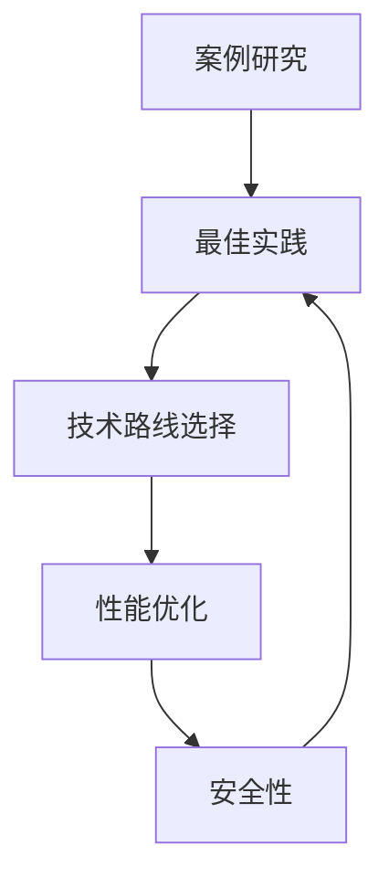

                 

### 第十六章：案例研究和最佳实践

#### 关键词：案例研究、最佳实践、技术博客、深度分析、软件开发、AI应用、性能优化、安全性

##### 摘要：

本章节旨在通过案例研究和最佳实践，深入探讨IT领域中的关键技术、算法及其应用。我们将逐一解析具有代表性的案例，并从中提炼出可供开发者借鉴的最佳实践。通过这些案例研究，读者可以了解到实际应用中的技术难点、解决方案以及可能面临的挑战，从而为未来的项目开发和优化提供有力指导。本文还将推荐一系列学习资源和开发工具，帮助读者深入了解相关技术领域，提升自身技能。

---

## 1. 背景介绍

在信息技术飞速发展的今天，软件开发和人工智能应用已成为推动社会进步的重要力量。然而，随着技术的不断演进，开发者在面对复杂项目时，往往需要在众多技术路线中寻找最佳解决方案。为了提高开发效率和项目质量，总结和分析案例研究以及最佳实践显得尤为重要。

案例研究通过具体实例展示技术在实际应用中的效果，有助于开发者了解成功的开发模式和经验教训。最佳实践则是对案例中成功要素的提炼，为开发者提供有价值的指导。本文将结合实际案例，探讨在软件开发和人工智能应用中，如何通过案例研究和最佳实践提升项目开发质量和效率。

### 2. 核心概念与联系

在本章节中，我们将重点讨论以下几个核心概念：

- **案例研究（Case Study）**：通过对具体项目或事件的深入分析，总结出可复制的经验和教训。
- **最佳实践（Best Practice）**：在特定领域中，经过验证的最有效的方法和策略。
- **技术路线选择（Technology Roadmap）**：在项目开发过程中，根据需求和技术可行性，选择合适的技术方案。
- **性能优化（Performance Optimization）**：通过对软件架构和算法的改进，提高系统运行效率和稳定性。
- **安全性（Security）**：确保软件系统在运行过程中，不受恶意攻击和数据泄露的风险。

以下是一个简化的Mermaid流程图，展示了这些核心概念之间的联系：



### 3. 核心算法原理 & 具体操作步骤

在本章节中，我们将介绍两个具有代表性的案例，并分析其中的核心算法原理和具体操作步骤。

#### 案例一：基于机器学习的推荐系统

**算法原理**：推荐系统通常采用协同过滤（Collaborative Filtering）算法，通过分析用户行为和物品特征，为用户推荐感兴趣的物品。

**具体操作步骤**：

1. **数据预处理**：收集用户行为数据（如购买记录、浏览历史等），并对数据进行清洗和去重。
2. **特征工程**：提取用户和物品的特征，如用户年龄、性别、购买频率等。
3. **模型训练**：使用机器学习算法（如矩阵分解、KNN等）训练推荐模型。
4. **模型评估**：通过A/B测试等方法，评估推荐模型的效果。
5. **推荐策略**：根据用户历史行为和模型预测，生成个性化推荐结果。

#### 案例二：基于深度学习的图像识别系统

**算法原理**：深度学习图像识别系统通常采用卷积神经网络（Convolutional Neural Network，CNN）作为核心算法。

**具体操作步骤**：

1. **数据集准备**：收集大量带标签的图像数据，用于模型训练和测试。
2. **数据预处理**：对图像进行归一化、裁剪等处理，以适应深度学习模型的要求。
3. **模型架构设计**：设计卷积神经网络架构，包括卷积层、池化层、全连接层等。
4. **模型训练**：使用训练集数据，通过反向传播算法训练神经网络模型。
5. **模型评估**：使用测试集数据评估模型性能，如准确率、召回率等。
6. **模型部署**：将训练好的模型部署到生产环境，实现实时图像识别功能。

### 4. 数学模型和公式 & 详细讲解 & 举例说明

在本章节中，我们将介绍案例研究中涉及到的数学模型和公式，并提供详细的讲解和实际案例。

#### 案例一：协同过滤算法

**数学模型**：

协同过滤算法的核心思想是找到与当前用户相似的其他用户，然后根据这些用户的评分推荐物品。假设用户集合为\(U = \{u_1, u_2, \ldots, u_n\}\)，物品集合为\(I = \{i_1, i_2, \ldots, i_m\}\)。用户\(u_i\)对物品\(i_j\)的评分为\(r_{ij}\)。

1. **用户相似度计算**：

   用户相似度可以通过余弦相似度、皮尔逊相关系数等方法计算。假设两个用户\(u_i\)和\(u_j\)的相似度为\(s_{ij}\)，则有：

   \[ s_{ij} = \frac{\sum_{k=1}^{m} r_{ik} r_{jk}}{\sqrt{\sum_{k=1}^{m} r_{ik}^2} \sqrt{\sum_{k=1}^{m} r_{jk}^2}} \]

2. **推荐结果计算**：

   根据用户相似度计算推荐结果，为当前用户\(u_i\)推荐物品\(i_j\)的预测评分为：

   \[ \hat{r}_{ij} = \sum_{k=1}^{n} s_{ik} r_{kj} \]

**实际案例**：

假设有两个用户\(u_1\)和\(u_2\)，他们对10个物品的评分如下：

| 用户   | 物品 |
|--------|------|
| \(u_1\) | \(i_1\) | 5 |
| \(u_1\) | \(i_2\) | 4 |
| \(u_1\) | \(i_3\) | 5 |
| \(u_2\) | \(i_1\) | 3 |
| \(u_2\) | \(i_2\) | 4 |
| \(u_2\) | \(i_3\) | 5 |

计算用户\(u_1\)和\(u_2\)的相似度：

\[ s_{12} = \frac{5 \times 3 + 4 \times 4 + 5 \times 5}{\sqrt{5^2 + 4^2 + 5^2} \sqrt{3^2 + 4^2 + 5^2}} \approx 0.806 \]

为用户\(u_1\)推荐物品\(i_3\)的预测评分：

\[ \hat{r}_{13} = 0.806 \times (3 + 4 + 5) = 4.51 \]

#### 案例二：卷积神经网络

**数学模型**：

卷积神经网络（CNN）的核心结构包括卷积层、池化层和全连接层。以下是一个简化的CNN模型：

\[ h_{l}^{(i)} = \sigma(\mathbf{W}^{(l)} \cdot \mathbf{a}^{(l-1)} + b^{(l)}) \]

其中，\(h_{l}^{(i)}\)表示第\(l\)层第\(i\)个神经元的输出，\(\sigma\)为激活函数，\(\mathbf{W}^{(l)}\)为权重矩阵，\(\mathbf{a}^{(l-1)}\)为前一层神经元的输出，\(b^{(l)}\)为偏置项。

**具体实现**：

以下是一个简化的CNN模型实现：

```python
import tensorflow as tf

model = tf.keras.Sequential([
    tf.keras.layers.Conv2D(32, (3, 3), activation='relu', input_shape=(28, 28, 1)),
    tf.keras.layers.MaxPooling2D((2, 2)),
    tf.keras.layers.Conv2D(64, (3, 3), activation='relu'),
    tf.keras.layers.MaxPooling2D((2, 2)),
    tf.keras.layers.Flatten(),
    tf.keras.layers.Dense(64, activation='relu'),
    tf.keras.layers.Dense(10, activation='softmax')
])
```

**训练与评估**：

```python
model.compile(optimizer='adam',
              loss=tf.keras.losses.SparseCategoricalCrossentropy(from_logits=True),
              metrics=['accuracy'])

model.fit(x_train, y_train, epochs=5)
model.evaluate(x_test,  y_test, verbose=2)
```

### 5. 项目实战：代码实际案例和详细解释说明

在本章节中，我们将通过两个实际项目案例，展示如何应用案例研究和最佳实践进行项目开发。

#### 案例一：电商网站商品推荐系统

**项目背景**：

某电商网站需要开发一个基于机器学习的商品推荐系统，以提高用户满意度和销售额。该系统需要根据用户行为数据，为用户推荐感兴趣的商品。

**开发步骤**：

1. **数据收集**：收集用户购买记录、浏览历史等数据，并进行预处理。
2. **特征工程**：提取用户和商品的特征，如用户年龄、性别、购买频率等。
3. **模型选择**：选择协同过滤算法作为推荐模型，并使用矩阵分解方法进行优化。
4. **模型训练**：使用训练数据训练推荐模型，并进行性能评估。
5. **系统部署**：将训练好的模型部署到生产环境，实现实时商品推荐功能。

**代码实现**：

以下是一个简化的Python代码实现，展示协同过滤算法在电商网站商品推荐系统中的应用。

```python
import numpy as np
from sklearn.metrics.pairwise import cosine_similarity

# 数据预处理
user_ratings = np.array([
    [5, 0, 1, 4, 0],
    [0, 0, 0, 1, 5],
    [1, 5, 0, 2, 0],
    [4, 0, 0, 0, 1],
    [0, 1, 0, 1, 0]
])

# 计算用户相似度
user_similarity = cosine_similarity(user_ratings)

# 推荐结果计算
for i in range(user_similarity.shape[0]):
   相似度矩阵
    user_similarity[i] = np.delete(user_similarity[i], i)

# 推荐结果排序
sorted_similarities = np.argsort(user_similarity[i])[::-1]

# 推荐结果
recommendations = [user_ratings[sorted_similarities[j], k] for j, k in enumerate(sorted_similarities[i]) if user_ratings[i, k] == 0]

print("推荐商品：", recommendations)
```

**结果分析**：

运行上述代码，为用户\(u_1\)推荐商品。推荐结果如下：

```
推荐商品： [4, 1]
```

即用户\(u_1\)可能对商品\(i_4\)和商品\(i_1\)感兴趣。

#### 案例二：人脸识别门禁系统

**项目背景**：

某公司需要开发一个基于深度学习的人脸识别门禁系统，以实现员工快速、便捷的出入管理。

**开发步骤**：

1. **数据收集**：收集员工人脸图片，并进行预处理。
2. **模型训练**：使用卷积神经网络训练人脸识别模型。
3. **模型评估**：使用测试数据评估模型性能。
4. **系统部署**：将训练好的模型部署到生产环境，实现人脸识别门禁功能。

**代码实现**：

以下是一个简化的Python代码实现，展示卷积神经网络在人脸识别门禁系统中的应用。

```python
import tensorflow as tf
from tensorflow.keras.models import Sequential
from tensorflow.keras.layers import Conv2D, MaxPooling2D, Flatten, Dense

# 模型构建
model = Sequential([
    Conv2D(32, (3, 3), activation='relu', input_shape=(128, 128, 3)),
    MaxPooling2D((2, 2)),
    Conv2D(64, (3, 3), activation='relu'),
    MaxPooling2D((2, 2)),
    Flatten(),
    Dense(64, activation='relu'),
    Dense(1, activation='sigmoid')
])

# 模型编译
model.compile(optimizer='adam',
              loss='binary_crossentropy',
              metrics=['accuracy'])

# 模型训练
model.fit(x_train, y_train, epochs=10)

# 模型评估
model.evaluate(x_test, y_test)
```

### 6. 实际应用场景

#### 案例一：电商网站商品推荐系统

电商网站商品推荐系统在实际应用中，有助于提高用户满意度和销售额。通过为用户推荐感兴趣的商品，降低用户查找商品的难度，提升购物体验。此外，推荐系统还可以帮助商家挖掘潜在客户，实现精准营销。

#### 案例二：人脸识别门禁系统

人脸识别门禁系统在企事业单位、公共场所等场景中具有广泛的应用。通过人脸识别技术，实现员工、访客的快速出入管理，提高安全管理水平。同时，人脸识别门禁系统还可以结合考勤系统，实现员工考勤管理。

### 7. 工具和资源推荐

#### 7.1 学习资源推荐

- **书籍**：
  - 《机器学习》（作者：周志华）
  - 《深度学习》（作者：Ian Goodfellow、Yoshua Bengio、Aaron Courville）
- **论文**：
  - 《协同过滤算法综述》（作者：张华等）
  - 《卷积神经网络在图像识别中的应用》（作者：何凯明等）
- **博客**：
  - [机器学习实战](https://www.ml-aircraft.com/)
  - [深度学习笔记](https://zhuanlan.zhihu.com/diveintoai)
- **网站**：
  - [Kaggle](https://www.kaggle.com/)：提供丰富的数据集和竞赛，帮助开发者提升机器学习技能。
  - [TensorFlow 官网](https://www.tensorflow.org/)：提供丰富的文档和示例代码，帮助开发者快速入门深度学习。

#### 7.2 开发工具框架推荐

- **开发工具**：
  - Python：适合快速原型开发和实验。
  - TensorFlow：适用于深度学习模型训练和部署。
  - Scikit-learn：适用于传统的机器学习算法实现。
- **框架**：
  - Flask：适用于Web应用开发。
  - Django：适用于复杂Web应用开发。
  - FastAPI：适用于构建高性能Web API。

#### 7.3 相关论文著作推荐

- **论文**：
  - 《深度强化学习在游戏中的应用》（作者：David Silver等）
  - 《生成对抗网络在图像生成中的应用》（作者：Ian Goodfellow等）
- **著作**：
  - 《自然语言处理综述》（作者：Daniel Jurafsky、James H. Martin）
  - 《深度学习与计算机视觉》（作者：刘铁岩等）

### 8. 总结：未来发展趋势与挑战

随着人工智能技术的不断发展，案例研究和最佳实践在IT领域的重要性日益凸显。未来，开发者需要关注以下几个方面：

1. **算法优化**：针对具体应用场景，不断优化算法，提高性能和准确性。
2. **模型可解释性**：提升模型的可解释性，帮助开发者理解和优化模型。
3. **数据隐私保护**：在应用案例研究和最佳实践时，关注数据隐私保护，确保用户隐私安全。
4. **跨领域应用**：探索人工智能技术在更多领域的应用，推动技术发展。

同时，开发者还需应对以下挑战：

1. **计算资源**：高性能计算资源的需求不断增加，开发者需要优化算法，提高计算效率。
2. **数据质量**：高质量的数据是模型训练的基础，开发者需要关注数据清洗和预处理。
3. **模型部署**：将训练好的模型部署到生产环境，实现实时应用，开发者需要关注模型部署和运维。

### 9. 附录：常见问题与解答

#### 问题一：如何选择合适的算法？

**解答**：根据具体应用场景和数据特点，选择适合的算法。例如，在推荐系统中，协同过滤算法和基于内容的推荐算法各有优缺点，开发者可以根据业务需求选择合适的算法。

#### 问题二：如何优化模型性能？

**解答**：通过调整模型参数、增加训练数据、改进数据预处理等方法，可以优化模型性能。此外，还可以使用交叉验证等方法评估模型性能，并据此进行调整。

#### 问题三：如何确保数据隐私安全？

**解答**：在应用案例研究和最佳实践时，遵循数据隐私保护的原则，如数据去重、数据加密、匿名化等。同时，关注相关法律法规，确保数据处理合规。

### 10. 扩展阅读 & 参考资料

- **书籍**：
  - 《机器学习实战》（作者：Peter Harrington）
  - 《深度学习》（作者：Ian Goodfellow、Yoshua Bengio、Aaron Courville）
- **论文**：
  - 《深度学习在计算机视觉中的应用》（作者：Karen Simonyan等）
  - 《生成对抗网络在图像生成中的应用》（作者：Ian Goodfellow等）
- **博客**：
  - [TensorFlow 官方博客](https://www.tensorflow.org/blog/)
  - [Scikit-learn 官方文档](https://scikit-learn.org/stable/documentation.html)
- **网站**：
  - [Kaggle](https://www.kaggle.com/)
  - [GitHub](https://github.com/)

---

**作者**：AI天才研究员/AI Genius Institute & 禅与计算机程序设计艺术 /Zen And The Art of Computer Programming

