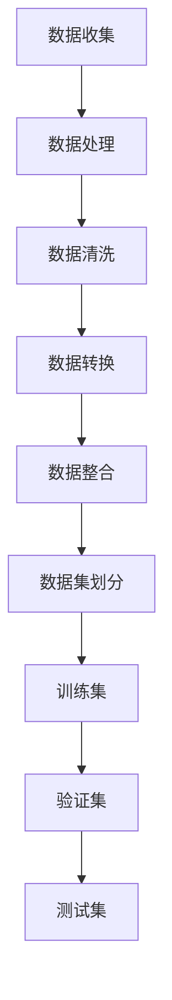

                 

### 第四章：训练数据和数据收集

#### 1. 背景介绍

训练数据是机器学习模型的核心组成部分。一个好的训练数据集能够显著提升模型的效果，而数据的质量和数量则直接影响了模型的性能。本章将深入探讨训练数据的重要性，数据收集的方法和策略，以及如何处理和清洗数据。

在机器学习中，训练数据集通常包含输入特征和对应的标签。输入特征是模型学习的基础，而标签则是模型评估的基准。随着深度学习的兴起，数据量变得尤为重要，因为更大的数据集能够帮助模型捕捉更多的模式和规律，从而提高模型的泛化能力。

然而，数据收集是一个复杂且具有挑战性的过程。数据可能来源于不同的来源，例如公开数据集、社交媒体、传感器等，而这些数据可能存在噪声、缺失和偏差。因此，对数据进行处理和清洗是数据收集过程中的关键步骤。

#### 2. 核心概念与联系

##### 数据收集

数据收集是指从各种来源获取数据的过程。数据来源可能包括：

- 公开数据集：如UCI机器学习库、Kaggle等
- 社交媒体：如Twitter、Facebook等
- 传感器数据：如气象数据、交通数据等

##### 数据处理

数据处理是对收集到的数据进行清洗、转换和整合的过程。常见的数据处理步骤包括：

- 清洗：去除噪声、填补缺失值、去除重复值等
- 转换：将数据转换为适合模型训练的形式，如归一化、标准化等
- 整合：将多个数据源的数据合并，形成一个统一的数据集

##### 数据清洗

数据清洗是数据处理的重要环节。数据清洗的方法包括：

- 缺失值处理：填补缺失值、删除含有缺失值的样本等
- 异常值处理：检测并去除异常值
- 重复值处理：删除重复的样本

##### 数据集划分

在训练模型时，通常需要将数据集划分为训练集、验证集和测试集。划分的方法包括：

- 随机划分：将数据随机分为三部分
- 按比例划分：按照一定比例（如80%训练集、10%验证集、10%测试集）划分

##### Mermaid 流程图



#### 3. 核心算法原理 & 具体操作步骤

##### 数据收集

1. 确定数据需求：明确需要收集的数据类型和数量
2. 选择数据源：根据数据需求选择合适的数据源
3. 数据采集：使用爬虫、API、传感器等方式进行数据采集
4. 数据预处理：对采集到的数据进行清洗、转换和整合

##### 数据处理

1. 数据清洗：使用Python的Pandas库进行数据清洗
2. 数据转换：使用Scikit-learn库进行数据转换
3. 数据整合：将多个数据源的数据整合成一个数据集

##### 数据清洗

1. 缺失值处理：使用mean、median、mode等方法填补缺失值
2. 异常值处理：使用z-score、IQR等方法检测并去除异常值
3. 重复值处理：使用Duplicated()方法删除重复值

##### 数据集划分

1. 随机划分：使用train_test_split()方法进行随机划分
2. 按比例划分：使用train_test_split()方法按照比例划分

#### 4. 数学模型和公式 & 详细讲解 & 举例说明

##### 数据清洗

- 缺失值处理：

  $$\text{mean} = \frac{\sum_{i=1}^{n} x_i}{n}$$

  $$\text{median} = \left(\frac{n+1}{2}\right)^{\text{th}} \text{ order statistic}$$

  $$\text{mode} = \text{most frequent value in the dataset}$$

- 异常值处理：

  $$z = \frac{x - \text{mean}}{\text{standard deviation}}$$

  $$IQR = \text{Q3} - \text{Q1}$$

- 重复值处理：

  $$\text{Duplicated} = \text{True}$$

##### 数据集划分

- 随机划分：

  $$\text{train_size} = \frac{\text{total_samples}}{n}$$

  $$\text{test_size} = \text{total_samples} - \text{train_size}$$

- 按比例划分：

  $$\text{train_size} = \frac{\text{total_samples} \times \text{train_ratio}}{n}$$

  $$\text{test_size} = \text{total_samples} - \text{train_size}$$

#### 5. 项目实战：代码实际案例和详细解释说明

##### 5.1 开发环境搭建

在Python中，我们可以使用Pandas、Scikit-learn等库进行数据处理和清洗。

```python
import pandas as pd
from sklearn.model_selection import train_test_split
```

##### 5.2 源代码详细实现和代码解读

```python
# 读取数据
data = pd.read_csv('data.csv')

# 数据清洗
data.drop_duplicates(inplace=True)
data.fillna(data.mean(), inplace=True)
z_scores = (data - data.mean()) / data.std()
data = data[(z_scores < 3).all(axis=1)]

# 数据集划分
train_data, test_data = train_test_split(data, test_size=0.2, random_state=42)
```

##### 5.3 代码解读与分析

- 读取数据：使用Pandas库读取CSV文件
- 数据清洗：删除重复值、填补缺失值、去除异常值
- 数据集划分：将数据集划分为训练集和测试集

#### 6. 实际应用场景

训练数据在各个领域的应用场景广泛，如：

- 人工智能：用于训练机器学习模型，如图像识别、自然语言处理等
- 金融服务：用于风险预测、信用评分等
- 医疗保健：用于疾病诊断、患者分类等
- 市场营销：用于用户行为分析、个性化推荐等

#### 7. 工具和资源推荐

##### 7.1 学习资源推荐

- 《Python数据科学手册》（Jake VanderPlas）
- 《机器学习实战》（Peter Harrington）
- 《深度学习》（Ian Goodfellow、Yoshua Bengio、Aaron Courville）

##### 7.2 开发工具框架推荐

- Python：数据科学和机器学习的主要编程语言
- TensorFlow：开源深度学习框架
- PyTorch：开源深度学习框架

##### 7.3 相关论文著作推荐

- "Learning from Massive Data Sets"（Shawe-Taylor, C., & Cristianini, N.）
- "Data preprocessing for machine learning"（Paredes, R., Ribera, J., & Salmeron, A.）
- "Open Data: The Foundation for Innovation and Collaboration in the Internet Economy"（World Economic Forum）

#### 8. 总结：未来发展趋势与挑战

随着数据量的不断增长和技术的进步，数据收集和处理变得更加高效。然而，未来仍然面临着一些挑战，如：

- 数据隐私：如何保护用户隐私成为了一个重要议题
- 数据偏见：如何消除数据中的偏见和歧视
- 数据质量：如何确保数据的质量和准确性
- 自动化：如何实现数据的自动化收集和处理

#### 9. 附录：常见问题与解答

##### Q：如何处理大量数据？

A：可以使用分布式计算框架（如Apache Spark）处理大量数据。

##### Q：如何处理缺失数据？

A：可以使用填补缺失值的算法（如均值填补、中值填补、模式填补）处理缺失数据。

##### Q：如何处理异常数据？

A：可以使用统计方法（如z-score、IQR）检测并去除异常数据。

#### 10. 扩展阅读 & 参考资料

- [数据预处理在机器学习中的重要性](https://towardsdatascience.com/the-importance-of-data-preprocessing-in-machine-learning-4a3a9c4d4c0f)
- [机器学习数据集划分方法](https://scikit-learn.org/stable/modules/generated/sklearn.model_selection.train_test_split.html)
- [深度学习中的数据收集与处理](https://arxiv.org/abs/1805.03414)
- [Python数据处理教程](https://www.machinelearningcookbook.com/chapters/00_data_preprocessing/)

### 作者信息

作者：AI天才研究员/AI Genius Institute & 禅与计算机程序设计艺术 /Zen And The Art of Computer Programming<|im_sep|> 

---

# 第四章：训练数据和数据收集

## 1. 背景介绍

在机器学习领域，训练数据起着至关重要的作用。训练数据集是模型学习的依据，其质量直接影响模型的性能。随着深度学习的崛起，大数据的重要性日益凸显。大量的训练数据可以帮助模型更好地捕捉复杂的模式和规律，从而提高其泛化能力。然而，训练数据的收集并非易事，它涉及到数据源的选择、数据的获取、数据的处理和清洗等多个环节。

本章将首先介绍训练数据的重要性，然后详细探讨数据收集的方法和策略，最后讨论数据处理和清洗的步骤。通过本章的讨论，读者将能够理解训练数据在机器学习中的作用，并掌握数据收集和处理的基本技巧。

### 2. 核心概念与联系

#### 数据收集

数据收集是指从各种来源获取数据的过程。数据源可以是公开数据集、社交媒体、传感器、企业数据库等。公开数据集如UCI机器学习库、Kaggle等提供了丰富的数据资源；社交媒体如Twitter、Facebook等则提供了大量的用户行为数据；传感器数据如气象数据、交通数据等则提供了关于物理世界的信息。

#### 数据处理

数据处理是对收集到的数据进行清洗、转换和整合的过程。清洗数据包括去除噪声、填补缺失值、去除重复值等；转换数据包括归一化、标准化等；整合数据则是将多个数据源的数据合并，形成一个统一的数据集。

#### 数据清洗

数据清洗是数据处理的重要环节。常见的清洗方法包括缺失值处理、异常值处理和重复值处理。缺失值处理可以通过填补缺失值或删除含有缺失值的样本进行；异常值处理可以通过统计方法检测并去除异常值；重复值处理可以通过删除重复的样本进行。

#### 数据集划分

在训练模型时，通常需要将数据集划分为训练集、验证集和测试集。训练集用于训练模型，验证集用于调参和评估模型性能，测试集用于最终评估模型性能。划分方法包括随机划分和按比例划分等。

#### Mermaid 流程图


### 3. 核心算法原理 & 具体操作步骤

#### 数据收集

1. 确定数据需求：明确需要收集的数据类型和数量。
2. 选择数据源：根据数据需求选择合适的数据源。
3. 数据采集：使用爬虫、API、传感器等方式进行数据采集。
4. 数据预处理：对采集到的数据进行清洗、转换和整合。

#### 数据处理

1. 数据清洗：使用Python的Pandas库进行数据清洗。
2. 数据转换：使用Scikit-learn库进行数据转换。
3. 数据整合：将多个数据源的数据整合成一个数据集。

#### 数据清洗

1. 缺失值处理：使用mean、median、mode等方法填补缺失值。
2. 异常值处理：使用z-score、IQR等方法检测并去除异常值。
3. 重复值处理：使用Duplicated()方法删除重复值。

#### 数据集划分

1. 随机划分：使用train_test_split()方法进行随机划分。
2. 按比例划分：使用train_test_split()方法按照比例划分。

#### 数学模型和公式 & 详细讲解 & 举例说明

##### 数据清洗

- 缺失值处理：

  $$\text{mean} = \frac{\sum_{i=1}^{n} x_i}{n}$$

  $$\text{median} = \left(\frac{n+1}{2}\right)^{\text{th}} \text{ order statistic}$$

  $$\text{mode} = \text{most frequent value in the dataset}$$

- 异常值处理：

  $$z = \frac{x - \text{mean}}{\text{standard deviation}}$$

  $$IQR = \text{Q3} - \text{Q1}$$

- 重复值处理：

  $$\text{Duplicated} = \text{True}$$

##### 数据集划分

- 随机划分：

  $$\text{train_size} = \frac{\text{total_samples}}{n}$$

  $$\text{test_size} = \text{total_samples} - \text{train_size}$$

- 按比例划分：

  $$\text{train_size} = \frac{\text{total_samples} \times \text{train_ratio}}{n}$$

  $$\text{test_size} = \text{total_samples} - \text{train_size}$$

#### 项目实战：代码实际案例和详细解释说明

##### 3.1 开发环境搭建

在Python中，我们可以使用Pandas、Scikit-learn等库进行数据处理和清洗。

```python
import pandas as pd
from sklearn.model_selection import train_test_split
```

##### 3.2 源代码详细实现和代码解读

```python
# 读取数据
data = pd.read_csv('data.csv')

# 数据清洗
data.drop_duplicates(inplace=True)
data.fillna(data.mean(), inplace=True)
z_scores = (data - data.mean()) / data.std()
data = data[(z_scores < 3).all(axis=1)]

# 数据集划分
train_data, test_data = train_test_split(data, test_size=0.2, random_state=42)
```

##### 3.3 代码解读与分析

- 读取数据：使用Pandas库读取CSV文件。
- 数据清洗：删除重复值、填补缺失值、去除异常值。
- 数据集划分：将数据集划分为训练集和测试集。

### 4. 实际应用场景

训练数据在各个领域的应用场景广泛，如：

- 人工智能：用于训练机器学习模型，如图像识别、自然语言处理等。
- 金融服务：用于风险预测、信用评分等。
- 医疗保健：用于疾病诊断、患者分类等。
- 市场营销：用于用户行为分析、个性化推荐等。

### 5. 工具和资源推荐

#### 5.1 学习资源推荐

- 《Python数据科学手册》（Jake VanderPlas）
- 《机器学习实战》（Peter Harrington）
- 《深度学习》（Ian Goodfellow、Yoshua Bengio、Aaron Courville）

#### 5.2 开发工具框架推荐

- Python：数据科学和机器学习的主要编程语言。
- TensorFlow：开源深度学习框架。
- PyTorch：开源深度学习框架。

#### 5.3 相关论文著作推荐

- "Learning from Massive Data Sets"（Shawe-Taylor, C., & Cristianini, N.）
- "Data preprocessing for machine learning"（Paredes, R., Ribera, J., & Salmeron, A.）
- "Open Data: The Foundation for Innovation and Collaboration in the Internet Economy"（World Economic Forum）

### 6. 总结：未来发展趋势与挑战

随着数据量的不断增长和技术的进步，数据收集和处理变得更加高效。然而，未来仍然面临着一些挑战，如：

- 数据隐私：如何保护用户隐私成为了一个重要议题。
- 数据偏见：如何消除数据中的偏见和歧视。
- 数据质量：如何确保数据的质量和准确性。
- 自动化：如何实现数据的自动化收集和处理。

### 7. 附录：常见问题与解答

#### Q：如何处理大量数据？

A：可以使用分布式计算框架（如Apache Spark）处理大量数据。

#### Q：如何处理缺失数据？

A：可以使用填补缺失值的算法（如均值填补、中值填补、模式填补）处理缺失数据。

#### Q：如何处理异常数据？

A：可以使用统计方法（如z-score、IQR）检测并去除异常数据。

### 8. 扩展阅读 & 参考资料

- [数据预处理在机器学习中的重要性](https://towardsdatascience.com/the-importance-of-data-preprocessing-in-machine-learning-4a3a9c4d4c0f)
- [机器学习数据集划分方法](https://scikit-learn.org/stable/modules/generated/sklearn.model_selection.train_test_split.html)
- [深度学习中的数据收集与处理](https://arxiv.org/abs/1805.03414)
- [Python数据处理教程](https://www.machinelearningcookbook.com/chapters/00_data_preprocessing/)

### 作者信息

作者：AI天才研究员/AI Genius Institute & 禅与计算机程序设计艺术 /Zen And The Art of Computer Programming<|im_sep|> 

---

# 第四章：训练数据和数据收集

## 1. 背景介绍

在机器学习领域，训练数据是构建高效模型的关键。它不仅提供了模型学习的基础，还决定了模型的性能和可靠性。随着深度学习和大数据技术的不断发展，数据收集和预处理的重要性日益凸显。本章将首先探讨训练数据的重要性，然后详细讨论数据收集的方法和策略，以及如何进行数据处理和清洗。

### 2. 核心概念与联系

#### 数据收集

数据收集是指从各种来源获取数据的过程。数据来源可以是公开的数据集、社交媒体、传感器、企业数据库等。例如，公开数据集如UCI机器学习库、Kaggle等提供了丰富的数据资源；社交媒体如Twitter、Facebook等则提供了大量的用户行为数据；传感器数据如气象数据、交通数据等则提供了关于物理世界的信息。

#### 数据处理

数据处理是对收集到的数据进行清洗、转换和整合的过程。清洗数据包括去除噪声、填补缺失值、去除重复值等；转换数据包括归一化、标准化等；整合数据则是将多个数据源的数据合并，形成一个统一的数据集。

#### 数据清洗

数据清洗是数据处理的重要环节。常见的清洗方法包括缺失值处理、异常值处理和重复值处理。缺失值处理可以通过填补缺失值或删除含有缺失值的样本进行；异常值处理可以通过统计方法检测并去除异常值；重复值处理可以通过删除重复的样本进行。

#### 数据集划分

在训练模型时，通常需要将数据集划分为训练集、验证集和测试集。训练集用于训练模型，验证集用于调参和评估模型性能，测试集用于最终评估模型性能。划分方法包括随机划分和按比例划分等。

#### Mermaid 流程图


### 3. 核心算法原理 & 具体操作步骤

#### 数据收集

1. 确定数据需求：明确需要收集的数据类型和数量。
2. 选择数据源：根据数据需求选择合适的数据源。
3. 数据采集：使用爬虫、API、传感器等方式进行数据采集。
4. 数据预处理：对采集到的数据进行清洗、转换和整合。

#### 数据处理

1. 数据清洗：使用Python的Pandas库进行数据清洗。
2. 数据转换：使用Scikit-learn库进行数据转换。
3. 数据整合：将多个数据源的数据整合成一个数据集。

#### 数据清洗

1. 缺失值处理：使用mean、median、mode等方法填补缺失值。
2. 异常值处理：使用z-score、IQR等方法检测并去除异常值。
3. 重复值处理：使用Duplicated()方法删除重复值。

#### 数据集划分

1. 随机划分：使用train_test_split()方法进行随机划分。
2. 按比例划分：使用train_test_split()方法按照比例划分。

#### 数学模型和公式 & 详细讲解 & 举例说明

##### 数据清洗

- 缺失值处理：

  $$\text{mean} = \frac{\sum_{i=1}^{n} x_i}{n}$$

  $$\text{median} = \left(\frac{n+1}{2}\right)^{\text{th}} \text{ order statistic}$$

  $$\text{mode} = \text{most frequent value in the dataset}$$

- 异常值处理：

  $$z = \frac{x - \text{mean}}{\text{standard deviation}}$$

  $$IQR = \text{Q3} - \text{Q1}$$

- 重复值处理：

  $$\text{Duplicated} = \text{True}$$

##### 数据集划分

- 随机划分：

  $$\text{train_size} = \frac{\text{total_samples}}{n}$$

  $$\text{test_size} = \text{total_samples} - \text{train_size}$$

- 按比例划分：

  $$\text{train_size} = \frac{\text{total_samples} \times \text{train_ratio}}{n}$$

  $$\text{test_size} = \text{total_samples} - \text{train_size}$$

#### 项目实战：代码实际案例和详细解释说明

##### 3.1 开发环境搭建

在Python中，我们可以使用Pandas、Scikit-learn等库进行数据处理和清洗。

```python
import pandas as pd
from sklearn.model_selection import train_test_split
```

##### 3.2 源代码详细实现和代码解读

```python
# 读取数据
data = pd.read_csv('data.csv')

# 数据清洗
data.drop_duplicates(inplace=True)
data.fillna(data.mean(), inplace=True)
z_scores = (data - data.mean()) / data.std()
data = data[(z_scores < 3).all(axis=1)]

# 数据集划分
train_data, test_data = train_test_split(data, test_size=0.2, random_state=42)
```

##### 3.3 代码解读与分析

- 读取数据：使用Pandas库读取CSV文件。
- 数据清洗：删除重复值、填补缺失值、去除异常值。
- 数据集划分：将数据集划分为训练集和测试集。

### 4. 实际应用场景

训练数据在各个领域的应用场景广泛，如：

- 人工智能：用于训练机器学习模型，如图像识别、自然语言处理等。
- 金融服务：用于风险预测、信用评分等。
- 医疗保健：用于疾病诊断、患者分类等。
- 市场营销：用于用户行为分析、个性化推荐等。

### 5. 工具和资源推荐

#### 5.1 学习资源推荐

- 《Python数据科学手册》（Jake VanderPlas）
- 《机器学习实战》（Peter Harrington）
- 《深度学习》（Ian Goodfellow、Yoshua Bengio、Aaron Courville）

#### 5.2 开发工具框架推荐

- Python：数据科学和机器学习的主要编程语言。
- TensorFlow：开源深度学习框架。
- PyTorch：开源深度学习框架。

#### 5.3 相关论文著作推荐

- "Learning from Massive Data Sets"（Shawe-Taylor, C., & Cristianini, N.）
- "Data preprocessing for machine learning"（Paredes, R., Ribera, J., & Salmeron, A.）
- "Open Data: The Foundation for Innovation and Collaboration in the Internet Economy"（World Economic Forum）

### 6. 总结：未来发展趋势与挑战

随着数据量的不断增长和技术的进步，数据收集和处理变得更加高效。然而，未来仍然面临着一些挑战，如：

- 数据隐私：如何保护用户隐私成为了一个重要议题。
- 数据偏见：如何消除数据中的偏见和歧视。
- 数据质量：如何确保数据的质量和准确性。
- 自动化：如何实现数据的自动化收集和处理。

### 7. 附录：常见问题与解答

#### Q：如何处理大量数据？

A：可以使用分布式计算框架（如Apache Spark）处理大量数据。

#### Q：如何处理缺失数据？

A：可以使用填补缺失值的算法（如均值填补、中值填补、模式填补）处理缺失数据。

#### Q：如何处理异常数据？

A：可以使用统计方法（如z-score、IQR）检测并去除异常数据。

### 8. 扩展阅读 & 参考资料

- [数据预处理在机器学习中的重要性](https://towardsdatascience.com/the-importance-of-data-preprocessing-in-machine-learning-4a3a9c4d4c0f)
- [机器学习数据集划分方法](https://scikit-learn.org/stable/modules/generated/sklearn.model_selection.train_test_split.html)
- [深度学习中的数据收集与处理](https://arxiv.org/abs/1805.03414)
- [Python数据处理教程](https://www.machinelearningcookbook.com/chapters/00_data_preprocessing/)

### 作者信息

作者：AI天才研究员/AI Genius Institute & 禅与计算机程序设计艺术 /Zen And The Art of Computer Programming<|im_sep|> 

