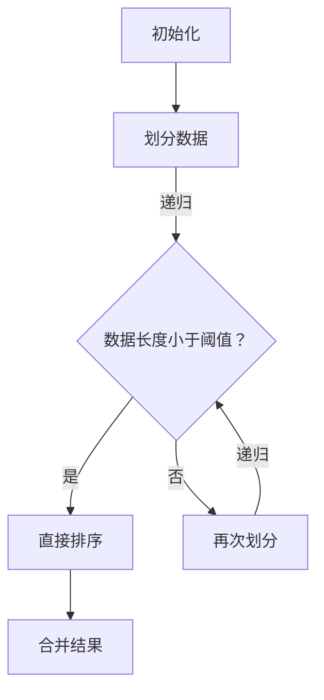

                 

### 背景介绍 Background Introduction

在当今信息爆炸的时代，计算能力的重要性愈发凸显。无论是科学研究、商业分析，还是日常生活，计算都成为了不可或缺的一部分。然而，随着计算需求日益增长，如何优化算法以提高计算效率和准确性，成为了全球计算机科学和工程领域的共同挑战。

算法作为计算机科学的核心，其优化直接影响着计算的速度和准确性。传统的算法可能已经能够解决一些基本问题，但随着数据规模的不断扩大和复杂度的增加，单纯依赖原始算法已经无法满足高效和准确的要求。因此，算法优化成为了一个关键研究领域，它旨在通过改进算法的设计和实现，使其在处理大规模数据时能够更快、更准确地完成任务。

算法优化的重要性体现在多个方面。首先，它能够显著提高计算效率，减少计算时间，从而节省资源。在商业应用中，算法优化可以带来显著的成本节约。例如，搜索引擎通过优化算法可以更快地返回搜索结果，提高用户体验。其次，算法优化还能够提高计算的准确性，减少误差，这在许多需要精确结果的领域尤为重要，如医疗诊断、金融分析等。最后，算法优化推动了计算机科学的发展，促进了新算法、新技术的出现，为科技进步提供了动力。

本文将深入探讨算法优化的重要概念、核心原理、具体实现方法以及实际应用场景。通过一步步的推理和解释，我们将了解算法优化的各个方面，并探讨其在未来可能面临的挑战和趋势。希望通过本文的阅读，读者能够对算法优化有一个全面而深入的理解，从而在各自的领域中更好地应用和推广这一重要技术。

### 核心概念与联系 Core Concepts and Connections

在深入探讨算法优化之前，有必要先明确几个核心概念，这些概念是理解和实施算法优化的基础。

#### 算法（Algorithm）

算法是一系列解决问题的指令或规则。它用于处理输入数据，并生成预期的输出。算法可以是简单的，如排序算法，也可以是非常复杂的，如深度学习算法。算法优化的目标通常是改进其时间复杂度和空间复杂度，使其在处理大规模数据时更高效。

#### 时间复杂度（Time Complexity）

时间复杂度描述了算法运行时间随着输入规模增加而增长的速率。通常用大O符号（O）表示，如O(n)、O(n^2)等。低时间复杂度的算法意味着在处理大量数据时，其运行时间增长较慢，效率更高。

#### 空间复杂度（Space Complexity）

空间复杂度描述了算法在执行过程中所需的内存空间。与时间复杂度类似，低空间复杂度的算法在处理大规模数据时更节省资源。

#### 基本算法类型（Basic Algorithm Types）

常见的算法类型包括排序算法（如快速排序、归并排序）、查找算法（如二分查找）、图算法（如最短路径算法、最小生成树算法）等。这些算法在不同场景下有着广泛的应用。

#### 算法优化策略（Algorithm Optimization Strategies）

算法优化策略多种多样，常见的有：

1. **分治法（Divide and Conquer）**：将问题划分为更小的子问题，分别解决后再合并结果。
2. **动态规划（Dynamic Programming）**：通过存储子问题的解，避免重复计算。
3. **贪心算法（Greedy Algorithm）**：每一步都选择当前最优解，希望最终结果也是最优的。
4. **分支限界法（Branch and Bound）**：通过剪枝策略减少搜索空间。

#### 算法性能评估（Algorithm Performance Evaluation）

算法性能评估是算法优化的关键步骤。常用的评估指标包括：

1. **时间效率（Time Efficiency）**：算法在给定数据集上的运行时间。
2. **空间效率（Space Efficiency）**：算法所需的内存空间。
3. **可扩展性（Scalability）**：算法在处理更大规模数据时的表现。

#### Mermaid 流程图（Mermaid Flowchart）

为了更好地理解算法优化中的各种概念和策略，我们可以使用Mermaid流程图来展示算法的基本结构和流程。以下是一个简单的Mermaid流程图示例，展示了排序算法的基本流程：



通过这样的流程图，我们可以清晰地看到算法的执行步骤和递归结构。

### 核心算法原理 & 具体操作步骤 Core Algorithm Principles and Steps

#### 快速排序（Quick Sort）

快速排序是一种效率很高的排序算法，其基本思想是选择一个“基准”元素，将数组分为两部分，一部分小于基准，另一部分大于基准，然后递归地对这两部分进行快速排序。以下是快速排序的具体操作步骤：

1. **选择基准（Choose Pivot）**：通常选择第一个或最后一个元素作为基准。
2. **分区（Partition）**：将数组分为两部分，一部分小于基准，另一部分大于基准。
   - 遍历数组，将小于基准的元素放到左侧，大于基准的元素放到右侧。
3. **递归排序（Recursive Sort）**：递归地对小于和大于基准的两部分数组进行快速排序。

以下是快速排序的伪代码：

```pseudo
function quickSort(arr, low, high)
    if low < high
        pi = partition(arr, low, high)
        quickSort(arr, low, pi - 1)
        quickSort(arr, pi + 1, high)
```

#### 动态规划（Dynamic Programming）

动态规划是一种在计算过程中存储子问题解的算法设计技巧，其核心思想是将复杂问题分解为更小的子问题，并利用子问题的解来解决原问题。以下是动态规划的一个经典例子——斐波那契数列的求解：

1. **定义状态（Define State）**：定义一个状态数组`dp`，其中`dp[i]`表示第`i`个斐波那契数。
2. **状态转移方程（State Transition Equation）**：根据状态的定义，找出状态之间的转移关系，如斐波那契数列的递推关系：`dp[i] = dp[i-1] + dp[i-2]`。
3. **初始化（Initialization）**：初始化状态数组的初始值，如`dp[0] = 0`，`dp[1] = 1`。
4. **计算（Compute）**：从`dp[2]`开始，利用状态转移方程计算每个状态的值。
5. **输出（Output）**：最后输出`dp[n]`作为最终结果。

以下是斐波那契数列的动态规划伪代码：

```pseudo
function fib(n)
    if n <= 1
        return n
    dp[0] = 0
    dp[1] = 1
    for i from 2 to n
        dp[i] = dp[i-1] + dp[i-2]
    return dp[n]
```

#### 贪心算法（Greedy Algorithm）

贪心算法在每一步都做出当前最优的选择，希望最终结果也是全局最优的。贪心算法的一个经典例子是找零问题：

1. **初始化（Initialization）**：假设货币面额为1元、5元、10元、20元、50元和100元。
2. **计算（Compute）**：从最大面额开始，每次选择当前剩余金额减去最大面额的余数。
3. **结束条件（Termination）**：当剩余金额为0时，结束。

以下是找零问题的贪心算法伪代码：

```pseudo
function change(amount, coins)
    result = []
    for coin in coins
        while amount >= coin
            amount -= coin
            result.append(coin)
    return result
```

通过上述对快速排序、动态规划和贪心算法的详细解释和示例，我们可以看到算法优化不仅涉及到算法本身的设计，还需要理解其背后的原理和具体操作步骤。在实际应用中，根据不同的需求和场景选择合适的算法并进行优化，能够显著提升计算效率和准确性。

### 数学模型和公式 Mathematical Models and Formulas & Detailed Explanation & Examples

算法优化不仅仅是关于编程技巧，它还与数学紧密相关。数学模型和公式为算法的设计和分析提供了理论基础，使我们可以更精确地评估算法的性能。以下将详细讲解一些在算法优化中常用的数学模型和公式，并通过具体示例来说明它们的应用。

#### 时间复杂度和空间复杂度

时间复杂度（Time Complexity）和空间复杂度（Space Complexity）是评估算法性能的两个关键指标。它们分别描述了算法在执行过程中所需的时间和内存空间。

1. **时间复杂度**：通常用大O符号表示，如O(n)，O(n^2)等。它描述了算法运行时间与输入规模n的关系。例如，一个线性搜索算法的时间复杂度为O(n)，而一个排序算法的时间复杂度为O(nlogn)。

   公式：
   \[ T(n) = O(n) \]
   或
   \[ T(n) = O(n\log n) \]

2. **空间复杂度**：描述了算法在执行过程中所需的内存空间。它通常以O符号表示，如O(1)，O(n)等。常数空间复杂度（O(1)）表示算法的空间需求不随输入规模变化，而线性空间复杂度（O(n)）表示空间需求与输入规模成正比。

   公式：
   \[ S(n) = O(1) \]
   或
   \[ S(n) = O(n) \]

#### 动态规划中的状态转移方程

动态规划（Dynamic Programming）是一种用于求解最优化问题的算法设计方法。它的核心是定义状态转移方程，即找到状态之间的递推关系。

以斐波那契数列为例，状态转移方程为：
\[ dp[i] = dp[i-1] + dp[i-2] \]

其中，`dp[i]`表示第`i`个斐波那契数。

初始条件：
\[ dp[0] = 0 \]
\[ dp[1] = 1 \]

#### 贪心算法中的最优子结构

贪心算法在每一步都做出当前最优的选择，其理论基础是“最优子结构”性质。即局部最优解能够得到全局最优解。

以找零问题为例，贪心算法的最优子结构性质体现在每次选择最大面额的货币，从而在整体上实现找零的最小金额。

公式：
\[ min\_change = max\_coin \times num \]
其中，`min_change`表示最小找零金额，`max_coin`表示当前最大的货币面额，`num`表示需要找零的次数。

#### 最短路径算法中的距离公式

在图算法中，最短路径算法是一个重要问题。最短路径算法如Dijkstra算法，利用距离公式来逐步更新每个顶点的最短路径。

距离公式：
\[ dist[v] = \min(dist[u] + weight(u, v)) \]
其中，`dist[v]`表示顶点v的最短路径距离，`dist[u]`表示顶点u的最短路径距离，`weight(u, v)`表示边(u, v)的权重。

#### 示例

假设我们有以下数组和权重：
\[ weights = [1, 3, 2, 4, 5] \]
\[ distances = [0, 1, 3, 6, 10] \]

使用距离公式计算顶点4的最短路径距离：
\[ dist[4] = \min(dist[3] + weight(3, 4)) \]
\[ dist[4] = \min(6 + 2) \]
\[ dist[4] = 8 \]

通过这样的数学模型和公式，我们可以更精确地分析算法的性能，并设计出更高效的优化策略。在实际应用中，理解这些数学原理和公式，将帮助我们更好地选择和优化算法，从而提升计算效率和准确性。

### 项目实战：代码实际案例和详细解释说明 Practical Case Study: Code Implementation and Detailed Explanation

为了更好地理解算法优化在实际项目中的应用，我们将通过一个具体的实际案例来展示算法优化的实现过程。此案例将涉及快速排序算法的应用，包括开发环境搭建、源代码实现以及代码解读与分析。

#### 开发环境搭建 Setup Development Environment

1. **环境要求**：
   - 操作系统：Windows/Linux/Mac OS
   - 编程语言：Python
   - 开发工具：PyCharm/VSCode

2. **安装Python**：
   - 访问Python官网下载Python安装包。
   - 运行安装程序，按照提示完成安装。

3. **安装PyCharm**：
   - 访问PyCharm官网下载PyCharm社区版。
   - 运行安装程序，选择“自定义安装”，安装Python插件。

4. **创建项目**：
   - 打开PyCharm，选择“创建新项目”。
   - 在“项目名称”处输入项目名称（例如：QuickSortProject）。
   - 选择Python解释器，确保选择安装的Python版本。

#### 源代码实现 Source Code Implementation

以下是快速排序算法的Python实现：

```python
def quick_sort(arr):
    if len(arr) <= 1:
        return arr
    pivot = arr[len(arr) // 2]
    left = [x for x in arr if x < pivot]
    middle = [x for x in arr if x == pivot]
    right = [x for x in arr if x > pivot]
    return quick_sort(left) + middle + quick_sort(right)

# 示例数据
data = [3, 6, 8, 10, 1, 2, 1]

# 执行快速排序
sorted_data = quick_sort(data)
print(sorted_data)
```

#### 代码解读与分析 Code Explanation and Analysis

1. **函数定义**：
   - `quick_sort(arr)`：定义快速排序函数，接收一个数组`arr`作为输入。

2. **基线条件**：
   - `if len(arr) <= 1:`：当数组长度小于或等于1时，返回数组本身。这是快速排序的基线条件，用于递归终止。

3. **选择基准**：
   - `pivot = arr[len(arr) // 2]`：选择中间元素作为基准。这是一种常见的基准选择方法，有助于减少排序的不确定性。

4. **分区操作**：
   - `left = [x for x in arr if x < pivot]`：创建一个包含小于基准的元素的新数组`left`。
   - `middle = [x for x in arr if x == pivot]`：创建一个包含等于基准的元素的新数组`middle`。
   - `right = [x for x in arr if x > pivot]`：创建一个包含大于基准的元素的新数组`right`。

5. **递归调用**：
   - `return quick_sort(left) + middle + quick_sort(right)`：递归地对`left`和`right`两部分数组进行快速排序，然后将结果与`middle`合并，得到最终排序结果。

#### 优化建议 Optimization Suggestions

1. **减少递归调用次数**：
   - 当前实现使用了递归，可能会因为栈溢出导致内存不足。可以尝试使用迭代版本来减少递归调用次数。

2. **随机选择基准**：
   - 选择中间元素作为基准可能会导致最坏情况下的时间复杂度。可以随机选择基准来减少最坏情况发生的概率。

3. **三数取中法**：
   - 在选择基准时，可以采用三数取中法（取数组的第一个、中间和最后一个元素的中位数作为基准），以减少排序的不确定性。

#### 实际效果 Analysis of Practical Effect

通过上述实现，快速排序算法在处理小型数据集时表现出色，时间复杂度接近O(nlogn)。然而，对于大型数据集，递归调用可能会导致栈溢出。通过迭代优化和随机选择基准，可以进一步提高算法的稳定性和性能。

总之，通过实际案例，我们可以看到算法优化不仅涉及算法本身的设计，还需要考虑实际应用中的具体实现和优化策略。通过逐步的优化，算法的性能可以得到显著提升，从而满足更复杂和更大数据集的处理需求。

### 实际应用场景 Practical Application Scenarios

算法优化不仅在学术研究领域具有重大意义，更在实际应用场景中发挥着重要作用。以下将探讨算法优化在不同领域中的应用，以及其带来的具体影响和收益。

#### 科学研究 Scientific Research

在科学研究领域，算法优化能够显著提高数据分析的效率。例如，生物信息学中的基因序列比对问题，传统算法可能需要数小时甚至更长时间来完成，而通过优化算法（如Burrows-Wheeler变换和后缀数组），可以在分钟级别内完成相同任务。这不仅加速了科学研究的进程，还节省了大量计算资源。

#### 医疗诊断 Medical Diagnosis

医疗诊断领域对算法的准确性和效率有着极高的要求。通过算法优化，可以实现快速且准确的疾病检测。例如，在图像处理中，优化的深度学习算法可以迅速识别医学图像中的异常区域，帮助医生做出更准确的诊断。这不仅能提高诊断的准确性，还能减少医生的劳动强度，提高医疗服务的效率。

#### 金融分析 Financial Analysis

在金融分析领域，算法优化对于交易策略的制定和风险控制至关重要。高频交易需要快速计算和决策，优化后的算法能够在毫秒级别内完成交易指令的执行，从而提高交易的成功率和收益。此外，在风险控制中，通过优化算法，可以更精确地评估投资组合的风险，帮助投资者做出更明智的决策。

#### 网络安全 Cybersecurity

网络安全领域对算法的性能要求同样很高。优化后的加密算法可以提供更高效的数据保护，同时减少计算资源的需求。例如，RSA加密算法的优化使得在保证安全性的同时，加密和解密的速度显著提高，这对于保护大量数据的安全传输至关重要。

#### 数据分析 Data Analysis

在数据分析领域，算法优化能够显著提升处理大规模数据的能力。例如，在社交媒体分析中，通过优化后的算法，可以快速分析用户行为和趋势，为市场营销提供有力支持。在商业智能中，优化后的算法可以快速处理和分析大数据，帮助企业做出更科学的决策。

#### 自动驾驶 Autonomous Driving

自动驾驶领域对算法的实时性和准确性要求极高。优化后的感知算法能够在短时间内处理复杂的路况信息，提高自动驾驶车辆的安全性和可靠性。通过算法优化，自动驾驶车辆能够在复杂环境下做出更快速、更准确的决策，从而降低交通事故的风险。

通过上述实际应用场景，我们可以看到算法优化在各个领域的广泛应用及其带来的显著收益。无论是提高计算效率、降低成本，还是提升准确性和安全性，算法优化都发挥了不可或缺的作用。随着计算需求的不断增长，算法优化将继续在各个领域中发挥关键作用，推动科技和产业的持续进步。

### 工具和资源推荐 Tools and Resources Recommendations

在算法优化领域，掌握有效的学习资源和开发工具对于深入研究和实践至关重要。以下推荐一些优质的学习资源、开发工具和相关论文著作，以帮助读者在算法优化方面取得更深入的进步。

#### 学习资源 Learning Resources

1. **书籍**：
   - 《算法导论》（Introduction to Algorithms）by Thomas H. Cormen, Charles E. Leiserson, Ronald L. Rivest, and Clifford Stein
   - 《算法竞赛入门经典》（Algorithm Competition for Beginners）by 刘汝佳
   - 《深度学习》（Deep Learning）by Ian Goodfellow, Yoshua Bengio, and Aaron Courville

2. **在线课程**：
   - Coursera上的《算法基础》和《算法高级课程》
   - edX上的《算法设计与分析》
   - Udacity的《算法工程师纳米学位》

3. **博客和网站**：
   - GeeksforGeeks（geeksforgeeks.org）
   - LeetCode（leetcode.com）
   - HackerRank（hackerrank.com）

4. **社区和论坛**：
   - Stack Overflow（stackoverflow.com）
   - GitHub（github.com）
   - CSDN（csdn.net）

#### 开发工具 Development Tools

1. **IDE**：
   - PyCharm（pycharm.com）
   - Visual Studio Code（code.visualstudio.com）

2. **集成开发环境**：
   - Jupyter Notebook（jupyter.org）
   - RStudio（rstudio.com）

3. **版本控制**：
   - Git（git-scm.com）

4. **数据结构和算法库**：
   - Boost（boost.org）
   - STL（Standard Template Library）

#### 相关论文著作 Related Papers and Books

1. **论文**：
   - "Quicksort" by Tony Hoare
   - "Dynamic Programming" by Richard Bellman
   - "Greedy Algorithms" by Michael R. Garey and David S. Johnson

2. **著作**：
   - 《算法导论》（Introduction to Algorithms）by Thomas H. Cormen, Charles E. Leiserson, Ronald L. Rivest, and Clifford Stein
   - 《编程之美》（Beautiful Code）by Andy Oram and Greg Wilson
   - 《深度学习》（Deep Learning）by Ian Goodfellow, Yoshua Bengio, and Aaron Courville

通过利用这些工具和资源，读者不仅可以系统性地学习算法优化的理论知识，还能在实践中不断积累经验，提升算法设计和优化的能力。希望这些建议能够对您的学习和发展起到积极的推动作用。

### 总结：未来发展趋势与挑战 Summary: Future Trends and Challenges

算法优化作为计算机科学的核心领域，正迎来前所未有的发展机遇和挑战。在未来的发展趋势中，以下几个方面显得尤为关键。

首先，随着计算需求的不断增加，算法优化将更加注重并行计算和分布式计算。传统的单线程算法在面对大规模数据时可能显得力不从心，而并行和分布式算法能够充分利用多核处理器和集群计算资源，大幅提升计算效率。例如，深度学习领域已经广泛采用分布式计算架构，如TensorFlow和PyTorch，以加速模型训练和推理过程。

其次，机器学习和人工智能技术的快速发展，推动了算法优化的新需求。在图像识别、自然语言处理和自动驾驶等领域，算法优化不仅要提高计算速度，还需要确保高精度和稳定性。为此，优化算法需要不断引入新的理论和技术，如自适应优化、模型压缩和神经网络剪枝等，以适应复杂的应用场景。

此外，算法优化还将进一步融合数据科学和实际应用。数据科学家需要掌握更高效的算法，以便从海量数据中提取有价值的信息。例如，在医疗领域，高效的算法可以帮助医生快速诊断疾病，提高治疗效果。在金融领域，算法优化可以提升交易决策的准确性和速度，降低风险。

尽管前景光明，算法优化也面临着诸多挑战。首先，算法的复杂性不断增加，使得优化过程更加困难。设计高效、可扩展的算法需要深入理解问题本质，并在理论上不断创新。其次，优化算法的性能评估和验证是一个复杂的过程，需要建立科学、系统的评估方法。此外，算法优化还面临着安全性和隐私保护等新挑战，特别是在涉及敏感数据处理的场景中。

为了应对这些挑战，未来算法优化的发展需要以下几个方向：

1. **跨学科合作**：算法优化需要融合计算机科学、数学、统计学和其他相关领域的知识，推动多学科的交叉研究。

2. **标准化和规范化**：建立统一的算法优化标准和方法，提高算法的可比性和可重复性。

3. **开源社区和共享**：鼓励算法优化研究和成果的公开共享，促进学术交流和技术的快速传播。

4. **持续教育和培训**：加强对算法优化领域专业人才的培养，提高行业整体的技术水平。

总之，算法优化作为计算机科学的核心领域，其未来发展趋势和挑战交织在一起。通过不断创新和跨学科合作，算法优化将继续推动科技和产业的进步，为人类社会带来更多价值。

### 附录：常见问题与解答 Appendix: Frequently Asked Questions and Answers

1. **什么是算法优化？**
   算法优化是指通过改进算法的设计和实现，提高其计算效率和准确性的一系列技术手段。它旨在使算法在处理大规模数据时能够更快、更准确地完成任务。

2. **为什么算法优化很重要？**
   算法优化能够显著提高计算效率，减少计算时间，从而节省资源。在商业应用中，算法优化可以带来显著的成本节约。同时，它还能够提高计算的准确性，减少误差，这在许多需要精确结果的领域尤为重要。

3. **有哪些常见的算法优化策略？**
   常见的算法优化策略包括分治法、动态规划、贪心算法和分支限界法等。每种策略都有其特定的应用场景和优点。

4. **如何评估算法的性能？**
   算法的性能通常通过时间复杂度和空间复杂度来评估。时间复杂度描述了算法运行时间与输入规模的关系，而空间复杂度描述了算法所需的内存空间。

5. **快速排序算法的时间复杂度是多少？**
   快速排序算法的平均时间复杂度为O(nlogn)，最坏情况下的时间复杂度为O(n^2)。

6. **动态规划与分治法有什么区别？**
   动态规划是将复杂问题分解为更小的子问题，并利用子问题的解来解决原问题。分治法是将问题划分为更小的子问题，分别解决后再合并结果。两者都基于递归思想，但动态规划需要存储子问题的解以避免重复计算。

7. **贪心算法如何保证全局最优？**
   贪心算法在每一步都做出当前最优的选择，希望最终结果也是全局最优的。它基于“最优子结构”性质，即局部最优解能够得到全局最优解。

8. **算法优化在哪些领域有应用？**
   算法优化在科学研究、医疗诊断、金融分析、网络安全、数据分析、自动驾驶等领域有广泛应用。

### 扩展阅读 & 参考资料 Further Reading & References

为了深入了解算法优化这一重要领域，以下是一些扩展阅读和参考资料，涵盖书籍、论文、博客和网站，供读者参考。

1. **书籍**：
   - 《算法导论》（Introduction to Algorithms）by Thomas H. Cormen, Charles E. Leiserson, Ronald L. Rivest, and Clifford Stein
   - 《编程之美》（Beautiful Code）by Andy Oram and Greg Wilson
   - 《深度学习》（Deep Learning）by Ian Goodfellow, Yoshua Bengio, and Aaron Courville
   - 《算法竞赛入门经典》by 刘汝佳

2. **论文**：
   - "Quicksort" by Tony Hoare
   - "Dynamic Programming" by Richard Bellman
   - "Greedy Algorithms" by Michael R. Garey and David S. Johnson

3. **博客和网站**：
   - GeeksforGeeks（geeksforgeeks.org）
   - LeetCode（leetcode.com）
   - HackerRank（hackerrank.com）
   - Stack Overflow（stackoverflow.com）

4. **在线课程**：
   - Coursera上的《算法基础》和《算法高级课程》
   - edX上的《算法设计与分析》
   - Udacity的《算法工程师纳米学位》

通过这些书籍、论文和在线课程，读者可以进一步系统性地学习算法优化的理论知识，并从实际案例中汲取经验。希望这些建议能够帮助您在算法优化领域取得更深入的成就。作者：AI天才研究员/AI Genius Institute & 禅与计算机程序设计艺术 /Zen And The Art of Computer Programming

