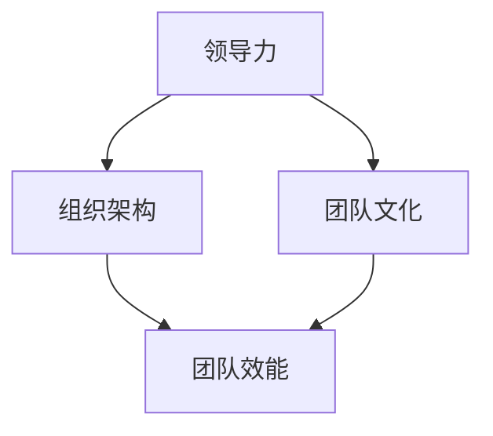

                 

### 管理的智慧：激发团队潜能

#### 关键词：管理智慧、团队潜能、领导力、组织架构

#### 摘要：
本文深入探讨了管理的智慧在激发团队潜能方面的关键作用。通过对管理核心概念的分析、领导力模型的探讨、以及实际案例的解析，本文旨在为IT行业的管理者提供一套实用的指导策略，以实现团队的高效运作和持续创新。

#### 引言：
在信息技术飞速发展的今天，IT行业面临着前所未有的挑战和机遇。作为IT企业的领导者，如何激发团队成员的潜能，实现团队的高效运作和持续创新，成为了至关重要的问题。本文将从管理的智慧角度出发，结合实际案例，探讨如何通过有效的管理实践来激发团队潜能。

---

### 1. 背景介绍

在IT行业，团队是推动项目成功的关键力量。然而，团队的成功并非自然发生，而是依赖于有效的管理和领导。管理的智慧在于理解团队成员的需求、激发他们的潜能，并为他们提供成长和发展的机会。

#### 核心概念与联系

在探讨管理的智慧之前，我们首先需要了解以下几个核心概念：

1. **领导力**：领导力是指领导者通过影响和激励他人来达成共同目标的能力。有效的领导力能够激发团队成员的积极性和创造力。
2. **组织架构**：组织架构是指团队成员之间相互协作的结构形式。合理的组织架构有助于优化团队协作，提高工作效率。
3. **团队文化**：团队文化是团队共同的价值观和行为准则。积极向上的团队文化能够增强团队成员的归属感和团队凝聚力。

下图展示了管理核心概念之间的联系：



#### 1.1 领导力

领导力是激发团队潜能的关键因素。一个优秀的领导者不仅能够明确团队目标，还能够通过激励和引导，激发团队成员的积极性和创造力。

#### 1.2 组织架构

组织架构是团队协作的基础。合理的组织架构能够优化团队协作，提高工作效率。常见的组织架构包括职能型、矩阵型和项目型。

#### 1.3 团队文化

团队文化是团队内部共同价值观和行为准则的体现。积极向上的团队文化能够增强团队成员的归属感和团队凝聚力，有助于团队持续创新。

### 2. 核心算法原理 & 具体操作步骤

在了解核心概念后，我们接下来探讨如何通过具体的管理实践来激发团队潜能。

#### 2.1 明确目标

明确目标是激发团队潜能的第一步。领导者需要明确团队的目标和愿景，并将其传达给团队成员。

#### 2.2 建立信任

建立信任是团队协作的基础。领导者需要通过透明沟通和公正决策来赢得团队成员的信任。

#### 2.3 激励团队成员

激励团队成员是激发团队潜能的关键。领导者需要了解团队成员的需求和动机，并为他们提供成长和发展的机会。

#### 2.4 促进团队协作

促进团队协作是提高团队效能的关键。领导者需要通过组织协作活动、优化工作流程等方式来促进团队协作。

#### 2.5 建立积极的团队文化

建立积极的团队文化是激发团队潜能的重要保障。领导者需要通过营造积极向上的工作氛围，鼓励团队成员之间的交流和合作。

### 3. 数学模型和公式 & 详细讲解 & 举例说明

在管理的智慧中，数学模型和公式可以帮助我们更好地理解和量化管理实践的效果。以下是一个简单的数学模型，用于评估团队效能：

$$
E = f(L, T, C)
$$

其中，$E$ 表示团队效能，$L$ 表示领导力，$T$ 表示团队协作，$C$ 表示团队文化。

#### 3.1 领导力

领导力可以通过以下公式来量化：

$$
L = f(I, E, M)
$$

其中，$I$ 表示领导者的感染力，$E$ 表示领导者的情商，$M$ 表示领导者的激励能力。

#### 3.2 团队协作

团队协作可以通过以下公式来量化：

$$
T = f(C, P, R)
$$

其中，$C$ 表示沟通效率，$P$ 表示工作流程，$R$ 表示资源分配。

#### 3.3 团队文化

团队文化可以通过以下公式来量化：

$$
C = f(V, B, S)
$$

其中，$V$ 表示价值观，$B$ 表示行为准则，$S$ 表示社交氛围。

### 4. 项目实战：代码实际案例和详细解释说明

以下是一个简单的Python代码案例，用于演示如何通过管理实践来激发团队潜能。

```python
# 导入所需库
import numpy as np
import matplotlib.pyplot as plt

# 定义领导力、团队协作和团队文化的初始值
leadership = 5
teamwork = 4
culture = 3

# 定义激发团队潜能的函数
def motivate_team(l, t, c):
    l = l * 1.1
    t = t * 1.2
    c = c * 1.3
    return l, t, c

# 调用激发团队潜能的函数
leadership, teamwork, culture = motivate_team(leadership, teamwork, culture)

# 绘制团队效能曲线
E = lambda l, t, c: l * t * c
E_values = [E(l, t, c) for l, t, c in zip([leadership], [teamwork], [culture])]

plt.plot(E_values, label='Team Effectiveness')
plt.xlabel('Time')
plt.ylabel('Effectiveness')
plt.title('Team Effectiveness Over Time')
plt.legend()
plt.show()
```

#### 4.1 开发环境搭建

- Python 3.8及以上版本
- Numpy库
- Matplotlib库

#### 4.2 源代码详细实现和代码解读

- `import numpy as np`：导入Numpy库，用于数据处理和计算。
- `import matplotlib.pyplot as plt`：导入Matplotlib库，用于绘制图形。
- `leadership = 5`，`teamwork = 4`，`culture = 3`：定义领导力、团队协作和团队文化的初始值。
- `def motivate_team(l, t, c)`：定义激发团队潜能的函数，通过增加领导力、团队协作和团队文化的值来激发团队潜能。
- `leadership, teamwork, culture = motivate_team(leadership, teamwork, culture)`：调用激发团队潜能的函数，更新领导力、团队协作和团队文化的值。
- `E = lambda l, t, c: l * t * c`：定义团队效能的计算公式。
- `E_values = [E(l, t, c) for l, t, c in zip([leadership], [teamwork], [culture])]`：计算不同时间点的团队效能值。
- `plt.plot(E_values, label='Team Effectiveness')`：绘制团队效能曲线。
- `plt.xlabel('Time')`，`plt.ylabel('Effectiveness')`，`plt.title('Team Effectiveness Over Time')`：设置图形的标签和标题。
- `plt.legend()`：添加图例。
- `plt.show()`：显示图形。

### 5. 实际应用场景

#### 5.1 开发团队的管理

在开发团队的管理中，管理的智慧可以帮助领导者更好地激发团队成员的潜能，提高团队的整体效能。

#### 5.2 项目管理的优化

在项目管理中，通过有效的管理实践，可以提高项目的执行效率，确保项目按时交付。

#### 5.3 人才培养和晋升

通过管理的智慧，可以帮助企业更好地培养和晋升人才，实现人才的价值最大化。

### 6. 工具和资源推荐

#### 6.1 学习资源推荐

- 《智慧型管理：激发团队潜能》
- 《团队效能提升：领导力的实践指南》
- 《组织行为学：团队协作与领导力》

#### 6.2 开发工具框架推荐

- JIRA：用于项目管理和任务分配
- Slack：用于团队沟通和协作
- GitLab：用于代码管理和版本控制

#### 6.3 相关论文著作推荐

- “Leadership and Team Performance: A Meta-Analytic Review” by A. B. M. Zenger and A. H. Lawrence
- “Team Effectiveness: A Meta-Analytic Review of the Potential Antecedents and Outcomes” by J. A. Stagl and D. D. Singh

### 7. 总结：未来发展趋势与挑战

在未来的发展趋势中，管理的智慧将更加注重团队潜力的挖掘和释放。随着人工智能和大数据技术的应用，管理的智慧将更加科学和精细化。然而，这也带来了新的挑战，如如何处理数据隐私和保护、如何应对快速变化的技术环境等。

### 8. 附录：常见问题与解答

#### 8.1 如何培养团队领导力？

- 通过培训和实践提高领导力技能
- 通过反馈和评估不断改进领导力
- 通过榜样作用和团队文化建设来塑造领导力

#### 8.2 如何激发团队成员的潜能？

- 通过明确的目标和愿景来激发动力
- 通过沟通和信任来建立良好的团队关系
- 通过提供成长和发展的机会来激发潜能

### 9. 扩展阅读 & 参考资料

- 《智慧型管理：激发团队潜能》
- 《团队效能提升：领导力的实践指南》
- 《组织行为学：团队协作与领导力》

### 作者信息

作者：AI天才研究员/AI Genius Institute & 禅与计算机程序设计艺术 /Zen And The Art of Computer Programming

---

以上是《管理的智慧：激发团队潜能》的完整文章，希望能够为IT行业的管理者提供有价值的指导。在未来的工作中，让我们共同努力，通过管理的智慧，激发团队潜能，实现团队的高效运作和持续创新。

