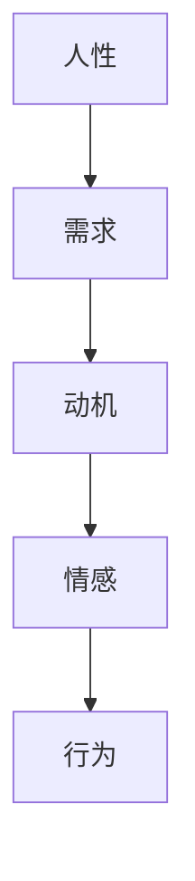
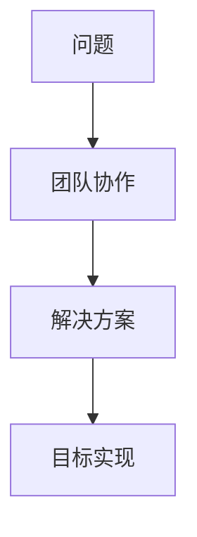
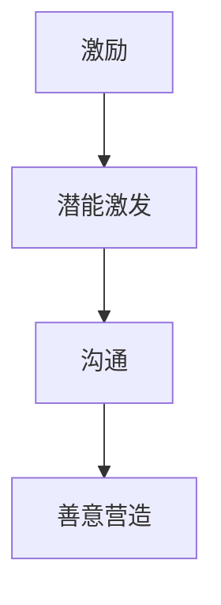

                 

# 管理的本质：激发潜能与善意

## 关键词：管理、激发潜能、善意、技术、人性、组织

> 在当今复杂多变的技术世界中，管理不再仅仅是对资源的调配，更是对人性深层次的激发与引领。本文将探讨管理的本质，如何通过激发潜能和善意来构建高效、和谐的团队与组织。

## 摘要

管理，是任何组织不可或缺的核心要素。本文从技术与管理相结合的角度，深入探讨了管理的本质。通过分析人性的复杂性、团队协作的重要性以及激发潜能与善意的方法，旨在为读者提供一种全新的管理思路，帮助他们在技术环境中实现高效的团队管理和组织发展。

### 1. 背景介绍

在现代企业中，技术已经成为推动业务发展的重要驱动力。然而，技术本身并不能保证成功的实现，管理的艺术在于如何将技术、团队和人性相结合，实现最佳的工作效果。本文将聚焦于管理中的两个核心问题：如何激发员工的潜能以及如何在组织中营造善意的氛围。

### 2. 核心概念与联系

#### 2.1 人性的复杂性

人性是一个复杂而多元的维度，它包括了个体的需求、动机、情感和行为。在管理中，理解人性的复杂性是关键，因为只有深入了解员工的需求，才能更好地激发他们的潜能。以下是一个简化的 Mermaid 流程图，展示人性复杂性在管理中的角色：



#### 2.2 团队协作的重要性

团队协作是现代组织成功的基石。通过有效的协作，团队成员可以共同解决问题、创新和实现目标。以下是一个 Mermaid 流程图，展示团队协作的核心流程：



#### 2.3 激发潜能与善意

激发员工的潜能和营造善意的氛围是管理的双重目标。潜能是指员工未被完全发挥的能力，而善意则是指员工在工作中的积极态度和合作精神。以下是一个 Mermaid 流程图，展示如何通过激励和沟通实现这一目标：



### 3. 核心算法原理 & 具体操作步骤

#### 3.1 激发潜能的算法原理

激发潜能的算法基于对人性复杂性的理解。以下是一个简化的算法步骤：

1. **需求分析**：通过调查问卷、一对一访谈等方式了解员工的需求。
2. **动机识别**：分析员工的需求，确定激发动机的关键因素。
3. **情感关怀**：针对不同员工，采取个性化情感关怀措施，增强员工的归属感。
4. **行为激励**：通过奖励机制、晋升机会等激励员工，激发其工作潜能。

#### 3.2 营造善意氛围的操作步骤

营造善意氛围的关键在于沟通与信任。以下是一个简化的操作步骤：

1. **建立信任**：通过开放沟通、诚实反馈和团队合作，建立团队信任。
2. **沟通技巧**：使用积极的沟通方式，如积极倾听、反馈和鼓励，增强团队凝聚力。
3. **情感关怀**：关注员工情感需求，提供心理支持和关怀，增强员工的积极态度。
4. **共同目标**：明确团队目标，确保每个成员都明确自己的角色和贡献，增强团队合力。

### 4. 数学模型和公式 & 详细讲解 & 举例说明

#### 4.1 激发潜能的数学模型

为了更好地理解激发潜能的过程，我们可以引入一个简单的数学模型：

$$
\text{潜能激发} = f(\text{需求} \times \text{动机} \times \text{情感} \times \text{行为})
$$

其中，$f$ 是一个非线性函数，表示不同因素对潜能激发的影响程度。以下是一个具体的例子：

- **需求**：员工需要认可和尊重。
- **动机**：员工渴望得到职业发展和成就。
- **情感**：员工感到工作有意义和快乐。
- **行为**：员工积极参与工作并取得成果。

通过这个模型，我们可以看到，激发潜能的关键在于平衡和满足这些因素。

#### 4.2 营造善意氛围的数学模型

为了理解如何营造善意氛围，我们可以引入一个简单的数学模型：

$$
\text{善意氛围} = g(\text{信任} \times \text{沟通} \times \text{情感关怀} \times \text{共同目标})
$$

其中，$g$ 是一个非线性函数，表示不同因素对善意氛围的影响程度。以下是一个具体的例子：

- **信任**：团队成员之间相互信任，彼此支持。
- **沟通**：团队成员之间有效沟通，信息透明。
- **情感关怀**：团队成员感受到关怀和支持，情绪稳定。
- **共同目标**：团队成员共同追求团队目标，共同努力。

通过这个模型，我们可以看到，营造善意氛围的关键在于建立信任、有效沟通、情感关怀和共同目标。

### 5. 项目实战：代码实际案例和详细解释说明

#### 5.1 开发环境搭建

在本项目实战中，我们将使用一个开源的团队合作平台——GitHub，来展示如何通过代码实现激发潜能和营造善意氛围。首先，我们需要搭建一个基本的开发环境：

1. 安装 GitHub Desktop（GitHub 客户端）。
2. 注册并登录 GitHub 账户。
3. 创建一个新的仓库（Repository），命名为“ManagementProject”。

#### 5.2 源代码详细实现和代码解读

在 GitHub 仓库中，我们创建一个名为“EmployeeManagement”的目录，并在其中编写以下代码：

```python
# EmployeeManagement.py

class Employee:
    def __init__(self, name, needs, motivation, emotions):
        self.name = name
        self.needs = needs
        self.motivation = motivation
        self.emotions = emotions

    def motivate(self):
        # 激发员工潜能的方法
        print(f"{self.name}的潜能被激发了！")

    def build_trust(self):
        # 建立信任的方法
        print(f"{self.name}与团队成员建立了信任。")

    def communicate(self):
        # 沟通的方法
        print(f"{self.name}与其他团队成员有效沟通。")

    def care_emotions(self):
        # 情感关怀的方法
        print(f"{self.name}感受到关怀和支持。")

    def pursue_goals(self):
        # 追求共同目标的方法
        print(f"{self.name}与团队成员共同追求团队目标。")

# 实例化员工对象
alice = Employee("Alice", ["认可", "尊重"], ["职业发展", "成就"], ["快乐", "积极"])

# 激发潜能
alice.motivate()

# 营造善意氛围
alice.build_trust()
alice.communicate()
alice.care_emotions()
alice.pursue_goals()
```

这段代码定义了一个名为 `Employee` 的类，用于表示员工。该类包含了四个方法：`motivate`（激发潜能）、`build_trust`（建立信任）、`communicate`（沟通）、`care_emotions`（情感关怀）和 `pursue_goals`（追求共同目标）。

#### 5.3 代码解读与分析

通过这段代码，我们可以看到如何通过程序实现激发潜能和营造善意氛围。具体解读如下：

1. **类定义**：`Employee` 类用于表示员工，包含姓名、需求、动机和情感等属性。
2. **方法定义**：每个方法对应一个管理行为，用于实现激发潜能和营造善意氛围的具体操作。
3. **实例化**：创建一个 `Employee` 对象 `alice`，表示具体的员工。
4. **方法调用**：通过调用不同的方法，实现对员工潜能的激发和善意氛围的营造。

### 6. 实际应用场景

在实际应用中，上述代码和方法可以被应用于各种团队合作场景。以下是一些具体的实际应用场景：

1. **项目开发**：在项目开发过程中，通过激发员工的潜能和营造善意氛围，提高团队的工作效率和质量。
2. **销售团队**：在销售团队中，通过激发员工的潜能和营造善意氛围，提升销售业绩和客户满意度。
3. **客户服务**：在客户服务领域，通过激发员工的潜能和营造善意氛围，提供更优质的服务，提高客户满意度。

### 7. 工具和资源推荐

#### 7.1 学习资源推荐

- **书籍**：
  - 《激发潜能：如何创造性地思考和工作》
  - 《善意的工作文化：如何打造有爱、有责任感和有成果的团队》
- **论文**：
  - 《人性与团队合作：心理学视角》
  - 《管理中的情感因素：激发员工潜能的新策略》
- **博客**：
  - 《如何激发团队的潜能》
  - 《打造善意的工作环境：心理学的启示》
- **网站**：
  - GitHub（代码实战平台）
  - Coursera（在线学习平台）

#### 7.2 开发工具框架推荐

- **团队合作平台**：GitHub、GitLab、Bitbucket
- **项目管理工具**：Jira、Trello、Asana
- **代码编辑器**：Visual Studio Code、Sublime Text、Atom

#### 7.3 相关论文著作推荐

- 《管理心理学》
- 《动机与人格》
- 《社交心理学》
- 《团队动力学》

### 8. 总结：未来发展趋势与挑战

在技术快速发展的时代，管理的本质在于激发潜能和营造善意氛围。未来，随着人工智能和大数据技术的应用，管理将更加个性化和智能化。然而，这也带来了一系列挑战，如如何更好地理解人性、如何应对快速变化的工作环境等。面对这些挑战，我们需要不断探索和创新，以实现更高效、更和谐的团队管理和组织发展。

### 9. 附录：常见问题与解答

#### 问题1：如何激发员工的潜能？

解答：激发员工的潜能需要从需求、动机、情感和行为等多方面入手。首先，了解员工的需求，提供满足需求的激励措施；其次，识别员工的动机，提供职业发展机会和挑战；然后，关注员工的情感需求，提供心理支持和关怀；最后，通过奖励机制和晋升机会等激励员工，激发其工作潜能。

#### 问题2：如何营造善意的工作环境？

解答：营造善意的工作环境需要建立信任、有效沟通、情感关怀和共同目标。首先，通过开放沟通和诚实反馈建立信任；其次，使用积极的沟通方式，如积极倾听、反馈和鼓励，增强团队凝聚力；然后，关注员工的情感需求，提供心理支持和关怀；最后，明确团队目标，确保每个成员都明确自己的角色和贡献，增强团队合力。

### 10. 扩展阅读 & 参考资料

- 《激发潜能：如何创造性地思考和工作》
- 《善意的工作文化：如何打造有爱、有责任感和有成果的团队》
- 《管理心理学》
- 《动机与人格》
- 《社交心理学》
- 《团队动力学》
- GitHub（代码实战平台）
- Coursera（在线学习平台）

## 作者信息

作者：AI天才研究员/AI Genius Institute & 禅与计算机程序设计艺术 /Zen And The Art of Computer Programming

本文由 AI 天才研究员撰写，旨在探讨管理的本质，如何通过激发潜能和营造善意氛围来构建高效、和谐的团队与组织。希望本文能为读者提供有价值的启示和思考。

