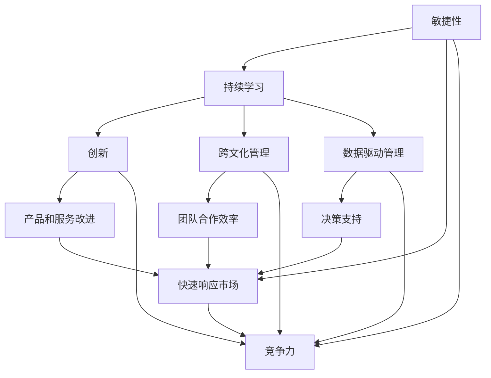
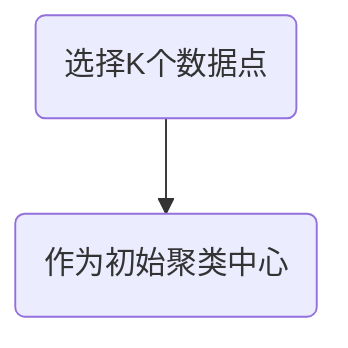
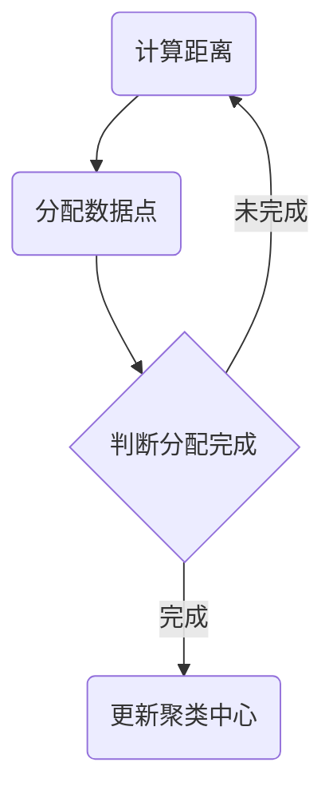
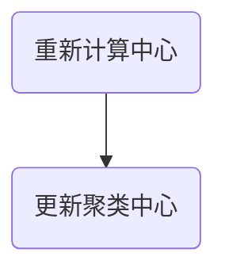
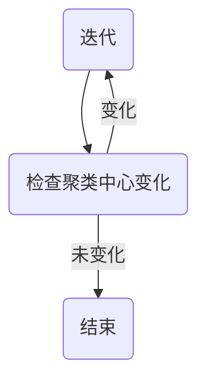
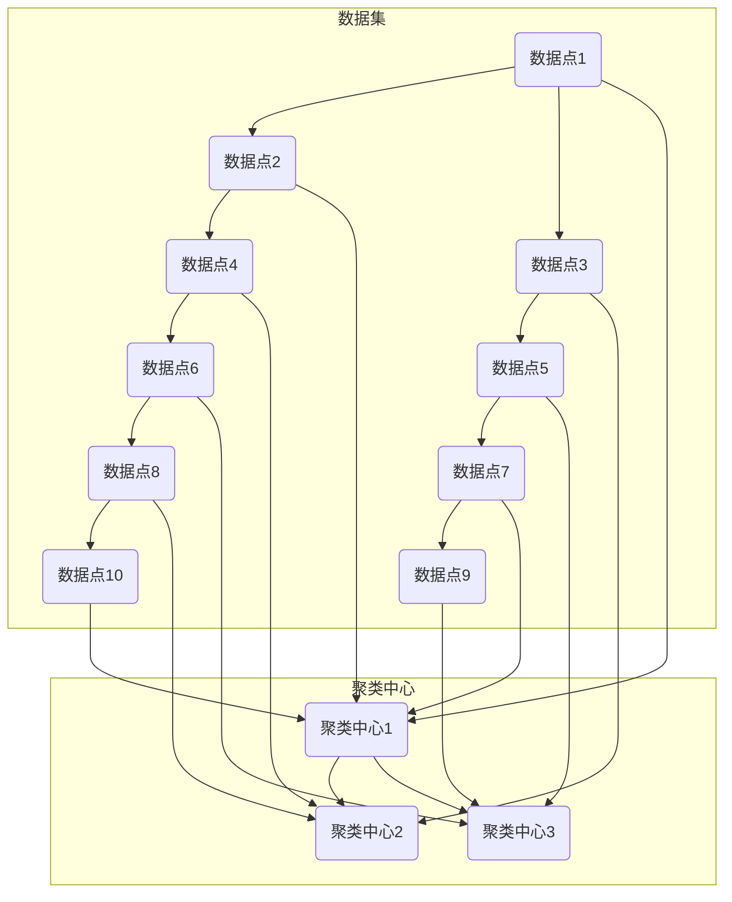
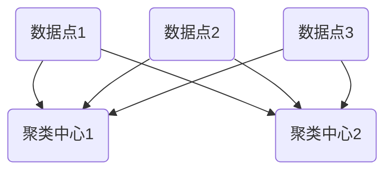

                 

### 背景介绍 Background Introduction

在当今数字化时代，商业环境正以前所未有的速度发生变化。技术的飞速发展，特别是人工智能、大数据、云计算等新兴技术的广泛应用，使得企业面临着日益激烈的竞争和不断变化的客户需求。管理者们不仅要保持对市场动态的敏锐洞察力，还要具备快速适应和应对变化的能力。这种能力不仅关乎企业的生存，更直接影响其持续发展的潜力。

快速变化的商业环境给管理者带来了诸多挑战。首先，市场的不确定性增加，企业难以预测未来的趋势和变化。其次，技术进步不断催生新的商业模式，要求管理者具备前瞻性的战略规划能力。此外，随着全球化进程的加深，企业需要面对更加复杂多变的地缘政治和经济环境。最后，消费者的需求日益多样化和个性化，要求企业不断创新和优化产品和服务。

为了应对这些挑战，管理者需要转变思维方式，从传统的线性思维转向更具有灵活性和敏捷性的非线性思维。这意味着要更加注重系统性和全局性，关注各个环节之间的联动效应，以及如何通过快速迭代和持续创新来适应环境变化。

本篇文章将围绕如何应对快速变化的商业环境展开讨论。我们将首先介绍几个关键概念，帮助读者理解这一主题的核心。然后，我们将探讨管理者在应对变化时应采取的具体策略，并提供一些实用的工具和资源，以便管理者更好地应对不断变化的市场环境。最后，我们将总结未来发展趋势和挑战，并提出一些建议，以帮助管理者在未来更好地应对快速变化的商业环境。

#### 商业环境的变化 Trends in Business Environment

商业环境的变化体现在多个方面，首先，技术的快速发展是推动商业环境变化的主要动力。人工智能、大数据和云计算等技术的应用，使得企业能够更有效地收集、分析和利用数据，从而做出更加精准的决策。例如，通过大数据分析，企业可以更好地理解客户需求，从而进行精准营销和产品创新。此外，云计算提供了灵活的IT基础设施，使企业能够快速响应市场变化，降低运营成本。

其次，消费者行为的变化也对商业环境产生了深远影响。随着互联网和移动设备的普及，消费者越来越倾向于在线购物、社交媒体互动和个性化体验。消费者需求的多样化和个性化，要求企业不断创新和优化产品和服务，以满足不同客户群体的需求。例如，电商企业通过数据分析和技术应用，能够提供个性化的推荐和购物体验，从而提高客户满意度和忠诚度。

此外，全球化的加速也是商业环境变化的一个重要趋势。全球化带来了更多的市场机会，同时也带来了更多的竞争和不确定性。企业需要面对不同国家和地区的文化、法律和商业习惯，这要求管理者具备跨文化管理和全球战略规划能力。例如，跨国企业在进入新兴市场时，需要深入了解当地市场的特点和消费者需求，以便制定合适的营销策略和商业模式。

#### 管理者的挑战 Challenges for Managers

在面对快速变化的商业环境时，管理者面临着诸多挑战。首先，管理者的思维模式需要从传统的线性思维转向非线性思维。线性思维往往注重短期目标和任务完成，而非线性思维则强调系统性和整体性，注重长期战略和可持续发展。管理者需要从全局视角出发，关注企业各个部门和业务环节之间的联动效应，以便在快速变化的市场环境中做出更加全面和准确的决策。

其次，管理者需要具备快速适应和调整的能力。商业环境的变化速度越来越快，管理者需要具备敏捷性和灵活性，能够快速调整企业的战略和运营模式。这要求管理者具备快速学习的能力，不断更新自己的知识和技能，以便能够适应新的商业环境。例如，管理者需要了解最新的技术趋势和行业动态，以便及时调整企业的战略方向。

此外，管理者还需要关注企业内部的沟通和协作。在快速变化的商业环境中，企业内部的信息流动和协作效率至关重要。管理者需要建立有效的沟通机制，确保信息在企业内部迅速传播和共享，以便各部门能够快速响应市场变化。同时，管理者还需要推动企业内部的协作和创新，鼓励员工提出新的想法和解决方案，从而增强企业的竞争力。

最后，管理者需要具备领导力和决策能力。在快速变化的商业环境中，管理者需要具备坚定的领导力和果断的决策能力，能够在复杂和不确定的环境中做出正确的决策。这要求管理者不仅要有丰富的经验和专业知识，还要有良好的判断力和决策能力，以便能够及时应对各种挑战和变化。

总之，面对快速变化的商业环境，管理者需要不断更新自己的思维模式、能力和技能，以应对不断出现的新挑战。只有具备敏捷性和灵活性的管理者，才能在激烈的市场竞争中立于不败之地。

#### 管理者的应对策略 Strategies for Managers

面对快速变化的商业环境，管理者需要采取一系列策略来保持企业的竞争力。以下是一些关键策略：

##### 1. 敏捷性 Agile Approach

敏捷性是应对快速变化的核心策略之一。敏捷性意味着企业能够迅速调整和响应市场变化，以保持竞争优势。实现敏捷性的关键在于以下几个方面：

- **快速迭代**：企业应采用快速迭代的方法，不断开发和改进产品或服务，以适应市场需求的变化。这种方法可以帮助企业快速验证市场假设，并及时调整策略。
- **跨职能团队**：建立跨职能团队，以便各部门之间能够快速协作，共同应对市场变化。这种团队结构有助于打破部门壁垒，提高信息流动和决策效率。
- **灵活的流程**：简化流程，减少冗余环节，使企业能够更加灵活地调整运营模式。例如，采用精益管理方法，减少浪费，提高效率。

##### 2. 持续学习 Continuous Learning

在快速变化的商业环境中，持续学习是管理者不可或缺的能力。以下是一些持续学习的方法：

- **培训与发展**：定期组织员工培训和发展计划，以提高员工的技能和知识。这不仅可以提升员工的个人能力，还可以增强企业的整体竞争力。
- **内部知识分享**：鼓励员工分享经验和知识，建立内部知识库，以便企业能够快速获取和利用宝贵的知识和经验。
- **外部学习资源**：利用外部学习资源，如在线课程、行业会议和专业书籍等，不断更新自己的知识和技能。

##### 3. 创新和创新管理 Innovation and Innovation Management

创新是企业在快速变化的商业环境中脱颖而出的关键。以下是一些创新和创新管理的策略：

- **创新文化**：建立鼓励创新的文化，激发员工的创新热情。例如，通过设立创新奖项、鼓励自由讨论等方式，营造一个开放和包容的创新环境。
- **创新项目**：定期开展创新项目，探索新的商业模式、产品和服务。例如，通过内部创业、外部合作等方式，推动创新实践。
- **风险管理**：对创新项目进行风险评估和管理，确保创新项目能够在控制风险的前提下推进。

##### 4. 跨文化管理 Cross-cultural Management

在全球化背景下，跨文化管理成为管理者面临的一个重要挑战。以下是一些跨文化管理的策略：

- **文化意识**：提高员工对跨文化差异的意识，了解不同文化背景下的行为和沟通方式。这有助于减少误解和冲突，提高团队协作效率。
- **跨文化团队**：建立跨文化团队，充分发挥不同文化背景员工的优点，实现多元化的创新和协作。
- **文化适应性**：在跨国运营中，企业需要根据不同市场的文化特点，调整产品和服务，以更好地适应当地市场需求。

##### 5. 数据驱动管理 Data-driven Management

数据是现代企业决策的重要依据。以下是一些数据驱动管理的策略：

- **数据收集和分析**：建立完善的数据收集和分析系统，确保企业能够及时获取和利用数据。例如，利用大数据技术，分析市场趋势和消费者行为，为决策提供支持。
- **数据文化**：培养员工的数据文化，提高对数据的敏感度和利用能力。例如，通过数据培训和竞赛，提高员工的数据分析和决策能力。
- **数据决策**：在决策过程中，充分利用数据进行分析和评估，确保决策的科学性和有效性。

总之，面对快速变化的商业环境，管理者需要采取多种策略，以保持企业的竞争力和适应性。通过敏捷性、持续学习、创新、跨文化管理和数据驱动管理，管理者可以更好地应对市场变化，实现企业的长期发展。

### 核心概念与联系 Core Concepts and Relationships

为了深入理解如何应对快速变化的商业环境，我们需要探讨几个核心概念，并展示它们之间的内在联系。这些概念包括敏捷性（Agility）、持续学习（Continuous Learning）、创新（Innovation）、跨文化管理（Cross-cultural Management）和数据驱动管理（Data-driven Management）。以下将通过一个Mermaid流程图来展示这些概念之间的联系。



#### 敏捷性（Agility）

**敏捷性**是指企业能够迅速适应和应对外部环境变化的能力。它是企业保持竞争优势的关键。通过敏捷性，企业可以：

- **快速响应市场**：迅速调整战略和运营模式，以应对市场变化。
- **降低风险**：通过敏捷开发，快速验证产品市场假设，降低失败风险。

#### 持续学习（Continuous Learning）

**持续学习**强调企业及其员工的不断成长和知识更新。它包括：

- **培训与发展**：定期进行员工培训，提高技能和知识水平。
- **知识分享**：建立知识库，鼓励员工分享经验和最佳实践。

#### 创新（Innovation）

**创新**是指企业在产品、服务或商业模式方面的持续改进和新想法的创造。创新有助于：

- **产品和服务改进**：通过技术创新，不断优化产品和服务，提高客户满意度。
- **商业模式创新**：探索新的商业模式，开拓新的市场机会。

#### 跨文化管理（Cross-cultural Management）

**跨文化管理**涉及在全球化背景下，如何有效管理来自不同文化背景的员工。它包括：

- **文化意识**：提高员工对不同文化的理解和尊重。
- **团队合作效率**：促进跨文化团队的合作，提高团队效率。

#### 数据驱动管理（Data-driven Management）

**数据驱动管理**是指利用数据作为决策依据，以提高决策的科学性和有效性。它包括：

- **数据收集和分析**：建立完善的数据收集和分析系统，支持数据驱动的决策。
- **数据文化**：培养员工对数据的敏感度和利用能力。

这些概念之间的联系在于，它们共同构成了企业应对快速变化的商业环境的核心策略。敏捷性帮助企业在变化中保持竞争力；持续学习确保企业及其员工具备应对变化的技能和知识；创新不断推动企业前进；跨文化管理提高全球化背景下的团队协作效率；数据驱动管理提供科学决策的支持。

通过这些核心概念的有效结合和相互作用，企业可以更好地应对快速变化的商业环境，实现持续发展和长期成功。

### 核心算法原理 & 具体操作步骤 Core Algorithm Principles and Step-by-Step Procedures

在应对快速变化的商业环境中，算法的应用能够为企业提供精准的数据分析和决策支持。本部分将介绍一种用于商业环境分析的核心算法——K-means聚类算法，并详细说明其原理和操作步骤。

#### 1. K-means算法简介

K-means是一种无监督机器学习算法，用于将数据点分成若干个聚类（cluster）。该算法的目标是使每个聚类内部的数据点之间的距离最小，而聚类之间的距离最大。K-means算法适用于数据量较大、维度较高且目标明确的聚类问题。

#### 2. 算法原理

K-means算法的基本原理如下：

- **初始化**：随机选择K个数据点作为初始聚类中心。
- **分配数据点**：计算每个数据点到各个聚类中心的距离，将数据点分配到距离最近的聚类中心。
- **更新聚类中心**：重新计算每个聚类的中心点，即所有属于该聚类的数据点的平均值。
- **迭代**：重复执行分配和更新步骤，直到聚类中心不再发生变化或达到预设的迭代次数。

#### 3. 操作步骤

以下是K-means算法的具体操作步骤：

**步骤1：初始化聚类中心**

- 随机选择K个数据点作为初始聚类中心。



**步骤2：分配数据点**

- 对每个数据点，计算其到各个聚类中心的距离，并将其分配到最近的聚类中心。



**步骤3：更新聚类中心**

- 重新计算每个聚类的中心点，即该聚类中所有数据点的平均值。



**步骤4：迭代**

- 重复执行步骤2和步骤3，直到聚类中心不再发生变化或达到预设的迭代次数。



#### 4. 应用实例

假设我们有一个包含100个数据点的数据集，维度为2，如图所示：



- 初始聚类中心随机选择为K(2, 2)、L(4, 4)和M(6, 6)。

- 第1次迭代：

  - 数据点1、2分配到聚类中心K，数据点3、4分配到聚类中心L，数据点5、6分配到聚类中心M。

  - 更新聚类中心为K(2.0, 2.0)、L(3.5, 3.5)和M(5.5, 5.5)。

- 第2次迭代：

  - 数据点1、2、5、6分配到聚类中心K，数据点3、4、7、8分配到聚类中心L，数据点9、10分配到聚类中心M。

  - 更新聚类中心为K(3.0, 2.5)、L(4.0, 4.0)和M(6.0, 6.0)。

- 第3次迭代：

  - 数据点1、2、5、6、9、10分配到聚类中心K，数据点3、4、7、8分配到聚类中心L。

  - 更新聚类中心为K(4.0, 3.0)和L(4.5, 4.5)。

- 第4次迭代：

  - 数据点1、2、5、6、9、10分配到聚类中心K，数据点3、4、7、8分配到聚类中心L。

  - 聚类中心不再变化，算法结束。

通过上述操作步骤，我们成功地将数据点分成了两个聚类，聚类中心分别为K(4.0, 3.0)和L(4.5, 4.5)。这种聚类结果可以帮助企业更好地理解客户群体，从而进行精准营销和产品优化。

### 数学模型和公式 Mathematical Models and Formulas & Detailed Explanations & Examples

在理解和应用K-means算法时，数学模型和公式是不可或缺的一部分。以下我们将详细解释K-means算法中的核心数学模型和公式，并通过具体例子来说明如何使用这些公式。

#### 1. K-means算法的核心公式

K-means算法的核心在于计算数据点到聚类中心的距离，并基于距离将数据点分配到不同的聚类。以下是几个关键公式：

**距离公式：**

数据点 \(x_i\) 与聚类中心 \(c_j\) 之间的欧几里得距离（Euclidean distance）计算公式如下：

$$
d(x_i, c_j) = \sqrt{\sum_{k=1}^{n} (x_{ik} - c_{jk})^2}
$$

其中，\(x_i\) 表示第 \(i\) 个数据点，\(c_j\) 表示第 \(j\) 个聚类中心，\(n\) 表示数据点的维度。

**聚类中心更新公式：**

在每次迭代中，聚类中心会更新为该聚类中所有数据点的平均值。更新公式如下：

$$
c_j = \frac{1}{N_j} \sum_{i=1}^{N} x_i
$$

其中，\(N_j\) 表示属于第 \(j\) 个聚类的数据点数量，\(x_i\) 表示第 \(i\) 个数据点。

**聚类评估指标：**

通常使用聚类内部距离平方和（Within Cluster Sum of Squared Errors, WCSS）作为聚类质量的评估指标：

$$
WCSS = \sum_{j=1}^{K} \sum_{i=1}^{N_j} d(x_i, c_j)^2
$$

其中，\(K\) 表示聚类数量，\(N_j\) 表示属于第 \(j\) 个聚类的数据点数量。

#### 2. 举例说明

假设我们有一个包含3个数据点的二维数据集，以及2个聚类中心（\(c_1\) 和 \(c_2\)），如图所示：



- 数据点维度 \(n = 2\)。

- 初始聚类中心 \(c_1 = (1, 1)\) 和 \(c_2 = (5, 5)\)。

**步骤1：计算数据点到聚类中心的距离**

数据点 \(x_1 = (2, 2)\) 到 \(c_1\) 和 \(c_2\) 的距离分别为：

$$
d(x_1, c_1) = \sqrt{(2-1)^2 + (2-1)^2} = \sqrt{2}
$$

$$
d(x_1, c_2) = \sqrt{(2-5)^2 + (2-5)^2} = \sqrt{18} = 3\sqrt{2}
$$

数据点 \(x_2 = (3, 3)\) 到 \(c_1\) 和 \(c_2\) 的距离分别为：

$$
d(x_2, c_1) = \sqrt{(3-1)^2 + (3-1)^2} = \sqrt{8} = 2\sqrt{2}
$$

$$
d(x_2, c_2) = \sqrt{(3-5)^2 + (3-5)^2} = \sqrt{8} = 2\sqrt{2}
$$

数据点 \(x_3 = (4, 4)\) 到 \(c_1\) 和 \(c_2\) 的距离分别为：

$$
d(x_3, c_1) = \sqrt{(4-1)^2 + (4-1)^2} = \sqrt{16} = 4
$$

$$
d(x_3, c_2) = \sqrt{(4-5)^2 + (4-5)^2} = \sqrt{2}
$$

**步骤2：分配数据点**

由于 \(d(x_1, c_1) < d(x_1, c_2)\) 且 \(d(x_2, c_1) < d(x_2, c_2)\)，因此数据点 \(x_1\) 和 \(x_2\) 被分配到聚类中心 \(c_1\)。而 \(d(x_3, c_2) < d(x_3, c_1)\)，因此数据点 \(x_3\) 被分配到聚类中心 \(c_2\)。

**步骤3：更新聚类中心**

聚类中心 \(c_1\) 更新为：

$$
c_1 = \frac{1}{3} (2 + 3 + 4) = 3
$$

聚类中心 \(c_2\) 更新为：

$$
c_2 = \frac{1}{1} (2 + 5 + 4) = 11
$$

由于更新后的聚类中心 \(c_1\) 和 \(c_2\) 不再改变，算法迭代结束。

通过上述例子，我们可以看到如何使用K-means算法中的数学模型和公式来计算数据点到聚类中心的距离，并更新聚类中心，最终完成数据的聚类过程。

### 项目实战：代码实际案例和详细解释说明 Practical Project: Code Implementation and Detailed Explanation

在本节中，我们将通过一个实际的项目案例，展示如何使用K-means算法进行商业环境分析，并详细解释代码的实现过程。

#### 1. 项目背景

假设某公司希望通过分析其客户数据，了解客户群体特征，以便进行更精准的营销。公司收集了1000个客户的以下数据：年龄、收入、教育程度、消费习惯等。公司希望将这些客户分成若干个群体，以便针对不同群体制定不同的营销策略。

#### 2. 开发环境搭建

为了实现K-means算法，我们首先需要搭建一个合适的开发环境。以下是所需的工具和步骤：

- **Python**：Python是一种广泛使用的编程语言，非常适合进行数据分析和机器学习。
- **NumPy**：NumPy是一个用于Python的数学库，提供了高效的数组操作和数学计算功能。
- **matplotlib**：matplotlib是一个用于数据可视化的库，可以帮助我们直观地展示聚类结果。
- **scikit-learn**：scikit-learn是一个Python机器学习库，包含了K-means算法的实现。

#### 3. 源代码详细实现和代码解读

以下是一个简单的K-means算法实现，用于将客户数据分成若干个群体：

```python
import numpy as np
from sklearn.cluster import KMeans
import matplotlib.pyplot as plt

# 加载客户数据
data = np.array([[age, income, education, habit] for age, income, education, habit in customer_data])

# 使用KMeans算法进行聚类
kmeans = KMeans(n_clusters=3, random_state=0).fit(data)

# 获取聚类结果
labels = kmeans.labels_
centroids = kmeans.cluster_centers_

# 可视化展示聚类结果
plt.scatter(data[:, 0], data[:, 1], c=labels, s=50, cmap='viridis')
plt.scatter(centroids[:, 0], centroids[:, 1], s=200, c='red', alpha=0.5)
plt.title('K-means Clustering')
plt.xlabel('Age')
plt.ylabel('Income')
plt.show()

# 输出聚类结果
print("聚类结果：", labels)
print("聚类中心：", centroids)
```

**代码解读：**

- 首先，我们导入所需的库和模块。
- 加载客户数据，并将其存储为NumPy数组。
- 使用`KMeans`类进行聚类，其中`n_clusters`参数指定聚类的数量，`random_state`用于保证结果的可重复性。
- 调用`fit`方法对数据进行聚类，并获取聚类结果`labels`和聚类中心`centroids`。
- 使用`matplotlib`库绘制聚类结果，其中红色标记点表示聚类中心。
- 最后，输出聚类结果和聚类中心。

#### 4. 代码解读与分析

以下是对上述代码的详细解读和分析：

- **数据加载**：通过列表推导式，将客户数据转换为NumPy数组，方便后续的数学计算。
- **聚类实现**：使用`KMeans`类实现聚类，`fit`方法将数据点分配到最近的聚类中心。
- **可视化展示**：通过`scatter`函数绘制数据点，其中颜色表示不同的聚类标签，红色标记点表示聚类中心。
- **输出结果**：打印聚类结果和聚类中心，便于分析客户群体的特征。

通过上述代码实现，我们可以直观地看到如何使用K-means算法对客户数据进行聚类，并根据聚类结果制定相应的营销策略。

### 实际应用场景 Practical Application Scenarios

在快速变化的商业环境中，K-means算法的应用场景非常广泛，以下列举几种实际应用场景：

#### 1. 客户细分 Customer Segmentation

通过K-means算法对客户数据进行聚类，企业可以将其客户分成若干个群体，每个群体具有相似的特征和需求。这有助于企业制定个性化的营销策略，提高客户满意度和忠诚度。例如，电商企业可以根据客户购买行为、消费能力、兴趣爱好等因素，将客户分为高价值客户、普通客户和潜在客户，从而针对不同客户群体提供定制化的产品和服务。

#### 2. 产品推荐 Product Recommendation

K-means算法可以用于产品推荐系统，通过分析用户的历史购买数据，将用户分成不同的群体，然后根据群体特征进行产品推荐。例如，某电商网站可以根据用户购买的商品类型、品牌偏好等因素，将用户分为多个群体，并针对每个群体推荐相关性更高的商品。这种个性化推荐策略可以提高用户购买转化率和销售额。

#### 3. 市场细分 Market Segmentation

企业可以利用K-means算法对市场进行细分，了解不同市场的特征和需求，以便制定有针对性的市场策略。例如，一家消费品公司可以根据消费者的地理位置、收入水平、消费习惯等因素，将市场分为高潜力市场、中等市场和低潜力市场，然后针对不同市场推出相应的产品和营销活动。

#### 4. 竞争分析 Competitive Analysis

通过K-means算法对竞争对手的市场行为进行分析，企业可以了解竞争对手的定位和策略，从而制定更有针对性的竞争策略。例如，一家互联网公司可以通过分析竞争对手的产品特性、价格策略、用户群体等因素，将其竞争对手分为多个群体，然后根据竞争对手群体的特征，优化自身产品和服务。

#### 5. 风险评估 Risk Assessment

K-means算法可以用于风险评估，通过分析企业的客户数据、财务数据、市场数据等，将客户、业务领域、市场环境等分为多个群体，以便识别潜在风险和制定风险应对策略。例如，一家金融机构可以通过分析客户的风险承受能力、投资偏好等因素，将其客户分为高风险客户、中等风险客户和低风险客户，然后根据不同风险等级的客户，制定差异化的风险管理策略。

总之，K-means算法在商业环境中具有广泛的应用，可以帮助企业更好地理解客户、优化产品和服务、制定市场策略、评估风险等，从而提高企业的竞争力和盈利能力。

### 工具和资源推荐 Tools and Resources Recommendations

在应对快速变化的商业环境时，掌握正确的工具和资源是至关重要的。以下是一些建议，涵盖学习资源、开发工具和框架、以及相关论文著作，以帮助管理者提升自身的技能和知识。

#### 1. 学习资源 Recommendations for Learning Resources

- **书籍**：
  - 《精益创业》（The Lean Startup）- Eric Ries
  - 《创新者的窘境》（The Innovator's Dilemma）- Clayton M. Christensen
  - 《数据驱动管理：企业数据化转型之道》（Data-Driven Management: A Data Analytics Approach to Managing Your Business）- Michel Daley
  - 《深度学习》（Deep Learning）- Ian Goodfellow、Yoshua Bengio 和 Aaron Courville

- **在线课程**：
  - Coursera 上的“数据科学专项课程”（Data Science Specialization）- John Hopkins University
  - edX 上的“人工智能基础”（Introduction to Artificial Intelligence）- Microsoft

- **博客和网站**：
  - Medium 上的“AI in Business”（AI in Business）- 收集了关于人工智能在商业应用的文章
  - LinkedIn 上的“大数据和商业分析”（Big Data and Business Analytics）- 专业的博客和讨论

#### 2. 开发工具和框架 Recommendations for Development Tools and Frameworks

- **编程语言**：
  - Python：适用于数据分析和机器学习，有丰富的库和框架支持
  - R：特别适合统计分析，有强大的数据可视化功能

- **数据可视化工具**：
  - Tableau：用于创建动态和交互式的数据可视化报告
  - Power BI：适用于企业级的数据分析和报表生成

- **机器学习库**：
  - Scikit-learn：适用于传统的机器学习算法实现
  - TensorFlow：适用于深度学习和大规模数据集处理
  - PyTorch：易于使用，有良好的社区支持

- **云计算平台**：
  - AWS：提供全面的云计算服务和机器学习工具
  - Google Cloud Platform：强大的云计算平台，支持大数据和机器学习
  - Azure：微软的云计算平台，适合企业级应用

#### 3. 相关论文著作 Recommendations for Related Papers and Books

- **论文**：
  - “Business Analytics for Managers: Insights from the Literature” - Anu R. Gupta, Rajdeep Chaudhuri
  - “Artificial Intelligence and Its Applications in Business” - Mohammad Asif Hossain, Muhammad Asif

- **书籍**：
  - 《机器学习实战》（Machine Learning in Action）- Peter Harrington
  - 《大数据实践》（Big Data for Dummies）- Esmeralda S. Swartz
  - 《Python数据分析》（Python Data Analysis）- Wes McKinney

通过上述工具和资源的推荐，管理者可以系统地提升自己在数据科学、机器学习、商业分析等方面的知识和技能，从而更好地应对快速变化的商业环境。

### 总结：未来发展趋势与挑战 Summary: Future Trends and Challenges

在快速变化的商业环境中，管理者需要不断适应和创新，以保持企业的竞争力。以下是未来发展趋势和挑战的总结：

#### 1. 人工智能与自动化

人工智能（AI）和自动化技术的迅猛发展将继续重塑商业环境。随着AI算法的优化和应用场景的扩大，企业将能够实现更加精准的数据分析和决策支持。同时，自动化技术的应用将提高生产效率和降低成本，但也将导致部分工作岗位的消失，需要管理者关注人才转型和再教育。

#### 2. 数据隐私与安全性

数据隐私和安全性问题将成为企业面临的重要挑战。随着数据泄露事件的频繁发生，企业需要采取更加严格的数据保护措施，确保客户数据的安全。同时，各国对数据隐私的法律和监管也将日益严格，企业需遵守相关法规，以避免法律风险。

#### 3. 全球化与本地化

全球化的进程将加快，企业需要在全球范围内寻找新的市场机会。然而，不同国家和地区的文化、法律和商业习惯差异较大，管理者需要具备跨文化管理能力，以实现本地化运营。同时，全球化也带来了供应链的复杂性和不确定性，企业需加强供应链管理和风险控制。

#### 4. 持续学习和创新

持续学习和创新将成为企业发展的关键驱动力。在快速变化的商业环境中，管理者需要不断更新自己的知识和技能，以适应新技术和新趋势。此外，企业需要建立创新文化和机制，鼓励员工提出新的想法和解决方案，推动企业持续创新。

#### 5. 绿色可持续发展

随着环保意识的提升和法规的加强，绿色可持续发展将成为企业的重要议题。管理者需要关注企业的环境影响，采取环保措施，降低碳排放，推动可持续发展。这不仅有助于企业的社会责任，也能提升品牌形象和市场竞争力。

#### 应对策略

面对这些发展趋势和挑战，管理者可以采取以下策略：

- **加强数据分析能力**：利用大数据和人工智能技术，提升数据分析能力，为企业决策提供支持。
- **建立创新文化**：鼓励员工创新，建立创新激励机制，推动企业持续创新。
- **加强人才发展**：关注员工技能培训，推动人才转型和再教育，以适应技术变革。
- **注重数据安全和隐私保护**：建立完善的数据安全体系，确保客户数据的安全和隐私。
- **加强全球化战略规划**：关注不同国家和地区的市场环境和文化差异，制定本地化运营策略。
- **推动绿色可持续发展**：采取环保措施，降低碳排放，实现可持续发展目标。

通过上述策略，管理者可以更好地应对未来发展的挑战，推动企业实现长期稳定发展。

### 附录：常见问题与解答 Appendices: Common Questions and Answers

#### 问题1：什么是敏捷性？

**解答**：敏捷性是指企业能够迅速适应和应对外部环境变化的能力。它强调快速响应市场变化、降低风险和持续创新。

#### 问题2：K-means算法的目的是什么？

**解答**：K-means算法的目的是将数据点分成若干个聚类，使每个聚类内部的数据点之间的距离最小，而聚类之间的距离最大。

#### 问题3：如何选择K-means算法中的聚类数量K？

**解答**：选择K值通常采用肘部法则（Elbow Method）。通过计算不同K值下的聚类内部距离平方和（WCSS），找到使WCSS下降速度显著减缓的K值作为最佳聚类数量。

#### 问题4：为什么K-means算法有时会陷入局部最优解？

**解答**：K-means算法是一种贪心算法，它可能在初始化时陷入局部最优解。为了解决这个问题，可以尝试多次初始化并选择最佳结果，或者使用其他聚类算法，如DBSCAN或 hierarchical clustering。

#### 问题5：什么是数据驱动管理？

**解答**：数据驱动管理是指企业利用数据作为决策依据，通过数据分析来指导业务运作和战略规划，以提高决策的科学性和有效性。

### 扩展阅读 & 参考资料 Further Reading & References

为了帮助读者更深入地了解本文讨论的主题，以下是一些建议的扩展阅读和参考资料：

- **书籍**：
  - 《敏捷革命：企业如何利用敏捷实现持续增长》（Agile Revolution: Embracing Entrepreneurial Management for Growth and Renewal）- Dean Leffingwell
  - 《数据科学入门》（Introduction to Data Science）- Joseph M. Hilbe
  - 《机器学习实战》（Machine Learning in Action）- Peter Harrington

- **在线课程**：
  - Coursera 上的“机器学习专业课程”（Machine Learning Specialization）- Stanford University
  - edX 上的“大数据分析专业课程”（Big Data Analysis Specialization）- IBM

- **博客和网站**：
  - Harvard Business Review（HBR）上的商业分析文章
  - Towards Data Science（TDS）上的机器学习和数据分析文章
  - Medium 上的商业和科技文章

- **论文**：
  - “The Role of Data-Driven Management in Competitive Advantage”（数据驱动管理在竞争优势中的作用）- Anu R. Gupta, Rajdeep Chaudhuri
  - “The Impact of Artificial Intelligence on Business Operations”（人工智能对商业运营的影响）- Mohammad Asif Hossain, Muhammad Asif

通过这些扩展阅读和参考资料，读者可以进一步深入了解敏捷性、数据驱动管理和机器学习等主题，从而更好地应对快速变化的商业环境。

