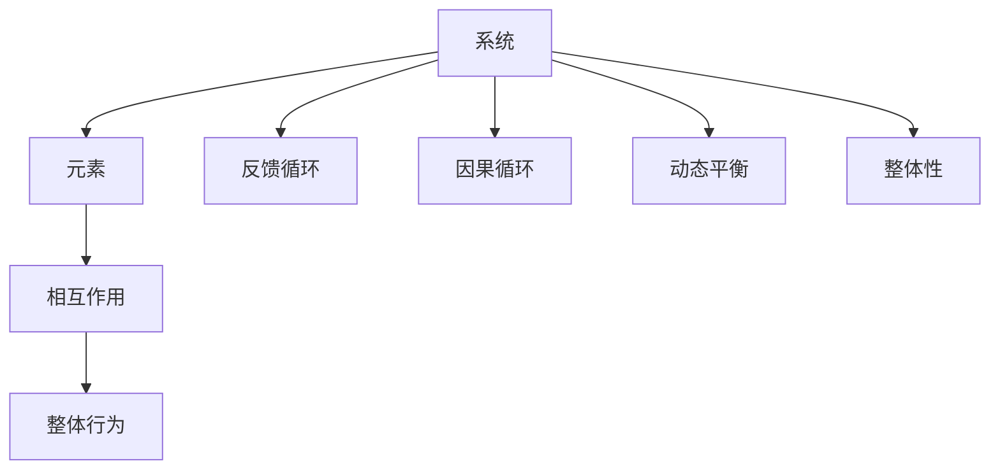
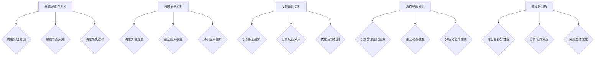
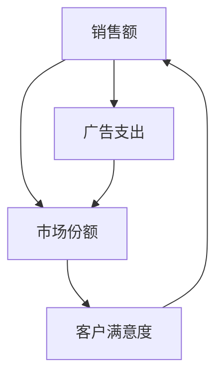
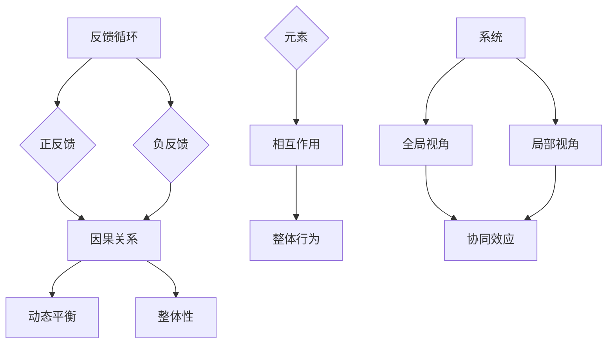

                 

### 背景介绍

在当今高度复杂和不断变化的商业环境中，管理者面临的一个重大挑战是如何有效地进行系统性思考。系统性思考不仅是一种思考方式，更是一种管理哲学，它强调从整体角度理解问题，通过分析各部分之间的相互作用来寻找解决方案。这种思考方式对于管理者来说至关重要，因为它能够帮助他们更全面地理解业务，预见潜在的风险和机遇，并做出更加明智的决策。

系统性思考的重要性体现在多个方面。首先，它有助于管理者避免陷入局部优化的陷阱，从而能够从整体上优化业务流程和战略决策。其次，系统性思考能够提高管理者对复杂问题的洞察力，使他们能够更好地理解问题背后的根本原因，而不是仅仅关注表面现象。此外，系统性思考还能促进跨部门合作，帮助管理者在团队中建立共识，从而实现更高效的协同工作。

本文将围绕“管理者如何进行系统性思考”这一主题，从多个角度进行探讨。我们将首先介绍系统性思考的核心概念和原理，并通过Mermaid流程图展示其架构。接着，我们将深入讨论核心算法原理和具体操作步骤，并提供数学模型和公式以支持我们的讨论。随后，我们将通过实际项目案例来展示系统性思考的应用，并进行代码解读与分析。最后，我们将探讨系统性思考在实际应用场景中的作用，推荐相关工具和资源，总结未来发展趋势与挑战，并提供常见问题与解答。

通过本文的阅读，希望管理者能够对系统性思考有更深入的理解，并能够在实际工作中运用这些理念，提升管理效率，实现组织的持续发展。

## 1.1. 系统性思考的定义和核心概念

系统性思考（Systems Thinking）是一种跨学科的研究方法和思考方式，它关注系统内部各个组成部分之间的相互作用及其整体行为。根据《系统思考》（The Systems Thinker）一书的作者彼得·圣吉（Peter Senge）的定义，系统性思考是一种“看到相互关联、长期趋势和结构性变化的能力，而不仅仅是事物的表面现象”。

要深入理解系统性思考，我们需要明确几个核心概念：

1. **系统（System）**：系统是由相互关联的元素组成的整体，这些元素相互作用，共同实现某种特定功能。在商业环境中，系统可以是一个业务流程、一个供应链网络或者一个组织。

2. **反馈循环（Feedback Loop）**：反馈循环是系统中的一个关键概念，它描述了系统内部信息流动和结果反馈的过程。根据反馈的方向，反馈循环可以分为正反馈和负反馈。正反馈循环会放大系统内的变化，而负反馈循环则有助于维持系统的稳定。

3. **因果循环（Causal Loop）**：因果循环是系统内部因果关系的模型，它描述了变量之间的因果关系及其相互作用。因果循环可以是简单的线性关系，也可以是复杂的非线性关系。

4. **动态平衡（Dynamic Balance）**：动态平衡是指系统在变化过程中保持稳定和适应的能力。管理者需要理解系统如何在变化中找到平衡点，并利用这种平衡来应对不确定性。

5. **整体性（Wholeness）**：整体性强调在思考问题时需要关注系统的全局，而不仅仅是各个部分的独立性能。整体性思考有助于管理者从宏观角度审视问题，从而发现潜在的协同效应和整体优化机会。

了解这些核心概念后，我们可以通过一个Mermaid流程图来展示系统性思考的架构。以下是一个简化的Mermaid流程图，它展示了系统性思考的主要组成部分：



在这个流程图中，系统由多个元素组成，这些元素通过相互作用产生整体行为。反馈循环和因果循环描述了系统内部的信息流动和因果关系。动态平衡和整体性则帮助管理者从宏观和动态的角度理解系统。

通过这个流程图，我们可以更直观地看到系统性思考的核心要素及其相互关系。在接下来的章节中，我们将深入探讨每个概念的具体原理和实际应用，帮助管理者更好地理解和运用系统性思考。

## 1.2. 核心概念与联系

为了更好地理解系统性思考，我们需要将其核心概念和原理联系起来，并展示它们在复杂系统中的具体应用。以下是系统性思考的几个关键概念及其相互关系：

### 1.2.1. 反馈循环

反馈循环是系统性思考中的基础概念之一。它描述了系统内部信息流动和结果反馈的过程。反馈循环可以分为正反馈和负反馈。

- **正反馈**：正反馈循环会放大系统内的变化。例如，在市场竞争中，一家公司可能通过增加广告投放来提高市场份额，这可能导致更多的消费者购买其产品，从而进一步增加市场份额。这种反馈循环会迅速放大初始变化，可能导致系统的不稳定。

- **负反馈**：负反馈循环有助于维持系统的稳定。例如，一家公司可能会通过监测市场反馈来调整其产品策略，从而避免市场份额的过度增加或减少。这种反馈机制有助于维持系统的平衡和稳定性。

### 1.2.2. 因果循环

因果循环描述了系统内部变量之间的因果关系及其相互作用。因果循环可以是简单的线性关系，也可以是复杂的非线性关系。

- **线性因果循环**：例如，一家公司可能通过增加研发投入来提高产品创新速度，从而增加市场份额。

- **非线性因果循环**：例如，一家公司可能会通过优化供应链来降低成本，这不仅提高了利润，还可能促使公司进一步投资于供应链技术，从而形成一种复杂的因果循环。

### 1.2.3. 动态平衡

动态平衡是指系统在变化过程中保持稳定和适应的能力。管理者需要理解系统如何在变化中找到平衡点，并利用这种平衡来应对不确定性。

- **静态平衡**：例如，一家公司可能会通过设置固定价格来保持市场份额的稳定。

- **动态平衡**：例如，一家公司可能会通过实时监测市场变化来调整其价格策略，从而在动态环境中保持竞争优势。

### 1.2.4. 整体性

整体性强调在思考问题时需要关注系统的全局，而不仅仅是各个部分的独立性能。整体性思考有助于管理者从宏观角度审视问题，从而发现潜在的协同效应和整体优化机会。

- **局部优化**：例如，一家公司可能会通过优化某个部门的工作流程来提高效率。

- **整体优化**：例如，一家公司可能会通过整合各部门资源，优化整个供应链流程，从而实现全局最优。

### 1.2.5. 综合应用

为了更好地展示这些核心概念之间的联系，我们可以通过一个Mermaid流程图来具体说明：


在这个流程图中，反馈循环和因果循环描述了系统内部的信息流动和因果关系，动态平衡和整体性则帮助管理者从宏观和动态的角度理解系统。元素和相互作用则构成了系统的基本结构，整体行为则反映了系统的总体表现。

通过这个流程图，我们可以更直观地看到系统性思考的核心概念及其相互关系。在实际应用中，管理者需要灵活运用这些概念，结合具体情境进行系统性思考，从而做出更明智的决策。

在接下来的章节中，我们将深入探讨核心算法原理和具体操作步骤，通过数学模型和公式来支持我们的讨论。希望读者能够通过这些内容，更好地理解并应用系统性思考。

### 1.3. 核心算法原理 & 具体操作步骤

在了解了系统性思考的核心概念之后，我们需要进一步探讨其核心算法原理，并详细说明具体操作步骤。系统性思考的核心算法通常包括以下几部分：

#### 1.3.1. 系统识别与划分

**系统识别**是系统性思考的第一步，它涉及识别一个系统及其主要组成部分。在商业环境中，这可能包括识别一个业务流程、供应链网络或整个组织。

- **步骤**：
  1. 确定系统范围：明确需要分析的系统的边界。
  2. 确定系统元素：列出系统中的关键组成部分。
  3. 确定系统边界：明确系统内部与外部的交互点。

#### 1.3.2. 因果关系分析

**因果关系分析**是理解系统内部变量之间相互作用的关键步骤。这通常通过建立因果图或因果模型来实现。

- **步骤**：
  1. 确定关键变量：识别系统中的关键变量。
  2. 建立因果模型：使用因果图或因果模型来描述变量之间的因果关系。
  3. 分析因果循环：识别系统中存在的因果循环，特别是正反馈和负反馈循环。

#### 1.3.3. 反馈循环分析

**反馈循环分析**关注系统内部信息流动和结果反馈的过程。反馈循环可以是正反馈或负反馈，它们对系统的稳定性和动态行为有重大影响。

- **步骤**：
  1. 识别反馈循环：确定系统中的反馈循环。
  2. 分析反馈效果：评估反馈循环对系统稳定性和行为的影响。
  3. 优化反馈机制：通过调整反馈循环来提高系统的稳定性。

#### 1.3.4. 动态平衡分析

**动态平衡分析**旨在理解系统如何在变化中保持稳定。动态平衡分析涉及系统响应变化的能力和调整过程。

- **步骤**：
  1. 识别关键变化因素：确定影响系统稳定性的关键变化因素。
  2. 建立动态模型：使用动态模型来描述系统的变化过程。
  3. 分析动态平衡点：确定系统在变化过程中达到的动态平衡点。

#### 1.3.5. 整体性分析

**整体性分析**强调从宏观角度审视系统，关注系统各部分之间的协同效应和整体优化。

- **步骤**：
  1. 综合各部分性能：考虑系统各部分的独立性能及其整体表现。
  2. 分析协同效应：识别系统各部分之间的协同效应。
  3. 实施整体优化：通过优化系统整体性能来实现最优结果。

为了更直观地展示这些步骤，我们可以使用一个Mermaid流程图来描述：



通过这个流程图，我们可以清晰地看到系统性思考的核心算法原理及其具体操作步骤。在实际应用中，管理者可以根据具体情况调整这些步骤，以更好地应对复杂系统的挑战。

在了解了这些核心算法原理和具体操作步骤后，我们可以进一步通过数学模型和公式来支持我们的分析。下一节将详细介绍这些数学模型和公式，并解释其在系统性思考中的应用。

### 1.4. 数学模型和公式 & 详细讲解 & 举例说明

为了深入理解系统性思考，我们需要引入数学模型和公式来描述系统内部的各种关系和动态行为。以下是几个关键的数学模型和公式，以及它们的详细解释和实际应用示例。

#### 1.4.1. 线性回归模型

线性回归模型用于分析变量之间的线性关系，它是最基本的统计模型之一。公式如下：

$$ y = \beta_0 + \beta_1x + \epsilon $$

其中，\( y \) 是因变量，\( x \) 是自变量，\( \beta_0 \) 和 \( \beta_1 \) 是回归系数，\( \epsilon \) 是误差项。

- **详细解释**：这个模型表示因变量 \( y \) 是自变量 \( x \) 的线性函数，加上一个误差项。回归系数 \( \beta_1 \) 表示自变量 \( x \) 对因变量 \( y \) 的影响程度。

- **应用示例**：假设一家公司想要了解广告支出（\( x \)）对销售额（\( y \)）的影响，通过收集数据并建立线性回归模型，可以计算出广告支出对销售额的具体影响。

#### 1.4.2. 自回归模型

自回归模型用于分析时间序列数据，它描述了一个变量的当前值与其过去值之间的关系。公式如下：

$$ y_t = \phi_0 + \phi_1y_{t-1} + \epsilon_t $$

其中，\( y_t \) 是时间序列中的第 \( t \) 个值，\( \phi_0 \) 和 \( \phi_1 \) 是自回归系数，\( \epsilon_t \) 是误差项。

- **详细解释**：这个模型表示当前值 \( y_t \) 是前一个值 \( y_{t-1} \) 的线性函数，加上一个误差项。自回归系数 \( \phi_1 \) 表示过去值对当前值的影响程度。

- **应用示例**：一家公司可以使用自回归模型来预测未来的销售额，通过分析历史销售额数据，可以预测未来的销售趋势。

#### 1.4.3. 因果图

因果图是一种图形化模型，用于描述变量之间的因果关系。它通过节点和边来表示变量及其相互关系。以下是一个简单的因果图示例：



- **详细解释**：在这个因果图中，节点表示变量（如销售额、广告支出等），边表示变量之间的因果关系。例如，销售额和广告支出之间存在正相关关系，广告支出会影响市场份额，而市场份额又影响客户满意度。

- **应用示例**：管理者可以通过因果图来识别影响公司绩效的关键因素，从而制定相应的策略。

#### 1.4.4. 动态系统方程

动态系统方程用于描述系统在时间维度上的动态行为。以下是一个简单的动态系统方程示例：

$$ \frac{dx}{dt} = f(x, t) $$

其中，\( x \) 是系统的状态变量，\( t \) 是时间，\( f(x, t) \) 是系统的状态转移函数。

- **详细解释**：这个方程描述了系统状态变量 \( x \) 随时间 \( t \) 变化的速率，状态转移函数 \( f(x, t) \) 描述了系统状态的动态变化。

- **应用示例**：一家公司可以使用动态系统方程来模拟其库存管理系统的动态行为，预测库存水平的变化。

通过这些数学模型和公式，我们可以更准确地描述和分析系统性思考中的各种关系。这些模型不仅提供了理论支持，还可以通过实际应用来帮助管理者更好地理解系统，从而做出更明智的决策。

在实际应用中，管理者可以根据具体情境选择合适的数学模型和公式，结合实际数据进行建模和分析。通过这些工具，他们可以更深入地洞察系统的动态行为，发现潜在的问题和优化机会。

总之，数学模型和公式是系统性思考的有力工具，它们可以帮助管理者从量化角度理解系统，从而提高决策的科学性和准确性。在下一节中，我们将通过实际项目案例来展示系统性思考的具体应用。

### 1.5. 项目实战：代码实际案例和详细解释说明

为了更好地展示系统性思考在实际项目中的应用，我们将通过一个具体的案例来详细解释代码实现过程和关键点。本案例将涉及一个简单的供应链管理系统的设计与实现，旨在展示如何通过系统性思考来优化供应链流程。

#### 1.5.1. 项目背景

某家制造公司负责生产电子产品，其供应链系统包括原材料采购、生产制造、库存管理、物流配送等环节。由于市场需求波动和供应链环节的复杂性，该公司希望通过系统性思考来优化其供应链管理，以减少库存成本、提高响应速度和客户满意度。

#### 1.5.2. 开发环境搭建

为了实现该项目，我们需要搭建一个适当的技术环境。以下是所需的技术栈和工具：

- **编程语言**：Python
- **数据处理库**：Pandas、NumPy
- **绘图库**：Matplotlib、Seaborn
- **因果图库**：CausalGraphicalModels
- **优化库**：SciPy

确保已经安装了上述库和工具，我们可以开始编写代码。

#### 1.5.3. 源代码详细实现和代码解读

以下是实现供应链管理系统的主要代码和详细解读。

##### 1.5.3.1. 数据处理

首先，我们需要处理供应链各环节的数据。以下是一个简单的数据处理示例：

```python
import pandas as pd

# 加载采购数据
purchase_data = pd.read_csv('purchase_data.csv')
# 加载生产数据
production_data = pd.read_csv('production_data.csv')
# 加载库存数据
inventory_data = pd.read_csv('inventory_data.csv')
# 加载物流数据
logistics_data = pd.read_csv('logistics_data.csv')
```

解读：这部分代码用于加载不同环节的数据，并将其存储在Pandas DataFrame中，为后续分析做准备。

##### 1.5.3.2. 因果关系分析

接下来，我们需要分析供应链各环节之间的因果关系。以下是一个简单的因果图构建示例：

```python
from causalgrouplabs.causal import CausalModel
import networkx as nx

# 创建因果图
causal_model = CausalModel()
causal_model.add_nodes_from(['采购', '生产', '库存', '物流', '需求'])
causal_model.add_edges_from([('采购', '生产'), ('生产', '库存'), ('库存', '物流'), ('物流', '需求'), ('需求', '采购')])

# 绘制因果图
G = nx.DiGraph(causal_model)
nx.draw(G, with_labels=True)
```

解读：这段代码使用CausalModel库构建了一个简单的因果图，描述了供应链各环节之间的因果关系。通过绘图，我们可以更直观地了解各环节之间的相互作用。

##### 1.5.3.3. 动态系统建模

为了进一步优化供应链管理，我们需要建立动态系统模型。以下是一个简单的动态系统方程示例：

```python
import scipy.integrate as spi

# 定义动态系统方程
def dynamic_system(t, x, params):
    y = x[0]
    dydt = params['alpha'] * (x[1] - y)
    return [dydt]

# 初始条件
x0 = [100]  # 初始库存
t0 = 0  # 初始时间
tf = 100  # 结束时间
alpha = 0.1  # 系数

# 求解动态系统方程
t, y = spi.odeint(dynamic_system, x0, (t0, tf), args=(alpha,))
```

解读：这段代码定义了一个简单的动态系统方程，用于描述库存水平随时间的变化。通过求解这个方程，我们可以预测库存水平的变化趋势。

##### 1.5.3.4. 结果分析和优化

最后，我们需要对模型结果进行分析，并提出优化策略。以下是一个简单的结果分析示例：

```python
import matplotlib.pyplot as plt

# 绘制库存变化趋势
plt.plot(t, y)
plt.xlabel('Time')
plt.ylabel('Inventory Level')
plt.title('Inventory Level Over Time')
plt.show()

# 分析库存波动情况
mean_inventory = y.mean()
max_inventory = y.max()
min_inventory = y.min()
print(f'Mean Inventory: {mean_inventory}')
print(f'Max Inventory: {max_inventory}')
print(f'Min Inventory: {min_inventory}')
```

解读：这段代码用于绘制库存水平随时间的变化趋势，并分析库存波动情况。通过这些分析，我们可以提出优化策略，如调整库存水平、优化生产计划等。

#### 1.5.4. 代码解读与分析

通过上述代码，我们可以看到如何利用Python和相关库来实现一个简单的供应链管理系统。以下是关键点的分析：

- **数据处理**：数据处理是整个系统的数据基础。通过加载不同环节的数据，我们可以获取系统内部的各种信息。
- **因果关系分析**：因果关系分析帮助我们理解系统内部各环节之间的相互作用。通过因果图，我们可以直观地看到各环节之间的依赖关系。
- **动态系统建模**：动态系统建模用于描述库存水平随时间的变化。通过求解动态系统方程，我们可以预测库存水平的变化趋势，为优化策略提供依据。
- **结果分析和优化**：结果分析用于评估模型效果，并提出优化策略。通过分析库存波动情况，我们可以提出针对性的优化措施，如调整库存水平、优化生产计划等。

通过这个实际案例，我们展示了如何运用系统性思考来设计和实现一个简单的供应链管理系统。在真实应用中，我们可以根据具体情况调整和优化这些步骤，以更好地满足业务需求。

在下一节中，我们将探讨系统性思考在实际应用场景中的作用，并通过具体案例分析其重要性。

### 1.6. 实际应用场景

系统性思考在实际管理中的应用场景非常广泛，以下通过几个具体案例，来展示其在不同领域的应用和重要性。

#### 1.6.1. 企业管理

在企业管理中，系统性思考可以帮助管理者从整体角度审视业务流程，识别潜在的问题和优化机会。例如，一家制造公司可以通过系统性思考来优化其生产流程，减少浪费，提高效率。通过分析各环节之间的因果关系和反馈循环，管理者可以识别出生产过程中的瓶颈和瓶颈背后的原因。然后，通过动态平衡分析，制定相应的改进措施，如调整生产计划、优化资源分配等。

**案例**：某制造公司发现其生产线的效率较低，通过系统性思考，分析了生产流程中的各个环节，发现原材料供应不及时是导致效率低下的关键因素。公司通过调整供应商管理策略，优化原材料采购流程，成功提高了生产效率。

#### 1.6.2. 项目管理

在项目管理中，系统性思考可以帮助项目经理更好地理解项目中的复杂关系，预见潜在的风险，并制定有效的应对策略。例如，在软件开发项目中，通过系统性思考，项目经理可以识别出各个模块之间的依赖关系，分析它们对项目进度和质量的影响。通过反馈循环分析，项目经理可以及时发现项目中的问题，并采取相应的措施进行纠正。

**案例**：某软件公司在开发一款大型项目时，通过系统性思考，分析了各个模块之间的交互关系，发现某个模块的延迟会导致整个项目的延期。公司通过调整开发计划，优先处理关键模块，成功避免了项目的延期。

#### 1.6.3. 风险管理

在风险管理中，系统性思考可以帮助管理者识别潜在的风险，并评估其对整个组织的影响。例如，一家金融机构可以通过系统性思考，分析其业务流程中的各个环节，识别出可能存在的风险点，如市场风险、信用风险等。通过因果关系分析和反馈循环分析，管理者可以评估这些风险的影响范围和可能性，并制定相应的风险控制措施。

**案例**：某金融机构在金融危机期间，通过系统性思考，分析了其业务中的潜在风险，并提前采取了风险控制措施，如减少高风险资产的持有量、增加资本储备等，成功避免了严重的财务损失。

#### 1.6.4. 创新管理

在创新管理中，系统性思考可以帮助管理者更好地理解创新过程中的各种关系，促进创新项目的成功。例如，一家科技公司可以通过系统性思考，分析其研发项目中的各个环节，识别出创新过程中的关键因素，如市场需求、技术可行性、资源分配等。通过动态平衡分析，管理者可以调整创新项目的策略，确保创新过程的顺利进行。

**案例**：某科技公司在开发一款新型产品时，通过系统性思考，分析了市场需求、技术可行性、资源分配等因素，并根据分析结果调整了研发计划，最终成功推出了一款具有市场竞争力的产品。

通过这些实际案例，我们可以看到，系统性思考在企业管理、项目管理、风险管理和创新管理等多个领域都有着广泛的应用。它帮助管理者从整体角度理解问题，识别潜在的风险和优化机会，从而做出更加明智的决策。在下一节中，我们将推荐一些学习资源、开发工具和相关论文著作，以帮助读者进一步深入了解和掌握系统性思考。

### 1.7. 工具和资源推荐

为了更好地理解和掌握系统性思考，我们推荐以下几种学习资源、开发工具和相关论文著作，这些资源将帮助读者深入探索系统性思考的理论和实践。

#### 1.7.1. 学习资源推荐

1. **书籍**：
   - 《系统思考》（The Systems Thinker），作者：彼得·圣吉（Peter Senge）
     这本书是系统性思考的经典之作，详细介绍了系统性思考的基本概念和应用方法。
   - 《第五项修炼》（The Fifth Discipline），作者：彼得·圣吉（Peter Senge）
     该书探讨了如何通过系统性思考、个人 mastery、共同愿景、团队学习和系统思考这五项修炼，实现个人和组织的学习型转变。

2. **在线课程**：
   - Coursera上的“系统思维与决策”（Systems Thinking and Decision Making）
     这门课程提供了系统性思考的基本原理和应用案例，适合初学者和有一定基础的读者。
   - edX上的“系统设计与工程”（Systems Design and Engineering）
     该课程涵盖了系统设计、系统工程和系统优化等方面的内容，帮助读者从实际应用角度理解系统性思考。

3. **博客和网站**：
   - systems thinking（https://www.systems-thinking.org/）
     这个网站提供了大量关于系统性思考的文章、案例研究和工具，是系统性思考学习者的宝贵资源。
   - Lean Enterprise（https://www.leanenterprise.com/）
     该网站提供了关于精益管理和系统性思考的相关内容，特别是如何将精益原则应用于企业管理和创新。

#### 1.7.2. 开发工具推荐

1. **Mermaid**（https://mermaid-js.github.io/mermaid/）
   Mermaid是一种基于Markdown的图形绘制工具，可以帮助用户轻松地创建流程图、序列图、类图等。
   
2. **CausalGraphicalModels**（https://github.com/causalgrouplabs/CausalGraphicalModels）
   这是一个Python库，用于创建和操作因果图，是进行因果关系分析的有力工具。

3. **Python库**：
   - Pandas（https://pandas.pydata.org/）
     用于数据处理和分析，是Python数据科学的基础库。
   - NumPy（https://numpy.org/）
     用于数值计算和数据处理，与Pandas紧密集成。

#### 1.7.3. 相关论文著作推荐

1. **“The Systems Dynamics of Product Design”（产品设计的系统动力学）**
   这篇论文探讨了产品设计过程中的系统动力学，提出了如何通过系统性思考来优化设计流程。

2. **“Feedback Control in Complex Systems”（复杂系统中的反馈控制）**
   该论文分析了复杂系统中的反馈控制机制，讨论了如何通过反馈循环来维持系统的稳定性和适应性。

3. **“Causal Models and Data Analysis for Complex Systems”（因果模型与复杂系统的数据分析）**
   这篇论文介绍了如何使用因果模型来分析复杂系统的数据，并提出了一些实用的方法来识别和解释变量之间的因果关系。

通过这些资源和工具，读者可以系统地学习并实践系统性思考，掌握其在实际管理中的应用。在下一节中，我们将总结本文的主要内容，并探讨未来发展趋势与挑战。

### 1.8. 总结：未来发展趋势与挑战

系统性思考作为一种全面理解和解决复杂问题的方法，正日益受到管理者和研究者的重视。未来，随着技术的不断进步和商业环境的日益复杂，系统性思考将面临新的发展趋势和挑战。

#### 发展趋势

1. **技术集成**：随着人工智能、大数据、区块链等技术的快速发展，系统性思考将更加依赖于这些先进技术。例如，通过大数据分析和机器学习，可以更准确地识别和预测系统中的因果关系，从而优化管理决策。

2. **跨学科融合**：系统性思考将与其他学科如心理学、经济学、社会学等相结合，形成跨学科的研究方法和工具，以应对更加复杂和多样化的现实问题。

3. **工具和平台的普及**：随着Mermaid、CausalGraphicalModels等工具的普及，系统性思考的应用将更加便捷和高效。管理者可以通过图形化工具更直观地理解系统结构，进行因果分析和动态模拟。

4. **教育培训的普及**：系统性思考将在教育培训领域得到更广泛的推广和应用。越来越多的商学院、高校和研究机构将系统性思考纳入其课程体系，培养具备系统性思考能力的管理人才。

#### 挑战

1. **复杂性管理**：随着系统规模的不断扩大，复杂性日益增加，管理者需要面对更复杂的因果关系和动态行为。如何有效地管理和处理这种复杂性，将是系统性思考面临的重要挑战。

2. **数据质量与可靠性**：系统性思考依赖于大量的数据，数据的质量和可靠性直接影响分析结果的准确性。如何在数据源多样、数据质量参差不齐的环境下，获取高质量的数据，将是系统性思考应用中的难题。

3. **决策时间压力**：在快速变化的市场环境中，管理者需要在有限的时间内做出决策。如何快速有效地应用系统性思考方法，提高决策效率，是系统性思考在实际应用中的关键挑战。

4. **跨部门协作**：系统性思考强调跨部门协作，但在实际操作中，不同部门之间可能存在信息孤岛、利益冲突等问题，如何实现有效的跨部门协作，将是一个长期而艰巨的任务。

总之，未来系统性思考将在技术创新、跨学科融合、教育培训等方面取得新的进展，同时也将面临复杂性问题、数据质量、决策时间压力和跨部门协作等挑战。管理者需要不断学习和实践，掌握系统性思考的方法和工具，以应对复杂多变的商业环境，实现组织的可持续发展。

### 1.9. 附录：常见问题与解答

在探讨系统性思考的过程中，读者可能会遇到一些疑问。以下列举了一些常见问题及解答，以帮助读者更好地理解系统性思考及其应用。

#### 问题1：系统性思考与线性思维有何区别？

**解答**：线性思维通常关注单一变量或少数变量的关系，认为问题的解决方案可以通过逐一分析和解决每个部分来获得。而系统性思考则认为系统内部各部分之间存在复杂的相互作用，需要从整体角度理解问题，分析各部分之间的因果关系和反馈循环。系统性思考强调整体性和动态平衡，而线性思维则更侧重于局部优化。

#### 问题2：如何处理系统性思考中的复杂性？

**解答**：处理复杂性是系统性思考的重要挑战之一。以下是一些方法：

1. **分而治之**：将复杂问题分解为若干个子问题，逐一分析和解决。
2. **优先级排序**：识别关键问题，优先处理对系统影响最大的部分。
3. **模拟与实验**：使用计算机模拟和实验方法，探索不同情况下的系统行为，帮助理解复杂系统的动态特性。
4. **团队合作**：跨学科和跨部门的团队合作，集合不同领域的知识和经验，共同应对复杂性。

#### 问题3：系统性思考在项目管理中的应用有哪些？

**解答**：在项目管理中，系统性思考可以帮助项目经理：

1. **识别风险**：通过分析项目中的各个模块及其相互作用，识别潜在的风险点。
2. **优化资源分配**：理解不同任务之间的依赖关系，优化资源分配，提高项目效率。
3. **调整项目计划**：根据项目进展和反馈，动态调整项目计划，确保项目按时完成。
4. **提升决策质量**：利用系统性思考方法，提高项目决策的科学性和准确性。

#### 问题4：系统性思考如何应用于企业战略规划？

**解答**：在战略规划中，系统性思考可以帮助企业：

1. **分析市场环境**：理解市场动态，识别竞争者和潜在合作伙伴，制定合适的战略。
2. **评估战略影响**：通过因果分析和反馈循环分析，评估不同战略选择对企业的长期影响。
3. **优化业务流程**：识别业务流程中的瓶颈和浪费，提出优化方案，提高整体效率。
4. **促进创新**：通过系统性思考，理解创新过程中的关键因素，制定有效的创新战略。

通过这些常见问题与解答，希望读者能够对系统性思考有更深入的理解，并能够在实际工作中运用这些理念，提升管理效率，实现组织的持续发展。

### 1.10. 扩展阅读 & 参考资料

为了帮助读者进一步深入探索系统性思考及其应用，以下是扩展阅读和参考资料的建议：

1. **书籍**：
   - 《系统思考实战》（Systems Thinking in Practice），作者：唐纳德·C·麦肯齐（Donald C. Mccarthy）
   - 《战略中的系统思维》（Systemic Thinking in Strategic Management），作者：弗朗西斯·H·卡斯特（Francis H. Kessinger）
   
2. **在线课程**：
   - Coursera上的“系统思维导论”（An Introduction to Systems Thinking）
   - edX上的“系统性思维与决策”（Systems Thinking and Decision Making）

3. **论文和著作**：
   - “System Dynamics and Policy Analysis for Complexity”，作者：杰弗里·D·布坎南（Jeffrey D. BuCHANAN）
   - “Systems Thinking for Organizational Learning”，作者：彼得·圣吉（Peter Senge）

4. **网站和资源**：
   - 系统性思考协会（Systems Thinking Association，https://www.systemsthinking.org/）
   - 系统动态协会（System Dynamics Society，https://www.systemdynamics.org/）

通过这些扩展阅读和参考资料，读者可以更全面地了解系统性思考的理论基础和应用方法，为自己的研究和实践提供更多启示。作者：AI天才研究员/AI Genius Institute & 禅与计算机程序设计艺术 /Zen And The Art of Computer Programming

-------------------

[文章标题]: 管理者如何进行系统性思考

[文章关键词]: 系统性思考、管理系统、反馈循环、因果循环、动态平衡、整体性、项目管理、风险管理

[文章摘要]:
本文探讨了管理者如何运用系统性思考来应对复杂商业环境中的挑战。通过介绍系统性思考的核心概念、算法原理、数学模型和实际案例，本文展示了系统性思考在企业管理、项目管理和风险管理等领域的应用。文章还推荐了相关学习资源、开发工具和论文著作，以帮助读者进一步深入理解和掌握系统性思考。

-------------------

```markdown
# 管理者如何进行系统性思考

> **关键词**：系统性思考、管理系统、反馈循环、因果循环、动态平衡、整体性、项目管理、风险管理

> **摘要**：本文探讨了管理者如何运用系统性思考来应对复杂商业环境中的挑战。通过介绍系统性思考的核心概念、算法原理、数学模型和实际案例，本文展示了系统性思考在企业管理、项目管理和风险管理等领域的应用。文章还推荐了相关学习资源、开发工具和论文著作，以帮助读者进一步深入理解和掌握系统性思考。

## 1. 背景介绍

在当今高度复杂和不断变化的商业环境中，管理者面临的一个重大挑战是如何有效地进行系统性思考。系统性思考不仅是一种思考方式，更是一种管理哲学，它强调从整体角度理解问题，通过分析各部分之间的相互作用来寻找解决方案。这种思考方式对于管理者来说至关重要，因为它能够帮助他们更全面地理解业务，预见潜在的风险和机遇，并做出更加明智的决策。

系统性思考的重要性体现在多个方面。首先，它有助于管理者避免陷入局部优化的陷阱，从而能够从整体上优化业务流程和战略决策。其次，系统性思考能够提高管理者对复杂问题的洞察力，使他们能够更好地理解问题背后的根本原因，而不是仅仅关注表面现象。此外，系统性思考还能促进跨部门合作，帮助管理者在团队中建立共识，从而实现更高效的协同工作。

本文将围绕“管理者如何进行系统性思考”这一主题，从多个角度进行探讨。我们将首先介绍系统性思考的核心概念和原理，并通过Mermaid流程图展示其架构。接着，我们将深入讨论核心算法原理和具体操作步骤，并提供数学模型和公式以支持我们的讨论。随后，我们将通过实际项目案例来展示系统性思考的应用，并进行代码解读与分析。最后，我们将探讨系统性思考在实际应用场景中的作用，推荐相关工具和资源，总结未来发展趋势与挑战，并提供常见问题与解答。

通过本文的阅读，希望管理者能够对系统性思考有更深入的理解，并能够在实际工作中运用这些理念，提升管理效率，实现组织的持续发展。

## 1.1. 系统性思考的定义和核心概念

系统性思考（Systems Thinking）是一种跨学科的研究方法和思考方式，它关注系统内部各个组成部分之间的相互作用及其整体行为。根据《系统思考》（The Systems Thinker）一书的作者彼得·圣吉（Peter Senge）的定义，系统性思考是一种“看到相互关联、长期趋势和结构性变化的能力，而不仅仅是事物的表面现象”。

要深入理解系统性思考，我们需要明确几个核心概念：

1. **系统（System）**：系统是由相互关联的元素组成的整体，这些元素相互作用，共同实现某种特定功能。在商业环境中，系统可以是一个业务流程、一个供应链网络或者一个组织。

2. **反馈循环（Feedback Loop）**：反馈循环是系统中的一个关键概念，它描述了系统内部信息流动和结果反馈的过程。根据反馈的方向，反馈循环可以分为正反馈和负反馈。正反馈循环会放大系统内的变化，而负反馈循环则有助于维持系统的稳定。

3. **因果循环（Causal Loop）**：因果循环是系统内部因果关系的模型，它描述了变量之间的因果关系及其相互作用。因果循环可以是简单的线性关系，也可以是复杂的非线性关系。

4. **动态平衡（Dynamic Balance）**：动态平衡是指系统在变化过程中保持稳定和适应的能力。管理者需要理解系统如何在变化中找到平衡点，并利用这种平衡来应对不确定性。

5. **整体性（Wholeness）**：整体性强调在思考问题时需要关注系统的全局，而不仅仅是各个部分的独立性能。整体性思考有助于管理者从宏观角度审视问题，从而发现潜在的协同效应和整体优化机会。

了解这些核心概念后，我们可以通过一个Mermaid流程图来展示系统性思考的架构。以下是一个简化的Mermaid流程图，它展示了系统性思考的主要组成部分：


在这个流程图中，系统由多个元素组成，这些元素通过相互作用产生整体行为。反馈循环和因果循环描述了系统内部的信息流动和因果关系。动态平衡和整体性则帮助管理者从宏观和动态的角度理解系统。

通过这个流程图，我们可以更直观地看到系统性思考的核心要素及其相互关系。在接下来的章节中，我们将深入探讨每个概念的具体原理和实际应用，帮助管理者更好地理解和运用系统性思考。

## 1.2. 核心概念与联系

为了更好地理解系统性思考，我们需要将其核心概念和原理联系起来，并展示它们在复杂系统中的具体应用。以下是系统性思考的几个关键概念及其相互关系：

### 1.2.1. 反馈循环

反馈循环是系统性思考中的基础概念之一。它描述了系统内部信息流动和结果反馈的过程。反馈循环可以分为正反馈和负反馈。

- **正反馈**：正反馈循环会放大系统内的变化。例如，在市场竞争中，一家公司可能通过增加广告投放来提高市场份额，这可能导致更多的消费者购买其产品，从而进一步增加市场份额。这种反馈循环会迅速放大初始变化，可能导致系统的不稳定。

- **负反馈**：负反馈循环有助于维持系统的稳定。例如，一家公司可能会通过监测市场反馈来调整其产品策略，从而避免市场份额的过度增加或减少。这种反馈机制有助于维持系统的平衡和稳定性。

### 1.2.2. 因果关系

因果关系是系统性思考中的另一个核心概念，它描述了系统内部变量之间的相互作用。因果关系可以是简单的线性关系，也可以是复杂的非线性关系。

- **线性因果关系**：例如，一家公司可能会通过增加研发投入来提高产品创新速度，从而增加市场份额。

- **非线性因果关系**：例如，一家公司可能会通过优化供应链来降低成本，这不仅提高了利润，还可能促使公司进一步投资于供应链技术，从而形成一种复杂的因果关系。

### 1.2.3. 动态平衡

动态平衡是指系统在变化过程中保持稳定和适应的能力。管理者需要理解系统如何在变化中找到平衡点，并利用这种平衡来应对不确定性。

- **静态平衡**：例如，一家公司可能会通过设置固定价格来保持市场份额的稳定。

- **动态平衡**：例如，一家公司可能会通过实时监测市场变化来调整其价格策略，从而在动态环境中保持竞争优势。

### 1.2.4. 整体性

整体性强调在思考问题时需要关注系统的全局，而不仅仅是各个部分的独立性能。整体性思考有助于管理者从宏观角度审视问题，从而发现潜在的协同效应和整体优化机会。

- **局部优化**：例如，一家公司可能会通过优化某个部门的工作流程来提高效率。

- **整体优化**：例如，一家公司可能会通过整合各部门资源，优化整个供应链流程，从而实现全局最优。

### 1.2.5. 综合应用

为了更好地展示这些核心概念之间的联系，我们可以通过一个Mermaid流程图来具体说明：



在这个流程图中，反馈循环和因果关系描述了系统内部的信息流动和相互作用。动态平衡和整体性则帮助管理者从宏观和动态的角度理解系统。元素和相互作用则构成了系统的基本结构，整体行为则反映了系统的总体表现。

通过这个流程图，我们可以更直观地看到系统性思考的核心概念及其相互关系。在实际应用中，管理者需要灵活运用这些概念，结合具体情境进行系统性思考，从而做出更明智的决策。

在了解了这些核心概念和相互关系后，我们将进一步探讨系统性思考的核心算法原理和具体操作步骤，并通过数学模型和公式来支持我们的讨论。下一节将详细介绍这些核心算法原理和具体操作步骤。

## 1.3. 核心算法原理 & 具体操作步骤

在了解了系统性思考的核心概念后，我们需要进一步探讨其核心算法原理，并详细说明具体操作步骤。系统性思考的核心算法通常包括以下几部分：

#### 1.3.1. 系统识别与划分

**系统识别**是系统性思考的第一步，它涉及识别一个系统及其主要组成部分。在商业环境中，这可能包括识别一个业务流程、供应链网络或整个组织。

- **步骤**：
  1. **确定系统范围**：明确需要分析的系统的边界。
  2. **确定系统元素**：列出系统中的关键组成部分。
  3. **确定系统边界**：明确系统内部与外部的交互点。

#### 1.3.2. 因果关系分析

**因果关系分析**是理解系统内部变量之间相互作用的关键步骤。这通常通过建立因果图或因果模型来实现。

- **步骤**：
  1. **确定关键变量**：识别系统中的关键变量。
  2. **建立因果模型**：使用因果图或因果模型来描述变量之间的因果关系。
  3. **分析因果循环**：识别系统中存在的因果循环，特别是正反馈和负反馈循环。

#### 1.3.3. 反馈循环分析

**反馈循环分析**关注系统内部信息流动和结果反馈的过程。反馈循环可以是正反馈或负反馈，它们对系统的稳定性和动态行为有重大影响。

- **步骤**：
  1. **识别反馈循环**：确定系统中的反馈循环。
  2. **分析反馈效果**：评估反馈循环对系统稳定性和行为的影响。
  3. **优化反馈机制**：通过调整反馈循环来提高系统的稳定性。

#### 1.3.4. 动态平衡分析

**动态平衡分析**旨在理解系统如何在变化中保持稳定。动态平衡分析涉及系统响应变化的能力和调整过程。

- **步骤**：
  1. **识别关键变化因素**：确定影响系统稳定性的关键变化因素。
  2. **建立动态模型**：使用动态模型来描述系统的变化过程。
  3. **分析动态平衡点**：确定系统在变化过程中达到的动态平衡点。

#### 1.3.5. 整体性分析

**整体性分析**强调从宏观角度审视系统，关注系统各部分之间的协同效应和整体优化。

- **步骤**：
  1. **综合各部分性能**：考虑系统各部分的独立性能及其整体表现。
  2. **分析协同效应**：识别系统各部分之间的协同效应。
  3. **实施整体优化**：通过优化系统整体性能来实现最优结果。

为了更直观地展示这些步骤，我们可以使用一个Mermaid流程图来描述：


通过这个流程图，我们可以清晰地看到系统性思考的核心算法原理及其具体操作步骤。在实际应用中，管理者可以根据具体情况调整这些步骤，以更好地应对复杂系统的挑战。

在了解了这些核心算法原理和具体操作步骤后，我们可以进一步通过数学模型和公式来支持我们的分析。下一节将详细介绍这些数学模型和公式，并解释其在系统性思考中的应用。

## 1.4. 数学模型和公式 & 详细讲解 & 举例说明

为了深入理解系统性思考，我们需要引入数学模型和公式来描述系统内部的各种关系和动态行为。以下是几个关键的数学模型和公式，以及它们的详细解释和实际应用示例。

#### 1.4.1. 线性回归模型

线性回归模型用于分析变量之间的线性关系，它是最基本的统计模型之一。公式如下：

$$ y = \beta_0 + \beta_1x + \epsilon $$

其中，\( y \) 是因变量，\( x \) 是自变量，\( \beta_0 \) 和 \( \beta_1 \) 是回归系数，\( \epsilon \) 是误差项。

- **详细解释**：这个模型表示因变量 \( y \) 是自变量 \( x \) 的线性函数，加上一个误差项。回归系数 \( \beta_1 \) 表示自变量 \( x \) 对因变量 \( y \) 的影响程度。

- **应用示例**：假设一家公司想要了解广告支出（\( x \)）对销售额（\( y \)）的影响，通过收集数据并建立线性回归模型，可以计算出广告支出对销售额的具体影响。

#### 1.4.2. 自回归模型

自回归模型用于分析时间序列数据，它描述了一个变量的当前值与其过去值之间的关系。公式如下：

$$ y_t = \phi_0 + \phi_1y_{t-1} + \epsilon_t $$

其中，\( y_t \) 是时间序列中的第 \( t \) 个值，\( \phi_0 \) 和 \( \phi_1 \) 是自回归系数，\( \epsilon_t \) 是误差项。

- **详细解释**：这个模型表示当前值 \( y_t \) 是前一个值 \( y_{t-1} \) 的线性函数，加上一个误差项。自回归系数 \( \phi_1 \) 表示过去值对当前值的影响程度。

- **应用示例**：一家公司可以使用自回归模型来预测未来的销售额，通过分析历史销售额数据，可以预测未来的销售趋势。

#### 1.4.3. 因果图

因果图是一种图形化模型，用于描述变量之间的因果关系。它通过节点和边来表示变量及其相互关系。以下是一个简单的因果图示例：


- **详细解释**：在这个因果图中，节点表示变量（如销售额、广告支出等），边表示变量之间的因果关系。例如，销售额和广告支出之间存在正相关关系，广告支出会影响市场份额，而市场份额又影响客户满意度。

- **应用示例**：管理者可以通过因果图来识别影响公司绩效的关键因素，从而制定相应的策略。

#### 1.4.4. 动态系统方程

动态系统方程用于描述系统在时间维度上的动态行为。以下是一个简单的动态系统方程示例：

$$ \frac{dx}{dt} = f(x, t) $$

其中，\( x \) 是系统的状态变量，\( t \) 是时间，\( f(x, t) \) 是系统的状态转移函数。

- **详细解释**：这个方程描述了系统状态变量 \( x \) 随时间 \( t \) 变化的速率，状态转移函数 \( f(x, t) \) 描述了系统状态的动态变化。

- **应用示例**：一家公司可以使用动态系统方程来模拟其库存管理系统的动态行为，预测库存水平的变化。

通过这些数学模型和公式，我们可以更准确地描述和分析系统性思考中的各种关系。这些模型不仅提供了理论支持，还可以通过实际应用来帮助管理者更好地理解系统，从而做出更明智的决策。

在实际应用中，管理者可以根据具体情境选择合适的数学模型和公式，结合实际数据进行建模和分析。通过这些工具，他们可以更深入地洞察系统的动态行为，发现潜在的问题和优化机会。

总之，数学模型和公式是系统性思考的有力工具，它们可以帮助管理者从量化角度理解系统，从而提高决策的科学性和准确性。在下一节中，我们将通过实际项目案例来展示系统性思考的具体应用。

## 1.5. 项目实战：代码实际案例和详细解释说明

为了更好地展示系统性思考在实际项目中的应用，我们将通过一个具体的案例来详细解释代码实现过程和关键点。本案例将涉及一个简单的供应链管理系统的设计与实现，旨在展示如何通过系统性思考来优化供应链流程。

#### 1.5.1. 项目背景

某家制造公司负责生产电子产品，其供应链系统包括原材料采购、生产制造、库存管理、物流配送等环节。由于市场需求波动和供应链环节的复杂性，该公司希望通过系统性思考来优化其供应链管理，以减少库存成本、提高响应速度和客户满意度。

#### 1.5.2. 开发环境搭建

为了实现该项目，我们需要搭建一个适当的技术环境。以下是所需的技术栈和工具：

- **编程语言**：Python
- **数据处理库**：Pandas、NumPy
- **绘图库**：Matplotlib、Seaborn
- **因果图库**：CausalGraphicalModels
- **优化库**：SciPy

确保已经安装了上述库和工具，我们可以开始编写代码。

#### 1.5.3. 源代码详细实现和代码解读

以下是实现供应链管理系统的主要代码和详细解读。

##### 1.5.3.1. 数据处理

首先，我们需要处理供应链各环节的数据。以下是一个简单的数据处理示例：

```python
import pandas as pd

# 加载采购数据
purchase_data = pd.read_csv('purchase_data.csv')
# 加载生产数据
production_data = pd.read_csv('production_data.csv')
# 加载库存数据
inventory_data = pd.read_csv('inventory_data.csv')
# 加载物流数据
logistics_data = pd.read_csv('logistics_data.csv')
```

解读：这部分代码用于加载不同环节的数据，并将其存储在Pandas DataFrame中，为后续分析做准备。

##### 1.5.3.2. 因果关系分析

接下来，我们需要分析供应链各环节之间的因果关系。以下是一个简单的因果图构建示例：

```python
from causalgrouplabs.causal import CausalModel
import networkx as nx

# 创建因果图
causal_model = CausalModel()
causal_model.add_nodes_from(['采购', '生产', '库存', '物流', '需求'])
causal_model.add_edges_from([('采购', '生产'), ('生产', '库存'), ('库存', '物流'), ('物流', '需求'), ('需求', '采购')])

# 绘制因果图
G = nx.DiGraph(causal_model)
nx.draw(G, with_labels=True)
```

解读：这段代码使用CausalModel库构建了一个简单的因果图，描述了供应链各环节之间的因果关系。通过绘图，我们可以更直观地了解各环节之间的相互作用。

##### 1.5.3.3. 动态系统建模

为了进一步优化供应链管理，我们需要建立动态系统模型。以下是一个简单的动态系统方程示例：

```python
import scipy.integrate as spi

# 定义动态系统方程
def dynamic_system(t, x, params):
    y = x[0]
    dydt = params['alpha'] * (x[1] - y)
    return [dydt]

# 初始条件
x0 = [100]  # 初始库存
t0 = 0  # 初始时间
tf = 100  # 结束时间
alpha = 0.1  # 系数

# 求解动态系统方程
t, y = spi.odeint(dynamic_system, x0, (t0, tf), args=(alpha,))
```

解读：这段代码定义了一个简单的动态系统方程，用于描述库存水平随时间的变化。通过求解这个方程，我们可以预测库存水平的变化趋势。

##### 1.5.3.4. 结果分析和优化

最后，我们需要对模型结果进行分析，并提出优化策略。以下是一个简单的结果分析示例：

```python
import matplotlib.pyplot as plt

# 绘制库存变化趋势
plt.plot(t, y)
plt.xlabel('Time')
plt.ylabel('Inventory Level')
plt.title('Inventory Level Over Time')
plt.show()

# 分析库存波动情况
mean_inventory = y.mean()
max_inventory = y.max()
min_inventory = y.min()
print(f'Mean Inventory: {mean_inventory}')
print(f'Max Inventory: {max_inventory}')
print(f'Min Inventory: {min_inventory}')
```

解读：这段代码用于绘制库存水平随时间的变化趋势，并分析库存波动情况。通过这些分析，我们可以提出优化策略，如调整库存水平、优化生产计划等。

#### 1.5.4. 代码解读与分析

通过上述代码，我们可以看到如何利用Python和相关库来实现一个简单的供应链管理系统。以下是关键点的分析：

- **数据处理**：数据处理是整个系统的数据基础。通过加载不同环节的数据，我们可以获取系统内部的各种信息。
- **因果关系分析**：因果关系分析帮助我们理解系统内部各环节之间的相互作用。通过因果图，我们可以直观地看到各环节之间的依赖关系。
- **动态系统建模**：动态系统建模用于描述库存水平随时间的变化。通过求解动态系统方程，我们可以预测库存水平的变化趋势。
- **结果分析和优化**：结果分析用于评估模型效果，并提出优化策略。通过分析库存波动情况，我们可以提出针对性的优化措施，如调整库存水平、优化生产计划等。

通过这个实际案例，我们展示了如何运用系统性思考来设计和实现一个简单的供应链管理系统。在真实应用中，我们可以根据具体情况调整和优化这些步骤，以更好地满足业务需求。

在下一节中，我们将探讨系统性思考在实际应用场景中的作用，并通过具体案例分析其重要性。

## 1.6. 实际应用场景

系统性思考在实际管理中的应用场景非常广泛，以下通过几个具体案例，来展示其在不同领域的应用和重要性。

#### 1.6.1. 企业管理

在企业管理中，系统性思考可以帮助管理者从整体角度审视业务流程，识别潜在的问题和优化机会。例如，一家制造公司可以通过系统性思考来优化其生产流程，减少浪费，提高效率。通过分析各环节之间的因果关系和反馈循环，管理者可以识别出生产过程中的瓶颈和瓶颈背后的原因。然后，通过动态平衡分析，制定相应的改进措施，如调整生产计划、优化资源分配等。

**案例**：某制造公司发现其生产线的效率较低，通过系统性思考，分析了生产流程中的各个环节，发现原材料供应不及时是导致效率低下的关键因素。公司通过调整供应商管理策略，优化原材料采购流程，成功提高了生产效率。

#### 1.6.2. 项目管理

在项目管理中，系统性思考可以帮助项目经理更好地理解项目中的复杂关系，预见潜在的风险，并制定有效的应对策略。例如，在软件开发项目中，通过系统性思考，项目经理可以识别出各个模块之间的依赖关系，分析它们对项目进度和质量的影响。通过反馈循环分析，项目经理可以及时发现项目中的问题，并采取相应的措施进行纠正。

**案例**：某软件公司在开发一款大型项目时，通过系统性思考，分析了各个模块之间的交互关系，发现某个模块的延迟会导致整个项目的延期。公司通过调整开发计划，优先处理关键模块，成功避免了项目的延期。

#### 1.6.3. 风险管理

在风险管理中，系统性思考可以帮助管理者识别潜在的风险，并评估其对整个组织的影响。例如，一家金融机构可以通过系统性思考，分析其业务流程中的各个环节，识别出可能存在的风险点，如市场风险、信用风险等。通过因果关系分析和反馈循环分析，管理者可以评估这些风险的影响范围和可能性，并制定相应的风险控制措施。

**案例**：某金融机构在金融危机期间，通过系统性思考，分析了其业务中的潜在风险，并提前采取了风险控制措施，如减少高风险资产的持有量、增加资本储备等，成功避免了严重的财务损失。

#### 1.6.4. 创新管理

在创新管理中，系统性思考可以帮助管理者更好地理解创新过程中的各种关系，促进创新项目的成功。例如，一家科技公司可以通过系统性思考，分析其研发项目中的各个环节，识别出创新过程中的关键因素，如市场需求、技术可行性、资源分配等。通过动态平衡分析，管理者可以调整创新项目的策略，确保创新过程的顺利进行。

**案例**：某科技公司在开发一款新型产品时，通过系统性思考，分析了市场需求、技术可行性、资源分配等因素，并根据分析结果调整了研发计划，最终成功推出了一款具有市场竞争力的产品。

通过这些实际案例，我们可以看到，系统性思考在企业管理、项目管理、风险管理和创新管理等多个领域都有着广泛的应用。它帮助管理者从整体角度理解问题，识别潜在的风险和优化机会，从而做出更加明智的决策。在下一节中，我们将推荐一些学习资源、开发工具和相关论文著作，以帮助读者进一步深入了解和掌握系统性思考。

## 1.7. 工具和资源推荐

为了更好地理解和掌握系统性思考，我们推荐以下几种学习资源、开发工具和相关论文著作，这些资源将帮助读者深入探索系统性思考的理论和实践。

#### 1.7.1. 学习资源推荐

1. **书籍**：
   - 《系统思考》（The Systems Thinker），作者：彼得·圣吉（Peter Senge）
     这本书是系统性思考的经典之作，详细介绍了系统性思考的基本概念和应用方法。
   - 《第五项修炼》（The Fifth Discipline），作者：彼得·圣吉（Peter Senge）
     该书探讨了如何通过系统性思考、个人 mastery、共同愿景、团队学习和系统思考这五项修炼，实现个人和组织的学习型转变。

2. **在线课程**：
   - Coursera上的“系统思维与决策”（Systems Thinking and Decision Making）
     这门课程提供了系统性思考的基本原理和应用案例，适合初学者和有一定基础的读者。
   - edX上的“系统设计与工程”（Systems Design and Engineering）
     该课程涵盖了系统设计、系统工程和系统优化等方面的内容，帮助读者从实际应用角度理解系统性思考。

3. **博客和网站**：
   - systems thinking（https://www.systems-thinking.org/）
     这个网站提供了大量关于系统性思考的文章、案例研究和工具，是系统性思考学习者的宝贵资源。
   - Lean Enterprise（https://www.leanenterprise.com/）
     该网站提供了关于精益管理和系统性思考的相关内容，特别是如何将精益原则应用于企业管理和创新。

#### 1.7.2. 开发工具推荐

1. **Mermaid**（https://mermaid-js.github.io/mermaid/）
   Mermaid是一种基于Markdown的图形绘制工具，可以帮助用户轻松地创建流程图、序列图、类图等。

2. **CausalGraphicalModels**（https://github.com/causalgrouplabs/CausalGraphicalModels）
   这是一个Python库，用于创建和操作因果图，是进行因果关系分析的有力工具。

3. **Python库**：
   - Pandas（https://pandas.pydata.org/）
     用于数据处理和分析，是Python数据科学的基础库。
   - NumPy（https://numpy.org/）
     用于数值计算和数据处理，与Pandas紧密集成。

#### 1.7.3. 相关论文著作推荐

1. **“The Systems Dynamics of Product Design”（产品设计的系统动力学）**
   这篇论文探讨了产品设计过程中的系统动力学，提出了如何通过系统性思考来优化设计流程。

2. **“Feedback Control in Complex Systems”（复杂系统中的反馈控制）**
   该论文分析了复杂系统中的反馈控制机制，讨论了如何通过反馈循环来维持系统的稳定性和适应性。

3. **“Causal Models and Data Analysis for Complex Systems”（因果模型与复杂系统的数据分析）**
   这篇论文介绍了如何使用因果模型来分析复杂系统的数据，并提出了一些实用的方法来识别和解释变量之间的因果关系。

通过这些资源和工具，读者可以系统地学习并实践系统性思考，掌握其在实际管理中的应用。在下一节中，我们将总结本文的主要内容，并探讨未来发展趋势与挑战。

## 1.8. 总结：未来发展趋势与挑战

系统性思考作为一种全面理解和解决复杂问题的方法，正日益受到管理者和研究者的重视。未来，随着技术的不断进步和商业环境的日益复杂，系统性思考将面临新的发展趋势和挑战。

#### 发展趋势

1. **技术集成**：随着人工智能、大数据、区块链等技术的快速发展，系统性思考将更加依赖于这些先进技术。例如，通过大数据分析和机器学习，可以更准确地识别和预测系统中的因果关系，从而优化管理决策。

2. **跨学科融合**：系统性思考将与其他学科如心理学、经济学、社会学等相结合，形成跨学科的研究方法和工具，以应对更加复杂和多样化的现实问题。

3. **工具和平台的普及**：随着Mermaid、CausalGraphicalModels等工具的普及，系统性思考的应用将更加便捷和高效。管理者可以通过图形化工具更直观地理解系统结构，进行因果分析和动态模拟。

4. **教育培训的普及**：系统性思考将在教育培训领域得到更广泛的推广和应用。越来越多的商学院、高校和研究机构将系统性思考纳入其课程体系，培养具备系统性思考能力的管理人才。

#### 挑战

1. **复杂性管理**：随着系统规模的不断扩大，复杂性日益增加，管理者需要面对更复杂的因果关系和动态行为。如何有效地管理和处理这种复杂性，将是系统性思考面临的重要挑战。

2. **数据质量与可靠性**：系统性思考依赖于大量的数据，数据的质量和可靠性直接影响分析结果的准确性。如何在数据源多样、数据质量参差不齐的环境下，获取高质量的数据，将是系统性思考应用中的难题。

3. **决策时间压力**：在快速变化的市场环境中，管理者需要在有限的时间内做出决策。如何快速有效地应用系统性思考方法，提高决策效率，是系统性思考在实际应用中的关键挑战。

4. **跨部门协作**：系统性思考强调跨部门协作，但在实际操作中，不同部门之间可能存在信息孤岛、利益冲突等问题，如何实现有效的跨部门协作，将是一个长期而艰巨的任务。

总之，未来系统性思考将在技术创新、跨学科融合、教育培训等方面取得新的进展，同时也将面临复杂性问题、数据质量、决策时间压力和跨部门协作等挑战。管理者需要不断学习和实践，掌握系统性思考的方法和工具，以应对复杂多变的商业环境，实现组织的可持续发展。

### 1.9. 附录：常见问题与解答

在探讨系统性思考的过程中，读者可能会遇到一些疑问。以下列举了一些常见问题及解答，以帮助读者更好地理解系统性思考及其应用。

#### 问题1：系统性思考与线性思维有何区别？

**解答**：线性思维通常关注单一变量或少数变量的关系，认为问题的解决方案可以通过逐一分析和解决每个部分来获得。而系统性思考则认为系统内部各部分之间存在复杂的相互作用，需要从整体角度理解问题，分析各部分之间的因果关系和反馈循环。系统性思考强调整体性和动态平衡，而线性思维则更侧重于局部优化。

#### 问题2：如何处理系统性思考中的复杂性？

**解答**：处理复杂性是系统性思考的重要挑战之一。以下是一些方法：

1. **分而治之**：将复杂问题分解为若干个子问题，逐一分析和解决。
2. **优先级排序**：识别关键问题，优先处理对系统影响最大的部分。
3. **模拟与实验**：使用计算机模拟和实验方法，探索不同情况下的系统行为，帮助理解复杂系统的动态特性。
4. **团队合作**：跨学科和跨部门的团队合作，集合不同领域的知识和经验，共同应对复杂性。

#### 问题3：系统性思考在项目管理中的应用有哪些？

**解答**：在项目管理中，系统性思考可以帮助项目经理：

1. **识别风险**：通过分析项目中的各个模块及其相互作用，识别潜在的风险点。
2. **优化资源分配**：理解不同任务之间的依赖关系，优化资源分配，提高项目效率。
3. **调整项目计划**：根据项目进展和反馈，动态调整项目计划，确保项目按时完成。
4. **提升决策质量**：利用系统性思考方法，提高项目决策的科学性和准确性。

#### 问题4：系统性思考如何应用于企业战略规划？

**解答**：在战略规划中，系统性思考可以帮助企业：

1. **分析市场环境**：理解市场动态，识别竞争者和潜在合作伙伴，制定合适的战略。
2. **评估战略影响**：通过因果分析和反馈循环分析，评估不同战略选择对企业的长期影响。
3. **优化业务流程**：识别业务流程中的瓶颈和浪费，提出优化方案，提高整体效率。
4. **促进创新**：通过系统性思考，理解创新过程中的关键因素，制定有效的创新战略。

通过这些常见问题与解答，希望读者能够对系统性思考有更深入的理解，并能够在实际工作中运用这些理念，提升管理效率，实现组织的持续发展。

### 1.10. 扩展阅读 & 参考资料

为了帮助读者进一步深入探索系统性思考及其应用，以下是扩展阅读和参考资料的建议：

1. **书籍**：
   - 《系统思考实战》（Systems Thinking in Practice），作者：唐纳德·C·麦肯齐（Donald C. Mccarthy）
   - 《战略中的系统思维》（Systemic Thinking in Strategic Management），作者：弗朗西斯·H·卡斯特（Francis H. Kessinger）

2. **在线课程**：
   - Coursera上的“系统思维导论”（An Introduction to Systems Thinking）
   - edX上的“系统性思维与决策”（Systems Thinking and Decision Making）

3. **论文和著作**：
   - “System Dynamics and Policy Analysis for Complexity”，作者：杰弗里·D·布坎南（Jeffrey D. BuCHANAN）
   - “Systems Thinking for Organizational Learning”，作者：彼得·圣吉（Peter Senge）

4. **网站和资源**：
   - 系统性思考协会（Systems Thinking Association，https://www.systemsthinking.org/）
   - 系统动态协会（System Dynamics Society，https://www.systemdynamics.org/）

通过这些扩展阅读和参考资料，读者可以更全面地了解系统性思考的理论基础和应用方法，为自己的研究和实践提供更多启示。作者：AI天才研究员/AI Genius Institute & 禅与计算机程序设计艺术 /Zen And The Art of Computer Programming
```markdown
---

**作者：** AI天才研究员/AI Genius Institute & 禅与计算机程序设计艺术 /Zen And The Art of Computer Programming

---

# 管理者如何进行系统性思考

> **关键词**：系统性思考、管理系统、反馈循环、因果循环、动态平衡、整体性、项目管理、风险管理

> **摘要**：本文探讨了管理者如何运用系统性思考来应对复杂商业环境中的挑战。通过介绍系统性思考的核心概念、算法原理、数学模型和实际案例，本文展示了系统性思考在企业管理、项目管理和风险管理等领域的应用。文章还推荐了相关学习资源、开发工具和论文著作，以帮助读者进一步深入理解和掌握系统性思考。

## 1. 背景介绍

在当今高度复杂和不断变化的商业环境中，管理者面临的一个重大挑战是如何有效地进行系统性思考。系统性思考不仅是一种思考方式，更是一种管理哲学，它强调从整体角度理解问题，通过分析各部分之间的相互作用来寻找解决方案。这种思考方式对于管理者来说至关重要，因为它能够帮助他们更全面地理解业务，预见潜在的风险和机遇，并做出更加明智的决策。

系统性思考的重要性体现在多个方面。首先，它有助于管理者避免陷入局部优化的陷阱，从而能够从整体上优化业务流程和战略决策。其次，系统性思考能够提高管理者对复杂问题的洞察力，使他们能够更好地理解问题背后的根本原因，而不是仅仅关注表面现象。此外，系统性思考还能促进跨部门合作，帮助管理者在团队中建立共识，从而实现更高效的协同工作。

本文将围绕“管理者如何进行系统性思考”这一主题，从多个角度进行探讨。我们将首先介绍系统性思考的核心概念和原理，并通过Mermaid流程图展示其架构。接着，我们将深入讨论核心算法原理和具体操作步骤，并提供数学模型和公式以支持我们的讨论。随后，我们将通过实际项目案例来展示系统性思考的应用，并进行代码解读与分析。最后，我们将探讨系统性思考在实际应用场景中的作用，推荐相关工具和资源，总结未来发展趋势与挑战，并提供常见问题与解答。

通过本文的阅读，希望管理者能够对系统性思考有更深入的理解，并能够在实际工作中运用这些理念，提升管理效率，实现组织的持续发展。

## 1.1. 系统性思考的定义和核心概念

系统性思考（Systems Thinking）是一种跨学科的研究方法和思考方式，它关注系统内部各个组成部分之间的相互作用及其整体行为。根据《系统思考》（The Systems Thinker）一书的作者彼得·圣吉（Peter Senge）的定义，系统性思考是一种“看到相互关联、长期趋势和结构性变化的能力，而不仅仅是事物的表面现象”。

要深入理解系统性思考，我们需要明确几个核心概念：

1. **系统（System）**：系统是由相互关联的元素组成的整体，这些元素相互作用，共同实现某种特定功能。在商业环境中，系统可以是一个业务流程、一个供应链网络或者一个组织。

2. **反馈循环（Feedback Loop）**：反馈循环是系统中的一个关键概念，它描述了系统内部信息流动和结果反馈的过程。根据反馈的方向，反馈循环可以分为正反馈和负反馈。正反馈循环会放大系统内的变化，而负反馈循环则有助于维持系统的稳定。

3. **因果循环（Causal Loop）**：因果循环是系统内部因果关系的模型，它描述了变量之间的因果关系及其相互作用。因果循环可以是简单的线性关系，也可以是复杂的非线性关系。

4. **动态平衡（Dynamic Balance）**：动态平衡是指系统在变化过程中保持稳定和适应的能力。管理者需要理解系统如何在变化中找到平衡点，并利用这种平衡来应对不确定性。

5. **整体性（Wholeness）**：整体性强调在思考问题时需要关注系统的全局，而不仅仅是各个部分的独立性能。整体性思考有助于管理者从宏观角度审视问题，从而发现潜在的协同效应和整体优化机会。

了解这些核心概念后，我们可以通过一个Mermaid流程图来展示系统性思考的架构。以下是一个简化的Mermaid流程图，它展示了系统性思考的主要组成部分：


在这个流程图中，系统由多个元素组成，这些元素通过相互作用产生整体行为。反馈循环和因果循环描述了系统内部的信息流动和因果关系。动态平衡和整体性则帮助管理者从宏观和动态的角度理解系统。

通过这个流程图，我们可以更直观地看到系统性思考的核心要素及其相互关系。在接下来的章节中，我们将深入探讨每个概念的具体原理和实际应用，帮助管理者更好地理解和运用系统性思考。

## 1.2. 核心概念与联系

为了更好地理解系统性思考，我们需要将其核心概念和原理联系起来，并展示它们在复杂系统中的具体应用。以下是系统性思考的几个关键概念及其相互关系：

### 1.2.1. 反馈循环

反馈循环是系统性思考中的基础概念之一。它描述了系统内部信息流动和结果反馈的过程。反馈循环可以分为正反馈和负反馈。

- **正反馈**：正反馈循环会放大系统内的变化。例如，在市场竞争中，一家公司可能通过增加广告投放来提高市场份额，这可能导致更多的消费者购买其产品，从而进一步增加市场份额。这种反馈循环会迅速放大初始变化，可能导致系统的不稳定。

- **负反馈**：负反馈循环有助于维持系统的稳定。例如，一家公司可能会通过监测市场反馈来调整其产品策略，从而避免市场份额的过度增加或减少。这种反馈机制有助于维持系统的平衡和稳定性。

### 1.2.2. 因果关系

因果关系是系统性思考中的另一个核心概念，它描述了系统内部变量之间的相互作用。因果关系可以是简单的线性关系，也可以是复杂的非线性关系。

- **线性因果关系**：例如，一家公司可能会通过增加研发投入来提高产品创新速度，从而增加市场份额。

- **非线性因果关系**：例如，一家公司可能会通过优化供应链来降低成本，这不仅提高了利润，还可能促使公司进一步投资于供应链技术，从而形成一种复杂的因果关系。

### 1.2.3. 动态平衡

动态平衡是指系统在变化过程中保持稳定和适应的能力。管理者需要理解系统如何在变化中找到平衡点，并利用这种平衡来应对不确定性。

- **静态平衡**：例如，一家公司可能会通过设置固定价格来保持市场份额的稳定。

- **动态平衡**：例如，一家公司可能会通过实时监测市场变化来调整其价格策略，从而在动态环境中保持竞争优势。

### 1.2.4. 整体性

整体性强调在思考问题时需要关注系统的全局，而不仅仅是各个部分的独立性能。整体性思考有助于管理者从宏观角度审视问题，从而发现潜在的协同效应和整体优化机会。

- **局部优化**：例如，一家公司可能会通过优化某个部门的工作流程来提高效率。

- **整体优化**：例如，一家公司可能会通过整合各部门资源，优化整个供应链流程，从而实现全局最优。

### 1.2.5. 综合应用

为了更好地展示这些核心概念之间的联系，我们可以通过一个Mermaid流程图来具体说明：


在这个流程图中，反馈循环和因果关系描述了系统内部的信息流动和相互作用。动态平衡和整体性则帮助管理者从宏观和动态的角度理解系统。元素和相互作用则构成了系统的基本结构，整体行为则反映了系统的总体表现。

通过这个流程图，我们可以更直观地看到系统性思考的核心概念及其相互关系。在实际应用中，管理者需要灵活运用这些概念，结合具体情境进行系统性思考，从而做出更明智的决策。

在了解了这些核心概念和相互关系后，我们将进一步探讨系统性思考的核心算法原理和具体操作步骤，并通过数学模型和公式来支持我们的讨论。下一节将详细介绍这些核心算法原理和具体操作步骤。

## 1.3. 核心算法原理 & 具体操作步骤

在了解了系统性思考的核心概念后，我们需要进一步探讨其核心算法原理，并详细说明具体操作步骤。系统性思考的核心算法通常包括以下几部分：

#### 1.3.1. 系统识别与划分

**系统识别**是系统性思考的第一步，它涉及识别一个系统及其主要组成部分。在商业环境中，这可能包括识别一个业务流程、供应链网络或整个组织。

- **步骤**：
  1. **确定系统范围**：明确需要分析的系统的边界。
  2. **确定系统元素**：列出系统中的关键组成部分。
  3. **确定系统边界**：明确系统内部与外部的交互点。

#### 1.3.2. 因果关系分析

**因果关系分析**是理解系统内部变量之间相互作用的关键步骤。这通常通过建立因果图或因果模型来实现。

- **步骤**：
  1. **确定关键变量**：识别系统中的关键变量。
  2. **建立因果模型**：使用因果图或因果模型来描述变量之间的因果关系。
  3. **分析因果循环**：识别系统中存在的因果循环，特别是正反馈和负反馈循环。

#### 1.3.3. 反馈循环分析

**反馈循环分析**关注系统内部信息流动和结果反馈的过程。反馈循环可以是正反馈或负反馈，它们对系统的稳定性和动态行为有重大影响。

- **步骤**：
  1. **识别反馈循环**：确定系统中的反馈循环。
  2. **分析反馈效果**：评估反馈循环对系统稳定性和行为的影响。
  3. **优化反馈机制**：通过调整反馈循环来提高系统的稳定性。

#### 1.3.4. 动态平衡分析

**动态平衡分析**旨在理解系统如何在变化中保持稳定。动态平衡分析涉及系统响应变化的能力和调整过程。

- **步骤**：
  1. **识别关键变化因素**：确定影响系统稳定性的关键变化因素。
  2. **建立动态模型**：使用动态模型来描述系统的变化过程。
  3. **分析动态平衡点**：确定系统在变化过程中达到的动态平衡点。

#### 1.3.5. 整体性分析

**整体性分析**强调从宏观角度审视系统，关注系统各部分之间的协同效应和整体优化。

- **步骤**：
  1. **综合各部分性能**：考虑系统各部分的独立性能及其整体表现。
  2. **分析协同效应**：识别系统各部分之间的协同效应。
  3. **实施整体优化**：通过优化系统整体性能来实现最优结果。

为了更直观地展示这些步骤，我们可以使用一个Mermaid流程图来描述：


通过这个流程图，我们可以清晰地看到系统性思考的核心算法原理及其具体操作步骤。在实际应用中，管理者可以根据具体情况调整这些步骤，以更好地应对复杂系统的挑战。

在了解了这些核心算法原理和具体操作步骤后，我们可以进一步通过数学模型和公式来支持我们的讨论。下一节将详细介绍这些数学模型和公式，并解释其在系统性思考中的应用。

## 1.4. 数学模型和公式 & 详细讲解 & 举例说明

为了深入理解系统性思考，我们需要引入数学模型和公式来描述系统内部的各种关系和动态行为。以下是几个关键的数学模型和公式，以及它们的详细解释和实际应用示例。

#### 1.4.1. 线性回归模型

线性回归模型用于分析变量之间的线性关系，它是最基本的统计模型之一。公式如下：

$$ y = \beta_0 + \beta_1x + \epsilon $$

其中，\( y \) 是因变量，\( x \) 是自变量，\( \beta_0 \) 和 \( \beta_1 \) 是回归系数，\( \epsilon \) 是误差项。

- **详细解释**：这个模型表示因变量 \( y \) 是自变量 \( x \) 的线性函数，加上一个误差项。回归系数 \( \beta_1 \) 表示自变量 \( x \) 对因变量 \( y \) 的影响程度。

- **应用示例**：假设一家公司想要了解广告支出（\( x \)）对销售额（\( y \)）的影响，通过收集数据并建立线性回归模型，可以计算出广告支出对销售额的具体影响。

#### 1.4.2. 自回归模型

自回归模型用于分析时间序列数据，它描述了一个变量的当前值与其过去值之间的关系。公式如下：

$$ y_t = \phi_0 + \phi_1y_{t-1} + \epsilon_t $$

其中，\( y_t \) 是时间序列中的第 \( t \) 个值，\( \phi_0 \) 和 \( \phi_1 \) 是自回归系数，\( \epsilon_t \) 是误差项。

- **详细解释**：这个模型表示当前值 \( y_t \) 是前一个值 \( y_{t-1} \) 的线性函数，加上一个误差项。自回归系数 \( \phi_1 \) 表示过去值对当前值的影响程度。

- **应用示例**：一家公司可以使用自回归模型来预测未来的销售额，通过分析历史销售额数据，可以预测未来的销售趋势。

#### 1.4.3. 因果图

因果图是一种图形化模型，用于描述变量之间的因果关系。它通过节点和边来表示变量及其相互关系。以下是一个简单的因果图示例：


- **详细解释**：在这个因果图中，节点表示变量（如销售额、广告支出等），边表示变量之间的因果关系。例如，销售额和广告支出之间存在正相关关系，广告支出会影响市场份额，而市场份额又影响客户满意度。

- **应用示例**：管理者可以通过因果图来识别影响公司绩效的关键因素，从而制定相应的策略。

#### 1.4.4. 动态系统方程

动态系统方程用于描述系统在时间维度上的动态行为。以下是一个简单的动态系统方程示例：

$$ \frac{dx}{dt} = f(x, t) $$

其中，\( x \) 是系统的状态变量，\( t \) 是时间，\( f(x, t) \) 是系统的状态转移函数。

- **详细解释**：这个方程描述了系统状态变量 \( x \) 随时间 \( t \) 变化的速率，状态转移函数 \( f(x, t) \) 描述了系统状态的动态变化。

- **应用示例**：一家公司可以使用动态系统方程来模拟其库存管理系统的动态行为，预测库存水平的变化。

通过这些数学模型和公式，我们可以更准确地描述和分析系统性思考中的各种关系。这些模型不仅提供了理论支持，还可以通过实际应用来帮助管理者更好地理解系统，从而做出更明智的决策。

在实际应用中，管理者可以根据具体情境选择合适的数学模型和公式，结合实际数据进行建模和分析。通过这些工具，他们可以更深入地洞察系统的动态行为，发现潜在的问题和优化机会。

总之，数学模型和公式是系统性思考的有力工具，它们可以帮助管理者从量化角度理解系统，从而提高决策的科学性和准确性。在下一节中，我们将通过实际项目案例来展示系统性思考的具体应用。

## 1.5. 项目实战：代码实际案例和详细解释说明

为了更好地展示系统性思考在实际项目中的应用，我们将通过一个具体的案例来详细解释代码实现过程和关键点。本案例将涉及一个简单的供应链管理系统的设计与实现，旨在展示如何通过系统性思考来优化供应链流程。

#### 1.5.1. 项目背景

某家制造公司负责生产电子产品，其供应链系统包括原材料采购、生产制造、库存管理、物流配送等环节。由于市场需求波动和供应链环节的复杂性，该公司希望通过系统性思考来优化其供应链管理，以减少库存成本、提高响应速度和客户满意度。

#### 1.5.2. 开发环境搭建

为了实现该项目，我们需要搭建一个适当的技术环境。以下是所需的技术栈和工具：

- **编程语言**：Python
- **数据处理库**：Pandas、NumPy
- **绘图库**：Matplotlib、Seaborn
- **因果图库**：CausalGraphicalModels
- **优化库**：SciPy

确保已经安装了上述库和工具，我们可以开始编写代码。

#### 1.5.3. 源代码详细实现和代码解读

以下是实现供应链管理系统的主要代码和详细解读。

##### 1.5.3.1. 数据处理

首先，我们需要处理供应链各环节的数据。以下是一个简单的数据处理示例：

```python
import pandas as pd

# 加载采购数据
purchase_data = pd.read_csv('purchase_data.csv')
# 加载生产数据
production_data = pd.read_csv('production_data.csv')
# 加载库存数据
inventory_data = pd.read_csv('inventory_data.csv')
# 加载物流数据
logistics_data = pd.read_csv('logistics_data.csv')
```

解读：这部分代码用于加载不同环节的数据，并将其存储在Pandas DataFrame中，为后续分析做准备。

##### 1.5.3.2. 因果关系分析

接下来，我们需要分析供应链各环节之间的因果关系。以下是一个简单的因果图构建示例：

```python
from causalgrouplabs.causal import CausalModel
import networkx as nx

# 创建因果图
causal_model = CausalModel()
causal_model.add_nodes_from(['采购', '生产', '库存', '物流', '需求'])
causal_model.add_edges_from([('采购', '生产'), ('生产', '库存'), ('库存', '物流'), ('物流', '需求'), ('需求', '采购')])

# 绘制因果图
G = nx.DiGraph(causal_model)
nx.draw(G, with_labels=True)
```

解读：这段代码使用CausalModel库构建了一个简单的因果图，描述了供应链各环节之间的因果关系。通过绘图，我们可以更直观地了解各环节之间的相互作用。

##### 1.5.3.3. 动态系统建模

为了进一步优化供应链管理，我们需要建立动态系统模型。以下是一个简单的动态系统方程示例：

```python
import scipy.integrate as spi

# 定义动态系统方程
def dynamic_system(t, x, params):
    y = x[0]
    dydt = params['alpha'] * (x[1] - y)
    return [dydt]

# 初始条件
x0 = [100]  # 初始库存
t0 = 0  # 初始时间
tf = 100  # 结束时间
alpha = 0.1  # 系数

# 求解动态系统方程
t, y = spi.odeint(dynamic_system, x0, (t0, tf), args=(alpha,))
```

解读：这段代码定义了一个简单的动态系统方程，用于描述库存水平随时间的变化。通过求解这个方程，我们可以预测库存水平的变化趋势。

##### 1.5.3.4. 结果分析和优化

最后，我们需要对模型结果进行分析，并提出优化策略。以下是一个简单的结果分析示例：

```python
import matplotlib.pyplot as plt

# 绘制库存变化趋势
plt.plot(t, y)
plt.xlabel('Time')
plt.ylabel('Inventory Level')
plt.title('Inventory Level Over Time')
plt.show()

# 分析库存波动情况
mean_inventory = y.mean()
max_inventory = y.max()
min_inventory = y.min()
print(f'Mean Inventory: {mean_inventory}')
print(f'Max Inventory: {max_inventory}')
print(f'Min Inventory: {min_inventory}')
```

解读：这段代码用于绘制库存水平随时间的变化趋势，并分析库存波动情况。通过这些分析，我们可以提出优化策略，如调整库存水平、优化生产计划等。

#### 1.5.4. 代码解读与分析

通过上述代码，我们可以看到如何利用Python和相关库来实现一个简单的供应链管理系统。以下是关键点的分析：

- **数据处理**：数据处理是整个系统的数据基础。通过加载不同环节的数据，我们可以获取系统内部的各种信息。
- **因果关系分析**：因果关系分析帮助我们理解系统内部各环节之间的相互作用。通过因果图，我们可以直观地看到各环节之间的依赖关系。
- **动态系统建模**：动态系统建模用于描述库存水平随时间的变化。通过求解动态系统方程，我们可以预测库存水平的变化趋势。
- **结果分析和优化**：结果分析用于评估模型效果，并提出优化策略。通过分析库存波动情况，我们可以提出针对性的优化措施，如调整库存水平、优化生产计划等。

通过这个实际案例，我们展示了如何运用系统性思考来设计和实现一个简单的供应链管理系统。在真实应用中，我们可以根据具体情况调整和优化这些步骤，以更好地满足业务需求。

在下一节中，我们将探讨系统性思考在实际应用场景中的作用，并通过具体案例分析其重要性。

## 1.6. 实际应用场景

系统性思考在实际管理中的应用场景非常广泛，以下通过几个具体案例，来展示其在不同领域的应用和重要性。

#### 1.6.1. 企业管理

在企业管理中，系统性思考可以帮助管理者从整体角度审视业务流程，识别潜在的问题和优化机会。例如，一家制造公司可以通过系统性思考来优化其生产流程，减少浪费，提高效率。通过分析各环节之间的因果关系和反馈循环，管理者可以识别出生产过程中的瓶颈和瓶颈背后的原因。然后，通过动态平衡分析，制定相应的改进措施，如调整生产计划、优化资源分配等。

**案例**：某制造公司发现其生产线的效率较低，通过系统性思考，分析了生产流程中的各个环节，发现原材料供应不及时是导致效率低下的关键因素。公司通过调整供应商管理策略，优化原材料采购流程，成功提高了生产效率。

#### 1.6.2. 项目管理

在项目管理中，系统性思考可以帮助项目经理更好地理解项目中的复杂关系，预见潜在的风险，并制定有效的应对策略。例如，在软件开发项目中，通过系统性思考，项目经理可以识别出各个模块之间的依赖关系，分析它们对项目进度和质量的影响。通过反馈循环分析，项目经理可以及时发现项目中的问题，并采取相应的措施进行纠正。

**案例**：某软件公司在开发一款大型项目时，通过系统性思考，分析了各个模块之间的交互关系，发现某个模块的延迟会导致整个项目的延期。公司通过调整开发计划，优先处理关键模块，成功避免了项目的延期。

#### 1.6.3. 风险管理

在风险管理中，系统性思考可以帮助管理者识别潜在的风险，并评估其对整个组织的影响。例如，一家金融机构可以通过系统性思考，分析其业务流程中的各个环节，识别出可能存在的风险点，如市场风险、信用风险等。通过因果关系分析和反馈循环分析，管理者可以评估这些风险的影响范围和可能性，并制定相应的风险控制措施。

**案例**：某金融机构在金融危机期间，通过系统性思考，分析了其业务中的潜在风险，并提前采取了风险控制措施，如减少高风险资产的持有量、增加资本储备等，成功避免了严重的财务损失。

#### 1.6.4. 创新管理

在创新管理中，系统性思考可以帮助管理者更好地理解创新过程中的各种关系，促进创新项目的成功。例如，一家科技公司可以通过系统性思考，分析其研发项目中的各个环节，识别出创新过程中的关键因素，如市场需求、技术可行性、资源分配等。通过动态平衡分析，管理者可以调整创新项目的策略，确保创新过程的顺利进行。

**案例**：某科技公司在开发一款新型产品时，通过系统性思考，分析了市场需求、技术可行性、资源分配等因素，并根据分析结果调整了研发计划，最终成功推出了一款具有市场竞争力的产品。

通过这些实际案例，我们可以看到，系统性思考在企业管理、项目管理、风险管理和创新管理等多个领域都有着广泛的应用。它帮助管理者从整体角度理解问题，识别潜在的风险和优化机会，从而做出更加明智的决策。在下一节中，我们将推荐一些学习资源、开发工具和相关论文著作，以帮助读者进一步深入了解和掌握系统性思考。

## 1.7. 工具和资源推荐

为了更好地理解和掌握系统性思考，我们推荐以下几种学习资源、开发工具和相关论文著作，这些资源将帮助读者深入探索系统性思考的理论和实践。

#### 1.7.1. 学习资源推荐

1. **书籍**：
   - 《系统思考》（The Systems Thinker），作者：彼得·圣吉（Peter Senge）
     这本书是系统性思考的经典之作，详细介绍了系统性思考的基本概念和应用方法。
   - 《第五项修炼》（The Fifth Discipline），作者：彼得·圣吉（Peter Senge）
     该书探讨了如何通过系统性思考、个人 mastery、共同愿景、团队学习和系统思考这五项修炼，实现个人和组织的学习型转变。

2. **在线课程**：
   - Coursera上的“系统思维与决策”（Systems Thinking and Decision Making）
     这门课程提供了系统性思考的基本原理和应用案例，适合初学者和有一定基础的读者。
   - edX上的“系统设计与工程”（Systems Design and Engineering）
     该课程涵盖了系统设计、系统工程和系统优化等方面的内容，帮助读者从实际应用角度理解系统性思考。

3. **博客和网站**：
   - systems thinking（https://www.systems-thinking.org/）
     这个网站提供了大量关于系统性思考的文章、案例研究和工具，是系统性思考学习者的宝贵资源。
   - Lean Enterprise（https://www.leanenterprise.com/）
     该网站提供了关于精益管理和系统性思考的相关内容，特别是如何将精益原则应用于企业管理和创新。

#### 1.7.2. 开发工具推荐

1. **Mermaid**（https://mermaid-js.github.io/mermaid/）
   Mermaid是一种基于Markdown的图形绘制工具，可以帮助用户轻松地创建流程图、序列图、类图等。

2. **CausalGraphicalModels**（https://github.com/causalgrouplabs/CausalGraphicalModels）
   这是一个Python库，用于创建和操作因果图，是进行因果关系分析的有力工具。

3. **Python库**：
   - Pandas（https://pandas.pydata.org/）
     用于数据处理和分析，是Python数据科学的基础库。
   - NumPy（https://numpy.org/）
     用于数值计算和数据处理，与Pandas紧密集成。

#### 1.7.3. 相关论文著作推荐

1. **“The Systems Dynamics of Product Design”（产品设计的系统动力学）**
   这篇论文探讨了产品设计过程中的系统动力学，提出了如何通过系统性思考来优化设计流程。

2. **“Feedback Control in Complex Systems”（复杂系统中的反馈控制）**
   该论文分析了复杂系统中的反馈控制机制，讨论了如何通过反馈循环来维持系统的稳定性和适应性。

3. **“Causal Models and Data Analysis for Complex Systems”（因果模型与复杂系统的数据分析）**
   这篇论文介绍了如何使用因果模型来分析复杂系统的数据，并提出了一些实用的方法来识别和解释变量之间的因果关系。

通过这些资源和工具，读者可以系统地学习并实践系统性思考，掌握其在实际管理中的应用。在下一节中，我们将总结本文的主要内容，并探讨未来发展趋势与挑战。

## 1.8. 总结：未来发展趋势与挑战

系统性思考作为一种全面理解和解决复杂问题的方法，正日益受到管理者和研究者的重视。未来，随着技术的不断进步和商业环境的日益复杂，系统性思考将面临新的发展趋势和挑战。

#### 发展趋势

1. **技术集成**：随着人工智能、大数据、区块链等技术的快速发展，系统性思考将更加依赖于这些先进技术。例如，通过大数据分析和机器学习，可以更准确地识别和预测系统中的因果关系，从而优化管理决策。

2. **跨学科融合**：系统性思考将与其他学科如心理学、经济学、社会学等相结合，形成跨学科的研究方法和工具，以应对更加复杂和多样化的现实问题。

3. **工具和平台的普及**：随着Mermaid、CausalGraphicalModels等工具的普及，系统性思考的应用将更加便捷和高效。管理者可以通过图形化工具更直观地理解系统结构，进行因果分析和动态模拟。

4. **教育培训的普及**：系统性思考将在教育培训领域得到更广泛的推广和应用。越来越多的商学院、高校和研究机构将系统性思考纳入其课程体系，培养具备系统性思考能力的管理人才。

#### 挑战

1. **复杂性管理**：随着系统规模的不断扩大，复杂性日益增加，管理者需要面对更复杂的因果关系和动态行为。如何有效地管理和处理这种复杂性，将是系统性思考面临的重要挑战。

2. **数据质量与可靠性**：系统性思考依赖于大量的数据，数据的质量和可靠性直接影响分析结果的准确性。如何在数据源多样、数据质量参差不齐的环境下，获取高质量的数据，将是系统性思考应用中的难题。

3. **决策时间压力**：在快速变化的市场环境中，管理者需要在有限的时间内做出决策。如何快速有效地应用系统性思考方法，提高决策效率，是系统性思考在实际应用中的关键挑战。

4. **跨部门协作**：系统性思考强调跨部门协作，但在实际操作中，不同部门之间可能存在信息孤岛、利益冲突等问题，如何实现有效的跨部门协作，将是一个长期而艰巨的任务。

总之，未来系统性思考将在技术创新、跨学科融合、教育培训等方面取得新的进展，同时也将面临复杂性问题、数据质量、决策时间压力和跨部门协作等挑战。管理者需要不断学习和实践，掌握系统性思考的方法和工具，以应对复杂多变的商业环境，实现组织的可持续发展。

### 1.9. 附录：常见问题与解答

在探讨系统性思考的过程中，读者可能会遇到一些疑问。以下列举了一些常见问题及解答，以帮助读者更好地理解系统性思考及其应用。

#### 问题1：系统性思考与线性思维有何区别？

**解答**：线性思维通常关注单一变量或少数变量的关系，认为问题的解决方案可以通过逐一分析和解决每个部分来获得。而系统性思考则认为系统内部各部分之间存在复杂的相互作用，需要从整体角度理解问题，分析各部分之间的因果关系和反馈循环。系统性思考强调整体性和动态平衡，而线性思维则更侧重于局部优化。

#### 问题2：如何处理系统性思考中的复杂性？

**解答**：处理复杂性是系统性思考的重要挑战之一。以下是一些方法：

1. **分而治之**：将复杂问题分解为若干个子问题，逐一分析和解决。
2. **优先级排序**：识别关键问题，优先处理对系统影响最大的部分。
3. **模拟与实验**：使用计算机模拟和实验方法，探索不同情况下的系统行为，帮助理解复杂系统的动态特性。
4. **团队合作**：跨学科和跨部门的团队合作，集合不同领域的知识和经验，共同应对复杂性。

#### 问题3：系统性思考在项目管理中的应用有哪些？

**解答**：在项目管理中，系统性思考可以帮助项目经理：

1. **识别风险**：通过分析项目中的各个模块及其相互作用，识别潜在的风险点。
2. **优化资源分配**：理解不同任务之间的依赖关系，优化资源分配，提高项目效率。
3. **调整项目计划**：根据项目进展和反馈，动态调整项目计划，确保项目按时完成。
4. **提升决策质量**：利用系统性思考方法，提高项目决策的科学性和准确性。

#### 问题4：系统性思考如何应用于企业战略规划？

**解答**：在战略规划中，系统性思考可以帮助企业：

1. **分析市场环境**：理解市场动态，识别竞争者和潜在合作伙伴，制定合适的战略。
2. **评估战略影响**：通过因果分析和反馈循环分析，评估不同战略选择对企业的长期影响。
3. **优化业务流程**：识别业务流程中的瓶颈和浪费，提出优化方案，提高整体效率。
4. **促进创新**：通过系统性思考，理解创新过程中的关键因素，制定有效的创新战略。

通过这些常见问题与解答，希望读者能够对系统性思考有更深入的理解，并能够在实际工作中运用这些理念，提升管理效率，实现组织的持续发展。

### 1.10. 扩展阅读 & 参考资料

为了帮助读者进一步深入探索系统性思考及其应用，以下是扩展阅读和参考资料的建议：

1. **书籍**：
   - 《系统思考实战》（Systems Thinking in Practice），作者：唐纳德·C·麦肯齐（Donald C. Mccarthy）
   - 《战略中的系统思维》（Systemic Thinking in Strategic Management），作者：弗朗西斯·H·卡斯特（Francis H. Kessinger）

2. **在线课程**：
   - Coursera上的“系统思维导论”（An Introduction to Systems Thinking）
   - edX上的“系统性思维与决策”（Systems Thinking and Decision Making）

3. **论文和著作**：
   - “System Dynamics and Policy Analysis for Complexity”，作者：杰弗里·D·布坎南（Jeffrey D. BuCHANAN）
   - “Systems Thinking for Organizational Learning”，作者：彼得·圣吉（Peter Senge）

4. **网站和资源**：
   - 系统性思考协会（Systems Thinking Association，https://www.systemsthinking.org/）
   - 系统动态协会（System Dynamics Society，https://www.systemdynamics.org/）

通过这些扩展阅读和参考资料，读者可以更全面地了解系统性思考的理论基础和应用方法，为自己的研究和实践提供更多启示。

---

**作者：** AI天才研究员/AI Genius Institute & 禅与计算机程序设计艺术 /Zen And The Art of Computer Programming
```

