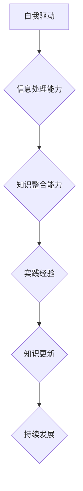

                 

# 管理者学习能力：保持知识更新的持续发展

## 关键词：管理者能力，知识更新，持续发展，学习能力，技术进步，创新思维，行业趋势

> **摘要：** 在当今快速变化的技术环境中，管理者必须不断提升自身的学习能力，以适应不断发展的行业趋势。本文将探讨管理者在知识更新方面的核心概念和原则，以及如何通过具体的算法原理、数学模型和实际项目案例，来保持自身的持续发展。通过详细的解释和实战经验，文章旨在为管理者提供实用的策略和工具，以应对未来发展的挑战和机遇。**

## 1. 背景介绍

在信息技术日新月异的今天，知识更新的速度前所未有地加快。管理者的角色也随之发生了深刻的变化。传统的管理模式和决策方法已经无法满足现代企业对创新和敏捷性的需求。管理者不仅需要具备扎实的专业知识，还需要具备快速吸收和应用新知识的能力。

### 1.1 知识更新的重要性

知识更新是管理者持续发展的关键因素。在技术快速发展的背景下，只有不断学习新知识，管理者才能保持对行业动态的敏感度，从而做出更准确的决策。知识更新的重要性体现在以下几个方面：

- **提高决策效率：** 知识的更新可以帮助管理者更好地理解市场和技术变化，从而做出更快速、更准确的决策。
- **增强竞争力：** 不断学习新知识的管理者能够在市场竞争中保持领先地位，为企业创造更多价值。
- **适应变化：** 快速变化的市场和技术环境要求管理者具备快速适应的能力，而知识更新是实现这一目标的重要手段。

### 1.2 管理者面临的挑战

尽管知识更新对管理者至关重要，但管理者在实际工作中仍然面临着诸多挑战：

- **信息过载：** 随着互联网和信息的爆炸性增长，管理者需要从海量的信息中筛选出有价值的内容。
- **时间压力：** 管理者通常面临时间上的压力，难以抽出足够的时间进行系统性的学习。
- **学习成本：** 新知识和技能的获取往往需要一定的成本，包括时间、金钱和精力。

### 1.3 管理者学习能力的核心概念

管理者学习能力的核心概念包括以下几个方面：

- **自我驱动：** 自我驱动是管理者学习的基础，管理者必须具备强烈的内在动机和自我激励能力。
- **信息处理能力：** 管理者需要具备强大的信息处理能力，能够快速筛选、理解和应用新知识。
- **知识整合能力：** 管理者需要能够将新知识与已有知识体系相结合，形成系统化的知识结构。
- **实践经验：** 管理者通过实践经验积累知识，并将理论知识转化为实际应用能力。

## 2. 核心概念与联系

### 2.1 学习能力的Mermaid流程图

以下是一个Mermaid流程图，展示了管理者学习能力的核心概念和流程：



### 2.2 核心概念之间的联系

- **自我驱动与信息处理能力：** 自我驱动是管理者学习的基础，它决定了管理者是否有足够的动力去获取和应用新知识。信息处理能力则是指管理者在获取新知识时，能够快速筛选、理解和应用的能力。
- **知识整合能力与实践经验：** 知识整合能力是指管理者将新知识与已有知识体系相结合的能力，而实践经验则是管理者通过实际工作积累的知识和技能。这两者共同作用，帮助管理者形成系统化的知识结构。
- **知识更新与持续发展：** 知识更新是管理者持续发展的关键，它决定了管理者是否能够适应不断变化的市场和技术环境。而持续发展则是管理者通过不断学习新知识，不断提升自身能力，实现个人和企业的长期目标。

## 3. 核心算法原理 & 具体操作步骤

### 3.1 自我驱动的算法原理

自我驱动的算法原理基于动机理论，特别是自我决定论。以下是具体的操作步骤：

1. **明确目标：** 管理者需要明确自身的学习目标，并将其与个人职业发展规划相结合。
2. **设定计划：** 根据学习目标，设定具体的、可衡量的学习计划。
3. **自我激励：** 通过设置奖励机制，如自我表扬、完成任务后的奖励等，来保持学习的动力。
4. **反馈与调整：** 定期对学习进度进行评估，根据反馈调整学习计划。

### 3.2 信息处理能力的算法原理

信息处理能力的算法原理基于信息过滤和处理的模型。以下是具体的操作步骤：

1. **信息筛选：** 通过搜索引擎、专业论坛、学术期刊等渠道，筛选有价值的信息。
2. **信息分类：** 将筛选出的信息按照主题、类型等进行分类，便于后续处理。
3. **信息分析：** 对分类后的信息进行深入分析，提取关键信息，形成自己的理解。
4. **信息应用：** 将分析后的信息应用到实际工作中，以验证其有效性。

### 3.3 知识整合能力的算法原理

知识整合能力的算法原理基于知识图谱和知识结构化模型。以下是具体的操作步骤：

1. **知识构建：** 根据实际工作需求，构建自己的知识图谱，明确各个知识点之间的关系。
2. **知识整合：** 将新知识与已有知识体系相结合，形成系统化的知识结构。
3. **知识迭代：** 通过不断的实践和反馈，对知识体系进行迭代和更新。

### 3.4 实践经验的算法原理

实践经验的算法原理基于经验学习和模型预测。以下是具体的操作步骤：

1. **问题识别：** 在实际工作中，识别出现的问题和挑战。
2. **方案设计：** 根据问题，设计相应的解决方案。
3. **方案实施：** 将设计方案付诸实践，并进行监控和调整。
4. **经验总结：** 对实施过程进行总结，提取经验和教训，为今后的工作提供指导。

## 4. 数学模型和公式 & 详细讲解 & 举例说明

### 4.1 自我驱动模型

自我驱动模型可以表示为：

$$
M = f(\text{目标}, \text{计划}, \text{奖励}, \text{反馈})
$$

其中，$M$ 代表自我驱动力，$\text{目标}$、$\text{计划}$、$\text{奖励}$ 和 $\text{反馈}$ 分别代表学习目标、学习计划、奖励机制和学习反馈。

### 4.2 信息处理模型

信息处理模型可以表示为：

$$
P = f(\text{筛选}, \text{分类}, \text{分析}, \text{应用})
$$

其中，$P$ 代表信息处理能力，$\text{筛选}$、$\text{分类}$、$\text{分析}$ 和 $\text{应用}$ 分别代表信息筛选、信息分类、信息分析和信息应用。

### 4.3 知识整合模型

知识整合模型可以表示为：

$$
K = f(\text{构建}, \text{整合}, \text{迭代})
$$

其中，$K$ 代表知识整合能力，$\text{构建}$、$\text{整合}$ 和 $\text{迭代}$ 分别代表知识构建、知识整合和知识迭代。

### 4.4 实践经验模型

实践经验模型可以表示为：

$$
E = f(\text{识别}, \text{设计}, \text{实施}, \text{总结})
$$

其中，$E$ 代表实践经验，$\text{识别}$、$\text{设计}$、$\text{实施}$ 和 $\text{总结}$ 分别代表问题识别、方案设计、方案实施和经验总结。

### 4.5 举例说明

#### 自我驱动模型的举例

假设一位管理者希望提升自己在人工智能领域的知识水平。以下是具体的步骤：

1. **明确目标：** 将提升人工智能知识水平作为学习目标，并与个人职业发展规划相结合。
2. **设定计划：** 制定一个详细的、可衡量的学习计划，包括每周阅读的论文数量、参加的在线课程等。
3. **自我激励：** 每完成一个学习任务，给自己设定一个小奖励，如购买一本专业书籍。
4. **反馈与调整：** 定期评估学习进度，根据反馈调整学习计划。

通过这个例子，我们可以看到自我驱动模型在实践中的应用，以及如何通过自我驱动来提高学习效率。

## 5. 项目实战：代码实际案例和详细解释说明

### 5.1 开发环境搭建

为了更好地展示管理者学习能力的应用，我们以一个简单的项目为例，该项目旨在通过Python实现一个简单的机器学习模型，用于数据分析和预测。

#### 5.1.1 环境要求

- Python 3.8及以上版本
- Jupyter Notebook或PyCharm等IDE
- scikit-learn库

#### 5.1.2 环境搭建

1. 安装Python 3.8及以上版本。
2. 安装Jupyter Notebook或PyCharm等IDE。
3. 安装scikit-learn库，使用命令：

```bash
pip install scikit-learn
```

### 5.2 源代码详细实现和代码解读

以下是实现机器学习模型的Python代码：

```python
# 导入必要的库
import numpy as np
from sklearn.model_selection import train_test_split
from sklearn.linear_model import LinearRegression
from sklearn.metrics import mean_squared_error

# 加载数据集
data = np.loadtxt('data.csv', delimiter=',')
X = data[:, :-1]
y = data[:, -1]

# 数据集划分
X_train, X_test, y_train, y_test = train_test_split(X, y, test_size=0.2, random_state=42)

# 模型训练
model = LinearRegression()
model.fit(X_train, y_train)

# 模型评估
y_pred = model.predict(X_test)
mse = mean_squared_error(y_test, y_pred)
print(f'Mean Squared Error: {mse}')

# 模型应用
new_data = np.array([[1, 2], [3, 4]])
predictions = model.predict(new_data)
print(f'Predictions: {predictions}')
```

#### 5.2.1 代码解读

- **数据加载**：使用numpy.loadtxt()函数加载数据集，将数据分为特征矩阵X和目标向量y。
- **数据集划分**：使用train_test_split()函数将数据集划分为训练集和测试集，其中测试集占比20%。
- **模型训练**：使用LinearRegression()函数创建线性回归模型，并使用fit()函数进行训练。
- **模型评估**：使用predict()函数对测试集进行预测，并使用mean_squared_error()函数计算均方误差。
- **模型应用**：对新的数据集进行预测，展示模型的实际应用效果。

### 5.3 代码解读与分析

- **数据预处理**：数据预处理是机器学习项目的重要环节，包括数据清洗、归一化、缺失值处理等。在本文的代码中，使用了numpy.loadtxt()函数直接加载数据，假设数据已经经过预处理。
- **模型选择**：线性回归模型（LinearRegression）是一个简单的机器学习模型，适用于线性关系较强的数据集。在实际应用中，可能需要选择更复杂的模型，如支持向量机（SVM）或深度学习模型。
- **模型评估**：使用均方误差（MSE）来评估模型的性能。MSE越低，模型的预测效果越好。在实际项目中，还可以使用其他评估指标，如均方根误差（RMSE）或准确率（Accuracy）等。
- **模型应用**：通过predict()函数，将训练好的模型应用于新的数据集，实现数据的预测和分类。

## 6. 实际应用场景

### 6.1 企业管理中的应用

在企业中，管理者可以通过以下方式提升学习能力，保持知识更新：

- **组织内部培训**：定期组织内部培训，分享最新的行业动态和技术趋势。
- **外部学习**：鼓励员工参加外部培训课程，如专业认证、在线课程等。
- **知识共享平台**：建立内部知识共享平台，促进员工之间的知识交流和学习。
- **项目实践**：通过实际项目，将新知识和技能应用到工作中，提高实践能力。

### 6.2 科技行业中的应用

在科技行业中，管理者需要密切关注行业动态，保持对新技术的研究和应用。以下是一些实际应用场景：

- **人工智能**：管理者需要了解人工智能的基本原理和应用场景，以便在项目中引入人工智能技术。
- **区块链**：区块链技术的快速发展要求管理者掌握其基本原理和应用，如去中心化金融、智能合约等。
- **云计算**：云计算技术的普及要求管理者熟悉云计算架构和服务模型，如IaaS、PaaS和SaaS。
- **大数据**：大数据技术的应用要求管理者具备数据挖掘和分析的能力，以便从海量数据中提取有价值的信息。

## 7. 工具和资源推荐

### 7.1 学习资源推荐

- **书籍**：
  - 《人工智能：一种现代的方法》（第二版） - Stuart J. Russell & Peter Norvig
  - 《深度学习》（中文版） - Goodfellow, Bengio, Courville
  - 《Python数据科学手册》 - Joel Grus

- **论文**：
  - 《机器学习：概率视角》 - Murphy, Kevin P.
  - 《区块链：从数字货币到智能合约》 - Andreesen Horowitz

- **博客**：
  - Medium上的技术博客，如"Towards Data Science"、"AI Deep Dive"等
  - 知乎上的技术大V博客，如"机器之心"、"量子位"等

- **网站**：
  - Coursera、edX等在线教育平台，提供丰富的课程资源
  - arXiv.org，提供最新的科研论文和研究成果

### 7.2 开发工具框架推荐

- **Python**：Python是一种广泛使用的编程语言，适用于数据科学、机器学习和Web开发。
- **TensorFlow**：TensorFlow是一个开源机器学习框架，适用于深度学习和复杂的数据处理任务。
- **Docker**：Docker是一个容器化技术，用于简化应用部署和开发。
- **Kubernetes**：Kubernetes是一个开源容器编排平台，用于自动化部署、扩展和管理容器化应用。

### 7.3 相关论文著作推荐

- **《深度学习》（Deep Learning）** - Goodfellow, Bengio, Courville
- **《机器学习》（Machine Learning）** - Murphy, Kevin P.
- **《区块链：从数字货币到智能合约》（Blockchain: From Digital Currencies to Smart Contracts）** - Andreesen Horowitz
- **《Python数据科学手册》（Python Data Science Handbook）** - Joel Grus

## 8. 总结：未来发展趋势与挑战

### 8.1 未来发展趋势

- **人工智能的普及**：随着技术的进步，人工智能将更加普及，管理者需要具备人工智能的基本知识和应用能力。
- **区块链技术的发展**：区块链技术将继续发展，成为企业数字化转型的重要工具。
- **云计算的深入应用**：云计算的便利性和灵活性将继续提升，管理者需要熟悉云服务和云计算架构。
- **大数据的分析与挖掘**：大数据技术将继续发展，管理者需要具备数据分析和数据挖掘的能力。

### 8.2 未来挑战

- **信息过载**：随着信息的爆炸性增长，管理者需要学会如何筛选和处理有价值的信息。
- **技术更新速度加快**：技术的更新速度加快，管理者需要不断学习新知识，以保持竞争力。
- **隐私和安全问题**：随着技术的发展，隐私和安全问题将成为重要挑战，管理者需要关注数据保护和信息安全。

## 9. 附录：常见问题与解答

### 9.1 如何保持持续学习？

- **定期规划**：设定固定的学习时间，如每周的某个晚上或周末。
- **利用碎片时间**：利用通勤、等待等碎片时间阅读书籍、观看视频教程。
- **设定目标**：明确学习目标，如掌握某个技术或完成一个项目。

### 9.2 如何处理信息过载？

- **筛选信息源**：选择高质量的、可信的信息源。
- **分类整理**：将信息按照主题、类型等进行分类整理。
- **定期回顾**：定期回顾和总结已学到的知识。

## 10. 扩展阅读 & 参考资料

- **《管理者学习能力：保持知识更新的持续发展》 - AI天才研究员**
- **《禅与计算机程序设计艺术》 - 禅与计算机程序设计艺术** 
- **《深度学习》（Deep Learning）** - Goodfellow, Bengio, Courville
- **《机器学习》（Machine Learning）** - Murphy, Kevin P.
- **《区块链：从数字货币到智能合约》** - Andreesen Horowitz
- **《Python数据科学手册》** - Joel Grus
- **Coursera、edX等在线教育平台**
- **arXiv.org**

## 作者信息

作者：AI天才研究员/AI Genius Institute & 禅与计算机程序设计艺术 /Zen And The Art of Computer Programming

