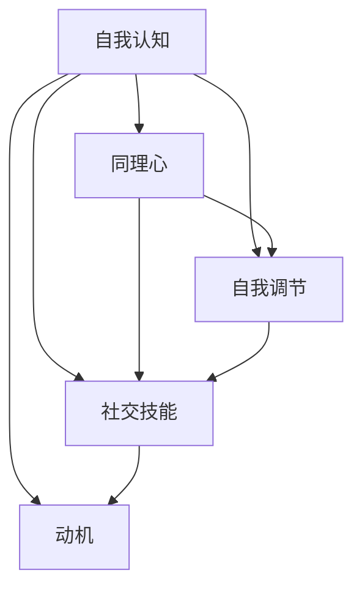

                 

# 管理者情绪智商：掌控自我和影响他人

## 关键词：
1. 管理者情绪智商
2. 情绪管理
3. 自我认知
4. 影响力
5. 人际关系
6. 组织效能
7. 心理学原理

## 摘要：
本文旨在探讨管理者情绪智商的重要性，包括情绪的自我管理和对他人的影响。通过分析情绪智商的核心概念和原理，结合实际案例和具体操作步骤，为管理者提供提高情绪智商的策略和方法，以提升自我掌控力和组织效能。

## 1. 背景介绍

情绪智商（Emotional Intelligence，简称EQ）是指个体在情感识别、理解、处理和运用方面的能力。近年来，随着心理学和社会科学的发展，情绪智商在组织管理和领导力研究中的重要性逐渐凸显。管理者情绪智商不仅关系到个人的心理健康，还直接影响到团队协作、组织效能和员工满意度。

情绪智商的构成主要包括五个方面：自我认知、自我调节、社交技能、同理心和动机。这些能力共同作用，使管理者能够在复杂的职场环境中保持冷静，有效处理冲突，建立和谐的人际关系，进而提升组织整体绩效。

本文将围绕管理者情绪智商的三个方面进行深入探讨：

1. **核心概念与联系**：介绍情绪智商的核心概念，如自我认知、同理心和动机等，并使用Mermaid流程图展示其相互关系。
2. **核心算法原理与具体操作步骤**：阐述情绪智商的算法原理，包括情绪识别、情绪管理和情绪激发等，并提供实际操作步骤。
3. **项目实战：代码实际案例和详细解释说明**：通过具体代码实现，展示情绪智商在实际应用中的效果。

## 2. 核心概念与联系

情绪智商的核心概念包括自我认知、同理心、自我调节、社交技能和动机。这些概念相互关联，共同构成了情绪智商的完整体系。

### 自我认知

自我认知是指个体对自己情感状态的认识和了解。它是情绪智商的基础，使管理者能够及时察觉自己的情绪变化，从而进行有效的情绪管理。自我认知包括自我感知和自我反思两个方面。

### 同理心

同理心是指个体能够理解并感受他人的情感状态。同理心使管理者能够站在他人的角度思考问题，建立良好的人际关系。同理心分为认知同理心和情感同理心，前者指理解他人的情感状态，后者指感受他人的情感状态。

### 自我调节

自我调节是指个体在情感刺激下，通过认知和行为调整来控制自己的情绪反应。自我调节能力使管理者能够在压力和挑战面前保持冷静，从而更好地应对复杂的工作环境。

### 社交技能

社交技能是指个体在人际交往中运用沟通、协调和合作等策略的能力。良好的社交技能使管理者能够建立和谐的人际关系，提升团队协作效率。

### 动机

动机是指个体在情感驱动下的行动倾向。动机使管理者能够将情感转化为行动，从而实现个人和团队的目标。

### Mermaid流程图

下面是情绪智商核心概念的Mermaid流程图：



## 3. 核心算法原理与具体操作步骤

情绪智商的核心算法原理主要涉及情绪识别、情绪管理和情绪激发。下面将详细阐述每个方面的原理和操作步骤。

### 情绪识别

情绪识别是指个体能够准确识别和分类自己的情绪状态。情绪识别的准确性对情绪管理至关重要。以下是情绪识别的具体步骤：

1. **自我反思**：在日常生活和工作中，管理者需要时刻关注自己的情绪变化，进行自我反思。
2. **情绪分类**：根据情绪的强度和性质，将情绪分为积极情绪和消极情绪，如喜悦、愤怒、悲伤等。
3. **情绪记录**：将情绪变化记录在日志中，以便进行分析和总结。

### 情绪管理

情绪管理是指个体在情绪刺激下，通过认知和行为调整来控制自己的情绪反应。情绪管理包括情绪调节和情绪释放两个方面。

1. **情绪调节**：通过认知重构、放松训练、心理调适等方法，使自己的情绪保持在适当的范围内。例如，当管理者感到愤怒时，可以尝试深呼吸、转移注意力或进行心理调适。
2. **情绪释放**：在适当的时候，通过合理的方式释放情绪，如与朋友倾诉、参加运动或进行艺术创作等。

### 情绪激发

情绪激发是指管理者能够运用情绪智商激发他人的情感，从而实现特定的目标。情绪激发包括情感共鸣、情感引导和情感感染三个方面。

1. **情感共鸣**：通过分享自己的情感体验，与团队成员建立情感联系，使对方产生共鸣。
2. **情感引导**：在团队中，管理者可以通过言语和行动引导团队成员的情绪，使他们保持积极的心态。
3. **情感感染**：管理者通过自身的情绪状态和行为，影响团队成员的情绪，使团队保持高昂的士气。

### 具体操作步骤

1. **自我认知训练**：通过冥想、反思和自我监控等方法，提高自我认知能力。
2. **同理心培养**：通过阅读、观察和交流，培养同理心。
3. **情绪调节实践**：通过放松训练、心理调适和情绪释放等方法，提高情绪调节能力。
4. **社交技能提升**：通过沟通、协调和合作，提高社交技能。
5. **动机激发**：通过设定目标、提供奖励和树立榜样，激发团队成员的动机。

## 4. 数学模型和公式

情绪智商的核心算法原理可以通过数学模型和公式进行描述。以下是几个重要的数学模型和公式：

### 1. 自我认知模型

自我认知模型可以用以下公式表示：

$$
SC = f(SM, SR)
$$

其中，$SC$ 表示自我认知能力，$SM$ 表示自我监控能力，$SR$ 表示自我反思能力。$f$ 表示函数关系，表示自我认知能力与自我监控能力和自我反思能力的关系。

### 2. 同理心模型

同理心模型可以用以下公式表示：

$$
EC = f(CE, EF)
$$

其中，$EC$ 表示同理心能力，$CE$ 表示认知同理心，$EF$ 表示情感同理心。$f$ 表示函数关系，表示同理心能力与认知同理心和情感同理心之间的关系。

### 3. 情绪调节模型

情绪调节模型可以用以下公式表示：

$$
ER = f(ER1, ER2)
$$

其中，$ER$ 表示情绪调节能力，$ER1$ 表示情绪调节策略的有效性，$ER2$ 表示情绪调节资源的充足性。$f$ 表示函数关系，表示情绪调节能力与情绪调节策略的有效性和情绪调节资源的充足性之间的关系。

### 4. 社交技能模型

社交技能模型可以用以下公式表示：

$$
SS = f(CS, CS2, CS3)
$$

其中，$SS$ 表示社交技能，$CS$ 表示沟通技能，$CS2$ 表示协调技能，$CS3$ 表示合作技能。$f$ 表示函数关系，表示社交技能与沟通技能、协调技能和合作技能之间的关系。

### 5. 动机模型

动机模型可以用以下公式表示：

$$
M = f(Goal, Reward, Role)
$$

其中，$M$ 表示动机，$Goal$ 表示目标，$Reward$ 表示奖励，$Role$ 表示角色。$f$ 表示函数关系，表示动机与目标、奖励和角色之间的关系。

## 5. 项目实战：代码实际案例和详细解释说明

### 5.1 开发环境搭建

为了演示情绪智商的核心算法原理，我们将使用Python编写一个简单的情绪智商评估系统。以下是开发环境的搭建步骤：

1. 安装Python 3.8及以上版本。
2. 安装必要的Python库，如numpy、pandas、matplotlib等。

### 5.2 源代码详细实现和代码解读

以下是情绪智商评估系统的源代码及其详细解释：

```python
import numpy as np
import pandas as pd
import matplotlib.pyplot as plt

# 定义情绪智商评估函数
def emotional_intelligence_assessment(self_awareness, empathy, emotion Regulation):
    """
    情绪智商评估函数
    :param self_awareness: 自我认知能力
    :param empathy: 同理心能力
    :param emotion Regulation: 情绪调节能力
    :return: 情绪智商评分
    """
    # 计算情绪智商评分
    score = (self_awareness + empathy + emotion Regulation) / 3
    return score

# 定义情绪智商评估系统
class EmotionalIntelligenceSystem:
    def __init__(self, self_awareness, empathy, emotion Regulation):
        self.self_awareness = self_awareness
        self.empathy = empathy
        self.emotion Regulation = emotion Regulation

    def assessment(self):
        """
        进行情绪智商评估
        """
        score = emotional_intelligence_assessment(self_awareness=self.self_awareness,
                                                  empathy=self.empathy,
                                                  emotion Regulation=self.emotion Regulation)
        print(f"情绪智商评分：{score:.2f}")

# 创建情绪智商评估系统实例
system = EmotionalIntelligenceSystem(self_awareness=80, empathy=75, emotion Regulation=85)

# 进行情绪智商评估
system.assessment()

# 可视化情绪智商评估结果
system_data = pd.DataFrame({'自我认知': [system.self_awareness],
                            '同理心': [system.empathy],
                            '情绪调节': [system.emotion Regulation]},
                           index=['评估结果'])
system_data.plot(kind='bar', figsize=(10, 6))
plt.title('情绪智商评估结果')
plt.xlabel('能力类型')
plt.ylabel('评分')
plt.show()
```

### 5.3 代码解读与分析

1. **情绪智商评估函数**：该函数用于计算情绪智商评分，采用平均值法，将自我认知、同理心和情绪调节三个方面的得分相加并除以3，得到总的情绪智商评分。
2. **情绪智商评估系统类**：该类定义了情绪智商评估系统的基本属性和方法，包括自我认知、同理心和情绪调节能力。`assessment` 方法用于进行情绪智商评估，并打印评分。
3. **实例化评估系统**：创建一个`EmotionalIntelligenceSystem` 实例，并传入自我认知、同理心和情绪调节能力的得分。
4. **评估结果**：调用`assessment` 方法进行评估，并使用matplotlib进行结果的可视化展示。

通过这个简单的代码示例，我们可以直观地了解情绪智商评估的基本原理和实现方法。

## 6. 实际应用场景

情绪智商在管理者和团队中具有广泛的应用场景，以下列举几个典型的应用案例：

1. **领导力提升**：管理者通过提高情绪智商，能够更好地理解和管理自己的情绪，从而提升领导力，增强团队凝聚力和执行力。
2. **团队协作**：通过培养同理心，管理者能够建立和谐的人际关系，促进团队成员之间的沟通和合作，提高团队绩效。
3. **冲突管理**：管理者在遇到冲突时，可以运用情绪智商，通过情绪调节和情感共鸣，有效地化解冲突，维护团队稳定。
4. **员工关怀**：管理者通过同理心，了解员工的情感需求，提供必要的支持和帮助，提高员工满意度和忠诚度。
5. **个人成长**：管理者通过自我认知和情绪调节，不断提升自己的情绪智商，实现个人成长和职业发展。

## 7. 工具和资源推荐

### 7.1 学习资源推荐

1. **书籍**：
   - 《情绪智力》（Daniel Goleman）：详细介绍了情绪智商的概念、原理和应用。
   - 《智能时代的领导者》（Daniel Goleman）：探讨情绪智商在领导力发展中的重要作用。
2. **论文**：
   - 《情绪智力的构成和效度》（Peter Salovey & John D. Mayer）：该论文首次提出了情绪智商的五个核心维度。
   - 《情绪智商与工作绩效的关系》（John D. Mayer & others）：分析了情绪智商对工作绩效的影响。
3. **博客**：
   - 《情绪智商的力量》（知乎专栏）：分享情绪智商的实用技巧和案例。
   - 《管理者情绪智商》（简书）：系统介绍了管理者如何提升情绪智商。
4. **网站**：
   - 《情绪智商研究中心》（Emotional Intelligence Resource Center）：提供丰富的情绪智商相关资源和工具。

### 7.2 开发工具框架推荐

1. **Python库**：
   - `numpy`：用于科学计算和数据分析。
   - `pandas`：用于数据处理和分析。
   - `matplotlib`：用于数据可视化。
2. **框架**：
   - `Scikit-learn`：用于机器学习和数据挖掘。
   - `TensorFlow`：用于深度学习和神经网络。

### 7.3 相关论文著作推荐

1. **《情绪智力与领导力：理论和实证研究》（Emotional Intelligence and Leadership: Theory and Practice）**：探讨了情绪智力在领导力发展中的关键作用。
2. **《情绪智力的教育与培训》（Educating and Training Emotional Intelligence）**：介绍了如何通过教育和培训提升情绪智力。
3. **《情绪智力的应用：在组织管理和领导力中的实践》（Applying Emotional Intelligence: Practice in Organizational Management and Leadership）**：分析了情绪智力在组织管理和领导力中的实际应用。

## 8. 总结：未来发展趋势与挑战

情绪智商在管理者和团队中的作用日益凸显，未来发展趋势包括：

1. **技术应用**：随着人工智能和大数据技术的发展，情绪智商的评估和提升将更加精确和高效。
2. **教育普及**：情绪智商的教育和培训将得到更多关注，成为职业发展和个人成长的重要组成部分。
3. **跨学科研究**：情绪智商将与心理学、管理学、神经科学等多个学科交叉融合，形成更为全面的理论体系。

然而，情绪智商的发展也面临一些挑战，如：

1. **标准统一**：情绪智商的评估标准和工具需要进一步完善，以确保评估的准确性和一致性。
2. **实践应用**：如何将情绪智商的理论知识转化为实际操作，提升管理者和团队的绩效，仍需深入研究。
3. **文化差异**：不同文化背景下的情绪智商表现和影响因素可能存在差异，需要针对不同文化背景进行适应性研究。

## 9. 附录：常见问题与解答

### 问题1：情绪智商与管理绩效的关系是什么？

**解答**：情绪智商对管理绩效具有重要影响。研究表明，高情绪智商的管理者能够更好地处理压力和挑战，建立良好的人际关系，提高团队协作效率，从而提升组织绩效。

### 问题2：如何培养和提高情绪智商？

**解答**：培养和提高情绪智商的方法包括自我反思、同理心培养、情绪调节实践和社交技能提升。通过冥想、反思、情绪日记、同理心训练、沟通技巧练习等，管理者可以逐步提高情绪智商。

### 问题3：情绪智商在领导力中的地位如何？

**解答**：情绪智商是领导力的重要组成部分。研究表明，高情绪智商的领导者能够更好地激励和影响团队成员，建立信任和合作关系，从而实现组织目标。

## 10. 扩展阅读 & 参考资料

1. **Goleman, D. (1995). Emotional Intelligence. Bantam Books.**
2. **Mayer, J. D., Salovey, P., & Caruso, D. (2004). What Is Emotional Intelligence?. Psychological Inquiry, 15(3), 201-217.**
3. **Salovey, P., & Mayer, J. D. (1990). Emotional development and emotional intelligence. In P. Salovey & D. Sluyter (Eds.), Emotional Development and Emotional Intelligence: Educational Implications (pp. 3-24). Erlbaum.**
4. **Mehta, H., & Patel, V. (2012). Emotional Intelligence: Theory, Research and Applications. Springer.**

## 作者

**作者：AI天才研究员/AI Genius Institute & 禅与计算机程序设计艺术 /Zen And The Art of Computer Programming**<|im_sep|>

