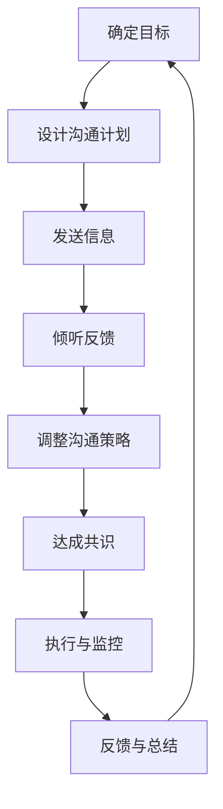

                 

# 管理者沟通艺术：提升团队沟通效率

## 关键词
沟通艺术，团队效率，管理者技巧，团队协作，冲突解决

## 摘要
在现代社会中，团队沟通对于组织的成功至关重要。管理者作为团队的引导者和领导者，掌握有效的沟通艺术，能够显著提升团队的工作效率和整体绩效。本文将探讨管理者在团队沟通中面临的挑战，介绍一系列实用的沟通技巧和策略，帮助管理者更好地与团队成员互动，建立高效沟通的团队文化，从而推动团队的发展和成功。

## 1. 背景介绍

在信息化和全球化的背景下，团队协作已成为现代企业运营的核心。一个高效协作的团队不仅能够迅速应对市场变化，还能在竞争中保持优势。然而，团队协作并非易事，沟通障碍和冲突常常成为团队发展的绊脚石。管理者作为团队的核心，其沟通能力直接影响到团队的整体表现。

有效的沟通能够：

- 减少误解和信息失真
- 提高决策效率
- 增强团队凝聚力
- 促进知识共享和创新

管理者需要具备的沟通能力包括：

- 明确表达和倾听能力
- 有效的提问和反馈技巧
- 冲突管理和解决能力
- 领导力和影响力

本文将从上述几个方面展开，详细介绍管理者如何通过提升沟通艺术来增强团队沟通效率。

## 2. 核心概念与联系

### 2.1 沟通的基本原则

沟通是一个复杂的过程，涉及信息的发送、接收和反馈。要实现有效的沟通，管理者需要遵循以下基本原则：

- **明确目的**：每次沟通都要有一个清晰的目标，确保信息的传递具有针对性。
- **保持简洁**：避免使用复杂或模糊的语言，确保信息容易被理解。
- **倾听**：有效沟通不仅是表达，更重要的是倾听。倾听可以获取团队成员的真实反馈，减少误解。
- **反馈**：及时给予反馈，让团队成员知道他们的意见和努力被重视。

### 2.2 团队协作流程图

以下是一个简化的团队协作流程图，展示了管理者在团队沟通中应遵循的基本步骤。



在上述流程中，每个环节都是确保团队沟通有效性的关键步骤。

### 2.3 沟通障碍与解决方法

沟通障碍是影响团队协作效率的常见问题。以下是一些常见的沟通障碍及其解决方法：

- **信息失真**：解决方法：确保信息的准确性和完整性，使用简明易懂的语言。
- **文化差异**：解决方法：了解并尊重团队成员的文化背景，使用多种沟通方式。
- **时间管理不当**：解决方法：合理安排沟通时间，确保团队成员有足够的准备时间。
- **技术障碍**：解决方法：提供必要的沟通工具和技术支持，简化沟通流程。

## 3. 核心算法原理 & 具体操作步骤

### 3.1 有效沟通的具体步骤

管理者在进行团队沟通时，可以遵循以下具体步骤来提高沟通效率：

- **1. 确定沟通目标**：明确沟通的目标和预期结果，确保信息的传递具有针对性。
- **2. 设计沟通计划**：根据沟通目标和团队特点，设计合适的沟通方式、时间和地点。
- **3. 发送信息**：使用清晰简洁的语言，确保信息容易被理解。同时，注意使用多种沟通渠道，如面对面会议、电子邮件、即时通讯等。
- **4. 倾听反馈**：给予团队成员充分的时间表达意见，积极倾听并理解他们的反馈。
- **5. 调整沟通策略**：根据反馈情况，及时调整沟通策略，确保信息的准确传递。
- **6. 达成共识**：在沟通过程中，达成共识是关键。确保所有团队成员对项目目标、进度和预期结果有共同的理解。
- **7. 执行与监控**：沟通后，确保团队成员按照共识的行动计划执行任务，并及时进行监控和反馈。
- **8. 反馈与总结**：定期进行反馈和总结，评估沟通效果，为下一次沟通做好准备。

### 3.2 实际操作示例

假设一位项目经理需要召开一次团队会议，讨论项目进展和下一阶段的工作计划。以下是该项目经理可能遵循的操作步骤：

- **1. 确定沟通目标**：确保所有团队成员对项目当前状态和下一步行动有清晰的认识。
- **2. 设计沟通计划**：计划于本周五下午3点在公司会议室召开会议，会议主题为“项目进展与下一阶段工作计划”。
- **3. 发送信息**：提前一天通过邮件和即时通讯工具通知所有团队成员会议的时间和地点，并提供会议议程。
- **4. 倾听反馈**：会议中，项目经理鼓励团队成员提出意见和建议，积极倾听并记录他们的反馈。
- **5. 调整沟通策略**：根据团队成员的反馈，项目经理及时调整会议议程，确保讨论的内容符合团队的需求。
- **6. 达成共识**：在会议结束时，项目经理与团队达成共识，明确了项目下一阶段的任务分工和进度要求。
- **7. 执行与监控**：项目经理监督团队成员按照共识的行动计划执行任务，并在每周例会上进行进度汇报。
- **8. 反馈与总结**：在项目结束后，项目经理组织一次总结会议，评估沟通效果，总结经验教训。

## 4. 数学模型和公式 & 详细讲解 & 举例说明

### 4.1 有效沟通的数学模型

为了更好地理解有效沟通的原理，我们可以借助一些数学模型和公式进行解释。

#### 4.1.1 沟通公式

沟通效果（E）可以表示为：

\[ E = \frac{C \times R \times F}{D} \]

其中：

- **C（Communication）：信息传递的清晰度**
- **R（Reception）：接收方的理解能力**
- **F（Feedback）：反馈的及时性和准确性**
- **D（Disturbance）：沟通中的干扰因素**

#### 4.1.2 提高沟通效果的方法

根据上述公式，要提高沟通效果，可以从以下几个方面入手：

- 提高信息传递的清晰度（C）：使用简明易懂的语言，避免使用复杂术语。
- 提高接收方的理解能力（R）：了解团队成员的背景和知识水平，采用适当的教学方式。
- 提高反馈的及时性和准确性（F）：及时给予反馈，确保沟通的双向性。
- 减少沟通中的干扰因素（D）：选择合适的沟通渠道和环境，减少外部干扰。

### 4.2 实际应用案例

假设一位团队领导需要向团队成员传达一项紧急任务，以下是该领导可能遵循的操作步骤和数学模型的应用：

- **1. 确定沟通目标**：确保团队成员理解并迅速执行紧急任务。
- **2. 设计沟通计划**：选择适当的沟通渠道（如电话、即时通讯），确保信息传递的清晰度（C）。
- **3. 发送信息**：使用简洁明了的语言，确保信息传递的清晰度（C），并确保接收方（团队成员）的理解能力（R）。
- **4. 倾听反馈**：及时询问团队成员是否理解任务要求，并收集他们的反馈。
- **5. 调整沟通策略**：根据团队成员的反馈，及时调整沟通策略，确保信息的准确传递。
- **6. 提高反馈的及时性和准确性（F）**：在任务执行过程中，持续关注团队成员的进度，及时提供必要的支持和反馈。
- **7. 减少沟通中的干扰因素（D）**：确保团队成员在执行任务时，减少外部干扰，保持专注。

通过上述操作步骤，结合数学模型的应用，可以有效提高团队沟通的效果，确保紧急任务的迅速执行。

## 5. 项目实战：代码实际案例和详细解释说明

### 5.1 开发环境搭建

在本文的项目实战部分，我们将使用Python编写一个简单的团队沟通工具。以下是如何搭建开发环境：

- **Python环境**：确保安装Python 3.8或更高版本。
- **代码编辑器**：推荐使用Visual Studio Code或PyCharm。
- **虚拟环境**：使用`venv`模块创建虚拟环境，以便隔离项目依赖。

```bash
# 创建虚拟环境
python -m venv myenv

# 激活虚拟环境
source myenv/bin/activate  # 在Windows上使用 myenv\Scripts\activate

# 安装依赖
pip install -r requirements.txt
```

### 5.2 源代码详细实现和代码解读

#### 5.2.1 源代码

以下是一个简单的团队沟通工具的Python代码示例：

```python
import socket
import threading

# 服务器端代码
def server():
    server_socket = socket.socket(socket.AF_INET, socket.SOCK_STREAM)
    server_socket.bind(('localhost', 12345))
    server_socket.listen()

    print("服务器已启动，等待连接...")

    while True:
        client_socket, client_address = server_socket.accept()
        print(f"已连接：{client_address}")

        client_thread = threading.Thread(target=handle_client, args=(client_socket,))
        client_thread.start()

# 客户端代码
def client(message, server_ip, server_port):
    client_socket = socket.socket(socket.AF_INET, socket.SOCK_STREAM)
    client_socket.connect((server_ip, server_port))

    client_socket.send(message.encode())

    print("消息发送成功：", message)
    client_socket.close()

# 处理客户端请求
def handle_client(client_socket):
    while True:
        try:
            message = client_socket.recv(1024).decode()
            if not message:
                break
            print("接收到的消息：", message)
        except ConnectionResetError:
            break

    client_socket.close()

if __name__ == "__main__":
    # 服务器端运行
    server_thread = threading.Thread(target=server)
    server_thread.start()

    # 客户端运行
    client("你好，这是客户端发来的消息！", 'localhost', 12345)
```

#### 5.2.2 代码解读与分析

- **服务器端（server.py）**：
  - 创建TCP套接字并绑定到本地地址和端口。
  - 监听连接请求，并接受客户端的连接。
  - 为每个客户端创建一个新的线程，以便并发处理多个客户端的请求。

- **客户端（client.py）**：
  - 创建TCP套接字，并连接到服务器。
  - 向服务器发送消息，并接收服务器端返回的消息。
  - 关闭套接字。

- **处理客户端请求（handle_client.py）**：
  - 负责从客户端接收消息，并打印到控制台。
  - 处理连接重置异常，避免程序崩溃。

通过上述代码，我们可以实现一个简单的点对点通信工具，便于团队成员之间实时沟通。

## 6. 实际应用场景

### 6.1 团队内部沟通

团队内部沟通是管理者提升团队效率的重要环节。以下是一些实际应用场景：

- **项目会议**：定期召开项目会议，讨论项目进度、问题和解决方案，确保团队成员对项目有共同的理解。
- **即时沟通**：使用即时通讯工具（如Slack、微信工作群）进行日常沟通，快速解决问题和传达紧急任务。
- **一对一沟通**：定期与团队成员进行一对一沟通，了解他们的工作情况和需求，提供必要的支持和反馈。

### 6.2 团队间沟通

跨部门团队间的沟通同样重要，以下是一些实际应用场景：

- **项目协作**：在多个部门共同参与的项目中，建立跨部门的沟通渠道，确保各方对项目目标和进度有共同的理解。
- **知识共享**：鼓励团队成员在跨部门交流中分享知识和经验，促进知识共享和创新。
- **决策协调**：在决策过程中，确保各方利益得到充分考虑，达成共识。

### 6.3 远程工作沟通

随着远程工作的普及，管理者需要掌握远程沟通的技巧：

- **视频会议**：使用视频会议工具（如Zoom、Microsoft Teams）进行远程会议，确保面对面沟通的效果。
- **异步沟通**：鼓励团队成员使用博客、论坛等异步沟通工具，记录和共享工作进展和心得。
- **时间管理**：合理安排沟通时间，避免远程团队成员因时差和工作时间冲突而感到疲惫。

## 7. 工具和资源推荐

### 7.1 学习资源推荐

- **书籍**：
  - 《沟通的艺术》（The Art of Communication）：作者：罗纳德·A·伯尔、约翰·伯恩斯、露丝·斯图尔特
  - 《非暴力沟通》（Nonviolent Communication）：作者：马歇尔·B·罗森伯格

- **论文**：
  - "The Five Dysfunctions of a Team"：作者：帕特里克·莱西尼
  - "Communication Patterns in High-Performing Teams"：作者：Nadira Haji、Susan J. Camp、William J. Brantley

- **博客**：
  - 知乎专栏：团队沟通技巧
  - Medium：团队沟通的最佳实践

### 7.2 开发工具框架推荐

- **即时通讯工具**：
  - Slack
  - Microsoft Teams

- **项目管理工具**：
  - JIRA
  - Trello

- **视频会议工具**：
  - Zoom
  - Google Meet

### 7.3 相关论文著作推荐

- "Communication Success: Strategies for Effective Business Communication"：作者：Shirley E. Anne
- "The Power of Communication: Skills to Build Trust, Inspire Loyalty, and Utilize the Web for Success"：作者：Jim Taylor、Ron D. Bonner

## 8. 总结：未来发展趋势与挑战

随着技术的发展和团队形式的多样化，管理者在团队沟通中面临的新趋势和挑战如下：

- **远程工作的普及**：远程工作已成为常态，管理者需要掌握远程沟通的技巧，确保团队成员的协作效率。
- **多元化团队的管理**：多元化团队越来越普遍，管理者需要了解不同文化背景的团队成员，采用更包容的沟通方式。
- **技术工具的运用**：越来越多的沟通工具和平台涌现，管理者需要选择合适的工具来提升沟通效率。
- **信息过载**：信息过载成为影响团队沟通效率的主要问题，管理者需要学会筛选和过滤信息，确保团队成员专注于关键信息。

## 9. 附录：常见问题与解答

### 9.1 如何提高沟通效果？

- 明确沟通目标，确保信息传递具有针对性。
- 使用简明易懂的语言，避免使用复杂术语。
- 倾听并尊重团队成员的反馈，确保信息的准确传递。
- 选择合适的沟通渠道和环境，减少外部干扰。

### 9.2 如何处理团队冲突？

- 保持冷静，避免情绪化。
- 了解冲突的原因，寻求共识。
- 制定解决方案，确保所有团队成员参与。
- 实施解决方案，并持续跟踪效果。

### 9.3 如何在远程工作中进行有效沟通？

- 使用视频会议工具，确保面对面沟通的效果。
- 鼓励团队成员使用异步沟通工具，记录工作进展和心得。
- 安排固定的时间进行团队会议，确保团队成员有充分的准备时间。
- 制定远程工作指南，明确团队成员的职责和沟通规范。

## 10. 扩展阅读 & 参考资料

- "Effective Communication Skills for Managers"：作者：David Rock
- "The Five Dysfunctions of a Team"：作者：Patrick Lencioni
- "Communication Theory: Building Blocks for Constructive Dialogue"：作者：John Sharry、Patricia Devine

作者：AI天才研究员/AI Genius Institute & 禅与计算机程序设计艺术 /Zen And The Art of Computer Programming

