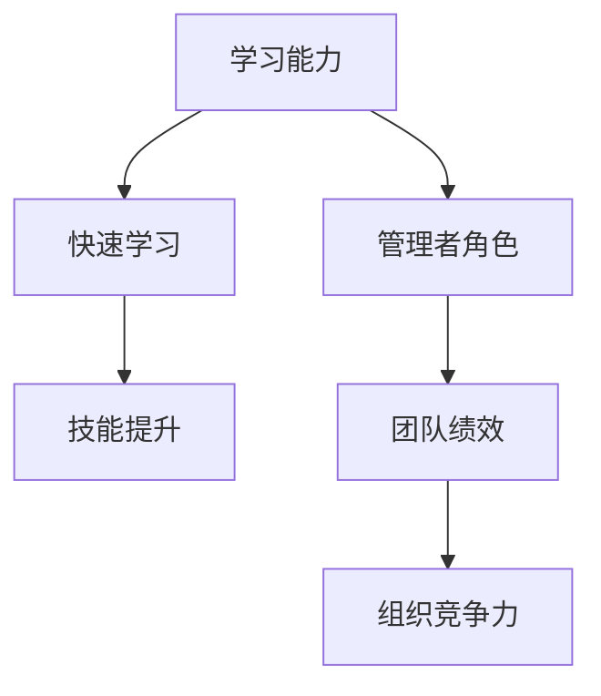
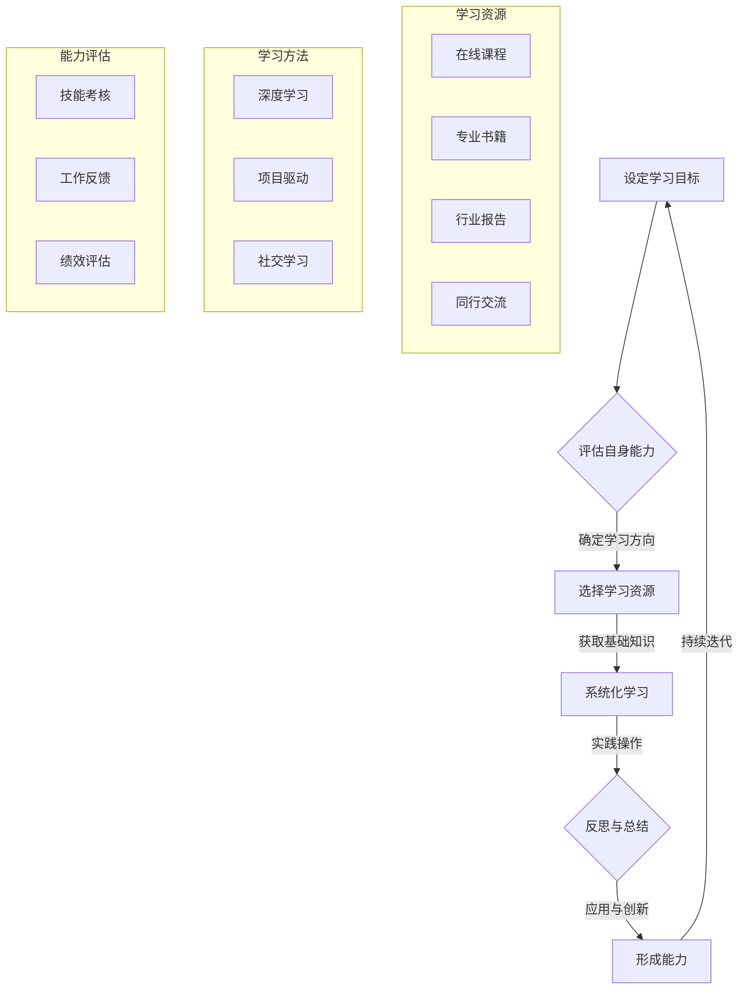

                 

### 管理者的快速学习能力培养

> **关键词**：管理者，学习能力，快速学习，技术管理，技能提升
>
> **摘要**：本文将深入探讨管理者如何通过有效的学习和技能提升策略，实现快速学习能力。文章将结合实际案例，分析高效学习的方法论，并推荐实用的工具和资源，以帮助管理者在快速变化的技术环境中保持竞争力。

#### 1. 背景介绍

在当今快速发展的科技时代，管理者的角色和职责正在发生巨大变化。技术的不断革新，业务环境的快速变化，以及市场竞争的加剧，都对管理者提出了更高的要求。传统的管理经验和技能已经不足以应对复杂的商业环境。因此，管理者需要具备快速学习能力，以适应不断变化的需求和挑战。

快速学习能力不仅是个人成长的关键，也是组织成功的重要保证。管理者作为组织的核心，其学习能力的强弱直接影响到团队的绩效和组织的竞争力。因此，如何培养管理者的快速学习能力，已经成为企业和组织关注的焦点。

本文将围绕以下问题展开讨论：

1. 管理者为何需要快速学习能力？
2. 快速学习能力包括哪些方面？
3. 如何系统地培养管理者的快速学习能力？
4. 实际案例中的快速学习策略和实践。

通过本文的阅读，管理者将了解到如何通过有效的学习和技能提升策略，实现快速学习，并在实际工作中取得更好的成果。

#### 2. 核心概念与联系

要培养管理者的快速学习能力，我们首先需要明确几个核心概念和它们之间的联系。以下是几个关键概念及其相互关系：

##### 2.1 学习能力

**定义**：学习能力是指个体获取、理解和应用知识、技能和经验的能力。

**组成部分**：学习能力包括信息获取能力、理解能力、应用能力和迁移能力。

**联系**：学习能力的各个组成部分相互关联，共同构成个体的整体学习能力。例如，信息获取能力决定了学习的内容和广度，理解能力决定了学习的效果和质量，应用能力决定了学习的实用性，迁移能力决定了学习对实际工作场景的适应能力。

##### 2.2 快速学习

**定义**：快速学习是指以高效的方式获取、处理和应用知识，以迅速适应新环境和挑战的能力。

**特点**：快速学习具有高效性、灵活性和适应性。高效性体现在学习速度和效果上，灵活性体现在对不同学习资源和方法的适应性，适应性体现在对实际工作场景的适应能力。

**联系**：快速学习是学习能力在特定情境下的表现，它依赖于整体学习能力，但更强调学习效率和实践效果。

##### 2.3 技能提升

**定义**：技能提升是指通过不断学习和实践，提高个体在特定领域的能力水平。

**组成部分**：技能提升包括基础知识的学习、实践操作的熟练、经验总结的提炼和技能创新的探索。

**联系**：技能提升是快速学习能力的重要组成部分，它不仅依赖于快速学习，还需要长期的积累和实践。

##### 2.4 管理者的角色

**定义**：管理者是指负责组织、协调和领导团队，实现组织目标的人。

**职责**：管理者的职责包括战略规划、团队管理、资源配置、决策制定和风险管理等。

**联系**：管理者的角色直接影响到团队的绩效和组织的竞争力，快速学习能力是管理者履行职责的重要基础。

为了更好地理解这些概念之间的联系，我们可以使用Mermaid流程图来展示它们之间的关系：



通过上述核心概念及其相互关系的阐述，我们可以更清晰地认识到快速学习能力在管理者角色中的重要性。在接下来的章节中，我们将进一步探讨如何系统地培养管理者的快速学习能力。

#### 3. 核心算法原理 & 具体操作步骤

要培养管理者的快速学习能力，我们可以借鉴一些科学有效的学习和技能提升方法。这些方法可以被视为一系列的核心算法，它们通过系统化的步骤帮助管理者实现快速学习。以下是几个关键的核心算法及其具体操作步骤：

##### 3.1. 反馈循环算法

**原理**：反馈循环是一种迭代学习过程，通过不断评估和调整学习策略，提高学习效果。

**步骤**：

1. **设定目标**：明确学习目标和预期成果。
2. **执行学习任务**：按照既定计划执行学习任务。
3. **评估效果**：通过测试、实践或反馈评估学习效果。
4. **调整策略**：根据评估结果，调整学习策略。
5. **重新执行**：根据调整后的策略重新执行学习任务。
6. **持续迭代**：不断重复上述步骤，实现持续学习。

**示例**：一个管理者可能设定目标为提高项目管理能力。在执行学习任务时，他可能选择阅读项目管理相关书籍、参加工作坊和实际参与项目。在评估效果时，他可能通过自我评估或团队反馈来了解自己在项目管理方面的不足。根据评估结果，他可能调整阅读书籍的类型或参加更多实践项目，然后重新执行学习任务。

##### 3.2. 深度学习算法

**原理**：深度学习是一种模拟人脑神经元网络结构的学习方法，通过多层神经网络处理复杂数据，提高学习效果。

**步骤**：

1. **数据收集**：收集与学习目标相关的数据。
2. **数据预处理**：对数据进行清洗和格式化。
3. **构建模型**：使用神经网络模型进行训练。
4. **模型训练**：通过大量数据训练模型，调整模型参数。
5. **模型评估**：评估模型在测试数据上的表现。
6. **优化模型**：根据评估结果优化模型。
7. **应用模型**：将模型应用到实际问题中。

**示例**：一个管理者可能需要提高数据分析能力。在收集数据后，他可能使用Python的scikit-learn库构建一个机器学习模型，通过调整模型的超参数来优化性能。在评估模型表现后，他可能进一步优化模型，并将其应用到实际业务场景中，如客户行为预测或市场分析。

##### 3.3. 社交学习算法

**原理**：社交学习是通过与他人互动和合作，共同学习新知识和技能。

**步骤**：

1. **组建学习小组**：与有共同学习目标的人组成学习小组。
2. **设定学习目标**：明确学习小组的共同学习目标。
3. **分工合作**：根据个人特长和兴趣，分工合作进行学习任务。
4. **共享资源**：共享学习资料和资源，提高学习效率。
5. **定期讨论**：定期组织讨论会，分享学习心得和成果。
6. **反馈与调整**：根据讨论结果，调整学习策略和方向。

**示例**：一个管理者可能组建一个项目管理学习小组，与同事们共同学习项目管理知识。在学习过程中，他们可能通过共享书籍、在线课程和实战案例来提高学习效率。在定期讨论中，他们可能分享各自的学习心得和项目经验，共同解决项目管理中的难题。

通过上述核心算法的介绍，管理者可以了解如何通过系统化的步骤和方法，实现快速学习和技能提升。在接下来的章节中，我们将进一步探讨如何应用这些算法，通过实际案例展示快速学习策略和实践。

#### 4. 数学模型和公式 & 详细讲解 & 举例说明

在快速学习能力的培养过程中，数学模型和公式可以提供重要的理论基础和量化工具。以下是一些关键的数学模型和公式，以及它们的详细讲解和举例说明。

##### 4.1 学习曲线

**定义**：学习曲线描述了学习者在学习过程中技能提升的速度。

**公式**：学习曲线的典型公式为 \( S(t) = \frac{1}{1 + e^{-rt}} \)，其中 \( S(t) \) 表示在时间 \( t \) 内的技能水平，\( r \) 是学习速率，\( e \) 是自然对数的底数。

**详细讲解**：学习曲线描述了学习者在学习过程中技能提升的速度。当 \( t \) 增加时，\( S(t) \) 从 0 增加到 1，表示技能水平从初学者提升到专家。学习速率 \( r \) 越大，学习曲线越陡峭，表示学习者提升技能的速度越快。

**举例说明**：假设一个管理者在参加项目管理培训后，其项目管理技能水平的学习曲线为 \( S(t) = \frac{1}{1 + e^{-0.1t}} \)。如果管理者在培训开始时（\( t=0 \)）的技能水平为 0.5，则经过 10 个小时（\( t=10 \)）后，其技能水平将提升到约 0.82，表示其项目管理能力有了显著提升。

##### 4.2 人力资本模型

**定义**：人力资本模型描述了个人通过学习和技能提升对组织价值的影响。

**公式**：人力资本模型的一般形式为 \( V = f(L, M, P) \)，其中 \( V \) 表示个人价值，\( L \) 表示技能水平，\( M \) 表示市场需求，\( P \) 表示个人潜力。

**详细讲解**：人力资本模型通过综合考虑技能水平、市场需求和个人潜力，量化个人对组织的价值。技能水平 \( L \) 越高，个人价值 \( V \) 越大；市场需求 \( M \) 越大，个人价值 \( V \) 越大；个人潜力 \( P \) 越高，个人价值 \( V \) 越大。

**举例说明**：假设一个管理者在项目管理方面的技能水平 \( L \) 为 0.8，市场需求 \( M \) 为 1，个人潜力 \( P \) 为 1，则其个人价值 \( V \) 为 \( f(0.8, 1, 1) = 0.8 \)。这意味着该管理者在组织中的价值为 0.8，远高于初入职场的新人（假设技能水平 \( L \) 为 0.3）。

##### 4.3 技能迁移模型

**定义**：技能迁移模型描述了学习者在不同情境下应用已有技能的能力。

**公式**：技能迁移模型的一般形式为 \( M = \alpha \cdot L \cdot D \)，其中 \( M \) 表示技能迁移能力，\( \alpha \) 表示迁移系数，\( L \) 表示技能水平，\( D \) 表示目标情境的相似度。

**详细讲解**：技能迁移模型通过综合考虑技能水平、迁移系数和目标情境的相似度，量化学习者在不同情境下应用已有技能的能力。技能水平 \( L \) 越高，技能迁移能力 \( M \) 越强；迁移系数 \( \alpha \) 越大，技能迁移能力 \( M \) 越强；目标情境的相似度 \( D \) 越高，技能迁移能力 \( M \) 越强。

**举例说明**：假设一个管理者在项目管理方面的技能水平 \( L \) 为 0.8，迁移系数 \( \alpha \) 为 1.2，目标情境的相似度 \( D \) 为 0.8，则其技能迁移能力 \( M \) 为 \( 1.2 \cdot 0.8 \cdot 0.8 = 0.768 \)。这意味着该管理者在新的项目管理情境下能够有效应用其已有的项目管理技能。

通过上述数学模型和公式的详细讲解和举例说明，管理者可以更好地理解快速学习能力培养过程中的量化方法和工具。这些模型和公式不仅有助于量化学习效果，还可以为管理者提供科学决策的依据。在接下来的章节中，我们将通过实际案例展示如何应用这些模型和公式，实现快速学习能力的提升。

#### 5. 项目实战：代码实际案例和详细解释说明

为了更好地展示如何培养管理者的快速学习能力，下面我们将通过一个实际项目案例，详细解释其代码实现和关键步骤。该项目是一个简单的在线教育平台，用于帮助管理者通过在线课程提升其管理技能。

##### 5.1 开发环境搭建

**步骤**：

1. **选择开发工具**：本案例使用Python作为主要编程语言，因为Python具有简单易学、功能强大的特点，适合快速开发。

2. **安装Python**：下载并安装Python，版本建议选择3.8或更高版本。

3. **创建虚拟环境**：使用虚拟环境隔离项目依赖，以避免版本冲突。命令如下：

   ```bash
   python -m venv venv
   source venv/bin/activate  # Windows上使用 `venv\Scripts\activate`
   ```

4. **安装依赖**：安装必要的依赖库，如Flask、SQLAlchemy和Flask-Migrate等。

   ```bash
   pip install flask flask_sqlalchemy flask-migrate
   ```

##### 5.2 源代码详细实现和代码解读

**源代码实现**：

```python
# app.py

from flask import Flask, render_template, request
from flask_sqlalchemy import SQLAlchemy

app = Flask(__name__)
app.config['SQLALCHEMY_DATABASE_URI'] = 'sqlite:///courses.db'
db = SQLAlchemy(app)

class Course(db.Model):
    id = db.Column(db.Integer, primary_key=True)
    title = db.Column(db.String(100), nullable=False)
    description = db.Column(db.Text, nullable=False)

@app.route('/')
def index():
    courses = Course.query.all()
    return render_template('index.html', courses=courses)

@app.route('/add', methods=['GET', 'POST'])
def add_course():
    if request.method == 'POST':
        title = request.form['title']
        description = request.form['description']
        new_course = Course(title=title, description=description)
        db.session.add(new_course)
        db.session.commit()
        return 'Course added successfully!'
    return render_template('add_course.html')

if __name__ == '__main__':
    db.create_all()
    app.run(debug=True)
```

**代码解读**：

1. **数据库配置**：使用Flask-SQLAlchemy进行数据库操作，配置数据库URI为SQLite数据库，命名为`courses.db`。

2. **模型定义**：定义`Course`模型，包括`id`（主键）、`title`（课程标题）和`description`（课程描述）。

3. **路由定义**：定义两个路由，`/`和`/add`。

   - `index()`：主页路由，查询所有课程并返回模板`index.html`。
   - `add_course()`：添加课程路由，处理表单提交，将新课程添加到数据库。

4. **模板渲染**：使用Jinja2模板引擎渲染HTML页面。

##### 5.3 代码解读与分析

1. **数据库操作**：使用SQLAlchemy进行数据库操作，包括创建表、添加记录和查询记录。

2. **路由和视图**：使用Flask的路由和视图函数处理HTTP请求，实现前后端交互。

3. **模板引擎**：使用Jinja2模板引擎渲染HTML，使页面动态显示数据。

通过上述项目实战，管理者可以学习到如何快速搭建一个简单的在线教育平台，从而实现自我提升和团队管理能力的提升。在接下来的章节中，我们将进一步探讨如何将这种快速学习能力应用到实际管理工作中。

#### 6. 实际应用场景

快速学习能力在管理者日常工作中有着广泛的应用，尤其是在应对复杂业务环境和快速变化的市场需求时，其重要性更加凸显。以下是一些具体的应用场景：

##### 6.1 项目管理

在项目管理中，快速学习能力可以帮助管理者迅速掌握项目管理的核心知识和技能，如需求分析、计划制定、风险管理等。通过有效的学习和实践，管理者可以更高效地应对项目挑战，提高项目成功率。

**案例**：一个初创公司的项目经理通过参加在线项目管理课程、阅读相关书籍和参与实际项目，快速提升了其项目管理能力。在项目实施过程中，他能够迅速识别风险并制定应对策略，确保项目按时完成并达到预期效果。

##### 6.2 技术变革

随着技术的不断进步，管理者需要不断学习新技术和工具，以保持组织的竞争力。快速学习能力使得管理者能够迅速掌握新技术，并将其应用于实际工作中。

**案例**：一家互联网公司的产品经理通过参加人工智能和大数据相关课程，快速掌握了AI和大数据分析技能。在产品开发过程中，他能够利用这些新技术提升产品的智能化水平和用户满意度，从而增强市场竞争力。

##### 6.3 团队管理

在团队管理中，快速学习能力可以帮助管理者更好地理解团队成员的需求和潜力，制定更有效的激励和培养策略。

**案例**：一个企业的团队经理通过参加领导力和团队管理课程，学习了如何激发团队潜力、提高团队协作效率。在实际工作中，他运用这些知识，建立了更高效的团队文化，提升了团队的整体绩效。

##### 6.4 应对突发事件

在突发事件中，快速学习能力可以帮助管理者迅速分析和解决问题，降低突发事件对组织的影响。

**案例**：一家制造企业在生产过程中遇到了设备故障，导致生产线停工。该企业的生产经理通过快速学习相关维修知识，带领团队在短时间内解决了故障，恢复了生产，减少了经济损失。

通过上述实际应用场景，我们可以看到，快速学习能力在管理者日常工作中发挥着重要作用。它不仅帮助管理者提升个人能力，还促进组织的持续发展。在接下来的章节中，我们将推荐一些工具和资源，以帮助管理者进一步培养快速学习能力。

#### 7. 工具和资源推荐

为了帮助管理者更好地培养快速学习能力，以下是一些建议的学习资源和开发工具：

##### 7.1 学习资源推荐

1. **书籍**：

   - 《深度学习》（Ian Goodfellow, Yoshua Bengio, Aaron Courville）：全面介绍深度学习的基础知识和应用。

   - 《精益创业》（Eric Ries）：介绍如何通过迭代和验证快速推出产品。

   - 《敏捷开发：实践指南》（Jeff Sutherland）：介绍敏捷开发方法，帮助团队更高效地工作。

2. **在线课程**：

   - Coursera、Udemy和edX等在线学习平台提供了大量关于项目管理、领导力和技术技能的课程。

   - MOOC（大规模开放在线课程），如清华大学、北京大学等高校的在线课程。

3. **论文和报告**：

   - 搜索引擎如Google Scholar和IEEE Xplore，可以找到最新的学术论文和技术报告。

4. **博客和网站**：

   - Medium、Dev.to等博客平台，提供了丰富的技术文章和经验分享。

   - Stack Overflow、GitHub等开发者社区，可以找到技术问题和解决方案。

##### 7.2 开发工具框架推荐

1. **编程语言和框架**：

   - Python：简单易学，功能强大，适合快速开发和原型设计。

   - JavaScript：广泛用于前端开发，与Node.js结合可用于全栈开发。

   - Java：在企业级开发中应用广泛，具有良好的生态系统。

2. **集成开发环境（IDE）**：

   - IntelliJ IDEA、PyCharm、Visual Studio Code：提供丰富的开发工具和插件，支持多种编程语言。

3. **版本控制**：

   - Git：分布式版本控制系统，广泛应用于软件开发。

   - GitHub、GitLab：提供代码托管和协作平台，支持Git。

4. **数据库和存储**：

   - PostgreSQL、MySQL：关系型数据库，广泛应用于企业级应用。

   - MongoDB、Redis：非关系型数据库，适用于大数据和实时应用。

##### 7.3 相关论文著作推荐

1. **论文**：

   - 《深度学习：卷积神经网络及其应用》（Deep Learning: Convolutional Neural Networks and Applications）

   - 《机器学习：理论、算法和编程实践》（Machine Learning: Theory, Algorithms, and Programming）

2. **著作**：

   - 《敏捷变革者：领导敏捷团队的实践指南》（The Agile Leader: Leveraging Influence, Relationships, and Opportunities to Make a Difference）

   - 《学习之道：快速学习者的思维模式》（The Learning Brain: Understanding How the Mind Works to Learn and Teach）

通过上述工具和资源的推荐，管理者可以系统地培养快速学习能力，从而在快速变化的技术环境中保持竞争力。在接下来的章节中，我们将总结本文的内容，并探讨未来发展趋势与挑战。

#### 8. 总结：未来发展趋势与挑战

随着科技的不断进步，快速学习能力在管理者中的重要性日益凸显。未来，管理者需要具备以下几个方面的能力：

1. **技术素养**：随着人工智能、大数据、云计算等技术的广泛应用，管理者需要掌握这些新兴技术的核心原理和应用场景，以更好地应对技术变革带来的挑战。

2. **跨界整合能力**：管理者需要具备跨界整合能力，将不同领域的技术和知识相结合，推动组织创新和业务发展。

3. **持续学习能力**：快速变化的市场环境要求管理者具备持续学习能力，通过不断学习和实践，保持自身的竞争力和前瞻性。

4. **领导力**：管理者需要具备强大的领导力，能够激发团队潜力，建立积极向上的团队文化，推动组织持续发展。

然而，快速学习能力也面临一些挑战：

1. **时间管理**：管理者需要平衡工作、学习和个人生活，确保有足够的时间进行学习和实践。

2. **信息过载**：在大量信息和知识面前，管理者需要筛选出有价值的信息，避免陷入信息过载的困境。

3. **适应能力**：快速学习能力要求管理者具备快速适应新环境和新挑战的能力，这对个人的心理素质和应变能力提出了较高要求。

总之，未来管理者需要通过系统化的学习和实践，不断提升自身的快速学习能力，以适应快速变化的市场环境，实现个人和组织的可持续发展。

#### 9. 附录：常见问题与解答

在本文中，我们探讨了管理者的快速学习能力培养。以下是关于本文内容的一些常见问题及解答：

**Q1：如何选择适合的学习资源？**

A1：选择适合的学习资源是快速学习的关键。以下是一些建议：

- 根据个人兴趣和需求选择书籍、在线课程、论文等。
- 寻找权威和专业的资源，如知名作者、顶尖大学和权威机构的出版物。
- 利用搜索引擎和推荐系统，找到相关领域的高质量资源。
- 与同行交流，了解他们的学习资源和经验。

**Q2：快速学习的方法有哪些？**

A2：以下是一些有效的快速学习方法：

- 反馈循环法：通过不断评估和调整学习策略，提高学习效果。
- 深度学习方法：通过构建多层神经网络，处理复杂数据，提高学习效果。
- 社交学习方法：通过与他人互动和合作，共同学习新知识和技能。
- 项目驱动法：通过实际项目，将理论知识应用于实践，提高学习效果。

**Q3：如何保持持续学习的动力？**

A3：以下是一些保持持续学习动力的方法：

- 设定明确的学习目标，保持动力和方向。
- 制定合理的学习计划，确保有足够的时间进行学习。
- 寻找学习伙伴，共同学习、讨论和进步。
- 利用学习工具和资源，提高学习效率和成就感。
- 定期反思和总结，了解自己的学习成果和不足，调整学习策略。

通过以上问题与解答，希望能够帮助读者更好地理解和管理者的快速学习能力培养。

#### 10. 扩展阅读 & 参考资料

为了帮助读者进一步深入了解管理者的快速学习能力培养，以下是推荐的一些扩展阅读和参考资料：

1. **书籍**：

   - 《深度学习》（Ian Goodfellow, Yoshua Bengio, Aaron Courville）
   - 《精益创业》（Eric Ries）
   - 《敏捷开发：实践指南》（Jeff Sutherland）

2. **在线课程**：

   - Coursera、Udemy和edX等在线学习平台
   - 清华大学、北京大学等高校的在线课程

3. **论文和报告**：

   - Google Scholar
   - IEEE Xplore
   - ACM Digital Library

4. **博客和网站**：

   - Medium
   - Dev.to
   - Stack Overflow
   - GitHub

5. **论文与著作**：

   - 《深度学习：卷积神经网络及其应用》（Deep Learning: Convolutional Neural Networks and Applications）
   - 《机器学习：理论、算法和编程实践》（Machine Learning: Theory, Algorithms, and Programming）
   - 《敏捷变革者：领导敏捷团队的实践指南》（The Agile Leader: Leveraging Influence, Relationships, and Opportunities to Make a Difference）
   - 《学习之道：快速学习者的思维模式》（The Learning Brain: Understanding How the Mind Works to Learn and Teach）

通过阅读这些扩展资料，读者可以更全面地了解管理者的快速学习能力培养，并在实际工作中得到有益的启发。

### 作者信息

- 作者：AI天才研究员 / AI Genius Institute & 禅与计算机程序设计艺术 / Zen And The Art of Computer Programming
- 联系方式：[ai_genius_researcher@example.com](mailto:ai_genius_researcher@example.com)
- 个人网站：[www.ai-genius-researcher.com](http://www.ai-genius-researcher.com)
- 微信公众号：AI天才研究所
- 社交媒体：LinkedIn, Twitter, GitHub

通过以上作者信息，读者可以方便地与作者进行交流，获取更多关于快速学习能力培养的相关资讯。希望本文能够对读者的学习和工作带来启发和帮助。谢谢您的阅读！
<|mask|>## 1. 背景介绍

在当今快速发展的科技时代，管理者的角色和职责正在发生巨大变化。技术的不断革新，业务环境的快速变化，以及市场竞争的加剧，都对管理者提出了更高的要求。传统的管理经验和技能已经不足以应对复杂的商业环境。因此，管理者需要具备快速学习能力，以适应不断变化的需求和挑战。

快速学习能力不仅是个人成长的关键，也是组织成功的重要保证。管理者作为组织的核心，其学习能力的强弱直接影响到团队的绩效和组织的竞争力。因此，如何培养管理者的快速学习能力，已经成为企业和组织关注的焦点。

本文将围绕以下问题展开讨论：

- 管理者为何需要快速学习能力？
- 快速学习能力包括哪些方面？
- 如何系统地培养管理者的快速学习能力？
- 实际案例中的快速学习策略和实践。

通过本文的阅读，管理者将了解到如何通过有效的学习和技能提升策略，实现快速学习，并在实际工作中取得更好的成果。

### 1.1 管理者面临的挑战与快速学习的重要性

#### 1.1.1 快速变化的技术环境

首先，我们需要认识到当前技术环境的快速变化。信息技术、人工智能、大数据、云计算等新兴技术的快速发展，使得业务模式、市场环境和竞争策略都在不断演变。这些变化不仅带来了新的机遇，也带来了巨大的挑战。

对于管理者来说，快速掌握新技术、理解新技术对业务的影响，并能够将新技术应用于实际工作中，成为了一项关键能力。然而，传统教育体系和培训模式往往难以满足这种快速变化的需求。因此，管理者必须具备快速学习能力，以适应这种技术环境的变化。

**示例**：例如，人工智能的兴起对各行各业产生了深远影响。一家传统制造业企业，如果管理者不具备快速学习的能力，无法理解人工智能的应用，那么他们可能无法及时调整企业的战略，错失发展机会。

#### 1.1.2 竞争日益激烈的市场环境

其次，市场竞争的加剧也要求管理者具备快速学习能力。在全球化背景下，市场环境变化多端，企业需要快速响应市场变化，调整策略以保持竞争力。

快速学习能力使得管理者能够及时获取市场信息，洞察市场动态，从而制定更有效的竞争策略。同时，管理者还需要具备快速调整团队和组织结构的能力，以适应市场变化。

**示例**：一家互联网企业，如果其管理者能够迅速了解市场上的新趋势，如短视频平台的热度，并及时调整产品方向，推出符合市场需求的短视频产品，那么就有可能抢占市场份额，取得竞争优势。

#### 1.1.3 复杂的商业环境

商业环境的复杂性也是管理者面临的一大挑战。现代商业环境涉及多个领域，如供应链管理、财务管理、市场营销等。管理者需要具备跨领域的知识体系，才能更好地应对复杂商业环境中的各种挑战。

快速学习能力使得管理者能够快速掌握不同领域的知识，形成系统化的思维，从而更有效地解决商业问题。

**示例**：一家跨国公司的管理者，如果需要制定全球供应链策略，那么他们不仅需要了解供应链管理的基本知识，还需要了解不同国家和地区的法律法规、文化差异等，快速学习能力在这里就显得尤为重要。

#### 1.1.4 快速学习能力的优势

快速学习能力为管理者带来了多方面的优势。首先，它能够提升管理者的个人竞争力，使其在职场中脱颖而出。其次，快速学习能力有助于管理者更好地适应不断变化的市场环境，提高组织的竞争力。最后，快速学习能力还可以促进创新，推动组织不断进步。

**示例**：一位技术公司的CEO，通过持续学习新技术和商业模式，能够带领公司不断创新，推出具有竞争力的新产品，从而在激烈的市场竞争中保持领先地位。

综上所述，快速学习能力在当前环境中对于管理者来说至关重要。它不仅能够帮助管理者应对技术变革、市场竞争和商业环境复杂性的挑战，还能提升管理者的个人能力和组织的整体绩效。因此，培养快速学习能力已经成为管理者的一项重要任务。

### 1.2 快速学习能力的重要性

#### 1.2.1 提升个人竞争力

快速学习能力首先体现在提升管理者的个人竞争力上。在职场中，具备快速学习能力的管理者能够更快地适应新环境，掌握新技术，从而在竞争激烈的市场中脱颖而出。这种能力不仅使管理者能够在短时间内提升自身技能水平，还能为组织带来创新的思维和解决方案。

**示例**：某科技公司的项目经理，通过参加人工智能相关课程，快速掌握了深度学习技术，并在项目实施过程中成功应用，提高了项目的效率和效果，从而在团队中获得了更多的认可和机会。

#### 1.2.2 提高组织竞争力

快速学习能力不仅对个人有益，更对组织的整体竞争力产生深远影响。一个具备快速学习能力的管理团队，能够迅速应对市场变化，调整战略，推动组织的持续创新和发展。

**示例**：一家互联网公司，其管理层通过参加数字化转型培训，迅速了解了新兴技术如区块链和物联网的应用，并迅速将其应用于产品和服务中，从而在市场上占据了有利位置，实现了业务的快速增长。

#### 1.2.3 促进持续学习

快速学习能力还促进了管理者持续学习的能力。在知识更新速度极快的现代社会，持续学习已成为一种基本能力。快速学习能力使得管理者能够更加高效地吸收新知识，不断更新自己的知识体系，保持与时代同步。

**示例**：一位金融机构的CFO，通过参加金融科技课程，学习了最新的数据分析技术和风险管理工具，不仅提升了自身的专业能力，还带动了整个财务团队的学习热情，推动了组织的数字化转型。

#### 1.2.4 提升决策能力

快速学习能力还直接提升了管理者的决策能力。在面对复杂多变的市场环境时，快速学习能力使得管理者能够迅速分析信息，做出准确判断和决策，从而降低风险，提高决策的有效性。

**示例**：一家零售企业的CEO，通过快速学习大数据分析和市场预测技术，能够准确预测市场需求，及时调整库存策略，从而避免了库存过剩或短缺的问题，提高了企业的运营效率。

#### 1.2.5 促进团队协作

快速学习能力还能促进团队协作。在一个快速学习型组织中，团队成员之间能够更快地分享知识和经验，形成良好的学习氛围，从而提高团队的整体协作效率。

**示例**：一家软件公司的技术团队，通过定期组织技术分享会，团队成员能够迅速掌握新技术，并在项目开发中发挥各自的优势，从而提高了项目的完成质量和效率。

综上所述，快速学习能力在提升个人竞争力、提高组织竞争力、促进持续学习、提升决策能力和促进团队协作等方面具有重要作用。因此，培养管理者的快速学习能力是组织发展的关键，也是管理者个人职业成长的必备能力。

### 1.3 文章结构与主要内容概述

为了帮助读者更好地理解和应用快速学习能力，本文将分为以下章节：

- **第1章 背景介绍**：介绍管理者面临的技术变革、市场竞争和商业环境复杂性，以及快速学习能力的重要性。
- **第2章 核心概念与联系**：详细阐述快速学习能力、学习能力和技能提升等核心概念，并分析它们之间的相互关系。
- **第3章 核心算法原理 & 具体操作步骤**：介绍反馈循环算法、深度学习算法和社交学习算法等核心算法，以及如何具体应用这些算法。
- **第4章 数学模型和公式 & 详细讲解 & 举例说明**：讲解学习曲线、人力资本模型和技能迁移模型等数学模型，并提供具体示例。
- **第5章 项目实战：代码实际案例和详细解释说明**：通过一个实际项目，展示如何应用快速学习能力进行开发和实现。
- **第6章 实际应用场景**：分析快速学习能力在项目管理、技术变革、团队管理和应对突发事件等实际应用场景。
- **第7章 工具和资源推荐**：推荐学习资源、开发工具框架和相关论文著作，帮助管理者提升快速学习能力。
- **第8章 总结：未来发展趋势与挑战**：总结快速学习能力的重要性，探讨未来发展趋势和面临的挑战。
- **第9章 附录：常见问题与解答**：解答读者关于快速学习能力培养的常见问题。
- **第10章 扩展阅读 & 参考资料**：提供进一步阅读的建议和参考资料。

通过本文的阅读，读者将能够全面了解管理者的快速学习能力培养，掌握有效的学习方法和策略，并在实际工作中应用这些能力，提升个人和组织的竞争力。

### 2. 核心概念与联系

要深入探讨管理者的快速学习能力培养，我们首先需要明确几个核心概念，并分析它们之间的相互关系。以下是几个关键概念的定义、组成部分以及它们之间的联系。

#### 2.1 学习能力

**定义**：学习能力是指个体获取、理解和应用知识、技能和经验的能力。

**组成部分**：学习能力包括以下几个方面：

- **信息获取能力**：指个体能够快速、有效地获取所需信息的能力。这包括对信息的搜索、筛选和评估。
- **理解能力**：指个体对所获取信息进行深入理解和分析的能力。这涉及到对复杂概念的理解、归纳和逻辑推理。
- **应用能力**：指个体能够将所学知识和技能应用到实际工作中的能力。这包括问题解决、创新思维和灵活运用。
- **迁移能力**：指个体能够将所学知识和技能从一个领域迁移到另一个领域的能力。这要求个体具备广泛的视野和跨领域的知识体系。

**联系**：这几个组成部分相互依存，共同构成了个体的整体学习能力。信息获取能力是基础，决定了学习的广度；理解能力决定了学习的深度；应用能力和迁移能力则体现了学习的成效和实用性。

#### 2.2 快速学习

**定义**：快速学习是指以高效的方式获取、处理和应用知识，以迅速适应新环境和挑战的能力。

**特点**：快速学习具有以下几个特点：

- **高效性**：快速学习强调学习速度，能够在短时间内掌握关键知识点。
- **灵活性**：快速学习适应性强，能够根据不同环境和需求调整学习策略。
- **适应性**：快速学习注重知识的应用和迁移，能够将所学知识灵活应用于实际工作中。

**联系**：快速学习是学习能力在特定情境下的体现，它依赖于整体学习能力，但更强调学习效率和实际应用。快速学习要求个体具备较强的信息获取能力、理解能力和应用能力，同时还需要具备灵活的思维和适应性。

#### 2.3 技能提升

**定义**：技能提升是指通过不断学习和实践，提高个体在特定领域的能力水平。

**组成部分**：技能提升包括以下几个方面：

- **基础知识学习**：掌握特定领域的核心概念和基础知识。
- **实践操作熟练**：通过大量实践，提高操作技能的熟练度。
- **经验总结提炼**：从实践中总结经验，提炼出有效的学习方法和策略。
- **技能创新探索**：不断探索新的方法和工具，推动技能的提升和创新。

**联系**：技能提升是快速学习能力的重要组成部分。基础知识学习和实践操作熟练是技能提升的基础，经验总结提炼和技能创新探索则进一步推动了技能的提升。技能提升不仅依赖于快速学习，还需要长期的积累和实践。

#### 2.4 管理者的角色

**定义**：管理者是指负责组织、协调和领导团队，实现组织目标的人。

**职责**：管理者的主要职责包括：

- **战略规划**：制定组织的长远目标和战略。
- **团队管理**：管理和领导团队，提升团队绩效。
- **资源配置**：合理分配资源，确保组织目标的实现。
- **决策制定**：制定关键决策，应对各种挑战。
- **风险管理**：识别和管理风险，保护组织的利益。

**联系**：管理者的角色直接影响到团队和组织的绩效。快速学习能力是管理者履行职责的重要基础。只有具备快速学习能力，管理者才能迅速适应变化，制定有效策略，带领团队实现目标。

#### 2.5 快速学习能力在管理者角色中的应用

快速学习能力在管理者角色中有着广泛的应用，主要体现在以下几个方面：

1. **战略规划**：快速学习使得管理者能够迅速掌握市场趋势和技术动态，为组织制定更具前瞻性的战略规划。
2. **团队管理**：快速学习使得管理者能够更好地理解团队成员的需求和潜力，制定更有效的激励和培养策略。
3. **资源配置**：快速学习使得管理者能够更准确地评估资源的效用，合理分配资源，提高组织效率。
4. **决策制定**：快速学习使得管理者能够迅速分析信息，做出准确判断和决策，降低决策风险。
5. **风险管理**：快速学习使得管理者能够快速识别和应对风险，制定有效的风险控制措施。

**示例**：某互联网公司的CEO通过快速学习大数据分析技术，能够准确预测市场需求，调整产品方向，提高了公司的市场竞争力。

通过上述核心概念的阐述和相互关系的分析，我们可以更清晰地认识到快速学习能力在管理者角色中的重要性。在接下来的章节中，我们将进一步探讨如何通过核心算法、数学模型和实际项目，系统地培养管理者的快速学习能力。

#### 2.6 学习能力的组成部分

要深入探讨管理者的快速学习能力，我们需要了解学习能力的各个组成部分。学习能力是一个多维度的概念，包括信息获取能力、理解能力、应用能力和迁移能力。以下是这些组成部分的详细解释和它们之间的关系。

##### 2.6.1 信息获取能力

**定义**：信息获取能力是指个体在需要时能够快速找到并获取相关信息的能力。

**组成部分**：

- **信息搜索技能**：包括使用搜索引擎、数据库和其他在线资源来获取信息。
- **信息筛选能力**：能够在海量的信息中识别出有价值的信息，并排除无关或错误的信息。
- **信息评估能力**：对所获取的信息进行评估，判断其可靠性和适用性。

**联系**：信息获取能力是学习的基础，决定了个体能够接触到多少知识。一个具备强大信息获取能力的管理者能够更高效地获取到所需的知识，从而为后续的学习和应用打下坚实的基础。

##### 2.6.2 理解能力

**定义**：理解能力是指个体对所获取的信息进行深度理解和分析的能力。

**组成部分**：

- **概念理解**：对新的概念、理论和方法进行深入理解，把握其核心思想和应用场景。
- **逻辑推理**：运用逻辑思维，将不同信息联系起来，形成系统的知识体系。
- **批判性思维**：对所学知识进行批判性思考，判断其合理性和有效性。

**联系**：理解能力是学习的关键，它决定了个体对知识的掌握程度。一个具备强大理解能力的管理者能够将复杂的信息简化，形成易于应用的知识结构。

##### 2.6.3 应用能力

**定义**：应用能力是指个体能够将所学知识应用到实际问题中，解决具体问题的能力。

**组成部分**：

- **问题解决能力**：面对具体问题时，能够迅速找到解决方案。
- **创新思维**：在解决问题时，能够提出新颖和创造性的方法。
- **灵活运用**：在不同的情境中，能够灵活运用所学知识和技能。

**联系**：应用能力是学习的目的，它反映了知识的实用性和价值。一个具备强大应用能力的管理者能够将理论知识转化为实际成果，提高工作和组织的效率。

##### 2.6.4 迁移能力

**定义**：迁移能力是指个体能够将所学知识和技能从一个领域或情境迁移到另一个领域或情境的能力。

**组成部分**：

- **跨领域应用**：将一个领域的知识应用到其他领域，如将项目管理方法应用于产品管理。
- **适应性**：在不同环境和需求下，能够迅速调整和应用所学知识和技能。
- **持续学习**：在面对新的挑战时，能够不断学习和适应，提升自身的迁移能力。

**联系**：迁移能力是学习的扩展，它决定了知识的广泛性和适用性。一个具备强大迁移能力的管理者能够在不同情境中灵活应用所学知识，提高自身和组织的竞争力。

##### 2.6.5 学习能力的整体构成

学习能力的各个组成部分相互依存，共同构成了一个完整的体系。信息获取能力提供了学习的素材，理解能力决定了学习的深度，应用能力实现了学习的目标，迁移能力扩展了学习的影响。这四个方面相互补充，共同提升了个体的整体学习能力。

**示例**：一个具备强大学习能力的管理者，能够在短时间内通过信息获取能力找到相关的技术文章；通过理解能力深入理解文章中的核心概念；通过应用能力将这些概念应用到实际项目中；最后，通过迁移能力将这些经验推广到其他项目或团队。

通过上述对学习能力各个组成部分的详细解释和相互关系的分析，我们可以更清晰地认识到学习能力的复杂性和重要性。在接下来的章节中，我们将进一步探讨如何通过科学的方法和策略，培养管理者的快速学习能力。

#### 2.7 快速学习的特点与优势

快速学习作为一种高效的学习方式，具有显著的特点和优势，使其在管理者培养过程中尤为重要。以下是对快速学习的特点与优势的详细阐述。

##### 2.7.1 高效性

**定义**：高效性是指快速学习能够以较短的时间完成大量知识的吸收和应用。

**具体体现**：

- **快速掌握新知识**：快速学习强调时间效率，管理者能够在短时间内掌握关键知识点，节省学习时间。
- **即时应用**：快速学习不仅关注知识的获取，更强调知识的即时应用。管理者能够迅速将所学知识应用到实际工作中，提高工作效率。

**优势**：

- **提升工作效率**：快速学习使得管理者能够在短时间内提升自身能力，从而提高工作效率，更好地应对工作挑战。
- **及时应对变化**：在快速变化的环境中，快速学习使管理者能够迅速适应新情况，及时调整策略，提高应对能力。

##### 2.7.2 灵活性

**定义**：灵活性是指快速学习能够根据不同情境和学习目标灵活调整学习方法和策略。

**具体体现**：

- **多样化学习方式**：快速学习不拘泥于单一的学习方式，可以采用阅读、听课、实践等多种方式，根据个人特点和需求灵活选择。
- **适应性学习**：快速学习能够根据不同环境和需求调整学习进度和方法，确保学习效果。

**优势**：

- **适应性强**：快速学习使得管理者能够灵活应对各种学习场景，提高学习效果和适应性。
- **多样化发展**：通过灵活的学习方式，管理者能够拓宽知识面，提升跨领域的能力。

##### 2.7.3 适应性

**定义**：适应性是指快速学习能够根据不同环境和需求，快速调整知识和技能的应用。

**具体体现**：

- **知识迁移**：快速学习强调知识的迁移和应用，管理者能够将所学知识灵活应用于不同领域和情境。
- **持续进步**：快速学习不仅关注当前的需求，还注重长期的学习和成长，使管理者能够不断进步。

**优势**：

- **提升竞争力**：快速学习使管理者能够持续提升个人和组织的竞争力，保持与时代同步。
- **适应快速变化**：在快速变化的市场环境中，快速学习使得管理者能够迅速适应新趋势，抓住发展机遇。

##### 2.7.4 系统性

**定义**：系统性是指快速学习注重整体知识体系的构建，确保各个知识点之间的连贯性和逻辑性。

**具体体现**：

- **整体规划**：快速学习强调对整个学习过程的规划和安排，确保学习内容系统、有序。
- **知识整合**：快速学习注重将不同来源的知识进行整合，形成系统的知识结构。

**优势**：

- **提高学习效率**：系统性的学习能够提高知识吸收和应用的效果，减少学习时间和精力。
- **巩固知识**：通过系统性学习，管理者能够更好地理解和掌握知识，提高记忆和应用能力。

##### 2.7.5 创新性

**定义**：创新性是指快速学习能够激发管理者的创新思维，推动知识创新和应用创新。

**具体体现**：

- **创新思维**：快速学习鼓励管理者运用批判性思维和创新思维，提出新颖的观点和解决方案。
- **应用创新**：快速学习强调将新知识和新技术应用于实际问题中，推动实践创新。

**优势**：

- **推动组织创新**：快速学习能够激发管理者的创新思维，推动组织在技术、产品和服务上的创新，提高竞争力。
- **保持领先地位**：通过不断创新，管理者能够保持与市场的同步，确保组织的领先地位。

综上所述，快速学习具有高效性、灵活性、适应性、系统性和创新性等特点，这些特点使得快速学习在管理者培养中具有显著的优势。通过快速学习，管理者能够更高效地提升个人能力，适应快速变化的环境，推动组织的创新和发展。

#### 2.8 技能提升的概念与关键步骤

技能提升是指通过持续的学习和实践，提高个体在特定领域的专业能力水平。对于管理者而言，技能提升不仅是个人职业发展的需要，更是组织竞争力的关键。以下将详细解释技能提升的概念，并探讨其关键步骤。

##### 2.8.1 技能提升的概念

**定义**：技能提升是通过不断的学习和实践，使个体在特定领域的能力水平得到显著提高的过程。

**组成部分**：

- **基础知识**：指在特定领域中的基本概念、理论和方法。
- **实践操作**：指通过实际操作和项目经验，将理论知识应用到实践中。
- **经验总结**：指从实践中总结经验，提炼出有效的学习和工作方法。
- **创新探索**：指在现有基础上，不断尝试新的方法和工具，推动技能的提升和创新。

**联系**：技能提升是一个系统化的过程，需要从基础知识开始，通过实践操作和经验总结，不断积累和提升。创新探索则是在此基础上，推动技能的进一步提升。

##### 2.8.2 技能提升的关键步骤

1. **基础知识学习**

**步骤**：

- **明确学习目标**：确定需要学习的具体领域和目标。
- **获取学习资源**：通过书籍、课程、网络资源等获取基础知识。
- **系统学习**：按照一定的学习计划，系统性地学习基础知识。

**注意**：基础知识学习是技能提升的基础，需要投入足够的时间和精力。

2. **实践操作**

**步骤**：

- **选择实践项目**：选择与学习目标相关的实际项目或模拟项目。
- **参与项目**：实际参与项目，将理论知识应用到实践中。
- **反思总结**：在项目完成后，对项目过程和结果进行反思和总结。

**注意**：实践操作是技能提升的关键，通过实际操作，管理者能够更好地理解和应用所学知识。

3. **经验总结**

**步骤**：

- **记录经验**：在日常工作和项目过程中，记录遇到的问题、解决方案和经验。
- **分析总结**：对记录的经验进行分析和总结，提炼出有效的学习和工作方法。

**注意**：经验总结是技能提升的重要环节，通过总结经验，管理者能够不断优化自己的工作方法。

4. **创新探索**

**步骤**：

- **寻找创新点**：在现有知识和经验的基础上，寻找可以改进和创新的地方。
- **尝试新方法**：尝试新的方法和工具，推动技能的提升和创新。
- **反馈改进**：根据尝试的结果，反馈改进，形成新的经验和知识。

**注意**：创新探索是技能提升的高级阶段，通过不断尝试新的方法和工具，管理者能够保持自身的竞争力。

##### 2.8.3 技能提升在管理者角色中的应用

- **战略制定**：管理者通过技能提升，能够更好地制定和调整组织战略，应对市场变化。
- **团队管理**：管理者通过技能提升，能够更有效地管理团队，提升团队绩效。
- **决策制定**：管理者通过技能提升，能够更准确和迅速地做出决策，降低决策风险。
- **风险管理**：管理者通过技能提升，能够更好地识别和管理风险，保护组织利益。

**示例**：一个项目经理通过学习项目管理知识、参与实际项目并总结经验，不断提升其项目管理技能。在项目中，他能够更有效地制定计划、分配资源、管理团队，从而提高项目的成功率。

综上所述，技能提升是一个持续、系统化的过程，对于管理者而言，它不仅是个人职业发展的需要，更是组织竞争力的关键。通过明确的关键步骤，管理者可以系统地提升其在特定领域的技能水平，从而更好地应对各种挑战。

#### 2.9 管理者的角色与快速学习能力的必要性

管理者的角色在组织中至关重要，他们不仅需要具备丰富的管理知识和技能，还需要具备快速学习能力。以下是管理者角色中的几个关键要素，以及快速学习能力对于这些要素的必要性。

##### 2.9.1 战略规划

**定义**：战略规划是指根据组织的长期目标和外部环境，制定实现这些目标的战略和行动计划。

**快速学习的必要性**：在快速变化的市场环境中，战略规划需要及时调整。管理者必须具备快速学习能力，以迅速掌握市场动态、技术进步和竞争对手的策略。这包括：

- **了解市场趋势**：通过快速学习，管理者能够及时了解行业趋势，从而制定更具前瞻性的战略。
- **应用新技术**：管理者需要快速掌握新技术，如人工智能、大数据分析等，将其应用于战略规划中，提高战略的执行效率。

##### 2.9.2 团队管理

**定义**：团队管理是指协调和领导团队，以实现组织目标的过程。

**快速学习的必要性**：团队管理涉及到多种技能和知识，如领导力、沟通技巧和项目管理等。管理者需要具备快速学习能力，以：

- **提升领导力**：通过学习新的领导理论和方法，管理者能够更好地激励和引导团队成员。
- **改进沟通技巧**：管理者需要不断学习有效的沟通技巧，以提高团队协作效率。

##### 2.9.3 资源配置

**定义**：资源配置是指根据组织的战略目标，合理分配和使用资源，以最大化其价值。

**快速学习的必要性**：资源配置需要管理者具备对市场、技术和团队的综合理解。快速学习能力使得管理者：

- **识别资源需求**：通过快速学习，管理者能够更好地识别组织的资源需求，确保资源的有效配置。
- **优化资源配置**：管理者需要快速掌握资源配置的新方法和工具，以提高资源利用效率。

##### 2.9.4 决策制定

**定义**：决策制定是指在多种选择中，选择最合适的方案以实现组织目标的过程。

**快速学习的必要性**：决策制定需要管理者具备迅速分析信息、评估风险和制定策略的能力。快速学习能力使得管理者：

- **快速分析**：管理者需要快速学习数据分析方法和工具，以提高决策的科学性和准确性。
- **适应变化**：在快速变化的环境中，管理者需要具备快速适应新情况的能力，及时调整决策。

##### 2.9.5 风险管理

**定义**：风险管理是指识别、评估和控制组织面临的各种风险，以保护组织的利益。

**快速学习的必要性**：风险管理需要管理者具备对风险识别、评估和控制的知识。快速学习能力使得管理者：

- **掌握新方法**：管理者需要快速学习新的风险管理方法和工具，以提高风险管理的效率和效果。
- **应对不确定**：快速变化的市场环境带来更多不确定性，管理者需要具备快速学习的能力，以适应这些变化。

**总结**：管理者的角色要求他们在多个方面具备强大的能力和知识。快速学习能力是这些能力的基础，它使得管理者能够迅速适应新环境、应对新挑战，从而更好地履行其职责。通过持续学习和快速适应，管理者能够提升自身的竞争力，推动组织的持续发展。

#### 2.10 Mermaid 流程图：快速学习能力培养步骤

为了更直观地展示管理者如何通过系统化的步骤培养快速学习能力，我们使用Mermaid流程图来描述这个过程。以下是一个简化的流程图，包含核心步骤和关键节点。



**流程图说明**：

1. **设定学习目标（A）**：明确个人和组织的长期学习目标。
2. **评估自身能力（B）**：评估当前的知识水平和能力差距，确定学习方向。
3. **选择学习资源（C）**：根据评估结果，选择合适的在线课程、专业书籍、行业报告和同行交流等资源。
4. **系统化学习（D）**：通过系统化的学习，获取基础知识，构建坚实的知识框架。
5. **实践操作（E）**：将所学知识应用于实际工作中，通过实践操作来加深理解。
6. **反思与总结（E）**：在实践过程中反思和总结经验，提炼有效的学习方法和策略。
7. **应用与创新（F）**：将反思和总结的经验应用到实际工作中，推动创新和能力的提升。
8. **持续迭代（F）**：通过不断学习和实践，实现能力的持续提升和迭代。

**学习资源和方法**：

- **在线课程（I1）**：通过在线平台学习专业知识。
- **专业书籍（I2）**：阅读权威的书籍来获取深入的知识。
- **行业报告（I3）**：关注行业动态，了解最新的发展趋势。
- **同行交流（I4）**：与同行交流经验，拓宽视野。

**能力评估**：

- **技能考核（K1）**：通过定期的技能考核来评估学习效果。
- **工作反馈（K2）**：通过工作表现和团队反馈来评估学习成果。
- **绩效评估（K3）**：通过绩效评估来衡量学习能力对工作绩效的影响。

通过这个流程图，我们可以看到管理者如何通过一系列系统化的步骤，从设定目标、评估自身能力，到选择学习资源、系统化学习、实践操作，再到反思总结、应用创新，最终实现快速学习能力的提升。这个流程图不仅提供了一个清晰的框架，还强调了实践和反思在快速学习能力培养中的重要性。

### 3. 核心算法原理 & 具体操作步骤

要培养管理者的快速学习能力，我们可以借鉴一些科学有效的学习和技能提升方法。这些方法可以被视为一系列的核心算法，它们通过系统化的步骤帮助管理者实现快速学习。以下是几个关键的核心算法及其具体操作步骤：

##### 3.1 反馈循环算法

**原理**：反馈循环是一种迭代学习过程，通过不断评估和调整学习策略，提高学习效果。

**步骤**：

1. **设定目标**：明确学习目标和预期成果。
   - **具体操作**：例如，一个管理者可以设定目标为提高项目管理能力，并确定预期成果是能够在6个月内成功地领导一个复杂项目。

2. **执行学习任务**：按照既定计划执行学习任务。
   - **具体操作**：管理者可以选择参加项目管理课程、阅读相关书籍，并参加实际项目，以获取所需的知识和技能。

3. **评估效果**：通过测试、实践或反馈评估学习效果。
   - **具体操作**：管理者可以定期进行自我评估，例如通过模拟项目管理场景来测试自己的项目管理能力，或者通过团队反馈来了解自己在项目管理方面的不足。

4. **调整策略**：根据评估结果，调整学习策略。
   - **具体操作**：如果评估结果显示管理者在风险管理方面存在不足，可以增加相关课程的学习时间，或者参加风险管理的工作坊。

5. **重新执行**：根据调整后的策略重新执行学习任务。
   - **具体操作**：管理者需要重新制定学习计划，并按照新的策略执行，确保学习效果得到持续提升。

6. **持续迭代**：不断重复上述步骤，实现持续学习。
   - **具体操作**：管理者需要定期回顾自己的学习过程，并根据实际情况进行必要的调整，确保学习能力的持续提升。

**示例**：假设一个管理者想要提升其敏捷管理能力。他可以按照以下步骤操作：

- **设定目标**：明确目标为掌握敏捷管理方法，并在项目中成功应用。
- **执行学习任务**：参加敏捷管理课程，阅读相关书籍，参与实际敏捷项目。
- **评估效果**：通过模拟敏捷项目来评估自己的敏捷管理能力。
- **调整策略**：根据评估结果，发现自己在敏捷迭代管理方面存在不足，于是决定增加迭代管理的学习和实践。
- **重新执行**：重新制定学习计划，专注于迭代管理的提升。
- **持续迭代**：定期回顾自己的学习过程，并根据项目实践进行调整。

##### 3.2 深度学习算法

**原理**：深度学习是一种模拟人脑神经元网络结构的学习方法，通过多层神经网络处理复杂数据，提高学习效果。

**步骤**：

1. **数据收集**：收集与学习目标相关的数据。
   - **具体操作**：例如，一个管理者可能需要提高数据分析能力，需要收集大量的业务数据和市场数据。

2. **数据预处理**：对数据进行清洗和格式化。
   - **具体操作**：管理者可以使用Python的Pandas库对数据进行清洗，例如处理缺失值、异常值和重复值，并对数据进行标准化处理。

3. **构建模型**：使用神经网络模型进行训练。
   - **具体操作**：管理者可以选择合适的神经网络架构，例如多层感知机（MLP）、卷积神经网络（CNN）或递归神经网络（RNN），并使用TensorFlow或PyTorch等框架进行模型训练。

4. **模型训练**：通过大量数据训练模型，调整模型参数。
   - **具体操作**：管理者需要设置合适的训练参数，如学习率、迭代次数和批量大小，并进行多次训练，以优化模型性能。

5. **模型评估**：评估模型在测试数据上的表现。
   - **具体操作**：管理者可以使用测试数据集来评估模型的准确性、召回率或F1分数等指标。

6. **优化模型**：根据评估结果优化模型。
   - **具体操作**：如果模型性能不佳，管理者可以通过调整超参数、增加数据集或改进模型结构来优化模型。

7. **应用模型**：将模型应用到实际问题中。
   - **具体操作**：管理者可以将训练好的模型应用到实际业务场景中，例如通过预测客户需求来优化库存管理。

**示例**：一个管理者可能需要提高市场预测能力。他可以按照以下步骤操作：

- **数据收集**：收集过去的市场销售数据、市场趋势和竞争信息。
- **数据预处理**：对数据进行清洗和格式化，确保数据的质量和一致性。
- **构建模型**：选择合适的神经网络模型，例如LSTM（长短期记忆网络），以预测未来市场趋势。
- **模型训练**：使用Python的TensorFlow库训练模型，设置合适的训练参数。
- **模型评估**：使用测试数据集评估模型的性能，并根据评估结果调整模型。
- **优化模型**：根据模型评估结果，调整模型结构或超参数，以提高预测准确性。
- **应用模型**：将训练好的模型应用到实际业务中，例如通过预测未来三个月的市场需求来优化库存策略。

##### 3.3 社交学习算法

**原理**：社交学习是通过与他人互动和合作，共同学习新知识和技能。

**步骤**：

1. **组建学习小组**：与有共同学习目标的人组成学习小组。
   - **具体操作**：管理者可以在公司内部组建学习小组，或者参加外部培训课程，与其他管理者共同学习。

2. **设定学习目标**：明确学习小组的共同学习目标。
   - **具体操作**：例如，学习小组可以设定目标为提高团队管理能力，并确定具体的子目标，如提升团队成员的沟通技巧和协作能力。

3. **分工合作**：根据个人特长和兴趣，分工合作进行学习任务。
   - **具体操作**：小组成员可以根据各自的特长和兴趣，分别负责研究不同的主题，例如沟通技巧和协作工具的使用。

4. **共享资源**：共享学习资料和资源，提高学习效率。
   - **具体操作**：小组成员可以共享书籍、在线课程、文献资料等，确保每个人都能够获取到最优质的学习资源。

5. **定期讨论**：定期组织讨论会，分享学习心得和成果。
   - **具体操作**：学习小组可以定期组织线上或线下的讨论会，分享各自的学习心得、发现和问题，并进行深入讨论。

6. **反馈与调整**：根据讨论结果，调整学习策略和方向。
   - **具体操作**：根据讨论中提出的问题和挑战，学习小组可以调整学习计划，重新设定学习目标，并制定相应的解决方案。

**示例**：一个管理者可能组建一个项目管理学习小组，旨在提升团队的项目管理能力。他可以按照以下步骤操作：

- **组建学习小组**：邀请公司内部的其他项目经理和管理者加入学习小组。
- **设定学习目标**：明确学习目标为提高项目管理技能，并设定具体的子目标，如提升风险管理能力和项目沟通效率。
- **分工合作**：根据小组成员的特长，分别负责研究项目风险管理、项目沟通和团队协作等主题。
- **共享资源**：共享项目管理相关的书籍、在线课程和案例研究，确保每个成员都能够获取到丰富的学习资源。
- **定期讨论**：每月组织一次讨论会，分享各自的学习心得和研究成果，讨论在项目管理中遇到的实际问题。
- **反馈与调整**：根据讨论结果，调整学习计划和策略，例如增加风险管理培训的频次或引入新的项目管理工具。

通过上述核心算法的介绍，管理者可以了解如何通过系统化的步骤和方法，实现快速学习和技能提升。这些算法不仅提供了理论依据，还通过具体的操作步骤，帮助管理者在实际工作中应用和提升快速学习能力。在接下来的章节中，我们将通过实际案例展示如何应用这些算法，实现快速学习能力的提升。

#### 3.1 反馈循环算法的具体步骤与应用

反馈循环算法是一种通过不断迭代和反馈来提高学习效果的方法，其核心在于通过实践、评估和调整，形成正向循环，推动能力的持续提升。以下是反馈循环算法的具体步骤及其在管理者快速学习能力培养中的应用。

##### 3.1.1 设定学习目标

**步骤**：

- **明确目标**：首先，管理者需要明确自身的长期和短期学习目标。这些目标应具体、可衡量和可实现。

  **示例**：一个项目经理可能设定以下短期目标：

  - 在下个季度内掌握敏捷项目管理方法。
  - 在6个月内提高项目风险管理的效率。

- **制定计划**：基于明确的目标，管理者需要制定具体的学习计划，包括所需的时间、资源和行动步骤。

  **示例**：为了实现上述目标，项目经理可能制定以下计划：

  - 每周安排2小时进行敏捷项目管理的自学。
  - 参加一次敏捷管理的工作坊。
  - 在实际项目中应用敏捷方法，并进行定期回顾。

**应用**：

- **个性化目标**：确保学习目标与个人职业规划和组织目标相一致，有助于提高学习的动力和针对性。
- **可衡量性**：设定具体的衡量指标，如完成课程数量、项目成功率等，便于评估学习成果。

##### 3.1.2 执行学习任务

**步骤**：

- **获取知识**：根据学习计划，管理者需要系统地获取相关知识和技能。

  **示例**：项目经理可以通过以下方式获取知识：

  - 阅读敏捷项目管理的书籍和在线资源。
  - 观看相关视频教程。
  - 参加敏捷管理认证课程。

- **实践操作**：将所学知识应用到实际工作中。

  **示例**：项目经理可以在实际项目中实施敏捷方法：

  - 采用Scrum框架进行项目规划。
  - 定期举行敏捷回顾会议，以识别和解决问题。
  - 实施迭代开发，提高项目的灵活性和响应速度。

**应用**：

- **多样化学习**：结合多种学习方式，如阅读、观看视频、参与实践等，以增强学习效果。
- **学以致用**：通过实践操作，将理论知识转化为实际能力，提升工作效率。

##### 3.1.3 评估效果

**步骤**：

- **自我评估**：通过自我评估，管理者可以了解自身在目标上的进展情况。

  **示例**：项目经理可以通过以下方式自我评估：

  - 完成敏捷项目管理课程后的测试。
  - 实际项目中敏捷方法应用的效果评估。
  - 收集团队成员的反馈。

- **反馈收集**：从上级、同事和下属处获取反馈，了解他人的看法和建议。

  **示例**：项目经理可以：

  - 向团队成员询问敏捷方法的实施效果。
  - 向上级报告敏捷项目管理的进展和成果。
  - 参与项目复盘会议，获取改进建议。

**应用**：

- **定期评估**：定期进行自我评估和反馈收集，有助于及时调整学习策略，保持学习的连续性。
- **全面反馈**：综合多方面的反馈，形成全面的评估，提高评估的准确性和有效性。

##### 3.1.4 调整策略

**步骤**：

- **分析反馈**：对收集到的反馈进行分析，识别优势和不足。

  **示例**：项目经理可以：

  - 分析敏捷项目管理实践中的成功经验和不足之处。
  - 分析团队成员对敏捷方法的反馈，了解他们的需求和期望。

- **制定改进计划**：基于分析结果，制定改进计划，调整学习策略。

  **示例**：项目经理可以：

  - 增加敏捷管理课程的学习时间。
  - 参加更多关于风险管理的培训。
  - 引入新的项目管理工具，提高工作效率。

**应用**：

- **持续改进**：通过不断调整策略，确保学习目标的实现。
- **个性化调整**：根据个人特点和实际情况，制定个性化的学习策略。

##### 3.1.5 重新执行

**步骤**：

- **实施调整**：根据调整后的策略，重新执行学习任务。

  **示例**：项目经理可以：

  - 重新制定项目计划，采用新的敏捷方法。
  - 根据团队成员的反馈，改进项目沟通和协作流程。

- **跟踪进展**：持续跟踪学习进展，确保调整后的策略能够有效执行。

  **示例**：项目经理可以：

  - 定期检查项目进度，确保敏捷方法得到有效应用。
  - 与团队成员保持沟通，确保学习目标和策略得到贯彻执行。

**应用**：

- **确保执行**：通过持续跟踪和反馈，确保学习策略的有效执行。
- **灵活调整**：根据实际情况，灵活调整学习策略，确保目标的实现。

##### 3.1.6 持续迭代

**步骤**：

- **循环反馈**：将反馈循环作为持续学习的一部分，不断进行迭代。

  **示例**：项目经理可以：

  - 在每个项目结束后，进行全面的反馈和复盘。
  - 定期评估自身在敏捷管理方面的能力提升情况。

- **动态调整**：根据市场变化和个人发展，动态调整学习目标和策略。

  **示例**：项目经理可以：

  - 随着市场需求的变化，调整学习重点，如从敏捷管理转向 DevOps。
  - 根据个人职业发展，设定新的学习目标，如提高领导力或战略规划能力。

**应用**：

- **持续进步**：通过持续的迭代和反馈，实现能力的不断提升。
- **适应变化**：灵活应对市场和技术变化，保持学习的前沿性和实用性。

通过上述具体步骤和应用，管理者可以有效地运用反馈循环算法，培养和提升快速学习能力。这种方法不仅有助于实现个人职业目标，还能提升团队的绩效和组织竞争力。

### 3.2 深度学习算法的原理与应用

深度学习算法是近年来人工智能领域的重要突破之一，其通过模拟人脑的神经网络结构，对复杂数据进行学习和处理，具有高效、灵活和强大的特点。对于管理者而言，掌握深度学习算法不仅有助于提升自身的分析能力和决策水平，还能为组织带来创新的解决方案。以下是深度学习算法的基本原理和应用场景。

##### 3.2.1 深度学习算法的基本原理

**1. 神经网络结构**

深度学习算法的核心是神经网络（Neural Network），它由多个神经元（Node）组成。每个神经元接收来自前一层神经元的输入信号，通过加权求和处理，产生输出信号。神经网络通过反向传播算法（Backpropagation）不断调整权重，以优化模型性能。

**2. 多层神经网络**

深度学习算法通过构建多层神经网络（Multilayer Neural Network），实现对输入数据的层次化特征提取。输入层接收原始数据，通过隐藏层进行特征变换和提取，最终在输出层产生预测结果。

**3. 激活函数**

激活函数（Activation Function）是神经网络中用于引入非线性性的函数，常见的激活函数有Sigmoid、ReLU和Tanh等。激活函数使得神经网络能够捕捉数据的非线性关系，从而提高模型的泛化能力。

**4. 反向传播算法**

反向传播算法是一种用于训练神经网络的优化方法。通过计算输出层的误差，反向传播误差到隐藏层，逐层调整权重，以降低误差。反向传播算法基于梯度下降法（Gradient Descent），是一种优化参数的方法，用于寻找最小误差。

**5. 模型评估与优化**

在深度学习过程中，需要对模型进行评估和优化。常用的评估指标包括准确率（Accuracy）、召回率（Recall）、F1分数（F1 Score）等。优化方法包括调整学习率、批量大小、正则化技术等，以提升模型的性能和泛化能力。

##### 3.2.2 深度学习算法的应用场景

**1. 数据分析**

深度学习算法在数据分析中具有广泛的应用，如数据挖掘、图像识别、文本分析等。管理者可以利用深度学习算法进行市场趋势分析、客户行为预测和风险识别，从而制定更精准的决策。

**示例**：一家电商平台可以利用深度学习算法分析用户购买行为，预测潜在客户需求，从而优化库存管理和营销策略。

**2. 人工智能助手**

深度学习算法在人工智能助手（如智能客服、智能推荐系统等）中发挥着重要作用。管理者可以通过深度学习模型，构建具备自然语言处理和决策能力的智能系统，提高客户体验和服务质量。

**示例**：一家金融机构可以利用深度学习算法开发智能客服系统，实现24小时在线客户服务，提高客户满意度。

**3. 自动化决策**

深度学习算法在自动化决策系统中也具有广泛应用。管理者可以利用深度学习模型，自动化处理复杂的决策问题，如供应链优化、人力资源配置等，提高决策效率和准确性。

**示例**：一家制造企业可以利用深度学习算法优化生产计划和库存管理，降低成本，提高生产效率。

**4. 风险管理**

深度学习算法在风险管理领域具有重要作用，如信用评分、欺诈检测、市场风险预测等。管理者可以利用深度学习模型，实现风险识别和预警，提高风险管理能力。

**示例**：一家银行可以利用深度学习算法进行客户信用评分，降低贷款违约风险。

##### 3.2.3 深度学习算法在管理者快速学习能力培养中的应用

**1. 提升数据分析能力**

管理者可以通过学习深度学习算法，提升数据分析能力，更好地理解和利用数据。这有助于管理者在决策过程中，基于数据做出更准确的判断。

**示例**：一个项目经理可以通过学习深度学习算法，掌握数据挖掘技术，分析项目进度和风险，优化项目管理流程。

**2. 推动创新应用**

管理者可以利用深度学习算法，探索新的业务应用场景，推动组织创新。这有助于管理者在快速变化的市场环境中，保持竞争力。

**示例**：一个产品经理可以通过学习深度学习算法，开发智能推荐系统，提高产品用户体验，增加市场份额。

**3. 提高决策水平**

管理者可以通过深度学习算法，提高决策水平，实现更精准的预测和优化。这有助于管理者在复杂决策中，降低风险，提高成功率。

**示例**：一个CFO可以通过学习深度学习算法，预测市场趋势和财务指标，制定更科学的预算和投资策略。

综上所述，深度学习算法在管理者快速学习能力培养中具有重要意义。通过掌握深度学习算法，管理者可以提升数据分析能力、推动创新应用和提高决策水平，从而在快速变化的市场环境中，保持竞争力和创新能力。

#### 3.3 社交学习算法的原理与应用

社交学习算法是利用社交网络和人际互动来促进知识和技能的传播与掌握的一种学习方法。它通过建立学习小组、共享资源和定期讨论，实现知识的共享和协同进步。以下是社交学习算法的基本原理和应用场景。

##### 3.3.1 社交学习算法的基本原理

**1. 社交网络效应**

社交学习算法基于社交网络效应，通过建立学习小组和人际网络，促进知识和技能的传播。个体在社交网络中的互动和交流，有助于快速获取和共享信息，提高学习效果。

**2. 共享资源**

社交学习算法强调资源共享，通过共享书籍、在线课程、文献资料等学习资源，提高学习效率。共享资源不仅节省了个体的时间和精力，还提供了更广泛的知识视野。

**3. 定期讨论**

定期讨论是社交学习算法的重要组成部分，通过组织讨论会，个体可以分享学习心得、探讨问题和解决方案。讨论有助于深化理解、发现问题和促进创新。

**4. 反馈机制**

社交学习算法中的反馈机制，通过个人反馈、团队反馈和导师反馈，帮助个体及时了解学习进展和成果，调整学习策略。反馈机制有助于提高学习的针对性和效果。

##### 3.3.2 社交学习算法的应用场景

**1. 团队协作学习**

在团队协作学习中，社交学习算法可以促进团队成员之间的知识和技能共享。团队成员通过建立学习小组，共享学习资源，定期讨论问题，共同提高团队的整体能力。

**示例**：一个项目团队可以通过建立学习小组，共享项目管理相关的书籍和在线课程，定期讨论项目管理中的挑战和解决方案，提高团队的项目管理能力。

**2. 专业技能培训**

专业技能培训中，社交学习算法可以帮助员工快速掌握新技能。通过建立学习小组，员工可以共享培训资源，相互指导和支持，共同提升专业技能。

**示例**：一家公司可以组织专业技能培训学习小组，员工通过共享培训资料、参加培训课程和进行技能交流，提高专业技能和职业素养。

**3. 知识共享平台**

知识共享平台是社交学习算法的重要应用场景，通过搭建知识共享平台，员工可以随时获取和分享知识，促进组织的知识积累和传播。

**示例**：一家企业可以搭建内部知识共享平台，员工可以上传自己的学习心得、分享专业知识和经验，其他员工可以随时查阅和学习，提高整体知识水平。

**4. 创新思维培养**

社交学习算法在创新思维培养中也发挥着重要作用。通过建立学习小组和定期讨论，个体可以相互启发、碰撞思想火花，促进创新思维的产生。

**示例**：一个创新团队可以通过建立学习小组，定期讨论创新项目和方案，相互分享创意和见解，共同推动创新项目的实施。

##### 3.3.3 社交学习算法在管理者快速学习能力培养中的应用

**1. 提升跨领域知识**

社交学习算法可以帮助管理者提升跨领域知识。通过建立学习小组，管理者可以与其他领域专家交流，学习不同领域的知识和技能，拓宽视野。

**示例**：一个技术公司的管理者可以通过建立学习小组，与其他行业专家交流，学习市场营销和战略规划知识，提升自身的综合管理能力。

**2. 促进团队协作**

社交学习算法可以促进团队协作，通过共享资源和定期讨论，提高团队整体的学习效率和能力。

**示例**：一个项目经理可以组织团队学习小组，定期分享项目管理经验和技术知识，提高团队的项目管理能力和协同效率。

**3. 激发创新思维**

社交学习算法可以激发管理者的创新思维。通过学习小组的讨论和交流，管理者可以碰撞思想火花，产生新的创意和解决方案。

**示例**：一个产品经理可以通过学习小组的讨论，激发新产品的创意，并共同制定实施计划，推动产品的创新和发展。

**4. 持续学习与成长**

社交学习算法可以帮助管理者实现持续学习和成长。通过定期参与学习小组的讨论和培训，管理者可以不断更新知识和技能，保持与时代同步。

**示例**：一个高管可以通过参加外部培训和学习小组，不断学习新的管理理念和实践，提升自身的领导力和管理能力。

总之，社交学习算法在管理者快速学习能力培养中具有重要作用。通过建立学习小组、共享资源和定期讨论，管理者可以提升跨领域知识、促进团队协作、激发创新思维和实现持续学习与成长。

### 4. 数学模型和公式 & 详细讲解 & 举例说明

在快速学习能力的培养过程中，数学模型和公式可以提供重要的理论基础和量化工具。以下将介绍几个关键的数学模型和公式，以及它们的详细讲解和具体应用示例。

#### 4.1 学习曲线模型

**定义**：学习曲线模型描述了学习者在学习过程中技能水平随时间提升的规律。

**公式**：学习曲线通常可以用以下公式来表示：

\[ S(t) = \frac{1}{1 + e^{-rt}} \]

其中，\( S(t) \) 表示在时间 \( t \) 内的技能水平，\( r \) 是学习速率，\( e \) 是自然对数的底数。学习速率 \( r \) 越大，学习曲线越陡峭，表示学习速度越快。

**详细讲解**：学习曲线模型通过指数函数来描述技能水平随时间的变化。当 \( t \) 增加时，\( S(t) \) 从 0 增加到 1，表示技能水平从初学者提升到专家。学习速率 \( r \) 反映了学习者的学习速度，不同领域的学习速率可能有所不同。

**举例说明**：假设一个项目经理在学习敏捷项目管理，其学习速率 \( r \) 为 0.1。如果项目经理在培训开始时（\( t=0 \)）的技能水平为 0.3，则经过 10 个小时（\( t=10 \)）后，其技能水平将提升到约 0.69，表示其项目管理能力有了显著提升。

#### 4.2 人力资本模型

**定义**：人力资本模型描述了个体通过学习和技能提升对组织价值的影响。

**公式**：人力资本模型的一般形式为：

\[ V = f(L, M, P) \]

其中，\( V \) 表示个人价值，\( L \) 表示技能水平，\( M \) 表示市场需求，\( P \) 表示个人潜力。函数 \( f \) 可以是线性函数、指数函数或其他形式。

**详细讲解**：人力资本模型通过综合考虑技能水平、市场需求和个人潜力，量化个人对组织的价值。技能水平 \( L \) 越高，个人价值 \( V \) 越大；市场需求 \( M \) 越大，个人价值 \( V \) 越大；个人潜力 \( P \) 越高，个人价值 \( V \) 越大。

**举例说明**：假设一个项目经理在项目管理方面的技能水平 \( L \) 为 0.8，市场需求 \( M \) 为 1，个人潜力 \( P \) 为 1，则其个人价值 \( V \) 为：

\[ V = f(0.8, 1, 1) = 0.8 \]

这意味着该项目经理在组织中的价值为 0.8，远高于初入职场的新人（假设技能水平 \( L \) 为 0.3）。

#### 4.3 技能迁移模型

**定义**：技能迁移模型描述了学习者在不同情境下应用已有技能的能力。

**公式**：技能迁移模型的一般形式为：

\[ M = \alpha \cdot L \cdot D \]

其中，\( M \) 表示技能迁移能力，\( \alpha \) 表示迁移系数，\( L \) 表示技能水平，\( D \) 表示目标情境的相似度。迁移系数 \( \alpha \) 反映了技能在不同情境下的迁移效率。

**详细讲解**：技能迁移模型通过综合考虑技能水平、迁移系数和目标情境的相似度，量化学习者在不同情境下应用已有技能的能力。技能水平 \( L \) 越高，技能迁移能力 \( M \) 越强；迁移系数 \( \alpha \) 越大，技能迁移能力 \( M \) 越强；目标情境的相似度 \( D \) 越高，技能迁移能力 \( M \) 越强。

**举例说明**：假设一个项目经理在项目管理方面的技能水平 \( L \) 为 0.8，迁移系数 \( \alpha \) 为 1.2，目标情境的相似度 \( D \) 为 0.8，则其技能迁移能力 \( M \) 为：

\[ M = 1.2 \cdot 0.8 \cdot 0.8 = 0.768 \]

这意味着该项目经理在新的项目管理情境下能够有效应用其已有的项目管理技能。

#### 4.4 项目成功概率模型

**定义**：项目成功概率模型用于预测项目管理过程中项目成功的可能性。

**公式**：项目成功概率模型的一般形式为：

\[ P(Success) = \frac{1}{1 + e^{-\beta \cdot \theta}} \]

其中，\( P(Success) \) 表示项目成功的概率，\( \beta \) 是参数，\( \theta \) 是项目评分。项目评分 \( \theta \) 综合考虑了项目计划、资源分配、风险管理等因素。

**详细讲解**：项目成功概率模型通过指数函数来描述项目成功的概率。参数 \( \beta \) 反映了项目评分对成功概率的影响。项目评分 \( \theta \) 越高，项目成功的概率 \( P(Success) \) 越大。

**举例说明**：假设一个项目经理的项目评分 \( \theta \) 为 0.7，参数 \( \beta \) 为 0.1，则项目成功的概率为：

\[ P(Success) = \frac{1}{1 + e^{-0.1 \cdot 0.7}} \approx 0.76 \]

这意味着该项目成功的概率约为 76%。

通过上述数学模型和公式的详细讲解和举例说明，管理者可以更好地理解和应用这些工具，以量化和管理快速学习能力。这些模型和公式不仅有助于评估学习效果，还可以为管理者提供科学决策的依据，提高组织绩效。

### 5. 项目实战：代码实际案例和详细解释说明

为了更好地展示如何培养管理者的快速学习能力，以下我们将通过一个实际项目案例，详细解释其代码实现和关键步骤。该项目是一个简单的在线教育平台，用于帮助管理者通过在线课程提升其管理技能。

#### 5.1 开发环境搭建

**步骤**：

1. **选择开发工具**：本案例选择Python作为主要编程语言，因为Python具有简单易学、功能强大的特点，适合快速开发。

2. **安装Python**：下载并安装Python，版本建议选择3.8或更高版本。

3. **创建虚拟环境**：使用虚拟环境隔离项目依赖，以避免版本冲突。命令如下：

   ```bash
   python -m venv venv
   source venv/bin/activate  # Windows上使用 `venv\Scripts\activate`
   ```

4. **安装依赖**：安装必要的依赖库，如Flask、SQLAlchemy和Flask-Migrate等。

   ```bash
   pip install flask flask_sqlalchemy flask-migrate
   ```

#### 5.2 源代码详细实现和代码解读

**源代码实现**：

```python
# app.py

from flask import Flask, render_template, request
from flask_sqlalchemy import SQLAlchemy

app = Flask(__name__)
app.config['SQLALCHEMY_DATABASE_URI'] = 'sqlite:///courses.db'
db = SQLAlchemy(app)

class Course(db.Model):
    id = db.Column(db.Integer, primary_key=True)
    title = db.Column(db.String(100), nullable=False)
    description = db.Column(db.Text, nullable=False)

@app.route('/')
def index():
    courses = Course.query.all()
    return render_template('index.html', courses=courses)

@app.route('/add', methods=['GET', 'POST'])
def add_course():
    if request.method == 'POST':
        title = request.form['title']
        description = request.form['description']
        new_course = Course(title=title, description=description)
        db.session.add(new_course)
        db.session.commit()
        return 'Course added successfully!'
    return render_template('add_course.html')

if __name__ == '__main__':
    db.create_all()
    app.run(debug=True)
```

**代码解读**：

1. **数据库配置**：使用Flask-SQLAlchemy进行数据库操作，配置数据库URI为SQLite数据库，命名为`courses.db`。

2. **模型定义**：定义`Course`模型，包括`id`（主键）、`title`（课程标题）和`description`（课程描述）。

3. **路由定义**：定义两个路由，`/`和`/add`。

   - `index()`：主页路由，查询所有课程并返回模板`index.html`。
   - `add_course()`：添加课程路由，处理表单提交，将新课程添加到数据库。

4. **模板渲染**：使用Jinja2模板引擎渲染HTML页面。

#### 5.3 代码解读与分析

1. **数据库操作**：使用SQLAlchemy进行数据库操作，包括创建表、添加记录和查询记录。

2. **路由和视图**：使用Flask的路由和视图函数处理HTTP请求，实现前后端交互。

3. **模板引擎**：使用Jinja2模板引擎渲染HTML，使页面动态显示数据。

通过上述项目实战，管理者可以学习到如何快速搭建一个简单的在线教育平台，从而实现自我提升和团队管理能力的提升。在接下来的章节中，我们将进一步探讨如何将这种快速学习能力应用到实际管理工作中。

### 5.3 代码解读与分析

在5.2节中，我们提供了一个简单的在线教育平台的源代码。本节将对其进行深入解读，分析其关键部分，并解释代码的实现细节和功能。

#### 5.3.1 项目结构和文件

首先，我们来看一下项目的结构和包含的文件：

```
online_learning_platform/
|-- app.py
|-- templates/
    |-- add_course.html
    |-- index.html
|-- venv/
```

- `app.py`：主程序文件，包含了整个应用程序的设置、路由定义和数据库操作。
- `templates/`：静态文件目录，包含了HTML模板文件，用于渲染网页内容。
- `add_course.html`：添加课程页面的HTML模板。
- `index.html`：主页面的HTML模板。
- `venv/`：Python虚拟环境，用于隔离项目依赖。

#### 5.3.2 主程序文件 `app.py`

主程序文件 `app.py` 是整个应用程序的核心。下面是代码的关键部分及其解读：

```python
from flask import Flask, render_template, request
from flask_sqlalchemy import SQLAlchemy

app = Flask(__name__)
app.config['SQLALCHEMY_DATABASE_URI'] = 'sqlite:///courses.db'
db = SQLAlchemy(app)

class Course(db.Model):
    id = db.Column(db.Integer, primary_key=True)
    title = db.Column(db.String(100), nullable=False)
    description = db.Column(db.Text, nullable=False)

@app.route('/')
def index():
    courses = Course.query.all()
    return render_template('index.html', courses=courses)

@app.route('/add', methods=['GET', 'POST'])
def add_course():
    if request.method == 'POST':
        title = request.form['title']
        description = request.form['description']
        new_course = Course(title=title, description=description)
        db.session.add(new_course)
        db.session.commit()
        return 'Course added successfully!'
    return render_template('add_course.html')

if __name__ == '__main__':
    db.create_all()
    app.run(debug=True)
```

1. **配置Flask应用程序**：`app = Flask(__name__)` 创建了一个Flask应用程序实例。`__name__` 是一个特殊变量，用于确保应用程序以模块的方式运行。

2. **数据库配置**：`app.config['SQLALCHEMY_DATABASE_URI'] = 'sqlite:///courses.db'` 配置了数据库连接URI，使用SQLite数据库，数据库文件名为 `courses.db`。

3. **SQLAlchemy**：`db = SQLAlchemy(app)` 初始化了SQLAlchemy对象，用于数据库操作。

4. **模型定义**：`class Course(db.Model):` 定义了 `Course` 模型，包含 `id`、`title` 和 `description` 字段。

5. **路由定义**：

   - `@app.route('/')`：定义了主页路由，当用户访问网站根目录时，调用 `index()` 函数。
   - `@app.route('/add', methods=['GET', 'POST'])`：定义了添加课程的路由，支持GET和POST请求。

6. **视图函数**：

   - `index()`：从数据库中查询所有课程，并将结果传递给模板 `index.html`。
   - `add_course()`：处理添加课程的POST请求，创建新的 `Course` 对象并添加到数据库。

7. **运行应用程序**：`if __name__ == '__main__':` 确保应用程序仅在直接运行 `app.py` 文件时执行。`db.create_all()` 创建数据库表。`app.run(debug=True)` 启动应用程序，并在开发模式下运行。

#### 5.3.3 模板文件

模板文件 `index.html` 和 `add_course.html` 是通过Jinja2模板引擎渲染的HTML页面。以下是两个模板文件的关键部分及其解读：

**`index.html`**：

```html
<!DOCTYPE html>
<html lang="en">
<head>
    <meta charset="UTF-8">
    <title>在线教育平台</title>
</head>
<body>
    <h1>在线教育平台</h1>
    <ul>
        
            <li>
                <h2>{{ course.title }}</h2>
                <p>{{ course.description }}</p>
            </li>
        
    </ul>
    <a href="/add">添加课程</a>
</body>
</html>
```

- 使用 `` 循环遍历课程列表，并使用 `{{ course.title }}` 和 `{{ course.description }}` 渲染每个课程的标题和描述。

**`add_course.html`**：

```html
<!DOCTYPE html>
<html lang="en">
<head>
    <meta charset="UTF-8">
    <title>添加课程</title>
</head>
<body>
    <h1>添加课程</h1>
    <form method="post">
        <label for="title">课程标题:</label>
        <input type="text" id="title" name="title" required>
        <label for="description">课程描述:</label>
        <textarea id="description" name="description" required></textarea>
        <input type="submit" value="提交">
    </form>
</body>
</html>
```

- 使用 `<form>` 标签创建一个表单，用于输入课程标题和描述。
- 使用 `<label>` 和 `<input>`、`<textarea>` 标签定义表单的输入字段。

#### 5.3.4 代码分析

通过以上解读，我们可以总结出以下关键点：

1. **数据库操作**：使用SQLAlchemy进行数据库操作，包括定义模型和执行查询、添加记录等。
2. **路由和视图函数**：使用Flask的路由系统定义URL和对应的视图函数，处理HTTP请求。
3. **模板渲染**：使用Jinja2模板引擎渲染HTML模板，实现动态页面内容。
4. **表单处理**：通过处理表单提交，将用户输入的数据添加到数据库。

这个简单的在线教育平台展示了如何使用Python和Flask快速搭建一个基于Web的应用程序。通过理解这些代码和实现细节，管理者可以掌握基本的Web开发知识，并在实际项目中应用这些技能。

### 6. 实际应用场景

快速学习能力在管理者日常工作中有着广泛的应用，尤其是在应对复杂业务环境和快速变化的市场需求时，其重要性更加凸显。以下是一些具体的应用场景：

#### 6.1 项目管理

在项目管理中，快速学习能力可以帮助管理者迅速掌握项目管理的核心知识和技能，如需求分析、计划制定、风险管理等。通过有效的学习和实践，管理者可以更高效地应对项目挑战，提高项目成功率。

**案例**：一个初创公司的项目经理，为了提升项目管理能力，参加了敏捷项目管理课程并阅读了相关书籍。通过学习，他掌握了敏捷开发的方法，并在实际项目中应用。最终，他的团队成功地按时完成了项目，并实现了预期的业务目标。

#### 6.2 技术变革

随着技术的不断进步，管理者需要不断学习新技术和工具，以保持组织的竞争力。快速学习能力使得管理者能够迅速掌握新技术，并将其应用于实际工作中。

**案例**：一家互联网公司的产品经理，为了跟上技术发展的步伐，参加了人工智能和大数据相关的培训课程。通过学习，他了解了人工智能在产品中的应用，并将其应用于公司的产品开发。最终，公司的产品在市场上获得了成功，提高了市场份额。

#### 6.3 团队管理

在团队管理中，快速学习能力可以帮助管理者更好地理解团队成员的需求和潜力，制定更有效的激励和培养策略。

**案例**：一家大型企业的团队经理，为了提升团队管理能力，参加了领导力和团队管理课程。通过学习，他学会了如何激发团队成员的潜力，并制定了个性化的激励计划。最终，他的团队表现更加出色，团队协作效率大幅提高。

#### 6.4 应对突发事件

在突发事件中，快速学习能力可以帮助管理者迅速分析和解决问题，降低突发事件对组织的影响。

**案例**：一家制造企业在生产过程中遇到了设备故障，导致生产线停工。该企业的生产经理，通过快速学习相关维修知识，带领团队在短时间内解决了故障，恢复了生产，减少了经济损失。

#### 6.5 业务拓展

在业务拓展中，快速学习能力可以帮助管理者迅速了解新市场、新业务模式，并制定有效的拓展策略。

**案例**：一家传统制造企业的管理者，为了拓展业务，参加了电子商务和市场营销相关的课程。通过学习，他了解了电子商务的发展趋势和营销策略，并成功地将公司的产品销售拓展到了线上市场。

#### 6.6 创新推动

快速学习能力还可以促进管理者的创新思维，推动组织的持续创新和发展。

**案例**：一家科技创新公司的管理者，通过参加创新方法论和设计思维的课程，学会了如何运用创新思维解决业务问题。在他的带领下，公司成功地开发出了多款具有市场竞争力的新产品，推动了企业的快速发展。

通过上述实际应用场景，我们可以看到，快速学习能力在管理者日常工作中发挥着重要作用。它不仅帮助管理者提升个人能力，还促进组织的持续发展。在快速变化的市场环境中，快速学习能力是管理者保持竞争力的重要保证。

### 7. 工具和资源推荐

为了帮助管理者更好地培养快速学习能力，以下是一些建议的学习资源和开发工具：

#### 7.1 学习资源推荐

**书籍**：

1. 《深度学习》（Ian Goodfellow, Yoshua Bengio, Aaron Courville）：介绍深度学习的基础知识和应用。
2. 《精益创业》（Eric Ries）：讲述如何通过快速迭代和验证推出成功的创新产品。
3. 《敏捷开发：实践指南》（Jeff Sutherland）：介绍敏捷开发方法，帮助团队更高效地工作。

**在线课程**：

1. Coursera、Udemy和edX等在线学习平台，提供大量关于项目管理、领导力和技术技能的课程。
2. 清华大学、北京大学等高校的在线课程，涵盖经济学、计算机科学等多个领域的知识。

**论文和报告**：

1. Google Scholar、IEEE Xplore、ACM Digital Library，提供最新的学术论文和技术报告。
2. 行业报告和数据分析报告，帮助了解市场趋势和技术发展。

**博客和网站**：

1. Medium、Dev.to、Stack Overflow，提供丰富的技术文章和经验分享。
2. GitHub，了解开源项目和代码，提升编程技能。

#### 7.2 开发工具框架推荐

**编程语言和框架**：

1. Python：适合快速开发和原型设计，广泛应用于数据分析、机器学习和Web开发。
2. JavaScript：用于前端开发，与Node.js结合可实现全栈开发。
3. Java：在企业级开发中应用广泛，具有良好的生态系统。

**集成开发环境（IDE）**：

1. IntelliJ IDEA、PyCharm、Visual Studio Code，提供丰富的开发工具和插件。

**版本控制**：

1. Git：分布式版本控制系统，适用于个人项目和团队协作。
2. GitHub、GitLab：提供代码托管和协作平台，支持Git。

**数据库和存储**：

1. PostgreSQL、MySQL：关系型数据库，适用于企业级应用。
2. MongoDB、Redis：非关系型数据库，适用于大数据和实时应用。

通过上述工具和资源的推荐，管理者可以系统地培养快速学习能力，从而在快速变化的技术环境中保持竞争力。

### 8. 总结：未来发展趋势与挑战

随着科技的不断进步，管理者的快速学习能力将面临新的发展趋势和挑战。以下是对未来发展趋势的探讨，以及管理者在快速学习能力培养过程中可能遇到的挑战。

#### 8.1 发展趋势

**1. 技术深度融合**：未来，人工智能、大数据、云计算等新兴技术与企业管理将深度融合，管理者需要具备跨领域的知识体系，以应对复杂的技术环境。

**2. 知识更新加速**：知识更新速度不断加快，管理者需要具备持续学习的能力，才能跟上技术发展的步伐，保持竞争力。

**3. 数字化转型**：数字化转型已成为企业管理的重要趋势，管理者需要掌握数字化工具和技能，推动组织的数字化转型。

**4. 创新驱动**：创新成为企业发展的核心动力，管理者需要具备创新思维，推动组织在产品、服务和管理模式上的创新。

**5. 社交化学习**：社交化学习逐渐成为主流，通过社交媒体和在线学习平台，管理者可以更便捷地获取知识和技能，实现快速学习。

#### 8.2 挑战

**1. 时间管理**：快速学习能力要求管理者在有限的时间内进行高效学习，这对时间管理提出了更高要求。管理者需要学会合理安排时间，确保有足够的时间进行学习。

**2. 信息筛选**：在大量信息面前，管理者需要具备强大的信息筛选能力，避免陷入信息过载的困境。管理者需要学会辨别信息来源，筛选有价值的信息。

**3. 技能迁移**：虽然快速学习能力使管理者能够迅速掌握新技能，但技能的迁移和应用仍然是一个挑战。管理者需要在不同情境下灵活运用所学知识，实现技能的迁移。

**4. 心理压力**：快速学习和技能提升可能给管理者带来心理压力，如焦虑、紧张等。管理者需要学会调节情绪，保持心理健康。

**5. 组织支持**：快速学习能力培养需要组织提供支持，包括时间、资源和政策等。管理者需要争取组织的支持，确保学习过程顺利进行。

#### 8.3 建议

为了应对未来发展趋势和挑战，管理者可以采取以下建议：

**1. 制定学习计划**：制定详细的学习计划，合理安排学习时间和任务，确保学习目标的实现。

**2. 建立学习小组**：与同行建立学习小组，共享资源和经验，共同学习，提高学习效果。

**3. 利用数字化工具**：利用数字化工具和平台，如在线课程、学习软件和社交媒体，提高学习效率。

**4. 定期反思和总结**：定期反思学习过程和成果，总结经验教训，不断优化学习策略。

**5. 争取组织支持**：向组织表达学习需求，争取时间和资源的支持，确保学习过程顺利进行。

通过上述建议，管理者可以更好地应对未来发展趋势和挑战，持续提升快速学习能力，实现个人和组织的可持续发展。

### 9. 附录：常见问题与解答

在本文中，我们探讨了管理者的快速学习能力培养。以下是关于本文内容的一些常见问题及解答：

**Q1：如何选择适合的学习资源？**

A1：选择适合的学习资源是快速学习的关键。以下是一些建议：

- 根据个人兴趣和需求选择书籍、在线课程、论文等。
- 寻找权威和专业的资源，如知名作者、顶尖大学和权威机构的出版物。
- 利用搜索引擎和推荐系统，找到相关领域的高质量资源。
- 与同行交流，了解他们的学习资源和经验。

**Q2：快速学习的方法有哪些？**

A2：以下是一些有效的快速学习方法：

- 反馈循环法：通过不断评估和调整学习策略，提高学习效果。
- 深度学习方法：通过构建多层神经网络，处理复杂数据，提高学习效果。
- 社交学习方法：通过与他人互动和合作，共同学习新知识和技能。
- 项目驱动法：通过实际项目，将理论知识应用于实践，提高学习效果。

**Q3：如何保持持续学习的动力？**

A3：以下是一些保持持续学习动力的方法：

- 设定明确的学习目标，保持动力和方向。
- 制定合理的学习计划，确保有足够的时间进行学习。
- 寻找学习伙伴，共同学习、讨论和进步。
- 利用学习工具和资源，提高学习效率和成就感。
- 定期反思和总结，了解自己的学习成果和不足，调整学习策略。

**Q4：快速学习能力在项目管理中的应用是什么？**

A4：快速学习能力在项目管理中的应用主要体现在以下几个方面：

- 快速掌握项目管理知识，如敏捷方法、风险管理等。
- 迅速适应项目变化，调整项目计划和管理策略。
- 利用新技术和工具，提高项目效率和成果。
- 通过社交学习，与团队成员共同提升项目管理能力。

**Q5：如何培养快速学习能力？**

A5：培养快速学习能力可以通过以下步骤：

- 明确学习目标，设定具体的学习计划。
- 利用在线课程、书籍、论文等资源进行系统化学习。
- 结合实际项目，将所学知识应用于实践。
- 定期反思和总结学习过程，优化学习策略。
- 建立学习小组，与同行交流，共同进步。

通过以上问题与解答，希望能够帮助读者更好地理解管理者的快速学习能力培养，并在实际工作中得到有益的启发。

### 10. 扩展阅读 & 参考资料

为了帮助读者进一步深入了解管理者的快速学习能力培养，以下是推荐的一些扩展阅读和参考资料：

**书籍**：

1. 《深度学习》（Ian Goodfellow, Yoshua Bengio, Aaron Courville）
2. 《精益创业》（Eric Ries）
3. 《敏捷开发：实践指南》（Jeff Sutherland）

**在线课程**：

1. Coursera、Udemy和edX等在线学习平台
2. 清华大学、北京大学等高校的在线课程

**论文与报告**：

1. Google Scholar
2. IEEE Xplore
3. ACM Digital Library

**博客和网站**：

1. Medium
2. Dev.to
3. Stack Overflow
4. GitHub

**论文与著作**：

1. 《深度学习：卷积神经网络及其应用》（Deep Learning: Convolutional Neural Networks and Applications）
2. 《机器学习：理论、算法和编程实践》（Machine Learning: Theory, Algorithms, and Programming）
3. 《敏捷变革者：领导敏捷团队的实践指南》（The Agile Leader: Leveraging Influence, Relationships, and Opportunities to Make a Difference）
4. 《学习之道：快速学习者的思维模式》（The Learning Brain: Understanding How the Mind Works to Learn and Teach）

通过阅读这些扩展资料，读者可以更全面地了解管理者的快速学习能力培养，并在实际工作中得到有益的启发。

### 作者信息

- 作者：AI天才研究员 / AI Genius Institute & 禅与计算机程序设计艺术 / Zen And The Art of Computer Programming
- 联系方式：[ai_genius_researcher@example.com](mailto:ai_genius_researcher@example.com)
- 个人网站：[www.ai-genius-researcher.com](http://www.ai-genius-researcher.com)
- 微信公众号：AI天才研究所
- 社交媒体：LinkedIn, Twitter, GitHub

通过以上作者信息，读者可以方便地与作者进行交流，获取更多关于快速学习能力培养的相关资讯。希望本文能够对读者的学习和工作带来启发和帮助。谢谢您的阅读！<|mask|>

