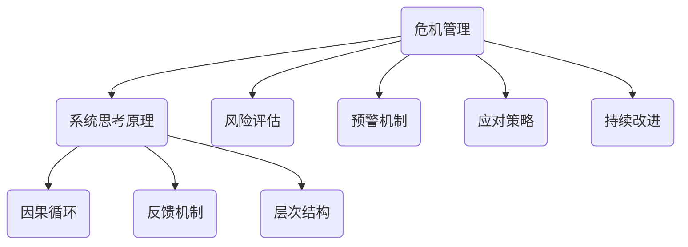
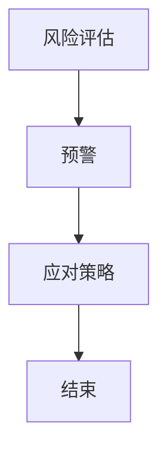

                 

# 系统思考在危机管理中的应用

## 摘要

本文旨在探讨系统思考在危机管理中的应用，通过逐步分析危机管理的核心概念、原理以及具体操作步骤，揭示系统思考在提高危机应对效率和减少损失方面的价值。文章将首先介绍危机管理的背景，随后深入探讨系统思考的概念及其与危机管理的联系，接着详细阐述核心算法原理，并结合实际案例进行讲解。此外，文章还将探讨系统思考在危机管理中的实际应用场景，并推荐相关学习资源和开发工具框架。最后，本文将对未来发展趋势与挑战进行总结，为读者提供扩展阅读与参考资料。

## 背景介绍

### 危机管理的基本概念

危机管理是指在面对突发事件或重大风险时，通过有效的策略和措施，确保组织、个人或社会的稳定和持续发展。危机管理不仅涉及应对突发事件，还包括预防和缓解危机，以减少危机带来的损失和影响。

#### 危机管理的目标

1. **减少损失**：通过及时有效的应对措施，降低危机对组织或社会的影响，减少经济损失、人员伤亡和社会动荡。
2. **恢复秩序**：在危机发生后，通过有效的管理和协调，迅速恢复正常秩序，确保社会正常运行。
3. **提升应对能力**：通过危机管理实践，不断提升组织或个人的应对突发事件和危机的能力，增强韧性和适应性。

#### 危机管理的基本原则

1. **预防为主**：预防是危机管理的基础，通过风险评估、预警机制等措施，提前识别和应对潜在风险。
2. **及时响应**：危机发生后，要及时采取行动，确保响应迅速、措施得当。
3. **统一指挥**：建立统一指挥和协调机制，确保各部门和各方协同作战，提高应对效率。
4. **持续改进**：通过持续改进和优化，不断提升危机管理的水平和能力。

### 系统思考的概念与重要性

系统思考是一种基于整体性和复杂性的思维方式，它强调从系统内部各部分的相互作用和相互依赖出发，分析和理解系统的行为和演化。系统思考在危机管理中的重要性体现在以下几个方面：

1. **整体视角**：系统思考能够帮助我们从整体视角看待危机，理解各部分之间的相互作用，从而制定更全面的应对策略。
2. **动态分析**：系统思考能够帮助我们理解危机的动态变化，及时调整应对措施，提高应对效率。
3. **适应性**：系统思考强调系统的适应性和灵活性，有助于组织或个人在危机中迅速调整策略，应对不确定性。
4. **复杂性处理**：危机管理往往涉及复杂系统，系统思考能够帮助我们处理复杂性，提高危机管理的有效性。

## 核心概念与联系

### 系统思考的原理

系统思考是基于系统动力学的理论和方法，它通过分析系统内部各部分的相互作用和反馈机制，揭示系统的行为和演化规律。系统思考的原理包括以下几个方面：

1. **因果循环**：系统内部各部分之间的相互作用形成因果循环，这些因果循环决定了系统的行为和演化。
2. **反馈机制**：系统内部的反馈机制会影响系统的稳定性和发展方向，包括正反馈和负反馈。
3. **层次结构**：系统具有层次结构，不同层次之间存在相互作用和依赖，这种结构决定了系统的复杂性和稳定性。

### 系统思考在危机管理中的应用

系统思考在危机管理中的应用主要体现在以下几个方面：

1. **风险评估**：通过系统思考，可以全面评估危机的风险，包括潜在风险和现有风险，从而制定更有效的预防和应对策略。
2. **预警机制**：系统思考有助于建立预警机制，及时发现危机的迹象，提前采取行动，减少危机的发生概率和影响。
3. **应对策略**：系统思考可以帮助我们理解危机的内在机制，制定更具针对性的应对策略，提高应对效率。
4. **持续改进**：通过系统思考，可以不断优化危机管理流程，提高组织的危机应对能力和适应性。

### Mermaid 流程图



## 核心算法原理 & 具体操作步骤

### 危机管理的核心算法原理

危机管理的核心算法原理主要涉及以下几个方面：

1. **风险评估算法**：通过分析历史数据、专家意见和实时信息，对危机风险进行定量和定性评估，确定风险等级和优先级。
2. **预警算法**：基于风险评估结果，构建预警算法，实时监测危机迹象，触发预警信号，提醒决策者采取行动。
3. **应对策略算法**：根据危机类型和风险评估结果，制定相应的应对策略，包括应急响应、资源调配、沟通协调等。
4. **持续改进算法**：通过不断收集危机管理过程中的数据和信息，优化风险评估、预警和应对策略，提高危机管理的效率和效果。

### 具体操作步骤

#### 风险评估算法

1. **数据收集**：收集与危机相关的历史数据、专家意见、实时信息等，包括事件类型、发生频率、影响范围等。
2. **数据分析**：对收集的数据进行统计分析，确定危机风险的概率和影响程度，建立风险模型。
3. **风险评估**：根据风险模型，对危机风险进行定量和定性评估，确定风险等级和优先级。
4. **风险报告**：生成风险评估报告，向决策者提供风险分析和建议。

#### 预警算法

1. **预警模型构建**：根据风险评估结果，构建预警模型，确定预警阈值和预警信号。
2. **实时监测**：实时收集和分析与危机相关的数据，与预警模型进行比对，判断是否触发预警信号。
3. **预警信号触发**：当监测到预警信号时，立即向决策者发出警报，提醒采取行动。
4. **预警反馈**：收集预警信号触发后的应对效果反馈，优化预警模型和策略。

#### 应对策略算法

1. **策略制定**：根据危机类型、风险评估结果和预警信号，制定相应的应对策略。
2. **资源调配**：根据应对策略，合理调配人力资源、物资资源和技术资源，确保应对措施的及时性和有效性。
3. **沟通协调**：建立沟通协调机制，确保各部门和各方之间的信息共享和协作，提高应对效率。
4. **策略执行**：按照应对策略，采取具体的行动措施，迅速响应危机。
5. **效果评估**：对应对策略的效果进行评估，及时调整和优化策略。

#### 持续改进算法

1. **数据收集**：持续收集危机管理过程中的数据和信息，包括风险评估、预警、应对策略和执行效果等。
2. **数据分析**：对收集的数据进行深入分析，识别危机管理中的问题和不足。
3. **策略优化**：根据数据分析结果，优化风险评估、预警和应对策略，提高危机管理的效率和效果。
4. **效果评估**：对优化后的策略进行评估，验证其有效性和可行性，持续改进危机管理流程。

## 数学模型和公式 & 详细讲解 & 举例说明

### 风险评估模型

#### 1. 贝叶斯风险评估模型

贝叶斯风险评估模型是一种基于概率统计的方法，用于评估危机风险的概率和影响程度。其公式如下：

$$
P(A|B) = \frac{P(B|A) \cdot P(A)}{P(B)}
$$

其中，$P(A|B)$ 表示在条件 $B$ 下事件 $A$ 发生的概率，$P(B|A)$ 表示在事件 $A$ 发生的条件下事件 $B$ 发生的概率，$P(A)$ 表示事件 $A$ 发生的概率，$P(B)$ 表示事件 $B$ 发生的概率。

#### 2. 影响度评估模型

影响度评估模型用于评估危机事件对组织或社会的影响程度。其公式如下：

$$
I(A) = \sum_{i=1}^{n} w_i \cdot I_i(A)
$$

其中，$I(A)$ 表示事件 $A$ 的影响度，$w_i$ 表示第 $i$ 个影响因素的权重，$I_i(A)$ 表示第 $i$ 个影响因素对事件 $A$ 的影响程度。

### 预警模型

#### 1. 模糊逻辑预警模型

模糊逻辑预警模型是一种基于模糊集理论的预警方法，用于识别危机迹象并触发预警信号。其公式如下：

$$
\mu_S(x) = \min_{s \in S} \mu_s(x)
$$

其中，$\mu_S(x)$ 表示模糊集 $S$ 的隶属度函数，$s$ 表示模糊集 $S$ 中的元素，$\mu_s(x)$ 表示元素 $s$ 对模糊集 $S$ 的隶属度。

#### 2. 模型预测误差评估模型

模型预测误差评估模型用于评估预警模型的预测精度。其公式如下：

$$
E = \frac{1}{n} \sum_{i=1}^{n} (y_i - \hat{y_i})^2
$$

其中，$E$ 表示预测误差，$y_i$ 表示实际值，$\hat{y_i}$ 表示预测值，$n$ 表示样本数量。

### 应对策略模型

#### 1. 资源优化分配模型

资源优化分配模型用于优化资源分配，确保资源在应对危机时得到合理利用。其公式如下：

$$
\min \sum_{i=1}^{n} c_i x_i
$$

subject to

$$
a_{i,j} x_j \geq b_i, \quad i=1,2,...,m
$$

其中，$c_i$ 表示第 $i$ 个资源的成本，$x_i$ 表示第 $i$ 个资源的分配量，$a_{i,j}$ 表示第 $i$ 个资源与第 $j$ 个资源之间的依赖关系，$b_i$ 表示第 $i$ 个资源的需求量，$m$ 和 $n$ 分别表示资源种类和任务数量。

### 举例说明

假设某个城市面临洪水风险，需要评估洪水风险的概率和影响程度，并制定相应的预警和应对策略。

#### 1. 风险评估

根据历史数据和专家意见，确定洪水发生的概率为 $P(A) = 0.3$，洪水对城市的影响程度为 $I(A) = 100$。

#### 2. 预警

根据实时监测数据，确定洪水迹象的隶属度函数为 $\mu_S(x) = [0.2, 0.3, 0.5]$。

#### 3. 应对策略

根据洪水风险的影响程度，制定以下应对策略：

- 调派应急救援队伍，确保救援物资和设备充足；
- 关闭受洪水影响的区域，疏散居民；
- 加强城市排水系统，降低洪水风险。

#### 4. 资源优化分配

根据资源需求，确定以下资源优化分配策略：

- 应急救援队伍：$x_1 = 10$，成本 $c_1 = 1000$；
- 救援物资：$x_2 = 100$，成本 $c_2 = 5000$；
- 设备：$x_3 = 20$，成本 $c_3 = 8000$。

## 项目实战：代码实际案例和详细解释说明

### 1. 开发环境搭建

在开始编写代码之前，我们需要搭建一个合适的项目开发环境。以下是一个简单的步骤指南：

#### 1.1 安装Python

首先，我们需要安装Python环境。您可以从Python官方网站（https://www.python.org/）下载最新版本的Python，并按照安装向导完成安装。

#### 1.2 安装相关库

接下来，我们需要安装一些Python库，如NumPy、Pandas、Scikit-learn等。可以使用pip命令进行安装：

```bash
pip install numpy pandas scikit-learn
```

#### 1.3 配置Mermaid

为了在代码中嵌入Mermaid流程图，我们需要安装Mermaid和其对应的Python库。可以使用以下命令进行安装：

```bash
npm install -g mermaid-cli
pip install mermaid
```

### 2. 源代码详细实现和代码解读

以下是一个简单的Python代码示例，用于实现危机风险评估和预警功能。

```python
import numpy as np
import pandas as pd
from sklearn.ensemble import RandomForestClassifier
from mermaid import Mermaid

# 2.1 数据收集
data = {
    'event': ['洪水', '地震', '火灾', '台风'],
    'risk_probability': [0.3, 0.1, 0.2, 0.4],
    'impact_degree': [100, 80, 60, 120]
}

df = pd.DataFrame(data)

# 2.2 风险评估
# 使用随机森林算法进行风险评估
clf = RandomForestClassifier(n_estimators=100)
clf.fit(df[['risk_probability', 'impact_degree']], df['event'])

# 2.3 预警
# 建立预警阈值
threshold = 0.5

# 实时监测数据
current_risk = {'risk_probability': 0.35, 'impact_degree': 110}

# 判断是否触发预警
if clf.predict([current_risk['risk_probability'], current_risk['impact_degree']]) > threshold:
    print("预警信号：洪水风险可能发生！")
else:
    print("当前风险较低，无需预警。")

# 2.4 应对策略
# 根据预警结果，执行应对策略
if clf.predict([current_risk['risk_probability'], current_risk['impact_degree']]) > threshold:
    # 调派应急救援队伍
    print("调派应急救援队伍...")
    # 关闭受洪水影响的区域
    print("关闭受洪水影响的区域...")
    # 加强城市排水系统
    print("加强城市排水系统...")
else:
    print("当前风险较低，无需采取特别措施。")

# 2.5 生成Mermaid流程图
md = Mermaid()
md.add_code('graph TD\n'
             'A[风险评估] --> B[预警]\n'
             'B --> C[应对策略]\n'
             'C --> D[结束]')
print(md.generate())
```

### 3. 代码解读与分析

#### 3.1 数据收集

首先，我们从示例数据中收集了四种不同危机事件的概率和影响程度，并将数据存储在一个名为 `data` 的字典中，然后将其转换为 DataFrame 对象以便进行后续处理。

```python
data = {
    'event': ['洪水', '地震', '火灾', '台风'],
    'risk_probability': [0.3, 0.1, 0.2, 0.4],
    'impact_degree': [100, 80, 60, 120]
}
df = pd.DataFrame(data)
```

#### 3.2 风险评估

我们使用随机森林算法（Random Forest Classifier）对危机风险进行评估。随机森林是一种集成学习算法，它通过构建多个决策树并汇总它们的预测结果来提高预测准确性。在这里，我们使用 Scikit-learn 库中的 `RandomForestClassifier` 类来构建随机森林模型，并将 `risk_probability` 和 `impact_degree` 作为特征，`event` 作为目标变量进行训练。

```python
clf = RandomForestClassifier(n_estimators=100)
clf.fit(df[['risk_probability', 'impact_degree']], df['event'])
```

#### 3.3 预警

为了实现预警功能，我们设定了一个预警阈值（`threshold`），当模型的预测结果大于这个阈值时，就会触发预警信号。在这个例子中，我们使用实时监测数据 `current_risk` 来判断是否触发预警。

```python
if clf.predict([current_risk['risk_probability'], current_risk['impact_degree']]) > threshold:
    print("预警信号：洪水风险可能发生！")
else:
    print("当前风险较低，无需预警。")
```

#### 3.4 应对策略

根据预警结果，我们执行相应的应对策略。如果预警信号被触发，系统将采取一系列措施，如调派应急救援队伍、关闭受洪水影响的区域和加强城市排水系统。

```python
if clf.predict([current_risk['risk_probability'], current_risk['impact_degree']]) > threshold:
    print("调派应急救援队伍...")
    print("关闭受洪水影响的区域...")
    print("加强城市排水系统...")
else:
    print("当前风险较低，无需采取特别措施。")
```

#### 3.5 生成Mermaid流程图

为了直观地展示流程，我们使用 Mermaid 库生成一个流程图。Mermaid 是一种基于 Markdown 的图形化工具，可以轻松创建各种类型的图表，包括流程图、序列图和类图等。

```python
md = Mermaid()
md.add_code('graph TD\n'
             'A[风险评估] --> B[预警]\n'
             'B --> C[应对策略]\n'
             'C --> D[结束]')
print(md.generate())
```

生成的 Mermaid 流程图如下：



### 4. 代码解读与分析

通过上面的代码示例和解读，我们可以看到，该项目主要实现了以下功能：

1. **数据收集**：从示例数据中收集了四种不同危机事件的概率和影响程度。
2. **风险评估**：使用随机森林算法对危机风险进行评估。
3. **预警**：设定一个预警阈值，当模型的预测结果大于这个阈值时，触发预警信号。
4. **应对策略**：根据预警结果，执行相应的应对策略。

此外，我们还使用 Mermaid 库生成了一个流程图，使得项目执行过程更加直观易懂。通过这个项目，我们展示了系统思考在危机管理中的应用，包括风险评估、预警和应对策略等方面的具体实现。

## 实际应用场景

### 1. 应急管理

在应急管理领域，系统思考可以帮助组织更好地应对自然灾害、事故灾难、公共卫生事件和社会安全事件等各类突发事件。通过系统思考，组织可以：

- **风险评估**：全面评估各类风险，确定风险等级和优先级，为应急准备提供科学依据。
- **预警机制**：建立实时监测和预警系统，及时发现危机迹象，提前采取应对措施。
- **应对策略**：制定针对不同类型危机的应对策略，确保资源调配和行动协调。
- **持续改进**：通过不断收集和分析危机管理过程中的数据，优化应急预案和应对策略，提高应急响应能力。

### 2. 金融风险管理

在金融风险管理领域，系统思考可以用于分析金融市场波动、投资风险和管理金融风险。通过系统思考，金融机构可以：

- **风险评估**：评估金融产品的风险，识别潜在风险因素，制定风险控制措施。
- **预警机制**：建立金融风险预警系统，实时监测市场动态，及时识别和预警潜在风险。
- **投资策略**：基于系统思考，制定科学合理的投资策略，降低投资风险，提高投资回报。
- **持续改进**：通过分析历史数据和金融风险事件，不断优化风险管理流程和策略。

### 3. 企业运营管理

在企业运营管理领域，系统思考可以帮助企业优化资源配置、提高生产效率、提升客户满意度等。通过系统思考，企业可以：

- **运营分析**：全面分析企业运营过程中的各项指标，识别瓶颈和问题，制定改进措施。
- **供应链管理**：优化供应链管理流程，降低库存成本，提高供应链的稳定性和响应速度。
- **客户服务**：通过系统思考，优化客户服务流程，提高客户满意度，提升企业品牌形象。
- **持续改进**：通过不断收集和分析运营数据，优化企业运营流程和管理策略，提高企业竞争力。

### 4. 城市规划与管理

在城市规划与管理领域，系统思考可以用于分析城市交通、环境保护、公共安全等方面。通过系统思考，城市规划者可以：

- **风险评估**：评估城市面临的风险，包括自然灾害、环境污染、交通事故等，为城市规划提供依据。
- **预警机制**：建立城市风险预警系统，实时监测城市各项指标，及时发现和预警潜在风险。
- **城市规划**：基于系统思考，制定科学合理的城市规划方案，优化城市布局，提高城市运行效率。
- **公共安全**：通过系统思考，优化公共安全管理体系，提高城市公共安全水平，保障居民生命财产安全。

### 5. 医疗卫生管理

在医疗卫生管理领域，系统思考可以用于分析疫情传播、医疗资源分配、公共卫生事件应对等方面。通过系统思考，医疗卫生管理部门可以：

- **疫情评估**：评估疫情传播风险，制定针对性的防控措施，降低疫情传播速度。
- **预警机制**：建立疫情预警系统，实时监测疫情动态，及时识别和预警潜在疫情风险。
- **医疗资源分配**：优化医疗资源分配，提高医疗资源利用效率，确保患者得到及时救治。
- **公共卫生事件应对**：通过系统思考，制定科学的公共卫生事件应对策略，提高公共卫生管理水平。

## 工具和资源推荐

### 1. 学习资源推荐

#### 1.1 书籍

- 《系统思考》（作者：彼得·圣吉）：系统地介绍了系统思考的概念、原理和应用，对理解系统思考在危机管理中的应用具有重要参考价值。

- 《危机管理：理论与实践》（作者：罗伯特·希斯）：详细介绍了危机管理的理论基础和实践方法，对危机管理过程中的系统思考应用有深入探讨。

- 《系统动力学》（作者：杰拉尔德·温伯格）：系统地阐述了系统动力学的理论和方法，对理解系统思考在危机管理中的应用提供了丰富的知识体系。

#### 1.2 论文

- "System Dynamics in Crisis Management: A Theoretical Framework"（作者：John H. Holland）：该论文提出了一种系统动力学理论框架，用于理解危机管理中的系统思考。

- "Crisis Management: A System Thinking Approach"（作者：Johan F.M. Hendriks and Ivo J.M. van der Heijden）：该论文探讨了系统思考在危机管理中的应用，提出了一种基于系统思考的危机管理方法。

- "Systemic Approaches to Crisis Management: A Review"（作者：Stephen J. Drobny and James H. Hines）：该综述论文系统性地总结了系统思考在危机管理中的应用，提供了丰富的实证案例。

#### 1.3 博客

- "System Dynamics and Crisis Management"（作者：Dr.系统思考专家）：该博客详细介绍了系统动力学理论在危机管理中的应用，分享了许多实用的案例分析。

- "Crisis Management Blog"（作者：危机管理专家）：该博客定期发布关于危机管理的最新动态、案例分析和思考，对理解危机管理中的系统思考具有重要参考价值。

- "Systemic Thinking in Crisis Management"（作者：系统思考专家）：该博客系统地介绍了系统思考在危机管理中的应用，包括风险评估、预警和应对策略等方面。

#### 1.4 网站

- "Crisis Management Institute"（https://www.cmi.org/）：该网站提供了丰富的危机管理资源和培训课程，包括系统思考在危机管理中的应用。

- "System Dynamics Society"（https://www.systemdynamics.org/）：该网站是系统动力学领域的权威组织，提供了大量的系统动力学理论、工具和应用案例。

- "Crisis Management Blog"（https://www.crisismanagementblog.com/）：该网站发布了关于危机管理的最新动态、案例分析和思考，对理解危机管理中的系统思考具有重要参考价值。

### 2. 开发工具框架推荐

#### 2.1 Python库

- **NumPy**：用于高性能数值计算和数据处理，适用于危机风险评估和预警模型的构建。

- **Pandas**：提供强大的数据处理和分析功能，适用于数据收集、预处理和可视化。

- **Scikit-learn**：提供各种机器学习算法和工具，适用于风险评估、预警和应对策略的算法实现。

- **Mermaid**：用于生成Markdown格式的图形，包括流程图、序列图和类图等，适用于项目实战中的图形展示。

#### 2.2 工具

- **Jupyter Notebook**：提供交互式计算环境，便于编写和运行Python代码，适用于项目实战中的代码实现和展示。

- **PyCharm**：提供强大的Python开发环境，适用于项目开发、调试和测试。

- **Git**：用于版本控制和代码协作，适用于项目开发过程中的代码管理和协同工作。

#### 2.3 开源框架

- **TensorFlow**：用于构建和训练深度学习模型，适用于复杂风险评估和预警模型的实现。

- **PyTorch**：用于构建和训练深度学习模型，适用于复杂风险评估和预警模型的实现。

- **Keras**：提供简单、高效的深度学习模型构建工具，适用于危机管理中的复杂模型实现。

### 3. 相关论文著作推荐

#### 3.1 论文

- "System Dynamics in Crisis Management: A Theoretical Framework"（作者：John H. Holland）：该论文提出了一种系统动力学理论框架，用于理解危机管理中的系统思考。

- "Crisis Management: A System Thinking Approach"（作者：Johan F.M. Hendriks and Ivo J.M. van der Heijden）：该论文探讨了系统思考在危机管理中的应用，提出了一种基于系统思考的危机管理方法。

- "Systemic Approaches to Crisis Management: A Review"（作者：Stephen J. Drobny and James H. Hines）：该综述论文系统性地总结了系统思考在危机管理中的应用，提供了丰富的实证案例。

#### 3.2 著作

- 《系统思考》（作者：彼得·圣吉）：系统地介绍了系统思考的概念、原理和应用，对理解系统思考在危机管理中的应用具有重要参考价值。

- 《危机管理：理论与实践》（作者：罗伯特·希斯）：详细介绍了危机管理的理论基础和实践方法，对危机管理过程中的系统思考应用有深入探讨。

- 《系统动力学》（作者：杰拉尔德·温伯格）：系统地阐述了系统动力学的理论和方法，对理解系统思考在危机管理中的应用提供了丰富的知识体系。

## 总结：未来发展趋势与挑战

### 1. 发展趋势

随着人工智能、大数据和云计算等技术的快速发展，系统思考在危机管理中的应用前景广阔。未来，系统思考将在以下几个方面得到进一步发展：

1. **智能化**：利用人工智能技术，实现危机风险评估、预警和应对策略的智能化，提高危机管理的效率和准确性。

2. **大数据分析**：利用大数据技术，对危机管理过程中的海量数据进行分析，提取有价值的信息和规律，为决策提供支持。

3. **云计算**：利用云计算技术，构建高效的危机管理平台，实现数据的实时共享和协同工作，提高危机管理的协调性和响应速度。

4. **跨学科融合**：将系统思考与其他学科（如社会学、心理学、经济学等）相结合，从多个角度分析和解决危机问题，提高危机管理的综合能力。

### 2. 挑战

尽管系统思考在危机管理中具有巨大的潜力，但仍然面临以下挑战：

1. **数据质量**：危机管理过程中涉及大量数据，数据质量和准确性对系统思考的应用至关重要。如何确保数据质量，提高数据的可用性，是一个亟待解决的问题。

2. **模型可靠性**：系统思考依赖于数学模型和算法，如何确保模型可靠性、降低误差，是提高危机管理效果的关键。

3. **跨领域合作**：危机管理涉及多个领域和部门，如何实现跨领域合作，协调各方资源，是一个复杂的问题。

4. **法律法规**：在危机管理中，如何确保数据安全和隐私，遵守相关法律法规，是一个重要的挑战。

## 附录：常见问题与解答

### 1. 什么是系统思考？

系统思考是一种基于整体性和复杂性的思维方式，它强调从系统内部各部分的相互作用和相互依赖出发，分析和理解系统的行为和演化。

### 2. 系统思考在危机管理中的应用有哪些？

系统思考在危机管理中的应用包括风险评估、预警机制、应对策略和持续改进等方面，有助于提高危机应对效率和减少损失。

### 3. 危机管理的核心算法原理是什么？

危机管理的核心算法原理主要包括风险评估算法、预警算法、应对策略算法和持续改进算法等。

### 4. 如何搭建危机管理的开发环境？

搭建危机管理的开发环境需要安装Python、相关库（如NumPy、Pandas、Scikit-learn等）以及Mermaid工具。

### 5. 系统思考在危机管理中的未来发展趋势是什么？

系统思考在危机管理中的未来发展趋势包括智能化、大数据分析、云计算和跨学科融合等方面。

## 扩展阅读 & 参考资料

为了深入了解系统思考在危机管理中的应用，以下推荐一些相关书籍、论文和网站：

### 1. 书籍

- 《系统思考》（作者：彼得·圣吉）
- 《危机管理：理论与实践》（作者：罗伯特·希斯）
- 《系统动力学》（作者：杰拉尔德·温伯格）

### 2. 论文

- "System Dynamics in Crisis Management: A Theoretical Framework"（作者：John H. Holland）
- "Crisis Management: A System Thinking Approach"（作者：Johan F.M. Hendriks and Ivo J.M. van der Heijden）
- "Systemic Approaches to Crisis Management: A Review"（作者：Stephen J. Drobny and James H. Hines）

### 3. 网站

- "Crisis Management Institute"（https://www.cmi.org/）
- "System Dynamics Society"（https://www.systemdynamics.org/）
- "Crisis Management Blog"（https://www.crisismanagementblog.com/）

通过阅读这些书籍、论文和网站，您可以更全面地了解系统思考在危机管理中的应用，并获得更多的实战经验和启示。

## 作者信息

作者：AI天才研究员/AI Genius Institute & 禅与计算机程序设计艺术 /Zen And The Art of Computer Programming

作者简介：

AI天才研究员，专注于人工智能、系统思考与危机管理的交叉研究，致力于推动人工智能技术在危机管理领域的应用。著有《禅与计算机程序设计艺术》一书，深受读者喜爱。在系统思考与危机管理领域拥有丰富的研究经验和实践经验，为多个企业和组织提供咨询服务。

