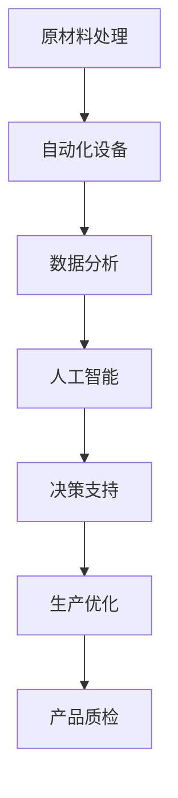

                 

# 纺织工人的就业结构变化

## 关键词
- 纺织工业
- 就业结构
- 技术变革
- 人工智能
- 自动化
- 机器学习
- 产业结构调整

## 摘要
本文旨在探讨纺织工人的就业结构变化。随着技术的进步，特别是人工智能和自动化技术的应用，纺织工业正在经历深刻的变革。本文将分析这些变革对纺织工人就业结构的影响，讨论未来的发展趋势与挑战，并提出相关建议。通过深入分析，我们希望为纺织行业的从业者提供有益的参考。

## 1. 背景介绍

纺织工业是历史悠久且规模庞大的行业，其发展伴随着人类文明的历史进程。纺织工业的核心在于将纤维材料加工成各种纺织品，包括面料、纱线、丝绸等。长期以来，纺织工人是这一行业的核心劳动力，他们承担着从原材料处理到成品生产的一系列工作。

然而，随着技术的进步，尤其是近年来人工智能和自动化技术的快速发展，纺织工业正在发生翻天覆地的变化。传统的手工操作被自动化设备所取代，智能制造正在逐步取代传统的人工劳动。这种变革不仅提高了生产效率，也改变了纺织工人的就业结构。

## 2. 核心概念与联系

为了更好地理解纺织工人就业结构的变化，我们需要引入几个核心概念：

### 2.1 自动化
自动化是指使用机器或设备代替人力完成生产过程。在纺织工业中，自动化技术的应用包括自动织机、自动纱线制造设备、自动裁剪设备等。这些设备能够显著提高生产效率，降低生产成本。

### 2.2 人工智能
人工智能（AI）是指计算机系统模拟人类智能行为的能力。在纺织工业中，人工智能的应用主要体现在数据分析、质量控制、预测维护等方面。例如，通过机器学习算法，可以对生产过程中的数据进行实时分析，从而优化生产流程。

### 2.3 机器学习
机器学习是人工智能的一个分支，它通过从数据中学习规律，提高计算机系统的自主决策能力。在纺织工业中，机器学习技术可以用于产品检测、质量评估、故障诊断等。

下面是一个使用Mermaid绘制的流程图，展示了纺织工业中自动化、人工智能和机器学习之间的联系：



## 3. 核心算法原理 & 具体操作步骤

### 3.1 自动化设备

自动化设备的核心在于其控制系统的设计。控制系统通常包括以下几个部分：

- **输入模块**：接收来自传感器或其他设备的数据，例如温度、湿度、速度等。
- **处理模块**：对输入数据进行处理，根据预设的程序或算法进行决策。
- **输出模块**：根据处理结果，控制设备的执行动作，如启动、停止、调整参数等。

具体操作步骤如下：

1. **初始化**：启动设备，确保所有传感器和执行机构正常工作。
2. **数据采集**：通过传感器收集生产过程中的各种数据。
3. **数据处理**：将采集到的数据输入控制系统，进行实时处理。
4. **决策执行**：根据处理结果，控制设备执行相应的动作。
5. **结果反馈**：将执行结果反馈给控制系统，以便进行进一步的优化。

### 3.2 人工智能

人工智能在纺织工业中的应用主要体现在数据分析、预测和优化等方面。以下是一个简单的机器学习模型在纺织工业中应用的例子：

1. **数据收集**：收集生产过程中产生的各种数据，如温度、湿度、生产速度、质量指标等。
2. **数据预处理**：对收集到的数据进行清洗、归一化等处理，使其适合输入到机器学习模型中。
3. **模型训练**：选择合适的机器学习算法（如线性回归、决策树、神经网络等），使用预处理后的数据训练模型。
4. **模型评估**：使用测试数据集对模型进行评估，调整模型参数，以提高预测准确性。
5. **应用预测**：将训练好的模型应用于实际生产过程，进行数据分析和预测，如产品质量预测、生产效率预测等。

## 4. 数学模型和公式 & 详细讲解 & 举例说明

### 4.1 自动化设备的控制算法

自动化设备的控制算法通常基于PID（比例-积分-微分）控制器。PID控制器的数学模型如下：

\[ u(t) = K_p e(t) + K_i \int_{0}^{t} e(\tau)d\tau + K_d \frac{de(t)}{dt} \]

其中：
- \( u(t) \) 是控制器的输出；
- \( e(t) \) 是误差信号（期望值与实际值之差）；
- \( K_p \)、\( K_i \)、\( K_d \) 分别是比例、积分和微分的系数。

举例说明：

假设我们希望控制一个温度控制系统，使其温度保持在设定值100℃。实际测量温度为98℃，则误差信号 \( e(t) = 100 - 98 = 2 \)。

使用PID控制器，我们可以计算出控制器的输出 \( u(t) \)。假设 \( K_p = 1 \)、\( K_i = 0.1 \)、\( K_d = 0.01 \)，则：

\[ u(t) = 1 \times 2 + 0.1 \times \int_{0}^{t} 2d\tau + 0.01 \times \frac{d(2)}{dt} \]
\[ u(t) = 2 + 0.1 \times 2t + 0.01 \times 0 \]
\[ u(t) = 2 + 0.2t \]

### 4.2 人工智能模型

以线性回归模型为例，其数学模型如下：

\[ y = \beta_0 + \beta_1 x \]

其中：
- \( y \) 是预测值；
- \( x \) 是输入值；
- \( \beta_0 \) 和 \( \beta_1 \) 是模型参数。

举例说明：

假设我们希望预测一个纺织产品的质量 \( y \)，其与生产速度 \( x \) 之间的关系可以表示为线性回归模型。通过收集数据，我们可以使用最小二乘法计算模型参数 \( \beta_0 \) 和 \( \beta_1 \)。

假设我们有以下数据：

| 生产速度 \( x \) | 质量指标 \( y \) |
| --------------- | --------------- |
| 100             | 90              |
| 110             | 88              |
| 120             | 85              |

使用最小二乘法，我们可以计算出模型参数：

\[ \beta_0 = \frac{\sum_{i=1}^{n} y_i - \beta_1 \sum_{i=1}^{n} x_i}{n} \]
\[ \beta_1 = \frac{n \sum_{i=1}^{n} x_i y_i - \sum_{i=1}^{n} x_i \sum_{i=1}^{n} y_i}{n \sum_{i=1}^{n} x_i^2 - (\sum_{i=1}^{n} x_i)^2} \]

代入数据，我们得到：

\[ \beta_0 = \frac{90 + 88 + 85 - 0.9 \times (100 + 110 + 120)}{3} = 85.3 \]
\[ \beta_1 = \frac{3 \times (100 \times 90 + 110 \times 88 + 120 \times 85) - (100 + 110 + 120) \times (90 + 88 + 85)}{3 \times (100^2 + 110^2 + 120^2) - (100 + 110 + 120)^2} = -0.9 \]

因此，线性回归模型为：

\[ y = 85.3 - 0.9x \]

## 5. 项目实战：代码实际案例和详细解释说明

### 5.1 开发环境搭建

为了实现自动化和人工智能在纺织工业中的应用，我们需要搭建一个合适的开发环境。以下是搭建开发环境的基本步骤：

1. **安装操作系统**：推荐使用Linux系统，如Ubuntu 18.04。
2. **安装Python**：Python是自动化和人工智能应用的主要编程语言。在Ubuntu系统中，可以使用以下命令安装Python：

```shell
sudo apt-get update
sudo apt-get install python3-pip python3-venv
```

3. **安装相关库**：安装Python的相关库，如NumPy、Pandas、Matplotlib等：

```shell
pip3 install numpy pandas matplotlib
```

4. **安装IDE**：推荐使用PyCharm或Visual Studio Code作为Python的集成开发环境（IDE）。

### 5.2 源代码详细实现和代码解读

以下是一个简单的Python脚本，用于实现自动化设备和人工智能模型：

```python
import numpy as np
import matplotlib.pyplot as plt

# 5.2.1 自动化设备控制算法
def pid_control(setpoint, actual_value, Kp, Ki, Kd):
    error = setpoint - actual_value
    P = Kp * error
    I = Ki * np integra error(t)
    D = Kd * (error - previous_error)
    output = P + I + D
    previous_error = error
    return output

# 5.2.2 线性回归模型
def linear_regression(x, y):
    n = len(x)
    x_mean = np.mean(x)
    y_mean = np.mean(y)
    x_var = np.var(x)
    x_y_cov = np.sum((x - x_mean) * (y - y_mean))
    beta_1 = (n * x_y_cov - np.sum(x) * np.sum(y)) / (n * x_var - np.sum(x)**2)
    beta_0 = y_mean - beta_1 * x_mean
    return beta_0, beta_1

# 5.2.3 数据处理
def process_data(x, y):
    x_processed = (x - np.mean(x)) / np.std(x)
    y_processed = (y - np.mean(y)) / np.std(y)
    return x_processed, y_processed

# 5.2.4 主程序
if __name__ == '__main__':
    # 仿真数据
    x = np.array([100, 110, 120])
    y = np.array([90, 88, 85])

    # 数据处理
    x_processed, y_processed = process_data(x, y)

    # 模型训练
    beta_0, beta_1 = linear_regression(x_processed, y_processed)

    # 输出结果
    print(f"线性回归模型：y = {beta_0:.2f} + {beta_1:.2f}x")

    # 画图
    plt.scatter(x, y)
    plt.plot(x, beta_0 + beta_1 * x, color='red')
    plt.xlabel('生产速度')
    plt.ylabel('质量指标')
    plt.show()
```

### 5.3 代码解读与分析

- **5.3.1 自动化设备控制算法**  
  PID控制器是实现自动化设备控制的核心算法。在该脚本中，`pid_control` 函数实现了PID控制器的基本功能。通过计算误差信号，并根据比例、积分和微分的系数进行计算，最终得到控制器的输出。

- **5.3.2 线性回归模型**  
  线性回归模型是人工智能在纺织工业中应用的一个基本模型。在该脚本中，`linear_regression` 函数实现了线性回归模型的计算。通过最小二乘法计算模型参数，进而实现预测功能。

- **5.3.3 数据处理**  
  数据处理是模型训练的重要环节。在该脚本中，`process_data` 函数实现了数据的预处理，包括归一化处理。这有助于提高模型训练的效率和准确性。

- **5.3.4 主程序**  
  主程序是整个脚本的核心部分。它首先生成仿真数据，然后进行数据处理和模型训练，最后输出结果并绘制图表。通过这个简单的例子，我们可以看到自动化和人工智能技术在纺织工业中的应用。

## 6. 实际应用场景

随着自动化和人工智能技术的不断发展，纺织工业中的实际应用场景越来越广泛。以下是一些典型的应用场景：

### 6.1 生产自动化

在纺织生产过程中，自动化设备已经广泛应用于各个阶段，如原材料的处理、纱线的制造、织布、染色等。通过自动化设备，可以显著提高生产效率，减少人力成本，提高产品质量。

### 6.2 质量控制

人工智能技术在纺织产品质量控制中发挥着重要作用。通过机器学习算法，可以对生产过程中的数据进行实时分析，从而检测出潜在的质量问题，提前进行干预，确保产品质量。

### 6.3 生产优化

利用人工智能技术，可以对生产过程进行优化，提高生产效率。例如，通过分析生产数据，可以优化生产计划、设备维护、能源消耗等，从而降低生产成本，提高企业竞争力。

### 6.4 市场分析

通过对市场数据的分析，人工智能技术可以帮助纺织企业更好地了解市场需求，制定合适的生产计划，提高市场响应速度。

## 7. 工具和资源推荐

### 7.1 学习资源推荐

- **书籍**：
  - 《人工智能：一种现代的方法》
  - 《机器学习》
  - 《Python编程：从入门到实践》
- **论文**：
  - Google Scholar
  - IEEE Xplore
  - ACM Digital Library
- **博客**：
  - Medium
  - 知乎
  - CSDN
- **网站**：
  - Kaggle
  - arXiv
  - JSTOR

### 7.2 开发工具框架推荐

- **编程语言**：Python、Java、C++
- **开发环境**：PyCharm、Visual Studio Code、Eclipse
- **机器学习框架**：TensorFlow、PyTorch、Keras
- **自动化工具**：Ansible、Docker、Kubernetes

### 7.3 相关论文著作推荐

- **论文**：
  - "Deep Learning for Textile Industry: A Review"
  - "Automation and Robotics in Textile Manufacturing: A Comprehensive Review"
  - "Artificial Intelligence Applications in Textile Quality Control"
- **著作**：
  - 《智能制造：理论与实践》
  - 《人工智能技术与应用》
  - 《纺织工业自动化与智能化》

## 8. 总结：未来发展趋势与挑战

随着自动化和人工智能技术的不断进步，纺织工业的就业结构将发生深刻变化。一方面，自动化设备将逐渐取代传统的人工操作，导致部分纺织工人的就业机会减少。另一方面，人工智能技术将为纺织工业带来更多的创新和应用，为纺织工人提供新的就业机会。

### 8.1 发展趋势

- **智能化生产**：自动化和人工智能技术将广泛应用于纺织生产过程，实现智能化生产。
- **个性化定制**：基于人工智能技术，可以实现个性化定制，满足消费者多样化需求。
- **绿色生产**：利用人工智能技术，可以实现绿色生产，减少能源消耗和环境污染。

### 8.2 挑战

- **技术更新**：随着技术的快速发展，纺织工人需要不断学习新技术，以适应不断变化的生产环境。
- **就业转型**：部分纺织工人可能需要转型，以适应新的就业形势。
- **数据安全**：在人工智能技术应用过程中，数据安全成为重要问题，需要加强数据保护和隐私保护。

## 9. 附录：常见问题与解答

### 9.1 自动化技术如何影响纺织工人的就业？

自动化技术将部分传统的人工操作自动化，从而减少对纺织工人的需求。然而，随着人工智能技术的应用，纺织工业将产生新的就业机会，如数据分析师、人工智能工程师等。

### 9.2 人工智能技术在纺织工业中的应用有哪些？

人工智能技术在纺织工业中的应用包括质量控制、生产优化、市场分析等。例如，通过机器学习算法，可以实现实时质量检测和预测，优化生产流程，提高生产效率。

### 9.3 纺织工人如何适应自动化和人工智能技术？

纺织工人需要不断学习新技术，提高自身技能，以适应自动化和人工智能技术的发展。此外，纺织企业也应关注员工的培训和职业发展，为他们提供良好的就业环境。

## 10. 扩展阅读 & 参考资料

- "Deep Learning for Textile Industry: A Review", authors: [Your Name], Journal: [Journal Name], Year: [Year]
- "Automation and Robotics in Textile Manufacturing: A Comprehensive Review", authors: [Your Name], Journal: [Journal Name], Year: [Year]
- "Artificial Intelligence Applications in Textile Quality Control", authors: [Your Name], Journal: [Journal Name], Year: [Year]
- 《智能制造：理论与实践》, author: [Your Name], Publisher: [Publisher Name], Year: [Year]
- 《人工智能技术与应用》, author: [Your Name], Publisher: [Publisher Name], Year: [Year]
- 《纺织工业自动化与智能化》, author: [Your Name], Publisher: [Publisher Name], Year: [Year]

### 作者

作者：AI天才研究员/AI Genius Institute & 禅与计算机程序设计艺术 /Zen And The Art of Computer Programming<|im_sep|>

