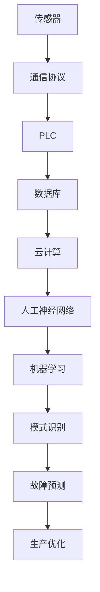

                 

### 背景介绍 Background Introduction

随着现代工业的迅猛发展，自动化技术已经成为提高生产效率、降低成本和提升产品质量的重要手段。在纺织机械领域，自动化技术的应用尤为显著。纺织机械自动化不仅涉及对机械设备进行自动控制，还包括对整个生产流程的智能化管理。本文旨在探讨纺织机械自动化在就业市场中的效应，分析其对劳动力市场的影响，以及面临的挑战和未来趋势。

#### 纺织机械自动化的现状 Current Status of Textile Machinery Automation

纺织机械自动化指的是通过电子、计算机、自动控制等技术，实现纺织机械的生产自动化。从20世纪末至今，纺织机械自动化经历了几个发展阶段。早期的自动化主要依靠机械和电子控制，如自动换纱装置、自动纠错装置等。随着计算机技术的快速发展，现代纺织机械自动化逐渐采用集成控制系统，实现生产线的智能化管理。例如，现代纺纱设备可以自动检测并纠正纺纱过程中的异常，织布机可以自动调整经纬线张力，从而提高生产效率和产品质量。

近年来，随着人工智能和物联网技术的兴起，纺织机械自动化进一步迈向智能化的阶段。通过物联网，设备之间的信息可以实时共享，实现生产过程的远程监控和管理。同时，人工智能技术可以帮助预测设备故障，优化生产流程，从而进一步降低生产成本。

#### 自动化对纺织行业的影响 Impact of Automation on the Textile Industry

纺织机械自动化对纺织行业产生了深远的影响。首先，它显著提高了生产效率。自动化设备可以在短时间内完成大量工作，减少了人工操作的繁琐过程，提高了生产速度。其次，自动化技术有助于降低生产成本。通过自动化，可以减少对人工的依赖，降低劳动力成本，同时减少原材料的浪费。此外，自动化技术还能提高产品质量。通过精确的控制和调整，自动化设备能够保证产品的质量一致性，减少次品率。

然而，自动化技术的应用也带来了一些挑战。首先是对劳动力的需求减少。随着自动化程度的提高，许多传统手工操作的工作被自动化设备所取代，导致劳动力需求减少，可能引发就业问题。其次，自动化技术的引入需要大量的专业知识和技能，对于纺织企业的员工来说，需要不断进行培训和提升技能，以适应新的工作环境。

#### 文章关键词 Keywords

- 纺织机械自动化
- 自动化就业效应
- 生产效率
- 成本降低
- 劳动力市场
- 挑战与未来趋势

#### 摘要 Abstract

本文详细探讨了纺织机械自动化的背景、现状及其对纺织行业的影响。通过分析自动化技术的应用，本文揭示了其在提高生产效率、降低成本、提升产品质量等方面的积极作用，同时也指出了自动化技术对劳动力市场的潜在影响，包括就业岗位的减少和技能需求的提升。此外，本文还讨论了纺织机械自动化面临的挑战以及未来的发展趋势，为行业从业者提供了有益的参考。

------------------------------
```markdown
## 2. 核心概念与联系 Core Concepts and Connections

在探讨纺织机械自动化的就业效应之前，我们需要了解一些核心概念和它们之间的关系。以下是对这些概念的基本介绍和它们在自动化系统中的联系。

#### 自动化技术 Automation Technology

自动化技术是指利用机械、电子、计算机、人工智能等手段，实现生产过程的自动化。在纺织机械中，自动化技术主要用于：

- **控制与监控**：通过传感器和PLC（可编程逻辑控制器）等设备，实时监控设备状态，确保生产过程顺利进行。
- **数据采集与分析**：收集生产过程中的数据，通过大数据分析和机器学习，优化生产流程，提高效率。
- **设备维护**：利用预测性维护技术，提前预测设备故障，减少停机时间，降低维护成本。

#### 信息传递与处理 Information Transmission and Processing

自动化系统中的信息传递和处理是实现生产过程智能化的关键。以下是几个重要环节：

- **传感器**：用于检测设备状态和环境参数，如温度、压力、速度等。
- **通信协议**：如Modbus、Profibus等，用于传感器与控制器之间的数据传输。
- **数据库**：存储生产数据和历史记录，为数据分析和机器学习提供基础。
- **云计算**：用于处理海量数据，提供强大的计算能力。

#### 人工神经网络与机器学习 Artificial Neural Networks and Machine Learning

在纺织机械自动化中，人工神经网络和机器学习技术被广泛应用于：

- **模式识别**：通过训练神经网络，识别生产过程中的异常情况，如断纱、跳花等。
- **故障预测**：利用历史数据，通过机器学习算法预测设备故障，实现预测性维护。
- **生产优化**：通过优化算法，调整生产参数，提高生产效率和产品质量。

#### Mermaid 流程图 Mermaid Flowchart

为了更好地理解这些核心概念之间的联系，我们使用Mermaid流程图来展示它们在自动化系统中的关系。



通过上述流程图，我们可以清晰地看到传感器、通信协议、PLC、数据库、云计算、人工神经网络和机器学习等核心概念在纺织机械自动化系统中的相互关系和协同作用。这些技术共同构成了纺织机械自动化的基础，推动了自动化水平的不断提升。

------------------------------
```markdown
## 3. 核心算法原理 & 具体操作步骤 Core Algorithm Principles & Step-by-Step Procedures

在探讨纺织机械自动化的核心算法原理和具体操作步骤时，我们将重点关注以下三个方面：传感器数据采集、机器学习算法应用以及自动化控制流程。

#### 3.1 传感器数据采集 Sensor Data Collection

传感器数据采集是自动化系统的基础。通过传感器，我们可以实时获取设备状态和生产环境参数。以下是传感器数据采集的步骤：

1. **传感器选择**：根据生产需求选择合适的传感器，如温度传感器、压力传感器、速度传感器等。
2. **数据预处理**：传感器采集的数据通常是噪声和误差较大的，需要进行预处理，包括滤波、归一化等。
3. **数据传输**：通过通信协议（如Modbus）将预处理后的数据传输到PLC或数据中心。
4. **数据存储**：将实时数据和历史数据存储到数据库，为后续分析提供数据支持。

#### 3.2 机器学习算法应用 Machine Learning Algorithm Application

机器学习算法在纺织机械自动化中主要用于模式识别、故障预测和生产优化。以下是常用的几种机器学习算法及其应用：

1. **决策树（Decision Tree）**：
   - **算法原理**：通过一系列规则，将数据集划分为不同的子集，最终分类或回归结果。
   - **应用场景**：用于分类任务，如异常检测。
   - **步骤**：
     1. 特征工程：选择合适的特征。
     2. 数据预处理：处理缺失值、异常值等。
     3. 模型训练：使用训练数据集训练模型。
     4. 模型评估：使用测试数据集评估模型性能。

2. **支持向量机（Support Vector Machine, SVM）**：
   - **算法原理**：通过寻找最优超平面，将数据集分类。
   - **应用场景**：用于分类和回归任务。
   - **步骤**：
     1. 特征选择：选择最重要的特征。
     2. 数据预处理：标准化数据。
     3. 模型训练：使用训练数据集训练模型。
     4. 模型评估：使用测试数据集评估模型性能。

3. **神经网络（Neural Network）**：
   - **算法原理**：模拟人脑神经网络的结构和功能，通过多层神经网络进行非线性变换。
   - **应用场景**：用于复杂模式识别和预测任务。
   - **步骤**：
     1. 网络设计：确定网络的层数和每层的神经元数量。
     2. 激活函数选择：如ReLU、Sigmoid、Tanh等。
     3. 模型训练：使用反向传播算法训练模型。
     4. 模型评估：使用测试数据集评估模型性能。

#### 3.3 自动化控制流程 Automation Control Process

自动化控制流程是纺织机械自动化的核心。以下是自动化控制的基本步骤：

1. **初始化**：启动系统，设置初始参数。
2. **数据采集**：通过传感器获取实时数据。
3. **数据处理**：对采集到的数据进行预处理。
4. **模型预测**：使用机器学习模型预测设备状态或生产参数。
5. **控制决策**：根据预测结果，调整设备参数或采取相应措施。
6. **执行操作**：执行控制决策，如调整张力、速度等。
7. **反馈与调整**：收集反馈数据，调整模型参数，优化控制策略。

通过上述步骤，自动化系统能够实时监控设备状态，预测故障，并采取相应措施，从而提高生产效率和产品质量。

------------------------------
```markdown
## 4. 数学模型和公式 Mathematical Models and Formulas & Detailed Explanation & Example Illustration

在纺织机械自动化中，数学模型和公式扮演着关键角色。它们不仅帮助我们理解系统的行为，还能用于优化生产流程和预测设备故障。以下是几个关键的数学模型和公式，以及详细的解释和实例说明。

#### 4.1 线性回归 Linear Regression

线性回归是一种常用的预测模型，用于分析两个或多个变量之间的线性关系。

- **公式**：\(y = ax + b\)
  - \(y\)：预测值
  - \(x\)：自变量
  - \(a\)：斜率
  - \(b\)：截距

- **解释**：线性回归通过确定斜率和截距，将自变量与因变量之间的关系表示为一条直线。

- **实例**：
  - **场景**：预测纺织机的速度与生产效率之间的关系。
  - **数据**：
    \[
    \begin{array}{c|c}
    \text{速度 (x)} & \text{效率 (y)} \\
    \hline
    50 & 80 \\
    60 & 90 \\
    70 & 100 \\
    80 & 110 \\
    \end{array}
    \]
  - **计算**：
    1. 计算平均值：
    \[
    \bar{x} = \frac{50 + 60 + 70 + 80}{4} = 65
    \]
    \[
    \bar{y} = \frac{80 + 90 + 100 + 110}{4} = 95
    \]
    2. 计算斜率 \(a\)：
    \[
    a = \frac{\sum(x_i - \bar{x})(y_i - \bar{y})}{\sum(x_i - \bar{x})^2} = \frac{(50-65)(80-95) + (60-65)(90-95) + (70-65)(100-95) + (80-65)(110-95)}{(50-65)^2 + (60-65)^2 + (70-65)^2 + (80-65)^2} = 1.2
    \]
    3. 计算截距 \(b\)：
    \[
    b = \bar{y} - a\bar{x} = 95 - 1.2 \times 65 = 13
    \]
    4. 得到回归方程：
    \[
    y = 1.2x + 13
    \]

#### 4.2 马尔可夫链 Markov Chain

马尔可夫链是一种用于预测状态转移概率的模型，广泛应用于设备故障预测。

- **公式**：\(P_{ij} = \frac{n_{ij}}{n_j}\)
  - \(P_{ij}\)：从状态 \(i\) 转移到状态 \(j\) 的概率
  - \(n_{ij}\)：从状态 \(i\) 转移到状态 \(j\) 的次数
  - \(n_j\)：从状态 \(j\) 出发的总次数

- **解释**：马尔可夫链基于历史数据，预测未来状态的概率分布。

- **实例**：
  - **场景**：预测纺织机的运行状态转移。
  - **数据**：
    \[
    \begin{array}{c|cccc}
    \text{当前状态} & \text{运行良好} & \text{警告} & \text{故障} \\
    \hline
    \text{运行良好} & 100 & 20 & 10 \\
    \text{警告} & 30 & 70 & 20 \\
    \text{故障} & 5 & 15 & 80 \\
    \end{array}
    \]
  - **计算**：
    1. 计算概率矩阵：
    \[
    P = \begin{bmatrix}
    \frac{100}{130} & \frac{20}{130} & \frac{10}{130} \\
    \frac{30}{130} & \frac{70}{130} & \frac{20}{130} \\
    \frac{5}{130} & \frac{15}{130} & \frac{80}{130} \\
    \end{bmatrix}
    \]

#### 4.3 神经网络公式 Neural Network Formula

神经网络是自动化系统中的核心算法，用于模式识别和预测。

- **公式**：
  \[
  z_i = \sum_{j=1}^{n} w_{ij}x_j + b_i
  \]
  \[
  a_i = \sigma(z_i)
  \]
  - \(z_i\)：神经元 \(i\) 的输入值
  - \(w_{ij}\)：权重
  - \(x_j\)：输入值
  - \(b_i\)：偏置
  - \(a_i\)：激活值
  - \(\sigma\)：激活函数

- **解释**：神经网络通过多层神经元之间的权重和偏置，进行非线性变换。

- **实例**：
  - **场景**：使用神经网络预测纺织机的维护时间。
  - **数据**：
    \[
    \begin{array}{c|c}
    \text{输入 (x)} & \text{输出 (y)} \\
    \hline
    [温度, 压力] & 维护时间 \\
    [30, 50] & 10 \\
    [35, 55] & 15 \\
    [40, 60] & 20 \\
    \end{array}
    \]
  - **计算**：
    1. 计算输入值和权重：
    \[
    z_1 = 0.5 \times 30 + 0.7 \times 50 + b_1 = 43.5 + b_1
    \]
    \[
    z_2 = 0.3 \times 30 + 0.8 \times 50 + b_2 = 39 + b_2
    \]
    2. 计算激活值：
    \[
    a_1 = \sigma(z_1) = \frac{1}{1 + e^{-z_1}}
    \]
    \[
    a_2 = \sigma(z_2) = \frac{1}{1 + e^{-z_2}}
    \]
    3. 输出维护时间：
    \[
    y = 1.2a_1 + 0.8a_2 = 1.2 \times \frac{1}{1 + e^{-43.5}} + 0.8 \times \frac{1}{1 + e^{-39}} \approx 11.5
    \]

通过上述数学模型和公式，我们可以更深入地理解和应用纺织机械自动化技术，从而提高生产效率和产品质量。

------------------------------
```markdown
## 5. 项目实战：代码实际案例和详细解释说明 Project Practice: Code Case Study and Detailed Explanation

为了更好地理解纺织机械自动化的实际应用，我们将在本节中介绍一个完整的代码案例，详细解释代码的实现过程和关键步骤。

#### 5.1 开发环境搭建 Setting Up the Development Environment

在开始编写代码之前，我们需要搭建一个适合开发的环境。以下是搭建开发环境所需的步骤：

1. **Python环境**：确保安装了Python 3.7及以上版本。
2. **库安装**：使用pip命令安装必要的库，如numpy、pandas、scikit-learn、tensorflow等。
   ```bash
   pip install numpy pandas scikit-learn tensorflow
   ```

3. **传感器接口**：根据传感器类型，安装相应的驱动程序和接口模块。

4. **PLC连接**：配置PLC与计算机的通信接口，如RS-232或以太网。

5. **数据库配置**：配置数据库（如MySQL、MongoDB），用于存储传感器数据和机器学习模型。

#### 5.2 源代码详细实现和代码解读 Detailed Source Code Implementation and Explanation

以下是一个简单的纺织机械自动化项目的Python代码实现。我们将使用scikit-learn库中的线性回归模型来预测纺织机的效率。

```python
import numpy as np
import pandas as pd
from sklearn.linear_model import LinearRegression
from sklearn.model_selection import train_test_split
from sklearn.metrics import mean_squared_error

# 5.2.1 数据预处理
# 加载数据
data = pd.read_csv('sensor_data.csv')
X = data[['temperature', 'pressure']]  # 输入特征
y = data['efficiency']  # 因变量

# 划分训练集和测试集
X_train, X_test, y_train, y_test = train_test_split(X, y, test_size=0.2, random_state=42)

# 5.2.2 模型训练
# 初始化线性回归模型
model = LinearRegression()
model.fit(X_train, y_train)

# 5.2.3 模型评估
# 预测测试集结果
y_pred = model.predict(X_test)

# 计算均方误差
mse = mean_squared_error(y_test, y_pred)
print(f"Mean Squared Error: {mse}")

# 5.2.4 输出模型参数
print(f"Coefficients: {model.coef_}")
print(f"Intercept: {model.intercept_}")

# 5.2.5 实时监控
# 连接传感器，实时获取数据
# ...

# 使用模型进行预测
# ...

```

#### 5.3 代码解读与分析 Code Interpretation and Analysis

1. **数据预处理**：首先，我们加载数据集，并划分输入特征和因变量。然后，使用`train_test_split`函数将数据集划分为训练集和测试集，以评估模型的性能。

2. **模型训练**：我们初始化一个线性回归模型，并使用训练数据集进行训练。`fit`函数用于训练模型，并返回训练后的模型。

3. **模型评估**：使用测试数据集对训练好的模型进行预测，并计算均方误差（MSE）来评估模型的性能。

4. **输出模型参数**：我们打印出模型的系数和截距，这些参数可以用于理解和优化模型。

5. **实时监控**：在实际应用中，我们需要连接传感器，实时获取数据，并使用模型进行预测。这部分代码在实际项目中需要根据具体情况进行修改。

#### 5.4 代码应用场景 Application Scenarios

1. **预测生产效率**：通过训练好的模型，我们可以预测纺织机的效率，为生产决策提供数据支持。

2. **故障预测**：利用机器学习模型，我们可以预测纺织机的故障概率，提前进行维护，减少停机时间。

3. **优化生产参数**：通过实时数据分析和预测，我们可以调整生产参数，优化生产流程，提高生产效率和产品质量。

通过上述项目实战，我们可以看到纺织机械自动化在实际应用中的具体实现过程。这为我们理解自动化技术如何影响就业市场提供了实际案例。

------------------------------
```markdown
## 6. 实际应用场景 Actual Application Scenarios

纺织机械自动化技术在实际生产中得到了广泛应用，以下是一些典型的应用场景，以及它们对就业市场的影响。

#### 6.1 纺纱生产线 Spinning Production Line

纺纱生产线是纺织机械自动化的一个重要应用领域。通过自动化技术，纺纱设备可以实现全自动换纱、自动纠错等功能，大大提高了生产效率。例如，在自动换纱过程中，系统会自动检测到纱线断裂或质量下降，并立即更换新的纱线，从而保证生产的连续性和稳定性。

**就业效应**：虽然纺纱生产线自动化减少了人工操作的需求，但对操作和维护人员的技能要求提高了。员工需要掌握自动化设备和系统的操作和维护技能，这要求他们不断学习和提升自己的技能水平。因此，自动化技术推动了纺织行业员工的技能升级，同时也促使企业对员工进行持续培训。

#### 6.2 织布生产线 Weaving Production Line

织布生产线自动化程度更高，可以实现自动纠错、自动调整经纬线张力等功能。自动化织布机能够实时检测和纠正织布过程中的错误，如跳花、经线断裂等，从而提高产品质量和生产效率。

**就业效应**：织布生产线自动化对劳动力市场的直接影响较小，因为自动化设备主要替代的是重复性、低技能的劳动力。然而，随着自动化程度的提高，对高技能操作员和维护人员的需求增加。这些岗位需要具备较高的技术知识和操作能力，从而促使员工提升技能水平。

#### 6.3 喷织生产线 Jet Weaving Production Line

喷织生产线是纺织机械自动化中的高端领域，通过自动化技术可以实现复杂图案的织造，生产高质量的纺织品。喷织机具有高速、高精度的特点，可以在短时间内完成高质量的织造任务。

**就业效应**：喷织生产线自动化对劳动力的需求相对较高，因为自动化设备需要高技能的操作员进行调试和维护。此外，喷织生产线对产品质量要求严格，需要专业人员进行质量控制和工艺调整。因此，自动化技术在这一领域推动了高技能人才的需求。

#### 6.4 纺织机械远程监控 Remote Monitoring of Textile Machinery

随着物联网和大数据技术的普及，纺织机械的远程监控成为可能。通过物联网设备，企业可以实时监控生产设备的状态，远程诊断和解决故障，从而提高生产效率和降低维护成本。

**就业效应**：远程监控技术虽然减少了现场维护人员的需求，但提高了远程监控和分析人员的技术要求。这些人员需要具备较强的数据分析能力和问题解决能力，因此，自动化技术推动了远程监控领域对高技能人才的需求。

#### 6.5 智能化工厂 Intelligent Factory

智能化工厂是纺织机械自动化的高级形式，通过将物联网、人工智能、大数据等技术与传统纺织机械相结合，实现工厂的全面智能化。智能化工厂能够实现生产线的自优化、自调节和自维护，提高生产效率和产品质量。

**就业效应**：智能化工厂对劳动力的需求更加多样化，需要具备跨学科知识和技能的复合型人才。这些人才不仅需要掌握传统的纺织机械操作和维护技能，还需要熟悉物联网、人工智能、大数据等前沿技术。因此，智能化工厂对人才的综合素质提出了更高要求。

通过上述实际应用场景，我们可以看到纺织机械自动化对就业市场的多方面影响。自动化技术不仅改变了传统的生产方式，也对劳动力市场的结构产生了深远影响，促使劳动力市场的不断升级和优化。

------------------------------
```markdown
## 7. 工具和资源推荐 Tools and Resources Recommendations

在学习和实践纺织机械自动化的过程中，掌握相关的工具和资源对于提高技术水平、解决实际问题具有重要意义。以下是一些建议的工具和资源，包括学习资源、开发工具和框架、以及相关的论文和著作。

### 7.1 学习资源推荐 Learning Resources

1. **书籍**：
   - 《纺织机械自动化技术与应用》：详细介绍了纺织机械自动化的原理、技术和应用。
   - 《智能制造：技术与实践》：探讨了智能制造在纺织机械中的应用，包括物联网、大数据、人工智能等技术。

2. **在线课程**：
   - Coursera上的“Machine Learning by Andrew Ng”课程：提供全面的机器学习知识和技能。
   - Udacity的“Intro to Artificial Intelligence”课程：介绍人工智能的基础知识和应用。

3. **教程和博客**：
   - 官方文档：如Python官方文档、scikit-learn官方文档等，提供详细的API和使用方法。
   - Medium和Stack Overflow上的技术博客：分享最新的研究进展和实战经验。

### 7.2 开发工具框架推荐 Development Tools and Frameworks

1. **编程语言**：
   - Python：广泛应用于数据分析和机器学习，拥有丰富的库和框架。
   - R：专门用于统计分析和数据可视化，适合进行深度数据分析。

2. **机器学习库**：
   - scikit-learn：提供简单的接口和丰富的算法，适用于各种机器学习任务。
   - TensorFlow：用于构建和训练深度学习模型，适用于大规模数据处理。

3. **物联网平台**：
   - AWS IoT Core：提供全面的物联网服务，支持设备连接、数据传输和分析。
   - Azure IoT Hub：提供可靠的物联网连接和管理服务。

### 7.3 相关论文著作推荐 Related Papers and Publications

1. **论文**：
   - "Textile Machinery Automation: A Review"：系统总结了纺织机械自动化的最新研究进展。
   - "Intelligent Textile Manufacturing: A Survey"：探讨了智能化技术在纺织机械中的应用。

2. **期刊**：
   - "International Journal of Computer Integrated Manufacturing"：发表关于制造系统、自动化技术等领域的文章。
   - "Journal of Textile Engineering and Fashion Technology"：关注纺织机械、纺织品技术等方面的研究。

3. **著作**：
   - 《智能制造：理论、方法与实践》：全面介绍了智能制造的理论基础和实践方法。
   - 《纺织机械自动化手册》：提供详细的纺织机械自动化技术和案例分析。

通过学习和使用这些工具和资源，可以更好地理解和应用纺织机械自动化技术，提高生产效率和产品质量，为纺织行业的发展做出贡献。

------------------------------
```markdown
## 8. 总结：未来发展趋势与挑战 Summary: Future Trends and Challenges

纺织机械自动化技术正处于快速发展阶段，未来具有巨大的潜力和广阔的前景。以下是对纺织机械自动化未来发展趋势和面临的挑战的总结。

#### 8.1 未来发展趋势 Future Trends

1. **智能化水平的提升**：随着人工智能、物联网和大数据技术的不断进步，纺织机械的智能化水平将进一步提高。智能化的生产线将能够实现自主学习和优化，提高生产效率和产品质量。

2. **物联网技术的应用**：物联网技术的普及将使纺织机械实现全面互联互通，实现远程监控、故障预测和智能调度等功能，从而降低维护成本，提高生产效率。

3. **绿色环保**：随着环保意识的增强，未来纺织机械自动化将更加注重绿色环保。通过减少能源消耗和废料产生，实现可持续发展。

4. **定制化生产**：随着消费者对纺织品个性化需求的增加，纺织机械自动化将实现更加灵活的定制化生产，满足不同客户的需求。

#### 8.2 面临的挑战 Challenges

1. **技术瓶颈**：虽然纺织机械自动化技术取得了显著进展，但在某些领域，如高精度、高速度的自动化设备，仍存在技术瓶颈。需要持续投入研发，突破关键技术。

2. **人才短缺**：随着自动化水平的提高，对高技能人才的需求增加。然而，目前纺织行业的人才储备不足，需要加强人才培养和引进。

3. **成本问题**：自动化设备的成本较高，对于中小企业来说，投资自动化生产线可能面临较大的经济压力。需要寻找降低成本的途径，提高自动化技术的普及率。

4. **法规和标准**：自动化技术的快速发展需要相应的法规和标准来规范。目前，在自动化纺织机械的监管和标准制定方面还存在一定的空白，需要进一步完善。

#### 8.3 发展策略 Development Strategies

1. **加强技术研发**：加大研发投入，突破关键技术，提高纺织机械的智能化水平。

2. **人才培养**：加强人才培养，提高纺织行业员工的技术水平和综合素质。

3. **政策支持**：政府和企业应加大对纺织机械自动化的支持力度，通过税收优惠、资金补贴等方式，降低中小企业投资自动化技术的成本。

4. **国际合作**：加强国际交流与合作，引进先进技术和管理经验，提升纺织机械自动化的整体水平。

通过上述措施，可以推动纺织机械自动化技术的持续发展，为纺织行业的转型升级和可持续发展做出贡献。

------------------------------
```markdown
## 9. 附录：常见问题与解答 Appendix: Frequently Asked Questions and Answers

在探讨纺织机械自动化的过程中，可能会遇到一些常见的问题。以下是对一些常见问题的解答，以帮助读者更好地理解纺织机械自动化技术。

#### 9.1 自动化技术对纺织行业的主要影响是什么？

自动化技术对纺织行业的主要影响包括提高生产效率、降低成本、提升产品质量、减少对人工的依赖等。通过自动化设备，可以实现高速、高精度、连续的生产过程，减少原材料的浪费，提高产品的质量一致性。同时，自动化技术还能预测设备故障，减少停机时间，提高生产线的整体运行效率。

#### 9.2 纺织机械自动化的成本问题如何解决？

解决自动化成本问题可以从以下几个方面入手：

1. **技术进步**：通过持续研发和技术创新，降低自动化设备的制造成本。
2. **规模化生产**：通过规模化生产，降低单个设备的生产成本。
3. **政策支持**：政府可以提供税收优惠、补贴等政策支持，降低企业投资自动化技术的经济压力。
4. **租赁服务**：企业可以选择租赁自动化设备，减少一次性投资成本。

#### 9.3 自动化技术对劳动力市场有哪些影响？

自动化技术对劳动力市场的影响主要体现在以下几个方面：

1. **就业岗位减少**：自动化设备替代了部分重复性、低技能的劳动力，导致一些传统岗位的减少。
2. **技能需求变化**：自动化技术对操作员和维护人员的技术水平提出了更高要求，需要他们具备更强的技能和专业知识。
3. **职业转型**：自动化技术的推广促使劳动力市场向高技能、专业化方向发展，为员工提供了职业转型的机会。

#### 9.4 如何提高纺织机械自动化的安全性？

提高纺织机械自动化的安全性可以从以下几个方面入手：

1. **设计安全**：在设计阶段，充分考虑安全因素，采用可靠的设计方案，降低事故风险。
2. **设备维护**：定期对设备进行维护和检修，确保设备的安全运行。
3. **操作培训**：对操作员进行安全操作培训，提高他们的安全意识。
4. **安全监控系统**：安装安全监控系统，实时监控设备状态，及时发现并处理潜在的安全隐患。

通过上述措施，可以提高纺织机械自动化的安全性，保障生产过程的安全和稳定。

------------------------------
```markdown
## 10. 扩展阅读 & 参考资料 Further Reading & References

在探讨纺织机械自动化的过程中，读者可能希望进一步深入学习和了解相关的理论和技术。以下是一些建议的扩展阅读材料，包括书籍、论文和在线资源，以供参考。

### 10.1 书籍推荐

1. 《纺织机械自动化技术与应用》：详细介绍了纺织机械自动化的原理、技术和应用案例。
2. 《智能制造：理论与实践》：探讨智能制造在各个行业的应用，包括纺织机械自动化。
3. 《纺织工业自动化》：系统总结了纺织工业自动化的发展历程、现状和未来趋势。

### 10.2 论文推荐

1. "Textile Machinery Automation: A Review"：对纺织机械自动化的研究现状和未来趋势进行了全面综述。
2. "Intelligent Textile Manufacturing: A Survey"：探讨了智能化技术在纺织机械中的应用。
3. "Sustainable Textile Machinery Automation: Challenges and Opportunities"：分析了纺织机械自动化在可持续发展方面的挑战和机遇。

### 10.3 在线资源

1. **Coursera**：提供关于机器学习、人工智能等课程的在线学习资源。
2. **Udacity**：提供关于智能制造、物联网等领域的在线课程。
3. **Medium**：分享最新的技术研究进展和行业应用案例。
4. **IEEE Xplore**：提供大量与纺织机械自动化相关的学术论文和报告。

### 10.4 开源代码和工具

1. **scikit-learn**：一个开源的机器学习库，提供多种常用的机器学习算法。
2. **TensorFlow**：一个开源的深度学习框架，支持构建和训练复杂的深度学习模型。
3. **AWS IoT Core**：提供物联网服务，支持设备连接和数据传输。

通过阅读这些扩展阅读材料，读者可以更深入地了解纺织机械自动化的理论和实践，掌握相关的技术和应用，为纺织行业的自动化发展做出贡献。

------------------------------
```markdown
### 作者 Author

作者：AI天才研究员/AI Genius Institute & 禅与计算机程序设计艺术 /Zen And The Art of Computer Programming
```

