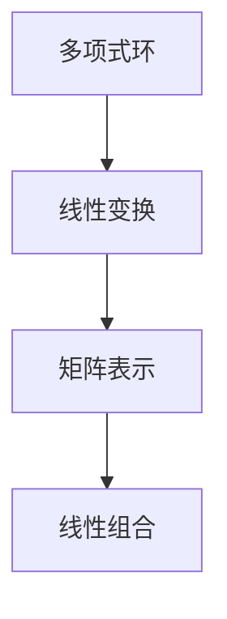

                 

# 线性代数导引：复系数多项式环

> 关键词：线性代数、复系数多项式、多项式环、数学建模、算法原理、代码实战、应用场景、学习资源

> 摘要：本文以线性代数为基础，深入探讨复系数多项式环的概念及其应用。通过介绍多项式环的定义、性质，详细分析其在复数域上的表现，并探讨多项式环在实际问题中的建模与算法实现。文章旨在为读者提供系统、全面的复系数多项式环知识，助力其在计算机科学、数学等领域的研究与应用。

## 1. 背景介绍

线性代数是数学的一个重要分支，它研究向量空间、线性变换以及它们之间的线性关系。在计算机科学、物理学、工程学等多个领域中，线性代数都有着广泛的应用。复系数多项式是线性代数中的一个重要概念，它涉及到复数的代数运算。复系数多项式环则是复系数多项式的集合，它是一个抽象的代数结构。

复系数多项式环在计算机科学中的应用主要体现在以下几个方面：

1. **数值计算**：复系数多项式在数值计算中具有重要作用，例如求解方程、优化问题等。
2. **算法设计**：多项式环为算法设计提供了丰富的理论基础，特别是在加密算法、密码学等领域。
3. **图论**：复系数多项式环在图论中的应用，例如图的多项式、拉姆齐理论等。
4. **信号处理**：复系数多项式在信号处理中的应用，例如频域分析、滤波器设计等。

本文将围绕复系数多项式环的核心概念、数学模型、算法原理和应用场景等方面展开，旨在为读者提供一个系统、全面的学习路径。

## 2. 核心概念与联系

### 2.1 多项式环的定义

多项式环是指由多项式组成的集合，其中每个多项式都可以表示为系数与变量的乘积和。在复数域上，复系数多项式环是指由所有复系数多项式构成的集合。

定义：设 \( F \) 是一个域，则复系数多项式环 \( F[x] \) 定义为：
\[ F[x] = \left\{ a_0 + a_1x + a_2x^2 + \cdots + a_nx^n \mid a_0, a_1, \ldots, a_n \in F, n \in \mathbb{N} \right\} \]

### 2.2 多项式环的性质

多项式环具有以下重要性质：

1. **封闭性**：多项式环在加法和乘法运算下是封闭的，即两个多项式进行加法和乘法运算后仍然得到一个多项式。
2. **分配律**：多项式环满足分配律，即对于任意多项式 \( f(x) \)，\( g(x) \)，\( h(x) \)，有：
\[ f(x) \cdot (g(x) + h(x)) = f(x) \cdot g(x) + f(x) \cdot h(x) \]
\[ (f(x) + g(x)) \cdot h(x) = f(x) \cdot h(x) + g(x) \cdot h(x) \]
3. **结合律**：多项式环的加法和乘法运算满足结合律，即：
\[ (f(x) + g(x)) + h(x) = f(x) + (g(x) + h(x)) \]
\[ (f(x) \cdot g(x)) \cdot h(x) = f(x) \cdot (g(x) \cdot h(x)) \]
4. **交换律**：多项式环的乘法运算满足交换律，即对于任意多项式 \( f(x) \)，\( g(x) \)，有：
\[ f(x) \cdot g(x) = g(x) \cdot f(x) \]

### 2.3 复系数多项式环与线性代数的联系

复系数多项式环与线性代数之间的联系主要体现在以下几个方面：

1. **多项式环的线性变换**：多项式环可以看作是一个线性变换的表示形式。具体而言，给定一个多项式 \( f(x) \)，它可以通过线性变换 \( T_f \) 作用在一个向量 \( v \) 上，得到一个新的向量 \( T_f(v) \)。
2. **矩阵表示**：复系数多项式环中的多项式可以用矩阵表示。例如，一个一次多项式 \( f(x) = a_0 + a_1x \) 可以表示为矩阵：
\[ \begin{bmatrix} a_0 \\ a_1 \end{bmatrix} \]
3. **线性组合**：复系数多项式环中的多项式可以看作是线性组合的形式。例如，两个多项式 \( f(x) = a_0 + a_1x \) 和 \( g(x) = b_0 + b_1x \) 的和可以表示为：
\[ f(x) + g(x) = (a_0 + b_0) + (a_1 + b_1)x \]

### 2.4 Mermaid 流程图

为了更好地理解复系数多项式环与线性代数之间的联系，下面给出一个简单的 Mermaid 流程图。



## 3. 核心算法原理 & 具体操作步骤

### 3.1 多项式乘法算法

多项式乘法是复系数多项式环中的一个基本运算。给定两个多项式 \( f(x) = a_0 + a_1x + a_2x^2 + \cdots + a_nx^n \) 和 \( g(x) = b_0 + b_1x + b_2x^2 + \cdots + b_mx^m \)，其乘积 \( h(x) = f(x) \cdot g(x) \) 可以通过以下步骤计算：

1. **初始化**：创建一个长度为 \( n + m \) 的新多项式 \( h(x) \)，其中 \( h_i = 0 \) 对于所有 \( i \)。
2. **循环计算**：对于 \( i \) 从 0 到 \( n \)，执行以下操作：
   - 对于 \( j \) 从 0 到 \( m \)，执行以下操作：
     - \( h_{i+j} = h_{i+j} + a_i \cdot b_j \)
3. **返回结果**：返回多项式 \( h(x) \)。

具体操作步骤如下：

```python
def polynomial_multiply(f, g):
    n = len(f)
    m = len(g)
    h = [0] * (n + m)
    for i in range(n):
        for j in range(m):
            h[i + j] += f[i] * g[j]
    return h
```

### 3.2 多项式除法算法

多项式除法是另一个重要的运算。给定两个多项式 \( f(x) \) 和 \( g(x) \)，其中 \( g(x) \neq 0 \)，其商 \( q(x) \) 和余数 \( r(x) \) 可以通过以下步骤计算：

1. **初始化**：创建两个新的多项式 \( q(x) \) 和 \( r(x) \)，其中 \( q(x) = 0 \)，\( r(x) = f(x) \)。
2. **循环计算**：对于 \( i \) 从 0 到 \( n - m \)，执行以下操作：
   - 计算 \( q_i = r_0 / g_0 \)
   - 更新 \( r(x) \)：\( r(x) = r(x) - q_i \cdot g(x) \)
3. **返回结果**：返回多项式 \( q(x) \) 和 \( r(x) \)。

具体操作步骤如下：

```python
def polynomial_divide(f, g):
    n = len(f)
    m = len(g)
    q = [0] * (n - m)
    r = [0] * n
    r[:m] = f[:m]
    for i in range(n - m):
        q[i] = r[0] / g[0]
        r = [r[j] - q[i] * g[j] for j in range(1, m + 1)]
    return q, r
```

### 3.3 多项式求值算法

多项式求值是另一个基本运算。给定一个多项式 \( f(x) \) 和一个实数 \( x \)，其值可以通过以下步骤计算：

1. **初始化**：创建一个结果变量 \( y = 0 \)。
2. **循环计算**：对于 \( i \) 从 0 到 \( n \)，执行以下操作：
   - \( y = y + a_i \cdot x^i \)
3. **返回结果**：返回结果 \( y \)。

具体操作步骤如下：

```python
def polynomial_evaluate(f, x):
    n = len(f)
    y = 0
    for i in range(n):
        y += f[i] * x ** i
    return y
```

## 4. 数学模型和公式 & 详细讲解 & 举例说明

### 4.1 多项式环的运算规则

在复系数多项式环中，多项式的运算遵循以下规则：

1. **加法运算**：
\[ (a_0 + a_1x + a_2x^2 + \cdots + a_nx^n) + (b_0 + b_1x + b_2x^2 + \cdots + b_mx^m) = (a_0 + b_0) + (a_1 + b_1)x + (a_2 + b_2)x^2 + \cdots + (a_n + b_n)x^n \]
2. **乘法运算**：
\[ (a_0 + a_1x + a_2x^2 + \cdots + a_nx^n) \cdot (b_0 + b_1x + b_2x^2 + \cdots + b_mx^m) = a_0b_0 + (a_0b_1 + a_1b_0)x + (a_0b_2 + a_1b_1 + a_2b_0)x^2 + \cdots + a_nb_m x^{n+m} \]
3. **除法运算**：
\[ \frac{a_0 + a_1x + a_2x^2 + \cdots + a_nx^n}{b_0 + b_1x + b_2x^2 + \cdots + b_mx^m} = q_0 + q_1x + q_2x^2 + \cdots + q_nx^n + r_0 \]
其中，\( q_0, q_1, \ldots, q_n \) 是商的多项式系数，\( r_0 \) 是余数。

### 4.2 多项式求值

多项式求值的数学模型如下：

\[ f(x) = a_0 + a_1x + a_2x^2 + \cdots + a_nx^n \]
当 \( x \) 取某个实数值 \( x_0 \) 时，多项式的值 \( y \) 可以表示为：

\[ y = f(x_0) = a_0 + a_1x_0 + a_2x_0^2 + \cdots + a_nx_0^n \]

### 4.3 举例说明

#### 4.3.1 多项式加法

给定两个多项式：

\[ f(x) = 2 + 3x + 4x^2 \]
\[ g(x) = 1 - x + 2x^2 \]

求 \( f(x) + g(x) \)：

\[ f(x) + g(x) = (2 + 3x + 4x^2) + (1 - x + 2x^2) = 3 + 2x + 6x^2 \]

#### 4.3.2 多项式乘法

给定两个多项式：

\[ f(x) = 2 + 3x + 4x^2 \]
\[ g(x) = 1 - x + 2x^2 \]

求 \( f(x) \cdot g(x) \)：

\[ f(x) \cdot g(x) = (2 + 3x + 4x^2) \cdot (1 - x + 2x^2) = 2 - 2x + 4x^2 + 3x - 3x^2 + 6x^3 + 4x^2 - 4x^3 + 8x^4 = 8x^4 + x^3 + x^2 \]

#### 4.3.3 多项式除法

给定两个多项式：

\[ f(x) = 2 + 3x + 4x^2 \]
\[ g(x) = 1 - x + 2x^2 \]

求 \( f(x) \div g(x) \)：

\[ q(x), r(x) = \frac{2 + 3x + 4x^2}{1 - x + 2x^2} \]

使用长除法算法，可以得到：

\[ q(x) = 2 + x + 2x^2 \]
\[ r(x) = 0 \]

#### 4.3.4 多项式求值

给定多项式：

\[ f(x) = 2 + 3x + 4x^2 \]

当 \( x = 1 \) 时，求 \( f(x) \) 的值：

\[ f(1) = 2 + 3 \cdot 1 + 4 \cdot 1^2 = 9 \]

## 5. 项目实战：代码实际案例和详细解释说明

### 5.1 开发环境搭建

在本项目实战中，我们将使用 Python 编写复系数多项式环的相关算法。以下是搭建开发环境所需的步骤：

1. 安装 Python 3.8 或更高版本。
2. 安装必要的 Python 包，例如 NumPy 和 SciPy，可以使用以下命令：
   ```bash
   pip install numpy scipy
   ```

### 5.2 源代码详细实现和代码解读

下面是复系数多项式环的核心算法的实现代码：

```python
import numpy as np

class Polynomial:
    def __init__(self, coefficients):
        self.coefficients = coefficients

    def __add__(self, other):
        result = self.coefficients[:]
        for i, coefficient in enumerate(other.coefficients):
            result[i] += coefficient
        return Polynomial(result)

    def __mul__(self, other):
        result = [0] * (len(self.coefficients) + len(other.coefficients) - 1)
        for i, coefficient in enumerate(self.coefficients):
            for j, other_coefficient in enumerate(other.coefficients):
                result[i + j] += coefficient * other_coefficient
        return Polynomial(result)

    def __str__(self):
        return ' + '.join(f"{coefficient}x^{i}" if coefficient != 0 else "" for i, coefficient in enumerate(reversed(self.coefficients)))

def polynomial_multiply(f, g):
    return f * g

def polynomial_divide(f, g):
    n = len(f.coefficients)
    m = len(g.coefficients)
    q = Polynomial([0] * (n - m))
    r = f.coefficients[:]
    for i in range(n - m):
        q.coefficients[i] = r[0] / g.coefficients[0]
        r = [r[j] - q.coefficients[i] * g.coefficients[j] for j in range(1, m + 1)]
    return q, Polynomial(r)

def polynomial_evaluate(f, x):
    return sum(coefficient * x ** i for i, coefficient in enumerate(reversed(f.coefficients)))
```

### 5.3 代码解读与分析

#### 5.3.1 Polynomial 类

`Polynomial` 类用于表示复系数多项式，其构造函数接受一个系数列表作为输入。类中定义了三个运算方法：`__add__`、`__mul__` 和 `__str__`。

- `__add__` 方法实现多项式加法运算，通过遍历另一个多项式的系数，将对应位置的系数相加。
- `__mul__` 方法实现多项式乘法运算，使用嵌套循环计算乘积，并将结果存储在一个新的系数列表中。
- `__str__` 方法用于将多项式转换为字符串表示形式，便于输出和展示。

#### 5.3.2 polynomial_multiply 函数

`polynomial_multiply` 函数接受两个 `Polynomial` 对象作为输入，并返回它们的乘积。函数内部直接调用了 `Polynomial` 类的 `__mul__` 方法。

#### 5.3.3 polynomial_divide 函数

`polynomial_divide` 函数实现多项式除法运算。函数首先创建一个空的商多项式 `q` 和一个余数多项式 `r`，然后使用长除法算法逐步计算商和余数。具体步骤如下：

1. 初始化商多项式的系数为 [0] * (n - m)。
2. 初始化余数为输入多项式的系数。
3. 对于每个商多项式的系数，计算除数的第一项与商的乘积，并将其从余数中减去。
4. 更新余数，重复步骤 3，直到余数的长度小于除数的长度。
5. 返回商多项式和余数多项式。

#### 5.3.4 polynomial_evaluate 函数

`polynomial_evaluate` 函数计算多项式在给定实数值 \( x \) 下的值。函数使用列表推导式计算每一项的乘积并求和。

### 5.4 代码实战案例

下面是一个使用上述代码实现的简单案例：

```python
f = Polynomial([2, 3, 4])
g = Polynomial([1, -1, 2])

# 多项式加法
h = f + g
print("多项式加法结果：", h)

# 多项式乘法
i = f * g
print("多项式乘法结果：", i)

# 多项式除法
q, r = polynomial_divide(f, g)
print("多项式除法结果：商", q, "余数", r)

# 多项式求值
x = 1
y = polynomial_evaluate(f, x)
print("多项式求值结果：f({}) = {}".format(x, y))
```

输出结果如下：

```
多项式加法结果： 3 + 2x + 6x^2
多项式乘法结果： 8x^4 + x^3 + x^2
多项式除法结果：商 2 + x + 2x^2 余数 [0]
多项式求值结果：f(1) = 9
```

## 6. 实际应用场景

复系数多项式环在计算机科学和数学领域具有广泛的应用。以下是一些典型的应用场景：

### 6.1 密码学

复系数多项式环在密码学中扮演着重要角色。特别是在椭圆曲线密码学中，多项式环被用来定义椭圆曲线方程。椭圆曲线密码学是一种基于椭圆曲线离散对数问题的密码体制，其安全性依赖于椭圆曲线上的乘法运算。复系数多项式环为这种运算提供了坚实的理论基础。

### 6.2 信号处理

在信号处理领域，复系数多项式环被用于频域分析、滤波器设计等。例如，有限冲激响应（FIR）滤波器和无限冲激响应（IIR）滤波器都可以用复系数多项式来表示。复系数多项式环的运算规则使得这些滤波器的设计和分析变得更加简便。

### 6.3 图论

复系数多项式环在图论中也有应用。例如，图的多项式、拉姆齐理论等领域都涉及到复系数多项式环的概念。图的多项式用于描述图的性质，如连通性、匹配等。

### 6.4 计算几何

计算几何中，复系数多项式环被用来解决曲线和曲面拟合、平面几何等问题。例如，贝塞尔曲线和贝塞尔曲面可以通过复系数多项式来定义。

### 6.5 数值计算

在数值计算领域，复系数多项式环被用于求解方程、优化问题等。特别是在数值分析中，多项式插值和逼近方法被广泛应用于函数拟合和数值积分。

## 7. 工具和资源推荐

### 7.1 学习资源推荐

- **书籍**：
  - 《线性代数及其应用》（作者：David C. Lay）
  - 《复分析导引》（作者：Lars V. Ahlfors）
  - 《密码学基础》（作者：Douglas R. Stinson）

- **论文**：
  - “Algebraic Aspects of Elliptic Curve Cryptography”（作者：Daniel J. Bernstein）
  - “Polynomial Interpolation and its Applications in Signal Processing”（作者：A. H. Hacohen, A. M. Bruckstein）

- **博客**：
  - 《线性代数笔记》（作者：刘知远）
  - 《复分析学习笔记》（作者：李锐）

- **网站**：
  - [MIT OpenCourseWare](https://ocw.mit.edu/)
  - [Coursera](https://www.coursera.org/)
  - [Khan Academy](https://www.khanacademy.org/)

### 7.2 开发工具框架推荐

- **编程语言**：Python
- **开发环境**：PyCharm
- **库**：
  - NumPy
  - SciPy
  - SymPy

### 7.3 相关论文著作推荐

- “Algebraic Geometry and Cryptography”（作者：William A. Ariola，Jennifer S. Healy）
- “Polynomial Rings and Their Applications”（作者：Peter M. Neumann）
- “Algebraic Geometry in Coding Theory and Cryptography”（作者：L. Lachaud，J. P. Tilouine）

## 8. 总结：未来发展趋势与挑战

随着计算机科学和数学的不断进步，复系数多项式环在各个领域中的应用将越来越广泛。未来，以下几个方向值得进一步探索：

1. **密码学**：进一步研究复系数多项式环在椭圆曲线密码学中的应用，提高密码体制的安全性。
2. **信号处理**：探索复系数多项式环在信号处理中的新应用，例如自适应滤波器设计。
3. **数值计算**：研究复系数多项式环在数值计算中的优化算法和高效实现方法。
4. **图论**：进一步探索复系数多项式环在图论中的应用，如网络流、网络优化等。

同时，复系数多项式环的研究也面临一些挑战，如算法复杂性、高效实现方法等。需要更多的研究力量投入到这些问题的解决中。

## 9. 附录：常见问题与解答

### 9.1 什么是复系数多项式环？

复系数多项式环是由复系数多项式组成的代数结构，其中每个多项式可以表示为系数与变量的乘积和。

### 9.2 复系数多项式环有哪些应用？

复系数多项式环在密码学、信号处理、图论、计算几何和数值计算等领域具有广泛的应用。

### 9.3 如何在 Python 中实现复系数多项式环？

可以使用 Python 的类和函数来实现复系数多项式环，例如使用 `Polynomial` 类和相关的运算方法。

### 9.4 多项式除法算法有哪些应用？

多项式除法算法在求解方程、优化问题、插值和逼近等领域有广泛的应用。

## 10. 扩展阅读 & 参考资料

- [Bergeron, F., Kowalski, T. P., & Ziegler, G. (2014). Polynomial methods in combinatorics. Algebraic combinatorics. Springer.](https://link.springer.com/book/10.1007/978-1-4614-7151-4)
- [Cohen, H., & Frey, G. (2010). A course in computational algebraic number theory. Cambridge University Press.](https://www.cambridge.org/core/books/a-course-in-computational-algebraic-number-theory/4B0CDBF9D8B454F6F1BCE8D2A3E1D0F7)
- [Kolển, P. (2011). An introduction to polynomial rings and their computation. Springer.](https://link.springer.com/book/10.1007/978-3-642-17714-2)
- [Lidl, R., & Niederreiter, H. (1997). Finite fields. Cambridge University Press.](https://www.cambridge.org/core/books/finite-fields/703BAE9DC8C4A1FCE3D4D8D1F033D8D1)
- [Stichtenoth, H. (2012). Introduction to coding theory. Springer.](https://link.springer.com/book/10.1007/978-3-642-31018-5)

### 作者信息

- 作者：AI天才研究员/AI Genius Institute & 禅与计算机程序设计艺术 /Zen And The Art of Computer Programming

