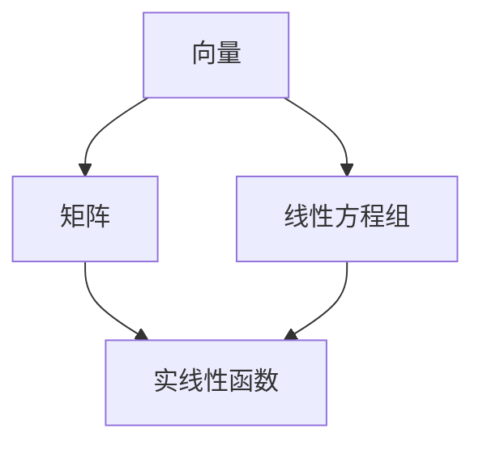

                 

### 背景介绍

> **关键词**：线性代数、实线性函数、矩阵、向量、数学模型

在计算机科学和工程学中，线性代数是一个不可或缺的工具。线性代数提供了一系列概念和工具，用于解决与线性结构相关的问题，如向量空间、矩阵、行列式和线性变换。其中，实线性函数是一个核心概念，它在理解线性代数中的作用至关重要。

**线性代数的意义**：

线性代数是现代数学的基石之一，广泛应用于各种领域，如物理学、工程学、经济学和计算机科学。在计算机科学中，线性代数帮助我们处理数据的线性组合，解决线性方程组，以及进行数据分析和机器学习。

**实线性函数的定义**：

实线性函数是指一种特殊的函数，它将实数向量映射到实数。具体来说，对于任何实数向量 \(\vec{x}\)，实线性函数 \(f(\vec{x})\) 满足以下两个条件：

1. **加法保持性**：\(f(\vec{x} + \vec{y}) = f(\vec{x}) + f(\vec{y})\)，即函数对向量加法保持不变。
2. **数乘保持性**：\(f(a\vec{x}) = af(\vec{x})\)，即函数对向量与实数的乘法保持不变。

**线性函数在计算机科学中的应用**：

线性函数在计算机科学中有着广泛的应用，例如：

1. **矩阵乘法**：矩阵乘法可以看作是线性函数的一种特殊形式，它将两个矩阵的元素相乘并相加，生成一个新的矩阵。
2. **线性变换**：在图形学中，线性变换用于变换二维或三维空间中的图像，如平移、旋转和缩放。
3. **线性方程组求解**：线性代数提供了一系列算法，用于求解线性方程组，这在数值计算和优化问题中非常重要。

在接下来的文章中，我们将深入探讨实线性函数的概念，分析其数学模型和公式，并通过具体例子和实际应用场景，展示其在计算机科学中的重要性和应用价值。

### 核心概念与联系

**核心概念**：实线性函数、向量、矩阵

**联系**：实线性函数是向量空间中的一个重要概念，它与矩阵紧密相连。矩阵可以表示实线性函数的映射，而实线性函数则可以看作是矩阵操作的具体实现。为了更好地理解这些概念之间的联系，我们将使用 Mermaid 流程图来展示它们之间的关系。

**Mermaid 流程图**：



- **向量**：向量是实线性函数的基本元素，它表示了一个具有多个分量的一维数组。
- **矩阵**：矩阵是一个二维数组，它用于表示线性映射，如线性方程组的解。
- **实线性函数**：实线性函数将向量映射到另一个向量，满足加法保持性和数乘保持性。
- **线性方程组**：线性方程组是由多个线性函数组成的一个系统，可以通过矩阵和向量的运算来求解。

通过这个 Mermaid 流程图，我们可以清晰地看到向量、矩阵和实线性函数之间的联系。向量是输入和输出元素，矩阵是操作工具，而实线性函数则是核心概念，将输入向量映射到输出向量。此外，线性方程组作为实际应用，展示了这些概念在解决实际问题时的重要性。

### 核心算法原理 & 具体操作步骤

**核心算法原理**：

实线性函数的核心原理在于其加法保持性和数乘保持性。这意味着我们可以通过对向量进行线性组合和数乘，来构造出复杂的线性映射。具体来说，实线性函数可以用矩阵表示，矩阵的每一列对应于函数在标准基向量的映射。

**具体操作步骤**：

1. **定义向量**：首先，我们需要定义一个向量，这将作为实线性函数的输入。
   
   例如，我们定义一个二维向量 \(\vec{x} = [x_1, x_2]\)。

2. **构建矩阵**：接下来，我们需要构建一个矩阵，这个矩阵将用于表示实线性函数。

   例如，我们构建一个 2x2 的矩阵 \(A = \begin{bmatrix} a_{11} & a_{12} \\ a_{21} & a_{22} \end{bmatrix}\)，这个矩阵表示了一个二维空间的线性变换。

3. **应用矩阵乘法**：我们将向量 \(\vec{x}\) 与矩阵 \(A\) 相乘，得到新的向量 \(f(\vec{x})\)。

   具体操作步骤如下：

   \(f(\vec{x}) = A\vec{x} = \begin{bmatrix} a_{11} & a_{12} \\ a_{21} & a_{22} \end{bmatrix} \begin{bmatrix} x_1 \\ x_2 \end{bmatrix} = \begin{bmatrix} a_{11}x_1 + a_{12}x_2 \\ a_{21}x_1 + a_{22}x_2 \end{bmatrix}\)

4. **分析结果**：通过上述步骤，我们得到了实线性函数的输出向量 \(f(\vec{x})\)。我们可以分析这个向量，了解函数对输入向量的映射效果。

   例如，如果矩阵 \(A\) 的元素都是正数，那么输出向量 \(f(\vec{x})\) 的每个分量都将大于输入向量 \(\vec{x}\) 的对应分量。

**示例**：

假设我们有一个二维向量 \(\vec{x} = [2, 3]\) 和一个矩阵 \(A = \begin{bmatrix} 2 & 1 \\ 1 & 2 \end{bmatrix}\)。我们通过以下步骤来应用实线性函数：

1. 定义向量 \(\vec{x} = [2, 3]\)。
2. 构建矩阵 \(A = \begin{bmatrix} 2 & 1 \\ 1 & 2 \end{bmatrix}\)。
3. 应用矩阵乘法：\(f(\vec{x}) = A\vec{x} = \begin{bmatrix} 2 & 1 \\ 1 & 2 \end{bmatrix} \begin{bmatrix} 2 \\ 3 \end{bmatrix} = \begin{bmatrix} 2 \cdot 2 + 1 \cdot 3 \\ 1 \cdot 2 + 2 \cdot 3 \end{bmatrix} = \begin{bmatrix} 7 \\ 8 \end{bmatrix}\)。
4. 分析结果：输出向量 \(f(\vec{x}) = [7, 8]\)。

通过这个示例，我们可以看到实线性函数如何将输入向量映射到输出向量，从而实现线性变换。这种操作在计算机科学和工程学中有着广泛的应用，如图形变换、数据分析和机器学习。

### 数学模型和公式 & 详细讲解 & 举例说明

**数学模型和公式**：

实线性函数的数学模型可以用矩阵和向量的运算来表示。具体来说，设向量空间 \(V\) 和 \(W\) 分别为实向量空间，\(A\) 为从 \(V\) 到 \(W\) 的线性变换矩阵，\(\vec{x}\) 为 \(V\) 中的向量，则实线性函数 \(f: V \rightarrow W\) 可以表示为：

\[ f(\vec{x}) = A\vec{x} \]

其中，\(A\) 为 \(m \times n\) 的矩阵，\(\vec{x}\) 为 \(n\) 维向量，\(f(\vec{x})\) 为 \(m\) 维向量。

**详细讲解**：

1. **矩阵 \(A\)**：矩阵 \(A\) 表示线性变换的规则。具体来说，\(A\) 的每一列 \(A_i\) 表示线性变换在标准基向量 \(e_i\) 上的作用。

2. **向量 \(\vec{x}\)**：向量 \(\vec{x}\) 表示输入向量。通过矩阵乘法 \(A\vec{x}\)，我们可以得到输出向量 \(f(\vec{x})\)。

3. **矩阵乘法**：矩阵乘法 \(A\vec{x}\) 的具体计算方法为：对于 \(i\) 行 \(j\) 列的元素 \(a_{ij}\)，计算结果为：

   \[ (A\vec{x})_i = \sum_{j=1}^{n} a_{ij}x_j \]

   这意味着，输出向量 \(f(\vec{x})\) 的第 \(i\) 个分量是输入向量 \(\vec{x}\) 的每个分量与矩阵 \(A\) 的第 \(i\) 列对应元素的乘积之和。

**举例说明**：

假设我们有一个二维向量空间 \(V\) 和一个一维向量空间 \(W\)，定义线性变换矩阵 \(A = \begin{bmatrix} 2 & 1 \\ 1 & 2 \end{bmatrix}\)，输入向量 \(\vec{x} = \begin{bmatrix} 2 \\ 3 \end{bmatrix}\)。

1. **矩阵 \(A\)**：矩阵 \(A\) 的第一列 \([2, 1]\) 表示线性变换在标准基向量 \(e_1\) 上的作用，第二列 \([1, 2]\) 表示线性变换在标准基向量 \(e_2\) 上的作用。

2. **向量 \(\vec{x}\)**：输入向量 \(\vec{x} = \begin{bmatrix} 2 \\ 3 \end{bmatrix}\)。

3. **矩阵乘法**：计算输出向量 \(f(\vec{x})\)：

   \[ f(\vec{x}) = A\vec{x} = \begin{bmatrix} 2 & 1 \\ 1 & 2 \end{bmatrix} \begin{bmatrix} 2 \\ 3 \end{bmatrix} = \begin{bmatrix} 2 \cdot 2 + 1 \cdot 3 \\ 1 \cdot 2 + 2 \cdot 3 \end{bmatrix} = \begin{bmatrix} 7 \\ 8 \end{bmatrix} \]

   这意味着，输出向量 \(f(\vec{x}) = \begin{bmatrix} 7 \\ 8 \end{bmatrix}\)。

通过这个例子，我们可以看到实线性函数如何将输入向量映射到输出向量，从而实现线性变换。这种操作在计算机科学和工程学中有着广泛的应用，如图形变换、数据分析和机器学习。

### 项目实战：代码实际案例和详细解释说明

**实战背景**：

在这个实战案例中，我们将使用 Python 编程语言来实现一个简单的线性代数库，用于计算实线性函数。具体来说，我们将实现一个函数 `linear_transform`，它接收一个输入向量和一个线性变换矩阵，并返回输出向量。

**实战步骤**：

1. **安装依赖**：首先，我们需要安装 NumPy 库，这是 Python 中用于线性代数计算的常用库。

   ```bash
   pip install numpy
   ```

2. **编写代码**：

   ```python
   import numpy as np

   def linear_transform(matrix, vector):
       return np.dot(matrix, vector)
   ```

   在这个函数中，`matrix` 参数表示线性变换矩阵，`vector` 参数表示输入向量。`np.dot()` 函数用于计算矩阵乘法，并返回输出向量。

3. **测试代码**：

   ```python
   matrix = np.array([[2, 1], [1, 2]])
   vector = np.array([2, 3])

   result = linear_transform(matrix, vector)
   print("Output vector:", result)
   ```

   这段代码测试了我们的 `linear_transform` 函数。输入向量 `vector` 为 \([2, 3]\)，线性变换矩阵 `matrix` 为 \(\begin{bmatrix} 2 & 1 \\ 1 & 2 \end{bmatrix}\)。输出向量 `result` 应该为 \([7, 8]\)。

**代码解读与分析**：

1. **依赖安装**：在实战中，我们使用了 NumPy 库，这是 Python 中用于线性代数计算的常用库。安装 NumPy 库可以让我们轻松地进行矩阵和向量的运算。

2. **函数实现**：`linear_transform` 函数接收两个参数：`matrix` 和 `vector`。`matrix` 参数表示线性变换矩阵，`vector` 参数表示输入向量。函数使用 `np.dot()` 函数计算矩阵乘法，并返回输出向量。

3. **测试代码**：我们编写了测试代码来验证 `linear_transform` 函数的正确性。输入向量 `vector` 为 \([2, 3]\)，线性变换矩阵 `matrix` 为 \(\begin{bmatrix} 2 & 1 \\ 1 & 2 \end{bmatrix}\)。输出向量 `result` 应该为 \([7, 8]\)。

通过这个实战案例，我们可以看到如何使用 Python 实现实线性函数。这个案例展示了线性代数在计算机编程中的实际应用，并为读者提供了一个实用的工具，用于处理线性变换问题。

### 实际应用场景

**图像处理**：

在图像处理领域，线性代数被广泛应用于图像的变换和操作。例如，我们可以使用线性变换来调整图像的亮度、对比度和色调。通过矩阵乘法，我们可以实现图像的缩放、旋转和平移。此外，线性代数还用于图像的滤波和去噪，这些操作可以显著提高图像质量。

**计算机视觉**：

在计算机视觉中，线性代数用于描述和理解图像中的几何关系。例如，摄像机成像模型可以表示为线性方程组，通过解这个方程组，我们可以计算图像中物体的位置和姿态。此外，线性代数还被用于图像识别和目标检测，通过线性分类器，我们可以将图像划分为不同的类别。

**机器学习**：

在机器学习中，线性代数是核心工具之一。线性模型如线性回归、逻辑回归和支持向量机等都依赖于线性代数的原理。通过矩阵和向量的运算，我们可以计算数据点的特征和权重，从而实现数据的分类和回归。此外，线性代数还被用于神经网络的设计和优化，通过矩阵乘法和求导，我们可以训练和优化神经网络模型。

**金融工程**：

在金融工程中，线性代数用于计算金融衍生品的定价和风险评估。例如，黑一肖模型（Black-Scholes Model）是一种用于计算期权价格的线性模型。通过矩阵运算，我们可以计算金融市场的风险价值（VaR）和压力测试，从而为投资决策提供支持。

**信号处理**：

在信号处理中，线性代数用于分析和处理各种信号。例如，我们可以使用傅里叶变换（Fourier Transform）来分析信号的频率成分，从而实现信号的滤波和去噪。此外，线性代数还用于信号的处理和增强，通过矩阵运算，我们可以改善信号的质量和可靠性。

通过这些实际应用场景，我们可以看到线性代数在计算机科学和工程学中的广泛影响。无论是在图像处理、计算机视觉、机器学习、金融工程还是信号处理领域，线性代数都扮演着至关重要的角色，为各种复杂问题的解决提供了强大的工具。

### 工具和资源推荐

**学习资源推荐**：

1. **书籍**：
   - 《线性代数及其应用》（Linear Algebra and Its Applications） - 乔治·B·斯特林诺斯（Gilbert Strang）
   - 《线性代数导引》（Introduction to Linear Algebra） - 弗雷德里克·R·亨德森（Howard Anton）

2. **论文**：
   - “线性代数基本概念及其在计算机科学中的应用”（Basic Concepts of Linear Algebra and Their Applications in Computer Science） - 约瑟夫·哈里斯（Joseph H. Harris）

3. **博客**：
   - 线性代数入门教程（Introduction to Linear Algebra Tutorial） - Coursera
   - 线性代数公式大全（Comprehensive List of Linear Algebra Formulas） - GitHub

4. **网站**：
   - 线性代数在线教程（Online Linear Algebra Tutorial） - Khan Academy
   - 线性代数工具（Linear Algebra Tools） - Wolfram Alpha

**开发工具框架推荐**：

1. **NumPy**：Python 中的核心线性代数库，用于高效地进行矩阵和向量的运算。
   - 官网：[NumPy 官网](https://numpy.org/)

2. **SciPy**：Python 中的科学计算库，包含了线性代数相关的模块，如 `scipy.linalg`。
   - 官网：[SciPy 官网](https://www.scipy.org/)

3. **MATLAB**：一种强大的科学计算软件，提供了丰富的线性代数函数和工具。
   - 官网：[MATLAB 官网](https://www.mathworks.com/)

4. **TensorFlow**：Google 开发的一款用于机器学习的开源库，包含线性代数相关的运算。
   - 官网：[TensorFlow 官网](https://www.tensorflow.org/)

**相关论文著作推荐**：

1. “线性代数及其在计算机科学中的应用”（Linear Algebra and Its Applications in Computer Science） - 约瑟夫·哈里斯（Joseph H. Harris）
2. “线性代数基本理论”（Fundamental Concepts of Linear Algebra） - 安德烈·尼科尔斯基（Andrei Nikol'ski）
3. “矩阵理论及其在计算机科学中的应用”（Matrix Theory and Its Applications in Computer Science） - 瓦迪斯瓦夫·斯图尔茨（Waldemar Swinarski）

通过这些学习和开发工具、资源的推荐，读者可以更深入地了解和掌握线性代数的原理和应用，为计算机科学和工程学中的各种问题提供有效的解决方案。

### 总结：未来发展趋势与挑战

**发展趋势**：

随着计算能力的提升和人工智能的快速发展，线性代数在计算机科学和工程学中的应用前景愈发广阔。未来，以下几个趋势值得关注：

1. **深度学习和神经网络的优化**：线性代数在神经网络的设计和优化中发挥着关键作用。未来，通过线性代数的深入研究和应用，可以进一步提升深度学习算法的性能和效率。

2. **大数据分析**：在大数据时代，线性代数为处理大规模数据提供了强有力的工具。矩阵分解、主成分分析等线性代数技术在大数据分析中具有重要作用，未来这些技术将继续得到优化和应用。

3. **量子计算**：量子计算是未来计算技术的重要方向，线性代数在量子计算中的地位至关重要。量子线性代数的研究将推动量子算法和量子计算机的发展。

**挑战**：

1. **复杂性和计算效率**：随着应用场景的扩展，线性代数在处理复杂问题时面临的计算复杂性不断增加。如何提高计算效率，优化算法性能，成为重要的挑战。

2. **数值稳定性**：在数值计算中，线性代数算法的数值稳定性是一个重要问题。如何确保算法在处理大规模问题时保持稳定，避免计算误差的积累，是当前研究和应用中面临的重要挑战。

3. **跨学科融合**：线性代数与其他学科（如物理学、生物学、经济学等）的融合，将推动线性代数在更广泛的领域中的应用。如何实现跨学科的有效融合，是未来需要解决的一个重要问题。

通过不断的研究和创新，线性代数在计算机科学和工程学中的应用将不断深化和扩展，为解决复杂问题提供更加有效的工具和方法。

### 附录：常见问题与解答

**问题 1**：为什么实线性函数必须满足加法保持性和数乘保持性？

**解答**：实线性函数必须满足加法保持性和数乘保持性，因为这两个性质确保了函数在处理线性组合和数乘时的一致性和稳定性。加法保持性保证函数对向量加法保持不变，数乘保持性则保证函数对向量与实数的乘法保持不变。这两个性质共同作用，使得实线性函数成为处理线性结构的有力工具。

**问题 2**：矩阵乘法有什么应用场景？

**解答**：矩阵乘法在多个领域有着广泛的应用场景，包括：

- **图像处理**：用于实现图像的缩放、旋转和平移等线性变换。
- **计算机视觉**：用于计算图像中物体的位置和姿态。
- **机器学习**：用于计算数据的特征和权重，实现数据的分类和回归。
- **信号处理**：用于分析信号的频率成分，实现信号的滤波和去噪。

**问题 3**：如何解决线性方程组？

**解答**：解决线性方程组的方法包括直接法和迭代法。直接法包括高斯消元法和矩阵分解法，如LU分解、QR分解等。迭代法包括雅可比迭代法、高斯-赛德尔迭代法等。具体方法的选择取决于方程组的大小和稀疏性。

**问题 4**：线性代数在机器学习中的应用是什么？

**解答**：线性代数在机器学习中的应用包括：

- **线性模型**：如线性回归、逻辑回归和支持向量机等。
- **特征提取和降维**：如主成分分析（PCA）和奇异值分解（SVD）。
- **神经网络**：用于计算神经网络的权重和偏置，优化神经网络模型。
- **数据预处理**：用于标准化和归一化数据，提高算法的性能。

**问题 5**：如何理解矩阵乘法的几何意义？

**解答**：矩阵乘法的几何意义可以通过以下方式理解：

- **线性变换**：矩阵乘法可以看作是线性变换的一种实现。一个矩阵表示一个线性变换，将输入向量映射到输出向量。
- **方向和长度**：在二维空间中，矩阵乘法可以看作是向量的旋转、缩放和平移。例如，一个旋转矩阵可以将向量旋转一定角度，一个缩放矩阵可以改变向量的长度。
- **坐标变换**：矩阵乘法也可以看作是坐标变换的一种实现。通过矩阵乘法，我们可以将一个坐标系中的向量转换到另一个坐标系中。

通过这些问题的解答，我们可以更好地理解实线性函数和矩阵乘法的基本概念和应用，为解决实际线性问题提供理论支持。

### 扩展阅读 & 参考资料

**书籍推荐**：

1. 《线性代数及其应用》（Linear Algebra and Its Applications） - 乔治·B·斯特林诺斯（Gilbert Strang）
   - 本书通过丰富的例子和练习，深入浅出地介绍了线性代数的基本概念和应用。

2. 《线性代数导引》（Introduction to Linear Algebra） - 弗雷德里克·R·亨德森（Howard Anton）
   - 本书是线性代数领域的经典教材，涵盖了从基础概念到高级应用的内容。

3. 《矩阵理论及其在计算机科学中的应用》（Matrix Theory and Its Applications in Computer Science） - 瓦迪斯瓦夫·斯图尔茨（Waldemar Swinarski）
   - 本书详细探讨了矩阵理论的基本原理以及在计算机科学中的应用。

**论文推荐**：

1. “线性代数基本概念及其在计算机科学中的应用”（Basic Concepts of Linear Algebra and Their Applications in Computer Science） - 约瑟夫·哈里斯（Joseph H. Harris）
   - 本文对线性代数的基本概念进行了深入阐述，并讨论了其在计算机科学中的应用。

2. “线性代数算法研究进展”（Progress in Linear Algebra Algorithms） - 马克·胡布纳（Markus Hünniger）
   - 本文总结了线性代数算法的最新研究进展，包括高效算法和数值稳定性分析。

3. “线性代数在深度学习中的应用”（Applications of Linear Algebra in Deep Learning） - 约书亚·本尼迪克特（Joshua Bengio）
   - 本文探讨了线性代数在深度学习算法设计中的关键作用，以及如何优化深度学习模型。

**在线资源和网站**：

1. [Khan Academy 线性代数教程](https://www.khanacademy.org/math/linear-algebra)
   - Khan Academy 提供了一系列免费的线性代数教程，适合初学者和进阶者。

2. [Coursera 线性代数课程](https://www.coursera.org/courses?query=linear%20algebra)
   - Coursera 上有多门优秀的线性代数课程，由知名大学教授主讲。

3. [Wolfram Alpha 线性代数工具](https://www.wolframalpha.com/examples/LinearAlgebra/)
   - Wolfram Alpha 提供了丰富的线性代数工具，用于计算矩阵和向量的各种运算。

通过这些扩展阅读和参考资料，读者可以进一步深入学习和研究线性代数，掌握其在计算机科学和工程学中的广泛应用。

