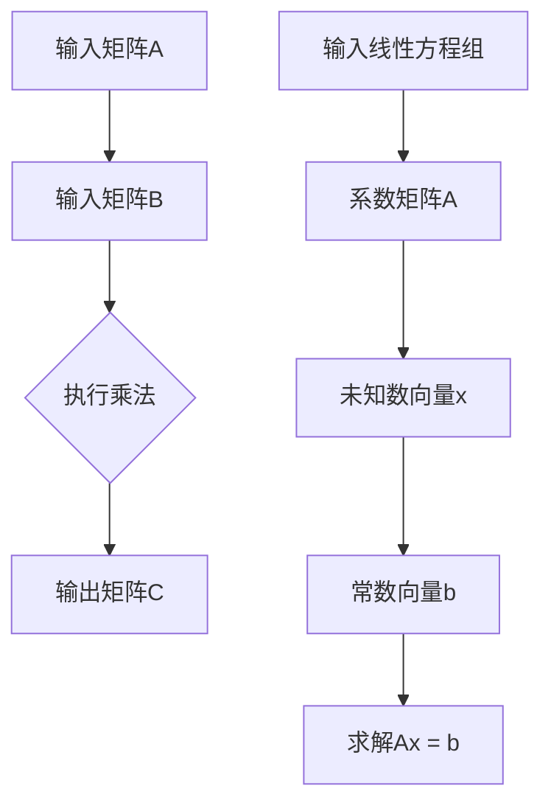

                 

# 线性代数导引：标准计算矩阵

## 关键词
- 线性代数
- 计算矩阵
- 矩阵运算
- 算法原理
- 数学模型
- 实际应用

## 摘要
本文旨在为读者提供一个关于标准计算矩阵的深入导引。通过详细阐述线性代数的基础概念、标准计算矩阵的定义及其重要性，本文将引导读者理解矩阵运算的基本原理，并通过具体案例展示其应用。同时，文章还将探讨数学模型、公式，并通过实战案例对代码进行详细解析，最终为读者提供未来发展趋势与挑战的思考，以及相关的学习资源和开发工具推荐。

### 1. 背景介绍

线性代数是数学的一个分支，主要研究向量空间和线性变换。它在物理学、工程学、计算机科学等领域有着广泛的应用。在计算机科学中，线性代数用于解决各种问题，如数据挖掘、机器学习、图像处理、网络分析等。

计算矩阵是线性代数的一个重要概念，通常指的是在计算机上实现矩阵运算时使用的矩阵。这些矩阵可以用于存储数据、执行线性变换、解决线性方程组等。标准计算矩阵则是在这些矩阵中具有通用性和可计算性的特殊矩阵。

### 2. 核心概念与联系

#### 2.1 向量和矩阵

在数学中，向量是具有大小和方向的量，可以用一个有序数组表示。矩阵则是由多个向量组成的二维数组，可以用于表示线性变换。

#### 2.2 矩阵运算

矩阵运算包括矩阵的加法、减法、乘法和除法等。其中，矩阵乘法是线性代数中最重要的运算之一。矩阵乘法的定义如下：

$$C = AB$$

其中，A和B是两个矩阵，C是它们的乘积。

#### 2.3 线性方程组

线性方程组是多个线性方程的集合，可以表示为矩阵形式：

$$Ax = b$$

其中，A是系数矩阵，x是未知数向量，b是常数向量。

#### 2.4 Mermaid 流程图

为了更好地理解这些概念，我们可以使用Mermaid流程图来展示矩阵运算和线性方程组的流程：



### 3. 核心算法原理 & 具体操作步骤

#### 3.1 矩阵乘法

矩阵乘法是线性代数中最基本的运算之一。其计算原理如下：

$$C = AB$$

具体操作步骤如下：

1. 确定矩阵A和B的维度，确保它们可以相乘。
2. 创建一个新矩阵C，其维度为A的列数和B的行数。
3. 对于C的每个元素，计算其对应的A和B的元素乘积之和。

#### 3.2 线性方程组的求解

线性方程组的求解可以通过矩阵运算实现。具体步骤如下：

1. 将线性方程组表示为矩阵形式：$$Ax = b$$
2. 求解系数矩阵A的逆矩阵：$$A^{-1}$$
3. 计算未知数向量x：$$x = A^{-1}b$$

#### 3.3 矩阵运算的Python实现

我们可以使用Python的NumPy库来执行矩阵运算：

```python
import numpy as np

# 创建矩阵A和B
A = np.array([[1, 2], [3, 4]])
B = np.array([[5, 6], [7, 8]])

# 执行矩阵乘法
C = np.dot(A, B)
print("矩阵乘法结果：", C)

# 创建线性方程组
A = np.array([[1, 2], [3, 4]])
b = np.array([5, 7])

# 求解线性方程组
x = np.linalg.solve(A, b)
print("线性方程组解：", x)
```

### 4. 数学模型和公式 & 详细讲解 & 举例说明

#### 4.1 矩阵乘法的公式

矩阵乘法的结果矩阵C的元素可以通过以下公式计算：

$$C_{ij} = \sum_{k=1}^{n} A_{ik}B_{kj}$$

其中，$A_{ik}$和$B_{kj}$分别是矩阵A和B的元素，$C_{ij}$是矩阵C的元素。

#### 4.2 线性方程组的求解公式

线性方程组$$Ax = b$$的解可以通过以下公式计算：

$$x = A^{-1}b$$

其中，$A^{-1}$是系数矩阵A的逆矩阵。

#### 4.3 求解示例

假设我们要解以下线性方程组：

$$\begin{cases}
x + 2y = 5 \\
3x - y = 7
\end{cases}$$

我们可以将其表示为矩阵形式：

$$\begin{bmatrix}
1 & 2 \\
3 & -1
\end{bmatrix}
\begin{bmatrix}
x \\
y
\end{bmatrix}
=
\begin{bmatrix}
5 \\
7
\end{bmatrix}$$

首先，我们计算系数矩阵A的逆矩阵：

$$A^{-1} =
\begin{bmatrix}
-1/5 & 2/5 \\
3/5 & -1/5
\end{bmatrix}$$

然后，我们计算解向量x：

$$x =
\begin{bmatrix}
-1/5 & 2/5 \\
3/5 & -1/5
\end{bmatrix}
\begin{bmatrix}
5 \\
7
\end{bmatrix}
=
\begin{bmatrix}
1 \\
2
\end{bmatrix}$$

因此，线性方程组的解为x=1, y=2。

### 5. 项目实战：代码实际案例和详细解释说明

#### 5.1 开发环境搭建

为了进行矩阵运算和线性方程组的求解，我们需要搭建一个Python开发环境。具体步骤如下：

1. 安装Python 3.x版本。
2. 安装NumPy库，可以使用以下命令：

```bash
pip install numpy
```

#### 5.2 源代码详细实现和代码解读

以下是一个简单的Python代码示例，用于执行矩阵乘法和线性方程组的求解：

```python
import numpy as np

# 创建矩阵A和B
A = np.array([[1, 2], [3, 4]])
B = np.array([[5, 6], [7, 8]])

# 执行矩阵乘法
C = np.dot(A, B)
print("矩阵乘法结果：", C)

# 创建线性方程组
A = np.array([[1, 2], [3, 4]])
b = np.array([5, 7])

# 求解线性方程组
x = np.linalg.solve(A, b)
print("线性方程组解：", x)
```

#### 5.3 代码解读与分析

1. 首先，我们导入NumPy库。
2. 接下来，我们创建矩阵A和B。
3. 然后，我们使用`np.dot()`函数执行矩阵乘法，并打印结果。
4. 最后，我们创建线性方程组，并使用`np.linalg.solve()`函数求解，并打印结果。

通过这个简单的示例，我们可以看到如何使用Python和NumPy库进行矩阵运算和线性方程组的求解。

### 6. 实际应用场景

标准计算矩阵在计算机科学中有广泛的应用。以下是一些常见的应用场景：

1. **数据挖掘**：在数据挖掘中，矩阵运算用于处理大规模数据集，例如计算数据的相似度、聚类分析等。
2. **机器学习**：在机器学习中，矩阵运算用于计算模型参数、优化算法等。
3. **图像处理**：在图像处理中，矩阵运算用于图像的增强、滤波、变换等。
4. **网络分析**：在社交网络分析中，矩阵运算用于计算节点之间的相似度、影响力等。

### 7. 工具和资源推荐

#### 7.1 学习资源推荐

- **书籍**：
  - 《线性代数及其应用》（作者：大卫·C·斯图尔特）
  - 《矩阵计算》（作者：詹姆斯·S·史密斯）
- **论文**：
  - 《矩阵乘法的算法与复杂性分析》（作者：安德鲁·W·梅尔）
  - 《线性方程组的数值解法》（作者：彼得·梅里曼）
- **博客**：
  - [NumPy官方文档](https://numpy.org/doc/)
  - [Python机器学习](https://machinelearningmastery.com/)

#### 7.2 开发工具框架推荐

- **Python开发环境**：使用PyCharm、Visual Studio Code等IDE进行Python开发。
- **NumPy库**：NumPy是一个强大的Python库，用于数组操作和矩阵运算。
- **机器学习框架**：如Scikit-learn、TensorFlow、PyTorch等。

#### 7.3 相关论文著作推荐

- 《线性代数与矩阵理论》（作者：迈克尔·斯通）
- 《矩阵计算中的算法和软件实现》（作者：彼得·梅里曼）

### 8. 总结：未来发展趋势与挑战

标准计算矩阵在计算机科学中的应用正在不断扩展。随着人工智能和大数据技术的发展，矩阵运算的需求日益增长。未来，我们需要关注以下几个方面：

1. **算法优化**：为了提高矩阵运算的效率，我们需要开发更高效的算法。
2. **并行计算**：利用并行计算技术，可以加速矩阵运算。
3. **硬件加速**：通过使用GPU和其他硬件加速器，可以进一步提高矩阵运算的性能。
4. **应用拓展**：探索矩阵运算在更多领域的应用，如量子计算、金融工程等。

### 9. 附录：常见问题与解答

#### 9.1 什么是矩阵乘法？

矩阵乘法是线性代数中的一个基本运算，用于计算两个矩阵的乘积。矩阵乘法的定义如下：

$$C = AB$$

其中，A和B是两个矩阵，C是它们的乘积。

#### 9.2 线性方程组如何求解？

线性方程组可以通过矩阵运算求解。具体步骤如下：

1. 将线性方程组表示为矩阵形式：$$Ax = b$$
2. 求解系数矩阵A的逆矩阵：$$A^{-1}$$
3. 计算未知数向量x：$$x = A^{-1}b$$

#### 9.3 什么是标准计算矩阵？

标准计算矩阵是用于计算机上执行矩阵运算的矩阵。它们具有通用性和可计算性，可以用于解决各种问题，如数据挖掘、机器学习、图像处理等。

### 10. 扩展阅读 & 参考资料

- 《线性代数及其应用》（大卫·C·斯图尔特）
- 《矩阵计算》（詹姆斯·S·史密斯）
- 《矩阵乘法的算法与复杂性分析》（安德鲁·W·梅尔）
- 《线性方程组的数值解法》（彼得·梅里曼）
- [NumPy官方文档](https://numpy.org/doc/)
- [Python机器学习](https://machinelearningmastery.com/)
- [Scikit-learn官方文档](https://scikit-learn.org/stable/documentation.html)
- [TensorFlow官方文档](https://www.tensorflow.org/api_docs/python/tf)
- [PyTorch官方文档](https://pytorch.org/docs/stable/index.html)

### 作者

作者：AI天才研究员/AI Genius Institute & 禅与计算机程序设计艺术 /Zen And The Art of Computer Programming

