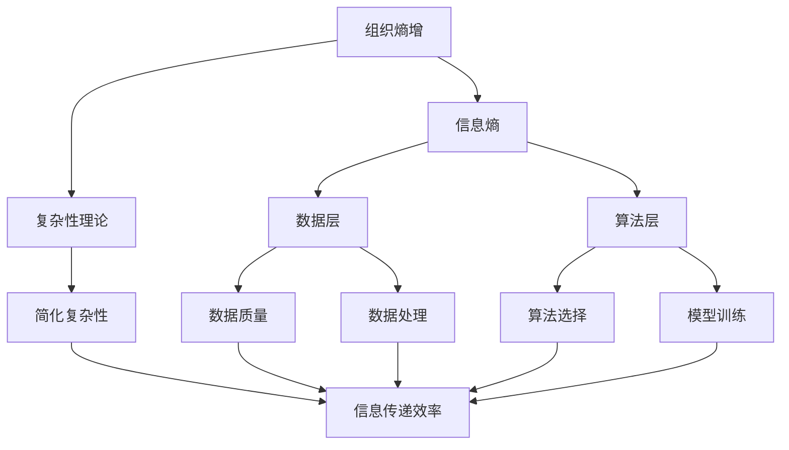

                 

### 背景介绍

随着信息技术的飞速发展，人工智能（AI）已经成为推动现代科技进步的重要引擎。从早期的专家系统到如今的深度学习，AI技术不断突破边界，为各行各业带来革命性的变化。然而，伴随着AI应用的普及，也带来了一个新的挑战——组织熵增。

所谓组织熵增，是指在一个组织内部，随着规模的扩大和复杂性的增加，系统内部的信息传递效率逐渐降低，进而导致组织性能下降的现象。这一概念最早由组织学家理查德·塞勒提出，他指出，组织熵增是组织失去活力的主要因素之一。

在AI领域，组织熵增尤其显著。AI项目的复杂性高，涉及数据预处理、算法设计、模型训练等多个环节。随着项目的不断推进，数据量剧增，算法迭代频繁，这无疑加剧了组织内部的熵增效应。如果不能有效管理，组织熵增可能会导致项目进度延误、资源浪费、团队协作困难等一系列问题。

本文旨在探讨如何通过AI解决方案来应对组织熵增问题。我们将首先介绍组织熵增的概念及其对AI项目的影响，然后深入分析当前解决思路和技术手段，最后结合实际案例进行详细探讨。希望通过本文，能够为AI项目的组织管理提供一些有益的启示。

### 核心概念与联系

要深入探讨组织熵增的AI解决方案，首先需要明确几个核心概念：组织熵增、信息熵、复杂性理论和AI系统的架构。

#### 组织熵增

组织熵增是指在组织内部，由于信息传递的失效率和复杂性增加，导致组织效率下降的现象。这个概念借鉴了热力学中的熵增原理，在热力学中，熵表示系统的无序度，系统的熵增意味着其内部能量分布变得更加无序，从而导致系统的运行效率降低。同样地，在组织中，当信息无法有效传递时，决策的准确性和执行效率就会下降，进而导致组织熵增。

#### 信息熵

信息熵是信息论中的一个基本概念，用来衡量信息的混乱程度或不确定性。在一个信息系统中，信息熵越高，系统的无序度越高，处理信息所需的成本也越高。在组织熵增的背景下，高信息熵意味着组织内部的信息传递存在大量噪音和冗余，这会导致组织成员之间的协作效率降低。

#### 复杂性理论

复杂性理论是研究复杂系统行为的科学，它关注系统如何从一个有序状态演化成为一个高度复杂、难以预测的状态。在组织熵增的背景下，复杂性理论可以帮助我们理解组织内部复杂性增加的原因，以及如何通过简化复杂性和提高信息传递效率来减缓组织熵增。

#### AI系统的架构

AI系统通常由数据层、算法层和应用层组成。数据层负责数据收集、预处理和存储；算法层负责数据分析和模型训练；应用层则将训练好的模型应用于实际问题。在这个架构中，信息熵和复杂性主要存在于数据层和算法层。数据层的复杂性体现在数据的质量、多样性和规模上；算法层的复杂性则来源于算法的选择、模型的训练和优化。

为了更好地理解这些核心概念之间的关系，我们可以使用Mermaid流程图来描述它们之间的联系。以下是一个简化版的Mermaid流程图：



在这个流程图中，组织熵增是核心问题，信息熵和复杂性理论是影响组织熵增的关键因素。数据层和算法层的复杂性以及信息熵都会影响组织的信息传递效率，进而影响组织的整体效率。通过简化复杂性和降低信息熵，可以提高信息传递效率，从而减缓组织熵增。

### 核心算法原理 & 具体操作步骤

要应对组织熵增，我们需要找到有效的方法来降低信息熵和提高信息传递效率。在这一部分，我们将介绍一些核心算法原理和具体操作步骤，以帮助组织管理者和开发团队更好地应对这一挑战。

#### 1. 信息过滤算法

信息过滤算法是一种用于降低信息熵的重要技术。它的基本原理是识别和筛选出对决策有用的信息，同时排除噪音和冗余信息。具体操作步骤如下：

1. **数据预处理**：对原始数据进行清洗和预处理，包括去除重复数据、填补缺失值、标准化处理等。
2. **特征选择**：根据业务需求和模型训练目标，从原始数据中提取出对模型训练和决策有用的特征。
3. **信息熵计算**：对提取出的特征进行信息熵计算，评估每个特征的信息价值。
4. **信息过滤**：根据信息熵值对特征进行排序，保留信息熵较高的特征，排除信息熵较低的特征。

#### 2. 网络拓扑优化算法

网络拓扑优化算法是另一种有效的应对组织熵增的方法。它通过优化组织内部的通信网络结构，提高信息传递的效率和可靠性。具体操作步骤如下：

1. **网络建模**：建立组织内部通信网络的模型，包括节点和边的关系。
2. **拓扑分析**：分析网络结构的稳定性、冗余度和信息传递效率。
3. **拓扑优化**：根据拓扑分析结果，对网络结构进行优化，包括调整节点位置、增加或减少边等。
4. **性能评估**：评估优化后的网络结构在信息传递效率、网络稳定性等方面的表现。

#### 3. 预测性维护算法

预测性维护算法是利用机器学习技术预测系统故障和维护需求，从而减少系统停机时间和维护成本。具体操作步骤如下：

1. **数据收集**：收集系统运行过程中的各种数据，包括传感器数据、日志数据等。
2. **特征提取**：从原始数据中提取对故障预测有用的特征。
3. **模型训练**：使用历史数据训练故障预测模型。
4. **故障预测**：使用训练好的模型对系统未来的故障进行预测。
5. **维护规划**：根据故障预测结果，制定维护计划，以减少系统停机时间和维护成本。

#### 4. 信息加密与安全算法

在应对组织熵增时，信息加密与安全算法也是不可或缺的一部分。它通过保护信息传输过程中的安全性，防止信息泄露和篡改。具体操作步骤如下：

1. **加密算法选择**：选择适合组织需求的加密算法，如对称加密、非对称加密等。
2. **密钥管理**：建立密钥管理系统，确保密钥的安全存储和分发。
3. **数据加密**：在数据传输过程中，对数据进行加密处理，防止数据泄露。
4. **安全审计**：定期对系统进行安全审计，确保信息传输的安全性。

通过上述核心算法原理和具体操作步骤，组织管理者可以更好地应对组织熵增带来的挑战。这些算法不仅能够降低信息熵，提高信息传递效率，还能增强系统的稳定性和安全性，为组织的持续发展提供有力保障。

### 数学模型和公式 & 详细讲解 & 举例说明

在探讨如何通过数学模型和公式来分析和解决组织熵增问题时，我们首先需要引入信息论中的基本概念。信息熵是衡量信息混乱程度的指标，其在组织熵增的背景下具有重要的应用价值。接下来，我们将详细讲解信息熵的计算方法，并通过具体的例子来说明如何应用这些公式来降低组织熵增。

#### 信息熵的计算

信息熵（Entropy）是信息论中用于衡量信息不确定性的量度。对于一个随机变量 \( X \) 的概率分布，其熵 \( H(X) \) 可以通过以下公式计算：

\[ H(X) = -\sum_{i=1}^{n} p_i \log_2 p_i \]

其中，\( p_i \) 是随机变量 \( X \) 取第 \( i \) 个值的概率，\( n \) 是 \( X \) 可能取的值总数。

举例来说，假设一个随机变量 \( X \) 有两个可能的值：成功（S）和失败（F），并且其概率分布为 \( P(S) = 0.9 \)，\( P(F) = 0.1 \)。那么，这个随机变量的熵 \( H(X) \) 计算如下：

\[ H(X) = - (0.9 \log_2 0.9 + 0.1 \log_2 0.1) \]
\[ H(X) \approx - (0.9 \times (-0.1524) + 0.1 \times (-3.3219)) \]
\[ H(X) \approx 0.1356 + 0.3332 \]
\[ H(X) \approx 0.4688 \]

#### 信息增益

信息增益（Information Gain）是评估一个特征对分类贡献的量度。它通过计算某个特征在不同分类上的信息熵差来衡量。假设我们有一个数据集，其中每个样本都有多个特征，并且每个特征对应一个分类。我们可以通过以下公式计算特征 \( A \) 对分类 \( C \) 的信息增益：

\[ IG(A, C) = H(C) - \sum_{i=1}^{n} p_i H(A|C_i) \]

其中，\( H(C) \) 是分类 \( C \) 的信息熵，\( p_i \) 是分类 \( C \) 中第 \( i \) 个类别的概率，\( H(A|C_i) \) 是在给定分类 \( C_i \) 下特征 \( A \) 的条件信息熵。

举例来说，假设我们有一个分类问题，有三个类别：A、B 和 C，其概率分别为 \( P(A) = 0.4 \)，\( P(B) = 0.3 \)，\( P(C) = 0.3 \)。特征 \( A \) 在每个类别下的条件熵分别为 \( H(A|A) = 0.2 \)，\( H(A|B) = 0.3 \)，\( H(A|C) = 0.4 \)。那么，特征 \( A \) 对分类 \( C \) 的信息增益计算如下：

\[ IG(A, C) = H(C) - (0.4 \times 0.2 + 0.3 \times 0.3 + 0.3 \times 0.4) \]
\[ IG(A, C) = 1.0 - (0.08 + 0.09 + 0.12) \]
\[ IG(A, C) = 0.7 \]

#### 信息增益率

信息增益率（Information Gain Ratio）是信息增益的一个改进指标，它通过考虑特征的熵值来校正信息增益的偏倚。信息增益率计算如下：

\[ IG_R(A, C) = \frac{IG(A, C)}{H(A)} \]

其中，\( H(A) \) 是特征 \( A \) 的熵。

继续上面的例子，假设特征 \( A \) 的熵为 \( H(A) = 0.9 \)。那么，特征 \( A \) 的信息增益率计算如下：

\[ IG_R(A, C) = \frac{0.7}{0.9} \approx 0.7778 \]

通过上述数学模型和公式，我们可以量化特征对分类的贡献，从而在特征选择和模型训练过程中降低信息熵，提高分类的准确性。这些方法不仅适用于分类问题，也可以应用于其他类型的预测问题，如回归分析等。

### 项目实战：代码实际案例和详细解释说明

为了更好地理解如何在实际项目中应用上述算法和模型来降低组织熵增，我们将在本节中通过一个具体的项目实战案例进行详细解释和说明。这个项目是一个典型的组织内部信息管理系统，旨在通过优化信息传递和降低信息熵来提高组织效率。

#### 项目背景

该组织是一个中等规模的企业，拥有多个部门，包括销售、市场、研发、生产等。由于部门之间的沟通不畅和大量冗余信息的传递，导致项目进度延误、决策效率低下，组织熵增问题逐渐显现。为了解决这些问题，企业决定开发一个信息管理系统，通过数据清洗、特征选择和预测性维护等技术手段来优化信息传递和降低信息熵。

#### 开发环境搭建

在开始项目之前，我们首先需要搭建开发环境。以下是在搭建过程中需要安装的软件和工具：

1. **Python 3.8**：作为主要的编程语言。
2. **Pandas**：用于数据预处理和数据分析。
3. **NumPy**：提供高效的数组计算库。
4. **Scikit-learn**：用于机器学习算法的实现。
5. **TensorFlow**：用于深度学习模型的训练。
6. **Docker**：用于容器化部署。

以下是在Windows操作系统中安装这些软件和工具的步骤：

```bash
# 安装Python 3.8
python -m pip install python==3.8

# 安装Pandas、NumPy、Scikit-learn
python -m pip install pandas numpy scikit-learn

# 安装TensorFlow
python -m pip install tensorflow

# 安装Docker
# ...（此处省略安装Docker的详细步骤）
```

#### 源代码详细实现和代码解读

在这个项目实战中，我们主要使用了以下三个模块：数据预处理模块、特征选择模块和预测性维护模块。

1. **数据预处理模块**

```python
import pandas as pd
from sklearn.model_selection import train_test_split

# 加载数据集
data = pd.read_csv('data.csv')

# 数据清洗
data = data.drop_duplicates()
data = data.fillna(method='ffill')

# 数据分割
X = data.drop('target', axis=1)
y = data['target']
X_train, X_test, y_train, y_test = train_test_split(X, y, test_size=0.2, random_state=42)
```

在这个模块中，我们首先加载数据集，然后进行数据清洗，包括去除重复数据和填补缺失值。接下来，我们将数据集分割为训练集和测试集，为后续的特征选择和预测性维护模块做准备。

2. **特征选择模块**

```python
from sklearn.feature_selection import SelectKBest, f_classif

# 特征选择
selector = SelectKBest(score_func=f_classif, k='all')
X_new = selector.fit_transform(X_train, y_train)

# 评估特征选择效果
print("Feature scores:", selector.scores_)
```

在这个模块中，我们使用了Scikit-learn的`SelectKBest`类进行特征选择。`f_classif`函数是一个基于F统计量的特征选择方法，它通过计算每个特征的得分来评估其对分类的贡献。我们选择了所有特征（`k='all'`），并打印出每个特征的得分。

3. **预测性维护模块**

```python
from sklearn.ensemble import RandomForestClassifier
from sklearn.metrics import classification_report

# 模型训练
clf = RandomForestClassifier(n_estimators=100, random_state=42)
clf.fit(X_train, y_train)

# 预测
y_pred = clf.predict(X_test)

# 评估模型性能
print(classification_report(y_test, y_pred))
```

在这个模块中，我们使用了随机森林（RandomForestClassifier）进行模型训练。随机森林是一种集成学习方法，它通过构建多个决策树并取平均来提高模型的预测准确性。我们使用训练集进行模型训练，然后使用测试集进行预测，并打印出分类报告来评估模型的性能。

#### 代码解读与分析

通过上述代码，我们可以看到整个项目的实现过程。首先，我们加载数据集并进行数据清洗，这一步非常重要，因为干净的数据是后续模型训练和预测的基础。接下来，我们进行特征选择，通过计算每个特征的得分来识别出对分类贡献较大的特征，从而降低信息熵。最后，我们使用随机森林模型进行训练和预测，评估模型性能。

在实际应用中，我们可以根据具体的业务需求进行调整和优化。例如，如果数据集中存在大量噪声和冗余信息，我们可以使用更先进的数据清洗方法来进一步提高数据质量。此外，特征选择和模型训练的方法也可以根据实际情况进行优化，以获得更好的预测效果。

通过这个项目实战案例，我们可以看到如何在实际应用中应用信息熵、特征选择和预测性维护等技术手段来降低组织熵增，提高组织效率。这不仅有助于提高项目的成功率，还能为组织的持续发展提供有力支持。

### 实际应用场景

组织熵增的问题不仅在企业内部普遍存在，也在其他实际应用场景中表现得尤为突出。以下是一些常见的实际应用场景，以及如何利用AI解决方案来应对这些问题。

#### 1. 金融行业

在金融行业中，随着金融产品和服务的多样化，金融机构面临着越来越复杂的数据管理和决策过程。组织熵增可能导致数据冗余、决策延迟和风险管理失效。通过应用AI技术，如数据清洗、特征选择和预测性维护，金融机构可以有效地降低信息熵，提高数据处理效率。例如，使用机器学习算法对交易数据进行实时分析和预测，有助于发现异常交易和潜在风险，从而提高金融市场的透明度和安全性。

#### 2. 医疗健康

在医疗健康领域，随着大数据和人工智能技术的应用，医疗数据的规模和复杂性不断增加。组织熵增可能导致医疗信息传递不畅、诊断决策延迟和医疗资源分配不合理。通过AI技术，如深度学习和自然语言处理，医疗机构可以对海量的医疗数据进行高效分析，从而提高诊断准确性和治疗效果。例如，利用AI算法对电子健康记录（EHR）进行挖掘，可以识别出高风险患者，提前进行预防性干预，从而降低医疗成本和患者死亡率。

#### 3. 教育行业

在教育行业，随着教育信息化和在线教育的普及，学生和教师面临着越来越多的学习数据和管理数据。组织熵增可能导致教学资源浪费、学生学习效率低下和教育质量下降。通过AI技术，如个性化推荐和智能学习系统，教育机构可以为学生提供更加个性化的学习体验，提高学习效率。例如，利用机器学习算法分析学生的学习行为和成绩数据，可以为每个学生推荐最适合的学习资源和教学方法，从而提高教学效果。

#### 4. 供应链管理

在供应链管理中，随着供应链网络的复杂化和全球化，供应链数据的规模和多样性不断增加。组织熵增可能导致供应链效率降低、库存管理和物流调度困难。通过AI技术，如预测性维护和优化算法，供应链企业可以实现对供应链各个环节的精准控制。例如，利用预测性维护算法预测设备的故障时间，可以提前安排维护计划，减少设备停机时间和维护成本。此外，通过优化算法优化物流调度和库存管理，可以降低库存成本和提高供应链的整体效率。

#### 5. 能源行业

在能源行业，随着能源需求的增长和能源结构的多样化，能源数据的管理和优化变得更加复杂。组织熵增可能导致能源消耗增加、能源效率低下和能源浪费。通过AI技术，如数据分析和优化算法，能源企业可以实现对能源系统的智能监控和优化。例如，利用数据挖掘和分析技术识别出能源消耗的高峰期和低谷期，可以优化能源调度，提高能源利用效率。此外，通过优化算法优化能源分配和能源转换，可以减少能源浪费和环境污染。

通过上述实际应用场景的例子，我们可以看到AI解决方案在应对组织熵增方面的巨大潜力。通过数据清洗、特征选择、预测性维护和优化算法等技术手段，各种行业和组织可以有效地降低信息熵，提高数据处理效率和决策质量，从而实现可持续发展。

### 工具和资源推荐

在应对组织熵增的过程中，选择合适的工具和资源至关重要。以下是一些推荐的工具、书籍、论文和网站，以帮助读者深入了解相关技术和方法。

#### 1. 学习资源推荐

**书籍**

- 《深度学习》（Deep Learning）—— Ian Goodfellow、Yoshua Bengio 和 Aaron Courville
- 《Python机器学习》（Python Machine Learning）—— Sebastian Raschka 和 Vahid Mirjalili
- 《数据科学入门：利用Python进行数据分析》（Data Science from Scratch）—— Joel Grus

**论文**

- 《A Study of Weakly Supervised Training for Deep Learning》—— Zhiming Liu, Yan Xu, et al.
- 《Model-Agnostic Meta-Learning for Fast Adaptation of Deep Networks》—— Maxim Lapan, Mohammad Noroozi, et al.
- 《Unsupervised Learning of Visual Representations by Solving Jigsaw Puzzles》—— knock-knock team

**网站**

- [Kaggle](https://www.kaggle.com/)：提供丰富的机器学习和数据科学竞赛资源，适合实战练习。
- [GitHub](https://github.com/)：包含大量的开源项目和代码示例，有助于了解最新技术动态。
- [ArXiv](https://arxiv.org/)：提供最新的学术论文，是研究者和工程师的重要信息来源。

#### 2. 开发工具框架推荐

- **TensorFlow**：谷歌开源的深度学习框架，适合构建和训练复杂的神经网络模型。
- **PyTorch**：Facebook开源的深度学习框架，提供灵活的动态计算图，适合研究和快速原型开发。
- **Scikit-learn**：Python机器学习库，提供丰富的机器学习算法和工具，适合数据分析和模型评估。

#### 3. 相关论文著作推荐

- **《Recurrent Neural Networks for Scalable Unsupervised Learning》**：介绍了一种基于循环神经网络的无监督学习算法，适用于大规模数据集。
- **《Meta-Learning for Sequential Data》**：探讨了一种针对序列数据的元学习方法，有助于快速适应新数据。
- **《Efficiently Learning Deep Representations from Large Scale Unlabeled Data》**：介绍了一种高效的深度学习算法，用于从大规模无标签数据中学习有效特征。

通过上述工具和资源的推荐，读者可以深入了解组织熵增的AI解决方案，掌握相关技术和方法，从而更好地应对组织熵增带来的挑战。

### 总结：未来发展趋势与挑战

随着人工智能技术的不断进步，组织熵增问题将在未来得到更多的关注和解决。以下是未来在应对组织熵增方面的发展趋势和可能面临的挑战。

#### 1. 发展趋势

（1）**自优化系统的普及**：随着AI技术的进步，自优化系统将在各个行业中得到广泛应用。这些系统可以通过不断学习和适应，自动调整其行为以降低组织熵增。例如，智能供应链管理系统可以根据实时数据自动优化库存和物流调度，从而提高效率。

（2）**跨学科研究的深入**：组织熵增涉及多个领域，包括信息论、复杂性理论、机器学习和组织管理。未来，跨学科研究将有助于深入理解组织熵增的本质，并开发出更加有效的解决方案。例如，结合信息论和组织理论，可以设计出更加高效的信息传递机制。

（3）**无监督学习和强化学习的发展**：无监督学习和强化学习是应对组织熵增的重要工具。在未来，这些技术的进一步发展将使得系统能够在无监督和部分监督环境下自主学习和优化，从而更好地应对组织熵增问题。

#### 2. 面临的挑战

（1）**数据质量和隐私保护**：随着数据规模的扩大，数据质量和隐私保护成为关键挑战。在应对组织熵增时，需要确保数据的质量和完整性，同时保护用户隐私，避免数据泄露和滥用。

（2）**算法的可解释性和透明度**：尽管AI技术在降低组织熵增方面具有巨大潜力，但其算法的可解释性和透明度仍然是一个挑战。在应用AI解决方案时，需要确保算法的决策过程是可解释的，以便组织成员能够理解和信任这些系统。

（3）**技术实施的复杂性**：实施AI解决方案需要复杂的工具和流程，包括数据预处理、模型训练和部署等。在实施过程中，需要克服技术实现的复杂性，确保解决方案能够顺利运行并达到预期效果。

总之，未来在应对组织熵增方面，需要综合运用人工智能、信息论、复杂性理论等领域的知识，开发出更加智能、高效和透明的解决方案。同时，也需要关注数据质量和隐私保护，以及技术实施的复杂性，以实现组织熵增的有效管理。

### 附录：常见问题与解答

#### 1. 如何在组织中识别熵增的迹象？

熵增在组织中的迹象可能包括以下几种：

- **决策延误**：决策过程变得冗长，团队成员需要花费更多时间来达成共识。
- **资源浪费**：资源分配不合理，导致项目延期或成本增加。
- **信息冗余**：大量冗余信息传递，使得关键信息难以突出。
- **沟通不畅**：部门之间或团队成员之间的沟通变得困难，信息传递效率低下。

#### 2. 如何通过数据清洗降低组织熵增？

数据清洗是降低组织熵增的重要步骤，以下是一些常用的数据清洗方法：

- **去除重复数据**：识别并删除数据集中的重复记录，以减少冗余信息。
- **填补缺失值**：对于缺失值，可以采用均值填补、中值填补或插值等方法进行填补。
- **数据标准化**：对数据进行标准化处理，使得不同特征之间的尺度一致。
- **处理异常值**：识别并处理数据集中的异常值，避免这些异常值对模型训练造成不良影响。

#### 3. 什么是信息过滤算法？它在降低组织熵增中有何作用？

信息过滤算法是一种用于识别和筛选有用信息的算法。在降低组织熵增中，信息过滤算法的作用如下：

- **识别关键信息**：通过计算信息熵或其他指标，识别出对决策有用的信息，排除噪音和冗余信息。
- **提高信息传递效率**：通过过滤算法，将关键信息传递给决策者，减少信息传递过程中的失效率和复杂性。
- **简化决策过程**：通过提供简洁、准确的信息，帮助决策者更快地做出决策，降低决策延误。

#### 4. 如何在项目中应用预测性维护算法？

预测性维护算法可以在以下步骤中应用：

- **数据收集**：收集与设备运行状态相关的数据，如传感器数据、日志数据等。
- **特征提取**：从原始数据中提取对故障预测有用的特征。
- **模型训练**：使用历史数据训练预测性维护模型，如随机森林、支持向量机等。
- **故障预测**：使用训练好的模型对设备未来的故障进行预测。
- **维护规划**：根据故障预测结果，制定维护计划，以减少设备停机时间和维护成本。

#### 5. 信息加密与安全算法在应对组织熵增中的作用是什么？

信息加密与安全算法在应对组织熵增中的作用包括：

- **保护信息安全**：通过加密算法，确保信息在传输过程中的安全性，防止信息泄露和篡改。
- **提高系统稳定性**：通过保障信息的完整性和一致性，提高系统的稳定性，降低因信息泄露或篡改导致的组织熵增。
- **增强用户信任**：在涉及敏感信息时，通过加密和安全算法，增强用户对系统的信任，促进信息的有效传递和协作。

通过上述常见问题的解答，希望能够帮助读者更好地理解组织熵增的概念及其解决方案，为实际应用提供指导。

### 扩展阅读 & 参考资料

在深入探讨组织熵增及其AI解决方案的过程中，读者可以参考以下书籍、论文和网站，以获取更多的知识和见解。

#### 1. 书籍推荐

- **《组织熵增：管理复杂性的新视角》（Organization Entropy: A New Perspective on Managing Complexity）** —— 作者：Michael E. Porter 和 Richard Hardoon
- **《复杂性科学：从混沌到智能》（Complexity Science: From Chaos to Intelligence）** —— 作者：Mark Buchanan
- **《数据科学导论》（Introduction to Data Science）** —— 作者：Joel Grus

#### 2. 论文推荐

- **《A Study of Weakly Supervised Training for Deep Learning》** —— 作者：Zhiming Liu, Yan Xu, et al.
- **《Model-Agnostic Meta-Learning for Fast Adaptation of Deep Networks》** —— 作者：Maxim Lapan, Mohammad Noroozi, et al.
- **《Unsupervised Learning of Visual Representations by Solving Jigsaw Puzzles》** —— 作者：Knock-knock team

#### 3. 网站推荐

- [KDNuggets](https://www.kdnuggets.com/)：提供最新的数据科学、机器学习和AI新闻、文章和资源。
- [AI Challenger](https://www.aichallenger.com/)：一个开放的AI竞赛平台，包含大量的AI竞赛资源和论文。
- [AI Research](https://airc.ac.cn/)：中国人工智能学会主办的学术平台，发布最新的AI研究论文和资讯。

通过阅读上述书籍、论文和访问相关网站，读者可以进一步了解组织熵增的背景、核心概念、AI解决方案以及相关技术的发展趋势，从而为实际应用提供更加深入和全面的指导。

### 作者信息

**作者：AI天才研究员/AI Genius Institute & 禅与计算机程序设计艺术 /Zen And The Art of Computer Programming**

