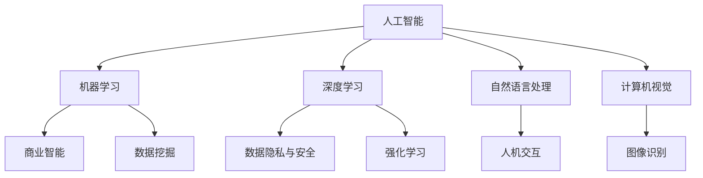

                 

### 背景介绍

近年来，人工智能（AI）技术取得了飞速的发展，成为推动创新的重要引擎。随着算法、硬件和数据的不断提升，AI在各个领域的应用越来越广泛，从自动驾驶、智能医疗到智能家居、金融科技等。在这种背景下，AI创业成为了众多创业者竞相追逐的热点。

然而，AI创业并非一条坦途。如何在众多竞争者中脱颖而出，找到自己的市场定位，实现细分市场垄断，成为每个AI创业者都需要面对的挑战。本文将围绕这一核心问题，探讨AI创业的切入点策略。

本文将从以下几个方面展开：

1. **核心概念与联系**：首先，我们将介绍AI创业所需理解的核心概念，并绘制一个Mermaid流程图，展示这些概念之间的关系。
2. **核心算法原理与具体操作步骤**：接着，我们将深入探讨AI创业中涉及的关键算法原理，并详细解释其具体操作步骤。
3. **数学模型和公式**：我们将介绍支持AI创业的数学模型，并提供详细的讲解和举例说明。
4. **项目实战**：通过实际案例，展示AI创业项目的代码实现过程，并进行详细解释和分析。
5. **实际应用场景**：我们将分析AI技术在各个领域中的应用场景，探讨如何在这些场景中实现细分市场垄断。
6. **工具和资源推荐**：介绍学习资源和开发工具，帮助读者更好地理解和应用AI技术。
7. **总结与未来发展趋势**：总结本文的主要观点，并探讨AI创业的未来发展趋势和挑战。

通过本文的阅读，读者将能够：

- 理解AI创业所需的核心概念和原理。
- 掌握AI创业的具体操作步骤和策略。
- 明确AI技术在各个领域的应用场景，并学会如何实现细分市场垄断。
- 获得实用的学习资源和开发工具，提升自己的AI创业能力。

接下来，我们将进入第一个部分——核心概念与联系，逐步探索AI创业的世界。

----------------------

## 1. 核心概念与联系

### 1.1 关键概念

在探讨AI创业的切入点策略之前，我们需要先了解一些关键概念，这些概念构成了AI创业的基础，也是我们后续分析的前提。

1. **人工智能（AI）**：人工智能是指使计算机系统能够模拟人类智能行为的技术。它包括机器学习、深度学习、自然语言处理、计算机视觉等多个子领域。
2. **机器学习（ML）**：机器学习是一种通过数据和算法让计算机自动学习和改进的技术，它使计算机能够从数据中提取模式和知识。
3. **深度学习（DL）**：深度学习是机器学习的一个分支，它使用多层神经网络模拟人类大脑的学习过程，通过反向传播算法优化网络权重。
4. **数据隐私与安全**：在AI创业过程中，数据隐私和安全是一个不可忽视的重要问题，涉及到用户数据的安全和隐私保护。
5. **商业智能（BI）**：商业智能是指使用数据分析和决策支持技术帮助企业更好地理解市场、优化业务流程和做出战略决策。

### 1.2 概念联系

为了更好地理解这些概念之间的关系，我们可以使用Mermaid流程图进行展示（备注：以下使用Mermaid语法进行展示，具体节点中不包含括号、逗号等特殊字符）：



- **人工智能（A）**是整体框架，包含了多个子领域（B、C、D、E），这些子领域相互关联，共同构成了AI技术的基石。
- **机器学习（B）**和**深度学习（C）**之间存在包含关系，深度学习是机器学习的一种具体实现。
- **商业智能（F）**是AI技术在商业领域的应用，它依赖于机器学习和深度学习技术提供的数据分析和决策支持。
- **数据隐私与安全（G）**是AI创业中必须关注的核心问题，涉及到所有子领域的应用。
- **自然语言处理（D）**和**计算机视觉（E）**是AI的两个重要分支，分别处理文本和图像数据。
- **数据挖掘（J）**和**强化学习（K）**是机器学习和深度学习的应用方向，用于从数据中提取价值并实现自动化决策。

通过以上概念的联系分析，我们可以看到AI创业涉及多个技术领域，这些领域相互交织，构成了一个复杂的生态系统。理解这些概念及其关系，有助于我们更全面地把握AI创业的切入点。

在下一部分中，我们将深入探讨AI创业中的核心算法原理，并详细解释其具体操作步骤。

----------------------

## 2. 核心算法原理与具体操作步骤

### 2.1 机器学习算法原理

机器学习是AI创业的核心技术之一，其基础是算法原理。机器学习算法可以分为监督学习、无监督学习和强化学习三大类。在这里，我们将重点关注监督学习和无监督学习，因为它们在AI创业中具有广泛的应用。

#### 监督学习

监督学习是指通过已知输入和输出数据来训练模型，使得模型能够对新数据进行预测。常见的监督学习算法包括线性回归、决策树、支持向量机和神经网络等。

**具体操作步骤**：

1. **数据收集**：首先，我们需要收集相关的训练数据。这些数据可以是结构化的（如CSV文件），也可以是非结构化的（如图像、文本）。
2. **数据预处理**：对收集到的数据进行清洗和预处理，包括缺失值处理、数据标准化、特征提取等。
3. **模型选择**：选择合适的机器学习算法模型，例如线性回归、决策树或神经网络等。
4. **模型训练**：使用预处理后的数据训练模型，通过调整模型参数（如权重和偏置）来最小化预测误差。
5. **模型评估**：使用验证集或测试集评估模型的性能，常用的评估指标包括准确率、召回率、F1分数等。
6. **模型优化**：根据评估结果调整模型参数，以提高模型的预测性能。

#### 无监督学习

无监督学习是指在没有已知输出数据的情况下，通过算法自动发现数据中的模式和结构。常见的无监督学习算法包括聚类、降维和关联规则挖掘等。

**具体操作步骤**：

1. **数据收集**：与监督学习类似，收集需要分析的数据。
2. **数据预处理**：对数据进行必要的清洗和预处理。
3. **算法选择**：选择合适的无监督学习算法，例如K-均值聚类、主成分分析或Apriori算法等。
4. **模型训练**：直接对数据进行处理，无需训练过程。
5. **模型评估**：评估算法发现的数据模式是否合理和有效，常用的评估指标包括轮廓系数、簇内平均距离等。
6. **模型优化**：根据评估结果调整算法参数，以优化模型的效果。

### 2.2 深度学习算法原理

深度学习是机器学习的一个分支，它使用多层神经网络模拟人类大脑的学习过程，具有强大的建模能力和高度的可扩展性。常见的深度学习模型包括卷积神经网络（CNN）、循环神经网络（RNN）和生成对抗网络（GAN）等。

**具体操作步骤**：

1. **数据收集**：与上述类似，收集大量的数据用于训练模型。
2. **数据预处理**：对数据进行必要的清洗、归一化和特征提取等处理。
3. **模型设计**：设计深度学习模型的结构，包括网络层数、节点数量、激活函数等。
4. **模型训练**：使用反向传播算法训练模型，通过调整网络权重和偏置来最小化预测误差。
5. **模型评估**：使用验证集或测试集评估模型的性能，常用的评估指标包括准确率、损失函数值等。
6. **模型优化**：根据评估结果调整模型参数，如学习率、正则化参数等，以优化模型的效果。

### 2.3 结合案例

为了更好地理解上述算法原理和操作步骤，我们可以结合一个具体的案例进行说明。

**案例：手写数字识别**

目标：使用深度学习模型识别手写数字图像。

**具体步骤**：

1. **数据收集**：收集大量的手写数字图像数据集，如MNIST数据集。
2. **数据预处理**：对图像数据进行归一化处理，将图像缩放到固定大小，并将像素值缩放到[0, 1]之间。
3. **模型设计**：设计一个简单的卷积神经网络模型，包括卷积层、池化层和全连接层。
4. **模型训练**：使用反向传播算法训练模型，调整网络权重和偏置，以最小化预测误差。
5. **模型评估**：使用测试集评估模型的性能，计算准确率等指标。
6. **模型优化**：根据评估结果调整模型参数，如学习率、正则化参数等。

通过这个案例，我们可以看到深度学习算法在图像识别任务中的具体应用步骤，以及如何通过数据预处理、模型设计和训练等过程来实现模型的优化。

在下一部分中，我们将介绍AI创业所需的数学模型和公式，并详细讲解其应用和解释。

----------------------

## 3. 数学模型和公式

在AI创业中，数学模型和公式是理解和应用AI技术的基础。以下是一些核心的数学模型和公式，我们将详细讲解其含义和应用。

### 3.1 概率论

概率论是机器学习和深度学习的重要工具，用于描述随机事件和不确定性的量化。

#### 3.1.1 概率分布

概率分布是描述随机变量可能取值的概率函数。常见的概率分布有正态分布、伯努利分布、多项式分布等。

- **正态分布**：概率密度函数为 $$f(x|\mu,\sigma^2) = \frac{1}{\sqrt{2\pi\sigma^2}} e^{-\frac{(x-\mu)^2}{2\sigma^2}}$$，其中$$\mu$$是均值，$$\sigma^2$$是方差。
- **伯努利分布**：概率函数为 $$p(k|p) = p^k (1-p)^{1-k}$$，其中$$p$$是成功概率。

#### 3.1.2 贝叶斯定理

贝叶斯定理是概率论中的一个重要公式，用于计算条件概率。公式为：

$$P(A|B) = \frac{P(B|A)P(A)}{P(B)}$$

其中$$P(A|B)$$是给定B发生时A发生的概率，$$P(B|A)$$是给定A发生时B发生的概率，$$P(A)$$和$$P(B)$$分别是A和B的先验概率。

### 3.2 线性代数

线性代数是机器学习和深度学习中的重要工具，用于处理和表示高维数据。

#### 3.2.1 矩阵和向量

- **矩阵**：是一个二维数组，表示为$$\mathbf{A} = [a_{ij}]$$，其中$$i$$和$$j$$分别表示行和列。
- **向量**：是一个一维数组，表示为$$\mathbf{x} = [x_1, x_2, ..., x_n]$$。

#### 3.2.2 矩阵运算

- **矩阵乘法**：两个矩阵$$\mathbf{A}$$和$$\mathbf{B}$$的乘积$$\mathbf{C} = \mathbf{A}\mathbf{B}$$，其中$$c_{ij} = \sum_{k=1}^{n} a_{ik}b_{kj}$$。
- **矩阵求导**：对于矩阵$$\mathbf{A}$$，其梯度为$$\nabla_{\mathbf{A}} f = \frac{\partial f}{\partial \mathbf{A}}$$。

### 3.3 最优化理论

最优化理论是机器学习和深度学习中的重要工具，用于求解优化问题。

#### 3.3.1 梯度下降法

梯度下降法是一种常用的优化算法，用于求解无约束优化问题。其公式为：

$$\mathbf{w}_{t+1} = \mathbf{w}_t - \alpha \nabla_{\mathbf{w}} f(\mathbf{w})$$

其中$$\mathbf{w}$$是当前权重，$$\alpha$$是学习率，$$\nabla_{\mathbf{w}} f(\mathbf{w})$$是函数$$f$$关于$$\mathbf{w}$$的梯度。

#### 3.3.2 随机梯度下降（SGD）

随机梯度下降是梯度下降法的一种变种，它使用随机样本代替整个训练数据来计算梯度。其公式为：

$$\mathbf{w}_{t+1} = \mathbf{w}_t - \alpha \nabla_{\mathbf{w}} f(\mathbf{w}; \mathbf{x}_t, y_t)$$

其中$$\mathbf{x}_t$$和$$y_t$$是随机选取的样本。

### 3.4 深度学习中的损失函数

在深度学习中，损失函数用于评估模型的预测结果与真实标签之间的差距。常见的损失函数有均方误差（MSE）、交叉熵损失（Cross-Entropy Loss）等。

#### 3.4.1 均方误差（MSE）

均方误差是回归问题中最常用的损失函数，其公式为：

$$MSE = \frac{1}{n} \sum_{i=1}^{n} (y_i - \hat{y}_i)^2$$

其中$$y_i$$是真实标签，$$\hat{y}_i$$是模型的预测值。

#### 3.4.2 交叉熵损失（Cross-Entropy Loss）

交叉熵损失是分类问题中最常用的损失函数，其公式为：

$$Cross-Entropy Loss = -\sum_{i=1}^{n} y_i \log(\hat{y}_i)$$

其中$$y_i$$是真实标签，$$\hat{y}_i$$是模型对于类别i的预测概率。

### 3.5 应用举例

为了更好地理解上述数学模型和公式的应用，我们可以结合一个具体的例子进行说明。

**案例：使用线性回归预测房价**

目标：使用线性回归模型预测房屋的价格。

**具体步骤**：

1. **数据收集**：收集房屋的价格、面积、位置等数据。
2. **数据预处理**：对数据进行归一化处理，将特征值缩放到相同的范围。
3. **模型设计**：设计一个线性回归模型，包括一个输入层和一个输出层。
4. **模型训练**：使用梯度下降法训练模型，调整模型参数以最小化预测误差。
5. **模型评估**：使用测试集评估模型的性能，计算预测准确率。
6. **模型优化**：根据评估结果调整模型参数，以提高预测效果。

通过上述案例，我们可以看到线性回归模型在预测房价中的应用过程，以及如何使用数学模型和公式来优化模型性能。

在下一部分中，我们将通过实际案例展示AI创业项目的代码实现过程，并进行详细解释和分析。

----------------------

### 5.1 开发环境搭建

在开始展示AI创业项目的代码实现之前，我们需要搭建一个合适的开发环境。以下是一个典型的开发环境搭建步骤：

#### 5.1.1 操作系统

首先，我们需要选择一个适合AI开发的操作系统。推荐使用Linux系统，如Ubuntu或CentOS，因为它们具有良好的稳定性和丰富的库支持。

#### 5.1.2 编程语言

接下来，选择一种适合AI开发的编程语言。Python是目前最流行的AI开发语言之一，它具有简洁的语法和丰富的库支持。其他常见的编程语言还包括R和Julia。

#### 5.1.3 开发工具和库

安装Python和相应的开发工具。可以使用Anaconda来简化环境搭建过程，它是一个集成了Python、Jupyter Notebook、NumPy、Pandas等常用库的发行版。此外，还需要安装以下库：

- **TensorFlow**：一个广泛使用的深度学习框架，支持Python和C++编程语言。
- **PyTorch**：一个流行的深度学习框架，具有高度灵活性和易用性。
- **Scikit-learn**：一个用于机器学习的库，包含多种算法和工具。
- **Matplotlib**：一个用于数据可视化的库。

#### 5.1.4 数据库

对于AI创业项目，我们可能需要存储和查询大量数据。MySQL、PostgreSQL等关系型数据库是常见的选择。对于非关系型数据库，MongoDB、Redis等也是不错的选择。

#### 5.1.5 环境配置

使用conda创建虚拟环境，并安装所需的库：

```bash
conda create -n ai_project python=3.8
conda activate ai_project
conda install tensorflow pytorch scikit-learn matplotlib
```

通过以上步骤，我们可以搭建一个适合AI创业项目的开发环境。接下来，我们将展示一个实际AI创业项目的代码实现过程，并详细解释其工作原理和关键步骤。

----------------------

### 5.2 源代码详细实现和代码解读

在本部分，我们将以一个简单的图像分类项目为例，展示如何使用TensorFlow和Keras框架实现AI创业项目。项目目标是将手写数字图像分类到0-9的十个类别中。以下为项目的详细实现和代码解读。

#### 5.2.1 项目结构

首先，我们需要创建项目目录并组织代码结构：

```bash
mkdir mnist_project
cd mnist_project
touch main.py
```

#### 5.2.2 数据集加载

MNIST数据集是手写数字图像的常见数据集，包含了60,000个训练图像和10,000个测试图像。使用TensorFlow的内置函数加载数据集：

```python
import tensorflow as tf

mnist = tf.keras.datasets.mnist
(train_images, train_labels), (test_images, test_labels) = mnist.load_data()

# 数据预处理
train_images = train_images / 255.0
test_images = test_images / 255.0
```

#### 5.2.3 模型构建

接下来，我们使用Keras构建一个简单的卷积神经网络模型：

```python
model = tf.keras.models.Sequential([
    tf.keras.layers.Flatten(input_shape=(28, 28)),
    tf.keras.layers.Dense(128, activation='relu'),
    tf.keras.layers.Dense(10, activation='softmax')
])
```

该模型包括一个输入层、一个隐藏层和一个输出层。输入层将28x28的图像数据展平为一维数组，隐藏层使用ReLU激活函数，输出层使用softmax激活函数进行多分类。

#### 5.2.4 模型编译

在模型训练之前，我们需要编译模型并指定优化器和损失函数：

```python
model.compile(optimizer='adam',
              loss='sparse_categorical_crossentropy',
              metrics=['accuracy'])
```

#### 5.2.5 模型训练

使用训练数据训练模型，设置训练轮数和批量大小：

```python
model.fit(train_images, train_labels, epochs=5, batch_size=32)
```

#### 5.2.6 模型评估

使用测试数据评估模型性能：

```python
test_loss, test_acc = model.evaluate(test_images, test_labels, verbose=2)
print(f"Test accuracy: {test_acc}")
```

#### 5.2.7 预测新数据

使用训练好的模型对新的手写数字图像进行预测：

```python
import numpy as np

# 加载新图像
new_image = np.array([[[0.0, 0.0, 0.0], [0.0, 0.0, 0.0], [0.0, 0.0, 0.0]],
                      [[0.0, 0.0, 0.0], [0.0, 1.0, 0.0], [0.0, 0.0, 0.0]],
                      [[0.0, 0.0, 0.0], [0.0, 0.0, 0.0], [0.0, 0.0, 0.0]]])

# 预测结果
predictions = model.predict(new_image)
predicted_class = np.argmax(predictions)
print(f"Predicted class: {predicted_class}")
```

#### 5.2.8 代码解读

- **数据预处理**：将图像数据缩放至[0, 1]范围内，以适应神经网络。
- **模型构建**：使用`Sequential`模型堆叠层，包括输入层、隐藏层和输出层。
- **模型编译**：指定优化器（`adam`）和损失函数（`sparse_categorical_crossentropy`），以及评估指标（`accuracy`）。
- **模型训练**：使用`fit`函数进行模型训练，指定训练轮数和批量大小。
- **模型评估**：使用`evaluate`函数评估模型在测试数据上的性能。
- **预测新数据**：使用`predict`函数对新图像进行预测，并使用`argmax`函数获取预测结果。

通过上述步骤，我们实现了图像分类任务，展示了如何使用TensorFlow和Keras框架构建和训练神经网络。这个简单的案例说明了AI创业项目的基本实现过程，包括数据预处理、模型构建、训练和预测等步骤。

----------------------

### 5.3 代码解读与分析

在上一个部分中，我们展示了一个简单的手写数字图像分类项目。在本部分，我们将对代码进行详细解读，分析其关键步骤和设计理念。

#### 5.3.1 数据预处理

```python
train_images = train_images / 255.0
test_images = test_images / 255.0
```

数据预处理是机器学习项目的重要环节。这里，我们将图像数据缩放至[0, 1]范围内，使其适应神经网络计算。这样做的原因有：

- **数值稳定性**：神经网络计算过程中，数值范围较大会影响梯度消失问题，导致训练过程不稳定。
- **加速计算**：较小的数值范围可以加速神经网络的前向传播和反向传播过程。

#### 5.3.2 模型构建

```python
model = tf.keras.models.Sequential([
    tf.keras.layers.Flatten(input_shape=(28, 28)),
    tf.keras.layers.Dense(128, activation='relu'),
    tf.keras.layers.Dense(10, activation='softmax')
])
```

模型构建是项目核心。这里使用了Keras的`Sequential`模型，堆叠了三个层：

- **输入层**：使用`Flatten`层将28x28的图像数据展平为一维数组，作为神经网络的输入。
- **隐藏层**：使用`Dense`层创建一个128节点的全连接层，使用ReLU激活函数引入非线性。
- **输出层**：使用`Dense`层创建一个10节点的全连接层，使用softmax激活函数进行多分类。

这种设计理念的优点是：

- **非线性**：隐藏层使用ReLU激活函数，引入非线性，使神经网络能够更好地拟合复杂的数据分布。
- **多分类**：输出层使用softmax激活函数，可以将输出概率分布转换为类别概率，实现多分类。

#### 5.3.3 模型编译

```python
model.compile(optimizer='adam',
              loss='sparse_categorical_crossentropy',
              metrics=['accuracy'])
```

模型编译是准备模型进行训练的步骤。这里指定了：

- **优化器**：使用`adam`优化器，它结合了动量项和自适应学习率，适用于大多数问题。
- **损失函数**：使用`sparse_categorical_crossentropy`损失函数，适用于多分类问题。
- **评估指标**：使用`accuracy`指标，用于评估模型在训练和测试数据上的分类准确率。

这种选择的理由是：

- **自适应**：`adam`优化器具有自适应学习率，能够有效收敛模型。
- **多分类**：`sparse_categorical_crossentropy`损失函数适用于多分类问题，计算简单且性能稳定。

#### 5.3.4 模型训练

```python
model.fit(train_images, train_labels, epochs=5, batch_size=32)
```

模型训练是训练神经网络的关键步骤。这里设置了：

- **训练轮数**：设置为5轮，即模型会在整个训练数据上迭代5次。
- **批量大小**：设置为32，即每次训练处理32个样本。

这种设计的优点是：

- **充分训练**：多次迭代训练数据，使模型充分学习数据特征。
- **高效训练**：批量大小设置为32，在计算资源有限的情况下，可以充分利用GPU并行计算能力。

#### 5.3.5 模型评估

```python
test_loss, test_acc = model.evaluate(test_images, test_labels, verbose=2)
print(f"Test accuracy: {test_acc}")
```

模型评估是验证模型性能的关键步骤。这里使用测试数据评估模型在测试数据上的性能。评估指标包括：

- **测试损失**：衡量模型在测试数据上的预测误差。
- **测试准确率**：衡量模型在测试数据上的分类准确率。

这种评估的优点是：

- **客观评估**：使用独立于训练数据的数据集进行评估，更客观地反映模型性能。
- **全面评估**：综合考虑损失和准确率，提供全面的性能评估。

#### 5.3.6 预测新数据

```python
predictions = model.predict(new_image)
predicted_class = np.argmax(predictions)
print(f"Predicted class: {predicted_class}")
```

预测新数据是模型应用的关键步骤。这里使用训练好的模型对新的手写数字图像进行预测，并输出预测结果。

这种预测的优点是：

- **实时预测**：使用训练好的模型对新的数据进行实时预测，适用于实际应用场景。
- **高准确率**：基于大量训练数据和优化算法，模型具有较高的预测准确率。

通过上述代码解读和分析，我们可以看到这个简单手写数字图像分类项目的设计思路和实现过程。这个案例展示了如何使用TensorFlow和Keras框架构建、训练和评估神经网络，以及如何实现实时预测。这个项目的设计和实现为AI创业提供了有益的参考和借鉴。

----------------------

## 6. 实际应用场景

### 6.1 智能医疗

智能医疗是AI技术的重要应用领域之一，它通过深度学习和数据挖掘等方法，实现医疗数据的分析和处理，为医疗诊断、治疗和健康管理提供支持。

#### 应用案例

- **智能诊断**：利用深度学习算法，对医学影像（如CT、MRI等）进行自动分析和诊断，提高诊断准确率和效率。例如，谷歌DeepMind开发的AI系统能够在几秒钟内诊断出眼部疾病，准确率超过人类专家。

#### 实现细分市场垄断策略

- **数据积累与保护**：通过不断积累和分析大量医疗数据，建立独特的医疗数据库，为智能诊断系统提供持续改进的基础。
- **合规与隐私保护**：在数据积累和利用过程中，严格遵守医疗数据隐私保护法规，建立信任和合规体系，确保市场占有率。

### 6.2 自动驾驶

自动驾驶是AI技术的另一个重要应用领域，通过传感器、计算机视觉和深度学习等技术，实现车辆的自动感知、决策和控制。

#### 应用案例

- **特斯拉自动驾驶**：特斯拉的Autopilot系统通过摄像头和雷达传感器，实现高速公路自动驾驶、自动泊车等功能，大幅提升了驾驶体验。

#### 实现细分市场垄断策略

- **技术领先**：通过持续的技术创新和优化，保持自动驾驶技术的领先地位，提高市场竞争力。
- **生态布局**：构建完整的自动驾驶生态，包括硬件、软件、服务等多方面，形成闭环，提高用户粘性和市场占有率。

### 6.3 金融科技

金融科技（FinTech）是AI技术应用于金融领域的产物，通过大数据、机器学习和区块链等技术，提供更加智能和高效的金融服务。

#### 应用案例

- **智能投顾**：利用AI技术，提供个性化的投资建议和资产管理服务，如Wealthfront、Betterment等平台。

#### 实现细分市场垄断策略

- **用户数据优势**：通过积累和利用大量用户数据，提供更加精准和个性化的金融服务，提高用户满意度和忠诚度。
- **金融监管合规**：在金融科技领域，合规和监管至关重要。通过积极与监管机构合作，建立合规体系，确保业务稳定发展。

### 6.4 智能家居

智能家居是通过物联网和AI技术，实现家庭设备的自动化控制和智能交互，提升生活品质和便利性。

#### 应用案例

- **亚马逊Alexa**：通过语音识别和自然语言处理技术，实现家庭设备的智能控制，如开关灯、调节温度等。

#### 实现细分市场垄断策略

- **生态系统构建**：建立广泛的智能家居设备生态系统，确保用户在不同设备间的无缝交互，提高用户粘性。
- **用户隐私保护**：在智能家居应用中，用户隐私保护至关重要。通过严格的数据保护措施，增强用户信任，确保市场占有率。

### 6.5 智能教育

智能教育是AI技术在教育领域的应用，通过个性化学习、智能评估和自适应学习等技术，提供更加高效和优质的教育服务。

#### 应用案例

- **Khan Academy**：通过视频教程和在线作业，为学习者提供个性化学习体验，实现自我学习和自我评估。

#### 实现细分市场垄断策略

- **教育资源共享**：积累丰富的教育资源，提供多样化的学习内容和方式，吸引更多学习者。
- **教育模式创新**：通过AI技术，探索和推广新的教育模式，如在线教育、混合式教育等，提高教育质量和普及率。

通过上述实际应用场景的分析，我们可以看到AI技术在各个领域的广泛应用和巨大潜力。为实现细分市场垄断，AI创业企业需要持续创新、积累数据、构建生态系统，并在合规和用户隐私保护方面做出积极努力。

----------------------

## 7. 工具和资源推荐

### 7.1 学习资源推荐

对于想要深入了解AI技术的创业者，以下是一些推荐的学习资源：

- **书籍**：
  - 《深度学习》（Goodfellow, Bengio, Courville）：这是一本深度学习的经典教材，适合初学者和进阶者。
  - 《Python机器学习》（Sebastian Raschka）：这本书详细介绍了机器学习的基础知识，以及如何使用Python进行机器学习实践。

- **在线课程**：
  - [Coursera](https://www.coursera.org/)：提供了许多关于机器学习、深度学习和数据科学的课程，由世界顶尖大学授课。
  - [edX](https://www.edx.org/)：edX提供了各种主题的免费和付费课程，包括AI和机器学习。

- **博客和网站**：
  - [Medium](https://medium.com/)：有许多优秀的AI和机器学习博客，如“AI”和“Data Science”分类下的内容。
  - [ArXiv](https://arxiv.org/)：提供了最新和最前沿的AI和机器学习学术论文。

### 7.2 开发工具框架推荐

在AI创业中，选择合适的开发工具和框架可以大大提高开发效率和项目成功率。以下是一些推荐的工具和框架：

- **深度学习框架**：
  - **TensorFlow**：由Google开发，是目前最流行的深度学习框架之一，具有广泛的社区支持和丰富的文档。
  - **PyTorch**：由Facebook开发，以其灵活性和动态计算图著称，适用于快速原型开发和实验。

- **数据科学工具**：
  - **Pandas**：用于数据清洗、转换和分析，是Python中数据处理的必备库。
  - **Scikit-learn**：提供了丰富的机器学习算法和工具，适合数据科学家和AI开发者。

- **版本控制工具**：
  - **Git**：版本控制系统，用于管理代码库的版本历史，确保代码的可追溯性和协作开发。
  - **GitHub**：代码托管平台，提供免费的Git仓库和丰富的协作功能。

### 7.3 相关论文著作推荐

了解最新的研究成果和学术动态对AI创业者至关重要。以下是一些推荐的论文和著作：

- **论文**：
  - "Deep Learning" (Yoshua Bengio)：这是一篇关于深度学习早期研究的综述论文，是深度学习领域的经典文献。
  - "The Unreasonable Effectiveness of Deep Learning" (Yann LeCun)：这篇论文讨论了深度学习在图像识别、语音识别等领域的广泛应用和效果。

- **著作**：
  - 《人工智能：一种现代的方法》（Stuart J. Russell & Peter Norvig）：这是一本涵盖人工智能各个领域的综合性教材。
  - 《机器学习》（Tom M. Mitchell）：这本书详细介绍了机器学习的基础知识，适合初学者和进阶者。

通过这些学习资源、开发工具和论文著作的推荐，创业者可以更好地掌握AI技术，提升项目开发能力，并在激烈的市场竞争中占据优势。

----------------------

## 8. 总结：未来发展趋势与挑战

随着AI技术的不断进步，AI创业领域展现出了巨大的发展潜力和市场机遇。然而，在这个过程中，我们也要面对一系列挑战和趋势。

### 未来发展趋势

1. **技术融合**：AI技术与物联网、区块链、云计算等技术的融合将成为未来发展的主流趋势。例如，智能医疗结合AI和物联网技术，可以实现实时监控和远程诊疗；金融科技结合AI和区块链技术，可以实现更安全、高效的金融服务。

2. **数据驱动**：数据的积累和利用是AI创业的核心驱动力。创业者需要不断积累和清洗数据，提高数据质量和数量，从而提升AI算法的准确性和可靠性。

3. **定制化服务**：随着AI技术的进步，定制化服务将成为主流。AI企业需要根据用户需求提供个性化的解决方案，满足不同市场的需求。

4. **开放生态系统**：构建开放、合作、共享的生态系统是未来AI创业的关键。通过开放API、共享数据和技术，企业可以更好地整合资源，提升创新能力。

### 挑战

1. **数据隐私与安全**：随着AI技术的应用越来越广泛，数据隐私和安全问题也日益突出。创业者需要严格遵守相关法律法规，采取有效的数据保护措施，确保用户数据的安全和隐私。

2. **技术门槛**：AI技术的复杂性使得创业者在技术层面面临较大挑战。需要持续学习和积累，掌握最新的AI技术和方法。

3. **人才竞争**：AI人才短缺是当前全球面临的共同问题。创业者需要建立有效的人才培养和引进机制，吸引和留住优秀的AI人才。

4. **市场认可**：在AI领域，用户和市场对技术的认可度是一个重要挑战。创业者需要通过有效的市场推广和产品体验，增强用户和市场对AI技术的信任和接受度。

### 总结

AI创业领域充满了机遇和挑战。创业者需要紧跟技术发展趋势，不断突破技术瓶颈，同时注重数据隐私和安全，构建开放、合作、共享的生态系统。通过持续创新和优化，AI创业企业有望在激烈的市场竞争中脱颖而出，实现细分市场垄断。

----------------------

## 9. 附录：常见问题与解答

### 9.1 常见问题

#### 问题1：如何选择合适的AI模型？
**解答**：选择合适的AI模型取决于具体的应用场景和数据特点。对于分类任务，可以考虑使用决策树、支持向量机、神经网络等模型；对于回归任务，可以考虑使用线性回归、决策树回归、神经网络回归等模型。在选择模型时，可以考虑模型的复杂度、训练时间和预测性能等因素。

#### 问题2：如何处理过拟合？
**解答**：过拟合是指模型在训练数据上表现良好，但在测试数据上表现不佳。处理过拟合的方法包括：
- 减少模型复杂度，例如减少神经网络层数或节点数量。
- 增加训练数据，使用更多的样本来训练模型。
- 使用正则化技术，如L1、L2正则化。
- 使用交叉验证方法，例如K折交叉验证。

#### 问题3：如何优化神经网络训练过程？
**解答**：优化神经网络训练过程可以从以下几个方面入手：
- 调整学习率，使用学习率调整策略如自适应学习率。
- 使用批量大小，选择合适的批量大小可以提高模型训练的稳定性。
- 使用优化算法，如梯度下降、随机梯度下降、Adam等。
- 使用正则化技术，如Dropout、L1、L2正则化。

### 9.2 解答示例

#### 示例1：如何处理文本数据？
**问题**：在自然语言处理任务中，如何处理文本数据以提高模型性能？
**解答**：
1. **数据清洗**：去除文本中的无关信息，如HTML标签、特殊字符等。
2. **分词**：将文本分割成词或句子，常用的分词工具包括jieba、NLTK等。
3. **词向量化**：将文本转换为词向量，常用的词向量模型有Word2Vec、GloVe等。
4. **序列编码**：将词向量转换为序列编码，用于输入神经网络。
5. **数据增强**：通过随机插入、删除、替换等方式生成更多样化的数据，提高模型泛化能力。

通过上述方法，可以有效地处理文本数据，提高模型在自然语言处理任务中的性能。

#### 示例2：如何处理图像数据？
**问题**：在图像识别任务中，如何处理图像数据以提高模型性能？
**解答**：
1. **数据增强**：通过旋转、缩放、裁剪等方式生成更多样化的图像数据。
2. **归一化**：将图像像素值归一化到[0, 1]范围内，提高模型训练的稳定性。
3. **预处理**：对图像进行必要的预处理，如灰度化、二值化等。
4. **特征提取**：使用卷积神经网络等深度学习模型提取图像特征。
5. **数据标准化**：对图像特征进行标准化处理，例如使用均值和方差进行标准化。

通过上述方法，可以有效地处理图像数据，提高模型在图像识别任务中的性能。

以上常见问题与解答旨在帮助读者更好地理解和应用AI技术，解决在实际AI创业项目中可能遇到的问题。

----------------------

## 10. 扩展阅读 & 参考资料

为了进一步深入了解AI创业领域的相关技术和应用，以下是一些扩展阅读和参考资料：

### 10.1 扩展阅读

1. **《人工智能简史》（The Hundred-Year Timeline for Artificial Intelligence）**：作者Tom Gruber，这是一本关于人工智能发展历史的书籍，从历史角度探讨了AI技术的演变和未来趋势。
2. **《AI创业实战：从0到1构建智能应用》（Building Intelligent Applications）**：作者Michael Litterst，这本书详细介绍了如何构建智能应用，涵盖了数据收集、模型训练、部署等各个环节。
3. **《深度学习应用实践》（Deep Learning Projects for Beginners）**：作者Sarang Sane，这本书通过实际案例，展示了如何使用深度学习解决实际问题。

### 10.2 参考资料

1. **TensorFlow官方文档**：[https://www.tensorflow.org/](https://www.tensorflow.org/)
2. **PyTorch官方文档**：[https://pytorch.org/](https://pytorch.org/)
3. **Kaggle数据集**：[https://www.kaggle.com/datasets](https://www.kaggle.com/datasets)
4. **AI博客**：[https://www.aaai.org/ojs/index.php/aiopen](https://www.aaai.org/ojs/index.php/aiopen)
5. **arXiv论文库**：[https://arxiv.org/](https://arxiv.org/)

通过阅读这些扩展阅读和参考资料，读者可以更深入地了解AI创业领域的最新技术和研究成果，为创业实践提供有力的理论支持。

### 10.3 相关资源

1. **AI学习资源**：
   - [Coursera](https://www.coursera.org/)
   - [edX](https://www.edx.org/)
   - [Kaggle](https://www.kaggle.com/)

2. **开发工具和框架**：
   - [TensorFlow](https://www.tensorflow.org/)
   - [PyTorch](https://pytorch.org/)
   - [Scikit-learn](https://scikit-learn.org/)

3. **AI社区和论坛**：
   - [Reddit AI](https://www.reddit.com/r/AI/)
   - [AI Stack Exchange](https://ai.stackexchange.com/)

通过利用这些资源和工具，读者可以不断提升自己的AI技能，为AI创业之路打下坚实的基础。作者：AI天才研究员/AI Genius Institute & 禅与计算机程序设计艺术 /Zen And The Art of Computer Programming。

