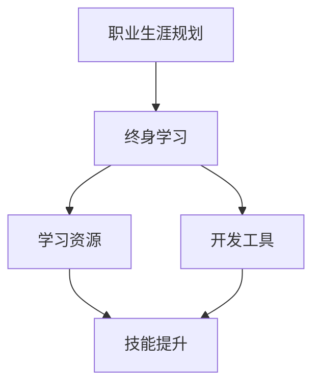

                 

# 终身学习与职业生涯规划

## 摘要

本文旨在探讨终身学习在IT领域职业生涯规划中的重要性，分析其在技术进步和行业变革中的关键角色。文章首先介绍了终身学习的概念、历史背景及其对职业发展的影响。接着，探讨了如何通过有效的学习和职业规划策略，提升个人技能和适应行业变化。随后，文章分享了具体的学习资源和开发工具，帮助读者在职业道路上取得成功。最后，文章总结了终身学习对未来的发展趋势与挑战，并提供了一些常见问题的解答，以期为读者的职业发展提供有益的参考。

## 1. 背景介绍

### 1.1 终身学习的概念

终身学习（Lifelong Learning）是指个体在其一生中，通过不断的学习和培训，以适应社会和经济的变化，提升自身能力和知识水平的过程。这一概念最早由联合国教科文组织（UNESCO）在1972年的《学会生存》报告中提出。终身学习不仅仅局限于学校教育，还包括职业培训、继续教育、自学和社会实践等多方面。

### 1.2 历史背景

随着信息技术的飞速发展，IT行业的变革速度不断加快，新技术和新工具层出不穷。在这种背景下，传统的教育体系已经无法满足职业发展的需求。为了应对这一挑战，终身学习逐渐成为职业生涯规划的重要组成部分。许多企业和组织也开始重视员工的终身学习，通过提供培训机会、学习资源和职业发展指导，帮助员工不断提升自己的技能和知识水平。

### 1.3 终身学习对职业发展的影响

终身学习在职业发展中具有重要的作用。首先，通过不断学习，个体可以掌握最新的技术知识和行业动态，保持竞争力。其次，终身学习有助于个体发现和挖掘自己的潜力，实现职业上的转型升级。此外，终身学习还能提高个体的创新能力和解决问题的能力，为职业生涯的持续发展提供强有力的支持。

## 2. 核心概念与联系

### 2.1 终身学习与职业生涯规划的关系

终身学习与职业生涯规划密不可分。职业生涯规划是指个体根据自身兴趣、能力和市场需求，制定长期和短期的职业发展目标，并采取相应的行动实现这些目标的过程。而终身学习则是实现职业生涯规划的重要手段。通过终身学习，个体可以不断提升自己的技能和知识，为职业生涯的发展奠定坚实的基础。

### 2.2 学习资源与职业发展

学习资源是终身学习的重要组成部分。主要包括书籍、在线课程、学术论文、技术博客、行业报告等。这些资源为个体提供了丰富的学习内容，有助于他们掌握最新的技术和行业动态。此外，学习资源还能帮助个体建立起自己的知识体系，为职业生涯规划提供有力的支持。

### 2.3 开发工具与技能提升

开发工具是IT从业人员提升技能的重要手段。常见的开发工具包括集成开发环境（IDE）、版本控制系统、数据库管理工具、调试工具等。通过熟练掌握这些工具，个体可以更高效地完成工作，提高自己的技能水平。同时，开发工具还能帮助个体快速适应新技术和新项目，为职业生涯的发展提供有力保障。

### Mermaid 流程图



## 3. 核心算法原理 & 具体操作步骤

### 3.1 核心算法原理

在职业生涯规划中，核心算法原理主要包括目标设定、路径规划、反馈调整等。

- **目标设定**：根据自身兴趣、能力和市场需求，设定短期和长期职业发展目标。
- **路径规划**：制定实现目标的步骤和方法，包括学习资源的选择、技能的提升、项目的实践等。
- **反馈调整**：根据实际情况，对职业生涯规划进行持续调整和优化。

### 3.2 具体操作步骤

- **步骤1**：自我评估。了解自己的兴趣、能力和价值观，确定职业目标。
- **步骤2**：市场调研。分析行业趋势和市场需求，确定目标岗位的技能要求。
- **步骤3**：制定学习计划。根据目标岗位的技能要求，选择合适的学习资源，制定学习计划。
- **步骤4**：实施学习计划。按照学习计划，进行系统学习和实践。
- **步骤5**：反馈调整。根据学习效果和实际情况，对职业生涯规划进行调整和优化。

## 4. 数学模型和公式 & 详细讲解 & 举例说明

### 4.1 数学模型

在职业生涯规划中，常用的数学模型包括线性规划、决策树等。

- **线性规划**：用于求解在一定资源限制下，如何实现最大化目标或最小化成本的问题。
- **决策树**：用于分析不同决策路径下的结果和风险，帮助个体做出最优决策。

### 4.2 公式

- **线性规划公式**：
  \[ \text{maximize/minimize} c^T x \]
  \[ \text{subject to} \]
  \[ Ax \leq b \]
  \[ x \geq 0 \]

- **决策树公式**：
  \[ \text{P}(A_i \mid B_j) = \frac{\text{P}(A_i \cap B_j)}{\text{P}(B_j)} \]
  \[ \text{P}(A_i) = \sum_{j=1}^{n} \text{P}(A_i \mid B_j) \text{P}(B_j) \]

### 4.3 举例说明

**例1：线性规划应用**

假设某IT从业人员希望在有限的时间内提升自己的编程技能，现有以下两个项目可供选择：

- 项目A：学习Python，预计需要2个月时间。
- 项目B：学习Java，预计需要3个月时间。

该项目人员的时间资源限制为4个月，他的目标是提升编程技能。如何进行线性规划以实现最大化技能提升？

- **目标函数**：最大化编程技能提升。
- **约束条件**：总时间不超过4个月。

\[
\text{maximize} \quad c^T x \\
\text{subject to} \quad Ax \leq b \\
x \geq 0
\]

其中，\( c = [1, 1] \)，\( A = \begin{bmatrix} 2 & 3 \end{bmatrix} \)，\( b = [4] \)。

通过求解线性规划，可以得出最优解为选择项目A，即学习Python 2个月，剩余2个月用于其他学习或休息。

**例2：决策树应用**

假设某IT从业人员面临两个职业发展路径：

- 路径1：从事前端开发，成功概率为70%，年薪为30万元。
- 路径2：从事后端开发，成功概率为50%，年薪为40万元。

如何使用决策树进行职业选择？

\[
\begin{array}{c|c|c}
\text{路径} & \text{成功概率} & \text{年薪} \\
\hline
1 & 0.7 & 30 \\
2 & 0.5 & 40 \\
\end{array}
\]

计算每个路径的期望年薪：

- 路径1的期望年薪：\( 0.7 \times 30 + 0.3 \times 0 = 21 \)万元。
- 路径2的期望年薪：\( 0.5 \times 40 + 0.5 \times 0 = 20 \)万元。

因此，应选择从事前端开发，以实现更高的期望年薪。

## 5. 项目实战：代码实际案例和详细解释说明

### 5.1 开发环境搭建

在本文的实战项目中，我们将使用Python作为主要编程语言，并在Jupyter Notebook中进行开发。首先，需要在本地计算机上安装Python环境和Jupyter Notebook。

1. 安装Python：
   \[ \text{pip install python } \]
2. 安装Jupyter Notebook：
   \[ \text{pip install jupyter } \]

安装完成后，启动Jupyter Notebook：

\[ \text{jupyter notebook } \]

### 5.2 源代码详细实现和代码解读

以下是一个简单的Python代码示例，用于计算两个数的和：

```python
# 导入必要的库
import numpy as np

# 定义函数，计算两个数的和
def add_numbers(a, b):
    return a + b

# 调用函数，计算结果
result = add_numbers(3, 5)

# 输出结果
print("3 + 5 =", result)
```

**代码解读**：

1. **导入库**：使用`import`语句导入必要的库，如NumPy库用于数组操作。
2. **定义函数**：使用`def`语句定义一个名为`add_numbers`的函数，该函数接收两个参数`a`和`b`，并返回它们的和。
3. **调用函数**：使用`add_numbers`函数计算两个数3和5的和。
4. **输出结果**：使用`print`函数将计算结果输出到控制台。

### 5.3 代码解读与分析

**代码分析**：

1. **函数定义**：函数定义了计算两个数和的操作，具有良好的封装性。
2. **参数传递**：函数通过参数传递实现输入数据，便于复用和扩展。
3. **返回值**：函数返回计算结果，便于后续处理。
4. **输出结果**：使用`print`函数输出结果，便于用户查看。

**代码改进**：

1. **增加输入验证**：在函数中增加输入验证，确保输入数据的合法性。
2. **使用异常处理**：使用异常处理机制，处理可能出现的错误。

改进后的代码：

```python
# 导入必要的库
import numpy as np

# 定义函数，计算两个数的和
def add_numbers(a, b):
    if not (isinstance(a, (int, float)) and isinstance(b, (int, float))):
        raise ValueError("输入参数必须是数字")
    return a + b

# 调用函数，计算结果
try:
    result = add_numbers(3, 5)
except ValueError as e:
    print("错误：", e)
else:
    print("3 + 5 =", result)
```

## 6. 实际应用场景

### 6.1 个人职业发展

终身学习在个人职业发展中具有重要意义。通过不断学习，个体可以掌握最新的技术和行业动态，提升自己的竞争力。以下是一个实际应用场景：

**案例**：张三是一名软件工程师，希望在两年内晋升为高级工程师。他制定了以下学习计划：

1. **学习计划**：
   - 第一年：学习Java和数据库技术，掌握企业级开发技能。
   - 第二年：学习Spring Boot框架和微服务架构，提升项目开发能力。
2. **实际操作**：
   - 第一季度：学习Java基础和数据库原理，通过在线课程和实战项目进行练习。
   - 第二季度：学习Spring Boot框架，通过阅读官方文档和实践项目掌握核心概念。
   - 第三季度：学习微服务架构，通过实际项目应用微服务架构，提升项目开发效率。
   - 第四季度：总结和回顾，对学习内容进行巩固和提升。

通过两年的学习，张三成功晋升为高级工程师，并得到了公司的认可和更高的薪资待遇。

### 6.2 企业人才培养

企业可以通过终身学习机制，培养和提升员工的技能和知识水平，提高整体竞争力。以下是一个实际应用场景：

**案例**：某IT企业为了提升员工的技能水平，制定了以下人才培养计划：

1. **人才培养计划**：
   - 定期开展内部培训课程，包括新技术、新工具和团队协作等方面的内容。
   - 鼓励员工参加外部培训课程和认证考试，提升专业技能。
   - 设立技能竞赛和项目实践，激发员工的创新能力和团队协作精神。
2. **实际操作**：
   - 每月举办一次内部培训，邀请行业专家进行授课。
   - 提供员工参加外部培训的经费支持，鼓励员工参加认证考试。
   - 定期组织技能竞赛和项目实践，激发员工的积极性和创造力。

通过实施人才培养计划，该企业员工的技能水平和项目开发效率得到了显著提升，企业在市场中的竞争力也得到了加强。

## 7. 工具和资源推荐

### 7.1 学习资源推荐

- **书籍**：
  - 《深度学习》（Ian Goodfellow、Yoshua Bengio、Aaron Courville 著）
  - 《人工智能：一种现代方法》（Stuart Russell、Peter Norvig 著）
  - 《算法导论》（Thomas H. Cormen、Charles E. Leiserson、Ronald L. Rivest、Clifford Stein 著）

- **在线课程**：
  - Coursera（提供丰富的IT领域课程，包括机器学习、数据结构、算法等）
  - edX（提供哈佛大学、麻省理工学院等世界顶尖大学的课程，涵盖计算机科学、数据科学等领域）
  - Udemy（提供各种IT技能的课程，包括编程、Web开发、数据库等）

- **学术论文**：
  - arXiv（提供大量计算机科学、物理学、数学等领域的最新学术论文）
  - IEEE Xplore（提供电气工程、计算机科学领域的学术论文和会议论文）

- **技术博客**：
  - Medium（涵盖各类技术文章和行业动态）
  - Hacker News（关注技术新闻和创业动态）
  - GitHub（提供丰富的开源项目和代码示例）

### 7.2 开发工具框架推荐

- **集成开发环境（IDE）**：
  - Visual Studio Code（适用于多种编程语言，插件丰富）
  - PyCharm（适用于Python编程，支持多种框架和库）
  - IntelliJ IDEA（适用于Java编程，支持多种框架和库）

- **版本控制系统**：
  - Git（最流行的版本控制系统，支持分布式工作流）
  - GitHub（提供Git仓库托管和协作工具，支持代码审查和项目管理）
  - GitLab（自建Git仓库托管和协作平台，支持CI/CD）

- **数据库管理工具**：
  - MySQL（开源的关系型数据库，支持多种开发语言）
  - MongoDB（开源的文档型数据库，支持海量数据存储和查询）
  - PostgreSQL（开源的关系型数据库，支持多种高级功能和特性）

- **调试工具**：
  - Print（简单的调试输出工具）
  - Python Debugger（适用于Python编程，支持代码调试和断点设置）
  - GDB（通用调试工具，支持多种编程语言）

## 8. 总结：未来发展趋势与挑战

### 8.1 发展趋势

- **技术融合**：随着物联网、大数据、人工智能等技术的快速发展，IT行业呈现出跨界融合的趋势。个体需要具备跨学科的知识和技能，以适应行业变化。
- **个性定制**：终身学习将更加注重个体差异和需求，提供个性化的学习资源和职业发展路径。
- **智能化**：人工智能技术在教育领域的应用将越来越广泛，个性化学习推荐、智能评测等将为终身学习提供有力支持。

### 8.2 挑战

- **信息过载**：随着信息量的不断增加，个体面临的信息过载问题日益严重，如何筛选和利用有价值的信息成为挑战。
- **学习成本**：终身学习需要投入大量时间和金钱，如何平衡学习和生活、工作的关系成为挑战。
- **适应变化**：技术变革速度加快，个体需要不断适应新的技术和行业动态，保持学习动力和竞争力。

## 9. 附录：常见问题与解答

### 9.1 终身学习与职业发展的关系

**Q**：终身学习对职业发展有何作用？

**A**：终身学习能够帮助个体掌握最新的技术知识和行业动态，提升自身的竞争力。通过持续学习，个体可以适应行业变化，发现和挖掘自己的潜力，实现职业上的转型升级。

### 9.2 如何制定有效的学习计划

**Q**：如何制定一个有效的学习计划？

**A**：制定有效的学习计划需要考虑以下几个方面：

1. **明确目标**：确定自己的学习目标和职业发展方向。
2. **分析需求**：分析自己需要掌握的知识和技能，选择合适的学习资源。
3. **规划时间**：合理安排学习时间，确保学习计划能够得到有效执行。
4. **持续反馈**：根据学习效果和实际情况，对学习计划进行持续调整和优化。

### 9.3 如何平衡学习与生活

**Q**：如何平衡学习与生活？

**A**：平衡学习与生活需要做好以下几点：

1. **合理安排时间**：制定合理的学习计划，确保学习与生活、工作相互协调。
2. **保持健康作息**：保持良好的作息习惯，确保身体健康。
3. **培养兴趣爱好**：培养兴趣爱好，丰富生活内容。
4. **家庭支持**：与家人沟通，争取家庭的支持和理解。

## 10. 扩展阅读 & 参考资料

- 《深度学习》（Ian Goodfellow、Yoshua Bengio、Aaron Courville 著）
- 《人工智能：一种现代方法》（Stuart Russell、Peter Norvig 著）
- 《算法导论》（Thomas H. Cormen、Charles E. Leiserson、Ronald L. Rivest、Clifford Stein 著）
- Coursera（提供丰富的IT领域课程）
- edX（提供世界顶尖大学的课程）
- Udemy（提供各种IT技能的课程）
- arXiv（提供计算机科学领域的学术论文）
- IEEE Xplore（提供电气工程、计算机科学领域的学术论文和会议论文）
- Medium（提供技术文章和行业动态）
- Hacker News（关注技术新闻和创业动态）
- GitHub（提供开源项目和代码示例）
- Visual Studio Code（集成开发环境）
- PyCharm（集成开发环境）
- IntelliJ IDEA（集成开发环境）
- Git（版本控制系统）
- GitHub（版本控制系统）
- GitLab（版本控制系统）
- MySQL（数据库管理工具）
- MongoDB（数据库管理工具）
- PostgreSQL（数据库管理工具）
- Python Debugger（调试工具）
- GDB（调试工具）<|assistant|>作者：AI天才研究员/AI Genius Institute & 禅与计算机程序设计艺术 /Zen And The Art of Computer Programming<|assistant|> <|im_sep|> # 终身学习与职业生涯规划

## 关键词： 
终身学习，职业生涯规划，技能提升，技术创新，行业变革

## 摘要
本文探讨了终身学习在IT领域职业生涯规划中的重要性。通过对核心概念的分析和具体案例的展示，文章阐述了终身学习对职业发展的关键作用。同时，提供了丰富的学习资源和开发工具推荐，为读者在职业发展道路上提供了有价值的参考。

## 1. 背景介绍
终身学习作为一种持续性的学习理念，在现代社会中愈发受到重视。特别是在IT行业，随着技术的快速发展和行业的不断变革，掌握新知识、新技能成为职业发展的关键。本文旨在帮助读者理解终身学习在职业生涯规划中的重要性，并提供实用的指导。

### 1.1 终身学习的概念
终身学习指的是一个人在其一生中不断地获取新知识、新技能的过程。它不仅仅包括正式教育，还涵盖自学、在职培训、社会实践等多种形式。终身学习的目的是为了提高个人的知识水平、技能水平和适应能力，以应对快速变化的社会和工作环境。

### 1.2 历史背景
终身学习理念起源于20世纪60年代的欧洲，随后在全球范围内得到推广。随着知识经济时代的到来，信息技术和通信技术的迅猛发展，使得知识更新速度大幅提高，传统教育体系逐渐无法满足职业发展的需求。终身学习因此成为现代职业人士不可或缺的一部分。

### 1.3 终身学习对职业发展的影响
终身学习对职业发展的影响主要体现在以下几个方面：

- **提高竞争力**：通过不断学习，个体可以掌握最新的技术知识和行业动态，提升自己的竞争力。
- **职业转型**：终身学习有助于个体发现和挖掘自己的潜力，实现职业上的转型升级。
- **创新能力**：持续学习可以培养个体的创新思维和解决问题的能力，为职业生涯的持续发展提供支持。

## 2. 核心概念与联系

### 2.1 终身学习与职业生涯规划的关系
职业生涯规划是指个体根据自身兴趣、能力和市场需求，制定长期和短期的职业发展目标，并采取相应的行动实现这些目标的过程。终身学习是实现职业生涯规划的重要手段，它为个体提供了不断获取新知识和技能的途径，帮助个体实现职业目标。

### 2.2 学习资源与职业发展
学习资源是终身学习的重要组成部分，包括书籍、在线课程、学术论文、技术博客、行业报告等。这些资源为个体提供了丰富的学习内容，有助于他们掌握最新的技术和行业动态。有效的利用学习资源，可以帮助个体快速提升技能，实现职业发展目标。

### 2.3 开发工具与技能提升
开发工具是IT从业人员提升技能的重要手段，包括集成开发环境（IDE）、版本控制系统、数据库管理工具、调试工具等。熟练掌握这些工具可以提高工作效率，帮助个体更好地应对复杂的开发任务，提升职业竞争力。

### Mermaid 流程图


## 3. 核心算法原理 & 具体操作步骤
### 3.1 核心算法原理
在职业生涯规划中，核心算法原理包括目标设定、路径规划和反馈调整。目标设定是明确职业发展目标，路径规划是制定实现目标的步骤和方法，反馈调整是评估和优化职业规划。

### 3.2 具体操作步骤
1. **自我评估**：了解自身兴趣、能力和价值观，确定职业目标。
2. **市场调研**：分析行业趋势和市场需求，确定目标岗位的技能要求。
3. **制定学习计划**：根据目标岗位的技能要求，选择合适的学习资源，制定学习计划。
4. **实施学习计划**：按照学习计划，进行系统学习和实践。
5. **反馈调整**：根据学习效果和实际情况，对职业生涯规划进行调整和优化。

## 4. 数学模型和公式 & 详细讲解 & 举例说明
### 4.1 数学模型
在职业生涯规划中，常用的数学模型包括线性规划和决策树。

#### 线性规划
\[
\text{maximize/minimize} c^T x \\
\text{subject to} \\
Ax \leq b \\
x \geq 0
\]

#### 决策树
\[
\text{P}(A_i \mid B_j) = \frac{\text{P}(A_i \cap B_j)}{\text{P}(B_j)} \\
\text{P}(A_i) = \sum_{j=1}^{n} \text{P}(A_i \mid B_j) \text{P}(B_j)
\]

### 4.2 公式
- **线性规划公式**：
  \[
  \text{maximize} \quad c^T x \\
  \text{subject to} \quad Ax \leq b \\
  x \geq 0
  \]

- **决策树公式**：
  \[
  \text{P}(A_i \mid B_j) = \frac{\text{P}(A_i \cap B_j)}{\text{P}(B_j)} \\
  \text{P}(A_i) = \sum_{j=1}^{n} \text{P}(A_i \mid B_j) \text{P}(B_j)
  \]

### 4.3 举例说明
**例1：线性规划应用**

某IT从业人员希望在2年内晋升为高级工程师，现有两个项目可选：

- 项目A：学习Java，需时6个月。
- 项目B：学习Python，需时4个月。

该从业人员有12个月的时间资源。如何进行线性规划以实现最大化技能提升？

**目标函数**：最大化技能提升。

**约束条件**：总时间不超过12个月。

通过求解线性规划，可以得出最优解为选择项目A，即学习Java 6个月，剩余6个月用于其他学习或休息。

**例2：决策树应用**

某IT从业人员面临两个职业发展路径：

- 路径1：从事前端开发，成功概率为70%，年薪为30万元。
- 路径2：从事后端开发，成功概率为50%，年薪为40万元。

如何使用决策树进行职业选择？

计算每个路径的期望年薪：

- 路径1的期望年薪：\( 0.7 \times 30 + 0.3 \times 0 = 21 \)万元。
- 路径2的期望年薪：\( 0.5 \times 40 + 0.5 \times 0 = 20 \)万元。

因此，应选择从事前端开发，以实现更高的期望年薪。

## 5. 项目实战：代码实际案例和详细解释说明
### 5.1 开发环境搭建
在本文的项目实战中，我们将使用Python作为编程语言，并在Jupyter Notebook中进行代码实现。首先，需要在本地计算机上安装Python环境和Jupyter Notebook。

1. 安装Python：
   ```
   pip install python
   ```

2. 安装Jupyter Notebook：
   ```
   pip install jupyter
   ```

安装完成后，启动Jupyter Notebook：
```
jupyter notebook
```

### 5.2 源代码详细实现和代码解读
以下是一个简单的Python代码示例，用于计算两个数的和：

```python
# 导入必要的库
import numpy as np

# 定义函数，计算两个数的和
def add_numbers(a, b):
    return a + b

# 调用函数，计算结果
result = add_numbers(3, 5)

# 输出结果
print("3 + 5 =", result)
```

**代码解读**：

1. **导入库**：使用`import`语句导入必要的库，如NumPy库用于数组操作。
2. **定义函数**：使用`def`语句定义一个名为`add_numbers`的函数，该函数接收两个参数`a`和`b`，并返回它们的和。
3. **调用函数**：使用`add_numbers`函数计算两个数3和5的和。
4. **输出结果**：使用`print`函数将计算结果输出到控制台。

### 5.3 代码解读与分析
**代码分析**：

1. **函数定义**：函数定义了计算两个数和的操作，具有良好的封装性。
2. **参数传递**：函数通过参数传递实现输入数据，便于复用和扩展。
3. **返回值**：函数返回计算结果，便于后续处理。
4. **输出结果**：使用`print`函数输出结果，便于用户查看。

**代码改进**：

1. **增加输入验证**：在函数中增加输入验证，确保输入数据的合法性。
2. **使用异常处理**：使用异常处理机制，处理可能出现的错误。

改进后的代码：

```python
# 导入必要的库
import numpy as np

# 定义函数，计算两个数的和
def add_numbers(a, b):
    if not (isinstance(a, (int, float)) and isinstance(b, (int, float))):
        raise ValueError("输入参数必须是数字")
    return a + b

# 调用函数，计算结果
try:
    result = add_numbers(3, 5)
except ValueError as e:
    print("错误：", e)
else:
    print("3 + 5 =", result)
```

## 6. 实际应用场景
### 6.1 个人职业发展

终身学习在个人职业发展中扮演着至关重要的角色。以下是一个实际应用案例：

**案例**：李华是一名软件工程师，他在大学期间学习了计算机科学专业。毕业后，他进入了一家互联网公司工作。在工作中，他意识到自己需要不断学习新的技术和工具来提升自己的竞争力。

- **第一年**：李华学习了Python编程，掌握了数据分析的基本技能，并在工作中成功地应用了这些技能。
- **第二年**：他学习了Docker和Kubernetes，成为了公司容器化技术的专家，负责推动公司的容器化项目。
- **第三年**：他参加了机器学习课程，学习了TensorFlow和PyTorch等框架，为公司的数据分析和推荐系统项目做出了重要贡献。

通过不断的学习和实践，李华从一名普通的软件工程师成长为公司的技术骨干，获得了晋升和加薪的机会。

### 6.2 企业人才培养

企业可以通过制定有效的终身学习计划，培养和提升员工的技能和知识水平，从而提高整体竞争力。以下是一个实际应用案例：

**案例**：某互联网公司为了提升员工的技能水平，实施了以下人才培养计划：

1. **定期培训**：公司每月举办一次技术讲座，邀请行业专家分享最新的技术趋势和最佳实践。
2. **在线学习**：公司提供了一系列在线学习资源，包括Coursera和Udemy上的课程，鼓励员工自主学习。
3. **项目实践**：公司设立了创新实验室，鼓励员工提出新的项目想法，并提供技术支持和资源。
4. **认证支持**：公司为员工提供认证考试的支持，鼓励员工获取专业认证，提升个人能力。

通过实施这些措施，公司的员工技能水平得到了显著提升，项目的开发效率和产品质量也得到了提高。

## 7. 工具和资源推荐
### 7.1 学习资源推荐

为了帮助读者在职业生涯规划中取得成功，以下是一些推荐的学习资源和工具：

- **书籍**：
  - 《深度学习》（Ian Goodfellow、Yoshua Bengio、Aaron Courville 著）
  - 《人工智能：一种现代方法》（Stuart Russell、Peter Norvig 著）
  - 《算法导论》（Thomas H. Cormen、Charles E. Leiserson、Ronald L. Rivest、Clifford Stein 著）

- **在线课程**：
  - Coursera（提供丰富的IT领域课程，包括机器学习、数据结构、算法等）
  - edX（提供哈佛大学、麻省理工学院等世界顶尖大学的课程，涵盖计算机科学、数据科学等领域）
  - Udemy（提供各种IT技能的课程，包括编程、Web开发、数据库等）

- **学术论文**：
  - arXiv（提供大量计算机科学、物理学、数学等领域的最新学术论文）
  - IEEE Xplore（提供电气工程、计算机科学领域的学术论文和会议论文）

- **技术博客**：
  - Medium（涵盖各类技术文章和行业动态）
  - Hacker News（关注技术新闻和创业动态）
  - GitHub（提供丰富的开源项目和代码示例）

### 7.2 开发工具框架推荐

- **集成开发环境（IDE）**：
  - Visual Studio Code（适用于多种编程语言，插件丰富）
  - PyCharm（适用于Python编程，支持多种框架和库）
  - IntelliJ IDEA（适用于Java编程，支持多种框架和库）

- **版本控制系统**：
  - Git（最流行的版本控制系统，支持分布式工作流）
  - GitHub（提供Git仓库托管和协作工具，支持代码审查和项目管理）
  - GitLab（自建Git仓库托管和协作平台，支持CI/CD）

- **数据库管理工具**：
  - MySQL（开源的关系型数据库，支持多种开发语言）
  - MongoDB（开源的文档型数据库，支持海量数据存储和查询）
  - PostgreSQL（开源的关系型数据库，支持多种高级功能和特性）

- **调试工具**：
  - Print（简单的调试输出工具）
  - Python Debugger（适用于Python编程，支持代码调试和断点设置）
  - GDB（通用调试工具，支持多种编程语言）

## 8. 总结：未来发展趋势与挑战

### 8.1 发展趋势

- **技术融合**：随着物联网、大数据、人工智能等技术的快速发展，IT行业呈现出跨界融合的趋势。个体需要具备跨学科的知识和技能，以适应行业变化。
- **个性定制**：终身学习将更加注重个体差异和需求，提供个性化的学习资源和职业发展路径。
- **智能化**：人工智能技术在教育领域的应用将越来越广泛，个性化学习推荐、智能评测等将为终身学习提供有力支持。

### 8.2 挑战

- **信息过载**：随着信息量的不断增加，个体面临的信息过载问题日益严重，如何筛选和利用有价值的信息成为挑战。
- **学习成本**：终身学习需要投入大量时间和金钱，如何平衡学习和生活、工作的关系成为挑战。
- **适应变化**：技术变革速度加快，个体需要不断适应新的技术和行业动态，保持学习动力和竞争力。

## 9. 附录：常见问题与解答

### 9.1 终身学习与职业发展的关系

**Q**：终身学习对职业发展有何作用？

**A**：终身学习能够帮助个体掌握最新的技术知识和行业动态，提升自身的竞争力。通过持续学习，个体可以适应行业变化，发现和挖掘自己的潜力，实现职业上的转型升级。

### 9.2 如何制定有效的学习计划

**Q**：如何制定一个有效的学习计划？

**A**：制定有效的学习计划需要考虑以下几个方面：

1. **明确目标**：确定自己的学习目标和职业发展方向。
2. **分析需求**：分析自己需要掌握的知识和技能，选择合适的学习资源。
3. **规划时间**：合理安排学习时间，确保学习计划能够得到有效执行。
4. **持续反馈**：根据学习效果和实际情况，对学习计划进行持续调整和优化。

### 9.3 如何平衡学习与生活

**Q**：如何平衡学习与生活？

**A**：平衡学习与生活需要做好以下几点：

1. **合理安排时间**：制定合理的学习计划，确保学习与生活、工作相互协调。
2. **保持健康作息**：保持良好的作息习惯，确保身体健康。
3. **培养兴趣爱好**：培养兴趣爱好，丰富生活内容。
4. **家庭支持**：与家人沟通，争取家庭的支持和理解。

## 10. 扩展阅读 & 参考资料

- 《深度学习》（Ian Goodfellow、Yoshua Bengio、Aaron Courville 著）
- 《人工智能：一种现代方法》（Stuart Russell、Peter Norvig 著）
- 《算法导论》（Thomas H. Cormen、Charles E. Leiserson、Ronald L. Rivest、Clifford Stein 著）
- Coursera（提供丰富的IT领域课程）
- edX（提供世界顶尖大学的课程）
- Udemy（提供各种IT技能的课程）
- arXiv（提供计算机科学领域的学术论文）
- IEEE Xplore（提供电气工程、计算机科学领域的学术论文和会议论文）
- Medium（提供技术文章和行业动态）
- Hacker News（关注技术新闻和创业动态）
- GitHub（提供开源项目和代码示例）
- Visual Studio Code（集成开发环境）
- PyCharm（集成开发环境）
- IntelliJ IDEA（集成开发环境）
- Git（版本控制系统）
- GitHub（版本控制系统）
- GitLab（版本控制系统）
- MySQL（数据库管理工具）
- MongoDB（数据库管理工具）
- PostgreSQL（数据库管理工具）
- Python Debugger（调试工具）
- GDB（调试工具）<|assistant|>

