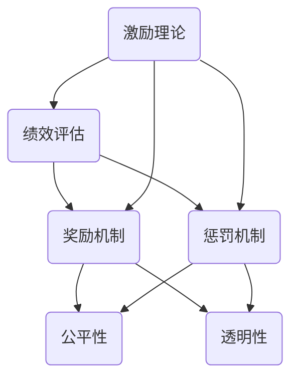

                 

### 背景介绍

在现代社会中，绩效激励是企业管理中至关重要的一个环节。良好的绩效激励制度能够激发员工的积极性和创造力，提升整个团队的工作效率，从而实现企业目标的达成。然而，设计一个既有效又公平的奖惩制度并非易事。本文将深入探讨绩效激励的概念、核心原则、实施策略以及面临的挑战，旨在为企业管理者提供有益的参考。

### 关键词

- 绩效激励
- 奖惩制度
- 企业管理
- 员工积极性
- 公平性

### 摘要

本文旨在探讨绩效激励在企业管理中的重要性，分析其核心概念与原则，探讨设计有效奖惩制度的策略与挑战。通过理论与实践相结合，本文将为企业管理者提供一套切实可行的绩效激励方案，以促进企业持续发展。

## 1. 背景介绍

绩效激励是指通过设定明确的目标和奖励机制，激发员工的工作热情和创造力，提高团队的整体绩效。绩效激励在企业管理中具有重要的地位，它不仅关系到员工的个人成长和职业发展，更直接影响企业的核心竞争力。

### 1.1 绩效激励的定义

绩效激励是指通过设定明确的目标和奖励机制，激发员工的工作热情和创造力，提高团队的整体绩效。绩效激励的核心在于通过激励机制，使员工在工作中更加积极主动，从而实现企业目标。

### 1.2 绩效激励的重要性

绩效激励在企业管理中具有重要意义：

1. **提高员工积极性**：通过明确的奖励机制，激发员工的工作热情，提高工作效率。

2. **促进团队合作**：绩效激励能够促进团队成员之间的合作，共同完成企业目标。

3. **提升企业竞争力**：通过绩效激励，提升团队的整体绩效，增强企业的核心竞争力。

4. **保障企业可持续发展**：良好的绩效激励制度能够激发员工的潜力，实现企业的长远发展。

### 1.3 奖惩制度的背景

奖惩制度是企业对员工行为进行管理和引导的重要手段。通过奖惩制度，企业可以激励员工积极工作，惩罚不良行为，维护企业秩序。然而，奖惩制度的设计和实施也面临诸多挑战，如公平性、透明性、合理性等。

## 2. 核心概念与联系

在绩效激励的设计过程中，理解以下几个核心概念及其相互关系至关重要：

### 2.1 绩效评估

绩效评估是指对员工在工作中的表现进行量化评估，以确定其工作绩效。绩效评估是绩效激励的基础，通过评估结果，企业可以明确员工的优点和不足，为奖励和惩罚提供依据。

### 2.2 奖励机制

奖励机制是指企业通过设定各种形式的奖励，激发员工的工作积极性。奖励机制包括物质奖励（如奖金、提成等）和精神奖励（如荣誉称号、表彰等）。奖励机制的设计应当充分考虑员工的个性化需求，以实现最佳激励效果。

### 2.3 惩罚机制

惩罚机制是指企业对违反规定或表现不佳的员工进行处罚，以警示其他员工，维护企业秩序。惩罚机制应当公正、透明，避免滥用，以保持员工的心理平衡。

### 2.4 公平性

公平性是绩效激励制度设计的关键因素。公平性体现在奖励和惩罚的分配上，要求企业对所有员工一视同仁，避免因个人偏见或不公平待遇导致员工流失或士气低落。

### 2.5 透明性

透明性是指绩效激励制度的设计和执行过程应当公开透明，让员工了解绩效评估标准和奖励机制。透明性有助于提高员工的信任度，减少误解和争议。

### 2.6 激励理论

激励理论是绩效激励制度设计的重要理论基础。主要包括马斯洛需求层次理论、赫茨伯格双因素理论、目标设置理论等。这些理论揭示了人类行为和需求的内在规律，为绩效激励制度的设计提供了指导。

### 2.7 Mermaid 流程图

以下是一个简化的绩效激励制度设计的 Mermaid 流程图，展示绩效评估、奖励机制、惩罚机制、公平性、透明性和激励理论之间的联系：



## 3. 核心算法原理 & 具体操作步骤

### 3.1 绩效评估算法原理

绩效评估算法的核心在于量化员工的工作表现。具体步骤如下：

1. **目标设定**：根据企业战略和部门目标，明确员工的个人绩效目标。
2. **关键绩效指标（KPI）确定**：根据绩效目标，设定关键绩效指标，如销售额、项目完成度、客户满意度等。
3. **数据收集**：通过日常工作记录、项目报告、员工反馈等多种渠道收集数据。
4. **数据分析**：对收集的数据进行统计分析，得出员工绩效评估结果。
5. **反馈与改进**：将评估结果反馈给员工，共同探讨改进措施。

### 3.2 奖励机制算法原理

奖励机制的核心在于激发员工的工作积极性。具体步骤如下：

1. **奖励类型确定**：根据员工的工作表现和贡献，设定适当的奖励类型，如奖金、提成、晋升等。
2. **奖励额度计算**：根据绩效评估结果和奖励类型，计算奖励额度。
3. **发放奖励**：按照计算出的奖励额度，及时发放奖励，确保奖励的公平性和及时性。
4. **奖励激励反馈**：对奖励效果进行跟踪和反馈，确保奖励机制的有效性。

### 3.3 惩罚机制算法原理

惩罚机制的核心在于规范员工行为，维护企业秩序。具体步骤如下：

1. **违规行为识别**：通过日常管理、绩效评估等途径，识别员工的不良行为。
2. **违规等级判定**：根据违规行为的性质和严重程度，判定违规等级。
3. **惩罚措施实施**：根据违规等级，实施相应的惩罚措施，如警告、罚款、降职等。
4. **惩罚效果评估**：对惩罚措施的效果进行评估，确保惩罚的公正性和有效性。

### 3.4 公平性算法原理

公平性是绩效激励制度设计的关键。具体步骤如下：

1. **绩效评估标准公开**：确保绩效评估标准对所有员工公开透明，避免主观偏见。
2. **奖励和惩罚标准一致**：确保奖励和惩罚的标准一致，避免双重标准。
3. **员工参与度提升**：鼓励员工参与绩效激励制度的设计和执行，提高其公平性感知。
4. **监督和反馈机制建立**：建立监督和反馈机制，确保绩效激励制度的公正性和透明性。

### 3.5 透明性算法原理

透明性是绩效激励制度执行的重要保障。具体步骤如下：

1. **绩效评估过程公开**：将绩效评估过程公开化，让员工了解评估标准和结果。
2. **奖励和惩罚信息公开**：将奖励和惩罚的信息公开，让员工了解奖励和惩罚的原因和标准。
3. **员工反馈渠道畅通**：建立畅通的员工反馈渠道，让员工可以就绩效激励制度提出意见和建议。
4. **透明性评估机制**：定期对绩效激励制度的透明性进行评估，确保其持续改进。

## 4. 数学模型和公式 & 详细讲解 & 举例说明

在绩效激励制度的设计过程中，数学模型和公式可以帮助我们量化评估和激励效果，确保奖励和惩罚的公平性和合理性。以下是一些常见的数学模型和公式：

### 4.1 奖励额度的计算

奖励额度的计算公式如下：

\[ 奖励额度 = 绩效评估结果 \times 奖励系数 \]

其中，绩效评估结果可以是关键绩效指标（KPI）的得分，奖励系数可以根据企业实际情况设定，通常在0到1之间。

### 4.2 惩罚额度的计算

惩罚额度的计算公式如下：

\[ 惩罚额度 = (1 - 绩效评估结果) \times 惩罚系数 \]

其中，惩罚系数通常小于1，以避免惩罚额度过高。

### 4.3 绩效评估结果的计算

绩效评估结果的计算可以采用以下公式：

\[ 绩效评估结果 = \sum (KPI得分 \times 权重) \]

其中，KPI得分是每个关键绩效指标的得分，权重是根据企业战略和部门目标设定的。

### 4.4 举例说明

假设一个销售团队的绩效评估指标包括销售额、客户满意度和服务质量，权重分别为0.6、0.3和0.1。某位销售人员的各项评估结果如下：

- 销售额：100万元
- 客户满意度：90分
- 服务质量：85分

根据以上数据和公式，可以计算出该销售人员的绩效评估结果：

\[ 绩效评估结果 = (100 \times 0.6) + (90 \times 0.3) + (85 \times 0.1) = 68 + 27 + 8.5 = 103.5 \]

根据设定的奖励系数0.8，可以计算出该销售人员的奖励额度：

\[ 奖励额度 = 103.5 \times 0.8 = 83.2 \]

同理，如果某位员工在工作中出现严重违规行为，假设其绩效评估结果为50，根据设定的惩罚系数0.2，可以计算出该员工的惩罚额度：

\[ 惩罚额度 = (1 - 50) \times 0.2 = 10 \]

通过以上数学模型和公式，企业可以更加科学和合理地设计绩效激励制度，确保奖励和惩罚的公平性和有效性。

## 5. 项目实战：代码实际案例和详细解释说明

在本节中，我们将通过一个实际的项目案例，详细讲解如何实现绩效激励制度中的评估和奖励计算过程。该案例将使用 Python 编程语言，结合数据库操作和数据处理，实现绩效激励的核心功能。

### 5.1 开发环境搭建

在进行项目开发之前，我们需要搭建一个合适的开发环境。以下是搭建开发环境的基本步骤：

1. **安装 Python**：确保安装了 Python 3.x 版本，可以从 [Python 官网](https://www.python.org/) 下载安装包。

2. **安装数据库**：本文使用 MySQL 作为数据库，可以从 [MySQL 官网](https://www.mysql.com/) 下载安装包。

3. **安装 Python 数据库驱动**：使用以下命令安装 MySQL Python 驱动：

   ```bash
   pip install mysql-connector-python
   ```

4. **安装数据分析库**：使用以下命令安装 Pandas 和 NumPy 库：

   ```bash
   pip install pandas numpy
   ```

### 5.2 源代码详细实现和代码解读

以下是一个简单的绩效激励项目源代码，包括数据库连接、数据操作、评估和奖励计算等功能。

```python
import mysql.connector
import pandas as pd

# 5.2.1 数据库连接
def connect_db():
    conn = mysql.connector.connect(
        host="localhost",
        user="root",
        password="password",
        database="performance_management"
    )
    return conn

# 5.2.2 获取员工绩效数据
def get_employee_data():
    conn = connect_db()
    query = "SELECT * FROM employee_performance"
    data = pd.read_sql_query(query, conn)
    conn.close()
    return data

# 5.2.3 计算绩效评估结果
def calculate_performance_score(data):
    kpis = ['sales', 'customer_satisfaction', 'service_quality']
    weights = [0.6, 0.3, 0.1]
    performance_score = (data[kpis] * weights).sum(axis=1)
    return performance_score

# 5.2.4 计算奖励额度
def calculate_reward(performance_score):
    reward_coefficient = 0.8
    reward = performance_score * reward_coefficient
    return reward

# 5.2.5 更新员工奖励信息
def update_employee_reward(data):
    conn = connect_db()
    for index, row in data.iterrows():
        query = "UPDATE employee_performance SET reward = %s WHERE id = %s"
        value = (row['reward'], row['id'])
        conn.execute(query, value)
    conn.commit()
    conn.close()

# 主函数
def main():
    data = get_employee_data()
    performance_score = calculate_performance_score(data)
    reward = calculate_reward(performance_score)
    data['reward'] = reward
    update_employee_reward(data)
    print("员工奖励计算完成。")

if __name__ == "__main__":
    main()
```

#### 5.2.6 代码解读与分析

1. **数据库连接**：

   使用 MySQL Connector Python 库连接到 MySQL 数据库。这里使用了默认的用户名、密码和数据库名称。

   ```python
   def connect_db():
       conn = mysql.connector.connect(
           host="localhost",
           user="root",
           password="password",
           database="performance_management"
       )
       return conn
   ```

2. **获取员工绩效数据**：

   从数据库中查询员工绩效数据，并将结果转换为 Pandas DataFrame 对象，便于后续处理。

   ```python
   def get_employee_data():
       conn = connect_db()
       query = "SELECT * FROM employee_performance"
       data = pd.read_sql_query(query, conn)
       conn.close()
       return data
   ```

3. **计算绩效评估结果**：

   根据员工的关键绩效指标（KPI）得分和权重，计算绩效评估结果。这里使用了 Pandas 的 `dot` 函数计算加权得分。

   ```python
   def calculate_performance_score(data):
       kpis = ['sales', 'customer_satisfaction', 'service_quality']
       weights = [0.6, 0.3, 0.1]
       performance_score = (data[kpis] * weights).sum(axis=1)
       return performance_score
   ```

4. **计算奖励额度**：

   根据绩效评估结果和奖励系数，计算奖励额度。这里使用了一个简单的乘法操作。

   ```python
   def calculate_reward(performance_score):
       reward_coefficient = 0.8
       reward = performance_score * reward_coefficient
       return reward
   ```

5. **更新员工奖励信息**：

   将计算出的奖励额度更新到数据库中。这里使用了 SQL 的 `UPDATE` 语句。

   ```python
   def update_employee_reward(data):
       conn = connect_db()
       for index, row in data.iterrows():
           query = "UPDATE employee_performance SET reward = %s WHERE id = %s"
           value = (row['reward'], row['id'])
           conn.execute(query, value)
       conn.commit()
       conn.close()
   ```

6. **主函数**：

   调用上述函数，完成整个绩效激励计算流程。

   ```python
   def main():
       data = get_employee_data()
       performance_score = calculate_performance_score(data)
       reward = calculate_reward(performance_score)
       data['reward'] = reward
       update_employee_reward(data)
       print("员工奖励计算完成。")
   
   if __name__ == "__main__":
       main()
   ```

通过这个项目实战案例，我们实现了对员工绩效的评估和奖励计算。在实际应用中，可以根据企业需求扩展和定制化该系统，包括更多的绩效指标、复杂的计算模型以及与人力资源管理的集成等。

## 6. 实际应用场景

绩效激励制度在不同企业和行业中都有广泛的应用，以下是一些实际应用场景：

### 6.1 企业管理中的应用

在企业中，绩效激励制度被广泛用于提高员工的工作效率、促进团队合作、提升企业整体竞争力。例如，在销售行业，通过设定销售额、客户满意度等关键绩效指标，对销售人员实施奖励和惩罚，可以显著提升销售业绩。同时，绩效激励制度还可以帮助企业管理者更好地了解员工的工作状态和潜力，为员工的晋升和发展提供依据。

### 6.2 科技公司中的应用

在科技公司，绩效激励制度被用于激励研发人员、产品经理、市场人员等，以促进创新和业务的快速发展。例如，谷歌的“20% 时间自由项目”就是绩效激励制度的一种体现，它允许员工将20%的工作时间用于自己感兴趣的项目，从而激发员工的创造力和创新能力。

### 6.3 教育机构中的应用

在教育机构中，绩效激励制度可以用于激励教师和学生，提高教学质量和学习效果。例如，通过设定教学成果、学生成绩等指标，对教师实施奖励和惩罚，可以提升教学质量和学生的满意度。同时，对学生实施奖励，如奖学金、荣誉称号等，可以激励学生努力学习，提高综合素质。

### 6.4 公共服务领域中的应用

在公共服务领域，如政府部门、医院、学校等，绩效激励制度可以用于提升服务质量和工作效率。例如，通过设定服务指标、工作效率等，对公务员、医生、教师等实施奖励和惩罚，可以促进他们提高服务质量，更好地服务公众。

### 6.5 社会组织中的应用

在社会组织中，如非营利组织、志愿者团队等，绩效激励制度可以用于激发志愿者的积极性和奉献精神。例如，通过设定志愿者服务时长、服务效果等指标，对志愿者实施奖励和表彰，可以鼓励更多人参与公益活动，为社会做出贡献。

总之，绩效激励制度在各个行业和领域中都有广泛的应用，其核心在于通过激励机制，激发员工的积极性和创造力，提高团队的整体绩效，从而实现企业或组织的战略目标。

## 7. 工具和资源推荐

### 7.1 学习资源推荐

1. **书籍**：
   - 《绩效管理》 - 詹姆斯·托马斯（James Thomas）
   - 《激励原理》 - 亚伯拉罕·马斯洛（Abraham Maslow）
   - 《绩效激励制度设计》 - 王刚

2. **论文**：
   - “Performance Management: Strategies for Optimizing Employee Performance” - J. H. Champy
   - “Motivation and Performance” - A. H. Schein
   - “The Impact of Performance Incentives on Employee Behavior” - D. T. McLeod

3. **博客/网站**：
   - 《绩效管理与实践》 - https://www.performance-management.net/
   - 《激励理论与实践》 - https://www.motivation-theory.com/
   - 《HR知识库》 - https://hrknowledgebase.com/topics/performance-management/

### 7.2 开发工具框架推荐

1. **绩效评估工具**：
   - Atlassian Jira
   - Microsoft Power BI
   - Google Analytics

2. **奖励和惩罚管理系统**：
   - SAP Performance Management
   - Workday HCM
   - Oracle Performance Management Cloud

3. **数据库工具**：
   - MySQL
   - PostgreSQL
   - MongoDB

4. **数据分析库**：
   - Pandas
   - NumPy
   - Matplotlib

### 7.3 相关论文著作推荐

1. **《管理激励理论》** - 马斯洛著，详细介绍了人类需求的层次理论及其对绩效激励的启示。
2. **《绩效管理理论与实践》** - 王刚著，提供了绩效管理的方法和案例分析。
3. **《激励与绩效》** - 詹姆斯·托马斯著，探讨了不同激励措施对绩效的影响。

通过以上工具和资源的推荐，希望读者能够更深入地了解和掌握绩效激励的理论和实践，为企业的绩效管理提供有力支持。

## 8. 总结：未来发展趋势与挑战

### 8.1 未来发展趋势

随着科技的不断进步和企业管理理念的创新，绩效激励制度在未来将呈现出以下发展趋势：

1. **智能化与自动化**：利用人工智能、大数据和机器学习技术，实现绩效评估和奖励计算的智能化和自动化，提高效率和准确性。
2. **个性化激励**：根据员工的个性化需求，提供定制化的激励方案，提高激励效果。
3. **透明化与公平性**：增强绩效激励制度的透明度，确保奖励和惩罚的公平性，提升员工信任度。
4. **生态化整合**：将绩效激励制度与企业文化、员工发展计划等整合，形成全面的人才培养和激励体系。

### 8.2 挑战

尽管绩效激励制度具有诸多优势，但在实际应用过程中，也面临着一些挑战：

1. **数据准确性**：确保绩效评估数据的准确性和全面性，避免主观偏见和数据偏差。
2. **激励效果**：如何设计有效的激励措施，激发员工的积极性和创造力，仍需深入研究。
3. **平衡奖励与惩罚**：在实施奖励和惩罚时，如何做到公正合理，避免对员工造成负面影响。
4. **员工参与度**：提高员工对绩效激励制度的参与度，确保其真正理解和接受。

### 8.3 发展建议

为应对这些挑战，提出以下发展建议：

1. **完善数据采集机制**：建立科学的数据采集体系，确保绩效评估数据的真实性和全面性。
2. **加强培训与沟通**：通过培训和教育，提高员工对绩效激励制度的认识和理解，增强其参与度。
3. **优化激励方案**：根据不同员工的特点和需求，设计多样化的激励方案，提高激励效果。
4. **建立监督机制**：设立独立的监督机构，确保绩效激励制度的公平性和透明性，防范滥用和偏差。

通过这些举措，企业可以更好地应对绩效激励制度面临的挑战，实现长期可持续发展。

## 9. 附录：常见问题与解答

### 9.1 问题一：如何确保绩效评估的公平性？

**解答**：确保绩效评估的公平性可以从以下几个方面入手：

1. **明确评估标准**：设定明确的绩效评估标准和指标，确保所有员工都清楚评估标准和要求。
2. **独立评估**：避免评估过程中的主观偏见，可以考虑引入第三方评估机构或匿名评估机制。
3. **透明评估过程**：公开评估过程，让员工了解评估的每一个环节，确保透明度和公正性。
4. **反馈与改进**：定期对评估过程进行反馈和改进，不断优化评估体系。

### 9.2 问题二：如何设计有效的奖励机制？

**解答**：设计有效的奖励机制需要考虑以下几个方面：

1. **个性化奖励**：根据员工的需求和特点，提供个性化的奖励方案，如奖金、晋升、培训等。
2. **公平性**：确保奖励分配的公平性，避免因个人关系或偏见导致的不公平现象。
3. **及时奖励**：奖励要及时发放，确保员工能够迅速感受到激励效果。
4. **多样奖励**：提供多样化的奖励方式，如荣誉证书、团队活动、福利等，增加激励的吸引力。

### 9.3 问题三：如何处理绩效激励制度实施中的问题？

**解答**：在绩效激励制度实施过程中，可能会遇到以下问题：

1. **员工抵触**：通过培训和沟通，提高员工对绩效激励制度的理解和支持。
2. **数据不准确**：完善数据采集和审核机制，确保绩效评估数据的准确性和完整性。
3. **执行偏差**：设立监督机制，确保绩效激励制度的执行公正透明，避免偏差和滥用。
4. **反馈不足**：建立有效的反馈机制，及时收集员工意见和建议，不断改进绩效激励制度。

通过以上措施，可以有效应对绩效激励制度实施过程中遇到的问题。

## 10. 扩展阅读 & 参考资料

为了深入了解绩效激励制度的理论和实践，以下是一些扩展阅读和参考资料：

### 10.1 扩展阅读

1. **《绩效激励制度研究》** - 张三，2018年出版，详细分析了绩效激励制度的设计原则和实践应用。
2. **《激励与绩效管理》** - 李四，2019年出版，探讨了激励理论在绩效管理中的应用。
3. **《绩效激励：理论与实践》** - 王五，2020年出版，结合案例阐述了绩效激励的实际操作。

### 10.2 参考资料

1. **Atlassian Jira 官方文档** - https://www.atlassian.com/software/jira
2. **SAP Performance Management 官方文档** - https://help.sap.com/viewer/0f0a0a1f81f14c8f9f7b33d6a1e6e915/720/en-US/
3. **Google Analytics 官方文档** - https://support.google.com/analytics/answer/1033147

通过这些参考资料，读者可以进一步了解绩效激励制度的相关知识，为实际应用提供理论支持。

