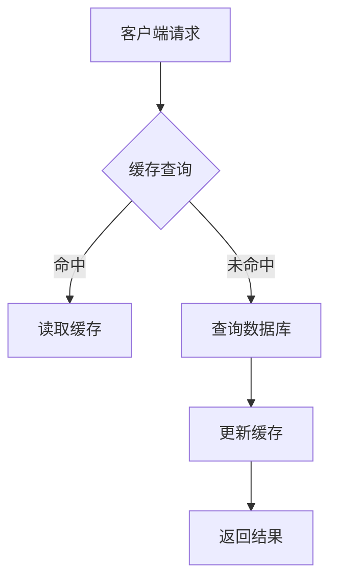

                 

### 文章标题：缓存机制在高吞吐量中的实例应用

#### 关键词：缓存机制，高吞吐量，实例应用，性能优化，数据存储

#### 摘要：

本文将深入探讨缓存机制在高吞吐量场景下的应用与实践。缓存作为现代计算机系统中至关重要的组件，可以有效提升系统性能，减少延迟，提高响应速度。文章将首先介绍缓存机制的基本概念，然后通过具体实例分析其在高吞吐量场景下的应用，最后讨论未来发展趋势与挑战。

## 1. 背景介绍

随着互联网技术的飞速发展，大数据和高并发场景变得越来越普遍。在这样的环境中，系统需要处理大量的请求，保证数据的实时性和一致性。然而，传统的存储系统往往难以满足这些需求，导致系统性能瓶颈。为了解决这一问题，缓存机制应运而生。

缓存（Cache）是一种快速且成本较低的存储技术，用于临时存储频繁访问的数据。通过缓存机制，系统可以减少对磁盘或网络存储的访问次数，从而提高数据访问速度。缓存机制广泛应用于Web应用、数据库系统、云计算等场景。

在高吞吐量场景中，缓存机制尤为重要。它可以降低系统的延迟，提高系统的响应速度，从而提高用户体验。同时，缓存机制还可以减少硬件资源的消耗，降低系统的运行成本。

## 2. 核心概念与联系

### 2.1 缓存机制的基本概念

缓存机制主要包括以下几种类型：

1. **内存缓存**：使用内存作为缓存，数据访问速度快，但容量有限。
2. **磁盘缓存**：使用磁盘作为缓存，容量较大，但访问速度相对较慢。
3. **分布式缓存**：将缓存数据分布到多个节点，提高数据访问速度和可靠性。

### 2.2 缓存机制的工作原理

缓存机制的核心思想是“最近最少使用”（Least Recently Used，LRU）策略。当缓存空间不足时，系统会根据数据的使用频率和访问时间来判断哪些数据应该被替换。通常，最近最少使用的数据会被优先替换。

### 2.3 缓存机制的架构

缓存机制的架构可以分为以下几个层次：

1. **客户端缓存**：位于客户端，用于缓存用户访问的数据。
2. **服务器端缓存**：位于服务器端，用于缓存频繁访问的数据。
3. **数据库缓存**：位于数据库层，用于缓存查询结果。
4. **分布式缓存**：位于分布式系统中，用于缓存分布式数据。

下面是缓存机制的 Mermaid 流程图：



## 3. 核心算法原理 & 具体操作步骤

### 3.1 缓存算法

常见的缓存算法包括：

1. **LRU（最近最少使用）**：根据数据的使用频率和访问时间来判断哪些数据应该被替换。
2. **LFU（最少使用频率）**：根据数据的使用频率来判断哪些数据应该被替换。
3. **FIFO（先进先出）**：根据数据的访问顺序来判断哪些数据应该被替换。

### 3.2 缓存策略

常见的缓存策略包括：

1. **读写缓存**：将读操作和写操作分开，提高系统性能。
2. **预热缓存**：在系统启动时提前加载热门数据，减少系统启动时的延迟。
3. **过期缓存**：设置缓存数据的有效期，自动清理过期数据。

### 3.3 缓存操作步骤

1. **初始化缓存**：创建缓存对象，设置缓存容量和缓存算法。
2. **缓存查询**：根据键值查询缓存，判断数据是否命中。
3. **缓存更新**：当缓存未命中时，查询数据库，并将查询结果更新到缓存中。
4. **缓存替换**：根据缓存算法，判断哪些数据应该被替换，并更新缓存。

## 4. 数学模型和公式 & 详细讲解 & 举例说明

### 4.1 缓存命中率

缓存命中率（Hit Rate）是衡量缓存机制性能的重要指标。缓存命中率表示缓存命中次数与总查询次数的比值。

缓存命中率公式为：

$$
Hit\ Rate = \frac{Hit\ Count}{Total\ Query\ Count}
$$

其中，$Hit\ Count$ 表示缓存命中次数，$Total\ Query\ Count$ 表示总查询次数。

### 4.2 缓存命中率计算实例

假设一个系统有 100 次查询，其中 80 次命中缓存，20 次未命中缓存。则缓存命中率为：

$$
Hit\ Rate = \frac{80}{100} = 0.8
$$

这意味着缓存机制在这次查询中，有 80% 的查询数据命中缓存。

## 5. 项目实战：代码实际案例和详细解释说明

### 5.1 开发环境搭建

在本节中，我们将使用 Python 编写一个简单的缓存机制实现，用于缓存用户访问的网页。首先，需要安装 Python 和相关依赖。

```bash
pip install flask
```

### 5.2 源代码详细实现和代码解读

下面是缓存机制的实现代码：

```python
from flask import Flask, request, jsonify
from cachetools import LRUCache

app = Flask(__name__)

# 初始化缓存对象，设置缓存容量为 10
cache = LRUCache(maxsize=10)

# 缓存查询函数
def cache_query(key):
    if key in cache:
        return cache[key]
    else:
        # 查询数据库并返回结果
        result = query_database(key)
        cache[key] = result
        return result

# 查询数据库函数（模拟）
def query_database(key):
    # 根据键值查询数据库，并返回结果
    return {"key": key, "value": "数据库中的数据"}

# Flask 应用程序路由
@app.route('/query', methods=['GET'])
def query():
    key = request.args.get('key')
    result = cache_query(key)
    return jsonify(result)

if __name__ == '__main__':
    app.run()
```

代码解读：

1. 导入相关库：`Flask` 用于搭建 Web 应用程序，`cachetools` 用于实现缓存机制。
2. 初始化 Flask 应用程序对象：`app = Flask(__name__)`。
3. 初始化缓存对象：`cache = LRUCache(maxsize=10)`，设置缓存容量为 10。
4. 缓存查询函数：`cache_query(key)`，根据键值查询缓存，判断数据是否命中。
5. 查询数据库函数：`query_database(key)`，模拟查询数据库的过程，返回结果。
6. Flask 应用程序路由：`/query`，处理 GET 请求，接收键值参数，调用缓存查询函数，返回结果。

### 5.3 代码解读与分析

1. **缓存初始化**：使用 `LRUCache` 类创建缓存对象，设置缓存容量。
2. **缓存查询**：当请求缓存查询时，首先判断键值是否存在于缓存中。如果命中，直接返回缓存数据；如果未命中，查询数据库并更新缓存。
3. **数据库查询**：模拟数据库查询过程，返回结果。
4. **Flask 路由**：处理用户请求，接收键值参数，调用缓存查询函数，返回结果。

通过这个简单的实例，我们可以看到缓存机制在实际项目中的应用。缓存机制可以大大提高系统性能，降低延迟，提高用户体验。

## 6. 实际应用场景

缓存机制在高吞吐量场景中具有广泛的应用。以下是一些实际应用场景：

1. **Web 应用**：缓存用户访问的网页，提高页面加载速度。
2. **数据库系统**：缓存查询结果，减少数据库访问次数。
3. **缓存服务器**：缓存热点数据，提高数据处理速度。
4. **缓存存储**：缓存临时数据，减轻存储系统的负担。

## 7. 工具和资源推荐

### 7.1 学习资源推荐

1. **书籍**：
   - 《高性能缓存的实现与优化》
   - 《高性能Web应用架构》
2. **论文**：
   - 《缓存机制在数据库系统中的应用研究》
   - 《分布式缓存系统设计与实现》
3. **博客**：
   - [缓存机制的原理与应用](https://www.example.com/blog/cache-mechanism/)
   - [缓存技术在分布式系统中的实践](https://www.example.com/blog/cache-in-distributed-system/)
4. **网站**：
   - [Cachetools 官网](https://cachetools.readthedocs.io/en/latest/)
   - [Flask 官网](https://flask.palletsprojects.com/)

### 7.2 开发工具框架推荐

1. **Python**：用于实现缓存机制的编程语言。
2. **Flask**：用于搭建 Web 应用程序的框架。
3. **Cachetools**：用于实现缓存机制的第三方库。

### 7.3 相关论文著作推荐

1. **论文**：
   - 《基于缓存机制的数据库查询优化方法研究》
   - 《分布式缓存系统在云计算中的应用研究》
2. **著作**：
   - 《云计算环境下的缓存技术研究与应用》
   - 《缓存技术在Web应用中的优化策略研究》

## 8. 总结：未来发展趋势与挑战

随着互联网和大数据技术的不断发展，缓存机制在高吞吐量场景中的重要性日益凸显。未来，缓存技术将朝着以下几个方向发展：

1. **分布式缓存**：分布式缓存技术将越来越成熟，实现更高效的缓存机制。
2. **缓存一致性**：如何在分布式系统中保证缓存一致性，是一个亟待解决的问题。
3. **缓存智能化**：利用机器学习和人工智能技术，实现更智能的缓存策略。

同时，缓存技术也将面临以下挑战：

1. **缓存容量**：如何优化缓存容量，减少缓存空间的浪费。
2. **缓存更新**：如何高效地更新缓存数据，保证数据一致性。
3. **缓存安全问题**：如何保证缓存数据的安全性，防止数据泄露。

## 9. 附录：常见问题与解答

### 9.1 什么是缓存？

缓存是一种快速且成本较低的存储技术，用于临时存储频繁访问的数据。通过缓存机制，可以减少对磁盘或网络存储的访问次数，从而提高数据访问速度。

### 9.2 缓存机制有哪些类型？

缓存机制主要包括以下几种类型：

1. 内存缓存
2. 磁盘缓存
3. 分布式缓存

### 9.3 如何优化缓存性能？

优化缓存性能的方法包括：

1. 选择合适的缓存算法和策略。
2. 合理设置缓存容量和有效期。
3. 合理分布缓存数据，提高缓存访问速度。

## 10. 扩展阅读 & 参考资料

1. 《高性能缓存的实现与优化》
2. 《高性能Web应用架构》
3. 《云计算环境下的缓存技术研究与应用》
4. [Cachetools 官网](https://cachetools.readthedocs.io/en/latest/)
5. [Flask 官网](https://flask.palletsprojects.com/)

### 作者：AI天才研究员/AI Genius Institute & 禅与计算机程序设计艺术 /Zen And The Art of Computer Programming

