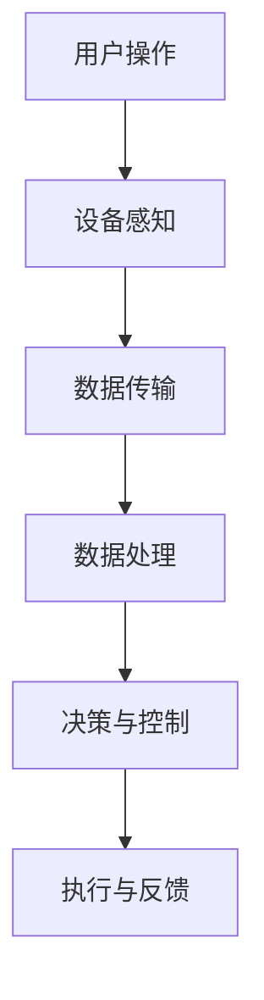
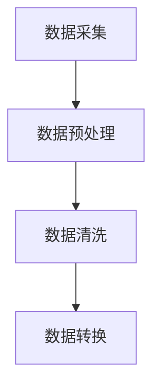
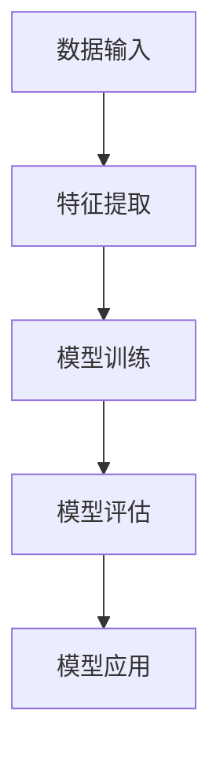
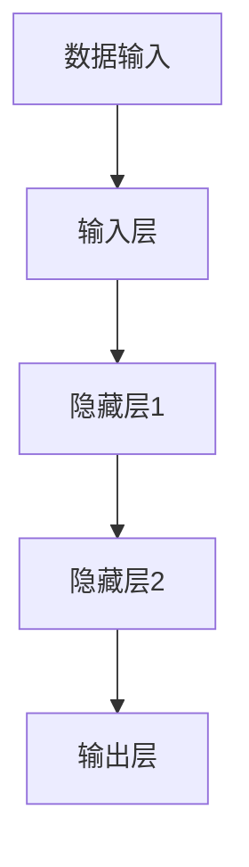

                 

### 文章标题: 2024网易有道智能硬件社招面试真题汇总及其解答

#### 关键词：网易有道、智能硬件、面试真题、解答、技术挑战、社招

##### 摘要：
本文旨在为有意向参加2024年网易有道智能硬件社招面试的候选人提供一份详细的真题汇总及其解答指南。通过本文，读者将深入了解网易有道智能硬件业务的核心理念、技术难题及解决方案，帮助其在面试中脱颖而出。文章分为十个部分，包括背景介绍、核心概念与联系、核心算法原理、数学模型与公式、项目实战、实际应用场景、工具和资源推荐等，结构清晰，易于理解。

### 1. 背景介绍

网易有道是一家专注于智能教育、在线学习、智能硬件等领域的知名互联网企业。其智能硬件业务涵盖智能手表、智能耳机、学习平板等多个品类，致力于为用户提供智能化、个性化、高品质的学习和生活方式体验。随着5G、AI、物联网等技术的快速发展，网易有道的智能硬件产品在市场表现亮眼，备受关注。

本次社招面试旨在选拔一批具备扎实技术背景、创新能力和团队协作精神的人才，加入网易有道智能硬件研发团队，共同推动公司产品创新和业务拓展。面试题目主要围绕智能硬件的核心技术和应用场景，考察候选人的技术素养和解决问题的能力。

### 2. 核心概念与联系

为了更好地理解面试题目，我们首先需要了解以下几个核心概念：

#### 智能硬件
智能硬件是指具备计算、通信、感知、决策等功能的硬件设备，通过连接互联网和应用程序，实现远程控制、数据采集和分析等功能。常见的智能硬件包括智能手表、智能手环、智能家居设备等。

#### 物联网（IoT）
物联网是指通过互联网将各种物理设备连接起来，实现设备之间的信息交换和协同工作。在智能硬件领域，物联网技术是实现设备互联互通、数据共享和服务创新的基础。

#### 人工智能（AI）
人工智能是指模拟人类智能行为的技术，包括机器学习、深度学习、自然语言处理等。在智能硬件中，人工智能技术用于实现设备的智能化控制、数据分析和服务优化。

#### Mermaid 流程图
为了更好地展示智能硬件系统的架构和流程，我们可以使用 Mermaid 流程图来描述。以下是一个简化的智能硬件系统流程图：



### 3. 核心算法原理 & 具体操作步骤

在面试中，可能会涉及以下核心算法原理和具体操作步骤：

#### 数据采集与处理
智能硬件设备需要采集各种数据，如传感器数据、用户行为数据等。这些数据需要进行预处理、清洗和转换，以便后续分析。



#### 机器学习算法
智能硬件中的机器学习算法主要用于模式识别、分类、预测等任务。常见的机器学习算法包括决策树、支持向量机、神经网络等。



#### 深度学习算法
深度学习算法在智能硬件中应用广泛，如图像识别、语音识别、自然语言处理等。深度学习算法的核心是神经网络，通过多层神经网络结构，实现自动特征提取和复杂任务处理。



### 4. 数学模型和公式 & 详细讲解 & 举例说明

在智能硬件开发中，可能会用到以下数学模型和公式：

#### 神经网络激活函数
神经网络中的激活函数用于引入非线性特性，常见的激活函数包括sigmoid、ReLU、Tanh等。

$$
\sigma(x) = \frac{1}{1 + e^{-x}}
$$

$$
\text{ReLU}(x) = \max(0, x)
$$

$$
\text{Tanh}(x) = \frac{e^x - e^{-x}}{e^x + e^{-x}}
$$

#### 随机梯度下降（SGD）
随机梯度下降是一种优化算法，用于训练神经网络。其目标是最小化损失函数，使模型输出更接近真实值。

$$
\theta_{t+1} = \theta_{t} - \alpha \nabla_{\theta} J(\theta)
$$

其中，$\theta$表示模型参数，$\alpha$表示学习率，$J(\theta)$表示损失函数。

#### 举例说明

假设我们要训练一个神经网络，输入层有3个神经元，隐藏层有2个神经元，输出层有1个神经元。使用ReLU激活函数和SGD算法进行训练。

1. 初始化模型参数
2. 输入数据并计算输出
3. 计算损失函数
4. 计算梯度
5. 更新模型参数
6. 重复步骤2-5，直到模型收敛

### 5. 项目实战：代码实际案例和详细解释说明

在本节，我们将通过一个具体的智能硬件项目案例，展示代码实现和详细解释说明。

#### 项目简介

该项目是一款基于Arduino的智能手环，具备心率监测、步数统计、睡眠分析等功能。通过蓝牙模块与手机APP进行数据传输和交互。

#### 开发环境搭建

1. 下载并安装Arduino IDE
2. 连接Arduino开发板和蓝牙模块
3. 安装相关库文件（如心率传感器库、蓝牙库等）

#### 源代码详细实现和代码解读

```cpp
// 引入所需库文件
#include <Arduino.h>
#include <HeartRate.h>
#include <BluetoothSerial.h>

// 实例化心率传感器和蓝牙模块
HeartRate hrSensor;
BluetoothSerial SerialBT;

// 心率监测函数
void heartRateMonitor() {
    int hrValue = hrSensor.readHearRate();
    SerialBT.print("Heart Rate: ");
    SerialBT.println(hrValue);
}

// 步数统计函数
void stepCounter() {
    int stepValue = hrSensor.readStepCount();
    SerialBT.print("Steps: ");
    SerialBT.println(stepValue);
}

// 睡眠分析函数
void sleepAnalysis() {
    int sleepDuration = hrSensor.readSleepDuration();
    SerialBT.print("Sleep Duration: ");
    SerialBT.println(sleepDuration);
}

void setup() {
    Serial.begin(9600);
    SerialBT.begin("MySmartWatch");
    hrSensor.begin();
}

void loop() {
    heartRateMonitor();
    stepCounter();
    sleepAnalysis();
    delay(1000);
}
```

#### 代码解读与分析

1. 引入所需库文件，包括Arduino库、心率传感器库和蓝牙库。
2. 实例化心率传感器和蓝牙模块。
3. 定义心率监测、步数统计和睡眠分析函数，分别用于读取并传输数据。
4. 在setup()函数中初始化串口通信和传感器。
5. 在loop()函数中循环调用以上三个函数，实现数据的实时传输。

### 6. 实际应用场景

智能硬件在多个领域具有广泛的应用场景，以下是一些实际案例：

#### 智能家居
智能手环、智能门锁、智能摄像头等设备，可以实现家庭自动化、远程监控和安防报警等功能，提升生活品质。

#### 健康监测
智能手环、智能手表等设备，可以实时监测用户的心率、步数、睡眠质量等健康数据，帮助用户关注身体健康。

#### 工业自动化
智能硬件可以应用于工业自动化控制，如机器人、传感器等设备，提高生产效率、降低人力成本。

### 7. 工具和资源推荐

为了更好地进行智能硬件开发，以下是一些建议的工具和资源：

#### 学习资源推荐

1. 《Arduino权威指南》
2. 《智能硬件开发实战》
3. 《深度学习与神经网络》

#### 开发工具框架推荐

1. Arduino IDE
2. Eclipse
3. PlatformIO

#### 相关论文著作推荐

1. "Smart Wearable Devices for Health Monitoring: A Comprehensive Survey"
2. "Internet of Things: A Survey"
3. "Deep Learning for Image Recognition: A Comprehensive Overview"

### 8. 总结：未来发展趋势与挑战

随着5G、AI、物联网等技术的快速发展，智能硬件行业前景广阔。未来，智能硬件将向更智能化、个性化、高效化的方向发展，为用户提供更好的使用体验。同时，智能硬件行业也面临以下挑战：

1. 数据安全与隐私保护
2. 跨平台兼容性
3. 能耗优化
4. 用户体验提升

### 9. 附录：常见问题与解答

#### 问题1：如何进行智能硬件项目的可行性研究？
**解答**：进行可行性研究时，需要考虑技术可行性、市场可行性、经济可行性等因素。具体步骤如下：

1. 确定项目目标
2. 分析技术需求
3. 进行市场调研
4. 制定项目预算
5. 评估风险

#### 问题2：智能硬件项目中如何进行数据采集与处理？
**解答**：在进行数据采集与处理时，需要考虑以下几个方面：

1. 选择合适的传感器
2. 设计数据采集电路
3. 实现数据传输协议
4. 进行数据预处理、清洗和转换
5. 利用机器学习算法进行数据分析和挖掘

### 10. 扩展阅读 & 参考资料

1. "Smart Wearable Devices for Health Monitoring: A Comprehensive Survey"
2. "Internet of Things: A Survey"
3. "Deep Learning for Image Recognition: A Comprehensive Overview"
4. "Arduino权威指南"
5. "智能硬件开发实战"

### 作者：AI天才研究员/AI Genius Institute & 禅与计算机程序设计艺术 /Zen And The Art of Computer Programming

