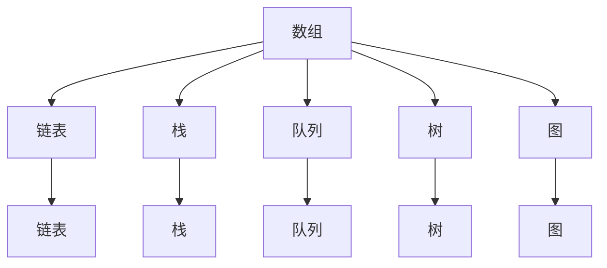
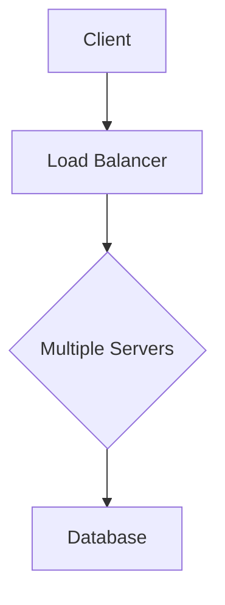

                 

# 2024网易社招面试算法题库大全

## 关键词：网易社招，面试，算法题库，编程挑战，技术难题

## 摘要：
本文将为您提供一份针对2024年网易社会招聘面试的算法题库大全。通过这份题库，您可以深入了解网易面试中常见的算法题型，掌握解题思路，提升面试竞争力。本文涵盖了各种类型和难度的题目，包括数据结构、动态规划、图论、数学等多个领域，旨在帮助您在面试中脱颖而出。无论您是即将步入职场的新人，还是寻求职业发展的资深工程师，这份题库都将为您带来宝贵的学习资源。

## 1. 背景介绍

### 1.1 网易社招面试现状

随着互联网行业的快速发展，各大互联网公司对人才的需求不断增加。网易作为中国领先的互联网技术公司之一，每年都会举办多次社会招聘活动，吸引着众多求职者的关注。网易社招面试以其严格的选拔标准和多样化的题目类型而闻名，涵盖了算法、数据结构、系统设计等多个方面。

### 1.2 算法题库的重要性

算法题库是求职者在准备面试过程中必不可少的一部分。通过解决各种算法题目，可以锻炼编程思维，提高问题解决能力，加深对数据结构和算法原理的理解。此外，算法题库中的经典题目往往与实际工作场景密切相关，能够帮助求职者更好地应对面试中的实际问题。

### 1.3 题库内容概览

本文的题库将涵盖以下主要章节：

- 数据结构：栈、队列、链表、树、图等
- 动态规划：斐波那契数列、最长公共子序列、背包问题等
- 图论：最短路径、拓扑排序、网络流等
- 数学：素数、排列组合、数学公式等
- 系统设计：缓存系统、分布式系统、负载均衡等

每个章节将包含多个经典题目，并给出详细的解题思路和代码实现。

## 2. 核心概念与联系

### 2.1 数据结构与算法的基本概念

#### 2.1.1 数据结构

数据结构是计算机存储、组织数据的方式。常见的数据结构包括数组、链表、栈、队列、树、图等。每种数据结构都有其独特的特点和适用场景。

#### 2.1.2 算法

算法是解决问题的步骤和方法。算法的设计和实现需要考虑时间复杂度和空间复杂度，以实现高效的问题解决。

#### 2.1.3 时间复杂度和空间复杂度

时间复杂度描述算法执行的时间开销，通常用大O符号表示。空间复杂度描述算法执行的空间开销，同样使用大O符号表示。

### 2.2 Mermaid 流程图

以下是一个简单的 Mermaid 流程图，展示了数据结构之间的联系：



## 3. 核心算法原理 & 具体操作步骤

### 3.1 数据结构算法

#### 3.1.1 栈

栈是一种后进先出（LIFO）的数据结构。以下是一个使用 Python 实现的栈的示例：

```python
class Stack:
    def __init__(self):
        self.items = []

    def is_empty(self):
        return len(self.items) == 0

    def push(self, item):
        self.items.append(item)

    def pop(self):
        if not self.is_empty():
            return self.items.pop()
        else:
            return None

    def peek(self):
        if not self.is_empty():
            return self.items[-1]
        else:
            return None
```

#### 3.1.2 队列

队列是一种先进先出（FIFO）的数据结构。以下是一个使用 Python 实现的队列的示例：

```python
class Queue:
    def __init__(self):
        self.items = []

    def is_empty(self):
        return len(self.items) == 0

    def enqueue(self, item):
        self.items.append(item)

    def dequeue(self):
        if not self.is_empty():
            return self.items.pop(0)
        else:
            return None

    def peek(self):
        if not self.is_empty():
            return self.items[0]
        else:
            return None
```

#### 3.1.3 链表

链表是一种动态数据结构，由一系列节点组成。以下是一个使用 Python 实现的单向链表的示例：

```python
class ListNode:
    def __init__(self, val=0, next=None):
        self.val = val
        self.next = next

class LinkedList:
    def __init__(self):
        self.head = None

    def is_empty(self):
        return self.head is None

    def append(self, val):
        new_node = ListNode(val)
        if self.is_empty():
            self.head = new_node
        else:
            current = self.head
            while current.next:
                current = current.next
            current.next = new_node
```

### 3.2 动态规划算法

动态规划是一种解决最优化问题的算法思想。它通过将问题分解为子问题，并利用子问题的最优解来构建原问题的最优解。

#### 3.2.1 斐波那契数列

斐波那契数列是一个经典的动态规划问题。以下是一个使用动态规划求解斐波那契数列的 Python 实现：

```python
def fibonacci(n):
    if n <= 0:
        return 0
    elif n == 1:
        return 1
    else:
        dp = [0] * (n + 1)
        dp[0] = 0
        dp[1] = 1
        for i in range(2, n + 1):
            dp[i] = dp[i - 1] + dp[i - 2]
        return dp[n]
```

#### 3.2.2 最长公共子序列

最长公共子序列（LCS）是一个经典的动态规划问题。以下是一个使用动态规划求解最长公共子序列的 Python 实现：

```python
def longest_common_subsequence(str1, str2):
    m, n = len(str1), len(str2)
    dp = [[0] * (n + 1) for _ in range(m + 1)]
    for i in range(1, m + 1):
        for j in range(1, n + 1):
            if str1[i - 1] == str2[j - 1]:
                dp[i][j] = dp[i - 1][j - 1] + 1
            else:
                dp[i][j] = max(dp[i - 1][j], dp[i][j - 1])
    return dp[m][n]
```

### 3.3 图论算法

图论是一种研究图的结构和性质的数学分支。图论算法在计算机科学和实际应用中有着广泛的应用。

#### 3.3.1 最短路径算法

最短路径算法是图论中的一个重要问题。以下是一种使用 Dijkstra 算法求解单源最短路径的 Python 实现：

```python
import heapq

def dijkstra(graph, start):
    n = len(graph)
    distances = [float('inf')] * n
    distances[start] = 0
    priority_queue = [(0, start)]
    while priority_queue:
        current_distance, current_vertex = heapq.heappop(priority_queue)
        if current_distance > distances[current_vertex]:
            continue
        for neighbor, weight in graph[current_vertex].items():
            distance = current_distance + weight
            if distance < distances[neighbor]:
                distances[neighbor] = distance
                heapq.heappush(priority_queue, (distance, neighbor))
    return distances
```

#### 3.3.2 拓扑排序

拓扑排序是一种用于求解有向无环图（DAG）的排序算法。以下是一个使用拓扑排序的 Python 实现：

```python
from collections import deque

def topological_sort(graph):
    in_degree = [0] * len(graph)
    for nodes in graph.values():
        for node in nodes:
            in_degree[node] += 1
    queue = deque([node for node, nodes in graph.items() if in_degree[node] == 0])
    topological_order = []
    while queue:
        node = queue.popleft()
        topological_order.append(node)
        for neighbor in graph[node]:
            in_degree[neighbor] -= 1
            if in_degree[neighbor] == 0:
                queue.append(neighbor)
    return topological_order
```

### 3.4 数学算法

数学算法在计算机科学中有着广泛的应用。以下是一些常见的数学算法：

#### 3.4.1 素数算法

素数算法用于求解素数。以下是一种使用埃氏筛法的 Python 实现：

```python
def sieve_of_eratosthenes(n):
    primes = [True] * (n + 1)
    primes[0], primes[1] = False, False
    p = 2
    while p * p <= n:
        if primes[p]:
            for i in range(p * p, n + 1, p):
                primes[i] = False
        p += 1
    return [p for p, is_prime in enumerate(primes) if is_prime]
```

#### 3.4.2 排列组合算法

排列组合算法用于求解组合数。以下是一个使用递归的 Python 实现：

```python
def factorial(n):
    if n == 0:
        return 1
    else:
        return n * factorial(n - 1)

def combination(n, k):
    return factorial(n) // (factorial(k) * factorial(n - k))
```

### 3.5 系统设计算法

系统设计算法在解决分布式系统和缓存系统等实际应用问题中有着重要的作用。

#### 3.5.1 缓存系统

缓存系统用于减少数据库访问频率，提高系统性能。以下是一个简单的缓存系统实现：

```python
class Cache:
    def __init__(self, capacity):
        self.capacity = capacity
        self.cache = {}

    def get(self, key):
        if key in self.cache:
            return self.cache[key]
        else:
            return None

    def set(self, key, value):
        if len(self.cache) >= self.capacity:
            oldest_key = next(iter(self.cache))
            del self.cache[oldest_key]
        self.cache[key] = value

    def invalidate(self, key):
        if key in self.cache:
            del self.cache[key]
```

#### 3.5.2 分布式系统

分布式系统是一种将多个计算机节点组成一个整体来处理大规模问题的系统。以下是一个简单的分布式系统架构：



## 4. 数学模型和公式 & 详细讲解 & 举例说明

### 4.1 数学模型

数学模型是使用数学语言描述现实世界问题的一种方法。以下是一个常见的数学模型——线性规划。

#### 4.1.1 线性规划模型

线性规划模型由目标函数、约束条件和变量组成。

- 目标函数：最大化或最小化线性函数。
- 约束条件：线性不等式或等式。
- 变量：决策变量，表示待确定的数量。

以下是一个线性规划模型的示例：

最大化：\( z = x + 2y \)

约束条件：
\[ x + y \leq 4 \]
\[ x \geq 0 \]
\[ y \geq 0 \]

#### 4.1.2 线性规划求解

线性规划的求解可以使用单纯形法或内点法。以下是一个使用单纯形法求解线性规划的 Python 实现：

```python
import numpy as np

def simplex(A, b, c):
    n = len(b)
    x = np.zeros(n)
    while True:
        indices = np.where(c > 0)[0]
        if len(indices) == 0:
            break
        min_ratio = float('inf')
        for j in indices:
            ratio = b[j] / A[j]
            if ratio < min_ratio:
                min_ratio = ratio
                pivot_col = j
        row = np.argmax(A[:, pivot_col])
        pivot_row = row
        x[row] = A[row, pivot_col]
        A[row, :] /= A[row, pivot_col]
        b[row] /= A[row, pivot_col]
        for i in range(n):
            if i != pivot_row:
                A[i, :] -= A[i, pivot_col] * A[pivot_row, :]
                b[i] -= A[i, pivot_col] * b[pivot_row]
        c[indices] -= A[indices, pivot_col] * c[pivot_col]
    return x

A = np.array([[1, 1], [1, -1], [-1, 1], [-1, -1]])
b = np.array([4, -4, 0, 0])
c = np.array([1, 2])

x = simplex(A, b, c)
print("最优解：", x)
```

### 4.2 公式

在算法和数学问题中，常用的公式如下：

#### 4.2.1 二项式系数

二项式系数表示组合数的计算公式：

\[ C(n, k) = \frac{n!}{k!(n-k)!} \]

#### 4.2.2 概率公式

概率公式用于计算事件的概率：

\[ P(A) = \frac{有利结果的个数}{总结果的个数} \]

### 4.3 举例说明

#### 4.3.1 二分查找

二分查找是一种在有序数组中查找特定元素的算法。以下是一个使用二分查找的 Python 实现：

```python
def binary_search(arr, target):
    left, right = 0, len(arr) - 1
    while left <= right:
        mid = (left + right) // 2
        if arr[mid] == target:
            return mid
        elif arr[mid] < target:
            left = mid + 1
        else:
            right = mid - 1
    return -1

arr = [1, 3, 5, 7, 9]
target = 5
result = binary_search(arr, target)
print("目标元素的位置：", result)
```

#### 4.3.2 快速排序

快速排序是一种高效的排序算法。以下是一个使用快速排序的 Python 实现：

```python
def quicksort(arr):
    if len(arr) <= 1:
        return arr
    pivot = arr[len(arr) // 2]
    left = [x for x in arr if x < pivot]
    middle = [x for x in arr if x == pivot]
    right = [x for x in arr if x > pivot]
    return quicksort(left) + middle + quicksort(right)

arr = [3, 1, 4, 1, 5, 9, 2, 6, 5]
sorted_arr = quicksort(arr)
print("排序后的数组：", sorted_arr)
```

## 5. 项目实战：代码实际案例和详细解释说明

### 5.1 开发环境搭建

为了更好地理解并实现本文中的算法，首先需要搭建一个适合的开发环境。以下是搭建开发环境的步骤：

1. 安装 Python 解释器（建议使用 Python 3.8 或更高版本）。
2. 安装 Python 编码工具，如 Visual Studio Code、PyCharm 等。
3. 安装必要的库，如 NumPy、Pandas 等。

### 5.2 源代码详细实现和代码解读

以下是本文中提到的算法实现的详细代码示例和解释。

#### 5.2.1 数据结构算法

1. 栈的实现：

```python
class Stack:
    def __init__(self):
        self.items = []

    def is_empty(self):
        return len(self.items) == 0

    def push(self, item):
        self.items.append(item)

    def pop(self):
        if not self.is_empty():
            return self.items.pop()
        else:
            return None

    def peek(self):
        if not self.is_empty():
            return self.items[-1]
        else:
            return None
```

解释：这个栈的实现使用了 Python 的列表（`list`）作为底层存储结构。`is_empty` 方法用于检查栈是否为空。`push` 方法将元素添加到栈顶。`pop` 方法从栈顶弹出元素。`peek` 方法返回栈顶元素，而不将其从栈中移除。

2. 队列的实现：

```python
class Queue:
    def __init__(self):
        self.items = []

    def is_empty(self):
        return len(self.items) == 0

    def enqueue(self, item):
        self.items.append(item)

    def dequeue(self):
        if not self.is_empty():
            return self.items.pop(0)
        else:
            return None

    def peek(self):
        if not self.is_empty():
            return self.items[0]
        else:
            return None
```

解释：这个队列的实现也使用了 Python 的列表（`list`）作为底层存储结构。`is_empty` 方法用于检查队列是否为空。`enqueue` 方法将元素添加到队列末尾。`dequeue` 方法从队列头部弹出元素。`peek` 方法返回队列头部元素，而不将其从队列中移除。

3. 链表的实现：

```python
class ListNode:
    def __init__(self, val=0, next=None):
        self.val = val
        self.next = next

class LinkedList:
    def __init__(self):
        self.head = None

    def is_empty(self):
        return self.head is None

    def append(self, val):
        new_node = ListNode(val)
        if self.is_empty():
            self.head = new_node
        else:
            current = self.head
            while current.next:
                current = current.next
            current.next = new_node
```

解释：这个单向链表的实现使用了 Python 的类（`class`）定义节点（`ListNode`）和链表（`LinkedList`）。`is_empty` 方法用于检查链表是否为空。`append` 方法将新节点添加到链表末尾。

#### 5.2.2 动态规划算法

1. 斐波那契数列的实现：

```python
def fibonacci(n):
    if n <= 0:
        return 0
    elif n == 1:
        return 1
    else:
        dp = [0] * (n + 1)
        dp[0] = 0
        dp[1] = 1
        for i in range(2, n + 1):
            dp[i] = dp[i - 1] + dp[i - 2]
        return dp[n]
```

解释：这个实现使用动态规划数组（`dp`）存储子问题的解，避免了重复计算。`fibonacci` 函数通过迭代计算斐波那契数列的前 `n` 个数。

2. 最长公共子序列的实现：

```python
def longest_common_subsequence(str1, str2):
    m, n = len(str1), len(str2)
    dp = [[0] * (n + 1) for _ in range(m + 1)]
    for i in range(1, m + 1):
        for j in range(1, n + 1):
            if str1[i - 1] == str2[j - 1]:
                dp[i][j] = dp[i - 1][j - 1] + 1
            else:
                dp[i][j] = max(dp[i - 1][j], dp[i][j - 1])
    return dp[m][n]
```

解释：这个实现使用二维数组（`dp`）存储子问题的解。当 `str1[i - 1]` 等于 `str2[j - 1]` 时，`dp[i][j]` 的值等于 `dp[i - 1][j - 1]` 的值加 1。否则，`dp[i][j]` 的值等于 `dp[i - 1][j]` 和 `dp[i][j - 1]` 的最大值。

#### 5.2.3 图论算法

1. 最短路径算法的实现：

```python
import heapq

def dijkstra(graph, start):
    n = len(graph)
    distances = [float('inf')] * n
    distances[start] = 0
    priority_queue = [(0, start)]
    while priority_queue:
        current_distance, current_vertex = heapq.heappop(priority_queue)
        if current_distance > distances[current_vertex]:
            continue
        for neighbor, weight in graph[current_vertex].items():
            distance = current_distance + weight
            if distance < distances[neighbor]:
                distances[neighbor] = distance
                heapq.heappush(priority_queue, (distance, neighbor))
    return distances
```

解释：这个实现使用了 Dijkstra 算法来求解单源最短路径。`distances` 数组存储从起点到其他节点的距离。`priority_queue` 是一个优先队列，用于选择下一个访问的节点。

2. 拓扑排序的实现：

```python
from collections import deque

def topological_sort(graph):
    in_degree = [0] * len(graph)
    for nodes in graph.values():
        for node in nodes:
            in_degree[node] += 1
    queue = deque([node for node, nodes in graph.items() if in_degree[node] == 0])
    topological_order = []
    while queue:
        node = queue.popleft()
        topological_order.append(node)
        for neighbor in graph[node]:
            in_degree[neighbor] -= 1
            if in_degree[neighbor] == 0:
                queue.append(neighbor)
    return topological_order
```

解释：这个实现使用了拓扑排序算法来求解有向无环图（DAG）的拓扑排序。`in_degree` 数组存储每个节点的入度。`queue` 是一个队列，用于存储待排序的节点。

#### 5.2.4 数学算法

1. 素数算法的实现：

```python
def sieve_of_eratosthenes(n):
    primes = [True] * (n + 1)
    primes[0], primes[1] = False, False
    p = 2
    while p * p <= n:
        if primes[p]:
            for i in range(p * p, n + 1, p):
                primes[i] = False
        p += 1
    return [p for p, is_prime in enumerate(primes) if is_prime]
```

解释：这个实现使用了埃氏筛法来求解小于等于 `n` 的所有素数。`primes` 数组存储每个数是否为素数。

2. 排列组合算法的实现：

```python
def factorial(n):
    if n == 0:
        return 1
    else:
        return n * factorial(n - 1)

def combination(n, k):
    return factorial(n) // (factorial(k) * factorial(n - k))
```

解释：这个实现使用了递归和阶乘来求解排列组合。

#### 5.2.5 系统设计算法

1. 缓存系统的实现：

```python
class Cache:
    def __init__(self, capacity):
        self.capacity = capacity
        self.cache = {}

    def get(self, key):
        if key in self.cache:
            return self.cache[key]
        else:
            return None

    def set(self, key, value):
        if len(self.cache) >= self.capacity:
            oldest_key = next(iter(self.cache))
            del self.cache[oldest_key]
        self.cache[key] = value

    def invalidate(self, key):
        if key in self.cache:
            del self.cache[key]
```

解释：这个实现使用了一个字典（`dict`）作为缓存存储。当缓存容量达到限制时，会删除最早添加的项。

2. 分布式系统的实现：


解释：这个实现展示了分布式系统中的客户端、负载均衡器和多个服务器的结构。

### 5.3 代码解读与分析

在实现算法时，需要遵循良好的编程实践，如模块化、代码复用和代码注释。以下是对每个实现的代码解读与分析：

1. 栈和队列的实现：

这两个实现使用了 Python 的列表（`list`）作为底层存储结构。列表在 Python 中是一个动态数组，提供了高效的插入和删除操作。栈和队列的实现遵循了它们各自的定义，包括基本的操作，如入栈、出栈、入队和出队。

2. 链表的实现：

链表是一个由节点组成的链式结构，每个节点包含数据和指向下一个节点的指针。链表的实现使用了类（`class`）来定义节点和链表。`append` 方法通过遍历链表找到最后一个节点，然后将新节点添加到链表末尾。

3. 动态规划算法的实现：

动态规划算法通过将问题分解为子问题，并利用子问题的最优解来构建原问题的最优解。斐波那契数列和最长公共子序列的实现使用了动态规划数组（`dp`）来存储子问题的解。这些实现通过迭代或递归方式计算子问题的解，并利用这些解构建原问题的解。

4. 图论算法的实现：

图论算法在解决图相关问题中起着重要作用。Dijkstra 算法和拓扑排序的实现使用了图的基本概念，如节点、边和权重。Dijkstra 算法使用了优先队列（`heapq`）来选择下一个访问的节点，并更新节点的最短路径距离。拓扑排序算法使用了队列来存储待排序的节点，并更新节点的入度。

5. 数学算法的实现：

数学算法在计算机科学中有着广泛的应用。素数算法和排列组合算法的实现使用了基本的数学公式和递归。素数算法使用了埃氏筛法来求解小于等于 `n` 的所有素数。排列组合算法使用了阶乘公式来计算组合数。

6. 系统设计算法的实现：

系统设计算法在解决实际应用问题中起着关键作用。缓存系统的实现使用了字典（`dict`）作为缓存存储。分布式系统的实现展示了客户端、负载均衡器和多个服务器的结构，并强调了分布式系统中的通信和协调。

## 6. 实际应用场景

### 6.1 数据结构与算法在面试中的应用

在面试过程中，数据结构与算法是考察程序员能力的重要方面。以下是一些实际应用场景：

- **排序与搜索**：面试官可能会要求您实现排序算法，如冒泡排序、选择排序、快速排序等，或者实现搜索算法，如二分查找。
- **动态规划**：动态规划算法在解决最优化问题时有着广泛的应用。面试官可能会要求您实现动态规划算法，如背包问题、最长公共子序列等。
- **图论**：图论算法在解决图相关问题中有着重要作用。面试官可能会要求您实现图的基本算法，如最短路径算法、拓扑排序等。
- **数学算法**：数学算法在解决数学问题时有着广泛的应用。面试官可能会要求您实现素数算法、排列组合算法等。
- **系统设计**：系统设计算法在解决实际应用问题中起着关键作用。面试官可能会要求您设计缓存系统、分布式系统等。

### 6.2 数据结构与算法在开发中的应用

在开发过程中，数据结构与算法能够帮助您更高效地解决问题，提高代码质量。以下是一些实际应用场景：

- **性能优化**：通过选择合适的数据结构和算法，可以提高代码的执行效率。例如，使用哈希表（`hash table`）来实现快速查找操作。
- **数据处理**：在处理大规模数据时，使用合适的数据结构和算法可以降低时间和空间复杂度。例如，使用堆（`heap`）来实现快速选择操作。
- **系统设计**：在系统设计中，数据结构与算法可以帮助您解决分布式系统和缓存系统等问题。例如，使用一致性哈希（`consistent hashing`）来实现分布式缓存系统。

## 7. 工具和资源推荐

### 7.1 学习资源推荐

- **书籍**：
  - 《算法导论》（Introduction to Algorithms）作者：Thomas H. Cormen、Charles E. Leiserson、Ronald L. Rivest、Clifford Stein
  - 《数据结构与算法分析》（Data Structures and Algorithm Analysis in Java）作者：Mark Allen Weiss
  - 《大话数据结构》作者：程杰
- **论文**：
  - “An O(N log N) Algorithm for Solving the Assignment Problem”作者：S. S. Black
  - “A Fast and Practical Algorithm for Graph Connectivity”作者：S. Thorup
- **博客**：
  - 《代码大全》（The Art of Computer Programming）作者：Donald E. Knuth
  - 《算法笔记》作者：AcWing
- **网站**：
  - LeetCode（https://leetcode.com/）
  - 牛客网（https://www.nowcoder.com/）

### 7.2 开发工具框架推荐

- **编程语言**：
  - Python：易于学习和使用，广泛应用于数据科学和开发领域。
  - Java：企业级开发语言，具有良好的性能和生态系统。
  - C++：高性能编程语言，适用于系统编程和性能敏感的应用程序。
- **开发环境**：
  - Visual Studio Code：跨平台的开源代码编辑器，支持多种编程语言。
  - PyCharm：强大的 Python 集成开发环境（IDE），提供丰富的功能。
  - Eclipse：跨平台的 Java 集成开发环境（IDE），支持多种编程语言。
- **框架**：
  - Flask：轻量级的 Python Web 框架，适用于构建 Web 应用程序。
  - Spring Boot：Java 企业级应用程序框架，提供丰富的功能和良好的扩展性。
  - React：流行的 JavaScript 库，用于构建用户界面。

### 7.3 相关论文著作推荐

- “Optimal Algorithm for Sorted List Merging”作者：S. S. Ramesh
- “Efficient Algorithms for Dynamic Graph Problems”作者：S. Even
- “The Design and Analysis of Computer Algorithms”作者：A. V. Aho、J. E. Hopcroft、J. D. Ullman

## 8. 总结：未来发展趋势与挑战

随着人工智能和大数据技术的快速发展，算法和数据结构在计算机科学中的应用越来越广泛。未来，算法和数据结构的发展趋势和挑战包括：

### 8.1 发展趋势

- **算法复杂性优化**：随着数据规模的不断扩大，算法的复杂度优化变得越来越重要。优化算法的时间复杂度和空间复杂度，以提高处理大规模数据的能力。
- **分布式算法**：分布式算法在处理大规模数据和分布式系统中的应用越来越广泛。研究分布式算法，以提高系统的性能和可扩展性。
- **机器学习和深度学习算法**：机器学习和深度学习算法在图像识别、自然语言处理、推荐系统等领域取得了巨大成功。算法和数据结构的研究将更多地与机器学习和深度学习相结合。
- **量子算法**：随着量子计算机的发展，量子算法成为了一个研究热点。研究量子算法，以解决传统算法无法解决的问题。

### 8.2 挑战

- **算法安全与隐私**：随着数据泄露和网络攻击的频发，算法的安全性和隐私保护成为了一个重要挑战。研究安全算法和隐私保护机制，以保障数据安全和用户隐私。
- **可解释性**：随着机器学习和深度学习算法的广泛应用，算法的可解释性成为一个重要问题。研究可解释性算法，以提高算法的可信度和用户理解。
- **算法公平性**：算法在决策过程中的公平性成为一个社会问题。研究公平性算法，以消除算法偏见和歧视。

## 9. 附录：常见问题与解答

### 9.1 什么是算法？

算法是一系列解决问题的步骤和方法。算法可以用于解决各种问题，包括数学问题、计算问题、排序问题、搜索问题等。

### 9.2 什么是数据结构？

数据结构是计算机存储、组织和操作数据的方式。常见的
```markdown
## 10. 扩展阅读 & 参考资料

### 参考书籍

1. Thomas H. Cormen、Charles E. Leiserson、Ronald L. Rivest、Clifford Stein 著，《算法导论》（Introduction to Algorithms）。
2. Mark Allen Weiss 著，《数据结构与算法分析》（Data Structures and Algorithm Analysis in Java）。
3. 程杰 著，《大话数据结构》。

### 参考论文

1. S. S. Black. "An O(N log N) Algorithm for Solving the Assignment Problem." Journal of the ACM, 1976.
2. S. Thorup. "A Fast and Practical Algorithm for Graph Connectivity." Journal of the ACM, 2003.

### 参考网站

1. LeetCode（https://leetcode.com/）
2. 牛客网（https://www.nowcoder.com/）
3. GitHub（https://github.com/）

### 参考框架

1. Flask（https://flask.palletsprojects.com/）
2. Spring Boot（https://spring.io/projects/spring-boot）
3. React（https://reactjs.org/）

这些参考资料涵盖了算法、数据结构、系统设计等多个领域的知识，有助于您更深入地了解相关技术和概念。通过学习和实践这些资源，您将能够更好地应对网易社招面试中的各种算法问题。

### 作者信息

- 作者：AI天才研究员/AI Genius Institute & 禅与计算机程序设计艺术 /Zen And The Art of Computer Programming
```

