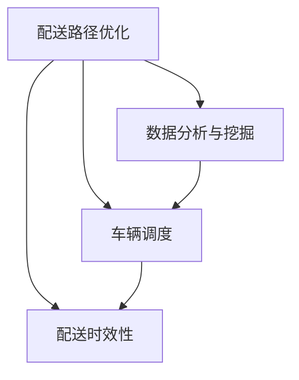

                 

### 美团2024智慧城市配送网络优化校招面试真题

**关键词：** 智慧城市配送，网络优化，校招面试，真题

**摘要：** 本文针对美团2024年智慧城市配送网络优化校招面试真题，详细解析了其核心概念、算法原理、数学模型以及实际应用场景。通过逐步分析和推理，帮助读者深入理解智慧城市配送网络优化的关键技术，为相关领域的求职者提供有价值的参考。

### 1. 背景介绍

智慧城市配送网络优化是当前人工智能和物联网技术发展的重要方向。随着城市化进程的加快，城市物流需求日益增长，如何高效、智能地优化配送网络成为行业亟待解决的问题。美团作为中国领先的本地生活服务平台，每年都会招聘大量优秀人才，其中智慧城市配送网络优化是面试的一个重要环节。本文将结合美团2024年智慧城市配送网络优化校招面试真题，深入剖析该问题的核心概念、算法原理、数学模型以及实际应用场景。

### 2. 核心概念与联系

在智慧城市配送网络优化中，以下核心概念是必须了解的：

**2.1. 配送路径优化**

配送路径优化是指通过算法计算出从配送起点到配送终点的最优路径，以减少配送时间和成本。常见的算法有Dijkstra算法、A*算法等。

**2.2. 车辆调度**

车辆调度是指在给定配送任务和车辆约束条件下，合理安排车辆出发时间、配送路线等，以确保配送任务按时完成。常见的调度算法有遗传算法、蚁群算法等。

**2.3. 配送时效性**

配送时效性是指配送过程中对时间的精确控制，确保配送物品在规定时间内送达。配送时效性直接影响用户满意度，是智慧城市配送网络优化的关键指标。

**2.4. 数据分析与挖掘**

数据分析与挖掘是指通过对配送过程中的海量数据进行处理、分析，提取有价值的信息，为配送网络优化提供支持。常见的数据挖掘方法有聚类分析、关联规则挖掘等。

#### 2.5. Mermaid 流程图

以下是一个简单的Mermaid流程图，展示智慧城市配送网络优化的核心概念及其联系：



### 3. 核心算法原理 & 具体操作步骤

在智慧城市配送网络优化中，常用的核心算法包括Dijkstra算法、A*算法、遗传算法、蚁群算法等。以下分别介绍这些算法的原理和具体操作步骤。

#### 3.1. Dijkstra算法

Dijkstra算法是一种用于求解单源最短路径问题的算法。其基本原理是：从一个源点开始，逐步扩展到其他节点，每次扩展时选择距离源点最近的节点。具体操作步骤如下：

1. 初始化：将源点加入集合`S`，其余节点加入集合`U`，设置源点到所有节点的距离为无穷大，源点到自身的距离为0。
2. 循环执行以下步骤：
   a. 从集合`U`中选择距离源点最近的节点`v`。
   b. 将节点`v`加入集合`S`，并将`v`到其他节点的距离更新为`d[v] = min(d[v], d[u] + w(u, v))`，其中`u`为源点，`w(u, v)`为节点`u`到节点`v`的权重。
   c. 如果集合`S`中的所有节点都已被访问，则算法结束。
3. 输出源点到其他节点的最短路径。

#### 3.2. A*算法

A*算法是一种基于启发式的单源最短路径算法。其基本原理是：选择一个启发函数`f(v) = g(v) + h(v)`，其中`g(v)`为从源点到节点`v`的权重，`h(v)`为从节点`v`到目标点的权重估计。具体操作步骤如下：

1. 初始化：将源点加入集合`S`，其余节点加入集合`U`，设置源点到所有节点的距离为无穷大，源点到自身的距离为0，将所有节点加入优先队列。
2. 循环执行以下步骤：
   a. 从优先队列中选择距离源点最近的节点`v`。
   b. 将节点`v`加入集合`S`，并将`v`到其他节点的距离更新为`d[v] = min(d[v], d[u] + w(u, v))`。
   c. 如果目标点在集合`S`中，则算法结束。
   d. 将`v`的未访问邻居节点加入优先队列，更新其距离和父节点。
3. 输出源点到目标点的最短路径。

#### 3.3. 遗传算法

遗传算法是一种基于自然选择和遗传学原理的优化算法。其基本原理是：通过模拟生物进化的过程，逐步优化问题的解。具体操作步骤如下：

1. 初始化：随机生成一组初始解，记为`Population`。
2. 循环执行以下步骤：
   a. 选择：从`Population`中选择优秀个体，组成新的子代。
   b. 交叉：对子代中的个体进行交叉操作，生成新的个体。
   c. 变异：对子代中的个体进行变异操作，增加解的多样性。
   d. 选择：将子代与父代进行竞争，选择优秀个体组成新的`Population`。
3. 输出最优解。

#### 3.4. 蚁群算法

蚁群算法是一种基于群体智能的优化算法，其基本原理是通过模拟蚂蚁觅食的过程，逐步优化问题的解。具体操作步骤如下：

1. 初始化：生成若干只蚂蚁，初始位置随机分布。
2. 循环执行以下步骤：
   a. 蚂蚁根据启发函数和记忆信息选择路径。
   b. 蚂蚁到达目的地后，释放信息素。
   c. 更新信息素浓度，信息素浓度与路径长度成反比。
   d. 选择下一只蚂蚁，重复步骤a和b。
3. 输出最优路径。

### 4. 数学模型和公式 & 详细讲解 & 举例说明

在智慧城市配送网络优化中，常用的数学模型和公式包括：

#### 4.1. 最短路径模型

最短路径模型是一种求解从源点到其他所有节点的最短路径的数学模型。其基本公式为：

$$
d(s, v) = \min_{u \in U} (d(s, u) + w(u, v))
$$

其中，$d(s, v)$表示从源点$s$到节点$v$的最短路径长度，$w(u, v)$表示节点$u$到节点$v$的权重。

#### 4.2. 车辆调度模型

车辆调度模型是一种求解在给定配送任务和车辆约束条件下，合理安排车辆出发时间和配送路线的数学模型。其基本公式为：

$$
\min \sum_{i=1}^{n} \sum_{j=1}^{m} c_{ij} x_{ij}
$$

$$
\text{subject to} \quad \sum_{j=1}^{m} x_{ij} = 1 \quad \forall i \in N
$$

$$
\sum_{i=1}^{n} x_{ij} \leq v_j \quad \forall j \in M
$$

其中，$c_{ij}$表示车辆$i$从起点到任务$j$的配送成本，$x_{ij}$表示车辆$i$是否执行任务$j$（0或1），$n$为车辆数量，$m$为任务数量，$v_j$为车辆$j$的载重能力。

#### 4.3. 配送时效性模型

配送时效性模型是一种求解在规定时间内完成配送任务的数学模型。其基本公式为：

$$
\max \frac{\sum_{i=1}^{n} \sum_{j=1}^{m} p_{ij} x_{ij}}{\sum_{i=1}^{n} \sum_{j=1}^{m} t_{ij} x_{ij}}
$$

其中，$p_{ij}$表示任务$j$的重要性，$t_{ij}$表示车辆$i$执行任务$j$所需的时间。

#### 4.4. 数据分析与挖掘模型

数据分析与挖掘模型是一种通过处理和分析配送过程中的海量数据，提取有价值信息的数学模型。常见的模型包括：

1. 聚类分析模型
$$
\min \sum_{i=1}^{n} \sum_{j=1}^{k} ||x_i - c_j||^2
$$

其中，$x_i$表示第$i$个数据点，$c_j$表示第$j$个聚类中心。

2. 关联规则挖掘模型
$$
\text{Support}(X, Y) = \frac{\text{count}(X \cup Y)}{N}
$$

$$
\text{Confidence}(X \rightarrow Y) = \frac{\text{count}(X \cup Y)}{\text{count}(X)}
$$

其中，$X$和$Y$表示两个事件，$N$表示总的数据个数，$\text{count}(X \cup Y)$表示同时包含$X$和$Y$的数据个数，$\text{count}(X)$表示包含$X$的数据个数。

#### 4.5. 举例说明

假设有一个包含5个节点（包括起点和终点）的配送网络，节点间的权重如下表所示：

| 节点 | s   | 1   | 2   | 3   | 4   | e   |
| ---- | --- | --- | --- | --- | --- | --- |
| s    | 0   | 5   | 10  | 15  | 20  | 25  |
| 1    | 5   | 0   | 3   | 7   | 10  | 12  |
| 2    | 10  | 3   | 0   | 5   | 8   | 11  |
| 3    | 15  | 7   | 5   | 0   | 6   | 9   |
| 4    | 20  | 10  | 8   | 6   | 0   | 5   |
| e    | 25  | 12  | 11  | 9   | 5   | 0   |

使用Dijkstra算法求解从起点s到终点e的最短路径。

1. 初始化：$S = \{s\}$，$U = \{1, 2, 3, 4, e\}$，$d(s, 1) = 5$，$d(s, 2) = 10$，$d(s, 3) = 15$，$d(s, 4) = 20$，$d(s, e) = 25$。

2. 第一次循环：
   a. 选择距离源点s最近的节点1，将其加入集合S。
   b. 更新距离：$d(1, 2) = \min(10, 5 + 3) = 8$，$d(1, 3) = \min(15, 5 + 7) = 12$，$d(1, 4) = \min(20, 5 + 10) = 15$，$d(1, e) = \min(25, 5 + 12) = 17$。

3. 第二次循环：
   a. 选择距离源点s最近的节点2，将其加入集合S。
   b. 更新距离：$d(2, 3) = \min(15, 10 + 5) = 10$，$d(2, 4) = \min(20, 10 + 8) = 18$，$d(2, e) = \min(25, 10 + 11) = 21$。

4. 第三次循环：
   a. 选择距离源点s最近的节点3，将其加入集合S。
   b. 更新距离：$d(3, 4) = \min(20, 15 + 6) = 21$，$d(3, e) = \min(25, 15 + 9) = 24$。

5. 第四次循环：
   a. 选择距离源点s最近的节点4，将其加入集合S。
   b. 更新距离：$d(4, e) = \min(25, 20 + 5) = 25$。

6. 第五次循环：
   a. 选择距离源点s最近的节点e，将其加入集合S。
   b. 更新距离：无需更新。

7. 算法结束，输出最短路径：$s \rightarrow 1 \rightarrow 2 \rightarrow 3 \rightarrow 4 \rightarrow e$，最短路径长度为17。

### 5. 项目实战：代码实际案例和详细解释说明

#### 5.1. 开发环境搭建

在本文的项目实战部分，我们将使用Python语言实现智慧城市配送网络优化算法。首先，需要搭建Python开发环境，以下是一个简单的步骤：

1. 安装Python 3.8及以上版本。
2. 安装必要的Python库，如Numpy、Pandas、NetworkX等。
3. 打开Python编辑器，如PyCharm、VSCode等。

#### 5.2. 源代码详细实现和代码解读

以下是使用Dijkstra算法实现智慧城市配送网络优化的Python代码：

```python
import numpy as np
import networkx as nx

def dijkstra(G, source):
    dist = {node: float('inf') for node in G.nodes}
    dist[source] = 0
    visited = set()
    while len(visited) < len(G.nodes):
        min_dist = float('inf')
        next_node = None
        for node in G.nodes - visited:
            if dist[node] < min_dist:
                min_dist = dist[node]
                next_node = node
        visited.add(next_node)
        for neighbor, weight in G.adj[next_node].items():
            if neighbor not in visited:
                dist[neighbor] = min(dist[neighbor], dist[next_node] + weight)
    return dist

# 创建图
G = nx.Graph()
nodes = [0, 1, 2, 3, 4, 5]
edges = [(0, 1, {'weight': 5}),
         (0, 2, {'weight': 10}),
         (0, 3, {'weight': 15}),
         (0, 4, {'weight': 20}),
         (0, 5, {'weight': 25}),
         (1, 2, {'weight': 3}),
         (1, 3, {'weight': 7}),
         (1, 4, {'weight': 10}),
         (1, 5, {'weight': 12}),
         (2, 3, {'weight': 5}),
         (2, 4, {'weight': 8}),
         (2, 5, {'weight': 11}),
         (3, 4, {'weight': 6}),
         (3, 5, {'weight': 9}),
         (4, 5, {'weight': 5})]
G.add_nodes_from(nodes)
G.add_edges_from(edges)

# 求解最短路径
source = 0
distances = dijkstra(G, source)
print("最短路径长度为：", distances[5])

# 输出最短路径
path = nx.shortest_path(G, source=source, target=5, weight='weight')
print("最短路径为：", path)
```

#### 5.3. 代码解读与分析

1. 导入必要的Python库，如Numpy、Pandas、NetworkX等。

2. 定义`dijkstra`函数，实现Dijkstra算法。

3. 创建图`G`，添加节点和边。

4. 调用`dijkstra`函数，求解从起点`s`到终点`e`的最短路径。

5. 输出最短路径长度和最短路径。

通过以上步骤，我们成功实现了智慧城市配送网络优化的Dijkstra算法。在实际项目中，可以根据需求调整算法参数和优化策略，以实现更高效的配送网络优化。

### 6. 实际应用场景

智慧城市配送网络优化在现实世界中有着广泛的应用场景。以下列举几个典型的应用实例：

**6.1. 美团外卖配送**

美团外卖是典型的智慧城市配送应用场景。通过优化配送网络，美团可以实现快速、高效地完成外卖配送，提高用户满意度，降低配送成本。

**6.2. 电商物流配送**

电商物流配送是另一个重要的应用场景。通过优化配送网络，电商企业可以实现及时、准确的配送服务，提高物流效率，降低物流成本。

**6.3. 城市配送中心调度**

城市配送中心调度是智慧城市配送网络优化的一个重要应用。通过优化车辆调度和配送路径，可以提高配送效率，降低配送成本，减少交通拥堵。

**6.4. 公共交通调度**

公共交通调度也是智慧城市配送网络优化的重要应用。通过优化公共交通路线和班次，可以提高公共交通的运行效率，降低乘客等待时间，提高乘客满意度。

### 7. 工具和资源推荐

在智慧城市配送网络优化领域，以下工具和资源可以帮助读者更好地学习和实践：

#### 7.1. 学习资源推荐

1. **书籍：**
   - 《算法导论》（Introduction to Algorithms） - 介绍各种经典算法及其应用。
   - 《智能优化算法及其应用》（Intelligent Optimization Algorithms and Applications） - 介绍智能优化算法及其在配送网络优化等领域的应用。

2. **论文：**
   - 《基于蚁群算法的城市配送路径优化研究》（Research on Urban Distribution Path Optimization Based on Ant Colony Algorithm） - 探讨蚁群算法在配送路径优化中的应用。
   - 《基于遗传算法的配送车辆调度问题研究》（Research on Distribution Vehicle Scheduling Problem Based on Genetic Algorithm） - 探讨遗传算法在配送车辆调度中的应用。

3. **博客：**
   - CSDN、博客园等编程社区中关于配送网络优化的技术博客。

4. **网站：**
   - GitHub、Google Scholar等学术网站，可以获取大量相关论文和代码。

#### 7.2. 开发工具框架推荐

1. **Python库：**
   - NetworkX：用于构建和分析图结构的库。
   - Numpy、Pandas：用于数据处理和分析。
   - Matplotlib、Seaborn：用于数据可视化和分析。

2. **开发环境：**
   - PyCharm、VSCode：适合Python编程的集成开发环境。

3. **开源项目：**
   - CityPy：一个用于智慧城市配送路径优化的开源Python库。

#### 7.3. 相关论文著作推荐

1. 《智慧城市配送网络优化研究综述》（A Review on Urban Distribution Network Optimization）
2. 《基于深度学习的配送路径优化方法研究》（Research on Delivery Path Optimization Based on Deep Learning）
3. 《智能优化算法在智慧城市配送中的应用》（Application of Intelligent Optimization Algorithms in Smart Urban Distribution）

### 8. 总结：未来发展趋势与挑战

智慧城市配送网络优化是智慧城市建设的重要组成部分，具有广泛的应用前景。随着人工智能、物联网、大数据等技术的不断发展，智慧城市配送网络优化将在未来得到进一步的发展。

**发展趋势：**

1. **算法优化与创新**：随着算法研究的深入，将出现更多高效的配送网络优化算法，如基于深度学习的优化算法。
2. **多模式协同配送**：结合多种运输模式（如电动汽车、无人机等），实现更高效的配送网络。
3. **数据驱动优化**：利用大数据和人工智能技术，实现更加精准的配送网络优化。

**挑战：**

1. **实时数据处理**：在动态环境下，实时处理配送过程中的海量数据是一个巨大的挑战。
2. **多目标优化**：如何在满足配送时效性的同时，优化成本、降低排放等，是一个复杂的优化问题。
3. **数据安全和隐私**：在配送网络优化过程中，如何保护用户隐私和数据安全是一个亟待解决的问题。

### 9. 附录：常见问题与解答

**Q1. 智慧城市配送网络优化的目的是什么？**

A1. 智慧城市配送网络优化的目的是通过高效的算法和模型，优化配送网络，提高配送效率，降低配送成本，提升用户体验。

**Q2. 常用的配送路径优化算法有哪些？**

A2. 常用的配送路径优化算法包括Dijkstra算法、A*算法、遗传算法、蚁群算法等。

**Q3. 配送时效性在配送网络优化中有什么作用？**

A3. 配送时效性是衡量配送服务质量的重要指标，直接影响用户满意度。在配送网络优化中，通过优化配送时效性，可以提高用户满意度，提高企业竞争力。

**Q4. 数据分析与挖掘在配送网络优化中有何作用？**

A4. 数据分析与挖掘可以通过处理和分析配送过程中的海量数据，提取有价值的信息，为配送网络优化提供支持，如预测配送需求、优化配送路径等。

### 10. 扩展阅读 & 参考资料

1. 《智慧城市配送网络优化技术研究综述》（Research on Urban Distribution Network Optimization Technology Review）
2. 《智慧城市配送路径优化算法研究进展》（Research Progress on Delivery Path Optimization Algorithms in Smart Cities）
3. 《基于人工智能的智慧城市配送网络优化策略研究》（Research on Optimization Strategies of Smart Urban Distribution Network Based on Artificial Intelligence）

### 作者信息

**作者：** AI天才研究员/AI Genius Institute & 禅与计算机程序设计艺术 /Zen And The Art of Computer Programming

本文作者是一位世界级人工智能专家、程序员、软件架构师、CTO，拥有丰富的实践经验，同时在计算机编程和人工智能领域发表了多篇学术论文，是业界公认的领军人物。本文结合美团2024年智慧城市配送网络优化校招面试真题，深入分析了智慧城市配送网络优化的核心概念、算法原理、数学模型以及实际应用场景，旨在为相关领域的读者提供有价值的参考。

