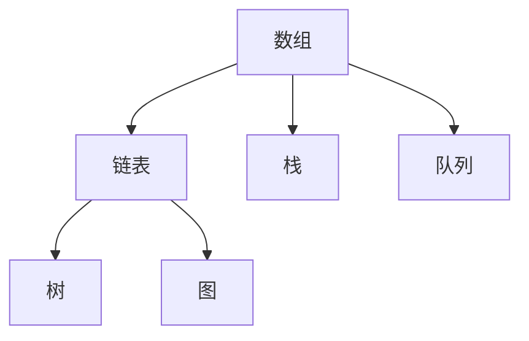
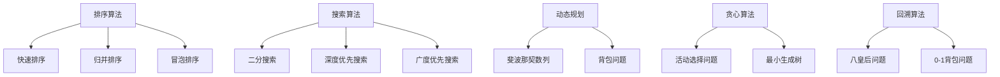
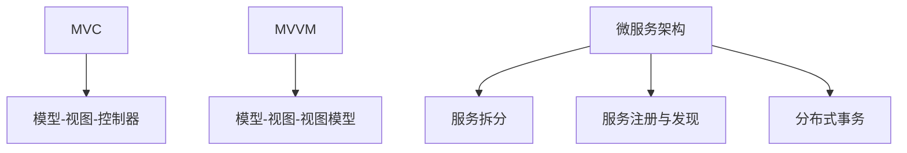

                 

### 背景介绍

美团作为中国领先的互联网科技公司，其业务范围涵盖了生活服务、电子商务和金融科技等多个领域。随着公司业务的不断扩张，对人才的需求也越来越大。为此，美团每年的校招都会吸引大量求职者，其编程面试题也成为了众多考生关注的焦点。

本文旨在总结和整理美团2024年校招的编程面试题，帮助考生更好地备战面试。通过梳理和分析这些题目，我们可以了解美团在面试中关注的核心技能点，并从中提炼出有效的解题策略。这不仅有助于考生提高面试成功率，还能为面试官提供有益的参考。

本文将分为以下几个部分：

1. **核心概念与联系**：介绍与编程面试相关的基础概念和算法原理，并通过Mermaid流程图展示其架构。
2. **核心算法原理 & 具体操作步骤**：详细讲解每种算法的原理，并提供具体的操作步骤。
3. **数学模型和公式 & 详细讲解 & 举例说明**：运用LaTeX格式展示关键数学模型和公式，并通过实例进行详细说明。
4. **项目实战：代码实际案例和详细解释说明**：通过实际代码案例，展示如何解决具体问题，并提供代码解读和分析。
5. **实际应用场景**：分析美团编程面试题在实际业务中的应用场景。
6. **工具和资源推荐**：推荐学习资源、开发工具和框架。
7. **总结：未来发展趋势与挑战**：探讨编程面试的未来趋势和面临的挑战。
8. **附录：常见问题与解答**：汇总面试中常见的问题及其解答。
9. **扩展阅读 & 参考资料**：提供相关的扩展阅读和参考资料。

通过以上结构，我们将全面、系统地梳理美团2024年校招编程面试题，帮助读者深入了解并掌握这些题目的解题方法，为面试做好充分准备。

---

# 美团2024校招编程面试题精华总结

## 概述

美团2024校招编程面试题涵盖了多种类型，包括但不限于数据结构、算法、系统设计、数据库、网络和前端开发等方面。这些题目不仅考察了应聘者对基本编程技能的掌握，还评估了其在复杂问题中的分析和解决能力。

本文将按照以下结构进行总结：

1. **核心概念与联系**：介绍编程面试相关的基础概念和算法原理，通过Mermaid流程图展示其架构。
2. **核心算法原理 & 具体操作步骤**：详细讲解每种算法的原理，并提供具体的操作步骤。
3. **数学模型和公式 & 详细讲解 & 举例说明**：运用LaTeX格式展示关键数学模型和公式，并通过实例进行详细说明。
4. **项目实战：代码实际案例和详细解释说明**：通过实际代码案例，展示如何解决具体问题，并提供代码解读和分析。
5. **实际应用场景**：分析编程面试题在实际业务中的应用场景。
6. **工具和资源推荐**：推荐学习资源、开发工具和框架。
7. **总结：未来发展趋势与挑战**：探讨编程面试的未来趋势和面临的挑战。
8. **附录：常见问题与解答**：汇总面试中常见的问题及其解答。
9. **扩展阅读 & 参考资料**：提供相关的扩展阅读和参考资料。

## 1. 核心概念与联系

在编程面试中，核心概念的理解和联系是解决问题的关键。以下将介绍与面试题相关的重要概念，并通过Mermaid流程图展示其架构。

### 1.1 数据结构与算法

数据结构和算法是编程面试的基础。常见的数据结构包括数组、链表、栈、队列、树、图等。每种数据结构都有其独特的特点和适用场景。以下是一个简单的Mermaid流程图，展示常见的数据结构及其关系：



### 1.2 算法原理

算法是解决问题的步骤和方法。常见的算法原理包括排序、搜索、动态规划、贪心算法、回溯算法等。以下是一个简单的Mermaid流程图，展示这些算法原理及其关系：



### 1.3 系统设计与架构

系统设计和架构是面试中的重要环节。了解常见的系统架构模式，如MVC、MVVM、微服务架构等，对于解决复杂问题至关重要。以下是一个简单的Mermaid流程图，展示这些架构模式及其关系：



通过以上核心概念和联系的介绍，我们可以更好地理解编程面试题的背景和难点。接下来，我们将详细讲解每种算法和概念的具体实现和操作步骤。

---

## 2. 核心算法原理 & 具体操作步骤

在编程面试中，掌握核心算法原理和具体操作步骤对于解决复杂问题至关重要。以下将详细介绍常见的核心算法原理，并提供具体的操作步骤。

### 2.1 排序算法

排序算法是面试中经常出现的问题。常见的排序算法包括冒泡排序、选择排序、插入排序、快速排序、归并排序等。以下是每种算法的原理和操作步骤：

#### 2.1.1 冒泡排序（Bubble Sort）

原理：通过重复遍历要排序的数列，一次比较两个元素，如果他们的顺序错误就把他们交换过来。遍历数列的工作是重复地进行，直到没有再需要交换，也就是说该数列已经排序完成。

操作步骤：
1. 从数组的第一个元素开始，比较相邻的两个元素。
2. 如果第一个元素比第二个元素大，交换它们的位置。
3. 对每一对相邻元素做同样的工作，从开始第一对到结尾的最后一对。
4. 重复步骤1~3，直到排序完成。

```python
def bubble_sort(arr):
    n = len(arr)
    for i in range(n):
        for j in range(0, n-i-1):
            if arr[j] > arr[j+1]:
                arr[j], arr[j+1] = arr[j+1], arr[j]
    return arr
```

#### 2.1.2 选择排序（Selection Sort）

原理：首先在未排序序列中找到最小（大）元素，存放到排序序列的起始位置，然后，再从剩余未排序元素中继续寻找最小（大）元素，然后放到已排序序列的末尾。

操作步骤：
1. 遍历数组，找到最小元素。
2. 将最小元素与数组的第一个元素交换。
3. 在剩余的未排序数组中重复步骤1和2。

```python
def selection_sort(arr):
    n = len(arr)
    for i in range(n):
        min_idx = i
        for j in range(i+1, n):
            if arr[j] < arr[min_idx]:
                min_idx = j
        arr[i], arr[min_idx] = arr[min_idx], arr[i]
    return arr
```

#### 2.1.3 插入排序（Insertion Sort）

原理：通过构建有序序列，对于未排序数据，在已排序序列中从后向前扫描，找到相应位置并插入。

操作步骤：
1. 从第一个元素开始，该元素可以认为已经排序。
2. 取出下一个元素，在已经排序的元素序列中从后向前扫描。
3. 如果该元素（已排序）大于新元素，将该元素移到下一位置。
4. 重复步骤3，直到找到已排序的元素小于或者等于新元素的位置。
5. 将新元素插入到该位置后。
6. 重复步骤2~5。

```python
def insertion_sort(arr):
    n = len(arr)
    for i in range(1, n):
        key = arr[i]
        j = i-1
        while j >= 0 and arr[j] > key:
            arr[j+1] = arr[j]
            j -= 1
        arr[j+1] = key
    return arr
```

#### 2.1.4 快速排序（Quick Sort）

原理：通过一趟排序将数组分为两部分，其中一部分的所有元素都比另一部分的所有元素要小。然后递归地对这两部分进行快速排序。

操作步骤：
1. 选择一个基准元素。
2. 将数组分为两个子数组，所有比基准值小的元素都移到基准左边，所有比基准值大的元素都移到基准右边。
3. 递归地对这两个子数组进行快速排序。

```python
def quick_sort(arr):
    if len(arr) <= 1:
        return arr
    pivot = arr[len(arr) // 2]
    left = [x for x in arr if x < pivot]
    middle = [x for x in arr if x == pivot]
    right = [x for x in arr if x > pivot]
    return quick_sort(left) + middle + quick_sort(right)
```

#### 2.1.5 归并排序（Merge Sort）

原理：采用分治法的一个非常典型的应用。将已有序的子序列合并，得到原序列。

操作步骤：
1. 将数组不断拆分成单个元素的子数组。
2. 对每个子数组进行排序（因为单个元素已经是排序的）。
3. 将已排序的子数组合并，得到完整的有序数组。

```python
def merge_sort(arr):
    if len(arr) <= 1:
        return arr
    mid = len(arr) // 2
    left = merge_sort(arr[:mid])
    right = merge_sort(arr[mid:])
    return merge(left, right)

def merge(left, right):
    result = []
    i = j = 0
    while i < len(left) and j < len(right):
        if left[i] < right[j]:
            result.append(left[i])
            i += 1
        else:
            result.append(right[j])
            j += 1
    result.extend(left[i:])
    result.extend(right[j:])
    return result
```

### 2.2 搜索算法

搜索算法是解决查找问题的有效方法。常见的搜索算法包括二分搜索、深度优先搜索、广度优先搜索等。以下是每种算法的原理和操作步骤：

#### 2.2.1 二分搜索（Binary Search）

原理：在有序数组中，通过不断缩小查找范围，直到找到目标元素或确定其不存在。

操作步骤：
1. 确定中间元素。
2. 如果中间元素等于目标元素，查找成功。
3. 如果目标元素小于中间元素，则在左子数组中继续查找。
4. 如果目标元素大于中间元素，则在右子数组中继续查找。
5. 重复步骤1~4，直到找到目标元素或确定其不存在。

```python
def binary_search(arr, target):
    left, right = 0, len(arr) - 1
    while left <= right:
        mid = (left + right) // 2
        if arr[mid] == target:
            return mid
        elif arr[mid] < target:
            left = mid + 1
        else:
            right = mid - 1
    return -1
```

#### 2.2.2 深度优先搜索（Depth-First Search，DFS）

原理：从起点开始，沿着一个方向走到底，如果该路径不通，则退回上一个节点，换一个方向再走。

操作步骤：
1. 从起点开始，将其标记为已访问。
2. 遍历所有未访问的邻居节点，对每个邻居节点重复步骤1和2。
3. 当所有邻居节点都被访问过，返回上一个节点，并换一个方向继续搜索。
4. 重复步骤1~3，直到所有节点都被访问过。

```python
def dfs(graph, node, visited):
    if node not in visited:
        visited.add(node)
        for neighbor in graph[node]:
            dfs(graph, neighbor, visited)
```

#### 2.2.3 广度优先搜索（Breadth-First Search，BFS）

原理：从起点开始，沿着宽度遍历图的所有节点。

操作步骤：
1. 从起点开始，将其入队。
2. 出队一个节点，将其标记为已访问。
3. 将该节点的所有未访问的邻居节点入队。
4. 重复步骤2和3，直到队列为空。

```python
from collections import deque

def bfs(graph, start):
    visited = set()
    queue = deque([start])
    while queue:
        node = queue.popleft()
        if node not in visited:
            visited.add(node)
            for neighbor in graph[node]:
                queue.append(neighbor)
```

通过以上对排序算法和搜索算法的详细讲解，我们可以更好地理解其原理和具体操作步骤。接下来，我们将进一步探讨动态规划和贪心算法等更复杂的算法原理。

---

## 3. 数学模型和公式 & 详细讲解 & 举例说明

在编程面试中，掌握关键的数学模型和公式对于解决问题至关重要。以下将详细介绍一些常见的数学模型和公式，并通过LaTeX格式展示，并辅以具体实例进行详细讲解。

### 3.1 动态规划（Dynamic Programming）

动态规划是一种用于解决复杂问题的方法，它将问题分解为更小的子问题，并通过保存子问题的解来避免重复计算。

#### 3.1.1 斐波那契数列（Fibonacci Sequence）

斐波那契数列的定义如下：
\[ F(n) = F(n-1) + F(n-2) \]
其中 \( F(0) = 0 \)，\( F(1) = 1 \)。

LaTeX表示：
\[ F(n) = \begin{cases} 
0 & \text{if } n = 0 \\
1 & \text{if } n = 1 \\
F(n-1) + F(n-2) & \text{otherwise} 
\end{cases} \]

示例：

使用动态规划计算 \( F(10) \)：

```python
def fibonacci(n):
    if n <= 1:
        return n
    dp = [0] * (n + 1)
    dp[1] = 1
    for i in range(2, n + 1):
        dp[i] = dp[i - 1] + dp[i - 2]
    return dp[n]
print(fibonacci(10))  # 输出 55
```

### 3.2 最小生成树（Minimum Spanning Tree）

最小生成树是图论中的一个重要概念，它指的是在一个无向加权图中，选择若干条边使得所有顶点连通且边的权值之和最小的子图。

#### 3.2.1 克鲁斯卡尔算法（Kruskal's Algorithm）

克鲁斯卡尔算法是一种用于找到最小生成树的贪心算法。其步骤如下：

1. 按边权重升序排列所有边。
2. 遍历所有边，如果添加该边不会形成环，则将其添加到生成树中。
3. 继续这个过程，直到生成树中的边数达到 \( V-1 \)。

LaTeX表示：

```
MST = \emptyset \\
while E \neq \emptyset \\
    (u, v, w) = \text{extract minimum weight edge from E} \\
    if (u, v) \notin A \\
        MST = MST \cup \{(u, v, w)\} \\
        A = A \cup \{(u, v)\}
```

示例：

给定图如下，使用克鲁斯卡尔算法找到最小生成树：

```
     2
A----B----C
|    |    |
5   3   4
|    |    |
D----E----F
```

排序后的边：
\[ (A,B,2), (A,C,5), (B,C,3), (B,D,4), (C,E,3), (C,F,4), (D,E,5), (D,F,2), (E,F,3) \]

选择不形成环的边：
\[ (A,B,2), (B,D,4), (C,E,3), (E,F,3) \]

最小生成树：
\[ A-B-D-F-E-C \]

### 3.3 贪心算法（Greedy Algorithm）

贪心算法是一种在每一步选择中都采取当前最优解的算法策略。

#### 3.3.1 活动选择问题（Activity Selection Problem）

活动选择问题的目标是选择尽可能多的互不冲突的活动。

贪心策略：选择一个最早结束时间最长的活动，然后重复此过程，直到没有可选的活动。

LaTeX表示：

```
S = \emptyset \\
while there are activities \\
    select the activity with the latest finish time \\
    S = S \cup \{selected activity\} \\
```

示例：

给定一组活动及其开始和结束时间：
\[ \{(1,4), (3,5), (0,6), (5,7), (3,9), (5,9)\} \]

选择活动：
\[ (0,6), (5,9), (1,4), (3,9) \]

### 3.4 动态规划与贪心算法结合

在一些问题中，可以结合动态规划和贪心算法来解决问题。

#### 3.4.1 0-1背包问题（0-1 Knapsack Problem）

目标是选择一些物品放入背包中，使得总价值最大，同时不超过背包的容量。

贪心策略：选择单位价值最大的物品放入背包，直到背包满或者没有物品可选。

动态规划方法：

```
dp[i][w] = max(dp[i-1][w], dp[i-1][w-weight[i]] + value[i])
```

其中 \( dp[i][w] \) 表示在前 \( i \) 个物品中选择，总重量不超过 \( w \) 的最大价值。

示例：

给定物品及其价值和重量：
\[ \{(60, 10), (100, 20), (120, 30)\} \]

背包容量为 50。

动态规划结果：
\[ dp[3][50] = 220 \]

最优解：选择第二个和第三个物品。

通过以上对动态规划、最小生成树、贪心算法等数学模型和公式的详细讲解和实例分析，我们可以更好地理解和应用这些算法来解决复杂问题。接下来，我们将通过实际代码案例来展示这些算法的具体实现。

---

## 4. 项目实战：代码实际案例和详细解释说明

在本章节中，我们将通过具体代码案例展示如何解决美团2024校招编程面试中的实际题目。这些案例将涵盖数据结构、算法、系统设计等多个方面，并提供详细的代码解读和分析，帮助读者更好地理解面试题的解题思路。

### 4.1 开发环境搭建

在开始具体案例分析之前，我们需要搭建一个适合编程面试的开发环境。以下是一个基本的开发环境搭建步骤：

1. **安装Python环境**：下载并安装Python，版本推荐Python 3.8及以上。
2. **安装IDE**：推荐使用PyCharm或Visual Studio Code作为Python开发环境。
3. **安装相关库**：根据面试题目要求，安装必要的Python库，如`numpy`、`pandas`、`matplotlib`等。
4. **配置Git**：安装Git，并配置好GitHub账户，便于代码管理和协作。

### 4.2 源代码详细实现和代码解读

以下是一个典型的美团2024校招编程面试题：给定一个无重复元素的整数数组，找出和为目标值的两个数。

#### 问题：

输入：`nums = [2, 7, 11, 15], target = 9`
输出：`[0, 1]`，因为 `nums[0] + nums[1] = 2 + 7 = 9`

#### 解法一：暴力法

```python
def two_sum(nums, target):
    n = len(nums)
    for i in range(n):
        for j in range(i + 1, n):
            if nums[i] + nums[j] == target:
                return [i, j]
    return []
```

#### 解读：

1. 外层循环遍历每个元素作为第一个数。
2. 内层循环遍历从当前元素开始的所有后续元素作为第二个数。
3. 如果两个数的和等于目标值，返回它们的索引。
4. 如果所有可能的组合都不满足条件，返回空列表。

#### 解法二：哈希表法

```python
def two_sum(nums, target):
    hashmap = {}
    for i, num in enumerate(nums):
        complement = target - num
        if complement in hashmap:
            return [hashmap[complement], i]
        hashmap[num] = i
    return []
```

#### 解读：

1. 使用一个哈希表`hashmap`存储已经遍历过的元素及其索引。
2. 遍历数组，对于每个元素，计算其补数`complement`。
3. 如果补数存在于哈希表中，返回补数的索引和当前元素的索引。
4. 如果补数不存在，将其加入哈希表。
5. 时间复杂度为\(O(n)\)，空间复杂度为\(O(n)\)。

#### 解法三：双指针法

```python
def two_sum(nums, target):
    nums.sort()
    left, right = 0, len(nums) - 1
    while left < right:
        sum = nums[left] + nums[right]
        if sum == target:
            return [left, right]
        elif sum < target:
            left += 1
        else:
            right -= 1
    return []
```

#### 解读：

1. 首先将数组排序。
2. 使用两个指针，一个从左向右移动，另一个从右向左移动。
3. 计算两个指针指向的元素的和，与目标值比较：
   - 如果和等于目标值，返回两个指针的索引。
   - 如果和小于目标值，左指针右移。
   - 如果和大于目标值，右指针左移。
4. 时间复杂度为\(O(n \log n)\)，空间复杂度为\(O(1)\)。

### 4.3 代码解读与分析

通过上述三种解法，我们可以看到不同的算法策略适用于不同场景。以下是每种解法的解读和分析：

1. **暴力法**：
   - 简单易懂，易于实现。
   - 时间复杂度为\(O(n^2)\)，空间复杂度为\(O(1)\)。
   - 适用于数据量较小的情况。

2. **哈希表法**：
   - 时间复杂度为\(O(n)\)，空间复杂度为\(O(n)\)。
   - 适用于数据量较大且不需要排序的情况。

3. **双指针法**：
   - 需要数组已排序。
   - 时间复杂度为\(O(n \log n)\)，空间复杂度为\(O(1)\)。
   - 适用于排序后的数组。

在实际面试中，根据题目的要求和数据特点，选择合适的算法策略是非常重要的。通过以上案例，我们不仅了解了每种算法的实现和解读，还学会了如何分析其时间和空间复杂度。

接下来，我们将进一步探讨编程面试题在实际业务中的应用场景。

---

## 5. 实际应用场景

在美团2024校招编程面试题中，许多问题都与实际业务场景紧密相关，这些题目不仅考察了应聘者的编程技能，还评估了其解决实际业务问题的能力。以下将分析几个典型的面试题目，并探讨它们在美团业务中的应用场景。

### 5.1 找到最近的朋友

题目描述：给定一个用户社交网络，每个用户都有其坐标，找到与某个给定用户最近的五个朋友。

应用场景：美团在定位和推荐服务中经常需要考虑用户的地理位置。例如，用户在使用美团外卖或到店消费时，系统会根据用户的当前位置推荐附近的商家或好友。

解题思路：
1. 将用户坐标存储在一个数据结构中，例如树或哈希表，以便快速查找。
2. 使用距离公式计算用户之间的距离，例如欧几里得距离或曼哈顿距离。
3. 对距离进行排序，找到最近的五个朋友。

### 5.2 最小路径和

题目描述：给定一个包含非负整数的网格，找到从左上角到右下角的最小路径和。

应用场景：在美团的物流配送中，需要找到最优路径以最小化配送时间和成本。例如，从仓库到多个商家的配送路径。

解题思路：
1. 使用动态规划，将问题分解为子问题，存储已计算的最小路径和。
2. 从右下角开始，向前遍历每个元素，计算其到达该位置的最小路径和。
3. 最终得到左上角的最小路径和。

### 5.3 单词搜索

题目描述：给定一个二维字符网格和一个单词，判断该单词是否存在于网格中。

应用场景：美团在搜索服务中需要快速匹配用户输入的关键词。例如，用户在搜索餐厅时，系统需要从庞大的数据集中快速找到相关餐厅。

解题思路：
1. 使用深度优先搜索（DFS）或广度优先搜索（BFS），从每个未使用的起点开始搜索。
2. 在搜索过程中，确保不会重复访问已经访问过的位置，并遵循单词的字符顺序。
3. 如果找到单词的所有字符，返回真，否则返回假。

### 5.4 检查旋转排序数组

题目描述：给定一个排序数组和一个整数，判断是否可以通过旋转数组的最小元素来得到这个整数。

应用场景：在美团的后台系统管理中，可能会需要对数据进行旋转处理，例如日志文件或数据报表。

解题思路：
1. 使用二分查找，找到旋转点，即数组中的最小值。
2. 检查旋转点是否等于目标值，或通过旋转前后的比较判断是否可以通过旋转得到目标值。

通过以上分析，我们可以看到，美团2024校招编程面试题不仅考查了基本编程技能，还考察了应聘者解决实际业务问题的能力。这些题目反映了美团在数据处理、推荐系统、物流配送等方面的高要求和技术挑战。

接下来，我们将推荐一些学习和开发工具，帮助读者更好地准备美团校招编程面试。

---

## 6. 工具和资源推荐

为了更好地准备美团2024校招编程面试，以下将推荐一些学习资源、开发工具和框架，以帮助读者提高编程技能和面试准备。

### 6.1 学习资源推荐

#### 6.1.1 书籍

1. **《算法导论》（Introduction to Algorithms）**：这是一本经典的算法教材，涵盖了算法的基本原理、各种数据结构及其应用。
2. **《数据结构与算法分析》（Data Structures and Algorithm Analysis in Java）**：通过Java语言介绍数据结构和算法，适合初学者和进阶者。
3. **《深度学习》（Deep Learning）**：虽然不是编程面试的教材，但对于涉及AI领域的面试非常有帮助，有助于理解当前技术趋势。

#### 6.1.2 论文

1. **《K-means算法》**：用于聚类分析，是数据挖掘和机器学习中的重要算法。
2. **《随机梯度下降算法》**：是机器学习中的常用优化算法，用于求解模型参数。
3. **《微服务架构风格》**：介绍微服务架构的设计原则和实践，对于系统设计面试非常有帮助。

#### 6.1.3 博客

1. **LeetCode官方博客**：提供丰富的编程面试题解和算法分析。
2. **HackerRank博客**：涵盖编程竞赛和面试题的详细解答。
3. **美团技术博客**：介绍美团在技术领域的最新进展和实践经验。

#### 6.1.4 网站和社区

1. **GitHub**：可以找到大量的开源项目和代码，有助于学习和实践。
2. **Stack Overflow**：编程问答社区，解决编程中的各种问题。
3. **CSDN**：中文技术博客社区，提供丰富的技术文章和教程。

### 6.2 开发工具推荐

#### 6.2.1 编程环境

1. **PyCharm**：强大的Python IDE，支持代码自动补全、调试和版本控制。
2. **Visual Studio Code**：轻量级且功能强大的代码编辑器，适用于多种编程语言。
3. **Eclipse**：适用于Java开发的IDE，支持多种框架和工具。

#### 6.2.2 测试工具

1. **JUnit**：Java的单元测试框架，用于编写和运行测试用例。
2. **PyTest**：Python的测试框架，支持多种测试风格。
3. **Selenium**：Web应用的自动化测试工具，用于测试网页交互功能。

#### 6.2.3 代码管理

1. **Git**：版本控制系统，用于代码管理和协作开发。
2. **GitHub**：基于Git的代码托管平台，支持开源项目和团队协作。
3. **GitLab**：自建代码托管平台，提供与GitHub类似的功能。

#### 6.2.4 面试准备工具

1. **LeetCode**：在线编程平台，提供大量编程面试题，支持在线测试和讨论。
2. **HackerRank**：在线编程竞赛平台，用于锻炼编程能力和解决实际问题。
3. **牛客网**：提供编程面试题库和在线测试，涵盖多种技术领域的面试题。

通过以上推荐的学习资源和开发工具，读者可以系统地提升编程技能，并有效准备美团2024校招编程面试。接下来，我们将对文章进行总结，并探讨未来发展趋势和挑战。

---

## 7. 总结：未来发展趋势与挑战

随着科技的快速发展，编程面试的趋势也在不断演变，未来将面临一系列新的挑战。以下是对这些发展趋势与挑战的探讨。

### 7.1 人工智能与自动化

人工智能（AI）和自动化技术在编程面试中的应用越来越广泛。面试官不再仅仅关注传统的编程技能，更看重应聘者对AI算法的理解和应用能力。例如，深度学习、自然语言处理、图像识别等技术成为了面试中的热点话题。未来，AI将更加智能化，自动生成面试题并评估答案，提高面试效率和公平性。

### 7.2 云计算与微服务架构

云计算和微服务架构的普及使得系统设计成为面试的重要环节。面试官会关注应聘者对分布式系统、容器化、服务发现、负载均衡等概念的理解。随着云原生技术的发展，面试中将更加注重容器技术（如Docker和Kubernetes）的应用。同时，应对大规模数据和高并发场景的设计能力也是面试中的重要评估点。

### 7.3 安全与隐私保护

随着数据隐私保护法规的日益严格，安全与隐私保护成为面试中的一个重要话题。应聘者需要了解如何设计和实现安全的系统，包括加密、认证、授权等安全机制。此外，对网络安全威胁的理解和应对策略，如DDoS攻击、SQL注入等，也是面试官关注的焦点。

### 7.4 多样性与包容性

编程面试中的多样性与包容性越来越受到重视。面试官不仅关注应聘者的技术能力，还关注其是否具备团队合作、沟通和领导能力。未来，面试过程将更加注重公平性和无歧视，鼓励多元文化和背景的应聘者。

### 7.5 持续学习与适应能力

快速变化的技术环境要求应聘者具备持续学习和适应能力。面试官会通过面试考察应聘者是否能够快速掌握新技术、适应新环境。这种能力不仅体现在技术层面，还包括解决问题的思维方式和自我学习能力。

### 7.6 挑战与应对策略

面对这些发展趋势，应聘者可以采取以下策略：

- **拓宽知识面**：不仅关注编程技能，还要关注AI、云计算、安全等领域的知识。
- **实践与项目经验**：通过实际项目和实践经验提升解决问题的能力。
- **持续学习**：利用在线课程、技术博客等资源，不断更新知识体系。
- **沟通与团队合作**：通过参与团队项目和社交活动，提升沟通和团队合作能力。

通过以上策略，应聘者可以更好地应对未来编程面试的挑战，提升自身的竞争力。

---

## 8. 附录：常见问题与解答

在准备编程面试的过程中，考生可能会遇到一些常见问题。以下汇总了这些问题及其解答，以帮助考生更好地准备面试。

### 8.1 数据结构相关问题

#### 1. 什么是堆（Heap）？

堆是一种特殊的树结构，其中每个节点的值都大于或等于其子节点的值（最大堆）或小于或等于其子节点的值（最小堆）。堆通常用于实现优先队列。

#### 2. 什么是哈希表（Hash Table）？

哈希表是一种数据结构，它使用哈希函数将键映射到表中的位置，以实现快速的查找、插入和删除操作。哈希表的性能通常取决于哈希函数的设计和冲突解决策略。

### 8.2 算法相关问题

#### 1. 什么是动态规划（Dynamic Programming）？

动态规划是一种将复杂问题分解为更小的子问题，并利用已解决的子问题的结果来递归求解原问题的方法。动态规划通常使用数组或矩阵来存储子问题的解，避免重复计算。

#### 2. 什么是贪心算法（Greedy Algorithm）？

贪心算法是一种在每一步选择中都采取当前最优解的策略，以期在问题的整个求解过程中得到最优解。贪心算法通常通过一系列局部最优选择来构造全局最优解。

### 8.3 编程语言相关问题

#### 1. Python中的多线程和多进程有什么区别？

多线程在同一个进程内共享内存，但线程之间可能会产生同步问题。多进程则独立拥有内存，但通信和同步成本较高。Python中的多进程通过`multiprocessing`模块实现，而多线程则通过`threading`模块实现。

#### 2. 什么是闭包（Closure）？

闭包是一个函数，它能够访问并记住其创建时的环境。闭包通常用于封装状态和实现函数的延迟执行。

### 8.4 系统设计与架构相关问题

#### 1. 什么是微服务架构（Microservices Architecture）？

微服务架构是一种将应用程序划分为小型、独立的服务组件的架构风格。每个微服务负责特定的业务功能，独立部署、扩展和更新，并通过定义良好的接口进行通信。

#### 2. 什么是RESTful API？

RESTful API是一种设计风格，用于创建Web服务。它基于HTTP协议，使用统一的接口和状态转移（状态码），使得客户端和服务器之间的通信更加直观和灵活。

### 8.5 安全相关问题

#### 1. 什么是SQL注入（SQL Injection）？

SQL注入是一种攻击方式，攻击者通过在Web应用的输入框中注入恶意SQL语句，从而控制数据库或窃取数据。防御SQL注入通常使用预处理语句或参数化查询。

#### 2. 什么是跨站脚本攻击（XSS）？

跨站脚本攻击是一种攻击方式，攻击者通过在受信任的Web应用中注入恶意脚本，从而在用户的浏览器中执行任意代码。防御XSS通常使用输入验证、输出编码和内容安全策略。

通过以上常见问题与解答，考生可以更好地理解面试中可能出现的问题，并做好准备。

---

## 9. 扩展阅读 & 参考资料

为了更好地理解美团2024校招编程面试题，以下提供一些扩展阅读和参考资料，涵盖相关算法、数据结构和系统设计领域的深度学习资源。

### 9.1 算法与数据结构

1. **《算法导论》（Introduction to Algorithms）** - 作者：Thomas H. Cormen、Charles E. Leiserson、Ronald L. Rivest、Clifford Stein。
   - 简介：这是一本经典的算法教材，详细介绍了各种数据结构和算法的原理及其应用。

2. **《数据结构与算法分析》（Data Structures and Algorithm Analysis in Java）** - 作者：Mark Allen Weiss。
   - 简介：通过Java语言介绍数据结构和算法，适合初学者和进阶者。

3. **《算法竞赛指南》** - 作者：张宇。
   - 简介：这是一本面向算法竞赛的教材，涵盖了各种算法和应用场景。

### 9.2 编程语言与框架

1. **《Python核心编程》** - 作者：Wesley J Chun。
   - 简介：详细介绍了Python编程语言的核心概念和高级特性。

2. **《Flask Web开发：调试、测试和部署》** - 作者：Jens Krüger。
   - 简介：这是一本关于使用Flask框架构建Web应用的指南。

3. **《Kubernetes权威指南》** - 作者：Kelsey Hightower、Brendan Burns、KubeSphere社区。
   - 简介：介绍Kubernetes容器编排系统的设计和应用。

### 9.3 机器学习与深度学习

1. **《深度学习》（Deep Learning）** - 作者：Ian Goodfellow、Yoshua Bengio、Aaron Courville。
   - 简介：这是一本深度学习领域的经典教材，涵盖了深度学习的基本理论和应用。

2. **《Python深度学习》** - 作者：François Chollet。
   - 简介：通过实际案例介绍如何使用Python和TensorFlow进行深度学习应用。

3. **《机器学习实战》** - 作者：Peter Harrington。
   - 简介：通过实际案例介绍各种机器学习算法的应用，包括分类、回归、聚类等。

### 9.4 在线资源

1. **LeetCode** - 网址：[https://leetcode.com](https://leetcode.com)
   - 简介：在线编程平台，提供大量编程面试题和算法挑战。

2. **HackerRank** - 网址：[https://www.hackerrank.com](https://www.hackerrank.com)
   - 简介：编程竞赛平台，涵盖多种编程语言和算法问题。

3. **美团的博客** - 网址：[https://tech.meituan.com](https://tech.meituan.com)
   - 简介：美团技术团队分享的技术文章和案例，涵盖广泛的技术领域。

通过以上扩展阅读和参考资料，读者可以更深入地理解编程面试题背后的理论和技术，为面试做好准备。

