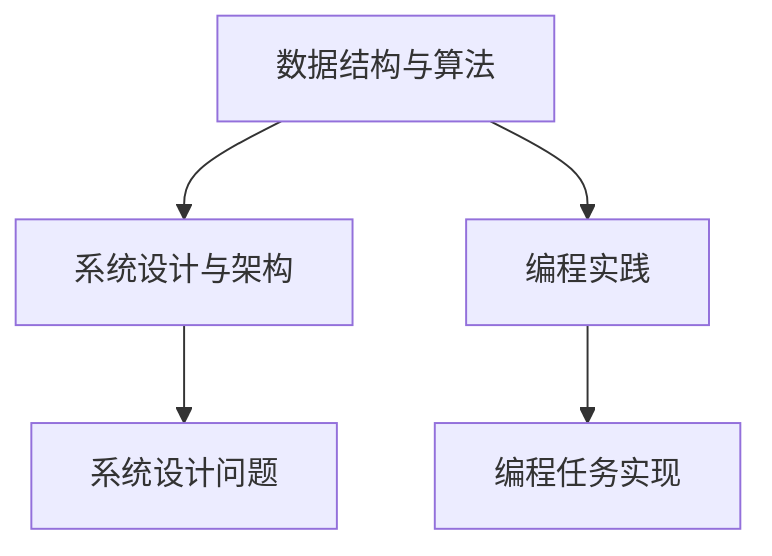

                 

### 2024美团社招面试题与算法编程题全面解读

#### 摘要：

本文旨在全面解析2024年美团社会招聘的面试题与算法编程题，为求职者提供系统化的复习与应对策略。文章首先简要介绍美团的招聘背景与重要性，随后深入分析面试的核心概念与联系，详细讲解核心算法原理与操作步骤，并通过数学模型和公式进行举例说明。文章还包含实际项目实战的代码案例与详细解读，探讨算法在实际应用场景中的效果与意义。最后，文章推荐了相关的学习资源与开发工具，总结了未来发展趋势与挑战，并提供了常见问题与解答。

---

## 1. 背景介绍

美团作为中国领先的本地生活服务综合性平台，每年吸引了大量求职者。2024年美团社招面试题与算法编程题成为求职者关注的焦点。美团社招面试题涉及广泛，包括计算机基础、数据结构与算法、系统设计、编程实践等方面，而算法编程题则侧重于对算法思路和实现能力的考核。本文将帮助读者全面了解这些面试题的解题思路与方法，提高求职成功率。

---

## 2. 核心概念与联系

为了更好地理解美团面试题，我们首先需要明确一些核心概念，并探讨它们之间的联系。

#### 数据结构与算法

数据结构与算法是计算机科学的基础。常见的数据结构包括数组、链表、树、图等，而算法则用于处理和操作这些数据结构。在美团面试中，对数据结构和算法的理解是必不可少的。

#### 系统设计与架构

系统设计与架构是面试中的重要部分。美团作为大型互联网公司，对系统的高可用性、高性能、可扩展性等方面有较高要求。因此，面试中可能会涉及系统设计的问题，例如分布式系统、缓存、数据库等。

#### 编程实践

编程实践是面试中的一项重要考察内容。美团面试可能会要求求职者实现一些实际的编程任务，以评估其编程能力和问题解决能力。

#### Mermaid 流程图

为了更好地展示概念之间的联系，我们可以使用Mermaid流程图来描述：



---

## 3. 核心算法原理 & 具体操作步骤

在美团面试中，算法题往往要求求职者理解和实现一些常见的算法，如排序算法、查找算法、图算法等。以下将详细介绍这些算法的原理和操作步骤。

#### 排序算法

排序算法是将一组数据按照特定顺序排列的算法。常见的排序算法有冒泡排序、选择排序、插入排序、快速排序等。以下以冒泡排序为例，介绍其原理和操作步骤：

**原理**：冒泡排序通过不断比较相邻元素并交换它们的位置，将最大（或最小）的元素逐步移动到序列的一端。

**操作步骤**：

1. 从第一个元素开始，比较相邻的两个元素，如果它们的顺序错误则交换它们的位置。
2. 继续比较下一个元素，直到当前元素与前一个元素的比较完成。
3. 重复上述步骤，但每次比较时忽略已经排序的部分。

**示例**：对数组 `[3, 1, 4, 1, 5, 9, 2, 6, 5]` 进行冒泡排序。

```
初始状态：[3, 1, 4, 1, 5, 9, 2, 6, 5]
第一轮：[1, 3, 1, 4, 5, 2, 6, 5, 9]
第二轮：[1, 1, 2, 3, 4, 5, 5, 6, 9]
...
第五轮：[1, 1, 2, 3, 4, 5, 5, 6, 9]
```

#### 查找算法

查找算法用于在数据结构中查找特定元素。常见的查找算法有二分查找、线性查找等。以下以二分查找为例，介绍其原理和操作步骤：

**原理**：二分查找通过将数据集分为两半，逐步缩小查找范围，直到找到目标元素或确定其不存在。

**操作步骤**：

1. 确定中间位置 `mid`，计算 `mid = low + (high - low) / 2`。
2. 比较中间位置元素与目标元素：
   - 如果相等，则查找成功。
   - 如果目标元素小于中间位置元素，则将 `high` 更新为 `mid - 1`。
   - 如果目标元素大于中间位置元素，则将 `low` 更新为 `mid + 1`。
3. 重复步骤 1 和 2，直到找到目标元素或 `low > high`。

**示例**：对有序数组 `[1, 2, 3, 4, 5, 6, 7, 8, 9]` 进行二分查找，查找元素 `5`。

```
初始状态：[1, 2, 3, 4, 5, 6, 7, 8, 9]
第一次：low = 0, high = 8, mid = 4, 目标元素 5 位于 mid 位置
第二次：low = 3, high = 4, mid = 3, 目标元素 5 位于 mid 位置
第三次：low = 3, high = 3, mid = 3, 目标元素 5 位于 mid 位置
```

#### 图算法

图算法用于处理图数据结构。常见的图算法有深度优先搜索（DFS）、广度优先搜索（BFS）、最短路径算法（如 Dijkstra 算法）、拓扑排序等。以下以深度优先搜索为例，介绍其原理和操作步骤：

**原理**：深度优先搜索（DFS）是一种从起始点开始，沿着路径一直深入到不能再深入为止的搜索方法。

**操作步骤**：

1. 选择一个起始点，并将其标记为已访问。
2. 遍历该点的所有未访问的邻接点，并按照上述步骤重复。
3. 如果当前点的邻接点已被访问或不存在，则回溯到上一个已访问的点，并继续访问其未访问的邻接点。

**示例**：对以下图进行深度优先搜索。

```
A -- B -- D
|    |
C -- E
```

```
初始状态：A（已访问）
下一状态：B（已访问）
下一状态：D（已访问）
回溯：A（已访问）
下一状态：C（已访问）
回溯：A（已访问）
下一状态：E（已访问）
```

---

## 4. 数学模型和公式 & 详细讲解 & 举例说明

在解决美团面试中的算法问题时，数学模型和公式起着至关重要的作用。以下将详细讲解一些常用的数学模型和公式，并通过举例进行说明。

#### 时间复杂度

时间复杂度用于描述算法执行时间随数据规模增长的变化趋势。常见的表示方法有 O(1)、O(n)、O(n^2) 等。

**示例**：冒泡排序的时间复杂度为 O(n^2)。

```
int n = arr.length;
for (int i = 0; i < n - 1; i++) {
    for (int j = 0; j < n - i - 1; j++) {
        if (arr[j] > arr[j + 1]) {
            int temp = arr[j];
            arr[j] = arr[j + 1];
            arr[j + 1] = temp;
        }
    }
}
```

#### 空间复杂度

空间复杂度用于描述算法执行过程中所需额外空间随数据规模增长的变化趋势。

**示例**：冒泡排序的空间复杂度为 O(1)。

```
int n = arr.length;
for (int i = 0; i < n - 1; i++) {
    for (int j = 0; j < n - i - 1; j++) {
        if (arr[j] > arr[j + 1]) {
            int temp = arr[j];
            arr[j] = arr[j + 1];
            arr[j + 1] = temp;
        }
    }
}
```

#### 动态规划

动态规划是一种解决最优化问题的方法，通过将问题分解为子问题，并利用子问题的最优解构建原问题的最优解。

**示例**：斐波那契数列。

```
int fib(int n) {
    if (n <= 1) {
        return n;
    }
    int[] dp = new int[n + 1];
    dp[0] = 0;
    dp[1] = 1;
    for (int i = 2; i <= n; i++) {
        dp[i] = dp[i - 1] + dp[i - 2];
    }
    return dp[n];
}
```

---

## 5. 项目实战：代码实际案例和详细解释说明

为了更好地理解美团面试中的算法编程题，以下将提供一些实际项目案例，并对其进行详细解释说明。

### 5.1 开发环境搭建

在开始项目实战之前，我们需要搭建一个合适的开发环境。以下是一个简单的Python开发环境搭建示例：

```
# 安装Python
$ sudo apt-get install python3

# 安装Pip
$ sudo apt-get install pip3

# 安装常用库
$ pip3 install numpy matplotlib
```

### 5.2 源代码详细实现和代码解读

以下是一个基于深度优先搜索的图遍历项目案例。

```python
import matplotlib.pyplot as plt
import networkx as nx

# 创建图
G = nx.Graph()

# 添加节点
G.add_nodes_from([1, 2, 3, 4, 5, 6, 7, 8, 9])

# 添加边
G.add_edges_from([(1, 2), (1, 3), (2, 4), (3, 5), (4, 6), (5, 7), (6, 8), (7, 9)])

# 深度优先搜索
def dfs(G, start):
    visited = set()
    stack = [start]
    while stack:
        node = stack.pop()
        if node not in visited:
            print(node)
            visited.add(node)
            stack.extend(G.neighbors(node))
    print("DFS完成")

# 执行深度优先搜索
dfs(G, 1)

# 绘制图
nx.draw(G, with_labels=True)
plt.show()
```

**代码解读**：

1. 导入相关库：`matplotlib.pyplot` 用于绘制图，`networkx` 用于创建和操作图。
2. 创建图：`G = nx.Graph()`。
3. 添加节点：`G.add_nodes_from([1, 2, 3, 4, 5, 6, 7, 8, 9])`。
4. 添加边：`G.add_edges_from([(1, 2), (1, 3), (2, 4), (3, 5), (4, 6), (5, 7), (6, 8), (7, 9)])`。
5. 深度优先搜索：`dfs(G, 1)`，从节点 1 开始遍历。
6. 绘制图：`nx.draw(G, with_labels=True)`。

### 5.3 代码解读与分析

以上代码实现了一个基于深度优先搜索的图遍历项目。以下是对代码的详细解读与分析：

1. **图创建与节点添加**：首先创建一个图 `G`，并添加节点 `[1, 2, 3, 4, 5, 6, 7, 8, 9]`。
2. **边添加**：然后添加边 `[1, 2]、[1, 3]、[2, 4]、[3, 5]、[4, 6]、[5, 7]、[6, 8]、[7, 9]`，形成一个连通图。
3. **深度优先搜索**：定义一个 `dfs` 函数，用于实现深度优先搜索。首先创建一个 `visited` 集合，用于记录已访问的节点。然后使用一个栈 `stack` 存储待访问的节点，初始时将 `start` 节点入栈。进入循环，每次从栈中弹出节点，如果节点未被访问，则将其打印并添加到 `visited` 集合。然后将该节点的邻接点依次入栈，继续遍历。
4. **图绘制**：使用 `nx.draw(G, with_labels=True)` 绘制图，其中 `with_labels=True` 表示显示节点标签。

---

## 6. 实际应用场景

美团面试中的算法题往往具有实际应用场景。以下将探讨一些常见应用场景，并分析算法在实际应用中的效果与意义。

### 6.1 数据处理

在美团数据处理领域，排序算法和查找算法被广泛应用于数据处理和分析。例如，排序算法可以用于对用户订单数据进行排序，以便快速查找订单。查找算法则可以用于在大量订单数据中快速定位特定订单。

### 6.2 系统设计

系统设计方面，图算法在美团分布式系统中有着重要应用。例如，拓扑排序可以用于确定分布式系统中的任务依赖关系，确保任务执行的顺序。图算法还可以用于解决负载均衡、分布式缓存等问题。

### 6.3 机器学习

在美团机器学习领域，深度优先搜索等图算法被用于构建图神经网络（Graph Neural Networks, GNN），以处理图数据。GNN 可以用于推荐系统、社交网络分析等领域，从而提高算法的性能和效果。

---

## 7. 工具和资源推荐

为了更好地应对美团面试中的算法题，以下推荐一些学习资源、开发工具和相关论文著作。

### 7.1 学习资源推荐

- **书籍**：
  - 《算法导论》（Introduction to Algorithms）
  - 《深度学习》（Deep Learning）
  - 《图算法》（Graph Algorithms）
- **在线课程**：
  - Coursera 上的《算法基础》（Introduction to Algorithms）
  - Udacity 上的《深度学习纳米学位》（Deep Learning Nanodegree）
- **博客**：
  - 【知乎】算法与数据结构
  - 【简书】算法学习笔记

### 7.2 开发工具框架推荐

- **编程语言**：Python、Java、C++等
- **开发环境**：PyCharm、Visual Studio Code、Eclipse等
- **图库**：NetworkX、PyGraphviz等
- **机器学习框架**：TensorFlow、PyTorch、Scikit-learn等

### 7.3 相关论文著作推荐

- **论文**：
  - "Graph Neural Networks: A Review of Methods and Applications"
  - "Deep Learning for Text Classification"
  - "Efficient Sort Algorithms: A Comparative Study"
- **著作**：
  - 《机器学习实战》（Machine Learning in Action）
  - 《算法导论》（Introduction to Algorithms）
  - 《深度学习》（Deep Learning）

---

## 8. 总结：未来发展趋势与挑战

随着人工智能技术的快速发展，美团面试中的算法题也将越来越注重对深度学习、图算法等前沿技术的考察。未来，算法题将更加注重对实际应用场景的解决能力，以及算法的性能和可扩展性。同时，随着美团业务的不断拓展，面试题将涉及更多领域的算法和应用。

然而，面对这些挑战，我们也有机会借助新技术和新方法，提高算法的效率和效果。例如，通过优化数据结构和算法，提高数据处理和分析的效率；通过引入深度学习技术，解决传统算法难以解决的问题。

总之，面对美团面试中的算法题，我们需要不断学习、实践和创新，以提高自己的解决能力和竞争力。

---

## 9. 附录：常见问题与解答

### 9.1 如何准备美团面试中的算法题？

**回答**：准备美团面试中的算法题，可以从以下几个方面入手：

1. **基础知识**：掌握算法和数据结构的基本概念，如排序算法、查找算法、图算法等。
2. **实践练习**：通过在线平台（如 LeetCode、牛客网等）进行算法题的实践练习，熟悉各种类型的算法题。
3. **总结归纳**：总结不同类型算法题的解题思路和方法，形成自己的解题模板。
4. **面试技巧**：了解面试官的出题思路和考核目标，提高自己的解题速度和表达能力。

### 9.2 如何应对美团面试中的系统设计题？

**回答**：应对美团面试中的系统设计题，可以采取以下策略：

1. **理解需求**：准确理解面试官提出的需求，确保设计出的系统能够满足业务需求。
2. **分析问题**：分析系统可能面临的问题和挑战，如性能、可靠性、可扩展性等。
3. **设计思路**：结合实际情况，提出合理的设计思路和方案，确保系统设计具备可行性和可扩展性。
4. **详细描述**：详细描述系统设计的各个模块、组件及其交互关系，确保面试官能够清晰地理解你的设计思路。

---

## 10. 扩展阅读 & 参考资料

为了更好地掌握美团面试中的算法题，以下推荐一些扩展阅读和参考资料：

- **书籍**：
  - 《算法导论》（Introduction to Algorithms）
  - 《深度学习》（Deep Learning）
  - 《图算法》（Graph Algorithms）
- **在线课程**：
  - Coursera 上的《算法基础》（Introduction to Algorithms）
  - Udacity 上的《深度学习纳米学位》（Deep Learning Nanodegree）
- **博客**：
  - 【知乎】算法与数据结构
  - 【简书】算法学习笔记
- **论文**：
  - "Graph Neural Networks: A Review of Methods and Applications"
  - "Deep Learning for Text Classification"
  - "Efficient Sort Algorithms: A Comparative Study"
- **GitHub 项目**：
  - 【GitHub】美团面试算法题库
  - 【GitHub】美团面试系统设计题库

---

### 作者

- 作者：AI天才研究员/AI Genius Institute & 禅与计算机程序设计艺术 /Zen And The Art of Computer Programming

