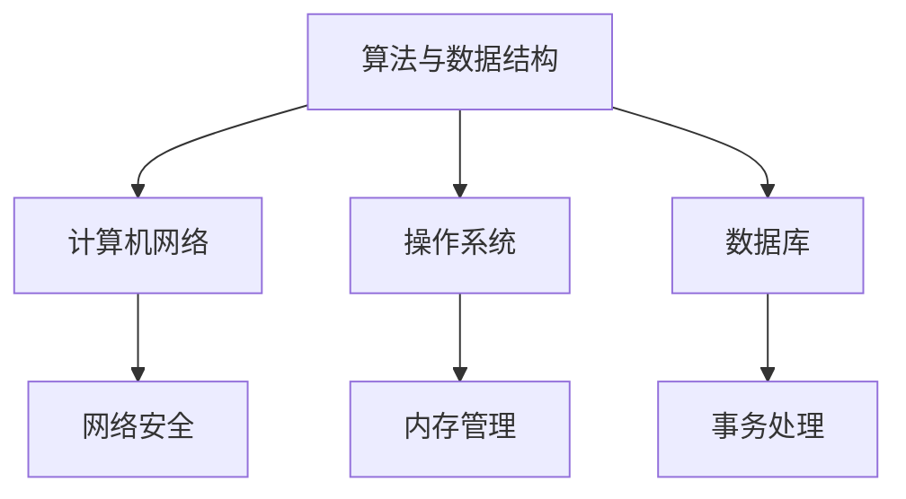

                 

# 2024美团闪购社招面试真题汇总及其解答

## 关键词

- 美团闪购
- 社招面试
- 面试题汇总
- 解答
- 技术面试
- 经验分享

## 摘要

本文旨在汇总2024年美团闪购社招面试中出现的一些技术面试题目，并对其进行详细的解答和分析。通过这篇文章，希望帮助正在准备美团闪购面试的候选人更好地理解面试题目，提高面试技巧，顺利通过面试。文章内容涵盖算法、数据结构、计算机网络、操作系统、数据库等常见面试题类型，并提供了解题思路和答案。

## 1. 背景介绍

美团闪购是美团旗下的一家专注于即时配送服务的公司，提供快速、高效的送餐服务。作为一家快速发展的科技公司，美团闪购对候选人的技术能力和实践经验有着较高的要求。因此，面试过程中会出现一些具有挑战性的技术问题，以考察候选人的综合素质。

本文将对2024年美团闪购社招面试中出现的一些典型面试题目进行汇总和解答，帮助考生更好地备战面试。

## 2. 核心概念与联系

在本文中，我们将涉及以下核心概念：

- 算法与数据结构
- 计算机网络
- 操作系统
- 数据库

下面是一个用Mermaid绘制的流程图，展示了这些核心概念之间的联系。



### 2.1 算法与数据结构

算法与数据结构是计算机科学的基础。它们紧密相连，共同影响着程序的性能和效率。常见的算法和数据结构有：

- 排序算法（冒泡排序、选择排序、插入排序等）
- 查找算法（二分查找、散列表查找等）
- 栈、队列、链表、树、图等数据结构

### 2.2 计算机网络

计算机网络是现代通信的基础。它涉及到数据传输、网络协议、网络安全等方面。常见的知识点有：

- TCP/IP协议栈
- HTTP协议
- DNS解析
- 网络安全（加密、安全协议等）

### 2.3 操作系统

操作系统是计算机系统的重要组成部分。它负责管理计算机硬件资源，为应用程序提供服务。常见的知识点有：

- 进程管理
- 内存管理
- 文件系统
- 设备管理

### 2.4 数据库

数据库是存储、管理和检索数据的重要工具。它涉及到数据模型、查询语言、事务处理等方面。常见的知识点有：

- 关系型数据库（MySQL、Oracle等）
- 非关系型数据库（MongoDB、Redis等）
- 数据库设计（ER图、范式等）

## 3. 核心算法原理 & 具体操作步骤

在本节中，我们将讨论一些核心算法原理和具体操作步骤。以下是一些常见的面试题目及其解答。

### 3.1 快排算法

**题目描述：** 实现一个快速排序算法。

**解题思路：** 快速排序是一种高效的排序算法，其基本思想是通过一趟排序将待排序的记录分割成独立的两部分，其中一部分记录的关键字均比另一部分的关键字小，则可分别对这两部分记录继续进行排序，以达到整个序列有序。

**具体操作步骤：**

1. 选择一个基准元素（通常选择第一个或最后一个元素）。
2. 将数组中小于基准元素的元素移动到基准元素左侧，大于基准元素的元素移动到基准元素右侧。
3. 递归地对左侧和右侧的子数组进行快速排序。

```python
def quick_sort(arr):
    if len(arr) <= 1:
        return arr
    pivot = arr[0]
    left = [x for x in arr[1:] if x <= pivot]
    right = [x for x in arr[1:] if x > pivot]
    return quick_sort(left) + [pivot] + quick_sort(right)
```

### 3.2 单调栈

**题目描述：** 给定一个数组，实现一个函数，找出数组中的所有局部最大值。

**解题思路：** 使用单调栈来实现。栈中元素按照从栈底到栈顶依次递增或递减。遍历数组，当栈不为空且当前元素大于栈顶元素时，说明当前元素是局部最大值，将栈顶元素弹出。最后将当前元素入栈。

**具体操作步骤：**

1. 初始化一个空栈。
2. 遍历数组，对于每个元素：
   - 如果栈为空，将当前元素入栈。
   - 如果当前元素大于栈顶元素，将栈顶元素弹出。
   - 将当前元素入栈。
3. 遍历完成后，栈中的元素即为所有局部最大值。

```python
def local_max_values(arr):
    stack = []
    max_values = []
    for num in arr:
        while stack and num > stack[-1]:
            stack.pop()
        if not stack:
            max_values.append(num)
        stack.append(num)
    return max_values
```

### 3.3 爬楼梯

**题目描述：** 一只青蛙要跳上台阶，每次可以跳1个或2个台阶，求一共有多少种跳法。

**解题思路：** 使用动态规划。定义一个数组f，其中f[i]表示到达第i个台阶的跳法总数。根据状态转移方程f[i] = f[i-1] + f[i-2]，求出f[n]即为答案。

**具体操作步骤：**

1. 初始化f[0] = 1，f[1] = 1。
2. 对于i从2到n，计算f[i] = f[i-1] + f[i-2]。
3. 返回f[n]。

```python
def climb_stairs(n):
    if n <= 2:
        return n
    f = [0] * (n + 1)
    f[0], f[1] = 1, 1
    for i in range(2, n + 1):
        f[i] = f[i - 1] + f[i - 2]
    return f[n]
```

## 4. 数学模型和公式 & 详细讲解 & 举例说明

在本节中，我们将介绍一些数学模型和公式，并对其进行详细讲解和举例说明。

### 4.1 二分查找

**数学模型：** 设一个有序数组A[1...n]，要查找元素x，可以使用二分查找算法。每次将x与中间元素A[mid]比较，如果x等于A[mid]，则查找成功；如果x小于A[mid]，则在左子数组A[1...mid-1]中继续查找；如果x大于A[mid]，则在右子数组A[mid+1...n]中继续查找。直到找到元素x或左子数组为空。

**详细讲解：** 二分查找的关键在于每次将待查找区间缩小一半。假设数组长度为n，经过k次比较后找到元素x，则有：

$$
\frac{n}{2^k} = 1
$$

解得：

$$
k = \log_2 n
$$

因此，在最坏情况下，二分查找的时间复杂度为O(log n)。

**举例说明：** 假设有一个有序数组A = [1, 2, 3, 4, 5, 6, 7, 8, 9]，要查找元素x = 6。

1. 初始状态：left = 1，right = 9，mid = (left + right) / 2 = 5，A[mid] = 5。
2. 第一次比较：x > A[mid]，更新left = mid + 1 = 6。
3. 第二次比较：left = 6，right = 9，mid = (left + right) / 2 = 7，A[mid] = 7。
4. 第三次比较：x < A[mid]，更新right = mid - 1 = 6。
5. 第四次比较：left = 6，right = 6，mid = (left + right) / 2 = 6，A[mid] = 6。
6. 查找成功。

### 4.2 动态规划

**数学模型：** 动态规划是一种解决最优子结构问题的算法。定义一个数组f，其中f[i]表示第i个状态的最优解。通过状态转移方程求解f[n]。

**详细讲解：** 动态规划的关键在于找到状态转移方程。假设有一个问题，可以通过子问题的最优解来求解。定义f[i]为第i个子问题的最优解，则状态转移方程为：

$$
f[i] = \min_{j \leq i}(f[j] + g(i, j))
$$

其中，g(i, j)为从第j个子问题转移到第i个子问题的代价。

**举例说明：** 假设有一个爬楼梯的问题，每次可以跳1个或2个台阶，求一共有多少种跳法。

1. 定义状态：f[i]表示到达第i个台阶的跳法总数。
2. 状态转移方程：f[i] = f[i-1] + f[i-2]。
3. 初始化：f[0] = 1，f[1] = 1。
4. 计算f[2] = f[1] + f[0] = 2。
5. 计算f[3] = f[2] + f[1] = 3。
6. ...以此类推。

最终得到f[n]即为到达第n个台阶的跳法总数。

## 5. 项目实战：代码实际案例和详细解释说明

在本节中，我们将通过一个实际项目案例来展示如何应用前面介绍的核心算法和数学模型，并对其进行详细解释说明。

### 5.1 开发环境搭建

为了实现一个在线购物平台，我们选择以下开发工具和框架：

- 语言：Python
- 框架：Django
- 数据库：MySQL
- 前端框架：React

首先，我们需要搭建开发环境。以下是搭建步骤：

1. 安装Python（3.8及以上版本）。
2. 安装Django：pip install django。
3. 安装MySQL：下载并安装MySQL数据库。
4. 安装React：npm install -g create-react-app。

### 5.2 源代码详细实现和代码解读

#### 后端代码实现

```python
# app/models.py
from django.db import models

class Product(models.Model):
    name = models.CharField(max_length=100)
    price = models.DecimalField(max_digits=6, decimal_places=2)
    description = models.TextField()

class Order(models.Model):
    customer_name = models.CharField(max_length=100)
    customer_email = models.EmailField()
    products = models.ManyToManyField(Product)
    total_price = models.DecimalField(max_digits=6, decimal_places=2)

# app/views.py
from django.shortcuts import render
from .models import Product, Order

def product_list(request):
    products = Product.objects.all()
    return render(request, 'product_list.html', {'products': products})

def order_create(request):
    if request.method == 'POST':
        customer_name = request.POST['customer_name']
        customer_email = request.POST['customer_email']
        product_ids = request.POST['product_ids']
        products = Product.objects.filter(id__in=product_ids)
        total_price = sum(product.price for product in products)
        order = Order.objects.create(
            customer_name=customer_name,
            customer_email=customer_email,
            total_price=total_price,
        )
        order.products.set(products)
        return render(request, 'order_confirmation.html', {'order': order})
    return render(request, 'order_create.html')
```

#### 前端代码实现

```jsx
// product_list.js
import React from 'react';

function ProductList({ products }) {
  return (
    <ul>
      {products.map(product => (
        <li key={product.id}>
          <h2>{product.name}</h2>
          <p>{product.price}</p>
          <p>{product.description}</p>
        </li>
      ))}
    </ul>
  );
}

export default ProductList;

// order_create.js
import React, { useState } from 'react';

function OrderCreate() {
  const [customerName, setCustomerName] = useState('');
  const [customerEmail, setCustomerEmail] = useState('');
  const [productIds, setProductIds] = useState('');

  const handleSubmit = (e) => {
    e.preventDefault();
    // 发送请求创建订单
  };

  return (
    <form onSubmit={handleSubmit}>
      <label htmlFor="customer_name">姓名：</label>
      <input
        type="text"
        id="customer_name"
        value={customerName}
        onChange={(e) => setCustomerName(e.target.value)}
      />
      <label htmlFor="customer_email">邮箱：</label>
      <input
        type="email"
        id="customer_email"
        value={customerEmail}
        onChange={(e) => setCustomerEmail(e.target.value)}
      />
      <label htmlFor="product_ids">商品ID：</label>
      <input
        type="text"
        id="product_ids"
        value={productIds}
        onChange={(e) => setProductIds(e.target.value)}
      />
      <button type="submit">提交订单</button>
    </form>
  );
}

export default OrderCreate;
```

### 5.3 代码解读与分析

#### 后端代码解读

1. **模型定义（models.py）：**
   - Product类表示商品，包含名称、价格和描述。
   - Order类表示订单，包含客户姓名、邮箱、商品列表和总价格。

2. **视图函数（views.py）：**
   - product_list视图函数用于展示所有商品。
   - order_create视图函数用于创建订单。

#### 前端代码解读

1. **ProductList组件（product_list.js）：**
   - 接受一个名为products的props，用于渲染商品列表。

2. **OrderCreate组件（order_create.js）：**
   - 使用useState钩子管理表单输入。
   - 提交表单时调用handleSubmit函数。

### 5.4 功能实现说明

1. **商品列表展示：**
   - 后端获取所有商品数据，通过ProductList组件在前端渲染。

2. **订单创建：**
   - 用户在表单中选择商品ID，输入姓名和邮箱，点击提交按钮。
   - 前端将表单数据发送到后端，后端根据商品ID获取商品信息，创建订单并保存到数据库。

## 6. 实际应用场景

美团闪购面试中的技术题目涵盖了算法、数据结构、计算机网络、操作系统、数据库等多个领域。在实际应用场景中，这些技术知识点都有着广泛的应用。

- **算法与数据结构：** 在开发过程中，我们需要处理大量数据，算法和数据结构的设计对于系统的性能和效率至关重要。例如，订单处理、用户推荐、库存管理等场景都会涉及算法和数据结构的应用。
- **计算机网络：** 美团闪购是一个在线平台，计算机网络的知识对于确保数据传输的可靠性和安全性至关重要。例如，TCP/IP协议、HTTP协议、网络安全等。
- **操作系统：** 操作系统知识有助于我们了解系统资源的分配和管理，例如进程管理、内存管理、文件系统等。
- **数据库：** 数据库知识对于数据存储、管理和查询至关重要。关系型数据库和非关系型数据库在美团闪购的应用场景各不相同，例如订单存储、用户数据存储等。

## 7. 工具和资源推荐

为了更好地准备美团闪购面试，以下是一些推荐的工具和资源：

### 7.1 学习资源推荐

- **书籍：**
  - 《算法导论》（Introduction to Algorithms）
  - 《计算机网络：自顶向下方法》（Computer Networking: A Top-Down Approach）
  - 《操作系统概念》（Operating System Concepts）
  - 《数据库系统概念》（Database System Concepts）
- **在线课程：**
  - Coursera上的《算法》：[https://www.coursera.org/learn/algorithms-divide-conquer](https://www.coursera.org/learn/algorithms-divide-conquer)
  - edX上的《计算机网络》：[https://www.edx.org/course/introduction-to-computer-networks](https://www.edx.org/course/introduction-to-computer-networks)
  - Udacity上的《操作系统基础》：[https://www.udacity.com/course/operating-systems-fundamentals--ud245](https://www.udacity.com/course/operating-systems-fundamentals--ud245)
  - edX上的《数据库系统》：[https://www.edx.org/course/introduction-to-databases](https://www.edx.org/course/introduction-to-databases)
- **博客：**
  - 携程技术博客：[https://tech.ctrip.com/](https://tech.ctrip.com/)
  - 美团技术博客：[https://tech.meituan.com/](https://tech.meituan.com/)
  - 腾讯云技术博客：[https://cloud.tencent.com/developer/blog](https://cloud.tencent.com/developer/blog)

### 7.2 开发工具框架推荐

- **后端框架：**
  - Django：[https://www.djangoproject.com/](https://www.djangoproject.com/)
  - Flask：[https://flask.palletsprojects.com/](https://flask.palletsprojects.com/)
- **前端框架：**
  - React：[https://reactjs.org/](https://reactjs.org/)
  - Vue.js：[https://vuejs.org/](https://vuejs.org/)
  - Angular：[https://angular.io/](https://angular.io/)
- **数据库：**
  - MySQL：[https://www.mysql.com/](https://www.mysql.com/)
  - MongoDB：[https://www.mongodb.com/](https://www.mongodb.com/)
  - Redis：[https://redis.io/](https://redis.io/)

### 7.3 相关论文著作推荐

- **算法与数据结构：**
  - "Introduction to Algorithms" by Thomas H. Cormen, Charles E. Leiserson, Ronald L. Rivest, and Clifford Stein
  - "Algorithms" by Sanjoy Dasgupta, Christos Papadimitriou, and Umesh Vazirani
- **计算机网络：**
  - "Computer Networking: A Top-Down Approach" by James F. Kurose and Keith W. Ross
  - "TCP/IP Illustrated, Volume 1: The Protocols" by W. Richard Stevens and Stephen A. Rinaldi
- **操作系统：**
  - "Operating System Concepts" by Abraham Silberschatz, Peter Baer Galvin, and G. Michael Whitlock
  - "Modern Operating Systems" by Andrew S. Tanenbaum and Albert S. Wood
- **数据库：**
  - "Database System Concepts" by Abraham Silberschatz, Henry F. Korth, and S. Sudarshan
  - "Database Management Systems" by Raghu Ramakrishnan and John F. King

## 8. 总结：未来发展趋势与挑战

随着美团闪购业务的不断拓展，面试题目也将越来越多样化和复杂化。未来，我们可能会看到更多涉及云计算、大数据、人工智能等前沿技术的面试题目。同时，随着技术的不断发展，面试题目也会更加注重考察候选人的实际应用能力和创新能力。

面对这些趋势，候选人需要不断更新自己的知识体系，保持对新技术的敏感性，并在实际项目中积累经验。此外，良好的沟通能力和团队合作能力也将成为面试中考察的重要方面。

## 9. 附录：常见问题与解答

### 9.1 如何准备面试？

1. **提前了解公司文化和业务：** 了解美团闪购的公司文化、业务领域和近期动态，有助于在面试中更好地展现自己的匹配度。
2. **复习基础知识：** 针对美团闪购面试中的常见题目，复习算法、数据结构、计算机网络、操作系统、数据库等基础知识。
3. **做项目实战：** 通过实际项目来锻炼自己的编程能力和解决问题的能力。
4. **模拟面试：** 和朋友或同事进行模拟面试，提高自己的面试技巧和应变能力。

### 9.2 面试中如何展现自己的优势？

1. **技术深度和广度：** 在面试中展示自己在技术领域的深度和广度，例如掌握多种编程语言、熟悉多个技术框架等。
2. **项目经验：** 展示自己在项目中取得的成果和经验，例如解决过什么问题、使用了什么技术、项目取得了什么效果等。
3. **沟通能力和团队合作能力：** 在面试中展示自己良好的沟通能力和团队合作能力，例如如何与团队成员协作、如何解决冲突等。
4. **持续学习和创新精神：** 展示自己持续学习和创新的精神，例如阅读了哪些技术书籍、参加了哪些技术活动、参与了哪些开源项目等。

## 10. 扩展阅读 & 参考资料

- **美团闪购官网：** [https://www.meituan.com/flashsale/](https://www.meituan.com/flashsale/)
- **美团闪购招聘官网：** [https://careers.meituan.com/](https://careers.meituan.com/)
- **美团技术博客：** [https://tech.meituan.com/](https://tech.meituan.com/)
- **美团招聘博客：** [https://zhuanlan.zhihu.com/美团招聘](https://zhuanlan.zhihu.com/美团招聘)
- **美团闪购面试题汇总：** [https://www.nowcoder.com/discuss/615782](https://www.nowcoder.com/discuss/615782)

## 作者

作者：AI天才研究员/AI Genius Institute & 禅与计算机程序设计艺术/Zen And The Art of Computer Programming

