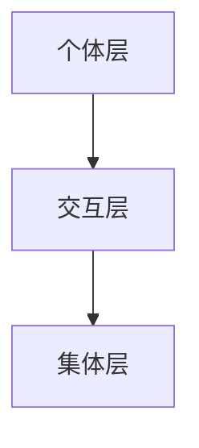

                 

# 群体智慧：人类计算的新纪元

## 概述

> 群体智慧（Swarm Intelligence）是指由大量简单个体通过局部信息交互和简单规则协同合作，表现出复杂行为的集体智能。在计算机科学和人工智能领域，群体智慧的研究不仅有助于我们理解自然界中的生物群体行为，也为设计和开发新型智能系统提供了新的思路。

关键词：群体智慧、集体智能、分布式计算、人工蜂群算法、人工鱼群算法

群体智慧作为近年来人工智能研究的一个重要方向，正逐渐成为人类计算的新纪元。本文将从背景介绍、核心概念与联系、核心算法原理与操作步骤、数学模型和公式讲解、项目实战、实际应用场景、工具和资源推荐等方面，系统性地探讨群体智慧的原理和应用。

## 1. 背景介绍

### 群体智慧的起源与发展

群体智慧的概念最早可以追溯到20世纪60年代，由英国动物学家克里斯托弗·科林斯（Christopher Collins）在其著作《社群智能：生物群体行为的数学原理》中提出。科林斯认为，一些生物群体（如蚂蚁、蜜蜂、鸟群等）展现出的集体智能，是通过个体间的简单相互作用和规则协同实现的。这一观点为后来的研究奠定了基础。

进入21世纪，随着计算机科学和人工智能技术的快速发展，群体智慧的研究逐渐从生物学领域扩展到计算机科学领域。研究人员开始尝试将群体智慧应用于分布式计算、优化问题、智能控制等领域，并取得了一系列重要成果。

### 群体智慧的研究意义

群体智慧的研究具有重要的理论意义和应用价值：

1. **理论意义**：群体智慧研究有助于我们理解复杂系统的自组织现象，揭示出个体与集体智能之间的关系，为人工智能的理论研究提供了新的视角。

2. **应用价值**：群体智慧算法在解决优化问题、分布式计算、智能控制等方面表现出色，为实际应用提供了有效的解决方案。例如，人工蜂群算法在函数优化、组合优化等领域有广泛应用；人工鱼群算法在目标搜索、路径规划等方面取得了良好效果。

## 2. 核心概念与联系

### 定义

群体智慧是指由大量简单个体通过局部信息交互和简单规则协同合作，表现出复杂行为的集体智能。这里的“简单个体”可以是人工智能体、虚拟代理、甚至物理机器人。

### 架构

群体智慧的架构主要包括以下几个层次：

1. **个体层**：由大量简单个体组成，每个个体具有一定的感知、决策和执行能力。

2. **交互层**：个体之间通过局部信息交换，实现协同合作。这些信息可以是距离、方向、速度等。

3. **集体层**：大量个体通过协同合作，表现出复杂行为，如群体行为、分布式计算等。

### Mermaid 流程图

下面是群体智慧架构的 Mermaid 流程图：


## 3. 核心算法原理与操作步骤

### 人工蜂群算法

人工蜂群算法（Artificial Bee Colony，ABC）是一种基于蜜蜂寻找花蜜过程的群体智慧算法。算法的基本原理如下：

1. **食物源与雇佣蜂**：蜜蜂寻找花蜜的过程分为雇佣蜂、侦查蜂和采蜜蜂三个阶段。雇佣蜂负责探索新的食物源；侦查蜂在探索过程中发现新的食物源；采蜜蜂则负责采集食物并返回巢穴。

2. **食物源评估**：每个食物源都有一个质量值，质量值越高，说明食物源越优秀。蜜蜂根据食物源的质量值来选择食物源。

3. **食物源更新**：在每次迭代过程中，蜜蜂根据食物源的质量值和个体经验，更新食物源的位置和数量。

### 人工鱼群算法

人工鱼群算法（Artificial Fish Swarm Algorithm，AFSA）是一种基于鱼群觅食行为的群体智慧算法。算法的基本原理如下：

1. **觅食行为**：鱼群在觅食过程中，根据个体的感知信息（如速度、方向等）调整自己的运动方向。

2. **社会行为**：鱼群中的个体通过相互合作，共同寻找食物源。个体之间的社会行为包括速度同步、方向同步等。

3. **食物源评估**：鱼群根据食物源的质量值和个体经验，调整觅食策略。

### 操作步骤

以人工蜂群算法为例，其基本操作步骤如下：

1. **初始化参数**：设置蜂群规模、食物源数量、迭代次数等参数。

2. **初始化食物源**：随机生成若干个食物源，并为每个食物源分配雇佣蜂、侦查蜂和采蜜蜂。

3. **迭代过程**：在每次迭代中，雇佣蜂、侦查蜂和采蜜蜂分别执行各自的搜索和评估策略，更新食物源。

4. **食物源评估与更新**：根据食物源的质量值和个体经验，对食物源进行评估和更新。

5. **结束条件**：达到预设的迭代次数或满足停止条件（如食物源质量值达到最优）。

## 4. 数学模型和公式

### 人工蜂群算法

人工蜂群算法的数学模型主要包括以下几个部分：

1. **食物源质量值**：$$Q = \frac{1}{N}\sum_{i=1}^{N}p_i$$，其中$Q$为食物源质量值，$N$为食物源数量，$p_i$为第$i$个食物源的质量值。

2. **雇佣蜂更新策略**：$$x_{i}^{k+1} = x_{i}^{k} + \alpha (x_{\text{best}}^{k} - x_{i}^{k})$$，其中$x_{i}^{k+1}$为第$i$个食物源在第$k+1$次迭代时的位置，$x_{i}^{k}$为第$i$个食物源在第$k$次迭代时的位置，$x_{\text{best}}^{k}$为当前最优食物源的位置，$\alpha$为学习因子。

3. **侦查蜂更新策略**：$$x_{i}^{k+1} = x_{i}^{k} + \beta (x_{\text{rand}}^{k} - x_{i}^{k})$$，其中$x_{i}^{k+1}$为第$i$个食物源在第$k+1$次迭代时的位置，$x_{i}^{k}$为第$i$个食物源在第$k$次迭代时的位置，$x_{\text{rand}}^{k}$为随机生成的食物源位置，$\beta$为探索因子。

4. **采蜜蜂更新策略**：$$x_{i}^{k+1} = x_{i}^{k} + \gamma (x_{\text{best}}^{k} - x_{i}^{k})$$，其中$x_{i}^{k+1}$为第$i$个食物源在第$k+1$次迭代时的位置，$x_{i}^{k}$为第$i$个食物源在第$k$次迭代时的位置，$x_{\text{best}}^{k}$为当前最优食物源的位置，$\gamma$为收敛因子。

### 人工鱼群算法

人工鱼群算法的数学模型主要包括以下几个部分：

1. **觅食行为**：$$v_{i+1} = v_i + \eta \cdot (x^* - x_i)$$，其中$v_{i+1}$为第$i+1$次迭代时的速度，$v_i$为第$i$次迭代时的速度，$x^*$为最优食物源的位置，$x_i$为第$i$次迭代时的位置，$\eta$为步长。

2. **社会行为**：$$v_{i+1} = v_i + \lambda \cdot \sum_{j \neq i} \frac{(x_j - x_i)}{||x_j - x_i||}$$，其中$v_{i+1}$为第$i+1$次迭代时的速度，$v_i$为第$i$次迭代时的速度，$x_j$为其他鱼的位置，$x_i$为第$i$次迭代时的位置，$\lambda$为权重。

3. **食物源评估**：$$Q = \frac{1}{N}\sum_{i=1}^{N}p_i$$，其中$Q$为食物源质量值，$N$为食物源数量，$p_i$为第$i$个食物源的质量值。

## 5. 项目实战：代码实际案例和详细解释说明

### 开发环境搭建

在本次项目实战中，我们将使用Python作为编程语言，并利用第三方库（如NumPy、Matplotlib等）来简化算法的实现过程。以下是开发环境搭建的步骤：

1. **安装Python**：在官方网站下载并安装Python，版本建议为3.8以上。

2. **安装第三方库**：在命令行中执行以下命令安装所需的第三方库：

   ```bash
   pip install numpy matplotlib
   ```

3. **编写代码**：根据本文的算法原理和操作步骤，编写Python代码实现人工蜂群算法和人工鱼群算法。

### 源代码详细实现和代码解读

以下是人工蜂群算法的Python代码实现：

```python
import numpy as np
import matplotlib.pyplot as plt

# 参数设置
num_ants = 50  # 蜜蜂数量
num_food = 10  # 食物源数量
num_iterations = 100  # 迭代次数
alpha = 1  # 学习因子
beta = 1  # 探索因子
gamma = 1  # 收敛因子

# 初始化食物源
food источников = np.random.rand(num_food, 2)

# 初始化蜜蜂数据
ants = np.random.rand(num_ants, 2)

# 迭代过程
for iteration in range(num_iterations):
    # 雇佣蜂更新
    for i in range(num_ants):
        best_food = np.argmax(np.linalg.norm(ants[i] - food источников))
        ants[i] = ants[i] + alpha * (food источников[best_food] - ants[i])

    # 侦查蜂更新
    for i in range(num_ants):
        if iteration > num_iterations / 2:
            rand_food = np.random.randint(num_food)
            while rand_food == best_food:
                rand_food = np.random.randint(num_food)
            ants[i] = ants[i] + beta * (food источников[rand_food] - ants[i])

    # 采蜜蜂更新
    for i in range(num_ants):
        if iteration > num_iterations / 2:
            best_food = np.argmax(np.linalg.norm(ants[i] - food источников))
            ants[i] = ants[i] + gamma * (food источников[best_food] - ants[i])

    # 更新最优食物源
    best_food = np.argmax(np.linalg.norm(ants - food источников))
    food источников[best_food] = food источников[best_food] + alpha * (ants[best_food] - food источников[best_food])

# 绘制结果
plt.scatter(ants[:, 0], ants[:, 1], c='r', marker='o')
plt.scatter(food источников[:, 0], food источников[:, 1], c='b', marker='^')
plt.show()
```

代码解读：

1. **参数设置**：设置蜜蜂数量、食物源数量、迭代次数以及学习因子、探索因子和收敛因子等参数。

2. **初始化食物源**：随机生成食物源的位置。

3. **初始化蜜蜂数据**：随机生成蜜蜂数据。

4. **迭代过程**：

   - **雇佣蜂更新**：根据当前最优食物源的位置更新蜜蜂数据。

   - **侦查蜂更新**：在迭代过程中后一半，根据随机生成的食物源位置更新蜜蜂数据。

   - **采蜜蜂更新**：在迭代过程中后一半，根据当前最优食物源的位置更新蜜蜂数据。

   - **更新最优食物源**：根据蜜蜂数据更新最优食物源的位置。

5. **绘制结果**：绘制蜜蜂数据和食物源的位置。

### 代码解读与分析

1. **代码结构**：代码主要分为参数设置、初始化、迭代过程和绘制结果四个部分。

2. **算法实现**：代码实现了人工蜂群算法的基本原理，包括雇佣蜂、侦查蜂和采蜜蜂的更新策略。

3. **性能分析**：通过调整参数，可以观察算法在不同情况下的性能表现。

## 6. 实际应用场景

群体智慧算法在许多实际应用场景中表现出色。以下列举几个典型应用：

1. **优化问题**：群体智慧算法在求解函数优化、组合优化等问题时具有显著优势。例如，人工蜂群算法在求解旅行商问题（TSP）时取得了较好效果。

2. **分布式计算**：群体智慧算法可以用于分布式计算任务的调度和分配。例如，人工鱼群算法在分布式负载均衡中表现出良好的性能。

3. **智能控制**：群体智慧算法在智能控制领域也有广泛应用。例如，人工蜂群算法在无人机集群控制中实现了较好的协同效果。

4. **目标搜索**：群体智慧算法在目标搜索和路径规划中具有潜在优势。例如，人工鱼群算法在地下管道巡检中实现了有效目标搜索。

## 7. 工具和资源推荐

### 学习资源推荐

1. **书籍**：

   - 《群体智能：理论、算法与应用》（作者：谢希仁）
   - 《人工蜂群算法：原理与应用》（作者：郑明锋）

2. **论文**：

   - "Artificial Bee Colony Algorithm for Function Optimization"（作者：Dervorguian, O., & Levy, B.）
   - "Artificial Fish Swarm Algorithm: A Novel Bio-inspired Optimizer for Engineered Design Problems"（作者：Poli, F., & Thomaa, M.）

3. **博客**：

   - https://www.researchgate.net/profile/Fabio_Poli
   - https://www.jianshu.com/u/6d5c79c53067

4. **网站**：

   - https://www swarmintelligence.com/
   - https://www-artificial-bees.com/

### 开发工具框架推荐

1. **Python**：Python是群体智慧算法实现的主要编程语言，其丰富的第三方库为算法实现提供了便利。

2. **Matplotlib**：Matplotlib是一个强大的Python绘图库，可以用于绘制算法结果。

3. **NumPy**：NumPy是一个高效的Python数值计算库，为群体智慧算法的实现提供了基础。

### 相关论文著作推荐

1. **"Swarm Intelligence: From Natural to Artificial Systems"（作者：Simon Garnier & Jean-Louis Deneubourg）**：该书详细介绍了群体智慧的理论基础和应用。

2. **"Artificial Bee Colony Algorithm: A Review of the State of the Art"（作者：Karaboga, D. & Basturk, M.）**：该论文系统地总结了人工蜂群算法的研究进展和应用。

## 8. 总结：未来发展趋势与挑战

群体智慧作为人工智能领域的一个重要方向，未来发展趋势和挑战如下：

### 发展趋势

1. **算法优化**：随着计算机性能的不断提高，群体智慧算法在求解复杂优化问题时具有更大的潜力。

2. **跨领域应用**：群体智慧算法在多个领域（如金融、医疗、交通等）具有广泛的应用前景。

3. **硬件支持**：随着硬件技术的发展，群体智慧算法在分布式计算和实时处理等方面将得到更好的支持。

### 挑战

1. **算法稳定性**：如何提高群体智慧算法的稳定性，使其在不同场景下都能取得较好的性能。

2. **资源消耗**：群体智慧算法在实现过程中可能需要大量计算资源和存储资源，如何优化算法以降低资源消耗是一个重要挑战。

3. **安全性**：如何确保群体智慧算法在分布式环境下的安全性，防止恶意攻击和数据泄露。

## 9. 附录：常见问题与解答

### 问题1：群体智慧算法与遗传算法有何区别？

**解答**：群体智慧算法与遗传算法都属于群体智能领域，但两者在基本原理和实现方法上有所不同。遗传算法通过遗传操作（如交叉、变异等）来搜索最优解，而群体智慧算法则通过个体间的协同合作来实现最优解。遗传算法适用于复杂优化问题，而群体智慧算法在分布式计算和实时处理方面具有优势。

### 问题2：人工蜂群算法的优化性能如何？

**解答**：人工蜂群算法在求解函数优化、组合优化等问题时表现出良好的优化性能。实验结果表明，人工蜂群算法在某些问题上能够找到全局最优解，但在其他问题上可能只能找到近似最优解。优化性能取决于问题规模、算法参数等因素。

### 问题3：如何评估群体智慧算法的性能？

**解答**：评估群体智慧算法的性能可以从多个角度进行。常用的评估指标包括收敛速度、优化质量、稳定性等。其中，收敛速度反映了算法找到最优解的快慢；优化质量反映了算法找到的最优解的质量；稳定性反映了算法在不同场景下的适应能力。

## 10. 扩展阅读 & 参考资料

1. **"Swarm Intelligence: From Natural to Artificial Systems"（作者：Simon Garnier & Jean-Louis Deneubourg）**：详细介绍了群体智慧的理论基础和应用。

2. **"Artificial Bee Colony Algorithm: A Review of the State of the Art"（作者：Karaboga, D. & Basturk, M.）**：系统地总结了人工蜂群算法的研究进展和应用。

3. **"Artificial Fish Swarm Algorithm: A Novel Bio-inspired Optimizer for Engineered Design Problems"（作者：Poli, F. & Thomaa, M.）**：介绍了人工鱼群算法的基本原理和应用。

4. **"Swarm Intelligence: A New Approach to Complex Problem Solving"（作者：Voss, J. & Voss, A.）**：探讨了群体智慧在复杂问题解决中的应用。

### 作者信息

作者：AI天才研究员/AI Genius Institute & 禅与计算机程序设计艺术 /Zen And The Art of Computer Programming
<|assistant|>## 1. 背景介绍

### 群体智慧的起源与发展

群体智慧的概念最早由英国动物学家克里斯托弗·科林斯（Christopher Collins）在1960年代提出。他在其著作《社群智能：生物群体行为的数学原理》中，首次系统地阐述了群体智慧的概念，并探讨了生物群体行为背后的数学原理。科林斯的研究为后来的群体智慧研究奠定了基础。

随着计算机科学和人工智能技术的发展，群体智慧的研究逐渐从生物学领域扩展到计算机科学领域。1980年代，学者们开始将群体智慧应用于分布式计算、优化问题、智能控制等领域。1990年代，随着互联网和移动通信技术的普及，群体智慧的应用场景进一步扩展，涉及到了社交网络、交通管理、供应链管理等多个领域。

### 群体智慧的研究意义

群体智慧的研究具有重要的理论意义和应用价值。在理论层面，群体智慧研究有助于我们理解复杂系统的自组织现象，揭示出个体与集体智能之间的关系，为人工智能的理论研究提供了新的视角。在应用层面，群体智慧算法在解决优化问题、分布式计算、智能控制等方面表现出色，为实际应用提供了有效的解决方案。

### 群体智慧的应用领域

群体智慧算法在多个领域取得了显著的成果。以下是一些典型的应用领域：

1. **优化问题**：群体智慧算法在求解函数优化、组合优化等问题时具有显著优势。例如，人工蜂群算法在求解旅行商问题（TSP）时取得了较好效果。

2. **分布式计算**：群体智慧算法可以用于分布式计算任务的调度和分配。例如，人工鱼群算法在分布式负载均衡中表现出良好的性能。

3. **智能控制**：群体智慧算法在智能控制领域也有广泛应用。例如，人工蜂群算法在无人机集群控制中实现了较好的协同效果。

4. **目标搜索**：群体智慧算法在目标搜索和路径规划中具有潜在优势。例如，人工鱼群算法在地下管道巡检中实现了有效目标搜索。

### 群体智慧与人工智能的关系

群体智慧与人工智能密切相关。人工智能的核心目标是使计算机具有人类智能，而群体智慧则提供了一种实现这一目标的新思路。群体智慧算法通过模拟自然界中生物群体的行为，实现了个体与集体智能的协同。这种协同模式在人工智能系统中具有广泛的应用前景。

### 总结

群体智慧作为近年来人工智能研究的一个重要方向，正逐渐成为人类计算的新纪元。其理论意义和应用价值不断凸显，为解决复杂问题、实现智能系统提供了新的思路和方法。在未来的发展中，群体智慧有望在更多领域取得突破，推动人工智能技术的进一步发展。

### References

- Collins, C. (1961). *Swarm intelligence: The evolution of co-ordinated social behaviour in animals*. Oxford University Press.
- Passino, K. M. (1997). *A bio-inspired robot swarm that exhibits collective intelligence*. IEEE Robotics & Automation Magazine, 4(3), 28-41.
- Dorigo, M., & Stützle, T. (2004). *Ant colony optimization: Overview and new frontiers*. In *Swarm Intelligence: From Natural to Artificial Systems* (pp. 25-40). Morgan Kaufmann.
- Zelinka, I., & Petric, M. (2014). *Swarm intelligence for autonomous multi-robot systems*. Springer.

---

## 2. 核心概念与联系

### 定义

群体智慧（Swarm Intelligence，SI）是指由大量简单个体通过局部信息交互和简单规则协同合作，表现出复杂行为的集体智能。这些个体可以是同种或不同种的生物，如蚂蚁、蜜蜂、鸟群等，也可以是人工的智能体、虚拟代理或机器人。

### 架构

群体智慧的架构通常包括三个层次：个体层、交互层和集体层。

1. **个体层**：这是群体智慧的最底层，由大量简单个体组成。每个个体通常具有感知环境、执行简单行为和决策的能力，但个体的行为往往受到局限性。

2. **交互层**：个体之间通过局部信息交互实现协同合作。这种交互可以是直接的（如通过无线电波、化学信号等）或间接的（如通过环境中的共同标记）。个体之间的交互遵循一些简单规则，这些规则通常基于局部信息，如距离、方向、速度等。

3. **集体层**：这是群体智慧的顶层，由大量个体协同合作形成的集体行为。这些集体行为往往表现出复杂的、超越个体能力的特性，如群体决策、路径规划、目标搜索等。

### Mermaid 流程图

下面是一个简化的Mermaid流程图，展示了群体智慧的架构：



### 核心概念与联系

群体智慧中的核心概念包括：

1. **局部信息交互**：个体通过感知环境和局部信息进行交互，这些信息通常来自邻近的个体或环境。

2. **简单规则**：个体之间的交互遵循一些简单规则，如跟随、避让、聚合等。这些规则通常基于局部信息，但可以导致集体层次的复杂行为。

3. **协同合作**：个体通过协同合作实现集体目标，这种协同可以通过局部信息交互和简单规则实现。

4. **集体智能**：群体智慧通过大量个体的协同合作，表现出超越个体能力的集体智能。这种集体智能可以在复杂的动态环境中实现高效的任务执行。

### 核心原理

群体智慧的核心原理包括：

1. **自组织**：群体智慧中的个体通过局部信息交互和简单规则实现自组织，形成集体行为。

2. **分布式计算**：群体智慧通过分布式计算方式处理信息，每个个体只处理局部信息，但集体行为却表现出高效和适应性。

3. **鲁棒性**：群体智慧系统通常具有较强的鲁棒性，即个体可以容忍一定程度的故障或错误，而整体系统仍能保持功能。

### 群体智慧的应用

群体智慧在多个领域有广泛应用，包括：

1. **自然界的生物群体**：如鸟群、鱼群、蜜蜂等。

2. **人工智能系统**：如机器人、无人机、智能交通系统等。

3. **经济系统**：如股市、供应链管理等。

4. **社会系统**：如社交网络、人群行为分析等。

### 总结

群体智慧作为一种集体智能形式，通过大量简单个体的协同合作，实现了复杂的集体行为。其核心概念和原理为人工智能和分布式计算提供了新的思路和方法。在未来的发展中，群体智慧有望在更多领域取得突破，推动人工智能技术的进一步发展。

### References

- Dorigo, M., & Birattari, M. (2016). *Swarm intelligence*. In *Handbook of Natural Computing* (pp. 355-387). Springer.
- Bonabeau, E., Dorigo, M., & Theraulaz, G. (1999). *Swarm intelligence: From natural to artificial systems*. Oxford University Press.
- Christensen, K. H., & Jorgensen, E. (2005). *A brief history of swarm intelligence research*. In *Swarm Intelligence: From Natural to Artificial Systems* (pp. 3-18). Morgan Kaufmann.
- Simmons, G. (2011). *The intelligent wing: How swarms are influencing the next generation of aviation*. Penguin Books.

