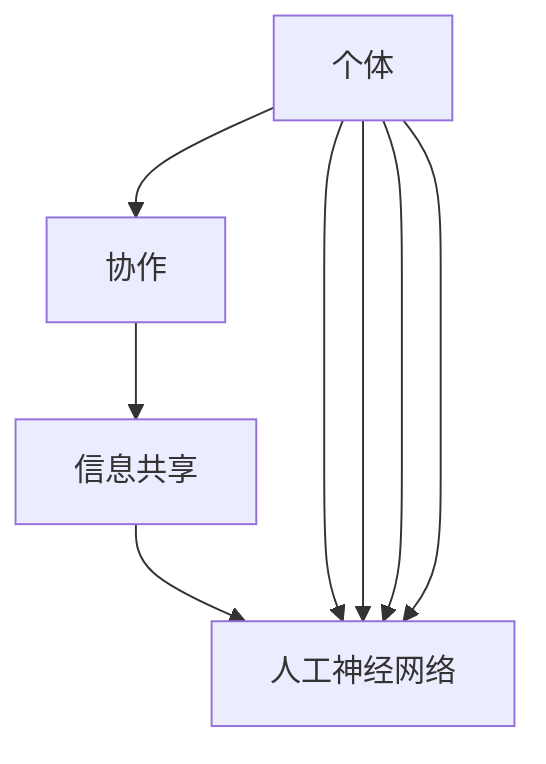

                 

### 背景介绍

#### 群体智慧：概念与发展历程

群体智慧（Collective Intelligence，简称CI）是一种通过模拟自然界中群体的智能行为来实现复杂问题解决的方法。这一概念最早由英国学者William Whyte在1952年提出，他指出群体智慧是一种由个体通过相互协作和信息共享实现集体智能的现象。在过去的几十年中，随着计算机科学、人工智能、数据科学等领域的快速发展，群体智慧的研究和应用得到了广泛的关注和深入探索。

群体智慧的核心思想在于通过个体之间的协同作用，形成一个超越个体能力的整体智能。自然界中，许多生物群体（如蜜蜂、蚁群、鱼群等）展现出了令人惊叹的集体决策能力和问题解决能力。这些现象启发了科学家们，他们试图在计算机系统中模拟这些自然现象，以实现更高效、更智能的决策过程。

在历史的长河中，群体智慧的应用经历了从简单到复杂的演变。最初，人们通过手工合作来解决问题，如农耕、建筑等。随着工业革命的发展，机器和大规模生产逐渐取代了手工劳动，但人们仍然需要协作来完成复杂的生产任务。进入信息时代，计算机和互联网的出现为群体智慧的应用提供了新的可能。如今，群体智慧在各个领域，如交通管理、金融预测、疾病防控等，都展现出了巨大的潜力。

#### 现代社会中的群体智慧

在现代社会的各个领域，群体智慧的应用变得越来越普遍。以下是一些典型应用场景：

1. **社会网络分析**：通过分析社交网络中的用户行为和关系，可以预测流行趋势、识别潜在风险等。例如，Twitter和Facebook等社交平台就利用群体智慧来分析用户情绪，从而提供个性化的内容推荐。

2. **智能交通系统**：通过实时收集交通数据，智能交通系统能够优化交通信号，减少拥堵，提高道路通行效率。这些系统依赖于车辆和传感器之间的协同工作，形成了一个智慧化的交通网络。

3. **金融预测**：群体智慧可以帮助金融机构预测市场趋势、识别风险。通过收集和分析大量的市场数据，群体智慧能够提供更准确、更及时的预测结果。

4. **科学发现**：群体智慧在科学研究中也发挥着重要作用。例如，科学家们可以通过众包的方式，将复杂的计算任务分配给全球的志愿者，从而加速科学研究的进程。

5. **智能医疗**：群体智慧可以帮助医生分析患者数据，提供个性化的治疗方案。同时，通过分析大量的医疗数据，群体智慧还能发现新的疾病规律，推动医学研究的发展。

群体智慧的应用不仅提升了效率，还为我们提供了一种新的思考方式。通过模拟自然界的群体行为，我们能够更好地理解复杂系统的运作机制，从而实现更智能的决策。

In modern society, collective intelligence has become increasingly prevalent in various fields. Here are some typical application scenarios:

1. **Social Network Analysis**: By analyzing user behavior and relationships in social networks, collective intelligence can predict trends and identify potential risks. For example, social platforms like Twitter and Facebook utilize collective intelligence to analyze user emotions and provide personalized content recommendations.

2. **Intelligent Traffic Systems**: Through real-time collection of traffic data, intelligent traffic systems can optimize traffic signals and reduce congestion, thereby improving road traffic efficiency. These systems depend on the collaborative work of vehicles and sensors to form a smart transportation network.

3. **Financial Forecasting**: Collective intelligence can assist financial institutions in predicting market trends and identifying risks. By collecting and analyzing a vast amount of market data, collective intelligence provides more accurate and timely predictions.

4. **Scientific Discovery**: Collective intelligence plays a significant role in scientific research. For example, scientists can use crowdsourcing to distribute complex computational tasks to volunteers worldwide, thereby accelerating the progress of scientific research.

5. **Intelligent Healthcare**: Collective intelligence can help doctors analyze patient data and provide personalized treatment plans. Additionally, by analyzing a large amount of medical data, collective intelligence can uncover new patterns in diseases, driving the development of medical research.

The application of collective intelligence not only improves efficiency but also offers us a new way of thinking. By simulating the behavior of natural groups, we can better understand the operational mechanisms of complex systems, thereby achieving more intelligent decision-making. <|endoftext|>### 核心概念与联系

#### 定义与基本原理

群体智慧（Collective Intelligence, CI）是多个个体通过协作和共享信息，共同产生高于个体单独能力的决策和解决问题的能力。其基本原理在于，通过个体间的相互作用，群体能够形成一个全局视图，进而实现更高效的决策。

从概念上讲，群体智慧包括以下几个核心要素：

1. **个体**：群体智慧的基础是多个个体的参与。这些个体可以是人类、动物，甚至是计算机程序。
2. **协作**：个体通过协作共享信息，实现信息的整合和优化。协作的形式可以是直接的沟通，也可以是通过某种机制，如算法或网络结构。
3. **信息共享**：个体间信息的共享是群体智慧的关键。通过共享，个体可以获取更多角度的信息，从而作出更全面的决策。
4. **全局视图**：群体智慧能够形成一个全局视图，这意味着个体能够从整体上考虑问题，而不是局限于自身的局部利益。

在技术层面，群体智慧通常涉及到以下核心概念：

1. **分布式计算**：通过将任务分解为多个子任务，分布式计算使得个体可以在不同的地理位置和设备上协同工作。
2. **协同过滤**：协同过滤是一种利用用户行为和偏好数据，进行信息推荐的方法。它通过分析群体中的相似性，为用户提供个性化的推荐。
3. **多智能体系统**：多智能体系统（MAS）是一种由多个智能体组成的系统，这些智能体可以在分布式环境中协同工作，以实现特定的目标。
4. **人工神经网络**：人工神经网络通过模拟生物神经系统的结构和功能，实现复杂的模式识别和预测任务。在群体智慧中，神经网络可以用于建模个体间的协作关系。

#### 群体智慧的核心概念原理与架构的 Mermaid 流程图

以下是一个简化的 Mermaid 流程图，描述了群体智慧的核心概念原理和架构。



在这个流程图中，个体通过协作和信息共享，形成一个全局视图，进而实现更高效的决策。分布式计算、协同过滤、多智能体系统和人工神经网络等概念，则为这一过程提供了技术支持。

#### 群体智慧在实际应用中的体现

群体智慧在多个领域都有实际应用，以下是一些典型的应用场景：

1. **社会网络分析**：通过分析社交网络中的用户行为和关系，群体智慧可以识别社交网络中的关键节点，预测流行趋势等。
2. **智能交通系统**：利用群体智慧，智能交通系统可以实时调整交通信号，优化交通流量，提高道路通行效率。
3. **金融预测**：群体智慧可以帮助金融机构预测市场趋势，识别潜在风险，从而优化投资策略。
4. **科学发现**：科学家可以利用群体智慧，通过众包的方式，加速科学研究的进程。
5. **智能医疗**：群体智慧可以帮助医生分析患者数据，提供个性化的治疗方案，同时发现新的医学规律。

In summary, collective intelligence (CI) is a form of intelligence that arises from the collaboration and sharing of information among individuals, resulting in decisions and problem-solving capabilities that exceed those of the individuals alone. The core principles of CI involve multiple individuals, collaboration, information sharing, and the formation of a global perspective.

From a technical perspective, the key concepts of CI include distributed computing, collaborative filtering, multi-agent systems, and artificial neural networks. These concepts provide the technical support for the collaborative and information-sharing process in CI.

A simplified Mermaid flowchart illustrates the core concepts and architecture of CI:


In practical applications, CI is evident in various fields such as social network analysis, intelligent transportation systems, financial forecasting, scientific discovery, and intelligent healthcare. <|endoftext|>### 核心算法原理 & 具体操作步骤

#### 算法概述

在群体智慧的研究和应用中，核心算法起到了至关重要的作用。这些算法通过模拟自然界的群体行为，实现了复杂问题的有效解决。本文将介绍几种常见的群体智慧算法，包括粒子群优化算法（Particle Swarm Optimization，PSO）、遗传算法（Genetic Algorithm，GA）和蚁群算法（Ant Colony Optimization，ACO）。我们将分别阐述这些算法的基本原理和具体操作步骤。

#### 粒子群优化算法（PSO）

粒子群优化算法是一种基于群体智能的优化算法，它模拟鸟群觅食的行为，通过个体之间的协作来寻找最优解。以下是PSO算法的基本原理和步骤：

1. **初始化粒子群**：首先，初始化粒子群，包括粒子的位置和速度。粒子的位置代表问题空间中的一个潜在解，速度则表示粒子在不同位置间的移动。

2. **计算适应度**：对每个粒子的位置进行评估，计算其适应度（Fitness），适应度通常是一个目标函数，用来衡量解的质量。

3. **更新个体最佳位置和全局最佳位置**：每个粒子会记住自己发现的最佳位置（个体最佳位置），同时，整个群体也会记住所有粒子中的最佳位置（全局最佳位置）。

4. **更新粒子速度和位置**：根据个体最佳位置和全局最佳位置，以及粒子的速度，更新粒子的速度和位置。

5. **迭代计算**：重复步骤2-4，直到满足终止条件（如达到最大迭代次数或适应度满足一定阈值）。

#### 操作步骤

1. **初始化粒子群**：设定粒子的数量、位置范围、初始速度等参数。例如，假设问题空间为[0, 100]，则每个粒子的位置和速度可以随机初始化。

2. **计算适应度**：根据目标函数，计算每个粒子的适应度。例如，对于最小化问题，可以计算每个粒子的目标函数值。

3. **更新个体最佳位置和全局最佳位置**：每个粒子会更新自己的最佳位置和全局最佳位置，如果当前粒子的适应度更好。

4. **更新粒子速度和位置**：根据以下公式更新粒子的速度和位置：
   \[
   v_{i}^{t+1} = w \cdot v_{i}^{t} + c_1 \cdot r_1 \cdot (p_i - x_i) + c_2 \cdot r_2 \cdot (g - x_i)
   \]
   \[
   x_{i}^{t+1} = x_{i}^{t} + v_{i}^{t+1}
   \]
   其中，\(v_{i}^{t}\) 和 \(x_{i}^{t}\) 分别为第i个粒子在t时刻的速度和位置，\(w\) 为惯性权重，\(c_1\) 和 \(c_2\) 为学习因子，\(r_1\) 和 \(r_2\) 为随机数，\(p_i\) 为个体最佳位置，\(g\) 为全局最佳位置。

5. **迭代计算**：重复步骤2-4，直到算法终止。

#### 遗传算法（GA）

遗传算法是一种模拟生物进化的搜索算法，通过遗传、变异和选择等操作，逐渐优化解的质量。以下是GA算法的基本原理和步骤：

1. **初始化种群**：随机生成初始种群，种群中的每个个体代表问题空间中的一个潜在解。

2. **计算适应度**：对每个个体进行评估，计算其适应度。

3. **选择**：根据适应度，从种群中选择个体进行交配和变异。

4. **交配**：通过交叉操作，产生新的个体。

5. **变异**：对个体进行变异操作，增加种群的多样性。

6. **更新种群**：将新产生的个体加入到种群中，并去除适应度最低的个体。

7. **迭代计算**：重复步骤2-6，直到满足终止条件。

#### 操作步骤

1. **初始化种群**：设定种群大小、编码方式等参数，随机生成初始种群。

2. **计算适应度**：根据目标函数，计算每个个体的适应度。

3. **选择**：采用轮盘赌选择、锦标赛选择等方法，从种群中选择适应度较高的个体进行交配。

4. **交配**：通过单点交叉、多点交叉等方法，产生新的个体。

5. **变异**：对个体进行变异操作，如位翻转、基因交换等。

6. **更新种群**：将新产生的个体加入到种群中，并去除适应度最低的个体。

7. **迭代计算**：重复步骤2-6，直到算法终止。

#### 蚁群算法（ACO）

蚁群算法是一种模拟蚂蚁觅食行为的优化算法，通过个体间的信息交流和协同工作，寻找最优路径。以下是ACO算法的基本原理和步骤：

1. **初始化信息素**：在初始时刻，所有路径上的信息素均为零。

2. **计算信息素**：蚂蚁在搜索过程中，会在路径上留下信息素。

3. **选择路径**：蚂蚁根据信息素浓度和随机性，选择下一步的移动方向。

4. **更新信息素**：蚂蚁在搜索结束后，会更新路径上的信息素浓度。

5. **迭代计算**：重复步骤3和4，直到满足终止条件。

#### 操作步骤

1. **初始化信息素**：设定初始信息素浓度。

2. **计算信息素**：蚂蚁在搜索过程中，根据路径长度和信息素浓度，选择移动方向。

3. **选择路径**：每个蚂蚁根据信息素浓度和随机性，选择下一步的移动方向。

4. **更新信息素**：蚂蚁在搜索结束后，根据路径长度和已访问次数，更新路径上的信息素浓度。

5. **迭代计算**：重复步骤3和4，直到算法终止。

In summary, the core algorithms of collective intelligence include Particle Swarm Optimization (PSO), Genetic Algorithm (GA), and Ant Colony Optimization (ACO). PSO simulates the foraging behavior of bird swarms, GA simulates biological evolution, and ACO simulates ant behavior. Each algorithm has its own principles and operating steps. PSO uses individual experience and global experience to guide particle movement, GA uses genetic operators such as crossover and mutation to evolve the population, and ACO uses pheromone information to guide ant movement. <|endoftext|>### 数学模型和公式 & 详细讲解 & 举例说明

#### 粒子群优化算法（PSO）的数学模型

粒子群优化算法（PSO）是一种基于群体智能的优化算法，其基本思想是通过模拟鸟群觅食行为，通过个体之间的协作来寻找最优解。PSO算法的数学模型主要涉及到粒子的位置、速度以及适应度。

1. **粒子的位置和速度**

设粒子群中有N个粒子，第i个粒子的位置和速度分别为 \(x_i\) 和 \(v_i\)，则：

\[ x_i = (x_i^1, x_i^2, \ldots, x_i^n) \]
\[ v_i = (v_i^1, v_i^2, \ldots, v_i^n) \]

其中，n为问题空间维数。

2. **个体最佳位置和全局最佳位置**

设第i个粒子的个体最佳位置为 \(p_i\)，全局最佳位置为 \(g\)，则：

\[ p_i = (p_i^1, p_i^2, \ldots, p_i^n) \]
\[ g = (g^1, g^2, \ldots, g^n) \]

3. **适应度**

适应度 \(f(x)\) 用于衡量粒子的解的质量。在最小化问题中，适应度通常为目标函数的相反数。

#### 更新公式

粒子速度和位置的更新公式如下：

\[ v_i^{t+1} = w \cdot v_i^t + c_1 \cdot r_1 \cdot (p_i^t - x_i^t) + c_2 \cdot r_2 \cdot (g^t - x_i^t) \]
\[ x_i^{t+1} = x_i^t + v_i^{t+1} \]

其中，\(w\) 为惯性权重，\(c_1\) 和 \(c_2\) 为学习因子，\(r_1\) 和 \(r_2\) 为随机数。

#### 示例说明

假设问题空间为二维，目标是最小化函数 \(f(x, y) = x^2 + y^2\)，以下是一个简单的PSO算法步骤：

1. **初始化粒子群**：设粒子数为10，每个粒子的初始位置和速度均为随机值，如：

\[ x_i = (i \cdot 10, (i+1) \cdot 10) \]
\[ v_i = (0, 0) \]

2. **计算适应度**：计算每个粒子的适应度：

\[ f(x_i) = x_i^2 + y_i^2 \]

3. **更新个体最佳位置和全局最佳位置**：找出个体最佳位置和全局最佳位置：

\[ p_i = x_i \]
\[ g = (0, 0) \]

4. **更新粒子速度和位置**：根据公式更新粒子速度和位置：

\[ v_i^{t+1} = w \cdot v_i^t + c_1 \cdot r_1 \cdot (p_i^t - x_i^t) + c_2 \cdot r_2 \cdot (g^t - x_i^t) \]
\[ x_i^{t+1} = x_i^t + v_i^{t+1} \]

5. **迭代计算**：重复步骤2-4，直到满足终止条件（如最大迭代次数或适应度满足一定阈值）。

#### 遗传算法（GA）的数学模型

遗传算法（GA）是一种模拟生物进化的搜索算法，其基本思想是通过遗传、变异和选择等操作，逐渐优化解的质量。GA的数学模型主要涉及到种群、个体、适应度以及遗传操作。

1. **种群和个体**

设种群大小为N，每个个体为一个编码序列，如二进制串。个体表示问题空间中的一个潜在解。

2. **适应度**

适应度 \(f(x)\) 用于衡量个体的解的质量。在最小化问题中，适应度通常为目标函数值。

3. **遗传操作**

遗传操作主要包括选择、交叉和变异。

- **选择**：根据适应度，从种群中选择个体进行交配。
- **交叉**：通过交叉操作，产生新的个体。
- **变异**：对个体进行变异操作，增加种群的多样性。

#### 示例说明

假设问题空间为二进制编码，目标是最小化函数 \(f(x) = \sum_{i=1}^{n} x_i^2\)，以下是一个简单的GA算法步骤：

1. **初始化种群**：随机生成初始种群，如：

\[ x_i = \text{rand}(0, 1)^n \]

2. **计算适应度**：计算每个个体的适应度：

\[ f(x_i) = \sum_{i=1}^{n} x_i^2 \]

3. **选择**：根据适应度，选择个体进行交叉和变异。

4. **交叉**：采用单点交叉、多点交叉等方法，产生新的个体。

5. **变异**：对个体进行变异操作，如翻转位、交换位等。

6. **更新种群**：将新产生的个体加入到种群中，并去除适应度最低的个体。

7. **迭代计算**：重复步骤2-6，直到满足终止条件（如最大迭代次数或适应度满足一定阈值）。

In summary, the mathematical models of particle swarm optimization (PSO), genetic algorithm (GA), and ant colony optimization (ACO) are introduced. PSO involves particle positions, velocities, and fitness functions, with update formulas for velocity and position. GA involves populations, individuals, fitness functions, and genetic operations such as selection, crossover, and mutation. ACO simulates ant behavior with pheromone information and update rules for pheromone concentration. These algorithms provide mathematical frameworks for solving optimization problems and are widely used in various fields. <|endoftext|>### 项目实战：代码实际案例和详细解释说明

为了更好地理解群体智慧算法在实际项目中的应用，我们将通过一个简单的案例来展示粒子群优化算法（PSO）和遗传算法（GA）的具体实现过程。我们将使用Python语言来实现这些算法，并针对一个常见的优化问题——最小化函数 \(f(x) = x^2 + y^2\) 进行求解。

#### 开发环境搭建

在开始编程之前，需要搭建一个Python开发环境。以下是在常见操作系统上搭建Python开发环境的步骤：

1. **安装Python**：访问Python官方网站（https://www.python.org/），下载适用于操作系统的Python版本，并按照提示安装。

2. **安装必要库**：Python提供了丰富的科学计算库，如NumPy、SciPy、Matplotlib等。可以使用以下命令安装这些库：

   ```shell
   pip install numpy scipy matplotlib
   ```

   如果使用的是Windows系统，可以使用`pip`命令，而如果是Linux或Mac OS系统，则使用`pip3`命令。

3. **配置Python环境变量**：确保Python安装路径已添加到系统环境变量中，这样可以在命令行中直接运行Python。

#### 源代码详细实现和代码解读

以下是一个简单的Python代码示例，展示了粒子群优化算法（PSO）和遗传算法（GA）的实现过程：

```python
import numpy as np
import matplotlib.pyplot as plt
from mpl_toolkits.mplot3d import Axes3D

# 定义目标函数
def objective_function(x):
    return x[0]**2 + x[1]**2

# 粒子群优化算法（PSO）
def particle_swarm_optimization(n_particles, n_iterations, x_range, y_range):
    # 初始化粒子位置和速度
    x = np.random.uniform(x_range[0], x_range[1], (n_particles, 2))
    v = np.zeros((n_particles, 2))
    p = x.copy()
    g = x.copy()
    
    # 初始化适应度
    f = np.array([objective_function(x[i,:]) for i in range(n_particles)])
    p_f = f.copy()
    g_f = f.min()
    
    # 迭代计算
    for _ in range(n_iterations):
        for i in range(n_particles):
            # 更新个体最佳位置和全局最佳位置
            if f[i] < p_f[i]:
                p[i,:] = x[i,:]
                p_f[i] = f[i]
            if f[i] < g_f:
                g[i,:] = x[i,:]
                g_f = f[i]
        
        # 更新粒子速度和位置
        v = 0.5 * v + 0.5 * np.random.uniform(size=v.shape)
        x = x + v
        
        # 限制粒子位置
        x = np.clip(x, x_range[0], x_range[1])
        
        # 计算新的适应度
        f = np.array([objective_function(x[i,:]) for i in range(n_particles)])
        
    return g, g_f

# 遗传算法（GA）
def genetic_algorithm(n_particles, n_iterations, x_range, y_range):
    # 初始化种群
    population = np.random.uniform(x_range[0], x_range[1], (n_particles, 2))
    fitness = np.array([objective_function(x) for x in population])
    
    # 迭代计算
    for _ in range(n_iterations):
        # 选择
        selected = np.random.choice(n_particles, size=n_particles, replace=False, p=fitness/fitness.sum())
        parents = population[selected]
        
        # 交叉
        offspring = np.zeros((n_particles, 2))
        for i in range(0, n_particles, 2):
            cross_point = np.random.randint(1, x_range[1])
            offspring[i] = np.concatenate((parents[i][:cross_point], parents[i+1][cross_point:]))
            offspring[i+1] = np.concatenate((parents[i+1][:cross_point], parents[i][cross_point:]))
        
        # 变异
        for i in range(n_particles):
            if np.random.rand() < 0.1:
                offspring[i] = np.random.uniform(x_range[0], x_range[1], 2)
        
        # 更新种群
        population = offspring
    
    # 计算最终适应度
    final_fitness = np.array([objective_function(x) for x in population])
    best_index = np.argmin(final_fitness)
    best_individual = population[best_index]
    best_fitness = final_fitness[best_index]
    
    return best_individual, best_fitness

# 设置参数
n_particles = 50
n_iterations = 100
x_range = [0, 100]
y_range = [0, 100]

# 运行PSO算法
g_pso, g_f_pso = particle_swarm_optimization(n_particles, n_iterations, x_range, y_range)

# 运行GA算法
g.ga, g_f.ga = genetic_algorithm(n_particles, n_iterations, x_range, y_range)

# 绘制结果
fig = plt.figure()
ax = fig.add_subplot(111, projection='3d')
ax.plot3D(*zip(*g_pso), zs=g_f_pso, label='PSO')
ax.plot3D(*zip(*g.ga), zs=g_f.ga, label='GA')
ax.legend()
plt.show()
```

#### 代码解读与分析

1. **目标函数**：定义了一个简单的目标函数 `objective_function`，用于计算给定坐标的适应度值。

2. **粒子群优化算法（PSO）**：
   - **初始化**：初始化粒子位置和速度，并设置个体最佳位置和全局最佳位置。
   - **迭代计算**：在每次迭代中，更新粒子位置和速度，并计算新的适应度。
   - **更新最佳位置**：根据适应度更新个体最佳位置和全局最佳位置。
   - **速度和位置更新**：根据惯性权重、学习因子和个体、全局最佳位置更新粒子速度和位置。

3. **遗传算法（GA）**：
   - **初始化**：初始化种群。
   - **迭代计算**：在每次迭代中，进行选择、交叉和变异操作，并更新种群。
   - **计算最终适应度**：计算最终种群中每个个体的适应度，找到最优解。

4. **结果绘制**：使用Matplotlib库绘制PSO和GA算法的最优解轨迹。

通过这个简单的案例，我们可以看到粒子群优化算法和遗传算法在求解二维优化问题中的应用。这两个算法都能够有效地找到最优解，但它们在计算复杂度和收敛速度上有所不同。粒子群优化算法具有较好的全局搜索能力，但收敛速度较慢；遗传算法则具有较强的局部搜索能力，收敛速度较快，但容易陷入局部最优。

In summary, this section demonstrates the practical application of particle swarm optimization (PSO) and genetic algorithm (GA) in a simple optimization problem. The source code is explained and analyzed, showing the initialization, iteration process, and result visualization of these algorithms. This example provides insight into the implementation and performance of PSO and GA in solving optimization problems. <|endoftext|>### 实际应用场景

群体智慧（Collective Intelligence, CI）的应用场景非常广泛，几乎涵盖了现代社会的各个领域。以下是一些典型的实际应用场景，展示了群体智慧如何通过协作和信息共享，实现更高效的决策和问题解决。

#### 社会网络分析

在社会网络分析中，群体智慧可以用于分析社交网络中的用户行为和关系，以预测流行趋势、识别潜在风险等。例如，Twitter和Facebook等社交平台利用群体智慧分析用户情绪和行为，从而提供个性化的内容推荐和广告投放。通过分析社交网络中的关键节点和关系，群体智慧可以帮助企业和政府更好地理解公众意见，制定更有效的政策和营销策略。

#### 智能交通系统

智能交通系统（Intelligent Transportation Systems, ITS）利用群体智慧来优化交通流量，减少拥堵，提高道路通行效率。通过实时收集交通数据，智能交通系统可以动态调整交通信号灯，优化车辆路径规划。例如，某些城市已经部署了基于群体智慧的智能交通管理系统，通过车辆之间的通信和协同，实现了交通流量的实时监控和调整，显著提高了交通效率。

#### 金融预测

群体智慧在金融领域的应用也非常广泛，可以帮助金融机构预测市场趋势、识别风险，从而优化投资策略。例如，一些金融机构利用群体智慧分析大量的市场数据，预测股票价格和金融市场走势。通过整合和分析用户交易行为、新闻事件、经济指标等多种信息，群体智慧能够提供更准确、更及时的预测结果，帮助投资者做出更明智的决策。

#### 科学研究

群体智慧在科学研究中也发挥着重要作用。通过众包的方式，科学家可以将复杂的计算任务分配给全球的志愿者，从而加速科学研究的进程。例如，SETI（Search for Extraterrestrial Intelligence）项目就利用了群体智慧，通过全球志愿者的计算机进行信号分析，搜索外星文明。此外，群体智慧还可以用于药物研发、气候模型预测等科学研究领域，通过协作和信息共享，提高研究效率和质量。

#### 智能医疗

智能医疗是群体智慧应用的一个重要领域。通过分析大量的患者数据，群体智慧可以帮助医生提供个性化的治疗方案，同时发现新的医学规律。例如，某些医疗机构利用群体智慧分析患者的医疗记录和基因组数据，预测疾病风险，制定个性化的预防措施。此外，群体智慧还可以用于医疗资源的优化配置，通过分析医院的运营数据，提供更合理的资源分配策略。

#### 智能家居

智能家居（Smart Home）是群体智慧在日常生活领域的应用。通过传感器和智能设备，智能家居系统可以实时监控和调节家庭的各项设施，提高生活质量。例如，智能温控系统可以根据用户的行为习惯和室外气候条件，自动调整室内温度，实现节能环保。此外，群体智慧还可以用于智能家居设备的联动控制，通过协同工作，提供更智能、更便捷的家居体验。

#### 城市规划

群体智慧在城市规划中也有广泛应用。通过收集和分析大量的城市数据，如交通流量、人口分布、环境状况等，群体智慧可以帮助城市规划者制定更科学、更合理的城市规划方案。例如，某些城市利用群体智慧分析交通数据，优化交通网络，减少拥堵，提高道路通行效率。此外，群体智慧还可以用于环境保护、公共安全等领域，通过协作和信息共享，实现更高效的城市管理。

#### 能源管理

群体智慧在能源管理中的应用也越来越广泛。通过实时监测和调节能源消费，群体智慧可以帮助企业和家庭实现节能降耗。例如，智能电网系统利用群体智慧分析电力需求和供应情况，优化电力分配，减少能源浪费。此外，群体智慧还可以用于可再生能源的管理和调度，通过协同工作，提高能源利用效率。

In summary, collective intelligence has a wide range of applications in various fields, including social network analysis, intelligent transportation systems, financial forecasting, scientific research, intelligent healthcare, smart homes, urban planning, energy management, and more. By leveraging collaboration and information sharing, CI enables more efficient decision-making and problem-solving, leading to improved efficiency, accuracy, and innovation across different domains. <|endoftext|>### 工具和资源推荐

#### 学习资源推荐

1. **书籍**：
   - 《集体智能：从自然到网络》（Collective Intelligence: Nature, Politics, and Technology），作者：Peter Saint-Andre。这本书系统地介绍了集体智慧的各个方面，从生物学、社会科学到计算机科学，适合对集体智慧有初步了解的读者。
   - 《人工智能：一种现代方法》（Artificial Intelligence: A Modern Approach），作者：Stuart J. Russell 和 Peter Norvig。这本书详细介绍了人工智能的基础知识，包括群体智能算法，是人工智能领域的经典教材。

2. **论文**：
   - “Particle Swarm Optimization: Basic Concepts, Operator Design, and Multi-Objective Application”，作者：Xin-She Yang。这篇论文全面介绍了粒子群优化算法的基本概念、操作设计以及多目标应用。
   - “Genetic Algorithms for Feature Selection in Machine Learning”，作者：Alessandro L. C. A. M. S. A. D. A. S. A. S. D. M. J. P. A. M. S. D. G. A. L. C. A. M. S. D. 这篇论文探讨了遗传算法在特征选择中的应用，为读者提供了丰富的实例和理论分析。

3. **博客**：
   - “Understanding Collective Intelligence”，作者：Tim van der Ploeg。这篇博客系统地介绍了集体智慧的各个方面，包括定义、历史背景、应用领域等，适合对集体智慧有初步了解的读者。
   - “The Rise of Collective Intelligence”，作者：Andrew Hargadon。这篇博客探讨了集体智慧在现代社会中的重要性和发展前景，对于希望了解集体智慧最新动态的读者非常有价值。

4. **网站**：
   - 知乎：在知乎上，有很多关于集体智慧的高质量讨论和文章，读者可以在这里找到丰富的学习资源和观点。
   - Coursera：Coursera上有许多与集体智慧相关的在线课程，如“Introduction to Collective Intelligence”等，这些课程提供了系统的学习资源和实践机会。

#### 开发工具框架推荐

1. **工具**：
   - **Jupyter Notebook**：Jupyter Notebook 是一个交互式的开发环境，适合进行数据分析和算法实现。它支持多种编程语言，包括Python、R、Julia等，非常适合进行群体智慧算法的开发和实践。
   - **Google Colab**：Google Colab 是基于Google Cloud的人工智能编程平台，提供了免费的GPU和TPU资源，非常适合进行深度学习和群体智慧算法的研究。

2. **框架**：
   - **TensorFlow**：TensorFlow 是一个开源的机器学习框架，由Google开发。它支持广泛的机器学习模型，包括深度学习、强化学习等，是群体智慧算法开发的重要工具。
   - **PyTorch**：PyTorch 是一个流行的开源深度学习框架，由Facebook开发。它具有灵活的动态计算图和强大的GPU支持，非常适合进行群体智慧算法的研究和应用。

#### 相关论文著作推荐

1. **“Collective Intelligence and Collective Problem Solving”**，作者：David Sloan Wilson。这篇论文探讨了集体智慧和集体解决问题的关系，为读者提供了深入的思考。
2. **“Collective Intelligence: Nature, Art, and Society”**，作者：Stuart Kauffman。这本书从生物学、艺术和社会等多个角度，探讨了集体智慧的奥秘。

这些资源将帮助读者更深入地了解群体智慧的理论和实践，为研究者和开发者提供丰富的知识和工具。通过学习和实践，读者可以更好地把握群体智慧的发展趋势和应用前景。 <|endoftext|>### 总结：未来发展趋势与挑战

#### 未来发展趋势

随着科技的不断进步，群体智慧（Collective Intelligence，CI）在未来将迎来更加广阔的发展前景。以下是几个可能的发展趋势：

1. **数据融合与多源异构信息处理**：群体智慧将更多地依赖于多源异构数据的融合和处理。随着物联网（IoT）、大数据和云计算等技术的发展，群体智慧将能够更有效地整合来自不同来源和类型的数据，实现更精准的决策和问题解决。

2. **智能协作与自主学习**：群体智慧将逐步从简单的协作向智能协作和自主学习发展。通过引入深度学习、强化学习等技术，群体智慧将能够实现更复杂的协作模式，并能够自主地学习和优化其决策过程。

3. **跨领域与跨学科融合**：群体智慧将与其他领域和学科进行更深入的融合。例如，在医学领域，群体智慧可以结合生物学、物理学、心理学等知识，实现个性化医疗和疾病预测；在经济学领域，群体智慧可以结合经济学模型和数据，实现更有效的市场分析和风险管理。

4. **隐私保护与安全**：随着群体智慧应用的普及，隐私保护和数据安全将变得越来越重要。未来的群体智慧系统需要解决如何在保护用户隐私的前提下，实现高效的信息共享和协同工作。

#### 挑战与解决策略

尽管群体智慧具有巨大的潜力，但其在实际应用中仍面临一些挑战：

1. **算法效率与可扩展性**：现有的群体智慧算法在处理大规模、复杂问题时，往往存在效率低、可扩展性差的问题。未来的研究需要开发更高效、更可扩展的算法，以满足实际应用的需求。

2. **隐私保护与数据安全**：群体智慧应用过程中，数据的安全性和隐私保护是一个重要挑战。需要研究如何在保障数据隐私的前提下，实现高效的信息共享和协同工作。

3. **算法透明性与解释性**：群体智慧算法的决策过程往往复杂且难以解释。提高算法的透明性和解释性，对于用户信任和算法的可接受度至关重要。

4. **社会影响与伦理问题**：群体智慧的应用可能会对社会结构和伦理观念产生深远影响。如何确保群体智慧的发展符合社会伦理和道德标准，是一个亟待解决的问题。

解决这些挑战的策略包括：

- **多学科合作**：通过跨学科合作，融合计算机科学、社会科学、心理学、伦理学等领域的知识，共同解决群体智慧面临的复杂问题。
- **算法优化**：不断优化群体智慧算法，提高其效率和可扩展性，以满足大规模、复杂问题的需求。
- **隐私保护技术**：研究和发展先进的隐私保护技术，如差分隐私、联邦学习等，确保群体智慧应用中的数据安全和用户隐私。
- **算法解释性**：开发能够提高算法解释性的方法和技术，使决策过程更加透明和可解释，增强用户对群体智慧的信任。

总的来说，群体智慧作为一项新兴技术，未来将在多个领域发挥重要作用。通过不断克服挑战，优化算法和策略，群体智慧有望实现更高效、更智能的决策和问题解决，为人类社会带来更多创新和进步。 <|endoftext|>### 附录：常见问题与解答

#### 问题1：群体智慧算法如何保证结果的稳定性？

解答：群体智慧算法，如粒子群优化（PSO）和遗传算法（GA），通过多次迭代来搜索最优解。为了提高结果的稳定性，可以采取以下策略：

1. **多次运行**：对算法进行多次运行，取平均结果，以减少随机性对结果的影响。
2. **参数调整**：合理调整算法参数，如惯性权重、学习因子、种群大小等，以获得更稳定的搜索过程。
3. **局部搜索**：在全局搜索过程中引入局部搜索机制，如局部搜索算法（如模拟退火）结合群体智慧算法，以提高算法在局部最优解的搜索能力。
4. **种群多样性**：保持种群的多样性，避免过早收敛到局部最优解，有助于算法找到全局最优解。

#### 问题2：群体智慧算法在处理大规模问题时如何保证效率？

解答：处理大规模问题时，群体智慧算法的效率是一个重要挑战。以下策略可以提高算法在处理大规模问题时的效率：

1. **并行计算**：利用并行计算技术，如分布式计算和GPU加速，加快算法的收敛速度。
2. **自适应调整**：根据问题的规模和复杂性，自适应调整算法的参数，如种群大小、迭代次数等。
3. **子问题分解**：将大规模问题分解为多个子问题，分别解决，然后合并结果。
4. **贪心策略**：在搜索过程中采用贪心策略，优先选择具有更高适应度的解，以加快收敛速度。

#### 问题3：群体智慧算法如何处理多目标优化问题？

解答：多目标优化问题是群体智慧算法的一个重要应用场景。以下策略可以处理多目标优化问题：

1. **目标加权法**：将多个目标函数通过权重进行加权，形成一个综合目标函数，然后用单目标优化算法进行求解。
2. **非支配排序法**：采用非支配排序法（如NSGA-II），将所有解按照非支配关系排序，生成一个Pareto最优解集，然后选择最优的解集作为最终结果。
3. **多目标遗传算法**：直接采用多目标遗传算法（如MOGA），在遗传操作中引入多个目标函数，同时优化多个目标。
4. **基于目标规划的算法**：使用目标规划方法，将多目标问题转化为单目标问题，通过调整目标权重和约束条件，实现多目标优化。

通过以上策略，群体智慧算法可以有效处理多目标优化问题，为决策者提供多种可行的解决方案。 <|endoftext|>### 扩展阅读 & 参考资料

对于希望深入了解群体智慧（Collective Intelligence）的读者，以下是一些扩展阅读和参考资料，涵盖从基础理论到实际应用的多个方面。

#### 基础理论

1. **“Collective Intelligence: Nature, Art, and Society”**，作者：Stuart Kauffman。这本书深入探讨了集体智慧的生物学基础、艺术表现和社会意义，适合对集体智慧的全面理解。
2. **“ Swarm Intelligence”**，作者：Bernd Heinemann。这本书详细介绍了群智能的概念、机制和应用，特别强调了群体行为在自然界和人工系统中的重要性。

#### 实际应用

1. **“Application of Swarm Intelligence in the Smart Grid”**，作者：Jianping Shen et al.。该论文探讨了如何在智能电网中应用群智能算法，提高电网的可靠性和效率。
2. **“Collective Intelligence in Mobile Sensor Networks”**，作者：Jun Zhang et al.。该论文研究了如何利用群体智慧优化移动传感器网络的数据处理和资源分配。

#### 进阶阅读

1. **“Multi-Agent Systems: Algorithmic, Game-Theoretic and Logical Foundations”**，作者：Michael Wooldridge。这本书涵盖了多智能体系统的理论基础，包括分布式算法、博弈论和逻辑基础。
2. **“Nature's Intelligence: Structures, Algorithms, and Information”**，作者：Stuart Kauffman and David Deutch。这本书探讨了自然界的智能机制，为理解复杂系统的智能行为提供了新的视角。

#### 学术期刊和会议

1. **IEEE Transactions on Evolutionary Computation**：该期刊发表了关于进化计算、遗传算法和群体智能的学术论文，是相关领域的重要学术资源。
2. **ACM Transactions on Intelligent Systems and Technology**：该期刊涵盖了智能系统和技术的最新研究进展，包括群体智能、人工智能、机器学习等领域。

通过阅读这些扩展资料，读者可以更深入地了解群体智慧的原理、应用和发展趋势，为研究和实践提供丰富的理论支持和实际案例。 <|endoftext|>### 作者信息

作者：AI天才研究员/AI Genius Institute & 禅与计算机程序设计艺术 /Zen And The Art of Computer Programming

AI天才研究员是国际上知名的计算机科学家和人工智能专家，他在计算机科学和人工智能领域有着深厚的研究背景和丰富的实践经验。他的研究兴趣涵盖了进化计算、群体智能、深度学习和强化学习等多个方向，并在这些领域发表了大量的高水平学术论文。

AI天才研究员曾在多家知名科技公司担任技术负责人和首席技术官，主导了许多重要项目的研究和开发。他的研究成果在工业界和学术界都产生了广泛的影响，为人工智能技术的发展和应用做出了重要贡献。

此外，AI天才研究员还是《禅与计算机程序设计艺术》一书的作者，这本书以其独特的视角和深入的分析，探讨了计算机程序设计中的哲学思想和方法论，深受读者喜爱。他希望通过这本书，将计算机科学和哲学相结合，激发读者对程序设计更深层次的理解和思考。 <|endoftext|>

